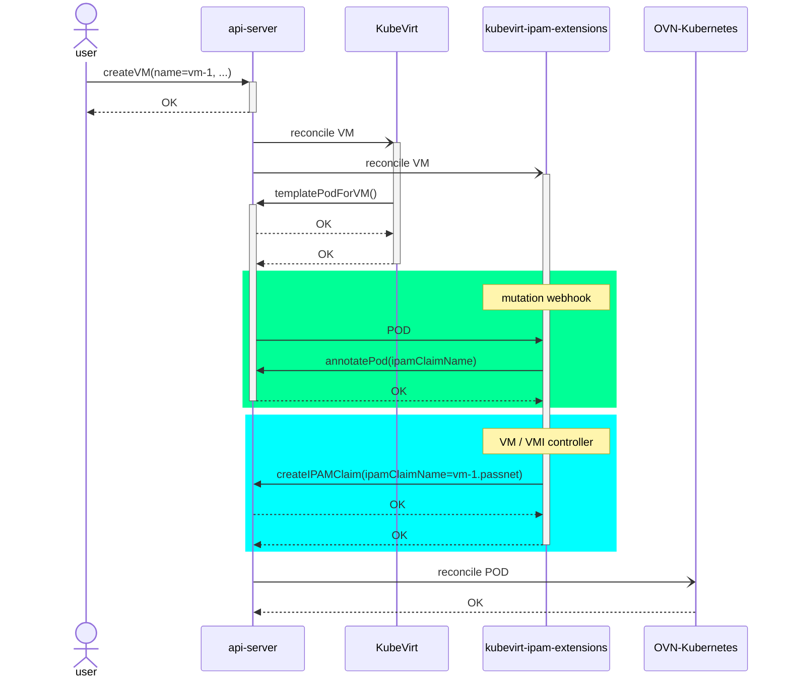

# Primary User Defined Networks for Virtualization workloads

## Summary

Traditional virtualization users have some expectations on what a
virtualization platform should provide. Live-migration, and IP address
persistence across reboots are paramount features for any virtualization
solution, and OpenShift Virtualization does not currently support any of them
over the OpenShift default cluster network, for a variety of reasons. The scope
of this enhancement is to define how to use the existent
[primary UDN feature](https://github.com/openshift/enhancements/pull/1623/) to
enable virtualization workloads to migrate over the primary network, and to
persist the IP address across reboots or virtual machine shutdowns.

## Motivation

OpenShift virtualization users usually rely on secondary networks to
interconnect their workloads; still, that is sometimes not enough: the user
might want to use the "batteries" included with the default network (DNS, for
instance), and secondary networks are simply not a possibility in cloud
environments for use cases requiring cluster egress. For these scenarios,
relying on the VM primary network (e.g. the cluster default network) is
required.

Traditional virtualization users are used to having layer2 networks, and to
having their tenant networks isolated from other tenants. This is something
that opposes the Kubernetes networking model, in which all pods can reach other
pods, and security is provided by implementing Network Policy.

To streamline the migration experience of users coming from these traditional
virtualization platforms into OpenShift Virtualization we need to match the
user's expectations in terms of feature set, and user experience. Thus, we need
to provide them with isolated primary networks, that meet the live-migration
and IP persistence requirements.

Other type of users just want to have a more managed experience - they do not
want to have to manage their networks, e.g. deploying DHCP servers, DNS, and
so forth. They are hoping to have a streamlined experience, where they define
a (set of) subnets for their layer2 network, and the SDN itself is responsible
for assigning migratable IP addresses to the virt workloads, configure access
to outside the cluster, and, when configured by the user, be able to access an
application they are interested in exposing from the outside world.

### User Stories

- As a VM owner (which runs applications inside it), I want to have east/west
communication without NAT to other VMs and/or pods within the same network.
- As a developer who defined a custom primary network in their project, I want
to use the primary network to which the VM is connected for north/south, while
still being able to connect to KAPI and consume Kubernetes DNS.
- As a VM owner, I want the VM to have the same IP address before/after live
migrating.
- As a VM owner, I want the VM to have the same IP address before/after restart
or shutdown.
- As a VM owner, I want to be able to specify the IP address for the interface
of my VM.
- As an owner of a VM that is connected only to the primary network, I want to 
fetch resources from outside networks (internet).
- As a VM owner migrating my VMs to OCP+V, I do not want to change my
application to support multiple NICs.
- As a VM owner, I want to expose my selected applications over the network to
users outside the cluster.
- As an admin, I'm limited by public cloud networking restrictions and I rely
on their LoadBalancer to route traffic to my applications.

### Goals

- The IP addresses on the VM must be the same before / after live-migration and
VM restart / shutdown
- Live-migration without breaking the established TCP connections
- Provide a configurable way for the user to define the IP addresses on a VM's
interface.
- Native IPv6 integration
- Integration with service meshes, and OpenShift observability solutions

### Non-Goals

TODO

## Proposal

To compartmentalize the solution, the proposal will be split in three different
topics:
- [Extending networking from the pod interface to the VM](#extending-networking-from-the-pod-interface-to-the-VM)
- [Persisting VM IP addresses during the migration](#persisting-vm-ip-addresses-during-the-migration)
- [Allow user to configure the VM's interface desired IP address](#allow-user-to-configure-the-vms-interface-desired-ip-address)

Before that, let's ensure the proper context is in place.

### Basic UDN context

As indicated in the
[user defined network segmentation proposal](https://github.com/openshift/enhancements/blob/master/enhancements/network/user-defined-network-segmentation.md#proposal),
the pods featuring a primary user defined network will feature two interfaces:
- an attachment to the cluster default network
- an attachment to the primary user defined network

Later on, in the
[services section](https://github.com/openshift/enhancements/blob/master/enhancements/network/user-defined-network-segmentation.md#services-1),
it is explained that all traffic will be send over the primary UDN interface.

### Basic virtualization context

In KubeVirt / OpenShift Virtualization, the VM runs inside a pod (named
virt-launcher). Thus, given OVN-Kubernetes configures the pod interfaces (and
is responsible for configuring networking up to the pod interface), we still
need to extend connectivity from the pod interface into the VM.

During live-migration - once it is is scheduled - and the destination
node is chosen, a new pod is scheduled in the target node (let's call this pod
the *destination* pod). Once this pod is ready, the *source* pod transfers the
state of the live VM to the *destination* pod via a connection proxied by the
virt-handlers (the KubeVirt agents running on each node) to the *destination*
pod.

### Extending networking from the pod interface to the VM

KubeVirt uses a concept called bind mechanisms to extend networking from the
pod interface to the VM.

The requirements and challenges we currently face for choosing a binding
mechanism that fulfills our objectives are presented and discussed in more
detail in the following
[KubeVirt document](https://docs.google.com/document/d/1JofGe_anOrb2SWBoGskSrl7bvIQ8D0TYeZa9FzDGI3g).

### Persisting VM IP addresses during the migration

OpenShift already features the ability of providing persistent IP addresses
for layer2 **secondary** user defined networks. It relies on the
[IPAMClaim CRD](https://github.com/k8snetworkplumbingwg/ipamclaims/blob/48c5a915da3b67f464a4e52fa50dbb3ef3547dcd/pkg/crd/ipamclaims/v1alpha1/types.go#L23)
to "tie" the allocation of the IP address to the VM.
In short, OpenShift Virtualization creates an `IPAMClaim` resource for each
interface in the VM the user wants to be persistent, and then instructs
the CNI plugin of which claim to use to persist the IP for the VM using an
attribute defined in the k8snetworkplumbingwg network-selection-elements (the
`k8s.v1.cni.cncf.io/networks` annotation). This protocol is described in depth
in
[the persistent IPs for virt workloads enhancement](https://github.com/openshift/enhancements/blob/master/enhancements/network/persistent-ips-sdn-secondary-networks.md#creating-a-virtual-machine).

We want to re-use this mechanism to implement persistent IPs for UDN networks;
meaning OpenShift Virtualization will create the `IPAMClaim` and will instruct
OVN-Kubernetes of which claim to use. Since for primary UDNs we do **not**
define the network-selection-elements, we need to use a new annotation to pass
this information along.

The proposed annotation value is `k8s.ovn.org/primary-udn-ipamclaim`.

These persistent IPs will be cleaned up by the Kubernetes garbage collector
once the VM to which they belong is removed.

All the other
[work required in OVN-Kubernetes](https://github.com/trozet/enhancements/blob/941f5c6391830d5e4a94e65d742acbcaf9b8eda9/enhancements/network/user-defined-network-segmentation.md#pod-egress)
to support live-migration was already implemented as part of the epic
implementing UDN.

We evaluate an alternative for this in the
[Using multus default network annotation](#using-multus-default-network-annotation)
section.

### Allow user to configure the VMs interface desired IP address

To allow the user to specify the IP address for the workload we plan on adding
an attribute to the KubeVirt API
[interface](https://kubevirt.io/api-reference/main/definitions.html#_v1_interface)
named `ipAddress`. This approach suits the product, and meets the user's
expectations because the user can configure the MAC address for an interface in
that same `Interface` resource.

Regarding the implementation, OpenShift Virtualization would extend what it
does for the MAC address: define it in the k8snetworkplumbingwg de-facto
standard as an IP request, and the OVN-Kubernetes CNI would attempt to honor
it.

This is by far the simplest solution to implement; another alternative is
described in the [alternatives section](#vm-interface-ip-address-configuration).
This other alternative has the advantage of not requiring a KubeVirt API update
but adds a lot more work in OVN-Kubernetes, and requires updating the de-facto
standard.

### Workflow Description

#### Pre-requirements - configure the primary UDN for a namespace
The user will need to perform the usual steps to configure a primary UDN for
their namespace - that is, to provision a `UserDefinedNetwork` of layer2
topology. While the user could use a `network-attachment-definition` CRD for
this step, we are assuming (and recommending) the usage of the
`UserDefinedNetwork` CRD - because we like statically typed things. You should
too. You can find an example below with the minimal required data.

```yaml
apiVersion: k8s.ovn.org/v1
kind: UserDefinedNetwork
metadata:
  name: safe-ground
  namespace: tenantblue
spec:
  topology: Layer2
  layer2:
    role: Primary
    subnets:
    - 192.168.0.0/16
    ipamLifecycle: Persistent
```

Keep in mind that the *user* mentioned above would **need** be an admin in case
of a cluster-wide network - i.e. a network spanning multiple namespaces.

#### Provisioning a VM object
The user (VM owner) would then provision a VM in the cluster. You can find
below an example of a VM:
```yaml
apiVersion: kubevirt.io/v1
kind: VirtualMachine
metadata:
  name: vm-a
  namespace: tenantblue
spec:
  running: true
  template:
    spec:
      domain:
        devices:
          disks:
          - disk:
              bus: virtio
            name: containerdisk
          - disk:
              bus: virtio
            name: cloudinitdisk
          interfaces:
          - name: passtnet
            binding:
              name: passt
          rng: {}
        resources:
          requests:
            memory: 2048M
      networks:
      - name: passtnet
        pod: {}
      terminationGracePeriodSeconds: 0
      volumes:
      - containerDisk:
          image: quay.io/kubevirt/fedora-with-test-tooling-container-disk:v1.3.1
        name: containerdisk
      - cloudInitNoCloud:
          networkData: |
            version: 2
            ethernets:
              eth0:
                dhcp4: true
        name: cloudinitdisk
```

Provisioning the VM in the system will be "watched" by two components; KubeVirt
`virt-controller` and KubeVirt `ipam-extensions`. These components will then:
- virt-controller: template the pod where the VM `vm-a` will run
- ipam-extensions: if the `vm-a` VM has a request for the `Pod` network, this
component will look for a primary UDN for that namespace; if one is found, and
it allows for persistent IP addresses, the `ipam-extensions` will create an
- `IPAMClaim` for it, whose name is `<vm name>.<logical network name>`.

The last thing we need to do, is to instruct to OVN-Kubernetes which
`IPAMClaim` to use for its primary UDN interface; we rely on a mutating webhook
for that which add an annotation to the KubeVirt VM pod indicating the name of
the `IPAMClaim`. This process is explained in detail in
[Persisting VM IP addresses during the migration](#persisting-vm-ip-addresses-during-the-migration).

This process is pictured in the sequence diagram below.



### API Extensions

We will need to extend the `IPAMClaim` CRD to support three new things:
- allow the user to specify which IP addresses they want to use for their UDNs
- allow OVN-Kubernetes to report back success / errors on the `IPAMClaim`
- optional: allow OVN-Kubernetes to report which pod is currently holding the
claim

The first two items are required, and the latter is an improvement, intended to
make the solution more transparent / secure. This way, OVN-Kubernetes would
reject reconciling a claim currently held by another pod (unless this pod
belongs to the same VM - i.e. migration use case). We will check the owner
reference of the `IPAMClaim` versus the owner reference of the pod to assure
this scenario (thus ensuring OVN-Kubernetes doesn't need to understand what a
VM is to do so).

The proposed updated CRD would look like:
```go
// IPAMClaim is the Schema for the IPAMClaim API
type IPAMClaim struct {
	metav1.TypeMeta   `json:",inline"`
	metav1.ObjectMeta `json:"metadata,omitempty"`

	Spec   IPAMClaimSpec   `json:"spec,omitempty"`
	Status IPAMClaimStatus `json:"status,omitempty"`
}

type IPAMClaimSpec struct {
	// The network name for which this persistent allocation was created
	Network string `json:"network"`
	// The pod interface name for which this allocation was created
	Interface string `json:"interface"` // *new* attribute
	// The IP requested by the user
	// +optional
	IPRequest []net.IP `json:"ipRequest,omitempty"`
}

// IPAMClaimStatus contains the observed status of the IPAMClaim.
type IPAMClaimStatus struct {
	// The list of IP addresses (v4, v6) that were allocated for the pod interface
	IPs []string `json:"ips"`
	// The name of the pod holding the IPAMClaim
	OwnerPod string `json:"ownerPod"`                            // *new* attribute
	// Conditions contains details for one aspect of the current state of this API Resource
	Conditions []metav1.Condition `json:"conditions,omitempty"`  // *new* attribute
}

// +k8s:deepcopy-gen:interfaces=k8s.io/apimachinery/pkg/runtime.Object

type IPAMClaimList struct {
	metav1.TypeMeta `json:",inline"`
	metav1.ListMeta `json:"metadata,omitempty"`
	Items           []IPAMClaim `json:"items"`
}
```

This CRD is owned by the k8snetworkplumbingwg; updating it requires quorum from
the community.

### Topology Considerations

#### Hypershift / Hosted Control Planes

The management cluster should have no reason to use multiple networks, unless
it for security reasons it makes sense to use native network isolation over
network policy.

It makes more sense that multiple primary networks will be used in the hosted
cluster in order to provide tenants with better isolation from each other,
without the need for network policy.
There should be no hypershift platform-specific considerations with this
feature.

#### Standalone Clusters

Full support.

#### Single-node Deployments or MicroShift

OpenShift Virtualization is not supported on `MicroShift` clusters, hence,
we do not plan to integrate with UDN on these type of clusters right now.

It is tracked in this [jira issue](https://issues.redhat.com/browse/RFE-5289).

Still, the passt integration is known for imposing some additional overhead
which might not be suited for MicroShift. This could be mitigated by using
bridge binding instead, which is more conservative in its resource consumption.

OpenShift Virtualization is supported on single-node Openshift though; this
integration should be fully supported in this deployment type.

### Implementation Details/Notes/Constraints

N/A

### Risks and Mitigations

#### Seamless live-migration risk

Some packets will definitely be dropped during live-migration of the VM; while
we want to have the migration as seamless as possible, just preserving the
5 tuple of the existing connections is far from optimal.

If the tests show that the traffic disruption takes too long, we should
prioritize the
[seamless live-migration epic](https://issues.redhat.com/browse/CNV-27147)
which makes use of the multi requested-chassis OVN feature, in which a single
logical switch port can be bound to multiple chassis (and have traffic
forwarded to them).

We have requested the core OVN team to ensure this feature is in fact usable on
InterConnect clusters (which OpenShift is). This request is tracked in this FDP
[issue](https://issues.redhat.com/browse/FDP-770).

#### Allow user to configure the VMs interface desired IP address risk

The proposed alternative for
[allowing the user to specify the VM interface's IP](#allow-user-to-configure-the-vms-interface-desired-ip-address)
requires a KubeVirt API update - and KubeVirt's feature freeze is just around
the corner, on October 22nd.

If we fail to get the code that updates the API by this date, we will have to
pivot to the other alternative, even if it is less desired overall.

### Drawbacks

N/A

## Test Plan

- E2E upstream and downstream jobs covering supported features across multiple
networks.
- E2E tests ensuring VM live-migration preserving established TCP connections. 
- E2E tests covering reachability to external networks (VM egress over UDN
networks for Layer2 topologies). 
- E2E tests covering a VM exposed as a `LoadBalancer` service is reachable from
the outside world. 
- Scale testing to determine limits and impact of multiple user-defined
networks.

## Graduation Criteria

### Dev Preview -> Tech Preview

There will be no dev or tech preview for this feature.

### Tech Preview -> GA

Targeting GA in OCP version `4.17.Z`.

This is safe for users that expect only stabilization updates since the feature
must be enabled per namespace - i.e. users interested exclusively in
stabilization updates should **not** configure primary UDNs in any of their
namespaces.

### Removing a deprecated feature

N/A

## Upgrade / Downgrade Strategy

This section only matters if we choose to release a version with bridge binding
on 4.18, and later on migrate to passt.

TODO: fill this section

## Version Skew Strategy

N/A

## Operational Aspects of API Extensions

Describe the impact of API extensions (mentioned in the proposal section, i.e. CRDs,
admission and conversion webhooks, aggregated API servers, finalizers) here in detail,
especially how they impact the OCP system architecture and operational aspects.

- For conversion/admission webhooks and aggregated apiservers: what are the SLIs (Service Level
  Indicators) an administrator or support can use to determine the health of the API extensions

  Examples (metrics, alerts, operator conditions)
  - authentication-operator condition `APIServerDegraded=False`
  - authentication-operator condition `APIServerAvailable=True`
  - openshift-authentication/oauth-apiserver deployment and pods health

- What impact do these API extensions have on existing SLIs (e.g. scalability, API throughput,
  API availability)

  Examples:
  - Adds 1s to every pod update in the system, slowing down pod scheduling by 5s on average.
  - Fails creation of ConfigMap in the system when the webhook is not available.
  - Adds a dependency on the SDN service network for all resources, risking API availability in case
    of SDN issues.
  - Expected use-cases require less than 1000 instances of the CRD, not impacting
    general API throughput.

- How is the impact on existing SLIs to be measured and when (e.g. every release by QE, or
  automatically in CI) and by whom (e.g. perf team; name the responsible person and let them review
  this enhancement)

- Describe the possible failure modes of the API extensions.
- Describe how a failure or behaviour of the extension will impact the overall cluster health
  (e.g. which kube-controller-manager functionality will stop working), especially regarding
  stability, availability, performance and security.
- Describe which OCP teams are likely to be called upon in case of escalation with one of the failure modes
  and add them as reviewers to this enhancement.

## Support Procedures

N/A

## Alternatives

### Binding mechanism

We could adapt the existing (in-tree) bridge binding to bind to the UDN
interface, and use it instead of passt. This would mimic the approach taken
both for secondary layer2 and localnet networks (which use
[persistent IPs](https://github.com/openshift/enhancements/pull/1456)) and
also HyperShift (which relies on
[point to point routing](https://github.com/openshift/enhancements/blob/master/enhancements/network/ovn-hypershift-live-migration.md#topology)).
Doing so would solve the TCP connection reset issue we currently face on passt.

If we implemented
[this feature request](https://issues.redhat.com/browse/CNV-32573) in
OVN-Kubernetes we have an extremely simple in-tree binding that would be
responsible for layer2 connectivity: OVN-Kubernetes would provision DHCP flows
for the VMs in the logical switches implementing the flat layer2 networks. To
integrate with network policies pod / namespace selectors we would need to have
a way for the pod to report the IPs effectively "owned" by the VM.

There are some drawbacks to bridge binding though, namely:
- would currently only work for IPv4. We would need to advertise routes either
from OVN-Kubernetes, or from within the pod (which would require CAP_NET_ADMIN,
which we do **not** want to reintroduce).
- integrating with pod network ecosystem (service mesh, metrics, etc) difficult
or impossible.

Given these limitations we are currently focusing on passt. It could be an
option assuming not having IPv6 support, nor integrating with service meshes or
metrics is a possibility.

**Note:** we could mitigate the first drawback (not having IPv6) support if we
extended the DHCP OVN flow behavior to DHCPv6 and sent RAs from the GW routers for
primary UDN networks. This would require more work in the SDN side of the
integration. This would leave service mesh / ACS / metric integration as the
drawback of this option.

### VM interface IP address configuration

We will also rely on the `IPAMClaim` CRD to provide the VM owner a way to
specify the IP addresses for the UDN interface of their VMs. This way, we
do not require to update the KubeVirt API, which is something we have faced
extreme resistance in the past.

Keep in mind that up to now the IPAMClaims would be created by OpenShift
Virtualization directly; we need to allow the VM user to create them,
specifying in its `spec` the desired IP addresses for the VM, and when creating
the VM, point it to the respective `IPAMClaim` using an annotation - or label -
(on the VM). Using a label would allow a controller to monitor which workloads
are attached to an `IPAMClaim`.

OpenShift Virtualization will see the annotation on the VM, and will proceed to
the `IPAMClaim` owner reference, and template the launcher pod accordingly -
with the annotation mentioned in the
[Persisting VM IP addresses during the migration](#persisting-vm-ip-addresses-during-the-migration)
section.

Once OVN-Kubernetes reconciles the pod which will host the VM, it will first
validate the request - i.e. are the requested IPs in the configured ranges of
the UDN network ? If not, the `IPAMClaim` condition will be set accordingly,
and allocating the OVN annotation for the pod will fail. The network controller
will keep attempting to reconcile the pod using exponential backoff until it
possibly succeeds - in the case the user updates the
`IPAMClaim.Spec.IPRequests` attribute.

If the IPs being requested are in the configured subnet range of the network,
the OVN-Kuberntes network controller proceeds to allocate the requested IP
addresses; it might fail in case the requested IP addresses are already
allocated in the network. If so, the pod will crashloop, and the `IPAMClaim`
conditions updated to reflect this.

In the case it succeeds, the `IPAMClaim` conditions are updated w/ a success
condition, and its `IPAMCLaim.Status.IPs` updated accordingly (as happens today)
for secondary networks.

A variation of this option would be if the user annotated the VM directly with
the IPs they want to have available on the primary UDN interface - this way,
OpenShift Virtualization would create the `IPAMClaim` on behalf of the user,
requesting whose IPs in its `IPAMClaim.Spec.IPRequests` attribute. While this
would free the user from having to create the `IPAMClaim` object, the API for
it would be a bit clunky, since we'd have to rely on a comma separated list of
IPs as the annotation value to support multiple IPs for an interface.

### Using multus default network annotation
We could use the
[multus default network annotation](https://github.com/k8snetworkplumbingwg/multus-cni/blob/master/docs/configuration.md#specify-default-cluster-network-in-pod-annotations)
to customize the primary UDN network; the user would need to define the
network-selection-element on the pod, pointing it would need at the `IPAMClaim`
object, as done for secondary networks. This alternative would have the
advantage of not requiring a new annotation to be defined to communicate the
`IPAMClaim` name between OpenShift Virtualization and OVN-Kubernetes.
Furthermore,This option could potentially open the door for further
customization of the primary UDN interface - like specifying the SR-IOV device
to be used.

While this would be a native way to integrate with the rest of the persistent
IPs feature, it would be a clumsy flow for primary UDNs, since the user would
be expected to use network selection elements to configure the primary UDN.
Furthermore, we currently not allow primary UDNs to be attached via network
selection elements. We would need to break this convention.

In this alternative, we would use the following annotations:
```yaml
annotations:
  k8s.v1.cni.cncf.io/networks: '[
      {
        "name":"ovn-kubernetes",                  # relates to a NAD with the default cluster network
        "namespace":"blue-ns",
        "ipam-claim-reference": "as-we-have.now"  # customizes the primary UDN attachment
      }
    ]'
  v1.multus-cni.io/default-network: "ovn-kubernetes"
```

Customizing the primary UDN this way is a bit clunky since it requires the user
to point to (via the `name` attribute) the default network, while specifying
attributes for the primary UDN attachment. It can be argued though that we do
something similar when reporting the primary UDN information via the
`network-status` annotation - which would look like:
```yaml
annotations:
  k8s.v1.cni.cncf.io/network-status: '
        [
  {
    "name": "ovn-kubernetes",
    "interface": "ovn-udn1",
    "ips": [
      "10.128.0.4"
    ],
    "mac": "0a:58:0a:80:00:04",
    "default": true,
    "dns": {}
  },
  {
    "name": "ovn-kubernetes",
    "interface": "eth0",
    "ips": [
      "10.244.1.9"
    ],
    "mac": "0a:58:0a:f4:01:09",
    "dns": {}
  }
]
'
```

While it is *similar* I think it is not so bad, since it reports two distinct
elements in an array which can be identified by the interface name.

It would also require the default-network configuration to be duplicated (from
the typical `/etc/cni/net.d/10-ovn-kubernetes.conf`) to a NAD.
