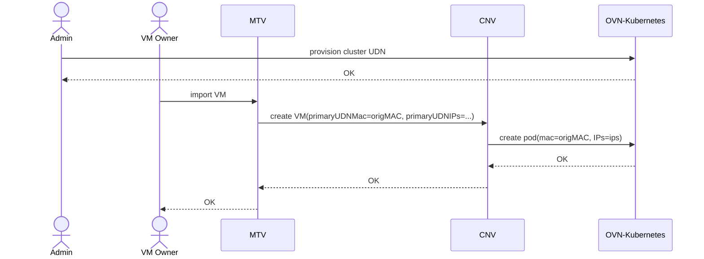
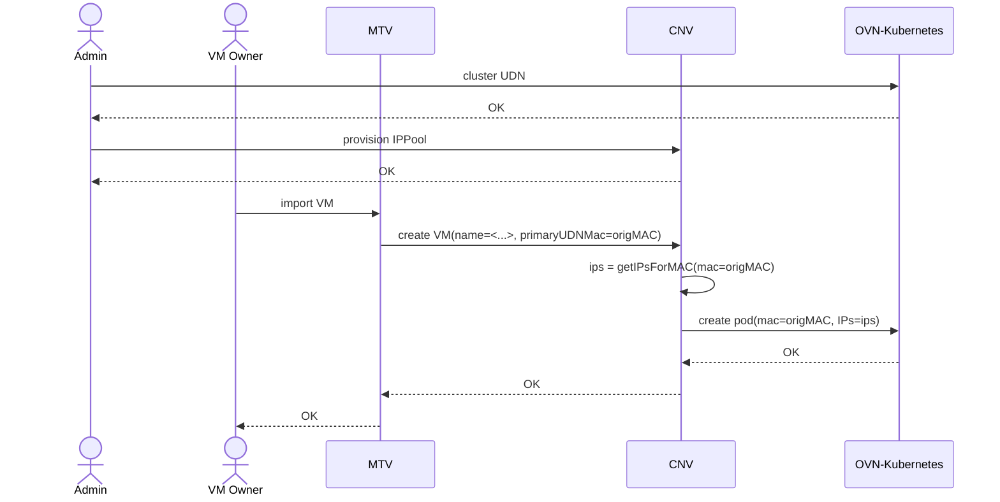
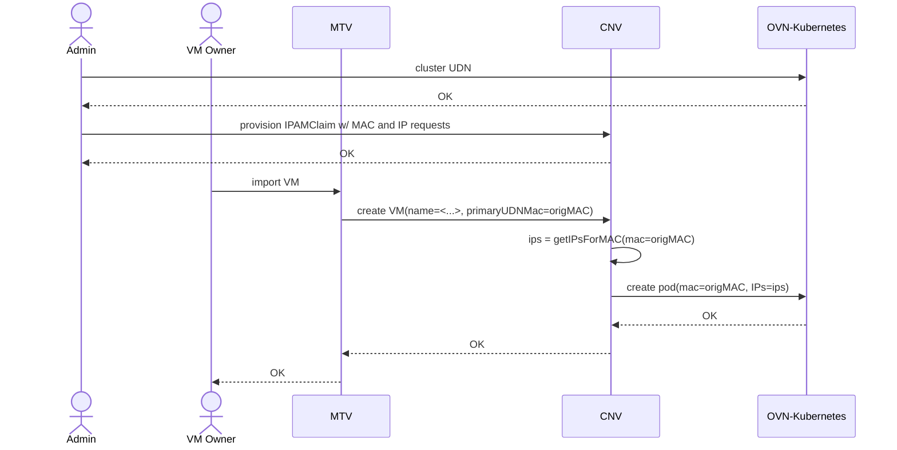

# Routed ingress support for primary UDN attached VMs with static IPs

## Summary

There's an ongoing interest to migrate Virtual Machines (VMs) from other
virtualization platforms into OpenShift. These users are both after a managed IP
experience (which they have on their existing platform), and also want to
consume existing Kubernetes features, like network policies, and sometimes
services.

Traditional virtualization users have some expectations on what a
virtualization platform should provide. Live-migration, and IP address
persistence across reboots are paramount features for any virtualization
solution, and OpenShift Virtualization currently supports these features on its
primary UserDefinedNetworks (UDNs).

These users have additional requirements, like routed ingress into their VMs,
and, to import the VMs with the MAC, IPs, and gateway configuration the VM had
on the previous platform.

Routed ingress into the VMs is being added to OpenShift already, and is tracked
by [this enhancement](https://github.com/openshift/enhancements/pull/1636/files)
which tracks adding BGP support to OpenShift.

Given the aggressive time-frame we're attempting, adding support for importing
a VM into OpenShift with it's MAC, IPs, and gateway on top of primary UDN is the
missing piece we should pursue.

## Motivation

Some users are running VMs in virtualization platforms having a managed IP
configuration.

For this kind of users, we need to have a way to enable their existing VMs to
run properly after being migrated into OpenShift, without any guest
configuration changes. For that, we need to import the VMs from their existing
platforms, preserving their existing MACs, IPs, and gateway configuration.

### User Stories

- As the owner of a VM running in a traditional virtualization platform, I want
to import said VM - whose IPs were statically configured - into Kubernetes,
attaching it to an overlay network. I want to ingress/egress using the same IP
address (the one assigned to the VM).
- As the owner of a VM running in a traditional virtualization platform, I want
to import said VM into Kubernetes, attaching it to an overlay network. I want to
be able to consume Kubernetes features like network policies, and services, to
benefit from the Kubernetes experience.
- As the owner of a VM running in a traditional virtualization platform, I want
to import said VM into Kubernetes, attaching it to an overlay network, without
having to reconfigure the VM's networking configuration (MAC, IPs, gateway).

### Goals

- Preserve the original VM's MAC address
- Preserve the original VM's IP address
- Specify the gateway IP address of the imported VM so it can keep the same
default route. This gateway is common to the entire logical network.
- Ensure it is possible to enable non-NATed traffic for pods with the static
network configuration by exposing the network through BGP

**NOTE:** all the goals mentioned above will be fulfilled **only** for the
**cluster** UDN type.

### Non-Goals

- Handle importing VMs without a managed IP experience - i.e. IPs were defined
statically in the guest.
- Importing a VM whose gateway is outside the subnet of the network.
- Adding non default routes to the VM when importing it into OpenShift Virt.
- Modifying the default gateway and management IPs of a primary UDN after it was created.
- Modifying a pod's network configuration after the pod was created.
- Support importing a "live" VM into the OpenShift virtualization cluster (i.e.
  without requiring a VM restart).
- Allow excludeSubnets to be used with L2 UDNs to ensure OVNK does not use an IP
  address from the range that VMs have already been assigned outside the
  cluster (or for secondary IP addresses assigned to the VM's interfaces).

**NOTE:** implementing support on UDNs (achieving the namespace isolation
use-case) is outside the scope for this feature.

## Proposal

This proposal to import VMs from other virtualization platforms while
preserving their networking configuration will impact three different OpenShift
components:
- MTV (Migration Toolkit for Virtualization)
- KubeVirt's ipam-extensions
- OVN-Kubernetes

We will elaborate the overall flow first, before digging into details in each
of the components. There will be two sub-sections: one about preserving the
[IP addresses](#preserving-the-original-vm-ip-address),
another about preserving the
[gateway configuration](#preserving-the-vm-gateway).
MTV already introspects the VM on the source cluster, and templates the VM with
its original MAC addresses.

### Current limitations

- MTV does **not** support importing VMs with IPv6 addresses. Whatever support
  for IPv6 we come up with, will probably be limited by this.

### Preserving the original VM IP address

MTV currently introspects the VM to learn the MAC addresses of the interfaces,
and templates the VM which will be created in OpenShift Virtualization with the
required MAC address. We would need MTV to somehow also figure out what IP
addresses are on the aforementioned interfaces.

To allow OpenShift Virtualization to import VMs - preserving their MAC and IP
addresses - we need to have both addresses stored somehow in the system (*at
least* for the VMs which will be migrated into OpenShift Virt).

The simplest alternative (which doesn't require any API changes) is to have MTV
template the OpenShift Virt VM with the required information - the MAC and IP
addresses for the primary UDN attachment.

The MAC address is currently defined in the VM spec, it is an attribute of the
interfaces in the `spec.template.spec.domain.devices.interfaces` array.
Unfortunately, there isn't a place in the KubeVirt API to request the IP
addresses for the interface (or network attachment). Given we're already past
the 4.20 KubeVirt feature freeze, we propose templating the VM with an
annotation where the interface's IPs and MAC will be defined. This annotation
will be the multus default network annotation, which enables users to customize
the default cluster network attachment. This annotation's value is a
network-selection-element, which we can use to instruct the pod's IPs and MAC
addresses. The annotation will look like:
```yaml
apiVersion: kubevirt.io/v1
kind: VirtualMachine
metadata:
  name: vm-server
  namespace: blue
spec:
  runStrategy: Always
  template:
    metadata:
      annotations:
        v1.multus-cni.io/default-network: '[{
          "name": "default",
          "namespace": "openshift-ovn-kubernetes",
          "mac": "02:03:04:05:06:07",
          "ips": [
            "10.0.0.5/24"
          ]
        }]'
```

When KubeVirt sees this VM, it will create a running VMI with the template's
spec defined; this the following VMI will be created from the template:
```yaml
apiVersion: kubevirt.io/v1
kind: VirtualMachineInstance
metadata:
  name: vm-server
  namespace: blue
  annotations:
    v1.multus-cni.io/default-network: '[{
          "name": "default",
          "namespace": "openshift-ovn-kubernetes",
          "mac": "02:03:04:05:06:07",
          "ips": [
            "10.0.0.5/24"
          ]
        }]'
spec:
...
```

When virt-controller templates the pod for holding this VM it will carry over
the multus default-network annotation and define that in the launcher pod.

The `ipam-extensions` mutating web-hook will intercept the launcher pod
creation, and mutate the multus default network annotation: it will decorate
the network selection element with the ipam-claim-reference attribute, thus
pointing to the IPAMClaim that is to be used to persist the VM's IP addresses
when the VMs are shutdown or migrated. This annotation would look like:
```yaml
apiVersion: v1
kind: Pod
metadata:
  name: pod-example
  annotations:
    v1.multus-cni.io/default-network: '[{
      "name": "isolated-net",
      "namespace": "myisolatedns",
      "mac": "02:03:04:05:06:07",
      "ipam-claim-reference": "myvm.isolated-net",  # added by the mutating webhook
      "ips": [
        "10.0.0.5/24"
      ]
}]'
```

OVN-Kubernetes will then act upon this information, by configuring the
requested MAC and IPs in the pod. If the allocation of the IP is successful,
said IPs will be persisted in the corresponding `IPAMClaim` CR (which already
happens today). If it fails (e.g. that IP address is already in use in the
subnet), the CNI will fail, crash-looping the pod. The error condition will be
reported in the associated `IPAMClaim` CR `status.conditions`, and an event
logged in the pod.

This workflow is described in more detail in the
[Workflow Description](#workflow-description) section.

### Preserving the VM gateway
Preserving the gateway will require changes to the OVN-Kubernetes API. The
cluster UDN CRD should be updated - adding a gateway definition - and the
OVN-Kubernetes
[NetConf](https://github.com/ovn-kubernetes/ovn-kubernetes/blob/2643dabe165bcb2d4564866ee1476a891c316fe3/go-controller/pkg/cni/types/types.go#L10)
CNI structure should also be updated with a `gateway` attribute.

The primary UDN gateway code will need to be updated to parametrize the gateway
IP address, since today it is using the UDN subnet first IP address.
To keep the feature backwards compatible, that would be the default if the UDN
does **not** feature the gateway configuration. This will ensure the
DHCP flows on the logical switch are advertising the correct gateway
information to the guests on the network, and also that the gateway is properly
configured to allow features like Kubernetes `Services`.

For IPv6 the flow will be different; IPv6 gateways are dynamic ! Hence, when a
VM is imported into OpenShift Virtualization, the OVN control plane must send a
RouterAdvertisement to the VM instructing it to forget about the old gateway -
i.e. send an RA with `lifetime = 0` with the source address of the gateway
defined for the VM in the old cluster.

Another aspect to take into consideration is the gateway MAC address; when we
import a VM into OpenShift Virtualization, the VM is started from scratch on
the destination cluster. Hence, the neighbor caches (ARP, NDP) will be updated.
This means there's nothing special we need to do on this regard - other than
ensuring the gateway MAC address is not already available in the logical network.

This flow is described in more detail (and presents alternatives to it) in the
[OVN-Kubernetes enhancement proposal](https://github.com/ovn-kubernetes/ovn-kubernetes/pull/5238).

### Workflow Description

#### Roles
- admin: a user with cluster admin rights. They can list NADs in all
  namespaces, create cluster UDNs, and create / update `IPPool`s.
- VM owner: a user without cluster admin rights. They own their namespaces.
  They will either import - or create - a VM in the namespace they own.

#### Sequence diagram for the proposed workflow


### API Extensions

#### IPAMClaim CRD

The IPAMClaim CRD status sub-resource will need to be updated, adding
conditions.

For traceability, we also suggest adding to the `IPAMClaim` status an attribute
to indicate which pod is holding the claim at any given time. On a VM live
migration, the OVN-Kubernetes control plane would update the `OwnerPod` after
the claim has been consumed by a different pod. Same for VM start/stop
scenarios.

Below you'll see the changes requested:
```go

// IPAMClaimStatus contains the observed status of the IPAMClaim.
type IPAMClaimStatus struct {
    // The list of IP addresses (v4, v6) that were allocated for the pod interface
    IPs []string `json:"ips"`
+   // The name of the pod holding the IPAMClaim
+   OwnerPod string `json:"ownerPod"`
+   // Conditions contains details for one aspect of the current state of this API Resource
+   Conditions []metav1.Condition `json:"conditions,omitempty"`
}
```

The `IPAMClaim` status will have (at least) the following conditions:
- IPAllocated: when the status is "True", it reports the IP address was
  successfully allocated for the workload. The reason will be
  `SuccessfulAllocation`. When the status is "False", it reports an IP
  allocation error, and more details will be provided in the `reason`, and
  `message` attributes.

These conditions will look like - **successful** allocation:
```
type: IPAllocated
status: "True"
reason: SuccessfulAllocation
message: "IP 192.168.1.5 allocated successfully"
lastTransitionTime: "2025-05-13T11:56:00Z"
```

These conditions will look like - **failed** allocation:
```
type: IPAllocated
status: "False"
reason: IPAlreadyExists
message: "Requested IP 192.168.1.5 is already assigned in the network"
lastTransitionTime: "2025-05-13T11:56:00Z"
```

### Topology Considerations

#### Hypershift / Hosted Control Planes

The management cluster should have no reason to import an existing VM from
another virtualization platform into OpenShift Virtualization.

It makes more sense to import VMs into the hosted clusters, in order to provide
tenants with routed ingress into their hosted cluster workloads.

There should be no hypershift platform-specific considerations with this
feature.

#### Standalone Clusters

Full support.

#### Single-node Deployments or MicroShift

Full support; there might be some increased resource usage when scaling up
number of VMs requesting IP and MAC address, since it will mean more processing
in OVN-Kubernetes, and more CRs to reconcile.

### Implementation Details/Notes/Constraints

TODO

### Risks and Mitigations

TODO

### Drawbacks

The biggest drawback we have to implementing this feature is lack of clear
asks from customers - we're pretty much guessing what they would want to use.

We do not know (for instance):
- is this feature only for VMs ?
- is this feature only about importing VMs ? Should we allow creating new VMs
  with dedicated MAC / IP / gateway requests ?
- are the end users (admins) after a centralized IP management alternative ?
  Do they want to have a single place to check their network address
  assignments ?

## Alternatives (Not Implemented)

### Requesting IP addresses on a VM's interfaces
An option which would provide a simpler implementation (and better / more
explicit UX) would be to modify the VMI specification, adding an attribute for
the user (or the tool templating the VM - e.g. MTV) to specify which IP
addresses they want the VM's interface to take.

It would be updating the
[v1.Interface](https://kubevirt.io/api-reference/main/definitions.html#_v1_interface)
with an ipAddresses array. This attribute is defined in
`VMI.Spec.Domain.Devices.Interfaces`.

This option (despite being the simplest to implement) is not taken into
consideration since we're already past the KubeVirt 1.5 API freeze - as a
result, we wouldn't be able to get this in OpenShift 4.20. This should be taken
into account for a future release though.

### Defining the MAC to IPs association
There are two alternatives to persist this information: a
[centralized approach](#centralized-ip-management),
which has the benefits of a single centralized place an admin type of user
could provision / get information from, or a
[de-centralized approach](#de-centralized-ip-management), similar
to the existing `IPAMClaim` CRD, where each VM connection to a primary UDN
information would be recorded.

Independently of which option we take, the API between OpenShift Virt (CNV) and
OVN-Kubernetes will be the same, and is roughly described in
[CNV to OVN-Kubernetes API](#cnv-ovnk-api).

#### Centralized IP management

A new CRD - named `IPPool`, or `DHCPLeaseConfig` (or the like) - will be
created, and is associated to a cluster UDN. This CRD holds the association of
MAC address to IPs for a UDN. When importing the VM into OpenShift Virt, MTV
(or a separate, dedicated component) will provision / update this object with
the required information (MAC to IPs association).
This object is providing to the admin user a single place to check the IP
address MAC to IPs mapping. On an first implementation phase, we can have the
admin provision these CRs manually. Later on, MTV (or any other cluster
introspection tool) can provision these on behalf of the admin.

This approach has the following advantages:
- single place the admin to manage for UDN
- similar to what is done on VmWare
- simple association between the `IPPool` and the logical network

This approach requires adding a new CRD - `IPPool` - which is described in
detail in the [IPPool CRD](#ippool-crd) section.

This flow is described in more detail in the
[Centralized IP management workflow](#centralized-ip-management-workflow) section.

##### IPPool CRD
This IPPool CRD has a 1:1 association to a UDN (or. For now, it'll only apply
to a primary UDN though. In the future, nothing prevents these CRs from being
used for secondary UDNs.

The IPPool CRD is a cluster-scoped object associated to a UDN via the logical
network name (`NAD.Spec.Config.Name` attribute), since we want to have this
feature upstream in the k8snetworkplumbingwg, rather than in OVN-Kubernetes.

The `IPPool` spec will have an attribute via which the admin can point to a
cluster UDN - by the logical network name. The admin (which is the only actor
able to create the `IPPool`) has read access to all NADs in all namespaces,
hence they can inspect the NAD object to extract the network name. We could
even update the cluster UDN type to feature the generated network name in its
status sub-resource, to simplify the UX of the admin user.

An alternative would be to reference the UDN by the NAD name - with that
information, whatever controller reconciling the `IPPool` CRs can access the
NAD, and extract the network name. This approach would require a validating
webhook to ensure that you can't have multiple `IPPool`s referencing the same
logical network (since multiple NADs with the same logical network name - in
**different** namespaces can exist).

##### Centralized IP management workflow

The [centralized IP management](#centralized-ip-management) flow is described
in the following sequence diagram:


Hence, the required changes would be:
- ipam-extensions (CNV component) and OVN-Kubernetes API will need to be
  changed, to work with the multus default network annotation. Depending on the
  VM's specification, it will request a specific MAC and IP addresses for the
  primary UDN attachment. The `ipam-claim-reference` will also be requested via
  this annoation.
- the `IPAMClaim` CRD will need to be updated, adding a `Conditions` array to
  its status. This way we will be able to report errors back to the user (e.g.
  the desired IP allocation is already in use)
- new CRD to be added, where the MAC <-> IPs addresses association will be
  persisted. Only required for the
  [centralized IP management](#centralized-ip-management) option
- ipam-extensions (CNV component) will now also read the `IPPool` CRs for VMs
  having primary UDNs in their namespaces, and requesting a specific MAC address
  in their specs. These CRs will be used to generate the multus default network
  annotation, which will be set in the pods by the mutating webhook.

On a second stage, MTV (or other source cluster introspection tool) will
provision the `IPPool` CR for the UDN on behalf of the admin user, thus
simplifying the operation of the solution, making it more robust and less
error-prone.

###### Admin user flows for centralized approach

The admin user will have to perform the following operations:
- provision the cluster UDN CR having the overlay definition.
  - layer2 topology ; IPAM lifecycle `Persistent` are a **must**
- provision the `IPPool` object, pointing at the logical network created in the
  previous step via the `IPPool.Spec.NetworkName attribute`. This is only
  required until another tool automatically provisions the `IPPool` on behalf of
  the admin
- fill out the `IPPool` with the MAC to IPs association on the cluster from
  which the VMs are being imported. This is only required until another tool
  (able to introspect the source virtualization cluster) can perform this
  operation on behalf of the admin

As indicated above, when a tool exists that can introspect the source cluster
to learn the VM's IP addresses, the admin user will only require provisioning
the cluster UDN CR.

###### VM owner flows for centralized approach

The VM owner just has to use MTV to import the VM into CNV.

###### IPPool CRD

**NOTE:** this CRD is only required if we go with a
[centralized IP allocation](#centralized-ip-management) design.

The IPPool CRD will operate as a place to store the MAC to IP addresses
association for a logical network.

```go
type IPPool struct {
	metav1.TypeMeta     `json:",inline"`
	metav1.ObjectMeta   `json:"metadata,omitempty"`

	Spec   IPPoolSpec   `json:"spec,omitempty"`
	Status IPPoolStatus `json:"status,omitempty"`
}

type IPPoolSpec struct {
	NetworkName string                         `json:"network-name"`
	Entries map[net.HardwareAddr][]net.IPNet   `json:"entries"`
}

type IPPoolStatus struct {
	Conditions []Condition      `json:"conditions"`
	// this is an optional improvement for improving the UX
	AssociatedNADs []NADInfo    `json:"associated-nads,omitempty"`
}

type NADInfo struct {
	Name string `json:"name"`
}
```

The `IPPool` CRD will have at least the following conditions:
- DuplicateMACAddresses: will indicate to the admin that a MAC address appears
  multiple times in the `Entries` list
- DuplicateIPAddresses: will indicate to the admin that an IP address appears
  multiple times associated to different MAC addresses in the `Entries` list
- Success: the data present in the spec is valid (no duplicate MACs or IPs)

We plan on reporting in the `IPPool` the name of the NADs which are holding the
configuration for the network which this pool stores the MAC <=> IPs
associations.

You can find below the conditions for when the IPPool information is correct
(no conflicts):

```
apiVersion: ippool.k8s.cni.cncf.io/v1alpha
kind: IPPool
metadata:
  name: example-ip-pool
spec:
  network-name: "prod-network"
  entries:
    "00:1a:4b:12:34:56": ["10.0.0.0/24", "10.0.1.0/24"]
status:
  conditions:
  - type: Success
    status: "true"
    lastTransitionTime: "2025-05-13T12:05:00Z"
```

You can find below the conditions for when the IPPool information has
conflicts:

```
apiVersion: ippool.k8s.cni.cncf.io/v1alpha
kind: IPPool
metadata:
  name: example-ip-pool
spec:
  network-name: "prod-network"
  entries:
    "00:1a:4b:12:34:56": ["10.0.0.2/24", "10.0.1.10/24"]
    "00:1a:4b:12:34:56": ["10.0.0.14/24", "10.0.1.110/24"]
status:
  conditions:
  - type: Success
    status: "False"
    reason: DuplicatesExist
    message: "Duplicate MAC 00:1a:4b:12:34:56 found in entries"
    lastTransitionTime: "2025-05-13T12:05:00Z"

  - type: DuplicateMACAddresses
    status: "True"
    reason: DuplicateMACFound
    message: "MAC address 00:1a:4b:12:34:56 appears 2 times"
    lastTransitionTime: "2025-05-13T12:05:00Z"

  - type: DuplicateIPAddresses
    status: "False"
    reason: NoIPDuplicates
    message: "All IP addresses are unique per MAC"
    lastTransitionTime: "2025-05-13T12:05:00Z"
```

On a follow-up, we could reconcile the `IPPool` CR with the MAC <-> IPs
association of all workloads attached to that network - i.e. also for the
workloads being created without MAC / IP requests. That would be useful to the
network admin / service engineer to get the full view on whatever's connected
to a network at any given time. This would require a separate enhancement to
get better understanding of the use-cases, and how to implement said feature.

#### De-centralized IP management

This approach requires having N CRs with a 1:1 association between a primary
UDN attachment and the MAC and IPs it had on the original platform.

We could either introduce a new CRD with IPs and MAC association (which would
deprecate the IPAMClaim CRD), or, assuming clunkiness in all its glory, we
could change the IPAMClaim CRD to have MAC and IP addresses being requested in
the spec stanza as well.

OVN-Kubernetes would read the CR, attempt to reserve the requested MAC and IP,
and then persist that information in the IPAMClaim status - reporting a
successful sync in the `IPAMClaim` status - or a failure otherwise.

In this option, the [CNV to OVN-Kubernetes API](#cnv-ovnk-api) **remains** as
defined today - i.e. OVN-Kubernetes will be pointed to an `IPAMClaim` via a
particular annotation on the pod.

The flow is described in more detail in the
[De-centralized IP management workflow](#de-centralized-ip-management-workflow) section.

##### De-centralized IP management workflow

The [de-centralized IP management](#de-centralized-ip-management) flow is
described in the following sequence diagram:



Hence, the required changes would be:
- the `IPAMClaim` CRD status sub-resource will need to be updated, adding a
  `Conditions` array. This way we will be able to report errors back to the
  user (e.g. the desired IP allocation is already in use).
- the `IPAMClaim` CRD spec will need to be updated, adding `MAC` and `IPs`
  requests.
- OVN-Kubernetes will need to try to apply the MAC and IP addresses requested
  in its spec. If any conflicts are found for either MAC or IPs, the error will
  be persisted in the `IPAMClaim` status (in the conditions array).
- OVN-Kubernetes will record the requested IPs in the status sub-resource
  (already does so today), along with a `Success` condition.

This option has the network admin create the IPAMClaim, and request a MAC and
IP addresses for the VM; in a second stage of the implementation, MTV (or any
other component able to introspect the source cluster for the VM's MAC and IPs)
will create the IPAMClaim on behalf of the admin user.

###### Admin user flows for de-centralized approach

The admin user will have to perform the following operations:
- provision the cluster UDN CR having the overlay definition.
  - layer2 topology ; IPAM lifecycle `Persistent` are a **must**
- provision the `IPAMClaim` object, whose name **must** be created like
  `<vm name>.<logical network name>`. The `IPAMClaim` must have both the IP and
  MAC addresses for the VM attachment. This is only required until another tool
  automatically provisions the `IPAMClaim`s on behalf of the admin

As indicated above, when a tool exists that can introspect the source cluster
to learn the VM's IP addresses, the admin user will only require provisioning
the cluster UDN CR.

###### VM owner flows for de-centralized approach

The VM owner just has to use MTV to import the VM into CNV.

## Test Plan

* E2E upstream and downstream jobs covering VM creation with requested
  IP/MAC/gateway configuration for both IPv4 and dual-stack configurations
* E2E downstream jobs covering a VM (having a network configuration which must
  be kept) import via MTV is successful for both IPv4 and dual-stack
  configurations
* E2E tests covering the existing features (network policies, IP spoof
  protection, services) for an imported VM works as expected for both IPv4 and
  dual-stack configurations

## Graduation Criteria

### Dev Preview -> Tech Preview

There will be no Dev Preview for this feature.

### Tech Preview -> GA

Targeting GA in OCP version 4.20.

### Removing a deprecated feature

The annotation currently being used for indicating to OVN-Kubernetes what is
the `IPAMClaim` to use for the primary UDN attachment will be deprecated, and
we plan on using the [multus default annotation](#cnv-ovnk-api) for it.

The deprecation strategy is described in the OVN-Kubernetes
[OKEP](https://github.com/ovn-kubernetes/ovn-kubernetes/pull/5238).

## Upgrade / Downgrade Strategy

N/A

## Version Skew Strategy

N/A

## Operational Aspects of API Extensions

The proposed `IPPool` CRD must be provisioned by the admin (or the source
cluster introspection tool) before the VMs are migrated into OpenShift virt,
otherwise, they will lose the IP addresses they had on the source cluster.

The gateway for the network must be configured in the cluster UDN CR at
creation time, as any other cluster UDN parameter.

Hence, some planning and preparation are required from the admin before the
VM owner starts importing VMs into the OpenShift Virt cluster via MTV.

## Support Procedures

Issues with an imported VM should be logged in the launcher pod events, and
persisted in the corresponding `IPAMClaim` so the support team can check what
failed in the address allocation requests.

The `IPPool` CRD would help the support engineer get a grasp of the MAC <-> IPs
being used for a network at any given time. Having this notion will simplify
the support procedures on the cluster. This is an optional step, described in
the [centralized IP management](#centralized-ip-management) section.

## Infrastructure Needed [optional]

We'll need a virt-aware lane with CNV (and MTV) installed so we can e2e test
the features.
