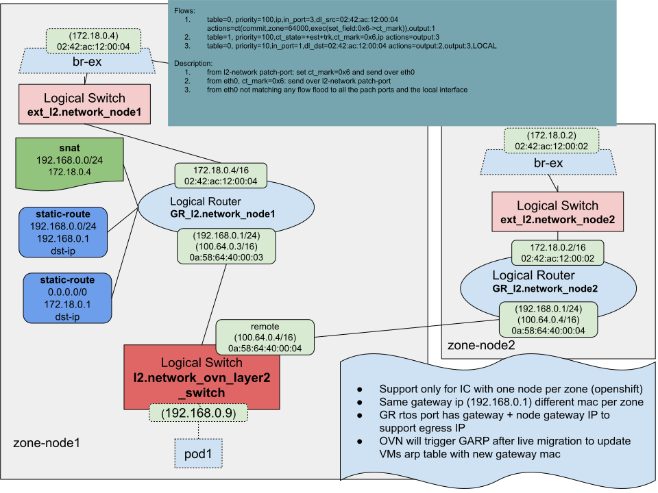
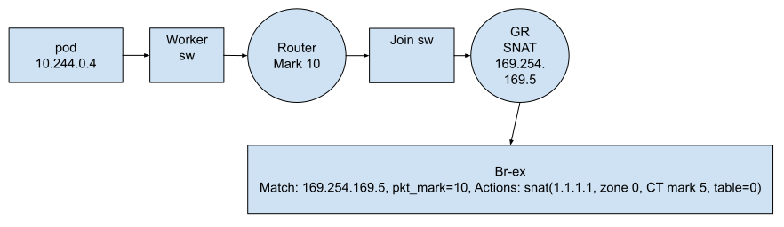
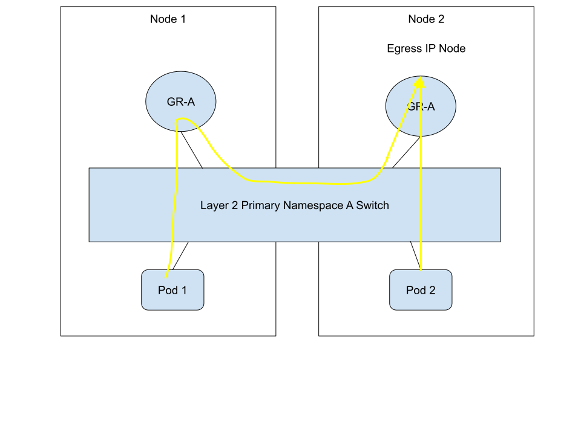
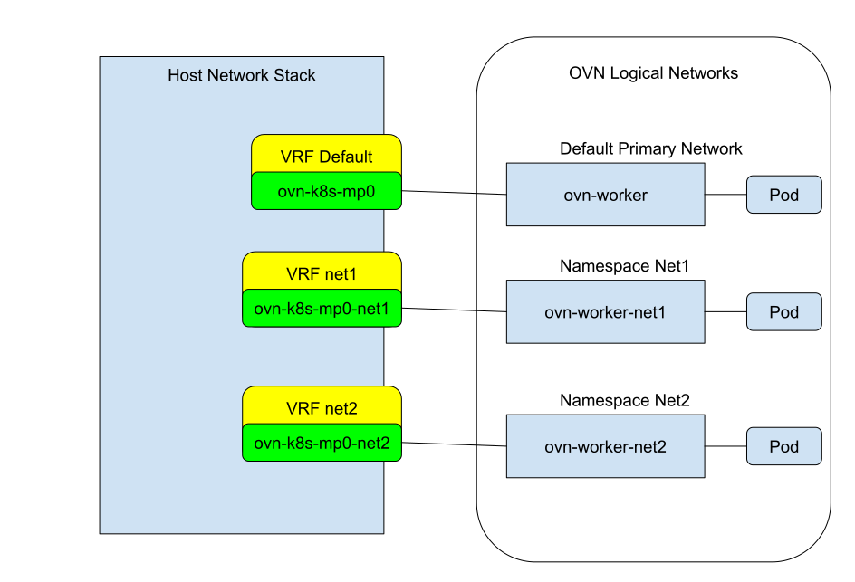
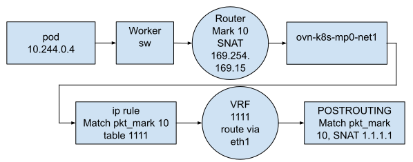
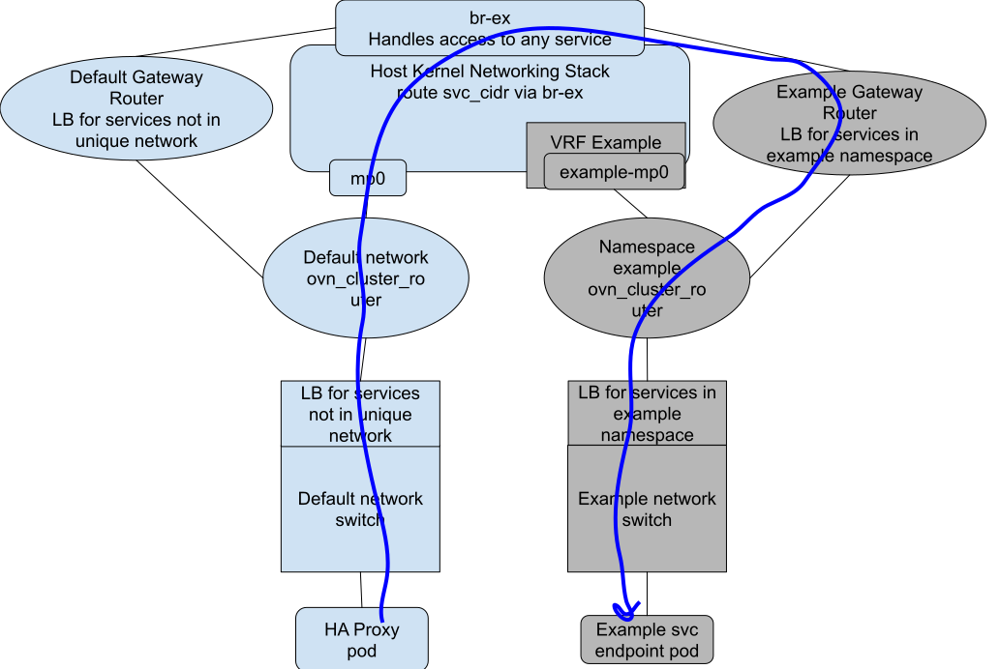

# User-Defined Network Segmentation

## Summary

OVN-Kubernetes today allows multiple different types of networks per secondary network: layer 2, layer 3, or localnet.
Pods can be connected to different networks without discretion. For the primary network, OVN-Kubernetes only supports all
pods connecting to the same layer 3 virtual topology. The scope of this effort is to bring the same flexibility of the
secondary network to the primary network. Therefore, pods are able to connect to different types of networks as their
primary network.

Additionally, multiple and different instances of primary networks may co-exist for different users, and they will provide
native network isolation.

## Terminology

* **Primary Network** - The network which is used as the default gateway for the pod. Typically recognized as the eth0
interface in the pod.
* **Secondary Network** - An additional network and interface presented to the pod. Typically created as an additional
Network Attachment Definition (NAD), leveraging Multus. Secondary Network in the context of this document refers to a
secondary network provided by the OVN-Kubernetes CNI.
* **Cluster Default Network** - This is the routed OVN network that pods attach to by default today as their primary network.
The pods default route, service access, as well as kubelet probe are all served by the interface (typically eth0) on this network.
* **User-Defined Network** - A network that may be primary or secondary, but is declared by the user.
* **Layer 2 Type Network** - An OVN-Kubernetes topology rendered into OVN where pods all connect to the same distributed
logical switch (layer 2 segment) which spans all nodes. Uses Geneve overlay.
* **Layer 3 Type Network** - An OVN-Kubernetes topology rendered into OVN where pods have a per-node logical switch and subnet.
Routing is used for pod to pod communication across nodes. This is the network type used by the cluster default network today.
Uses Geneve overlay.
* **Localnet Type Network** - An OVN-Kubernetes topology rendered into OVN where pods connect to a per-node logical switch
that is directly wired to the underlay.

## Motivation

As users migrate from OpenStack to Kubernetes, there is a need to provide network parity for those users. In OpenStack,
each tenant (akin to Kubernetes namespace) by default has a layer 2 network, which is isolated from any other tenant.
Connectivity to other networks must be specified explicitly as network configuration via a Neutron router. In Kubernetes
the paradigm is opposite, by default all pods can reach other pods, and security is provided by implementing Network Policy.
Network Policy can be cumbersome to configure and manage for a large cluster. It also can be limiting as it only matches
TCP, UDP, and SCTP traffic. Furthermore, large amounts of network policy can cause performance issues in CNIs. With all 
these factors considered, there is a clear need to address network security in a native fashion, by using networks per
tenant to isolate traffic.

### User Stories

* As a user I want to be able to migrate applications traditionally on OpenStack to Kubernetes, keeping my tenant network
  space isolated and having the ability to use a layer 2 network.
* As a user I want to be able to ensure network security between my namespaces without having to manage and configure
  complex network policy rules.
* As an administrator, I want to be able to provision networks to my tenants to ensure their networks and applications
  are natively isolated from other tenants.
* As a user, I want to be able to request a unique, primary network for my namespace without having to get administrator
  permission.
* As a user, I want user-defined primary networks to be able to have similar functionality as the cluster default network,
  regardless of being on a layer 2 or layer 3 type network. Features like Egress IP, Egress QoS, Kubernetes services,
  Ingress, and pod Egress should all function as they do today in the cluster default network.
* As a user, I want to be able to use my own consistent IP addressing scheme in my network. I want to be able to specify
  and re-use the same IP subnet for my pods across different namespaces and clusters. This provides a consistent
  and repeatable network environment for administrators and users.

### Goals

* Provide a configurable way to indicate that a pod should be connected to a user-defined network of a specific type as a
primary interface.
* The primary network may be configured as a layer 3 or layer 2 type network.
* Allow networks to have overlapping pod IP address space. This range may not overlap with the default cluster subnet
used for allocating pod IPs on the cluster default network today.
* The cluster default primary network defined today will remain in place as the default network pods attach to. The cluster
default network will continue to serve as the primary network for pods in a namespace that has no primary user-defined network. Pods
with primary user-defined networks will still attach to the cluster default network with limited access to Kubernetes system resources.
Pods with primary user-defined networks will have at least two network interfaces, one connected to the cluster default network and one
connected to the user-defined network. Pods with primary user-defined networks will use the user-defined network as their default
gateway.
* Allow multiple namespaces per network.
* Support cluster ingress/egress traffic for user-defined networks, including secondary networks.
* Support for ingress/egress features on user-defined primary networks where possible:
    * EgressQoS
    * EgressService
    * EgressIP
    * Load Balancer and NodePort Services, as well as services with External IPs.
* In addition to ingress service support, there will be support for Kubernetes services in user-defined networks. The
scope of reachability to that service as well as endpoints selected for that service will be confined to the network
and corresponding namespace(s) where that service was created.
* Support for pods to continue to have access to the cluster default primary network for DNS and KAPI service access.
* Kubelet healthchecks/probes will still work on all pods.
* OpenShift Router/Ingress will work with some limitations for user-defined networks.

### Non-Goals

* Allowing different service CIDRs to be used in different networks.
* Localnet will not be supported initially for primary networks.
* Allowing multiple primary networks per namespace.
* Hybrid overlay support on user-defined networks.

### Future-Goals

* DNS lookup for pods returning records for IPs on the user-defined network. In the first phase DNS will return the pod
IP on the cluster default network instead.
* Admin ability to configure networks to have access to all services and/or expose services to be accessible from all
networks.
* Ability to advertise user-defined networks to external networks using BGP/EVPN. This will enable things like:
    * External -> Pod ingress per VRF (Ingress directly to pod IP)
    * Multiple External Gateway (MEG) in a BGP context, with ECMP routes
* Allow connection of multiple networks via explicit router API configuration.
* An API to allow user-defined ports for pods to be exposed on the cluster default network. This may be used for things
like promethus metric scraping.
* Potentially, coming up with an alternative solution for requiring the cluster default network connectivity to the pod,
and presenting the IP of the pod to Kubernetes as the user-defined primary network IP, rather than the cluster default
network IP.

## Proposal

By default in OVN-Kubernetes, pods are attached to what is known as the “cluster default" network, which is a routed network
divided up into a subnet per node. All pods will continue to have an attachment to this network, even when assigned a
different primary network. Therefore, when a pod is assigned to a user-defined network, it will have two interfaces, one
to the cluster default network, and one to the user-defined network. The cluster default network is required in order to provide:

1. KAPI service access
2. DNS service access
3. Kubelet healthcheck probes to the pod

All other traffic from the pod will be dropped by firewall rules on this network, when the pod is assigned a user-defined
primary network. Routes will be added to the pod to route KAPI/DNS traffic out towards the cluster default network. Note,
it may be desired to allow access to any Kubernetes service on the cluster default network (instead of just KAPI/DNS),
but at a minimum KAPI/DNS will be accessible. Furthermore, the IP of the pod from the Kubernetes API will continue to
show the IP assigned in the cluster default network.

In OVN-Kubernetes secondary networks are defined using Network Attachment Definitions (NADs). For more information on
how these are configured, refer to:

[https://github.com/ovn-org/ovn-kubernetes/blob/master/docs/features/multi-homing.md](https://github.com/ovn-org/ovn-kubernetes/blob/master/docs/features/multi-homing.md)

The proposal here is to leverage this existing mechanism to create the network. A new field, “primaryNetwork” is
introduced to the NAD spec which indicates that this network should be used for the pod's primary network. Additionally,
a new "joinSubnet" field is added in order to specify the join subnet used inside the OVN network topology. An
example OVN-Kubernetes NAD may look like:

```
apiVersion: k8s.cni.cncf.io/v1
kind: NetworkAttachmentDefinition
metadata:
  name: l3-network
  namespace: default
spec:
  config: |2
    {
            "cniVersion": "0.3.1",
            "name": "l3-network",
            "type": "ovn-k8s-cni-overlay",
            "topology":"layer3",
            "subnets": "10.128.0.0/16/24,2600:db8::/29",
            "joinSubnet": "100.65.0.0/24,fd99::/64",
            "mtu": 1400,
            "netAttachDefName": "default/l3-network",
            "primaryNetwork": true
    }
```

The NAD must be created before any pods are created for this namespace. If cluster default networked pods existed before
the user-defined network was created, any further pods created in this namespace after the NAD was created will return
an error on CNI ADD. 

Only one primary network may exist per namespace. If more than one user-defined network is created with the
"primaryNetwork" key set to true, then future pod creations will return an error on CNI ADD until the network
configuration is corrected.

A pod may not connect to multiple primary networks other than the cluster default. When the NAD is created,
OVN-Kubernetes will validate the configuration, as well as that no pods have been created in the namespace already. If
pods existed before the NAD was created, errors will be logged, and no further pods will be created in this namespace
until the network configuration is fixed.

After creating the NAD, pods created in this namespace will connect to the newly defined network as their primary
network. The primaryNetwork key is used so that OVN-Kubernetes knows which network should be used, in case there are multiple
NADs created for a namespace (secondary networks).

After a pod is created that shall connect to a user-defined network, it will then be annotated by OVN-Kubernetes with the
appropriate networking config:

```
trozet@fedora:~/Downloads$ oc get pods -o yaml -n ns1
apiVersion: v1
items:
- apiVersion: v1
  kind: Pod
  metadata:
    annotations:
      k8s.ovn.org/pod-networks: 'k8s.ovn.org/pod-networks: '{"default":{"ip_addresses":["10.244.1.6/24","fd00:10:244:2::6/64"],"mac_address":"0a:58:0a:f4:01:06","routes":[{"dest":"10.244.0.0/16","nextHop":"10.244.1.1"},{"dest":"100.64.0.0/16","nextHop":"10.244.1.1"},{"dest":"fd00:10:244::/48","nextHop":"fd00:10:244:2::1"},{"dest":"fd98::/64","nextHop":"fd00:10:244:2::1"}],"type":default},"default/l3-network":{"ip_addresses":["10.128.1.3/24","2600:db8:0:2::3/64"],"mac_address":"0a:58:0a:80:01:03","gateway_ips":["10.128.1.1","2600:db8:0:2::1"],"routes":[{"dest":"10.128.0.0/16","nextHop":"10.128.1.1"},{"dest":"10.96.0.0/16","nextHop":"10.128.1.1"},{"dest":"100.64.0.0/16","nextHop":"10.128.1.1"},{"dest":"2600:db8::/29","nextHop":"2600:db8:0:2::1"},{"dest":"fd00:10:96::/112","nextHop":"2600:db8:0:2::1"},{"dest":"fd99::/64","nextHop":"2600:db8:0:2::1"}],"type":primary}}'
      k8s.v1.cni.cncf.io/network-status: |-
        [{
            "name": "default",
            "interface": "eth0",
            "ips": [
                "10.244.1.6"
            ]},
            "mac": "0a:58:0a:f4:02:03",
            "default": true,
            "dns": {}
        }]
status:
  phase: Running
  podIP: 10.244.1.6
  podIPs:
  - ip: 10.244.1.6
  - ip: fd00:10:244:2::6
```

In the above output the primary network is listed within the k8s.ovn.org/pod-networks annotation. However, the network-status
cncf annotation does not contain the primary network. This is due to the fact that OVNK will do an implicit CNI ADD for both
the default cluster network and the primary network. This way a user does not have to manually request that the pod is attached
to the primary network.

Multiple namespaces may also be configured to use the same network. In this case the underlying OVN network will be the
same, following a similar pattern to what is [already supported today for secondary networks](https://docs.openshift.com/container-platform/4.15/networking/multiple_networks/configuring-additional-network.html#configuration-ovnk-network-plugin-json-object_configuring-additional-network).

### CRDs for Managing Networks

Network Attachment Definitions (NADs) are the current way to configure the network in OVN-Kubernetes today, and the
method proposed in this enhancement. There are two major shortcomings of NAD:

1. It has free-form configuration that depends on the CNI. There is no API validation of what a user enters, leading to
mistakes which are not caught at configuration time and may cause unexpected functional behavior at runtime.
2. It requires cluster admin RBAC in order to create the NAD.

In order to address these issues, a proper CRD may be implemented which indirectly creates the NAD for OVN-Kubernetes.
This solution may consist of more than one CRD, namely an Admin based CRD and one that is namespace scoped for tenants.
The reasoning behind this is we want tenants to be able to create their own user-defined network for their namespace,
but we do not want them to be able to connect to another namespace’s network without permission. The Admin based version
would give higher level access and allow an administrator to create a network that multiple namespaces could connect to.
It may also expose more settings in the future for networks that would not be safe in the hands of a tenant, like
deciding if a network is able to reach other services in other networks. With tenants having access to be able to create
multiple networks, we need to consider potential attack vectors like a tenant trying to exhaust OVN-Kubernetes
resources by creating too many secondary networks.

Furthermore, by utilizing a CRD, the status of the network CR itself can be used to indicate whether it is configured
by OVN-Kubernetes. For example, if a user creates a network CR and there is some problem (like pods already existed) then
an error status can be reported to the CR, rather than relying on the user to check OVN-Kubernetes logs.

### IP Addressing

As previously mentioned, one of the goals is to allow user-defined networks to have overlapping pod IP addresses. This
is enabled by allowing a user to configure what CIDR to use for pod addressing when they create the network. However,
this range cannot overlap with the default cluster CIDR used by the cluster default network today.

Furthermore, the internal masquerade subnet and the Kubernetes service subnet will remain unique and will exist globally
to serve all networks. The masquerade subnet must be large enough to accommodate enough networks. Therefore, the
subnet size of the masquerade subnet is equal to the number of desired networks * 2, as we need 2 masquerade IPs per
network. The masquerade subnet remains localized to each node, so each node can use the same IP addresses and the size
of the subnet does not scale with number of nodes.

The transit switch subnets may overlap between all networks. This network is just used for transport between nodes, and
is never seen by the pods or external clients.

The join subnet of the default cluster network may not overlap with the join subnet of user-defined networks. This is
due to the fact that the pod is connected to the default network, as well as the user-defined primary network. The join
subnet is SNAT'ed by the GR of that network in order to facilitate ingress reply service traffic going back to the
proper GR, in case it traverses the overlay. For this reason, the pods may see this IP address and routes are added to
the pod to steer the traffic to the right interface (100.64.0.0/16 is the default cluster network join subnet):

```
[root@pod3 /]# ip route show
default via 10.244.1.1 dev eth0 
10.96.0.0/16 via 10.244.1.1 dev eth0 
10.244.0.0/16 via 10.244.1.1 dev eth0 
10.244.1.0/24 dev eth0 proto kernel scope link src 10.244.1.8 
100.64.0.0/16 via 10.244.1.1 dev eth0
```

Since the pod needs routes for each join subnet, any layer 3 or layer 2 network that is attached to the pod needs a unique
join subnet. Consider a pod connected to the default cluster network, a user-defined, layer 3, primary network, and a
layer 2, secondary network:

| Network         | Pod Subnet    | Node Pod Subnet | Join Subnet   |
|-----------------|---------------|-----------------|---------------|
| Cluster Default | 10.244.0.0/16 | 10.244.0.0/24   | 100.64.0.0/16 |
| Layer 3         | 10.245.0.0/16 | 10.245.0.0/24   | 100.65.0.0/16 |
| Layer 2         | 10.246.0.0/16 | N/A             | 100.66.0.0/16 |


The routing table would look like:

```
[root@pod3 /]# ip route show
default via 10.245.0.1 dev eth1 
10.96.0.0/16 via 10.245.0.1 dev eth1
10.244.0.0/16 via 10.244.0.1 dev eth0
10.245.0.0/16 via 10.245.0.1 dev eth1
10.244.0.0/24 dev eth0 proto kernel scope link src 10.244.0.8
10.245.0.0/24 dev eth1 proto kernel scope link src 10.245.0.8
10.246.0.0/16 dev eth2 proto kernel scope link src 10.246.0.8
100.64.0.0/16 via 10.244.0.1 dev eth0
100.65.0.0/16 via 10.245.0.1 dev eth1
100.66.0.0/16 via 10.246.0.1 dev eth2
```

Therefore, when specifying a user-defined network it will be imperative to ensure that the networks a pod will connect to
do not have overlapping pod network or join network subnets. OVN-Kubernetes should be able to detect this scenario and
refuse to CNI ADD a pod with conflicts.

### DNS

DNS lookups will happen via every pod’s access to the DNS service on the cluster default network. CoreDNS lookups for
pods will resolve to the pod’s IP on the cluster default network. This is a limitation of the first phase of this feature
and will be addressed in a future enhancement. DNS lookups for services and external entities will function correctly.

### Services

Services in Kubernetes are namespace scoped. Any creation of a service in a namespace without a user-defined network
(using cluster default network as primary) will only be accessible by other namespaces also using the default network as
their primary network. Services created in namespaces served by user-defined networks, will only be accessible to
namespaces connected to the user-defined network.

Since most applications require DNS and KAPI access, there is an exception to the above conditions where pods that are
connected to user-defined networks are still able to access KAPI and DNS services that reside on the cluster default
network. In the future, access to more services on the default network may be granted. However, that would require more
groundwork around enforcing network policy (which is evaluated typically after service DNAT) as potentially nftables
rules. Such work is considered a future enhancement and beyond the scope of this initial implementation.

With this proposal, OVN-Kubernetes will check which network is being used for this namespace, and then only enable the
service there. The cluster IP of the service will only be available in the network of that service, except for KAPI and
DNS as previously explained. Host networked pods in a namespace with a user-defined primary network will also be limited
to only accessing the cluster IP of the services for that network. Load balancer IP and nodeport services are also
supported on user-defined networks. Service selectors are only able to select endpoints from the same namespace where the
service exists. Services that exist before the user-defined network is assigned to a namespace will result in
OVN-Kubernetes executing a re-sync on all services in that namespace, and updating all load balancers. Keep in mind that
pods must not exist in the namespace when the namespace is assigned to a new network or the new network assignment will
not be accepted by OVN-Kubernetes.

Services in a user-defined network will be reachable by other namespaces that share the same network.

As previously mentioned, Kubernetes API and DNS services will be accessible by all pods.

Endpoint slices will provide the IPs of the cluster default network in Kubernetes API. For this implementation the required
endpoints are those IP addresses which reside on the user-defined primary network. In order to solve this problem,
OVN-Kubernetes may create its own endpoint slices or may choose to do dynamic lookups at runtime to map endpoints to
their primary IP address. Leveraging a second set of endpoint slices will be the preferred method, as it creates less
indirection and gives explicit Kube API access to what IP addresses are being used by OVN-Kubernetes.

Kubelet health checks to pods are queried via the cluster default network. When endpoints are considered unhealthy they
will be removed from the endpoint slice, and thus their primary IP will be removed from the OVN load balancer. However,
it is important to note that the healthcheck is being performed via the cluster default network interface on the pod, 
which ensures the application is alive, but does not confirm network connectivity of the primary interface. Therefore,
there could be a situation where OVN networking on the primary interface is broken, but the default interface continues
to work and reports 200 OK to Kubelet, thus rendering the pod serving in the endpoint slice, but unable to function.
Although this is an unlikely scenario, it is good to document.

### Network Policy

Network Policy will be fully supported for user-defined primary networks as it is today with the cluster default network.
However, configuring network policies that allow traffic between namespaces that connect to different user-defined
primary networks will have no effect. This traffic will not be allowed, as the networks have no connectivity to each other.
These types of policies will not be invalidated by OVN-Kubernetes, but the configuration will have no effect. Namespaces
that share the same user-defined primary network will still benefit from network policy that applies access control over
a shared network. Additionally, policies that block/allow cluster egress or ingress traffic will still be enforced for
any user-defined primary network.

### API Extensions

The main API extension here will be a namespace scoped network CRD as well a cluster scoped network CRD. These CRDs
will be registered by Cluster Network Operator (CNO). See the [CRDs for Managing Networks](#crds-for-managing-networks)
section for more information on how the CRD will work. There will be a finalizer on the CRDs, so that upon deletion
OVN-Kubernetes can validate that there are no pods still using this network. If there are pods still attached to this
network, the network will not be removed.

### Workflow Description

#### Tenant Use Case

As a tenant I want to ensure when I create pods in my namespace their network traffic is isolated from other tenants on
the cluster. In order to ensure this, I first create a network CRD that is namespace scoped and indicate:

 - Type of network (Layer 3 or Layer 2)
 - IP addressing scheme I wish to use (optional)
 - Indicate this network will be the primary network

After creating this CRD, I can check the status of the CRD to ensure it is actively being used as the primary network
for my namespace by OVN-Kubernetes. Once verified, I can now create pods and they will be in their own isolated SDN.

#### Admin Use Case

As an admin, I have a customer who has multiple namespaces and wants to connect them all to the same private network. In
order to accomplish this, I first create an admin network CRD that is cluster scoped and indicate:

- Type of network (Layer 3 or Layer 2)
- IP addressing scheme I wish to use (optional)
- Indicate this network will be the primary network
- Selector to decide which namespaces may connect to this network. May use the ```kubernetes.io/metadata.name``` label to 
guarantee uniqueness and eliminates the ability to falsify access.

After creating the CRD, check the status to ensure OVN-Kubernetes has accepted this network to serve the namespaces
selected. Now tenants may go ahead and be provisioned their namespace.

### Topology Considerations

#### Hypershift / Hosted Control Planes

The management cluster should have no reason to use multiple networks, unless it for security reasons it makes sense
to use native network isolation over network policy. It makes more sense that multiple primary networks will be used in
the hosted cluster in order to provide tenants with better isolation from each other, without the need for network
policy. There should be no hypershift platform-specific considerations with this feature.

#### Standalone Clusters

Full support.

#### Single-node Deployments or MicroShift

SNO and Microshift will both have full support for creating multiple primary networks. There may be some increased
resource usage when scaling up number of networks as it requires more configuration in OVN, and more processing in
OVN-Kubernetes.

### Risks and Mitigations

The biggest risk with this feature is hitting scale limitations. With many namespaces and networks, the number of
internal OVN objects will multiply, as well as internal kernel devices, rules, VRFs. There will need to be a large-scale
effort to determine how many networks we can comfortably support. 

There is also a risk of breaking secondary projects that integrate with OVN-Kubernetes, such as Metal LB or Submariner.

### Drawbacks

As described in the Design Details section, this proposal will require reserving two IPs per network in the masquerade
subnet. This is a private subnet only used internally by OVN-Kubernetes, but it will require increasing the subnet size
in order to accommodate multiple networks. Today this subnet by default is configured as a /29 for IPv4, and only 6 IP
addresses are used. With this new design, users will need to reconfigure their subnet to be large enough to hold the
desired number of networks. Note, API changes will need to be made in order to support changing the masquerade subnet
post-installation.

### Implementation Details/Notes/Constraints

OVN offers the ability to create multiple virtual topologies. As with secondary networks in OVN-Kubernetes today,
separate topologies are created whenever a new network is needed. The same methodology will be leveraged for this design.
Whenever a new network of type layer 3 or layer 2 is requested, a new topology will be created for that network where
pods may connect to.

The limitation today with secondary networks is that there is only support for east/west traffic. This RFE will address
adding support for user-defined primary and secondary network north/south support. In order to support north/south
traffic, pods on different networks need to be able to egress, typically using the host’s IP. Today in shared gateway
mode we use a Gateway Router (GR) in order to provide this external connectivity, while in local gateway mode, the host
kernel handles SNAT’ing and routing out egress traffic. Ingress traffic also follows similar, and reverse paths. There
are some exceptions to these rules:

1. MEG traffic always uses the GR to send and receive traffic.
2. Egress IP on the primary NIC always uses the GR, even in local gateway mode.
3. Egress Services always use the host kernel for egress routing.

To provide an ingress/egress point for pods on different networks the most simple solution may appear to be to connect
them all to a single gateway router. This introduces an issue where now networks are all connected to a single router,
and there may be routing happening between networks that were supposed to be isolated from one another. Furthermore in
the future, we will want to extend these networks beyond the cluster, and to do that in OVN would require making a
single router VRF aware, which adds more complexity into OVN.

The proposal here is to create a GR per network. With this topology, OVN will create a patch port per network to the
br-ex bridge. OVN-Kubernetes will be responsible for being VRF/network aware and forwarding packets via flows in br-ex
to the right GR. Each per-network GR will only have load balancers configured on it for its network, and only be able to
route to pods in its network. The logical topology would look something like this, if we use an example of having a
cluster default primary network, a layer 3 primary network, and a layer 2 primary network:


In the above diagram, each network is assigned a unique conntrack zone and conntrack mark. These are required in order
to be able to handle overlapping networks egressing into the same VRF and SNAT’ing to the host IP. Note, the default
cluster network does not need to use a unique CT mark or zone, and will continue to work as it does today. This is due
to the fact that no user-defined network may overlap with the default cluster subnet. More details in the next section.

#### Shared Gateway Mode

##### Pod Egress

On pod egress, the respective GR of that network will handle doing the SNAT to a unique masquerade subnet IP assigned to
this network. For example, in the above diagram packets leaving GR-layer3 would be SNAT’ed to 169.254.169.5 in zone 64005.
The packet will then enter br-ex, where flows in br-ex will match this packet, and then SNAT the packet to the node IP
in zone 0, and apply its CT mark of 5. Finally, the packet will be recirculated back to table 0, where the packet will
be CT marked with 1 in zone 64000, and sent out of the physical interface. In OVN-Kubernetes we use zone 64000 to track
things from OVN or the host and additionally, we mark packets from OVN with a CT Mark of 1 and packets from the host
with 2. Pseudo openflow rules would look like this (assuming node IP of 172.18.0.3):

```
pod-->GR(snat, 169.254.169.5, zone 64005)->br-ex(snat, 172.18.0.3, zone 0, mark 5, table=0) -->recirc table0 (commit
zone 64000, mark 1) -->eth0
```

The above design will accommodate for overlapping networks with overlapping ports. The worst case scenario is if two
networks share the same address space, and two pods with identical IPs are trying to connect externally using the same
source and destination port. Although unlikely, we have to plan for this type of scenario. When each pod tries to send a
packet through their respective GR, SNAT’ing to the unique GR masquerade IP differentiates the conntrack entries. Now,
when the final SNAT occurs in br-ex with zone 0, they can be determined as different connections via source IP, and when
SNAT’ing to host IP, conntrack will detect a collision using the same layer 4 port, and choose a different port to use.

When reply traffic comes back into the cluster, we must now submit the packet to conntrack to find which network this
traffic belongs to. The packet is always first sent into zone 64000, where it is determined whether this packet
belonged to OVN (CT mark of 1) or the host. Once identified by CT mark as OVN traffic, the packet will then be unSNAT’ed
in zone 0 via br-ex rules and the CT mark restored of which network it belonged to. Finally, we can send the packet to
the correct GR via the right patch port, by matching on the restored CT Mark. From there, OVN will handle unSNAT’ing the
masquerade IP and forward the packet to the original pod.

To support KubeVirt live migration the GR LRP will have an extra address with the configured gateway for the layer2
subnet (to allow the gateway IP to be independent of the node where the VM is running on). After live migration succeeds,
OVN should send a GARP for VMs to clean up its ARP tables since the gateway IP has different mac now.

The live migration feature at layer 2 described here will work only with OVN interconnect (OVN IC, which is used by OCP).
Since there is no MAC learning between zones, so we can have the same extra address on every gateway router port, basically
implementing anycast for this SVI address.

Following is a picture that illustrate all these bits with a topology



##### Services

When ingress service traffic enters br-ex, there are flows installed that steer service traffic towards the OVN GR. With
additional networks, these flows will be modified to steer traffic to the correct GR-&lt;network>’s patch port.

When a host process or host networked pod on a Kubernetes node initiates a connection to a service, iptables rules will
DNAT the nodeport or loadbalancer IP into the cluster IP, and then send the traffic via br-ex where it is masqueraded
and sent into the OVN GR. These flows can all be modified to detect the service IP and then send to the correct
GR-&lt;network> patch port. For example, in the br-ex (breth0) bridge today we have flows that match on packets sent
to the service CIDR (10.96.0.0/24):

```
[root@ovn-worker ~]# ovs-ofctl dump-flows breth0 table=0 | grep 10.96
 cookie=0xdeff105, duration=22226.373s, table=0, n_packets=41, n_bytes=4598, idle_age=19399,priority=500,ip,in_port=LOCAL,nw_dst=10.96.0.0/16 actions=ct(commit,table=2,zone=64001,nat(src=169.254.169.2))
```

Packets that are destined to the service CIDR are SNAT'ed to the masquerade IP of the host (169.254.169.2) and then
sent to the dispatch table 2:

```
[root@ovn-worker ~]# ovs-ofctl dump-flows breth0 table=2
 cookie=0xdeff105, duration=22266.310s, table=2, n_packets=41, n_bytes=4598, actions=mod_dl_dst:02:42:ac:12:00:03,output:"patch-breth0_ov"
```

In the above flow, all packets have the dest MAC address changed to be that of the OVN GR, and then sent on the patch port
towards the OVN GR. With multiple networks, host access to cluster IP service flows will now be modified to be on a per
cluster IP basis. For example, if we assume two services exist on two user defined namespaces with cluster IPs 10.96.0.5
and 10.96.0.6. The flows would look like:

```
[root@ovn-worker ~]# ovs-ofctl dump-flows breth0 table=0 | grep 10.96
 cookie=0xdeff105, duration=22226.373s, table=0, n_packets=41, n_bytes=4598, idle_age=19399,priority=500,ip,in_port=LOCAL,nw_dst=10.96.0.5 actions=set_field:2->reg1,ct(commit,table=2,zone=64001,nat(src=169.254.169.2))
 cookie=0xdeff105, duration=22226.373s, table=0, n_packets=41, n_bytes=4598, idle_age=19399,priority=500,ip,in_port=LOCAL,nw_dst=10.96.0.6 actions=set_field:3->reg1,ct(commit,table=2,zone=64001,nat(src=169.254.169.2))
```

The above flows are now per cluster IP and will send the packet to the dispatch table while also setting unique register
values to differentiate which OVN network these packets should be delivered to:

```
[root@ovn-worker ~]# ovs-ofctl dump-flows breth0 table=2
 cookie=0xdeff105, duration=22266.310s, table=2, n_packets=41, n_bytes=4598, reg1=0x2 actions=mod_dl_dst:02:42:ac:12:00:05,output:"patch-breth0-net1"
 cookie=0xdeff105, duration=22266.310s, table=2, n_packets=41, n_bytes=4598, reg1=0x3 actions=mod_dl_dst:02:42:ac:12:00:06,output:"patch-breth0-net2"
```

Furthermore, host networked pod access to services will be restricted to the network it belongs to. For more information
see the [Host Networked Pods](#host-networked-pods) section.

Additionally, in the case where there is hairpin service traffic to the host
(Host->Service->Endpoint is also the host), the endpoint reply traffic will need to be distinguishable on a per network
basis. In order to achieve this, each OVN GR’s unique masquerade IP will be leveraged.

For service access towards KAPI/DNS or potentially other services on the cluster default network, there are two potential
technical solutions. Assume eth0 is the pod interface connected to the cluster default network, and eth1 is connected to the
user-defined primary network:

1. Add routes for KAPI/DNS specifically into the pod to go out eth0, while all other service access will go to eth1.
This will then just work normally with the load balancers on the switches for the respective networks.

2. Do not send any service traffic out of eth0, instead all service traffic goes to eth1. In this case all service
traffic is flowing through the user-defined primary network, where only load balancers for that network are configured
on that network's OVN worker switch. Therefore, packets to KAPI/DNS (services not on this network) are not DNAT'ed at
the worker switch and are instead forwarded onwards to the ovn_cluster_router_&lt;user-defined network> or
GR-&lt;node-user-defined-network> for layer 3 or layer 2 networks, respectively . This router is
configured to send service CIDR traffic to ovn-k8s-mp0-&lt;user-defined network>. IPTables rules in the host only permit
access to KAPI/DNS and drop all other service traffic coming from ovn-k8s-mp0-&lt;user-defined network>. The traffic then
gets routed to br-ex and default GR where it hits the OVN load balancer there and forwarded to the right endpoint.

While the second option is more complex, it allows for not configuring routes to service addresses in the pod that could
hypothetically change.

##### Egress IP

This feature works today by labeling and choosing a node+network to be used for egress, and then OVN logical routes and
logical route policies are created which steer traffic from a pod towards a specific gateway router (for primary network
egress). From there the packets are SNAT’ed by the OVN GR to the egress IP, and sent to br-ex. Egress IP is cluster
scoped, but applies to selected namespaces, which will allow us to only apply the SNAT and routes to the GR and OVN
topology elements of that network. In the layer 3 case, the current design used today for the cluster default primary
network will need some changes. Since Egress IP may be served on multiple namespaces and thus networks, it is possible
that there could be a collision as previously mentioned in the Pod Egress section. Therefore, the same solution provided
in that section where the GR SNATs to the masquerade subnet must be utilized. However, once the packet arrives in br-ex
we will need a way to tell if it was sent from a pod affected by a specific egress IP. To address this, pkt_mark will be
used to mark egress IP packets and signify to br-ex which egress IP to SNAT to. An example where the egress IP is
1.1.1.1 that maps to pkt_mark 10 would look something like this:



For layer 2, egress IP has never been supported before. With the IC design, there is no need to have an
ovn_cluster_router and join switch separating the layer 2 switch network (transit switch) from the GR. For non-IC cases
this might be necessary, but for OpenShift purposes will only describe the behavior of IC in this proposal. In the layer
2 IC model, GRs per node on a network will all be connected to the layer 2 transit switch:



In the above diagram, Node 2 is chosen to be the egress IP node for any pods in namespace A. Pod 1 and Pod 2 have
default gateway routes to their respective GR on their node. When egress traffic leaves Pod 2, it is sent towards its
GR-A on node 2, where it is SNAT’ed to the egress IP and the traffic sent to br-ex. For Pod 1, its traffic is sent to
its GR-A on Node 1, where it is then rerouted towards GR-A on Node 2 for egress.

##### Egress Firewall

Egress firewall is enforced at the OVN logical switch, and this proposal has no effect on its functionality.

##### Egress QoS

Egress QoS is namespace scoped and functions by marking packets at the OVN logical switch, and this proposal has no
effect on its functionality.

##### Egress Service

Egress service is namespace scoped and its primary function is to SNAT egress packets to a load balancer IP. As
previously mentioned, the feature works the same in shared and local gateway mode, by leveraging the local gateway mode
path. Therefore, its design will be covered in the Local Gateway Mode section of the Design Details.

##### Multiple External Gateways (MEG)

There will be no support for MEG or pod direct ingress on any network other than the primary, cluster default network.
This support may be enhanced later by extending VRFs/networks outside the cluster.

#### Local Gateway Mode

With local gateway mode, egress/ingress traffic uses the kernel’s networking stack as a next hop. OVN-Kubernetes
leverages an interface named “ovn-k8s-mp0” in order to facilitate sending traffic to and receiving traffic from the
host. For egress traffic, the host routing table decides where to send the egress packet, and then the source IP is
masqueraded to the node IP of the egress interface. For ingress traffic, the host routing table steers packets destined
for pods via ovn-k8s-mp0 and SNAT’s the packet to the interface address.

For multiple networks to use local gateway mode, some changes are necessary. The ovn-k8s-mp0 port is a logical port in
the OVN topology tied to the cluster default network. There will need to be multiple ovn-k8s-mp0 ports created, one per
network. Additionally, all of these ports cannot reside in the default VRF of the host network. Doing so would result in
an inability to have overlapping subnets, as well as the host VRF would be capable of routing packets between namespace
networks, which is undesirable. Therefore, each ovn-k8s-mp0-&lt;network> interface must be placed in its own VRF:



The VRFs will clone the default routing table, excluding routes that are created by OVN-Kubernetes for its networks.
This is similar to the methodology in place today for supporting
[Egress IP with multiple NICs](https://github.com/openshift/enhancements/blob/master/enhancements/network/egress-ip-multi-nic.md).

##### Pod Egress

Similar to the predicament outlined in Shared Gateway mode, we need to solve the improbable case where two networks have
the same address space, and pods with the same IP/ports are trying to talk externally to the same server. In this case,
OVN-Kubernetes will reserve an extra IP from the masquerade subnet per network. This masquerade IP will be used to SNAT
egress packets from pods leaving via mp0. The SNAT will be performed by ovn_cluster_router for layer 3 networks and
the gateway router (GR) for layer 2 networks using configuration like:

```
ovn-nbctl --gateway-port=rtos-ovn-worker lr-nat-add DR snat 10.244.0.6 169.254.169.100
```

Now when egress traffic arrives in the host via mp0, it will enter the VRF, where clone routes will route the packet as
if it was in the default VRF out a physical interface, typically towards br-ex, and the packet is SNAT’ed to the host IP.

When the egress reply comes back into the host, iptables will unSNAT the packet and the destination will be
169.254.169.100. At this point, an ip rule will match the destination on the packet and do a lookup in the VRF where a
route specifying 169.254.169.100/32 via 10.244.0.1 will cause the packet to be sent back out the right mp0 port for the
respective network.

Note, the extra masquerade SNAT will not be required on the cluster default network's ovn-k8s-mp0 port. This will
preserve the previous behavior, and it is not necessary to introduce this SNAT since the default cluster network subnet
may not overlap with user-defined networks.

##### Services

Local gateway mode services function similar to the behavior described in host -> service description in the Shared
Gateway Mode Services section. When the packet enters br-ex, it is forwarded to the host, where it is then DNAT’ed to
the cluster IP and typically sent back into br-ex towards the OVN GR. This traffic will behave the same as previously
described. There are some exceptions to this case, namely when external traffic policy (ETP) is set to local. In this
case traffic is DNAT’ed to a special masquerade IP (169.254.169.3) and sent via ovn-k8s-mp0. There will need to be IP
rules to match on the destination node port and steer traffic to the right VRF for this case. Additionally, with internal
traffic policy (ITP) is set to local, packets are marked in the mangle table and forwarded via ovn-k8s-mp0 with an IP
rule and routing table 7. This logic will need to ensure the right ovn-k8s-mp0 is chosen for this case as well.

##### Egress IP

As previously mentioned, egress IP on the primary NIC follows the pathway of shared gateway mode. The traffic is not
routed by the kernel networking stack as a next hop. However, for multi-nic support, packets are sent into the kernel
via the ovn-k8s-mp0 port. Here the packets are matched on, sent to an egress IP VRF, SNAT’ed and sent out the chosen
interface. The detailed steps for a pod with IP address 10.244.2.3 affected by egress IP look like:

1. Pod sends egress packet, arrives in the kernel via ovn-k8s-mp0 port, the packet is marked with 1008 (0x3f0 in hex)
if it should skip egress IP. It has no mark if the packet should be affected by egress IP.
2. IP rules match the source IP of the packet, and send it into an egress IP VRF (rule 6000):

    ```
   sh-5.2# ip rule
   
   0:	from all lookup local
   30:	from all fwmark 0x1745ec lookup 7
   5999:	from all fwmark 0x3f0 lookup main
   6000:	from 10.244.2.3 lookup 1111
   32766:	from all lookup main
   32767:	from all lookup default
   ```

3. Iptables rules save the packet mark in conntrack. This is only applicable to packets that were marked with 1008 and
are bypassing egress IP:

    ```
    sh-5.2# iptables -t mangle -L  PREROUTING

    Chain PREROUTING (policy ACCEPT)
    target     prot opt source               destination
    CONNMARK   all  --  anywhere             anywhere             mark match 0x3f0 CONNMARK save
    CONNMARK   all  --  anywhere             anywhere             mark match 0x0 CONNMARK restore
    ```

4. VRF 1111 has a route in it to steer the packet to the right egress interface:
    
    ```
    sh-5.2# ip route show table 1111
    default dev eth1
    ```

5. IPTables rules in NAT table SNAT the packet:
    
    ```
    -A OVN-KUBE-EGRESS-IP-MULTI-NIC -s 10.244.2.3/32 -o eth1 -j SNAT --to-source 10.10.10.100
    ```

6. For reply bypass traffic, the 0x3f0 mark is restored, and ip rules 5999 send it back into default VRF for routing
back into mp0 for non-egress IP packets. This is rule and connmark restoring is required for the packet to pass the
reverse path filter (RPF) check. For egress IP reply packets, there is no connmark restored and the packets hit the
default routing table to go back into mp0.

This functionality will continue to work, with ip rules steering the packets from the per network VRF to the appropriate
egress IP VRF. CONNMARK will continue to be used so that return traffic is sent back to the correct VRF. Step 5 in the
above may need to be tweaked to match on mark in case 2 pods have overlapping IPs, and are both egressing
the same interface with different Egress IPs. The flow would look something like this:



##### Egress Firewall

Egress firewall is enforced at the OVN logical switch, and this proposal has no effect on its functionality.


##### Egress QoS

Egress QoS is namespace scoped and functions by marking packets at the OVN logical switch, and this proposal has no
effect on its functionality.

##### Egress Service

Egress service functions similar to Egress IP in local gateway mode, with the exception that all traffic paths go
through the kernel networking stack. Egress Service also uses IP rules and VRFs in order to match on traffic and forward
it out the right network (if specified in the CRD). It uses iptables in order to SNAT packets to the load balancer IP.
Like Egress IP, with user-defined networks there will need to be IP rules with higher precedence to match on packets from
specific networks and direct them to the right VRF.

##### Multiple External Gateways (MEG)

There will be no support for MEG or pod direct ingress on any network other than the primary, cluster default network.
Remember, MEG works the same way in local or shared gateway mode, by utilizing the shared gateway path. This support may
be enhanced later by extending VRFs/networks outside the cluster.

#### Kubernetes Readiness/Liveness Probes

As previously mentioned, Kubelet probes will continue to work. This includes all types of probes such as TCP, HTTP or
GRPC. Additionally, we want to restrict host networked pods in namespaces that belong to user-defined networks from
being able to access pods in other networks. For that reason, we need to block host networked pods from being able to
access pods via the cluster default network. In order to do this, but still allow Kubelet to send probes; the cgroup
module in iptables will be leveraged. For example:

```
root@ovn-worker:/# iptables -L -t raw -v
Chain PREROUTING (policy ACCEPT 6587 packets, 1438K bytes)
 pkts bytes target     prot opt in     out     source               destination         

Chain OUTPUT (policy ACCEPT 3003 packets, 940K bytes)
 pkts bytes target     prot opt in     out     source               destination         
 3677 1029K ACCEPT     all  --  any    any     anywhere             anywhere             cgroup kubelet.slice/kubelet.service
    0     0 ACCEPT     all  --  any    any     anywhere             anywhere             ctstate ESTABLISHED
  564 33840 DROP       all  --  any    any     anywhere             10.244.0.0/16    
```

From the output we can see that traffic to the pod network ```10.244.0.0/16``` will be dropped by default. However,
traffic coming from kubelet will be allowed.

#### Host Networked Pods

##### VRF Considerations

By encompassing VRFs into the host, this introduces some constraints and requirements for the behavior of host networked
type pods. If a host networked pod is created in a Kubernetes namespace that has a user-defined network, it should be
confined to only talking to ovn-networked pods on that same user-defined network.

With Linux VRFs, different socket types behave differently by default. Raw, unbound sockets by default are allowed to
listen and span multiple VRFs, while TCP, UDP, SCTP and other protocols are restricted to the default VRF. There are
settings to control this behavior via sysctl, with the defaults looking like this:

```
trozet@fedora:~/Downloads/ip-10-0-169-248.us-east-2.compute.internal$ sudo sysctl -A | grep net | grep l3mdev
net.ipv4.raw_l3mdev_accept = 1
net.ipv4.tcp_l3mdev_accept = 0
net.ipv4.udp_l3mdev_accept = 0
```

Note, there is no current [support in the kernel for SCTP](https://lore.kernel.org/netdev/bf6bcf15c5b1f921758bc92cae2660f68ed6848b.1668357542.git.lucien.xin@gmail.com/),
and it does not look like there is support for IPv6. Given the desired behavior to restrict host networked pods to
talking to only pods in their namespace/network, it may make sense to set raw_l3dev_accept to 0. This is set to 1 by
default to allow legacy ping applications to work over VRFs. Furthermore, a user modifying sysctl settings to allow
applications to listen across all VRFs will be unsupported. Reasons include there can be odd behavior and interactions
that occur with applications communicating across multiple VRFs, as well as the fact that this would break the native
network isolation paradigm offered by this feature.

For host network pods to be able to communicate with pod IPs on their user-defined network, the only supported method
will be for the applications to bind their socket to the VRF device. Many applications will not be able to support this,
so in the future it makes sense to come up with a better solution. One possibility is to use ebpf in order to intercept
the socket bind call of an application (that typically will bind to INADDR_ANY) and force it to bind to the VRF device.
Note, host network pods will still be able to communicate with pods via services that belong to its user-defined network
without any limitations. See the next section [Service Access](#service-access) for more information.

Keep in mind that if a host network pod runs and does not bind to the VRF device, it will be able to communicate on the
default VRF. This means the host networked pod will be able to talk to other host network pods. However, due to nftables
rules in the host however, it will not be able to talk to OVN networked pods via the default cluster network/VRF.

For more information on how VRFs function in Linux and the settings discussed in this section, refer to
[https://git.kernel.org/pub/scm/linux/kernel/git/stable/linux.git/tree/Documentation/networking/vrf.rst?h=v6.1](https://git.kernel.org/pub/scm/linux/kernel/git/stable/linux.git/tree/Documentation/networking/vrf.rst?h=v6.1) for
more details.

##### Service Access

Host networked pods in a user-defined network will be restricted to only accessing services in either:
1. The cluster default network.
2. The user-defined network in which the host networked pod's namespace belongs to.

This will be enforced by iptables/nftables rules added that match on the cgroup of the host networked pod. For example:

```
root@ovn-worker:/# iptables -L -t raw -v
Chain PREROUTING (policy ACCEPT 60862 packets, 385M bytes)
 pkts bytes target     prot opt in     out     source               destination         

Chain OUTPUT (policy ACCEPT 36855 packets, 2504K bytes)
 pkts bytes target     prot opt in     out     source               destination         
   17  1800 ACCEPT     all  --  any    any     anywhere             10.96.0.1            cgroup /kubelet.slice/kubelet-kubepods.slice/kubelet-kubepods-besteffort.slice/kubelet-kubepods-besteffort-pod992d3b9e_3f85_42e2_9558_9d4273d4236f.slice
23840 6376K ACCEPT     all  --  any    any     anywhere             anywhere             cgroup kubelet.slice/kubelet.service
    0     0 ACCEPT     all  --  any    any     anywhere             anywhere             ctstate ESTABLISHED
  638 37720 DROP       all  --  any    any     anywhere             10.244.0.0/16       
   28  1440 DROP       all  --  any    any     anywhere             10.96.0.0/16
```
In the example above, access to the service network of ```10.96.0.0/16``` is denied by default. However, one host networked
pod is given access to the 10.96.0.1 cluster IP service, while other host networked pods are blocked from access.

#### OpenShift Router/Ingress

One of the goals of this effort is to allow ingress services to pods that live on primary user-defined networks.

OpenShift router is deployed in two different ways:

* On-prem: deployed as a host networked pod running haproxy, using a keepalived VIP.
* Cloud: deployed as an OVN networked pod running haproxy, fronted by a cloud external load balancer which forwards
traffic to a nodeport service with ETP Local.

OpenShift router is implemented as HAProxy, which is capable of terminating TLS or allowing TLS passthrough and
forwarding HTTP connections directly to endpoints of services.

##### On-Prem

Due to previously listed constraints in the Host Networked Pods section, host networked pods are unable to talk directly
to OVN networked pods unless bound to the VRF itself. HAProxy needs to communicate with potentially many VRFs, so
therefore this functionality does not work. However, a host networked pod is capable of reaching any service CIDR. In
order to solve this problem, openshift-ingress-operator will be modified so that when it configures HAProxy, it will
check if the service belongs to a user-defined network, and then use the service CIDR as the forwarding path.

##### Cloud

In the cloud case, the ovn-networked HAProxy pod cannot reach pods on other networks. Like the On-Prem case, HAProxy
will be modified for user-defined networks to forward to the service CIDR rather than the endpoint directly. The caveat
here is that an OVN networked pod only has service access to:

1. CoreDNS and Kube API via the cluster default network
2. Any service that resides on the same namespace as the pod

To solve this problem, the OpenShift ingress namespace will be given permission to access any service, by forwarding
service access via mp0, and allowing the access with ipTables rules. In OVN-Kubernetes upstream, we can allow a
configuration to list certain namespaces that are able to have access to all services. This should be reserved for
administrators to configure.

A diagram of how the Cloud traffic path will work:



##### Limitations

With OpenShift Router, stickiness is used to ensure that traffic for a session always reaches the same endpoint. For TLS
passthrough, HAProxy uses the source IP address as that's all it has (it's not decrypting the connection, so it can't
look at cookies, for example).  Otherwise, it uses a cookie.

By changing the behavior of HAProxy to forward to a service CIDR instead of an endpoint directly, we cannot accommodate
using cookies for stickiness. However, a user can configure the service with sessionAffinity, which will cause OVN to
use stickiness by IP. Therefore, users who wish to use OpenShift router with user-defined networks will be limited to
only enabling session stickiness via client IP.

## Test Plan

* E2E upstream and downstream jobs covering supported features across multiple networks.
* E2E tests which ensure network isolation between OVN networked and host networked pods, services, etc.
* E2E tests covering network subnet overlap and reachability to external networks.
* Scale testing to determine limits and impact of multiple user-defined networks. This is not only limited to OVN, but
  also includes OVN-Kubernetes’ design where we spawn a new network controller for every new network created.
* Integration testing with other features like IPSec to ensure compatibility.

## Graduation Criteria

### Dev Preview -> Tech Preview

There will be no dev or tech preview for this feature.

### Tech Preview -> GA

Targeting GA in OCP version 4.17.

### Removing a deprecated feature

N/A

## Upgrade / Downgrade Strategy

There are no specific requirements to be able to upgrade. The cluster default primary network will continue to function
as it does in previous releases on upgrade. Only newly created namespaces and pods will be able to leverage this feature
post upgrade.

## Version Skew Strategy

N/A

## Operational Aspects of API Extensions

Operating with user-defined primary networks using a network CRD API will function mostly the same as default cluster
network does today. Creating the user-defined networks shall be done for namespace(s) before pods are created in that
namespace. Otherwise, pods will fail during CNI add. Any functional limitations with user-defined networks are outlined
in other sections of this document.

## Support Procedures

## Alternatives
