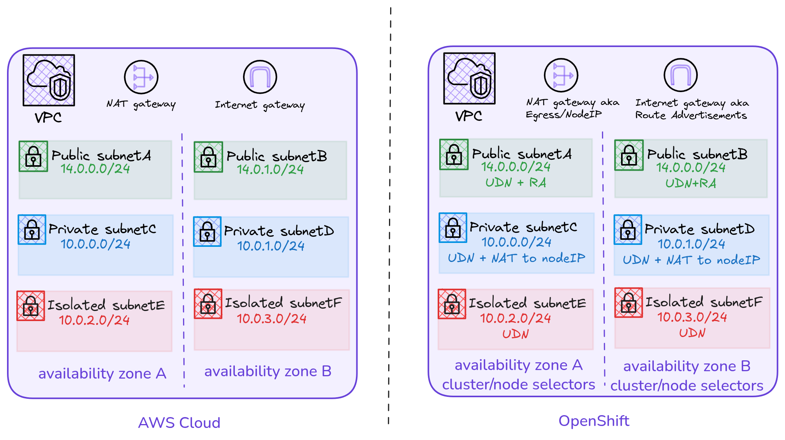
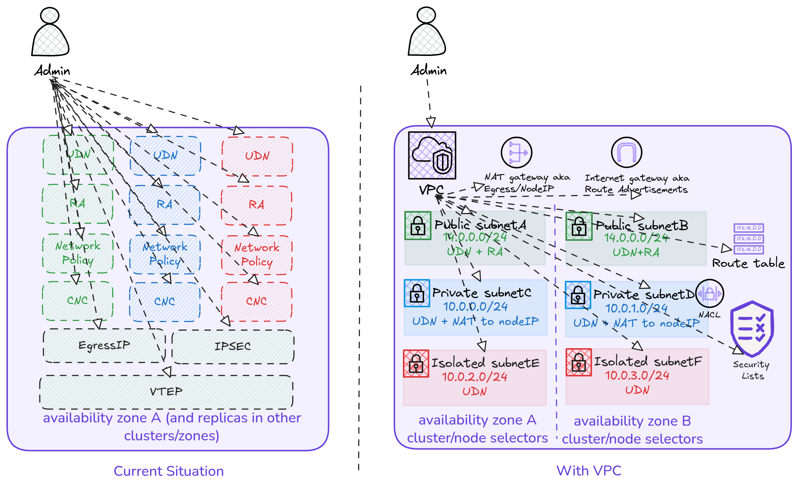
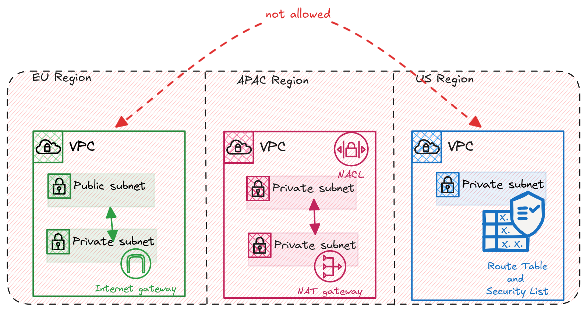
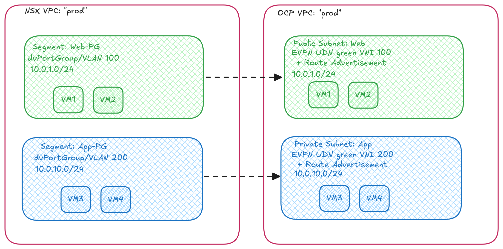
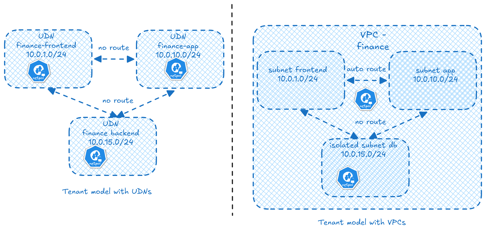
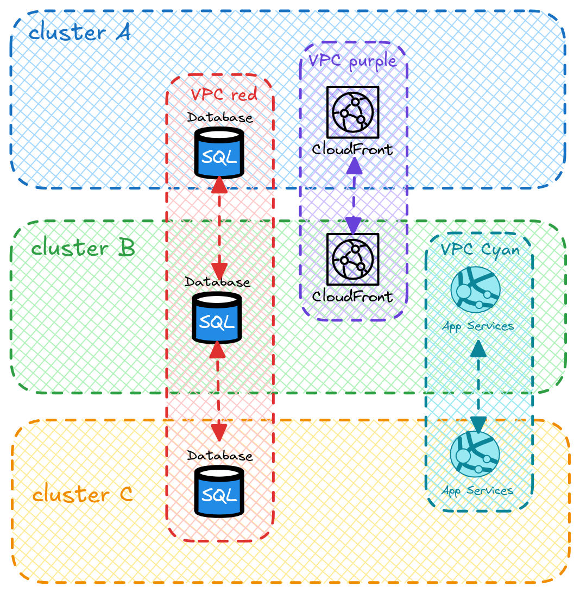
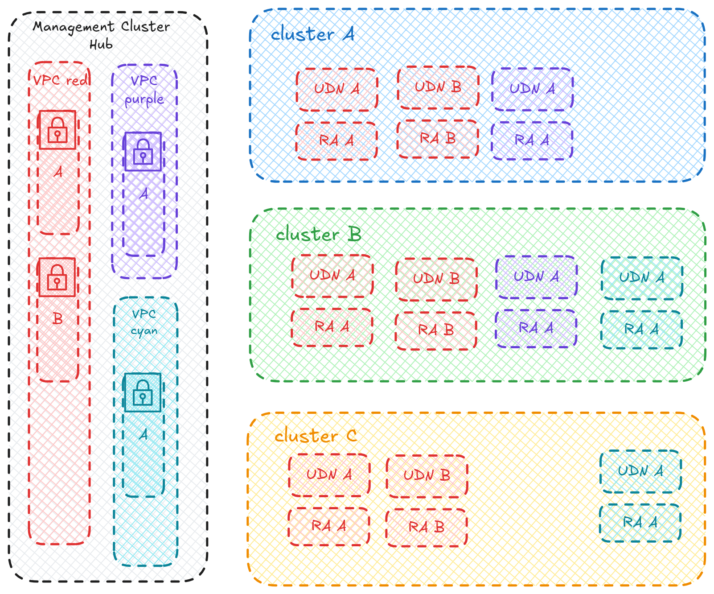

# Virtual Private Cloud (VPC)

## Summary

Virtual Private Clouds (VPCs) are a well defined concept for network
virtualization within a Cloud Environment. We are starting to see more
and more use-cases where users are trying to build out their own Private
Cloud environments and wish to extend this VPC concept in their Bare Metal
environment. This enhancement proposal aims to define what a VPC is on
OpenShift Bare Metal clusters.

## Motivation

Today, achieving VPC-like isolation on OpenShift requires manually creating and
wiring together multiple low-level networking primitives (C(UDN)s, CNCs,
RouteAdvertisements, EgressIPs, NetworkPolicies), and even then there are gaps
to achieving a full VPC (eg. Route Table). This is error-prone, provides no single
pane of glass for network health, and does not extend across cluster boundaries.
Users deploying distributed applications like CockroachDB need the ability to
extend networks between clusters and have policies, routes, and connectivity
follow wherever the network is present.

### User Stories

#### Infrastructure Networking

A VPC is a networking construct — it defines an isolated address space with
subnets, routing, and gateways. It exists in AWS, VMware NSX, Azure, and GCP
independently of any workload orchestrator. Kubernetes CRDs are an
implementation detail — the mechanism through which OVN-Kubernetes realizes
VPC intent.

* As a network engineer, I want to define VPCs using familiar networking
  concepts (CIDR blocks, subnets, public/private/isolated connectivity, NAT,
  route tables) without needing to learn Kubernetes-specific primitives, so
  that I can design and operate the network using the same mental model I use
  for AWS or on-prem infrastructure.

* As an infrastructure architect, I want the VPC to be the network boundary
  for any workload type — containers, VMs, or future runtimes — so that the
  network design is decoupled from the workload orchestration layer and
  survives platform evolution.



#### User Experience

Today an admin must create 6-8 individual resources (C(UDN), CNC,
RouteAdvertisements, EgressIP, NetworkPolicy, AdminNetworkPolicy) and wire
them together with correct labels. The VPC is the single input point.

* As a cluster administrator, I want to define a VPC — its address space,
  subnets, connectivity classes, and policies — in a single resource, so that
  the controller creates and manages all underlying networking primitives on
  my behalf.

* As an application developer, I want to deploy workloads into a namespace
  belonging to a VPC subnet without learning OVN-Kubernetes internals
  (C(UDN)s, CNCs, EgressIPs, RouteAdvertisements).

* As a cluster admin, I want intra-VPC routing to be automatic so that I do
  not have to manually wire connectivity between every pair of subnets in
  the same VPC.



Imagine if the admin needs to deal with 100s or 1000s of CRDs cross clusters!
Versus a controller takes care of programming the required constructs.

#### Sovereign Cloud and Regulated Industries

[Sovereign cloud](https://redhat.com/en/resources/elements-of-cloud-sovereignty-overview)
mandates data residency, deterministic network egress, and
isolation within national/regional boundaries. A VPC provides the network
isolation boundary that maps to a regulatory domain — all traffic, routing,
and policies are scoped to a well-defined perimeter.

* As a sovereign cloud operator, I want to define an isolated network boundary
  (VPC) per regulatory domain so that all workload traffic, egress paths, and
  security policies are confined within that boundary and auditable as a single
  unit.

* As a platform admin in a regulated industry (finance, healthcare,
  government), I want network isolation enforced at the VPC level — not just
  namespace-level NetworkPolicy — so that I can demonstrate to auditors that
  tenant networks are architecturally separated, not just policy-separated.

* As a sovereign cloud operator, I want to define custom routes per VPC
  (e.g. force all egress through an in-region inspection appliance, or route
  to on-prem endpoints within the regulatory boundary) so that I have
  deterministic control over traffic.



#### VMware Migration

End Users migrating from VMware (vSphere + NSX) expect network constructs
they already understand: isolated network segments, per-tenant subnets, NAT
gateways, firewall rules. The VPC maps directly to the NSX VPC / vSphere
portgroup model, providing a familiar landing zone for migrated VMs running
on OpenShift Virtualization (KubeVirt).

* As an infrastructure team migrating from VMware vSphere + NSX, I want to
  recreate my existing network segments (portgroups, NAT, firewall rules) as
  VPC subnets on OpenShift Virtualization, so that migrated VMs retain
  equivalent network isolation and connectivity without redesigning the network
  from scratch.

* As a VM owner migrating to OpenShift Virtualization, I want my VM to land
  in a VPC subnet with the same connectivity class (public,
  private, isolated) it had in VMware, so that the migration is transparent
  to applications.



#### Multi-Tenancy

UDNs provide per-namespace network isolation. VPC adds what UDN alone cannot:
a grouping boundary that spans multiple subnets, automatic routing between
subnets in the same tenant, unified address space management, and declarative
control over how each subnet reaches the outside world.

* As a platform team serving multiple tenants, I want each tenant to get a
  VPC with its own address space and subnets, so that tenant isolation is
  enforced at the network boundary — not just by NetworkPolicy rules that
  can be misconfigured.



#### Multi-Cluster / Distributed Applications

Distributed databases (CockroachDB, YugabyteDB) and service meshes require
network connectivity that spans cluster boundaries. The network — and
everything that influences its behaviour (policies, routes, connectivity) —
must be consistent wherever the application is deployed.

* As an OpenShift customer, I want to extend my VPC across clusters so that
  distributed applications (e.g. CockroachDB) can communicate over a shared
  network with consistent policies.

* As a cluster admin managing multiple clusters, I want to define my network
  intent once and have it rendered on every cluster where the VPC is present,
  rather than manually replicating configuration across clusters.



### Goals

- Define the VPC API and the VPC controller that translates VPC
  intent into lower-level OVN-Kubernetes constructs.
- Define vpc-CLI and console click options which will act as the user
  interface to modelling VPCs
- Support VPCs on single as well as multiple clusters on baremetal environments
- VPC features (for definitions see [Introduction](#introduction)):
  - subnets (public,private,isolated,vpn)
  - route tables
  - internet and NAT gateways
  - security groups and NACLs
- Design implementation constructs in OVN-Kubernetes where required
  - Preserve backward compatibility of existing OVN-Kubernetes APIs
- VPCs are modelled assuming EVPN as the transport fabric.

### Future Goals

- Support VPCs on single as well as multiple clusters on cloud environments
- VPC features (for definitions see [Introduction](#introduction)):
  - route server
  - vpn connections
  - vpc peering
  - transit gateway
- Add support for VPCs on other types of transport like GENEVE or pure BGP or
  other OVN encap types.
- Sophisticated SNAT for Private subnets via EgressIP. The initial
  implementation uses node IPs for outbound NAT to reduce complexity. A
  future iteration will introduce EgressIP-based SNAT to provide dedicated,
  stable egress addresses per subnet — enabling firewall allowlisting,
  audit trails, and per-AZ egress affinity.
- VPC-level `cidrBlocks` with automatic subnet CIDR allocation. Instead of
  users specifying a CIDR per subnet, a VPC-level CIDR block would allow the
  IPAM allocator to automatically carve out subnet CIDRs from the VPC's
  address space — similar to how AWS VPCs define an overarching CIDR from
  which subnets are allocated.

### Non-Goals

N/A

## Introduction

A **Virtual Private Cloud (VPC)** is a logically isolated virtual network within
a cloud environment. It gives the owner complete control over IP address ranges,
subnets, route tables, and network gateways. VPCs are a foundational construct
in both public and private clouds:

- [AWS VPC](https://docs.aws.amazon.com/vpc/latest/userguide/how-it-works.html) --
  Amazon's VPC provides an isolated section of the AWS cloud with user-defined
  IP ranges, subnets across Availability Zones, route tables, internet and NAT
  gateways, security groups, and VPC peering.
- [Google Cloud VPC](https://cloud.google.com/vpc/docs/overview) --
  A global VPC spanning all regions with regional subnets, firewall rules,
  routes, Cloud VPN / Cloud Interconnect for hybrid connectivity, and VPC
  peering for cross-project communication.
- [Azure Virtual Network (VNet)](https://learn.microsoft.com/en-us/azure/virtual-network/virtual-networks-overview) --
  The foundational private network in Azure, with user-defined address spaces,
  subnets, Network Security Groups, route tables, VNet peering, and VPN / 
  ExpressRoute gateways for on-premises connectivity.
- [VMware NSX VPC](https://techdocs.broadcom.com/us/en/vmware-cis/nsx/vmware-nsx/4-2/administration-guide/nsx-multi-tenancy/nsx-virtual-private-clouds.html) --
  NSX VPCs provide a self-service multi-tenant networking model with independent
  routing domains, Layer 2 subnets, Tier-0/VRF gateway connectivity, DHCP, and
  IP address management. At the vSphere layer, VMs attach to networks via
  [distributed portgroups](https://techdocs.broadcom.com/us/en/vmware-cis/vsphere/vsphere/8-0/vsphere-networking-8-0/basic-networking-with-vnetwork-distributed-switches/dvport-groups.html)
  which define per-port VLAN, security, and traffic shaping policies on a
  distributed virtual switch.

The following subsections define the core constructs that make up a VPC.

### Subnets

A **subnet** is a segment of a VPC's IP address range where workloads are placed.
Subnets provide isolation within the VPC and can be classified by their
connectivity:

- **Public subnet**: Has a route to an internet gateway; resources are externally
  reachable.
- **Private subnet**: No direct internet route; uses NAT for outbound access.
- **Isolated subnet**: No routes to destinations outside the VPC.
- **VPN-only subnet**: Routes traffic through a VPN connection.

See: [AWS Subnets](https://docs.aws.amazon.com/vpc/latest/userguide/configure-subnets.html),
[NSX VPC Subnets](https://techdocs.broadcom.com/us/en/vmware-cis/nsx/vmware-nsx/4-2/administration-guide/nsx-multi-tenancy/nsx-virtual-private-clouds.html)

### Route Tables

A **route table** contains rules that determine where network traffic is
directed. Every subnet is associated with a route table. Routes specify a
destination CIDR and a target (e.g. internet gateway, NAT gateway, peering
connection). The most specific matching route (longest prefix match) wins.

In a VPC, all subnets automatically have a "local" route that enables
intra-VPC communication -- subnets within the same VPC can always reach each
other.

See: [AWS Route Tables](https://docs.aws.amazon.com/vpc/latest/userguide/VPC_Route_Tables.html)

### Internet Gateway / NAT Gateway

An **internet gateway** enables communication between VPC resources and the
public internet (for public subnets). A **NAT gateway** provides outbound
internet access for resources in private subnets without exposing them to
inbound internet traffic.

See: [AWS Internet Gateway](https://docs.aws.amazon.com/vpc/latest/userguide/working-with-igw.html)

### Security Groups

A **security group** is a stateful virtual firewall that controls inbound and
outbound traffic at the instance level. Rules specify allowed protocols, ports,
and source/destination CIDRs. Because they are stateful, return traffic is
automatically allowed.

See: [AWS Security Groups](https://docs.aws.amazon.com/vpc/latest/userguide/vpc-security-groups.html)

### Network ACLs

A **network ACL (NACL)** is a stateless firewall at the subnet level. Unlike
security groups, NACLs evaluate rules in order (by rule number) and require
explicit allow/deny for both inbound and outbound traffic.

See: [AWS Network ACLs](https://docs.aws.amazon.com/vpc/latest/userguide/nacl-basics.html)

### VPC Peering

A **VPC peering connection** is a networking connection between two VPCs that
enables routing traffic between them using private IP addresses. It is not a
gateway or VPN -- there is no single point of failure or bandwidth bottleneck.
Peered VPCs cannot have overlapping CIDR blocks.

See: [AWS VPC Peering](https://docs.aws.amazon.com/vpc/latest/peering/vpc-peering-basics.html)

### Route Server

A **route server** enables dynamic routing within a VPC by exchanging routes
with network appliances via BGP. It automatically updates VPC route tables
when devices fail, providing routing fault tolerance without manual
intervention.

See: [AWS VPC Route Server](https://docs.aws.amazon.com/vpc/latest/userguide/dynamic-routing-route-server.html)

### VPN Connections

A **VPN connection** provides encrypted IPsec connectivity between a VPC and
an on-premises network or another VPC over the public internet. AWS supports
Site-to-Site VPN (two redundant tunnels per connection) and Client VPN
(OpenVPN-based remote access).

See: [AWS VPN Connections](https://docs.aws.amazon.com/vpc/latest/userguide/vpn-connections.html)

### Transit Gateway

A **transit gateway** acts as a central hub for routing traffic between
multiple VPCs, VPN connections, and on-premises networks. It simplifies
network architecture by avoiding the need for full-mesh peering between
every pair of VPCs.

See: [AWS Transit Gateway](https://docs.aws.amazon.com/vpc/latest/tgw/what-is-transit-gateway.html)

## Proposal

We plan to take a bottom-up approach at solving this for a single-cluster
first, and then extrapolating that for multi-cluster scenarios.

### Assumptions

- The physical network must support EVPN (BGP peering between cluster nodes
  and the fabric) as an infrastructure prerequisite.
- Each VPC subnet is modelled as a **flat Layer 2 network** spanning the requested
  availability zone.
- Pod/VM IPs are allocated from the subnet's CIDR as a flat pool, not carved
  into per-node slices.
- Layer 3 topologies and Geneve overlay may be supported in the future but are
  not in scope for the initial implementation.

### Single Cluster

In a single cluster, a VPC is an isolation boundary that groups one or more
subnets into a logically isolated network with its own address space,
automatic intra-VPC routing, and well-defined points of external connectivity.

```
  ┌───────────────────────────────────┐       ┌──────────────────────────┐
  │  VPC: production                  │       │  VPC: staging            │
  │  cidrBlocks: [10.0.0.0/16]        │       │  cidrBlocks: [10.1.0.0/16]
  │                                   │       │                          │
  │  subnets:                         │       │  subnets:                │
  │    web-a  (Public,  10.0.1.0/24)  │       │    app (Private,         │
  │    web-b  (Public,  10.0.2.0/24)  │       │         10.1.0.0/24)     │
  │    app-a  (Private, 10.0.10.0/24) │       │                          │
  │    app-b  (Private, 10.0.11.0/24) │       └──────────┬───────────────┘
  │    db-a   (Isolated,10.0.20.0/24) │                  │
  │    db-b   (Isolated,10.0.21.0/24) │                  │ creates
  └──┬────┬────┬────┬────┬────┬───────┘                  │ ns + UDN
     │    │    │    │    │    │                           ▼
     │    │    │    │    │    │ creates          ┌───────────────┐
     │    │    │    │    │    │ ns + UDN         │ns: staging-app│
     ▼    ▼    ▼    ▼    ▼    ▼                  │UDN: app       │
  ┌─────┐┌─────┐┌─────┐┌─────┐┌─────┐┌─────┐     │Private        │
  │ns:  ││ns:  ││ns:  ││ns:  ││ns:  ││ns:  │     │L2 UDN EVPN    │
  │prod-││prod-││prod-││prod-││prod-││prod-│     │/24            │
  │web-a││web-b││app-a││app-b││db-a ││db-b │     └───────────────┘
  │     ││     ││     ││     ││     ││     │
  │UDN: ││UDN: ││UDN: ││UDN: ││UDN: ││UDN: │
  │web-a││web-b││app-a││app-b││db-a ││db-b │
  │     ││     ││     ││     ││     ││     │
  │Pub. ││Pub. ││Priv.││Priv.││Isol.││Isol.│
  │L2   ││L2   ││L2   ││L2   ││L2   ││L2   │
  │EVPN ││EVPN ││EVPN ││EVPN ││EVPN ││EVPN │
  │/24  ││/24  ││/24  ││/24  ││/24  ││/24  │
  │+ RA ││+ RA ││+SNAT││+SNAT││     ││     │
  └─────┘└─────┘└─────┘└─────┘└─────┘└─────┘

  Intra-VPC routing: automatic "local" route between all member
  subnets except "Isolated" ones. No manual wiring required.
```

The following table maps VPC constructs across AWS, OVN-Kubernetes, and
VMware NSX. The OVN-Kubernetes column shows what the VPC controller creates
for each construct. Items marked *(future)* are not in scope for the initial
implementation (see [Goals](#goals) and [Future Goals](#future-goals)).

| Feature | AWS VPCs | VMware NSX | OpenShift (OVN-Kubernetes) |
|---|---|---|---|
| **Tenancy** | AWS Account | NSX Project (Tenant) | Namespace (1:1 with subnet) |
| **Workload Attachment** | Subnet | NSX Segment (L2) / Subnet (L3) | K8s Namespace/UDN (EVPN L2 only) |
| **Fixed CIDR** | VPC CIDR block | IP Blocks allocated per VPC | *(future)* — VPC-level `cidrBlocks` with automatic subnet allocation from that range |
| **Multiple Subnets** | Yes | NSX Segments within a VPC | VPC defines subnets; each subnet specifies its own CIDR, becomes a ns + UDN (L2 EVPN) |
| **Public Subnets** | Subnet + IGW + Route + Public IP | Subnet type: Public — routed to external via Tier-0/Tier-1 | ns + UDN (L2 EVPN) + RouteAdvertisements (RA) |
| **Private Subnets** | Subnet + NAT GW + Route | Subnet type: Private — SNAT via Tier-0/Tier-1 gateway | ns + UDN (L2 EVPN) + nodeIP SNAT |
| **Isolated Subnets** | Subnet (no routes to IGW/NAT) | Subnet type: Isolated — no uplink, intra-VPC only | ns + UDN (L2 EVPN) with no nodeIP SNAT |
| **VPN-Only Subnets** | Subnet + VPN GW + Route | N/A — VPN handled at Tier-0 gateway level | ns + UDN (L2 EVPN) + IPsec north-south |
| **Internet Gateway** | IGW resource + route entry | Tier-0 gateway uplink to physical network | RouteAdvertisements (BGP export) |
| **NAT Gateway** | NAT GW + EIP + route entry | SNAT rule on Tier-0/Tier-1 gateway | Node IP SNAT (EgressIP in future) |
| **Route Tables** | Route table + route entries | Static routes on Tier-0/Tier-1 gateway | RouteTable CRD (TBD) — custom static routes |
| **Security Groups** | Stateful, per-instance | Distributed Firewall (DFW) rules + Security Groups | NetworkPolicy / AdminNetworkPolicy (stateful ACLs) |
| **NACLs** | Stateless, per-subnet, ordered | Gateway Firewall rules on Tier-0/Tier-1 | NetworkPolicy / AdminNetworkPolicy (stateless ACLs) |
| **Route Server** | Yes | BGP peering on Tier-0 gateway | *(future)* |
| **VPC Peering** | Peering connection + routes | Inter-VPC routing via Transit / inter-VRF | *(future)* — CNC with `vpcSelector`? |
| **VPN Connections** | VPN GW + tunnel config | IPsec VPN service on Tier-0 gateway | *(future)* |
| **Transit Gateway** | Hub-and-spoke router | Tier-0 gateway (hub-and-spoke topology) | *(future)* |

### Multiple Clusters

In a multi-cluster deployment, the VPC must span cluster boundaries so that
subnets, gateway, route tables, security groups are rendered on every
cluster where the VPC is present. The proposed model is **hub-spoke**.

```
  ┌────────────────────────────────────────────────────────────┐
  │                      Hub Cluster                           │
  │                                                            │
  │  VPC: production                                           │
  │    subnets:                                                │
  │    - web-a  (Public,  10.0.1.0/24)                         │
  │    - web-b  (Public,  10.0.2.0/24)                         │
  │    - app-a  (Private, 10.0.10.0/24)                        │
  │    - app-b  (Private, 10.0.11.0/24)                        │
  │    - db-a   (Isolated,10.0.20.0/24)                        │
  │    - db-b   (Isolated,10.0.21.0/24)                        │
  │                                                            │
  │  NetworkPolicy, AdminNetworkPolicy, RouteTable,            │
  │  RouteAdvertisements                                       │
  │                                                            │
  │  ┌──────────────────────────────────────────────────┐      │
  │  │  VPC Controller                                  │      │
  │  │  - Watches VPC + associated resources            │      │
  │  │  - Renders ns + UDNs, policies, RA               │      │
  │  │    for hub and all spokes                        │      │
  │  │  - Applies rendered resources to spokes          │      │
  │  │    via spoke kubeconfig (direct API access)      │      │
  │  └────────┬─────────────────────────┬───────────────┘      │
  │           │                         │                      │
  │  ┌────────┴───────────────┐         │                      │
  │  │ ovnkube-cluster-manager│         │                      │
  │  │ ovnkube-controller     │         │                      │
  │  │  - Renders UDNs locally│         │                      │
  │  │  - Programs OVN flows  │         │                      │
  │  └────────────────────────┘         │                      │
  └─────────────────────────────────────┘──────────────────────┘
                          │             │
           apply via      │             │  apply via
           kubeconfig     │             │  kubeconfig
           (UDNs, RA,     │             │  (UDNs, RA,
            policies)     │             │   policies)
                          ▼             ▼
  ┌─────────────────────────────┐  ┌─────────────────────────────┐
  │     Spoke Cluster A         │  │     Spoke Cluster B         │
  │                             │  │                             │
  │  Rendered resources applied │  │  Rendered resources applied │
  │  directly by hub controller │  │  directly by hub controller │
  │                             │  │                             │
  │  ┌────────────────────────┐ │  │  ┌────────────────────────┐ │
  │  │ ovnkube-cluster-manager│ │  │  │ ovnkube-cluster-manager│ │
  │  │ ovnkube-controller     │ │  │  │ ovnkube-controller     │ │
  │  │  - Renders UDNs        │ │  │  │  - Renders UDNs        │ │
  │  │  - Programs OVN flows  │ │  │  │  - Programs OVN flows  │ │
  │  └────────────────────────┘ │  │  └────────────────────────┘ │
  │                             │  │                             │
  │  UDNs:                      │  │  UDNs:                      │
  │  - production-web-a         │  │  - production-web-a         │
  │  - production-web-b         │  │  - production-web-b         │
  │  - production-app-a         │  │  - production-app-a         │
  │  - production-app-b         │  │  - production-app-b         │
  │  - production-db-a          │  │  - production-db-a          │
  │  - production-db-b          │  │  - production-db-b          │
  │                             │  │                             │
  │  NetworkPolicy, ANP         │  │  NetworkPolicy, ANP         │
  │  RouteTable, RouteAdvert.   │  │  RouteTable, RouteAdvert.   │
  └─────────────────────────────┘  └─────────────────────────────┘
```

**Pros and cons of hub-only rendering:**

| | |
|---|---|
| **Pro: Simpler spoke footprint** | No VPC-specific controller to deploy, upgrade, or monitor on spokes. Spokes run standard ovnkube only. |
| **Pro: Single point of logic** | All VPC-to-resource translation happens in one place. Easier to debug, audit, and upgrade. |
| **Pro: Easier upgrades** | Upgrade VPC controller once on the hub, not across N spokes. |
| **Con: Hub is single management point** | If the hub goes down, no new VPC changes reach spokes. Existing resources continue to work (ovnkube operates independently) but drift cannot be corrected until the hub recovers. |
| **Con: Hub must know per-cluster details** | The hub renders cluster-specific resources and holds kubeconfig secrets for every spoke. This grows in complexity as clusters diverge. |
| **Con: No domain-aware self-healing on spokes** | If a resource is deleted on a spoke, recovery depends on the hub controller's reconciliation loop detecting drift, not a local VPC-aware controller. |

See [Alternative: Hub-Spoke with VPC Controller on Spokes](#alternative-hub-spoke-with-vpc-controller-on-spokes-multi-cluster)
for the alternative approach where spokes run their own VPC controller.

#### How it works

1. **Single source of truth**: The VPC resource and all associated high-level
   constructs (security groups, NACLs, route tables, subnet definitions) are
   defined on the **hub cluster**. This is the only place users create or
   modify VPC configuration.

2. **External IPAM**: OVN-Kubernetes's built-in IPAM is disabled for VPC
   subnets. An external, pluggable IPAM controller manages each subnet's CIDR
   as a flat pool and assigns IPs to pods directly via annotations. See
   [IPAM](#ipam) for details.

3. **Hub renders and applies all resources**: The VPC controller on the hub
   renders the full set of resources for each cluster — namespaces, UDNs
   (L2 EVPN), RouteAdvertisements (Public), NetworkPolicies,
   AdminNetworkPolicies, and RouteTables. For the hub itself, resources are
   created directly via the local API. For spokes, the hub controller holds
   a **kubeconfig secret per spoke cluster** and applies rendered resources
   directly to each spoke's API server (`CreateOrUpdate` / `Delete`).



4. **Spokes receive standard Kubernetes resources**: Spoke clusters see only
   plain Kubernetes resources (UDN, RouteAdvertisements, NetworkPolicy, etc.)
   applied by the hub. They do not need to understand the VPC abstraction.

   **TBD — Decide during reviews:** The multi-cluster client implementation
   for the VPC controller has two options:

   - **Option A: Hypershift style (manual client management).** The VPC
     controller manually builds a `controller-runtime` `client.Client` per
     spoke from kubeconfig secrets stored on the hub — the same pattern used
     by Hypershift's `control-plane-operator`. The controller owns client
     caching, kubeconfig rotation, and unreachable-cluster handling. This is
     battle-tested (Hypershift since OCP 4.10+) but requires more
     boilerplate.

   - **Option B: [multicluster-runtime](https://github.com/multicluster-runtime/multicluster-runtime)
     library.** A SIG-Multicluster-blessed extension to `controller-runtime`
     (`sigs.k8s.io/multicluster-runtime`) that provides dynamic fleet
     discovery via a `Provider` interface, automatic per-cluster client
     lifecycle management, and built-in sharding across controller replicas
     (Rendezvous Hashing). The VPC controller writes a standard reconciler
     and the library routes it to the correct spoke client. Less boilerplate,
     but a newer dependency (v0.23.x, 2026).

   - **Option C: [ACM ManifestWork](https://open-cluster-management.io/docs/concepts/work-distribution/manifestwork/).**
     The hub VPC controller creates `ManifestWork` resources in each spoke's
     cluster namespace on the hub. A work agent running on each spoke watches
     its ManifestWork and applies the embedded manifests locally. The spoke
     agent reports per-resource status back to the hub via `resourceStatus`
     and `FeedbackRules`, giving built-in observability. However, this
     requires ACM / Open Cluster Management to be deployed and a work agent
     on every spoke — adding an infrastructure dependency not all deployments
     will have.

   | | Hypershift style | multicluster-runtime | ACM ManifestWork |
   |---|---|---|---|
   | Cluster discovery | Manual (watch kubeconfig secrets) | Automatic via Provider | ACM ManagedCluster / Placement |
   | Client lifecycle | Controller manages | Library manages | Work agent on spoke manages |
   | Kubeconfig rotation | Controller handles | Provider handles | ACM handles |
   | Sharding | Not built in (single leader) | Built in (Rendezvous Hashing) | N/A (spoke agent pulls) |
   | Status feedback | Controller reads back from spoke | Controller reads back from spoke | Built-in (resourceStatus, FeedbackRules) |
   | Hub-to-spoke model | Hub pushes (direct API) | Hub pushes (direct API) | Spoke pulls from hub |
   | Maturity | Battle-tested in Hypershift | Newer, SIG-blessed | Mature (ACM GA) |
   | Dependency | controller-runtime only | + multicluster-runtime | ACM + work agent on every spoke |

5. **ovnkube handles the rest on spokes**: Once the rendered UDN, policy, and
   route resources land on a spoke cluster, ovnkube-cluster-manager and
   ovnkube-controller process them as normal — no VPC-specific logic needed.

6. **Cross-cluster connectivity**: The UDNs on each cluster are connected via
   the underlying EVPN fabric. The VPC controller ensures the same subnets
   exist on each cluster so that workloads like CockroachDB can communicate
   across cluster boundaries on the same network with real, routable pod IPs.

7. **Status and observability**: The VPC controller on the hub reads the
   status of rendered resources on each spoke (via the same client used to
   apply them) and aggregates per-cluster health into the VPC `.status`.
   This gives users a single pane of glass — the VPC resource on the hub
   reflects whether subnets, policies, and routes are healthy across all
   clusters. Errors (unreachable spoke, failed UDN reconciliation, policy
   rejection) are surfaced as conditions on the VPC status.

#### IPAM

IP address management for VPC subnets is handled by an **external IPAM
controller**, not by OVN-Kubernetes's built-in IPAM. OVN-K IPAM is turned
off for VPC subnets.

**How it works:**

- Each VPC has a pluggable IPAM plugin. The plugin holds one flat allocator
  per subnet.
- The allocator manages the full subnet CIDR as a single flat pool — IPs are
  handed out individually on demand, not pre-partitioned per cluster or per
  node. This avoids the address space wastage that comes with hard-splitting
  CIDRs across clusters.
- When a pod is scheduled, the external IPAM assigns an IP from the
  appropriate subnet pool and **annotates the pod directly**. OVN-K reads the
  annotation and programs the datapath accordingly.
- In multi-cluster deployments, the same IPAM instance (or a coordinated set
  of instances) serves all clusters from the same flat pool, ensuring global
  uniqueness without per-cluster CIDR splits.

**Reference implementation:**

A lightweight reference IPAM implementation ships with the VPC controller —
similar in spirit to a static DHCP server. It is simple, stateless-friendly,
and scales well across clusters. Users can replace it with their own IPAM
(e.g. Infoblox, NetBox, or a custom allocator) by implementing the plugin
interface.

**Example:** A Private subnet `app-a` with CIDR `10.0.10.0/24` spanning two
clusters:

- Pod on Cluster A gets `10.0.10.3` (assigned by IPAM, annotated on pod)
- Pod on Cluster B gets `10.0.10.4` (assigned by IPAM, annotated on pod)
- No per-cluster CIDR split — both draw from the same `/24` pool

Pods communicate with their real IPs across clusters without NAT — important
for applications like CockroachDB that require stable, routable pod addresses.

#### Availability Zones and Subnet Pinning

In AWS, each subnet resides in a single Availability Zone. We support the
same model: each VPC subnet can optionally be tied to an Availability Zone
via the `availabilityZone` field — a nested struct (following the same
pattern as ANP's `NamespacedPod`) that groups cluster and node selection
together. If omitted, the subnet spans all clusters and all nodes (no AZ
pinning).

The `AvailabilityZone` struct contains two selectors:
- **`clusterSelector`** (required within the struct): selects which
  cluster(s) the subnet is placed on in multi-cluster deployments.
- **`nodeSelector`** (optional): selects which nodes within each target
  cluster the subnet's UDN is scheduled to. This pins the subnet to a
  failure domain. If empty, the entire cluster is the AZ.

The existing Kubernetes label `topology.kubernetes.io/zone` is the natural
fit for `nodeSelector` — users label their nodes with zone values (e.g.
`rack-a`, `rack-b`) and the subnet's `nodeSelector` matches on that. We may
also provide well-known VPC zone labels (e.g. `vpc.k8s.ovn.org/zone=az-1`)
for environments where the Kubernetes topology label is not set or where a
VPC-specific zone model is preferred. Ultimately, the choice of label is up
to each user/deployment.

For example, the `production` VPC might have:
- `web-a` → `availabilityZone: { clusterSelector: region=us-east, nodeSelector: zone=rack-a }`
- `web-b` → `availabilityZone: { clusterSelector: region=us-east, nodeSelector: zone=rack-b }`

This gives AWS-like zone-aware subnet placement for high availability.

**How it works — three layers of pinning:**

1. **Cluster selection** (`clusterSelector`): In multi-cluster deployments,
   the hub VPC controller determines which spoke clusters a subnet is placed
   on. The hub maintains a cluster inventory — either label-bearing cluster
   objects or kubeconfig secrets with labels (e.g.
   `topology.kubernetes.io/region=us-east`). The subnet's `clusterSelector`
   filters against these labels and the hub only creates the namespace + UDN
   on matching clusters. If using
   [multicluster-runtime](https://github.com/multicluster-runtime/multicluster-runtime),
   the library's Provider interface handles cluster discovery and the
   `clusterSelector` maps to the Provider's cluster filtering.

2. **Node selection** (`nodeSelector`): Within each cluster, the VPC
   controller sets a node selector on the subnet's namespace to ensure all
   pods schedule on AZ nodes. Two mechanisms are available:
   - **OpenShift project node selector**: The annotation
     `openshift.io/node-selector: topology.kubernetes.io/zone=rack-a` on the
     namespace. This is the
     [OpenShift project node selector](https://docs.redhat.com/en/documentation/openshift_container_platform/latest/html/nodes/controlling-pod-placement-onto-nodes-scheduling#nodes-scheduler-node-selectors-project_nodes-scheduler-node-selectors)
     feature.
   - **PodNodeSelector admission plugin** (upstream Kubernetes): The
     annotation `scheduler.alpha.kubernetes.io/node-selector` on the
     namespace injects a `nodeSelector` into every pod created in it.

   Either way, the result is the same: pods in the subnet namespace only
   schedule on nodes matching the AZ label.

3. **Dynamic UDN Node Allocation**: With
   [OKEP-5552](https://ovn-kubernetes.io/okeps/okep-5552-dynamic-udn-node-allocation/)
   enabled, OVN-Kubernetes only renders the UDN on nodes where pods actually
   exist. Combined with the namespace node selector, this means the UDN is
   only configured on AZ nodes — no wasted VTEP/VNI resources, OVN switches,
   or VRFs on irrelevant nodes. This is a natural complement to subnet
   pinning and significantly improves scale when many subnets are pinned to
   different AZs.

### Approach

We propose introducing a new **VPC** CRD (cluster-scoped) and a new
**VPC controller** implemented in a new repository under the
ovn-kubernetes organization. It acts as a translation layer:
it watches VPC resources and automatically creates and
reconciles the underlying OVN-Kubernetes CRDs needed to realize the VPC. In
multi-cluster deployments, the operator also synchronizes network
configuration, policies, and routes across clusters.

The VPC controller's lifecycle management will be done through Cluster Network Operator
on OpenShift. [TBD] The vpc controller pods will just run on the control plane
of the cluster (management clustr in case of multiple clusters) and create the relevant
network constructs in OVN-Kubernetes.

When a user creates a VPC, the operator:

- Validates that subnet CIDRs fall within the VPC's address space
  (**CIDR governance**)
- Creates the underlying C(UDN)s for each subnet defined in the VPC spec
- Sets up automatic routing between all subnets in the VPC (the equivalent of
  the implicit "local" route in AWS), so that subnets can communicate without
  the user having to manually create interconnect resources
- Aggregates status from member C(UDN)s into a single VPC status, giving the
  user one place to check the health of their network
- Supports day-2 expansion: secondary CIDR blocks can be appended to the VPC to
  grow the address space, and new subnets can be added within those ranges

The controller maps VPC intent to the following existing and new OVN-Kubernetes
resources, none of which users need to create or manage directly:

| VPC Concept | Underlying OVN-K Resource | Notes |
|---|---|---|
| Subnet | C(UDN) (existing, unchanged) | Each C(UDN) is a subnet; heterogeneous topologies (L2/L3) and transports (Geneve/EVPN) within the same VPC |
| Intra-VPC routing | CNC (existing) | Automatic "local" route between all member C(UDN)s |
| VPC peering | CNC (existing, extended with `vpcSelector`) | Transit fabric between VPCs |
| Custom routes | RouteTable (new) | Programs VRF (LGW) or GR (SGW) |
| Public subnets | RouteAdvertisements (existing) | BGP export |
| NAT / IGW | Node IP SNAT; EgressIP *(future)* | Outbound SNAT |
| Security groups | NetworkPolicy (existing) | Stateful pod-level firewall |
| NACLs | AdminNetworkPolicy (existing) | Cluster-scoped ordered rules |

Users can still create bare C(UDN)s and CNCs directly without a VPC -- the
existing OVN-Kubernetes workflows are fully preserved. The VPC layer is
additive. The full API definitions are in the [API Extensions](#api-extensions)
section.

### Workflow Description

Explain how the user will use the feature. Be detailed and explicit.
Describe all of the actors, their roles, and the APIs or interfaces
involved. Define a starting state and then list the steps that the
user would need to go through to trigger the feature described in the
enhancement. Optionally add a
[mermaid](https://github.com/mermaid-js/mermaid#readme) sequence
diagram.

Use sub-sections to explain variations, such as for error handling,
failure recovery, or alternative outcomes.

For example:

**cluster creator** is a human user responsible for deploying a
cluster.

**application administrator** is a human user responsible for
deploying an application in a cluster.

1. The cluster creator sits down at their keyboard...
2. ...
3. The cluster creator sees that their cluster is ready to receive
   applications, and gives the application administrator their
   credentials.

See
https://github.com/openshift/enhancements/blob/master/enhancements/workload-partitioning/management-workload-partitioning.md#high-level-end-to-end-workflow
and https://github.com/openshift/enhancements/blob/master/enhancements/agent-installer/automated-workflow-for-agent-based-installer.md for more detailed examples.

### API Extensions

This enhancement introduces the following API extensions:

#### VPC CRD (new)

A multi-cluster-scoped CRD that defines an isolated network boundary.

```go
// VPC defines an isolated network boundary that groups one or more
// ClusterUserDefinedNetworks (subnets) into a logically isolated network
// with its own address space and automatic intra-VPC routing.
//
// +genclient
// +genclient:nonNamespaced
// +k8s:deepcopy-gen:interfaces=k8s.io/apimachinery/pkg/runtime.Object
// +kubebuilder:resource:path=vpcs,scope=Cluster,shortName=vpc,singular=vpc
// +kubebuilder:object:root=true
// +kubebuilder:subresource:status
type VPC struct {
	metav1.TypeMeta   `json:",inline"`
	metav1.ObjectMeta `json:"metadata,omitempty"`

	// +kubebuilder:validation:Required
	// +required
	Spec VPCSpec `json:"spec"`

	// +optional
	Status VPCStatus `json:"status,omitempty"`
}

// VPCSpec defines the desired state of a VPC.
type VPCSpec struct {
	// subnets defines the subnets within this VPC. The VPC controller
	// creates a ClusterUserDefinedNetwork for each entry. Subnets
	// within the same VPC can have different topologies and transports.
	//
	// +kubebuilder:validation:Required
	// +kubebuilder:validation:MinItems=1
	// +required
	Subnets []VPCSubnet `json:"subnets"`
}

// SubnetType defines the external connectivity class of a VPC subnet.
// +kubebuilder:validation:Enum=Public;Private;Isolated;VPNOnly
type SubnetType string

const (
	SubnetTypePublic   SubnetType = "Public"
	SubnetTypePrivate  SubnetType = "Private"
	SubnetTypeIsolated SubnetType = "Isolated"
	SubnetTypeVPNOnly  SubnetType = "VPNOnly"
)

// VPCSubnet defines a subnet within the VPC. The VPC controller creates
// a namespace and a UDN (L2 EVPN) from this definition.
// Each subnet maps 1:1 to a single namespace.
type VPCSubnet struct {
	// name is the subnet name. The resulting namespace and UDN are named
	// "<vpc-name>-<subnet-name>".
	//
	// TODO: determine max length constraints — Kubernetes metadata.name
	// is limited to 253 characters (DNS subdomain) and namespace names
	// to 63 characters (DNS label). The combined "<vpc-name>-<subnet-name>"
	// must respect these limits. Consider CEL validation to limit vpc name
  // and subnet name equally.
	//
	// +kubebuilder:validation:Required
	// +required
	Name string `json:"name"`

	// cidrs defines the IP address range(s) for this subnet.
	// At most two CIDRs may be specified: one IPv4 and one IPv6
	// for dual-stack. If a single CIDR is provided, the subnet is
	// single-stack (v4 or v6).
	//
	// +kubebuilder:validation:Required
	// +kubebuilder:validation:MinItems=1
	// +kubebuilder:validation:MaxItems=2
	// +listType=atomic
	// +required
	//
	// +kubebuilder:validation:XValidation:rule="self.size() <= 1 || (self.exists(c, c.contains(':')) && self.exists(c, !c.contains(':')))",message="when two CIDRs are specified they must be from different address families (one IPv4, one IPv6)"
	CIDRs []CIDR `json:"cidrs"`

	// type defines the subnet type which determines its external
	// connectivity and the resources the VPC controller provisions:
	//
	// - Public: externally reachable. Controller creates RouteAdvertisements
	//   (BGP) to export subnet routes to the physical network.
	// - Private: no direct external reachability. Outbound traffic is SNATed
	//   using node IPs so pods can reach external destinations. (EgressIP-based
	//   SNAT with dedicated egress addresses is a future goal.)
	// - Isolated: no routes outside the VPC. No RouteAdvertisements, no
	//   EgressIP. No intra-VPC routing. Traffic is confined to the subnet.
	// - VPNOnly: traffic exits the VPC exclusively through a VPN connection.
	//   No internet-facing routes. Controller configures IPsec or similar
	//   north-south encryption for this subnet's traffic.
	//
	// Defaults to Private if not specified.
	//
	// +optional
	// +kubebuilder:default=Private
	// +kubebuilder:validation:Enum=Public;Private;Isolated;VPNOnly
	Type SubnetType `json:"type,omitempty"`

	// availabilityZone optionally pins this subnet to a specific
	// failure domain. It selects which clusters and which nodes
	// within those clusters the subnet is placed on.
	//
	// If omitted, the subnet spans all clusters and all nodes
	// (no AZ pinning).
	//
	// +optional
	AvailabilityZone *AvailabilityZone `json:"availabilityZone,omitempty"`
}

// AvailabilityZone selects the failure domain for a VPC subnet.
// It follows the nested selector pattern used by AdminNetworkPolicy
// (e.g. NamespacedPod groups namespaceSelector + podSelector).
type AvailabilityZone struct {
	// clusterSelector selects which clusters this subnet is placed on
	// in multi-cluster deployments. The hub VPC controller matches
	// these labels against its cluster inventory (label-bearing cluster
	// objects or kubeconfig secrets). Only clusters whose labels satisfy
	// the selector receive the namespace + UDN for this subnet.
	//
	// +kubebuilder:validation:Required
	// +required
	ClusterSelector metav1.LabelSelector `json:"clusterSelector"`

	// nodeSelector optionally restricts the subnet to nodes matching
	// these labels within each target cluster. The VPC controller
	// translates this into a namespace node selector (via the OpenShift
	// project node-selector annotation or the PodNodeSelector admission
	// plugin) so that all pods in the subnet schedule only on matching
	// nodes.
	//
	// The typical use is AZ pinning — e.g.
	// { "topology.kubernetes.io/zone": "rack-a" }.
	//
	// If empty or omitted, the subnet spans all nodes in the cluster.
	//
	// +optional
	NodeSelector map[string]string `json:"nodeSelector,omitempty"`
}

// VPCStatus defines the observed state of a VPC.
type VPCStatus struct {
	// conditions reports the status of VPC operations.
	// +patchMergeKey=type
	// +patchStrategy=merge
	// +listType=map
	// +listMapKey=type
	Conditions []metav1.Condition `json:"conditions,omitempty"`
}
```

Example:

```yaml
apiVersion: k8s.ovn.org/v1beta1
kind: VPC
metadata:
  name: production
spec:
  subnets:
  - name: web-a
    cidrs:
    - 10.0.1.0/24
    type: Public
    availabilityZone:
      clusterSelector:
        matchLabels:
          topology.kubernetes.io/region: us-east
      nodeSelector:
        topology.kubernetes.io/zone: rack-a
  - name: web-b
    cidrs:
    - 10.0.2.0/24
    type: Public
    availabilityZone:
      clusterSelector:
        matchLabels:
          topology.kubernetes.io/region: us-east
  - name: app-a
    cidrs:
    - 10.0.10.0/24
    type: Private
  - name: app-b
    cidrs:
    - 10.0.11.0/24
    type: Private
  - name: db-a
    cidrs:
    - 10.0.20.0/24
    type: Isolated
  - name: db-b
    cidrs:
    - 10.0.21.0/24
    type: Isolated
```

The VPC controller creates six namespaces and UDNs (L2 EVPN) from this:
`production-web-a`, `production-web-b`, `production-app-a`,
`production-app-b`, `production-db-a`, and `production-db-b`.
The `type` field drives what additional resources the controller creates
per subnet:

- **production-web-a**, **production-web-b** (Public): RouteAdvertisements for BGP export
- **production-app-a**, **production-app-b** (Private): node IP SNAT for outbound traffic
- **production-db-a**, **production-db-b** (Isolated): no external routing, no intra-VPC routing

#### Subnet Immutability

A subnet's CIDR is immutable once created. The underlying UDN spec in
OVN-Kubernetes does not support CIDR changes after creation, and this
constraint propagates to the VPC API. This matches AWS behavior — an AWS
subnet cannot be resized; you delete it and create a new one with a
different CIDR.

The VPC spec itself is mutable as a container:

- **Add subnets**: Append new entries to `spec.subnets`. The VPC controller
  creates the namespace + UDN.
- **Remove subnets**: Remove entries from `spec.subnets`. The VPC controller
  deletes the namespace + UDN (and all workloads in that namespace).
- **Reorder subnets**: No effect — subnets are keyed by `name`, not position.

To "resize" a subnet, the workflow is: drain workloads, remove the subnet,
add a new subnet with the desired CIDR, redeploy workloads. This is
identical to the AWS workflow.

This immutability constraint is also one of the reasons a new VPC CRD was
chosen over reusing CUDN directly — the VPC acts as a mutable container of
immutable subnets, allowing day-2 expansion (adding new subnets, appending
CIDR blocks in the future) without mutating individual network objects.

The `type` field (Public/Private/Isolated/VPNOnly) is also immutable after
creation. Switching types would change the resources the controller provisions
(e.g. adding or removing RouteAdvertisements, SNAT configuration) and has
traffic-disruptive side effects. To change a subnet's type, delete it and
recreate it — same as changing the CIDR.

#### RouteTable CRD (new)

The common default-route patterns (route to IGW, route to NAT GW) are
handled by the `type` field — the VPC controller creates RouteAdvertisements
or node IP SNAT as needed, with no explicit route entries. The routing
infrastructure (per-UDN VRF in LGW, Gateway Router in SGW) already exists.

A new **RouteTable CRD** will replace the existing
[`AdminPolicyBasedExternalRoute`](https://ovn-kubernetes.io/api-reference/admin-epbr-api-spec/)
(APBR / Multiple External Gateways) API, which is limited to egress-only
external gateway hops on the cluster default network. The RouteTable CRD
will:

- Support both **egress and ingress** custom routes (APBR is egress-only).
- Work on **UDNs**, not just the cluster default network.
- Use a `networkSelector` (like RouteAdvertisements) to select which UDNs
  the routes apply to.
- Allow injection of custom static routes into the per-UDN VRF (LGW) or
  GR (SGW) — e.g. routes to on-prem networks, peered VPC gateways, traffic
  engineering overrides.

An example YAML for this:

```yaml
apiVersion: k8s.ovn.org/v1beta1
kind: RouteTable
metadata:
  name: production-custom-routes
  labels:
    vpc.k8s.ovn.org/name: production
spec:
  networkSelector:
    matchLabels:
      vpc.k8s.ovn.org/name: production
      vpc.k8s.ovn.org/type: Private
  routes:
  - destination: 172.16.0.0/12
    nextHop: 10.0.10.1
    description: "Route to on-prem data center"
  - destination: 10.1.0.0/16
    nextHop: 10.0.10.254
    description: "Route to peered VPC gateway"
  - destinationRef:
      kind: CIDRGroup
      name: corporate-networks
    nextHop: 10.0.10.1
    description: "Route to all corporate CIDRs (resolved from CIDRGroup)"
  - destinationRef:
      kind: CIDRGroup
      name: partner-vpn-endpoints
    nextHop: 10.0.10.254
    description: "Route to partner VPN endpoints (resolved from CIDRGroup)"
```

See the [Implementation Details: Route Table](#route-table-custom-routes)
section for more details. The scope and API of this CRD need further design
work in a dedicated OKEP.

### Topology Considerations

#### Hypershift / Hosted Control Planes

Are there any unique considerations for making this change work with
Hypershift?

See https://github.com/openshift/enhancements/blob/e044f84e9b2bafa600e6c24e35d226463c2308a5/enhancements/multi-arch/heterogeneous-architecture-clusters.md?plain=1#L282

How does it affect any of the components running in the
management cluster? How does it affect any components running split
between the management cluster and guest cluster?

#### Standalone Clusters

Is the change relevant for standalone clusters?

#### Single-node Deployments or MicroShift

How does this proposal affect the resource consumption of a
single-node OpenShift deployment (SNO), CPU and memory?

How does this proposal affect MicroShift? For example, if the proposal
adds configuration options through API resources, should any of those
behaviors also be exposed to MicroShift admins through the
configuration file for MicroShift?

#### OpenShift Kubernetes Engine

How does this proposal affect OpenShift Kubernetes Engine (OKE)?  Does it depend
on features that are excluded from the OKE product offering?  See [the
comparison of OKE and OCP in the product documentation](https://docs.redhat.com/en/documentation/openshift_container_platform/latest/html/overview/oke-about#about_oke_similarities_and_differences).

### Implementation Details/Notes/Constraints

This section will break down the implementation of
every single VPC resource/construct:

#### Subnets (UDNs)

See [Introduction: Subnets](#subnets) for the general concept.
Each VPC subnet maps to a namespace + UDN (L2 EVPN). The L3
and localnet type topologies in the UDN world along with L2
GENEVE type topology and BGP no-overlay topology will not be
supported via VPCs or revealed to the users.

**OVN-Kubernetes mapping:**

| AWS Subnet property | UDN equivalent |
|---|---|
| VpcId (parent VPC) | VPC controller creates the namespace + UDN — ownership tracked via `vpc.k8s.ovn.org/name` label |
| CidrBlock | `spec.network.layer2.subnets[]` |
| AvailabilityZone | See Open Questions — `topology.kubernetes.io/zone` node labels on bare metal |
| MapPublicIpOnLaunch | Not applicable — determined by `type` field on the VPC subnet |
| Immutable CIDR | Same — UDN CIDR is immutable once created |
| Route table association | Determined by `type` field; controller creates ancillary resources |

**Key difference from AWS:** In AWS, a subnet's external connectivity is
determined by what you put in its route table (IGW route = public, NAT GW
route = private, nothing = isolated). In the VPC CRD, this is captured
declaratively by the `type` field, and the VPC controller creates the
appropriate resources:

| `type` | External reachability | Controller creates |
|---|---|---|
| **Public** | Externally routable — subnet routes advertised via BGP | RouteAdvertisements (see Internet Gateway section) |
| **Private** | Outbound only — pods can reach external destinations | Node IP SNAT (EgressIP in future) |
| **Isolated** | None — no external routes, no intra-VPC routing | (nothing) |
| **VPNOnly** | VPN only — traffic exits via encrypted tunnel | IPsec north-south encryption |

All non-Isolated subnets get automatic **intra-VPC routing** between each other.

**EVPN Transport and VTEP:**

All VPC subnets use EVPN as the transport (`transport: EVPN`). The VPC
controller creates (or reuses) a single shared
[VTEP](https://ovn-kubernetes.io/okeps/okep-5088-evpn/#vtep-crd) CR in
**unmanaged mode** using the node CIDR — node IPs serve as VTEP IPs, so no
additional loopback IP allocation is required. Each subnet UDN references
this shared VTEP.

**TODO**: The single shared VTEP design means all VPCs share the same VNI
namespace. With SVD (Single VXLAN Device), FRR maps VNIs to VLANs on a
single bridge, capping at ~4094 MAC+IP VRFs per node. For large deployments
with many VPCs and subnets, a per-VPC VTEP design (using dedicated managed
loopback CIDRs) or multiple SVD bridge/VTEP pairs may be needed. Determine
the right approach during implementation.

**macVRF and ipVRF per subnet type:**

Every VPC subnet gets a `macVRF` (L2 stretch via EVPN VXLAN). The `ipVRF`
(L3 routing domain, EVPN Type 5 IP prefix routes) is only added for subnets
that need external routability:

| Subnet type | macVRF | ipVRF | North-south behavior |
|---|---|---|---|
| **Public** | Yes (L2 stretch, unique VNI) | Yes (exports Type 5 routes for pod CIDRs, imports external routes) | Bidirectional — external entities reach pods via Type 5 routes advertised by RouteAdvertisements |
| **Private** | Yes (L2 stretch, unique VNI) | No | Outbound only — north-south via UDN's own OVN routing + node IP SNAT. No routes exported to EVPN fabric. |
| **Isolated** | Yes (L2 stretch, unique VNI) | No | None — no external routes, no SNAT |

A macVRF is purely Layer 2 — it has no concept of IP routing, no route
import/export, no default gateway. External reachability requires an ipVRF
which advertises Type 5 (IP prefix) routes and can import routes from the
spine/fabric. For Public subnets, the RouteAdvertisements CRD triggers the
RA controller to generate FRR-K8S configuration that activates the ipVRF
with `advertise ipv4 unicast` under `address-family l2vpn evpn`.

**New capability required:** The current
[EVPN OKEP](https://ovn-kubernetes.io/okeps/okep-5088-evpn/) requires a
RouteAdvertisements CR for EVPN to function — the RA controller is what
generates the FRR-K8S configuration that activates EVPN on the node. This
means there is no way today to enable EVPN east-west (macVRF) without also
advertising IP routes (ipVRF / Type 5). This requires extending the RA
controller (or the UDN API) to support an **east-west-only EVPN mode** that
configures FRR for macVRF advertisement (Type 2/3 routes) without ipVRF
(no Type 5 routes). This is a prerequisite for VPC support:

- **Private subnets**: east-west-only EVPN (macVRF), north-south via
  UDN's own OVN north-south routing + node IP SNAT for outbound.
- **Isolated subnets**: east-west-only EVPN (macVRF), all north-south
  disabled — no SNAT, pure L2 stretch only.

Using the `production` VPC from the [API Extensions](#api-extensions) section, the VPC
controller creates a namespace and UDN for each subnet. Each is named
`<vpc-name>-<subnet-name>` and labeled with `vpc.k8s.ovn.org/name` and
`vpc.k8s.ovn.org/type` for ownership tracking and selector-based matching.

See the [Internet Gateway](#internet-gateway-public-subnets) and
[NAT Gateway](#nat-gateway-private-subnets) sections below for the concrete
UDN YAML examples for Public and Private subnets respectively.

For all non-Isolated subnets, the VPC controller also programs **intra-VPC
routes** so that subnets within the same VPC can reach each other. The `type`
field only governs external (north-south) reachability; east-west traffic
within the VPC is always permitted.

#### Internet Gateway (Public Subnets)

In AWS, a public subnet has internet access because of three cooperating
resources:

1. **Internet Gateway (IGW)** — attached to the VPC (one per VPC). Provides
   bidirectional internet connectivity.
2. **Route** — an entry in the *public* subnet's route table:
   `0.0.0.0/0 → igw-id`.
3. **Public IP** — each instance in the public subnet gets a public IP
   (auto-assigned or an Elastic IP) that the IGW maps 1:1 to the private IP.

```
  internet ──► IGW ──► public pod (1:1 NAT to public IP)
  public pod ──► route table (0.0.0.0/0 → IGW) ──► IGW ──► internet
```

The IGW is stateless and bidirectional — external hosts can initiate
connections to the pod's public IP, and pods can initiate connections to
external hosts. There is no SNAT; the pod's public IP is its identity on the
internet.

**OVN-Kubernetes mapping: RouteAdvertisements**

In OVN-Kubernetes there is no separate "gateway" appliance. Instead,
RouteAdvertisements export the subnet's pod routes via BGP to the physical
network, making pods directly routable from outside the cluster:

| AWS Resource | OVN-K equivalent |
|---|---|
| Internet Gateway (bidirectional internet) | RouteAdvertisements — BGP announces pod CIDRs to the physical fabric |
| Public IP (1:1 NAT) | Pod IP is the routable IP — no NAT needed when routes are advertised |
| Route `0.0.0.0/0 → IGW` | Physical network has return routes to pod CIDRs via BGP |
| IGW is VPC-scoped (one per VPC) | RouteAdvertisements can be VPC-scoped — a single resource with `networkSelector` matching all public UDNs in the VPC |

For a VPC with public subnets, the VPC controller creates a namespace and
UDN for each public subnet, plus a single RouteAdvertisements that selects
all of them:

```yaml
# Public subnet UDN: production-web-a
# macVRF (L2 stretch) + ipVRF (Type 5 routes for external reachability)
apiVersion: k8s.ovn.org/v1
kind: UserDefinedNetwork
metadata:
  name: web-a
  namespace: production-web-a
  labels:
    vpc.k8s.ovn.org/name: production
    vpc.k8s.ovn.org/subnet: web-a
    vpc.k8s.ovn.org/type: Public
spec:
  topology: Layer2
  layer2:
    role: Primary
    subnets:
    - "10.0.1.0/24"
  transport: EVPN
  evpnConfiguration:
    vtep: vpc-vtep
    macVRF:
      vni: 100
    ipVRF:
      vni: 101
```

The VPC controller creates one such UDN per public subnet (`web-a`, `web-b`,
etc.), all labeled with `vpc.k8s.ovn.org/type: Public`. A single
RouteAdvertisements resource selects all of them via `networkSelector`:

```yaml
apiVersion: k8s.ovn.org/v1
kind: RouteAdvertisements
metadata:
  name: production-public
  labels:
    vpc.k8s.ovn.org/name: production
spec:
  advertisements:
  - advertisementType: PodNetwork
  networkSelector:
    matchLabels:
      vpc.k8s.ovn.org/name: production
      vpc.k8s.ovn.org/type: Public
  nodeSelector:
    matchLabels: {}
```

This single resource covers all public subnets in the VPC (e.g. `web-a`,
`web-b`). When a new public subnet is added, the VPC controller labels its
UDN with `vpc.k8s.ovn.org/type: Public` and the existing RouteAdvertisements
automatically picks it up — no new RA resource needed. The physical network
learns routes to each public subnet's CIDR via BGP peering with the cluster
nodes. External hosts can reach pods directly by their pod IPs, and pods can
reach external hosts — bidirectional, just like an AWS IGW.

**Comparisions with AWS:**

- **No separate gateway resource.** There is no "IGW appliance" to create
  and attach. RouteAdvertisements configures the cluster's BGP speakers to
  announce pod routes — the physical fabric *is* the gateway.
- **No public IP allocation.** In AWS each instance needs a public IP that
  the IGW maps 1:1. With BGP route advertisement the pod IP itself is
  routable on the physical network — no NAT, no public IP allocation.
- **VPC-scoped, like AWS.** A single RouteAdvertisements resource with a
  `networkSelector` matching `vpc.k8s.ovn.org/type: Public` covers all
  public subnets in the VPC — mirroring the one-IGW-per-VPC model. Per-subnet
  RouteAdvertisements are also possible if finer control is needed.
- **Depends on physical network.** BGP peering must be configured between
  the cluster nodes and the physical fabric (ToR switches). This is an
  infrastructure prerequisite that has no AWS equivalent (AWS manages the
  physical network).

#### NAT Gateway (Private Subnets)

In AWS, a private subnet reaches the internet through three cooperating
resources:

1. **Elastic IP (EIP)** — a static public IP address.
2. **NAT Gateway** — placed in a *public* subnet, associated with the EIP.
   Performs SNAT for outbound traffic.
3. **Route** — an entry in the *private* subnet's route table:
   `0.0.0.0/0 → nat-gateway-id`.

```
  private pod ──► private route table ──► NAT GW (in public subnet) ──► IGW ──► internet
                  0.0.0.0/0 → NAT GW     SNAT to EIP
```

The NAT Gateway itself has AZ affinity — it is placed in a specific
Availability Zone's public subnet, and traffic from private instances in that
AZ routes to the local NAT Gateway.

**OVN-Kubernetes mapping: Node IP SNAT (EgressIP in future)**

Private subnets use **macVRF-only EVPN** — east-west traffic (pod-to-pod
within the subnet across nodes) travels over the EVPN L2 stretch, while
north-south traffic (pod-to-internet) is handled entirely by OVN, not
the EVPN fabric:

```
East-west (within subnet, across nodes):
  pod ──► OVN logical switch ──► macVRF (EVPN VXLAN) ──► remote node ──► pod

North-south (outbound to internet):
  pod ──► OVN logical switch ──► OVN logical router ──► ovn-k8s-mpx
      ──► UDN's Linux VRF ──► SNAT to node IP ──► internet
```

No ipVRF is configured — no Type 5 routes are advertised, so external
entities cannot route traffic into the subnet. The subnet is not visible
on the EVPN fabric at L3. Outbound traffic exits via OVN's default egress
path: the packet traverses the UDN's own OVN logical router, exits via
ovn-k8s-mpx into the UDN's Linux VRF, and is SNATed to the node's IP.

| AWS Resource | OVN-K equivalent (initial) | OVN-K equivalent (future: EgressIP) |
|---|---|---|
| Elastic IP (static public IP) | Node IP (not stable across reschedule) | `spec.egressIPs: ["192.168.1.100"]` |
| NAT Gateway (SNAT engine) | OVN SNAT to node IP via UDN's own routing | OVN SNAT on EgressIP-hosting node |
| NAT Gateway AZ placement | Determined by pod scheduling | Node labels (`k8s.ovn.org/egress-assignable`, `topology.kubernetes.io/zone`) |
| Route `0.0.0.0/0 → NAT GW` | Implicit — OVN default egress via UDN's routing | Implicit — OVN-K routes via EgressIP node |

For a VPC private subnet with `type: Private`, the VPC controller creates
a namespace and UDN (macVRF only, no ipVRF):

```yaml
# Private subnet UDN: production-app-a
# macVRF only (L2 stretch). No ipVRF — north-south via UDN's own OVN routing + node IP SNAT.
# Requires east-west-only EVPN mode (see Subnets section).
apiVersion: k8s.ovn.org/v1
kind: UserDefinedNetwork
metadata:
  name: app-a
  namespace: production-app-a
  labels:
    vpc.k8s.ovn.org/name: production
    vpc.k8s.ovn.org/subnet: app-a
    vpc.k8s.ovn.org/type: Private
spec:
  topology: Layer2
  layer2:
    role: Primary
    subnets:
    - "10.0.10.0/24"
  transport: EVPN
  evpnConfiguration:
    vtep: vpc-vtep
    macVRF:
      vni: 200
```

Outbound traffic from pods in this subnet is SNATed using the node's IP
address — this is OVN-Kubernetes's default egress behavior. No additional
resource (RouteAdvertisements, EgressIP) is needed for the initial
implementation — the VPC controller only creates the namespace and UDN.

**Future: EgressIP-based SNAT.** A future iteration will introduce EgressIP
resources for private subnets to provide dedicated, stable egress addresses
(see [Future Goals](#future-goals)). This would allow firewall allowlisting,
audit trails, and per-AZ egress affinity — mirroring how AWS places a NAT
Gateway with a dedicated Elastic IP in a specific AZ.

**Comparisons with AWS:**

- **No separate gateway resource.** Node IP SNAT via the UDN's own OVN
  routing (and future EgressIP) replaces the entire NAT Gateway construct.
  There is no intermediate hop through a "public subnet" — SNAT happens
  on the node.
- **No explicit route.** The north-south path through the UDN's logical
  router and Linux VRF is implicit in OVN-K rather than being a discrete
  route table entry.
- **Simpler day-2.** No NAT Gateway to create, place in an AZ, and wire
  into route tables. The VPC `type: Private` declaration handles everything.

#### Route Table (Custom Routes)

See [Introduction: Route Tables](#route-tables) for the general concept.
In AWS, a route table is the central mechanism that determines subnet
connectivity. The default route (`0.0.0.0/0 → igw` or `0.0.0.0/0 → nat-gw`)
is what makes a subnet public or private.

In our model, the AWS default-route pattern is **not necessary**. The `type`
field on the VPC subnet replaces the default-route patterns that dominate AWS route tables:

- `type: Public` → RouteAdvertisements (no route to an IGW — BGP advertises
  pod routes directly)
- `type: Private` → Node IP SNAT (no route to a NAT GW — OVN performs SNAT
  internally; EgressIP in future)
- `type: Isolated` → nothing (traffic stays in the subnet by default)

The routing infrastructure already exists — every UDN gets an OVN logical
router (Linux VRF in LGW mode, Gateway Router in SGW mode). What doesn't
exist today is a user-facing API to program **custom route entries** into
those routers for advanced use cases:

- Static routes to on-prem networks (e.g. `172.16.0.0/12` via next-hop)
- Routes to peered VPC gateways
- Traffic engineering overrides

The closest existing construct is
[`AdminPolicyBasedExternalRoute`](https://ovn-kubernetes.io/api-reference/admin-epbr-api-spec/)
(Multiple External Gateways / ICNI2,
[OCP docs](https://docs.redhat.com/en/documentation/openshift_container_platform/4.19/html/ovn-kubernetes_network_plugin/configuring-secondary-external-gateway)),
which allows admins to define static or dynamic next-hop gateways for egress
traffic from selected namespaces. However, APBR is limited to the cluster
default network (not supported on UDNs per the
[UDN OKEP](https://ovn-kubernetes.io/okeps/okep-5193-user-defined-networks/))
and only configures external gateway hops — not arbitrary static routes
within a VRF.

A new **RouteTable CRD** is needed to replace and generalize APBR for VPC
subnets. It would support custom static routes (e.g. `172.16.0.0/12` via
next-hop, routes to peered VPC gateways, traffic engineering overrides)
injected into the per-UDN VRF (LGW) or GR (SGW). Since the common
default-route patterns (public → RouteAdvertisements, private → node IP
SNAT) are already handled by the `type` field, the RouteTable CRD is
narrowly focused on advanced/custom routes beyond the defaults. Like
RouteAdvertisements, the RouteTable CRD should use a `networkSelector` to
select which UDNs (subnets) the routes apply to — allowing a single
RouteTable to target all subnets in a VPC or a specific subset. This needs
further design work in a dedicated OKEP.

**Implementation:** Using the RouteTable YAML from the
[API Extensions](#routetable-crd-new) section as an example, the routes
`172.16.0.0/12 via 10.0.10.1` and `10.1.0.0/16 via 10.0.10.254` would be
programmed as follows depending on the gateway mode:

- **Local Gateway Mode (LGW):** Routes are installed as `ip route` entries
  in the UDN's Linux VRF. For every node where the selected UDNs are
  present, the controller adds:
  ```
  ip route add 172.16.0.0/12 via 10.0.10.1 vrf production-app-a
  ip route add 10.1.0.0/16 via 10.0.10.254 vrf production-app-a
  ```
  Traffic from pods in the Private subnets hitting these prefixes is routed
  through the VRF to the specified next-hops instead of taking the default
  egress path.

- **Shared Gateway Mode (SGW):** Routes are installed as OVN logical router
  static routes on the UDN's Gateway Router (GR). For each selected UDN,
  the controller creates:
  ```
  ovn-nbctl lr-route-add GR-production-app-a 172.16.0.0/12 10.0.10.1
  ovn-nbctl lr-route-add GR-production-app-a 10.1.0.0/16 10.0.10.254
  ```
  OVN handles forwarding matching traffic to the specified next-hops before
  the default SNAT/egress path.

### Dependencies

This enhancement is an overarching design that defines the VPC abstraction
and controller. It does not implement all underlying networking primitives
from scratch — instead, it depends on several smaller OKEPs and features in
OVN-Kubernetes that provide the building blocks. Some of these already exist,
some are in progress, and some will need to be proposed as part of VPC
enablement.

| OKEP | Description | Status |
|---|---|---|
| [OKEP-5193](https://ovn-kubernetes.io/okeps/okep-5193-user-defined-networks/) | User Defined Networks — namespace-scoped and cluster-scoped UDN CRDs, per-UDN VRF, north-south routing | Implemented |
| [OKEP-5088](https://ovn-kubernetes.io/okeps/okep-5088-evpn/) | EVPN support — macVRF/ipVRF, VTEP CRD, `transport: EVPN`, FRR-K8S integration | In progress |
| TBD | East-west-only EVPN mode — activate macVRF (Type 2/3 routes) without ipVRF (no Type 5). Required for Private/Isolated subnets. | New — to be proposed |
| TBD | External IPAM plugin interface — disable OVN-K IPAM, pod annotation-based IP allocation | New — to be proposed |
| TBD | RouteTable CRD — custom static routes programmed into per-UDN VRF (LGW) or GR (SGW); replacement of AdminPolicyBasedExternalRoutes | New — to be proposed |
| TBD | RouteAdvertisements + EVPN transport support for namespace-scoped UDNs (not just CUDNs) | New — to be proposed |
| TBD | EVPN support for `RoutingViaHost=false` (shared gateway mode) | New — to be proposed |
| TBD | Add support for (Cluster)AdminNetworkPolicies to UDNs | New — to be proposed |
| TBD | Add support for DNS to UDNs | New — to be proposed |

#### Services / Load Balancers

In OVN-Kubernetes, each UDN already gets its own ClusterIP service allocator
— services created in a namespace bound to a UDN are only reachable within
that UDN's network. For VPCs, this maps naturally: a service is bound to a
subnet (namespace + UDN) and therefore bound to the VPC.

The service CIDR and pod CIDR come from the same subnet CIDR — the subnet's
address space is split between a pool for pod IPs and a pool for service
ClusterIPs.

**TODO**: Define how the subnet CIDR split between pod IPs and service IPs
is configured in the VPC API. Determine if the split ratio is fixed, user
configurable, or derived from the subnet size.

**TODO**: Determine how LoadBalancer and NodePort services work across VPC
subnets — e.g. whether a LoadBalancer IP is scoped to a single subnet or
the entire VPC.

**TODO**: Determine how services are expressed at the VPC API level. Today,
users create Kubernetes Service resources directly in namespaces. In the VPC
model, each subnet is a namespace — so services are implicitly scoped to a
subnet. But does the VPC need a higher-level abstraction? Options include:
- No VPC-level abstraction — users create Services directly in subnet
  namespaces as they do today. The VPC controller is not involved in
  service lifecycle.
- A VPC-level service concept that allows defining a service once and
  having it accessible across multiple subnets within the VPC (similar to
  how AWS VPC endpoints expose services across subnets).
- VPC-level defaults for service configuration (e.g. default service type,
  external traffic policy) applied to all subnets.

#### Security Groups / Network ACLs

NetworkPolicy is scoped to the subnet (namespace + UDN) — policies within a
subnet apply to pods in that subnet. The peers in a NetworkPolicy can
reference pods in other subnets within the same VPC.

For VPC-level policies (applying across all subnets in a VPC),
AdminNetworkPolicy (ANP), BaselineAdminNetworkPolicy (BANP), and
ClusterNetworkPolicy (CNP) are used. These cluster-scoped policies can
select namespaces by VPC labels (e.g. `vpc.k8s.ovn.org/name: production`)
to apply consistent security posture across the entire VPC.

**Templating for policy at scale:** Defining per-subnet NetworkPolicies
manually is tedious when a VPC has many subnets. Two new CRDs are under
consideration — TemplatedNetworkPolicy and TemplatedClusterNetworkPolicy —
that use CEL expressions or webhook-based template resolution to
auto-generate policies per subnet from a single template. For example, a
template could express "allow ingress from all Public subnets in this VPC to
all Private subnets" and the controller would expand it into concrete
NetworkPolicy resources for each subnet pair.

**TODO**: Design the templating CRDs (TemplatedNetworkPolicy,
TemplatedClusterNetworkPolicy). Determine if CEL-based inline resolution is
sufficient or if webhook-based remote procedure calls are needed for complex
template expansion.

**TODO**: Define how the VPC controller maps the high-level "security
groups" and "NACLs" concepts from the VPC API into the underlying
NetworkPolicy / ANP / BANP / CNP resources.

**TODO**: Determine how security groups are expressed at the VPC API level.
If users must manually create NetworkPolicy / ANP resources, the single
unified input point value proposition of the VPC is undermined — users would
still need to understand Kubernetes policy primitives. Options include:
- A `securityGroups` field inline in the VPC spec (or a SecurityGroup CRD
  that references VPC subnets) where users express rules in AWS-like
  terms (protocol, port, source/destination CIDR or group reference), and
  the VPC controller translates them into NetworkPolicy / ANP.
- Declarative defaults — the VPC controller auto-creates baseline policies
  per subnet type (e.g. Public subnets allow inbound from EVPN fabric,
  Private subnets deny all inbound, Isolated subnets deny all traffic
  except intra-subnet) so users get sane defaults without writing any
  policies.

#### DNS

In the OpenStack world, each tenant network has its own DNS. The VPC model
follows the same pattern: each UDN (subnet) gets its own **CoreDNS
instance** (or a CoreDNS configuration scoped to that UDN). Within a VPC,
multiple DNS instances coexist — one per subnet.

This enables per-subnet DNS resolution where pods in a subnet resolve
service names to ClusterIPs allocated on their own UDN, not the cluster
default network.

**TODO**: Design the per-UDN CoreDNS deployment model. Determine whether
the VPC controller deploys CoreDNS per subnet, per VPC, or extends the
existing cluster CoreDNS with per-UDN configuration (e.g. server blocks
or plugins).

**TODO**: Determine how cross-subnet DNS resolution works within a VPC —
e.g. can a pod in `web-a` resolve a service name in `app-a` if they are in
the same VPC?

#### Day-2: Expanding the VPC Address Space

### Risks and Mitigations

What are the risks of this proposal and how do we mitigate. Think broadly. For
example, consider both security and how this will impact the larger OKD
ecosystem.

How will security be reviewed and by whom?

How will UX be reviewed and by whom?

Consider including folks that also work outside your immediate sub-project.

### Drawbacks

The idea is to find the best form of an argument why this enhancement should
_not_ be implemented.

What trade-offs (technical/efficiency cost, user experience, flexibility,
supportability, etc) must be made in order to implement this? What are the reasons
we might not want to undertake this proposal, and how do we overcome them?

Does this proposal implement a behavior that's new/unique/novel? Is it poorly
aligned with existing user expectations?  Will it be a significant maintenance
burden?  Is it likely to be superceded by something else in the near future?

## Alternatives (Not Implemented)

### API Design

#### Alternative A: C(UDN) as VPC (no new CRD)

In this model, a single C(UDN) would represent an entire VPC. The C(UDN) spec
would be extended with a `vpcSubnets` section allowing multiple named subnets
with different CIDR blocks and connectivity properties (public, private,
isolated) within a single C(UDN).

```yaml
kind: ClusterUserDefinedNetwork
metadata:
  name: production-vpc
spec:
  network:
    topology: Layer3
    layer3:
      role: Primary
      subnets:
      - cidr: 10.0.0.0/16
        hostSubnet: 24
  vpcSubnets:
  - name: public
    cidrBlocks: ["10.0.1.0/24"]
    connectivity: Public
  - name: private
    cidrBlocks: ["10.0.10.0/24"]
    connectivity: Private
```

**Why this was not selected:**

1. **C(UDN) has a single topology.** A C(UDN) is either Layer2 or Layer3, not both.
   A VPC frequently needs subnets of different topologies (e.g. a routed L3 subnet
   for application workloads alongside a flat L2 subnet for VM migration). Modeling
   the VPC as a single C(UDN) would make heterogeneous subnet topologies impossible.
   Two C(UDN)s of different topologies in the same VPC would become "VPC-L3 peering
   with VPC-L2" which is semantically wrong -- they are subnets in the same VPC,
   not separate VPCs being peered.

2. **C(UDN) has a single transport mode.** A C(UDN) uses one transport: Geneve
   or EVPN. A VPC may contain subnets where some use Geneve overlay (private,
   internal) and others use EVPN (externally reachable L2 networks). A single
   C(UDN) cannot express this mix.

3. **CNC becomes awkward for VPC peering.** If C(UDN) is the VPC, then CNC
   (ClusterNetworkConnect) would peer VPCs. But CNC was designed to connect
   individual networks, not VPC-level constructs. CNC's `networkSelectors` select
   C(UDN)s, so you would be selecting C(UDN)s-as-VPCs and connecting them with CNC,
   while simultaneously needing CNC to connect C(UDN)s-as-subnets within a VPC.
   CNC would serve double duty with ambiguous semantics.

4. **C(UDN) spec mutability is limited.** The C(UDN) spec is currently immutable
   (`+kubebuilder:validation:XValidation:rule="self == oldSelf"`). There is an
   upstream OKEP to allow appending new CIDRs to an existing C(UDN), which would
   partially address VPC CIDR expansion. However, even with appendable CIDRs,
   the C(UDN) spec would not support the full range of VPC day-2 mutations: adding
   subnets with different topologies or transport modes, changing egress configuration,
   or adding peering relationships. AWS VPCs support extensive post-creation operations
   (`create-subnet`, `attach-internet-gateway`, `create-vpc-peering-connection`,
   `associate-route-table`). With a separate VPC CRD, the VPC spec is fully mutable
   while each underlying C(UDN) (subnet) remains individually immutable (or append-only
   for CIDRs) -- the VPC controller creates new C(UDN)s when subnets are added and
   deletes C(UDN)s when subnets are removed.

#### Alternative B: CNC as VPC (no new CRD)

In this model, ClusterNetworkConnect would serve as the VPC. A CNC already
groups multiple C(UDN)s via `networkSelectors` and auto-routes between them via
`connectSubnets`. The VPC would emerge from creating a CNC that selects all
subnets (C(UDN)s) in the same logical group.

```yaml
kind: ClusterNetworkConnect
metadata:
  name: production-vpc
spec:
  networkSelectors:
  - networkSelectionType: ClusterUserDefinedNetworks
    clusterUserDefinedNetworkSelector:
      networkSelector:
        matchLabels:
          vpc: production
  connectSubnets:
  - cidr: 192.168.0.0/16
    networkPrefix: 24
  connectivity:
  - PodNetwork
  - ClusterIPServiceNetwork
```

**Why this was not selected:**

1. **CNC cannot be both the VPC and VPC peering.** If CNC is the VPC, then what
   peers two VPCs? Another CNC? This creates two classes of CNC with different
   semantics (CNC-as-VPC vs CNC-as-peering) using the same CRD. There is no way
   to distinguish between "this CNC groups subnets into a VPC" and "this CNC
   connects two VPCs" in the API.

2. **`connectSubnets` is transit plumbing, not a VPC CIDR.** CNC's `connectSubnets`
   defines a dedicated transit CIDR for the interconnect fabric between selected
   networks. It is not the VPC's address space. A VPC needs a `cidrBlocks` field
   for CIDR governance (validating that member subnet CIDRs fall within the VPC's
   range). CNC has no such concept and adding one would conflate its purpose.

3. **Intra-VPC routing should be implicit.** In AWS, all subnets in a VPC route to
   each other automatically via the immutable "local" route. CNC provides routing
   via `connectSubnets`, which requires the admin to allocate a dedicated transit
   CIDR, choose a `networkPrefix`, and ensure it doesn't overlap with pod subnets,
   service CIDRs, join subnets, masquerade subnets, and node subnets. This is
   appropriate for explicit peering between distinct networks, but not for the
   implicit "subnets in the same VPC can always talk" semantics.

4. **VPC-level configuration has no home.** VPC-level concerns such as CIDR governance,
   DNS configuration, default egress policy, and status aggregation of member subnets
   don't belong on a resource whose purpose is network-to-network connectivity. Adding
   these to CNC would grow it beyond its design intent.

#### Alternative C: VPC as a field on C(UDN) (no new CRD)

In this model, the VPC is not a separate resource but a stanza on the C(UDN) spec.
C(UDN)s with the same `vpc.name` value are grouped into a VPC. The controller
watches C(UDN)s and creates intra-VPC routing between those sharing the same name.

```yaml
kind: ClusterUserDefinedNetwork
metadata:
  name: prod-public
spec:
  vpc:
    name: production
    cidrBlock: 10.0.0.0/16
  network:
    topology: Layer3
    ...
```

**Why this was not selected:**

1. **Duplicated VPC-level configuration.** Every C(UDN) in the VPC must declare the
   same `vpc.cidrBlock`. If they disagree, the controller must resolve the conflict.
   There is no single source of truth for VPC-level settings.

2. **No resource for VPC-level operations.** VPC peering (via CNC with `vpcSelector`)
   needs a VPC resource to select. With VPC as a field on C(UDN), there is nothing for
   the CNC `vpcSelector` to reference -- you can only reference C(UDN)s. VPC peering
   would degenerate back to C(UDN) peering, losing the abstraction.

3. **Status reporting is scattered.** VPC health, CIDR utilization, and member subnet
   status would be reported across multiple C(UDN) status fields rather than in a single
   place. Debugging and monitoring become harder.

4. **Future extensibility.** If VPC-level features accumulate (DNS configuration,
   default security policies, IPAM pools, quota), they would all need to be crammed
   into the C(UDN)'s `vpc` stanza. A dedicated thin CRD is the natural extraction point
   and avoids bloating the C(UDN) API.

### User Experience

#### Alternative: VPC CRD Without a Translation Controller

In this model, the VPC CRD exists as a passive grouping/governance resource,
but there is no dedicated VPC controller that translates VPC intent into the
underlying OVN-Kubernetes resources. Users create the VPC for CIDR validation
and status, but must still individually create every C(UDN), CNC,
RouteAdvertisements, EgressIP, and RouteTable by hand and wire them together
via labels.

```
User creates:
  1. VPC (production)           — cidrBlocks: [10.0.0.0/16], networkSelector
  2. C(UDN) (prod-public)       — label vpc=production, cidr 10.0.1.0/24
  3. C(UDN) (prod-private)      — label vpc=production, cidr 10.0.10.0/24
  4. C(UDN) (prod-vm-network)   — label vpc=production, cidr 10.0.100.0/24
  5. CNC  (production-routing)  — networkSelectors matching vpc=production
  6. RouteAdvertisements         — targeting prod-public
  7. EgressIP                    — for prod-private NAT
  8. RouteTable                  — custom routes for the VPC
```

The VPC validates CIDRs and aggregates status, but the user is responsible for
creating and maintaining every other resource.

**Why this was not selected:**

1. **Poor user experience.** Users should not need to learn the internals of
   C(UDN)s, CNCs, RouteAdvertisements, EgressIPs, and RouteTables just to create
   a VPC. Requiring 6-8 individual resource creations with correct cross-resource
   label wiring for what is conceptually a single operation ("create me a VPC with
   these subnets") is not an acceptable UX.

2. **Error-prone label wiring.** Even with the VPC providing CIDR governance,
   correct operation still depends on labels matching across multiple resources:
   C(UDN) labels must match VPC `networkSelector`, CNC `networkSelectors` must
   match the right C(UDN)s, RouteAdvertisements must target the correct networks.
   A single label typo silently breaks routing with no feedback.

3. **Intra-VPC routing is not automatic.** Without a controller, the user must
   explicitly create a CNC (with `connectSubnets` and transit CIDR allocation)
   just to get subnets within the same VPC to talk to each other. In AWS, this
   is the implicit "local" route -- it exists the moment a subnet joins a VPC.
   Requiring the user to manually provision transit plumbing for what should be
   automatic intra-VPC connectivity defeats the purpose of the VPC abstraction.

4. **Day-2 is a manual checklist.** Adding a subnet requires the user to:
   create a C(UDN) with correct labels and CIDR, update the CNC if needed,
   optionally create RouteAdvertisements or EgressIP for the new subnet, and
   verify everything is wired. There is no controller to detect that a new
   subnet joined the VPC and automatically set up routing, or to flag
   misconfigurations.

5. **The VPC CRD becomes a bookkeeping artifact.** If the VPC only validates
   CIDRs and reports status but doesn't drive any behavior, users have little
   incentive to create one. The CRD exists but provides marginal value over just
   using a naming convention on C(UDN) labels.

The VPC controller (a separate daemonset deployed by CNO, sourced from
a new repository under the ovn-kubernetes organization) closes this gap by watching the VPC resource and automatically
creating and reconciling the underlying OVN-Kubernetes CRDs -- intra-VPC
routing, status aggregation, and integration with CNC for peering -- so that
the user experience mirrors the simplicity of cloud VPC operations. In
multi-cluster deployments, the operator also synchronizes this configuration
across clusters.

### Multi-Cluster

#### Alternative A: Hub-Spoke with VPC Controller on Spokes

In this model, the VPC controller runs on both the hub and every spoke cluster.
The hub does IPAM and syncs a compact VPC *spec* (not rendered resources) to
spokes. Each spoke's VPC controller reads the synced spec and locally renders
the UDNs, policies, and routes.

```
  ┌───────────────────────────────────────┐
  │            Hub Cluster                │
  │                                       │
  │  VPC Controller (hub)                 │
  │  - Watches VPC + resources            │
  │  - Does IPAM                          │
  │  - Renders locally                    │
  │  - Syncs VPC spec to spokes           │
  │  - NO API access to spokes            │
  └──────────┬────────────────┬───────────┘
             │ sync spec      │ sync spec
             ▼                ▼
  ┌────────────────────┐  ┌────────────────────┐
  │  Spoke Cluster A   │  │  Spoke Cluster B   │
  │                    │  │                    │
  │ VPC Controller     │  │ VPC Controller     │
  │  (spoke)           │  │  (spoke)           │
  │  - Reads spec      │  │  - Reads spec      │
  │  - Creates UDNs    │  │  - Creates UDNs    │
  │  - Applies policies│  │  - Applies policies│
  │  - Self-heals      │  │  - Self-heals      │
  │                    │  │                    │
  │ ovnkube-cluster-mgr│  │ ovnkube-cluster-mgr│
  │ ovnkube-controller │  │ ovnkube-controller │
  └────────────────────┘  └────────────────────┘
```

**Pros:**
- **Self-healing with domain knowledge.** Spoke controllers can recreate
  resources from the VPC spec if they are deleted or drift, without waiting
  for the hub.
- **Hub goes down, spokes keep working.** Each spoke has a local copy of the
  spec and its own controller. Existing rendering continues uninterrupted.
- **Smaller sync payload.** Only a compact VPC spec is synced, not N rendered
  resource YAMLs per cluster.
- **Local adaptation.** Spoke controllers can make cluster-specific decisions
  (different node labels, AZ topology) without the hub needing to know.

**Why this was not selected:**

1. **Extra controller on every spoke.** Deploying, upgrading, and monitoring
   a VPC-specific controller on every spoke cluster adds operational overhead
   that grows with cluster count.

2. **Version skew risk.** Hub and spoke controllers must agree on VPC spec
   semantics. Upgrading requires coordination across all clusters.

3. **Redundant logic.** The same VPC-to-resource translation code runs on
   every spoke, doing identical work that the hub could do once.

4. **Unnecessary for initial scope.** The VPC-to-UDN translation is
   mechanical (L2 EVPN, 1:1 namespace mapping). There is no complex local
   reasoning that justifies a domain-specific controller on each spoke.
   Standard sync mechanisms (ACM, ArgoCD) provide adequate reconciliation.

#### Alternative B: Replicated Model

In this model, the VPC CRD exists on every cluster independently. Each cluster
has its own copy of the VPC resource, and a synchronization mechanism (e.g.
a distributed controller or GitOps pipeline) keeps the VPC specs in sync
across clusters.

```
  ┌──────────────────┐  ┌──────────────────┐  ┌──────────────────┐
  │   Cluster A      │  │   Cluster B      │  │   Cluster C      │
  │                  │  │                  │  │                  │
  │  VPC: production │  │  VPC: production │  │  VPC: production │
  │  (full copy)     │  │  (full copy)     │  │  (full copy)     │
  │                  │  │                  │  │                  │
  │ VPC Controller   │  │ VPC Controller   │  │ VPC Controller   │
  │  (autonomous)    │  │  (autonomous)    │  │  (autonomous)    │
  └────────┬─────────┘  └────────┬─────────┘  └────────┬─────────┘
           │                     │                      │
           └─────────── sync ────┴──────────────────────┘
                    (GitOps / distributed)
```

**Pros:**
- No hub dependency -- every cluster is self-sufficient. If the hub goes down
  in a hub-spoke model, spokes cannot receive updates. In the replicated model,
  each cluster owns its VPC and can operate independently.
- Simpler operator: each instance only manages its local cluster.

**Why this was not selected:**

1. **No single source of truth.** The VPC exists as independent copies on each
   cluster. If two administrators modify the VPC on different clusters
   simultaneously, the specs diverge and the sync mechanism must resolve
   conflicts. In the hub-spoke model, the hub is the single source of truth
   and conflicts are impossible.

2. **IPAM coordination is harder.** Each cluster must allocate non-overlapping
   portions of the subnet CIDRs without a central authority. This requires a
   distributed consensus or external IPAM service, adding complexity. The
   hub-spoke model centralizes IPAM on the hub.

3. **Policy drift.** NetworkPolicies and AdminNetworkPolicies can drift between
   clusters if sync fails or lags. In the hub-spoke model, policies are
   always pushed from a single authoritative source.

4. **User confusion.** Users must decide which cluster to modify the VPC on
   (all of them? one and wait for sync?). The hub-spoke model provides a
   clear answer: always modify on the hub.

#### Alternative C: Federated Model

In this model, the VPC does not live on any OpenShift cluster. Instead, it is
defined on an external federation control plane (e.g. Open Cluster Management
hub, Kubernetes Federation v2, or a dedicated VPC management API) and a
federation mechanism distributes the VPC to member clusters.

```
  ┌──────────────────────────────────┐
  │   External Federation Plane      │
  │   (OCM Hub / Fed v2 / Custom)    │
  │                                  │
  │   VPC: production                │
  │   FederatedPlacement: [A, B, C]  │
  └───────┬──────────┬───────┬───────┘
          │          │       │
          ▼          ▼       ▼
  ┌────────────┐ ┌────────────┐ ┌────────────┐
  │ Cluster A  │ │ Cluster B  │ │ Cluster C  │
  │ (receives  │ │ (receives  │ │ (receives  │
  │  VPC via   │ │  VPC via   │ │  VPC via   │
  │  federation│ │  federation│ │  federation│
  │  agent)    │ │  agent)    │ │  agent)    │
  └────────────┘ └────────────┘ └────────────┘
```

**Pros:**
- Clean separation of VPC management from cluster operations.
- Leverages existing multi-cluster management tooling (OCM, ArgoCD, etc.).
- The VPC API could be used by non-OpenShift clusters if the federation
  plane is generic.

**Why this was not selected:**

1. **External dependency.** Requires a federation control plane that may not
   exist in all deployments. The hub-spoke model uses a regular OpenShift
   cluster as the hub -- no additional infrastructure is required.

2. **Indirection adds latency and complexity.** VPC changes go through the
   federation plane, then to each cluster's agent, then to the local VPC
   operator. In the hub-spoke model, the hub operator pushes directly to
   spokes -- one fewer hop.

3. **Tight coupling to federation API.** The VPC resource must conform to the
   federation plane's resource distribution model (e.g. OCM ManifestWork,
   Argo ApplicationSet). If the federation tooling changes, the VPC controller
   must adapt. In the hub-spoke model, the VPC controller owns the sync
   mechanism end-to-end.

4. **Not all users have a federation plane.** Many deployments are simply
   "a few OpenShift clusters" without OCM or similar tooling. The hub-spoke
   model works out of the box -- designate any cluster as the hub.

### IPAM

#### Alternative: Hub-Managed Hard-Split CIDR IPAM

In this model, the VPC controller on the hub pre-partitions each subnet's
CIDR into non-overlapping per-cluster slices. Each cluster receives a fixed
portion of the address space.

For example, a subnet with CIDR `10.0.1.0/24` across three clusters:

- Cluster A: `10.0.1.0/26` (64 addresses)
- Cluster B: `10.0.1.64/26` (64 addresses)
- Cluster C: `10.0.1.128/26` (64 addresses)

The per-cluster allocation is recorded on the hub and pushed to each spoke
as part of the rendered UDN. Each cluster's UDN uses only its allocated
slice.

**Pros:**
- Simple to implement — static prefix splitting.
- No external IPAM dependency — the VPC controller handles everything.
- Each cluster is self-contained for IP allocation once it has its slice.

**Why this was not selected:**

1. **Address space wastage.** Pre-splitting forces equal (or estimated)
   allocation. A cluster using 5 IPs out of a /26 (64 addresses) wastes
   59 addresses. With many clusters and subnets, this adds up quickly.

2. **Inflexible scaling.** Adding a new cluster requires re-partitioning
   the CIDR, which may require shrinking existing allocations (disruptive)
   or reserving headroom upfront (more waste).

3. **Not flat.** The L2 EVPN model supports flat addressing where any IP
   in the subnet can be assigned to any pod on any node in any cluster.
   Hard-splitting breaks this property unnecessarily.

4. **OVN-K IPAM coupling.** This model relies on OVN-K's built-in IPAM
   to allocate within each cluster's slice, which is designed for per-node
   L3 subnetting, not flat L2 pools.

The selected approach uses an external flat IPAM controller that allocates
individual IPs from the full subnet pool on demand, avoiding all of these
issues. See [IPAM](#ipam).

## Open Questions [optional]

## Test Plan

**Note:** *Section not required until targeted at a release.*

Consider the following in developing a test plan for this enhancement:
- Will there be e2e and integration tests, in addition to unit tests?
- How will it be tested in isolation vs with other components?
- What additional testing is necessary to support managed OpenShift service-based offerings?

No need to outline all of the test cases, just the general strategy. Anything
that would count as tricky in the implementation and anything particularly
challenging to test should be called out.

All code is expected to have adequate tests (eventually with coverage
expectations).

## Graduation Criteria

**Note:** *Section not required until targeted at a release.*

Define graduation milestones.

These may be defined in terms of API maturity, or as something else. Initial proposal
should keep this high-level with a focus on what signals will be looked at to
determine graduation.

Consider the following in developing the graduation criteria for this
enhancement:

- Maturity levels
  - [`alpha`, `beta`, `stable` in upstream Kubernetes][maturity-levels]
  - `Dev Preview`, `Tech Preview`, `GA` in OpenShift
- [Deprecation policy][deprecation-policy]

Clearly define what graduation means by either linking to the [API doc definition](https://kubernetes.io/docs/concepts/overview/kubernetes-api/#api-versioning),
or by redefining what graduation means.

In general, we try to use the same stages (alpha, beta, GA), regardless how the functionality is accessed.

[maturity-levels]: https://git.k8s.io/community/contributors/devel/sig-architecture/api_changes.md#alpha-beta-and-stable-versions
[deprecation-policy]: https://kubernetes.io/docs/reference/using-api/deprecation-policy/

**If this is a user facing change requiring new or updated documentation in [openshift-docs](https://github.com/openshift/openshift-docs/),
please be sure to include in the graduation criteria.**

**Examples**: These are generalized examples to consider, in addition
to the aforementioned [maturity levels][maturity-levels].

### Dev Preview -> Tech Preview

- Ability to utilize the enhancement end to end
- End user documentation, relative API stability
- Sufficient test coverage
- Gather feedback from users rather than just developers
- Enumerate service level indicators (SLIs), expose SLIs as metrics
- Write symptoms-based alerts for the component(s)

### Tech Preview -> GA

- More testing (upgrade, downgrade, scale)
- Sufficient time for feedback
- Available by default
- Backhaul SLI telemetry
- Document SLOs for the component
- Conduct load testing
- User facing documentation created in [openshift-docs](https://github.com/openshift/openshift-docs/)

**For non-optional features moving to GA, the graduation criteria must include
end to end tests.**

### Removing a deprecated feature

- Announce deprecation and support policy of the existing feature
- Deprecate the feature

## Upgrade / Downgrade Strategy

If applicable, how will the component be upgraded and downgraded? Make sure this
is in the test plan.

Consider the following in developing an upgrade/downgrade strategy for this
enhancement:
- What changes (in invocations, configurations, API use, etc.) is an existing
  cluster required to make on upgrade in order to keep previous behavior?
- What changes (in invocations, configurations, API use, etc.) is an existing
  cluster required to make on upgrade in order to make use of the enhancement?

Upgrade expectations:
- Each component should remain available for user requests and
  workloads during upgrades. Ensure the components leverage best practices in handling [voluntary
  disruption](https://kubernetes.io/docs/concepts/workloads/pods/disruptions/). Any exception to
  this should be identified and discussed here.
- Micro version upgrades - users should be able to skip forward versions within a
  minor release stream without being required to pass through intermediate
  versions - i.e. `x.y.N->x.y.N+2` should work without requiring `x.y.N->x.y.N+1`
  as an intermediate step.
- Minor version upgrades - you only need to support `x.N->x.N+1` upgrade
  steps. So, for example, it is acceptable to require a user running 4.3 to
  upgrade to 4.5 with a `4.3->4.4` step followed by a `4.4->4.5` step.
- While an upgrade is in progress, new component versions should
  continue to operate correctly in concert with older component
  versions (aka "version skew"). For example, if a node is down, and
  an operator is rolling out a daemonset, the old and new daemonset
  pods must continue to work correctly even while the cluster remains
  in this partially upgraded state for some time.

Downgrade expectations:
- If an `N->N+1` upgrade fails mid-way through, or if the `N+1` cluster is
  misbehaving, it should be possible for the user to rollback to `N`. It is
  acceptable to require some documented manual steps in order to fully restore
  the downgraded cluster to its previous state. Examples of acceptable steps
  include:
  - Deleting any CVO-managed resources added by the new version. The
    CVO does not currently delete resources that no longer exist in
    the target version.

## Version Skew Strategy

How will the component handle version skew with other components?
What are the guarantees? Make sure this is in the test plan.

Consider the following in developing a version skew strategy for this
enhancement:
- During an upgrade, we will always have skew among components, how will this impact your work?
- Does this enhancement involve coordinating behavior in the control plane and
  in the kubelet? How does an n-2 kubelet without this feature available behave
  when this feature is used?
- Will any other components on the node change? For example, changes to CSI, CRI
  or CNI may require updating that component before the kubelet.

## Operational Aspects of API Extensions

Describe the impact of API extensions (mentioned in the proposal section, i.e. CRDs,
admission and conversion webhooks, aggregated API servers, finalizers) here in detail,
especially how they impact the OCP system architecture and operational aspects.

- For conversion/admission webhooks and aggregated apiservers: what are the SLIs (Service Level
  Indicators) an administrator or support can use to determine the health of the API extensions

  Examples (metrics, alerts, operator conditions)
  - authentication-operator condition `APIServerDegraded=False`
  - authentication-operator condition `APIServerAvailable=True`
  - openshift-authentication/oauth-apiserver deployment and pods health

- What impact do these API extensions have on existing SLIs (e.g. scalability, API throughput,
  API availability)

  Examples:
  - Adds 1s to every pod update in the system, slowing down pod scheduling by 5s on average.
  - Fails creation of ConfigMap in the system when the webhook is not available.
  - Adds a dependency on the SDN service network for all resources, risking API availability in case
    of SDN issues.
  - Expected use-cases require less than 1000 instances of the CRD, not impacting
    general API throughput.

- How is the impact on existing SLIs to be measured and when (e.g. every release by QE, or
  automatically in CI) and by whom (e.g. perf team; name the responsible person and let them review
  this enhancement)

- Describe the possible failure modes of the API extensions.
- Describe how a failure or behaviour of the extension will impact the overall cluster health
  (e.g. which kube-controller-manager functionality will stop working), especially regarding
  stability, availability, performance and security.
- Describe which OCP teams are likely to be called upon in case of escalation with one of the failure modes
  and add them as reviewers to this enhancement.

## Support Procedures

Describe how to
- detect the failure modes in a support situation, describe possible symptoms (events, metrics,
  alerts, which log output in which component)

  Examples:
  - If the webhook is not running, kube-apiserver logs will show errors like "failed to call admission webhook xyz".
  - Operator X will degrade with message "Failed to launch webhook server" and reason "WehhookServerFailed".
  - The metric `webhook_admission_duration_seconds("openpolicyagent-admission", "mutating", "put", "false")`
    will show >1s latency and alert `WebhookAdmissionLatencyHigh` will fire.

- disable the API extension (e.g. remove MutatingWebhookConfiguration `xyz`, remove APIService `foo`)

  - What consequences does it have on the cluster health?

    Examples:
    - Garbage collection in kube-controller-manager will stop working.
    - Quota will be wrongly computed.
    - Disabling/removing the CRD is not possible without removing the CR instances. Customer will lose data.
      Disabling the conversion webhook will break garbage collection.

  - What consequences does it have on existing, running workloads?

    Examples:
    - New namespaces won't get the finalizer "xyz" and hence might leak resource X
      when deleted.
    - SDN pod-to-pod routing will stop updating, potentially breaking pod-to-pod
      communication after some minutes.

  - What consequences does it have for newly created workloads?

    Examples:
    - New pods in namespace with Istio support will not get sidecars injected, breaking
      their networking.

- Does functionality fail gracefully and will work resume when re-enabled without risking
  consistency?

  Examples:
  - The mutating admission webhook "xyz" has FailPolicy=Ignore and hence
    will not block the creation or updates on objects when it fails. When the
    webhook comes back online, there is a controller reconciling all objects, applying
    labels that were not applied during admission webhook downtime.
  - Namespaces deletion will not delete all objects in etcd, leading to zombie
    objects when another namespace with the same name is created.

## Infrastructure Needed [optional]

Use this section if you need things from the project. Examples include a new
subproject, repos requested, github details, and/or testing infrastructure.
