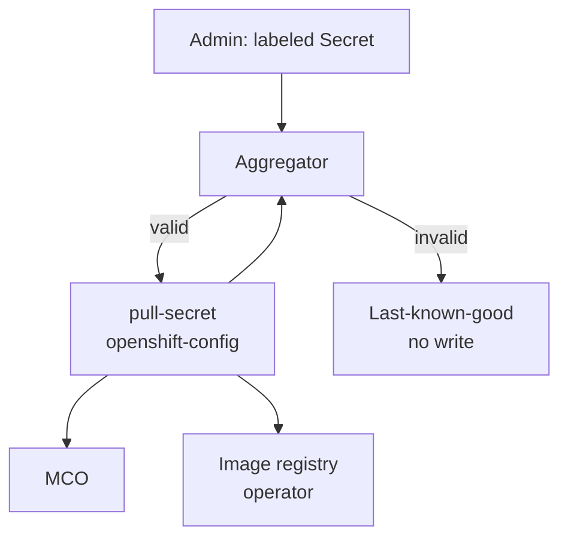

# Multi-Secret Global Pull Configuration

## Summary

OpenShift manages global container registry credentials through a single Secret, `openshift-config/pull-secret`. Administrators must download, decode, and hand-edit this file to add a registry, risking corruption of installer-provided credentials and breaking GitOps workflows. This proposal adds a controller that discovers Secrets labeled `config.openshift.io/global-pull-secret=true` in `openshift-config`, validates them, and merges their content directly into the existing `pull-secret` object. No new Secret object is introduced.

## Motivation

Enterprise and GitOps-managed clusters need to add or revoke registry credentials independently, without a single shared file forcing every change through one risky manual edit. A bad edit today can wipe Red Hat baseline credentials and degrade the whole cluster.

### User Stories

As a cluster administrator, I want to add credentials for a new private registry by creating a labeled Secret, so that I never have to hand-edit `pull-secret`.

As a GitOps/SRE engineer, I want to manage registry credentials declaratively as independent objects, so that one bad change does not affect unrelated registries.

### Goals

- Eliminate manual edits to `pull-secret` for adding modular registry credentials.
- Auto-discover labeled Secrets in `openshift-config`.
- Deterministic merge, validation, and conflict resolution.
- Safe create/update/delete lifecycle for modular secrets.
- Malformed input never overwrites a working effective configuration (last-known-good).
- Redacted status conditions and events.

### Non-Goals

- Namespace-scoped `imagePullSecrets` / pod-level credential injection.
- External vault integration (Vault, CyberArk).
- Automated migration off the existing manual-edit workflow.
- Console UI components (status contract only).
- Replacing HyperShift's existing `kube-system/additional-pull-secret` sync model.

## Proposal

### Workflow Description

1. An administrator creates a Secret in `openshift-config`, type `kubernetes.io/dockerconfigjson`, labeled `config.openshift.io/global-pull-secret=true`.
2. The aggregator controller discovers it, validates type, key, and JSON parseability.
3. Valid sources are merged with a preserved baseline (installer/Red Hat-provided content captured before the controller's first write — not the current, already-merged `pull-secret`) using deterministic conflict rules: baseline wins on conflict; among modular secrets, priority annotation then name.
4. The merged result is recomputed from the baseline plus all currently valid modular Secrets on every reconcile and written back into `openshift-config/pull-secret` in place when all sources validate. Deleting or fixing a modular Secret removes or corrects its entries on the next reconcile. On any invalid source, the last successfully published content is retained and the controller reports degraded, redacted status.
5. Existing consumers pick up the change through their existing read paths (MCO and image-registry-operator continue to read `pull-secret` by name).

### API Extensions

None. No new CRDs, webhooks, or aggregated API servers. This proposal only changes reconciliation behavior around the existing `openshift-config/pull-secret` Secret.

### Topology Considerations

#### Hypershift / Hosted Control Planes

Where the aggregator runs in Hosted Control Planes and how it aligns with HyperShift's `kube-system/additional-pull-secret` model is not defined in this proposal; guest-cluster impact is TBD with the HyperShift team.

#### Standalone Clusters

Primary topology. Labeled Secrets in `openshift-config` are merged into `openshift-config/pull-secret`; MCO and other consumers are unchanged.

#### Single-node Deployments or MicroShift

SNO uses the same control-plane reconcile path as multi-node. MicroShift is out of scope for MVP.

#### OpenShift Kubernetes Engine

Uses the same global pull-secret model as standalone OCP; no OKE-specific exclusion identified for MVP.

### Implementation Details/Notes/Constraints

A small dedicated controller (not MCO; `cluster-config-operator` is not accepting new control loops) is the proposed owner, following the same pattern as other operators that derive canonical secrets from `openshift-config` input. Final ownership is subject to agreement with the owning team.

The controller watches labeled Secrets in `openshift-config`. On first activation it captures pre-controller `pull-secret` content as a preserved baseline (storage mechanism TBD). On each labeled Secret create, update, or delete it re-lists sources, validates each secret, and recomputes `merge(baseline, modular sources)` — never treating the already-merged `pull-secret` as baseline — then writes to `pull-secret` only when all contributing sources are valid.

**Consumers:** MCO reads `openshift-config/pull-secret` directly (`machine-config-operator` `pkg/operator/sync.go`) to render node pull configuration; no MCO change required. Builds and ImageStream import consume the node-rendered file downstream of MCO. `image-registry-operator` copies `pull-secret` into `openshift-image-registry/installation-pull-secrets` but does not watch `openshift-config` Secrets; propagation delay is a pre-existing gap tracked at OCPNODE-4711, not solved here.

Direct administrator edits to `pull-secret` via `oc set data` may race with reconciliation; policy for preserving vs superseding such edits is TBD.

### Risks and Mitigations

- **Controller-vs-manual-edit write conflict:** reconcile may overwrite or conflict with direct `pull-secret` edits until policy is agreed.
- **Blast-radius shift:** a controller defect can affect cluster-wide pulls; mitigations include validate-before-write, last-known-good retention, redacted status/events, and disabling the feature gate to stop merging.
- **Internal registry propagation:** see Implementation above (OCPNODE-4711).

### Drawbacks

- Always-on control loop with write access to a critical Secret increases operational blast radius versus today's manual-only workflow.
- Effective credentials in `pull-secret` alone do not show which modular Secret contributed each registry entry without reading labeled sources or controller status.

## Alternatives (Not Implemented)

Write the merge result to a new Secret (for example `openshift-config/global-pull-secret-aggregated`) instead of `pull-secret`. Rejected because MCO and `image-registry-operator` hardcode the name `pull-secret`; merge-in-place avoids consumer migration.

## Test Plan

Unit and integration tests validate merge rules, conflict handling, baseline preservation, modular secret delete/update lifecycle, and last-known-good behavior using a fake client or envtest.

End-to-end tests on a multi-node cluster with a private test registry validate labeled-secret create/update/delete, conflict resolution, invalid-input recovery, status redaction, and feature-gate disabled behavior. Detailed cases are tracked in OCPNODE-4708.

## Graduation Criteria

### Dev Preview -> Tech Preview

- End-to-end labeled-secret-to-node-pull flow working
- Unit and integration coverage for merge, conflict, and last-known-good
- Feature gated; no impact when disabled

### Tech Preview -> GA

- Consumer behavior confirmed with owning teams (MCO, builds, registry)
- Write-conflict and blast-radius mitigations agreed and tested
- HyperShift execution model resolved where applicable
- User-facing documentation in openshift-docs

### Removing a deprecated feature

N/A

## Upgrade / Downgrade Strategy

On upgrade, clusters without labeled modular secrets behave as today. On downgrade, merged content remains in `pull-secret`; no automatic rollback for MVP.

## Version Skew Strategy

Not applicable for MVP — control-plane-only reconciliation; nodes continue to consume `pull-secret` through MCO as today.

## Operational Aspects of API Extensions

No new APIs for MVP. Operational risk is concentrated in incorrect or conflicting writes to `pull-secret`, affecting cluster-wide image pulls.

## Support Procedures

- **Detect:** redacted conditions (`Available`, `Degraded`, `Progressing`) and events (`GlobalPullSecretSourceInvalid`, `GlobalPullSecretSourceConflictIgnored`) on the controller status object (exact resource TBD with ownership).
- **Recover:** fix or delete the invalid modular Secret; controller re-reconciles automatically.
- **Disable:** turn off the feature gate; `pull-secret` keeps last merged content; manual administration remains available.
