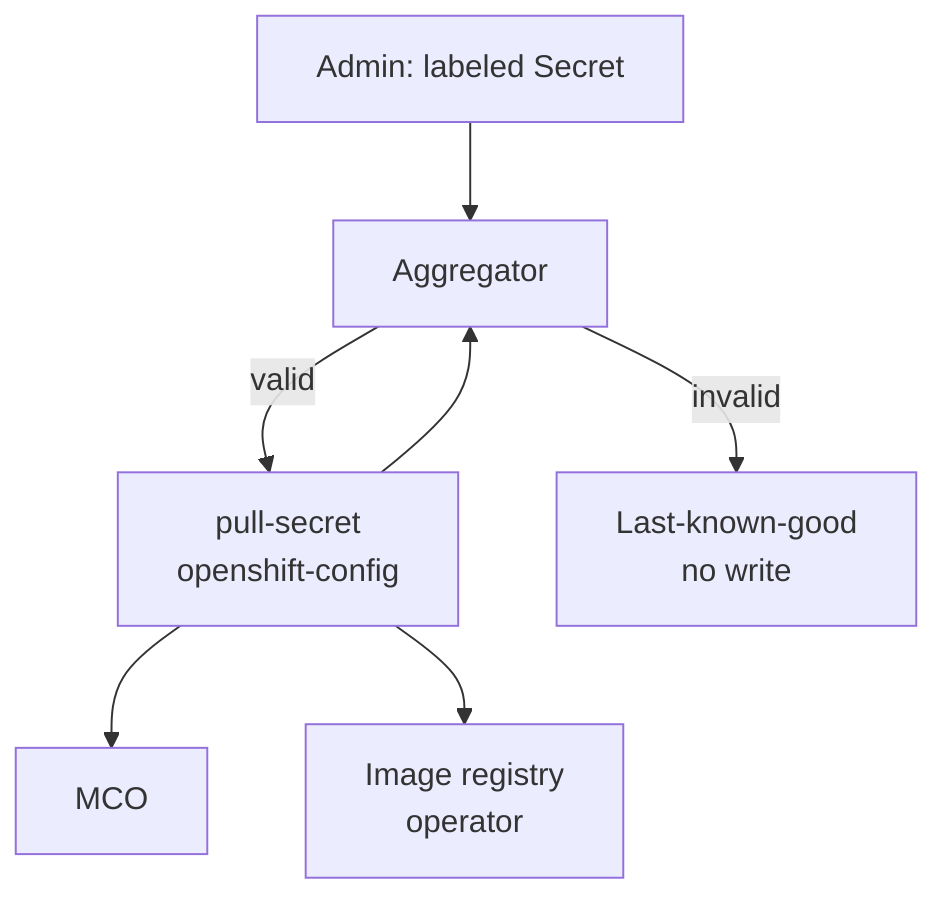

# Multi-Secret Global Pull Configuration

## Summary

OpenShift manages global container registry credentials through a single Secret, `openshift-config/pull-secret`. Administrators must download, decode, and hand-edit this file to add a registry, risking corruption of installer-provided credentials and breaking GitOps workflows. This proposal adds a controller that discovers Secrets labeled `config.openshift.io/global-pull-secret=true` in `openshift-config`, validates them, and merges their content directly into the existing `pull-secret` object. No new Secret object is introduced.

## Motivation

Enterprise and GitOps-managed clusters need to add or revoke registry credentials independently, without a single shared file forcing every change through one risky manual edit. A bad edit today can wipe Red Hat baseline credentials and degrade the whole cluster.

### User Stories

As a cluster administrator, I want to add credentials for a new private registry by creating a labeled Secret, so that I never have to hand-edit `pull-secret`.

As a GitOps/SRE engineer, I want to manage registry credentials declaratively as independent objects, so that one bad change does not affect unrelated registries.

### Goals

- Eliminate manual edits to `pull-secret` for adding modular registry credentials.
- Auto-discover labeled Secrets in `openshift-config`.
- Deterministic merge, validation, and conflict resolution.
- Safe create/update/delete lifecycle for modular secrets.
- Malformed input never overwrites a working effective configuration (last-known-good).
- Redacted status conditions and events.

### Non-Goals

- Namespace-scoped `imagePullSecrets` / pod-level credential injection.
- External vault integration (Vault, CyberArk).
- Automated migration off the existing manual-edit workflow.
- Console UI components (status contract only).
- Replacing HyperShift's existing `kube-system/additional-pull-secret` sync model.

## Proposal

### Workflow Description

1. An administrator creates a Secret in `openshift-config`, type `kubernetes.io/dockerconfigjson`, labeled `config.openshift.io/global-pull-secret=true`.
2. The aggregator controller discovers it, validates type, key, and JSON parseability.
3. Valid sources are merged with a preserved baseline (installer/Red Hat-provided content captured before the controller's first write — not the current, already-merged `pull-secret`) using deterministic conflict rules: baseline wins on conflict; among modular secrets, priority annotation then name. The merge result is serialized with registry hostname keys in sorted order so that identical inputs always produce byte-identical output, avoiding spurious updates to consumers.
4. The merged result is recomputed from the baseline plus all currently valid modular Secrets on every reconcile and written back into `openshift-config/pull-secret` in place when all sources validate. Deleting or fixing a modular Secret removes or corrects its entries on the next reconcile. On any invalid source, the last successfully published content is retained and the controller reports degraded, redacted status.
5. Existing consumers pick up the change through their existing read paths (MCO and image-registry-operator continue to read `pull-secret` by name).



### API Extensions

None. No new CRDs, webhooks, or aggregated API servers. This proposal only changes reconciliation behavior around the existing `openshift-config/pull-secret` Secret.

### Topology Considerations

#### Hypershift / Hosted Control Planes

Where the aggregator runs in Hosted Control Planes and how it aligns with HyperShift's `kube-system/additional-pull-secret` model is not defined in this proposal; guest-cluster impact is TBD with the HyperShift team.

#### Standalone Clusters

Primary topology. Labeled Secrets in `openshift-config` are merged into `openshift-config/pull-secret`; MCO and other consumers are unchanged.

#### Single-node Deployments or MicroShift

SNO uses the same control-plane reconcile path as multi-node. MicroShift is out of scope for MVP.

#### OpenShift Kubernetes Engine

Uses the same global pull-secret model as standalone OCP; no OKE-specific exclusion identified for MVP.

### Implementation Details/Notes/Constraints

A small dedicated controller (not MCO; `cluster-config-operator` is not accepting new control loops) is the proposed owner, following the same pattern as other operators that derive canonical secrets from `openshift-config` input. Final ownership is subject to agreement with the owning team.

The controller watches labeled Secrets in `openshift-config`. On first activation it captures the current content of `openshift-config/pull-secret` as a preserved baseline (storage mechanism TBD — see Open Questions). If an administrator has edited `pull-secret` via `oc` before the controller's first reconcile, those edits become part of the preserved baseline; only content contributed by labeled modular Secrets after that point is tracked as modular.

**Validation:** Each labeled Secret must satisfy all of the following; otherwise it is rejected and the controller does not write:

- Secret type is `kubernetes.io/dockerconfigjson`.
- The key `.dockerconfigjson` exists in `data`.
- The value under `.dockerconfigjson` is valid JSON and contains an `auths` map.

The Kubernetes API server already enforces the second and third checks (key presence and well-formed JSON) for Secrets created with type `kubernetes.io/dockerconfigjson`; it does not enforce the Secret type itself or the presence of an `auths` map inside the JSON. The controller therefore only needs to additionally reject the cases below:

- A Secret of type `Opaque` labeled for aggregation → not rejected by the API (type is unrestricted), rejected by the controller (`GlobalPullSecretSourceInvalid` event, naming the Secret).
- A Secret of type `kubernetes.io/dockerconfigjson` whose JSON has no `auths` key → passes API validation, rejected by the controller.
- Two modular Secrets both valid, but one invalid Secret also exists in the labeled set → **entire reconcile blocked**, last-known-good retained, `Degraded` condition set.

**Merge algorithm:**

1. Start with the preserved baseline `auths` map (read-only reference, never mutated).
2. List all currently labeled Secrets, validate each. If any fails validation, abort — do not write.
3. Sort valid modular Secrets by `(priority annotation value descending, Secret name ascending)` to produce a deterministic total order. Secrets without the priority annotation are treated as priority `0`.
4. Iterate modular Secrets from lowest precedence to highest. For each registry hostname key in the modular Secret's `auths`:
   - If the key exists in the baseline, **skip** — baseline always wins.
   - Otherwise, write to the effective map (a later, higher-precedence Secret overwrites an earlier one for the same key).
5. Serialize the effective `auths` map with **registry hostname keys in sorted order** to guarantee byte-identical output for identical inputs.
6. Write to `openshift-config/pull-secret` only if the serialized content differs from the current value, avoiding no-op updates.

A labeled Secret with the priority annotation looks like:

```yaml
apiVersion: v1
kind: Secret
metadata:
  name: team-a-quay
  namespace: openshift-config
  labels:
    config.openshift.io/global-pull-secret: "true"
  annotations:
    config.openshift.io/global-pull-secret-priority: "10" # exact key TBD, see Open Questions
type: kubernetes.io/dockerconfigjson
data:
  .dockerconfigjson: <base64>
```

**Example:** Baseline already has `registry.redhat.io`. `team-a-quay` (priority 10) and `team-b-quay` (priority 10) both set `quay.io`; since priority is equal, Secret name breaks the tie and `team-b-quay` (sorts after `team-a-quay`) is applied last and wins for `quay.io`. If either Secret also sets `registry.redhat.io`, that entry is skipped because the baseline always wins.

On each labeled Secret create, update, or delete the controller re-runs the full algorithm above — never treating the already-merged `pull-secret` as baseline — then writes to `pull-secret` only when all contributing sources are valid.

When the feature gate is **off**, the controller does not watch, merge, or write to `pull-secret`, even if labeled Secrets exist in `openshift-config`. Labeled Secrets are ignored until the gate is enabled.

**Consumers:** MCO reads `openshift-config/pull-secret` directly (`machine-config-operator` `pkg/operator/sync.go`) to render node pull configuration; no MCO change required. Builds and ImageStream import consume the node-rendered file downstream of MCO. `image-registry-operator` copies `pull-secret` into `openshift-image-registry/installation-pull-secrets` but does not watch `openshift-config` Secrets for changes; a suspected propagation delay exists based on the operator's reconcile model (continuous reconcile without a Secret watch or periodic fallback resync). Follow-up investigation with the registry operator team is out of scope for this proposal.

**MCO node update behavior:** MCO's template controller watches `openshift-config/pull-secret` and re-syncs `ControllerConfig` when the Secret's data changes (`machine-config-operator` `pkg/controller/template/template_controller.go`). The rendered node file `/var/lib/kubelet/config.json` is updated as part of the new `MachineConfig`. The MCD classifies pull-secret/`config.json` changes as a **non-reboot** update (`postConfigChangeActionNone` in `pkg/daemon/update.go`); nodes pick up the new credentials without a drain or reboot cycle. Pool status will show `Updating` → `Updated` as nodes apply the change.

### Risks and Mitigations

- **Controller-vs-manual-edit write conflict:** When one or more labeled Secrets exist and the controller is actively reconciling, direct administrator edits to `pull-secret` via `oc set data secret/pull-secret` are **not supported** and may be overwritten on the next reconcile. The supported workflows are mutually exclusive:
  - **Manual management:** No labeled Secrets exist; the feature gate may be on or off; the controller does not write to `pull-secret`. Administrators use `oc` as today.
  - **Labeled-secret aggregation:** One or more labeled Secrets exist; the controller owns `pull-secret` content (baseline + modular). Administrators must not directly edit `pull-secret`.
  - **Transition back to manual:** The administrator deletes all labeled Secrets. The controller restores the preserved baseline to `pull-secret`. After that, the administrator may resume direct `oc` edits.
  - **Re-entering aggregation:** If the administrator edited `pull-secret` manually while in manual mode and later adds labeled Secrets again, those manual-only registry entries are not promoted into the preserved baseline; the controller recomputes from the stored baseline plus modular Secrets. Credentials added only via `oc` must be moved into labeled modular Secrets before aggregation is used again.
  
  This mutual exclusivity will be documented in user-facing documentation and an informational event or condition may be emitted if the controller detects an unexpected data change on `pull-secret` that did not originate from its own write.
- **Blast-radius shift:** a controller defect can affect cluster-wide pulls; mitigations include validate-before-write, last-known-good retention, redacted status/events, and disabling the feature gate to stop merging.
- **Internal registry propagation:** see Implementation above (`image-registry-operator` reconcile model).

### Drawbacks

- Always-on control loop with write access to a critical Secret increases operational blast radius versus today's manual-only workflow.
- Effective credentials in `pull-secret` alone do not show which modular Secret contributed each registry entry without reading labeled sources or controller status.

## Alternatives (Not Implemented)

**Write the merge result to a new Secret** (for example `openshift-config/global-pull-secret-aggregated`) instead of the existing `pull-secret`.

This alternative was considered because a separate output object would give the controller clear ownership of the merged result without risk of conflicting with manual administrator edits to the original `pull-secret`. It would also make it easy to distinguish baseline credentials from modular contributions by inspecting which object holds which data.

It was rejected because multiple critical consumers hardcode the literal name `pull-secret`: MCO reads `openshift-config/pull-secret` directly in `pkg/operator/sync.go` (lines ~1576 and ~2283), and `image-registry-operator` copies `pull-secret` by name into `openshift-image-registry/installation-pull-secrets`. Adopting a new object name would require code changes in every such consumer and a coordinated migration, while the merge-in-place approach requires no consumer changes at all.

## Open Questions

1. **Controller ownership** — proposed direction is a small dedicated controller (not MCO, not `cluster-config-operator`); not yet confirmed by the owning team.
2. **Baseline storage mechanism** — where/how the preserved pre-controller `pull-secret` content is stored (e.g. annotation, status field, internal object, or an installer-provided baseline Secret) is not yet decided.
3. **Priority annotation key** — the exact annotation key name is deferred to implementation; higher numeric priority wins per the merge algorithm above.
4. **HyperShift control-plane execution model** — where the aggregator runs in Hosted Control Planes and how it aligns with HyperShift's `kube-system/additional-pull-secret` model is unresolved.

## Test Plan

Unit and integration tests validate merge rules, conflict handling, baseline preservation, modular secret delete/update lifecycle, and last-known-good behavior using a fake client or envtest.

End-to-end tests on a multi-node cluster with a private test registry validate labeled-secret create/update/delete, conflict resolution, invalid-input recovery, status redaction, and feature-gate disabled behavior. How tests assert that all nodes have applied an updated `pull-secret` (propagation-complete signal) is not yet defined.

## Graduation Criteria

### Dev Preview -> Tech Preview

- End-to-end labeled-secret-to-node-pull flow working
- Unit and integration coverage for merge, conflict, and last-known-good
- Feature gated; no impact when disabled

### Tech Preview -> GA

- Consumer behavior confirmed with owning teams (MCO, builds, registry)
- Write-conflict and blast-radius mitigations agreed and tested
- HyperShift execution model resolved where applicable
- User-facing documentation in openshift-docs

### Removing a deprecated feature

N/A

## Upgrade / Downgrade Strategy

On upgrade, clusters without labeled modular secrets behave as today. On downgrade, merged content remains in `pull-secret`; no automatic rollback for MVP.

## Version Skew Strategy

Not applicable for MVP — control-plane-only reconciliation; nodes continue to consume `pull-secret` through MCO as today.

## Operational Aspects of API Extensions

No new APIs for MVP. Operational risk is concentrated in incorrect or conflicting writes to `pull-secret`, affecting cluster-wide image pulls.

## Support Procedures

- **Detect:** redacted conditions (`Available`, `Degraded`, `Progressing`) and events (`GlobalPullSecretSourceInvalid`) on the controller status object (exact resource TBD with ownership).
- **Recover:** fix or delete the invalid modular Secret; controller re-reconciles automatically.
- **Disable:** turn off the feature gate; `pull-secret` keeps last merged content; manual administration remains available.
