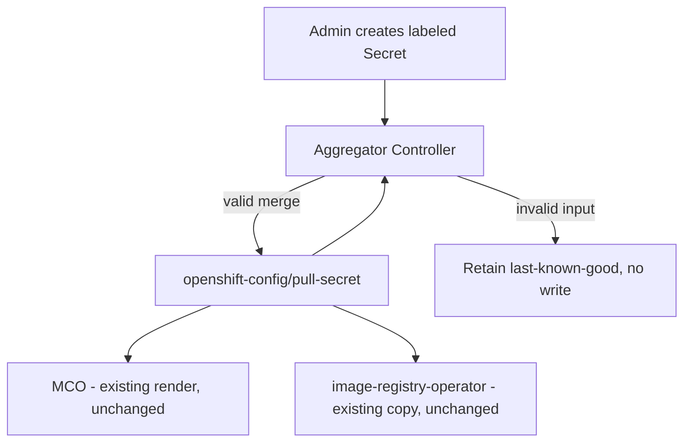

# Multi-Secret Global Pull Configuration

## Release Signoff Checklist

- [ ] Enhancement is `implementable`
- [ ] Design details are appropriately documented from clear requirements
- [ ] Test plan is defined
- [ ] Graduation criteria for dev preview, tech preview, GA
- [ ] User-facing documentation is created in [openshift-docs](https://github.com/openshift/openshift-docs/)

## Summary

OpenShift manages global container registry credentials through a single Secret, `openshift-config/pull-secret`. Administrators must download, decode, and hand-edit this file to add a registry, risking corruption of installer-provided credentials and breaking GitOps workflows. This proposal adds a controller that discovers Secrets labeled `config.openshift.io/global-pull-secret=true` in `openshift-config`, validates them, and merges their content directly into the existing `pull-secret` object. No new Secret object is introduced.

## Motivation

Enterprise and GitOps-managed clusters need to add or revoke registry credentials independently, without a single shared file forcing every change through one risky manual edit. A bad edit today can wipe Red Hat baseline credentials and degrade the whole cluster.

### User Stories

- As a cluster administrator, I want to add credentials for a new private registry by creating a labeled Secret, so that I never have to hand-edit `pull-secret`.
- As a GitOps/SRE engineer, I want to manage registry credentials declaratively as independent objects, so that one bad change doesn't affect unrelated registries.
- As a developer, I want images from an admin-approved private registry to pull without configuring per-namespace secrets.
- As OpenShift QE, I want deterministic merge, conflict, and recovery behavior to validate.

### Goals

- Eliminate manual edits to `pull-secret` for adding modular registry credentials.
- Auto-discover labeled Secrets in `openshift-config`.
- Deterministic merge, validation, and conflict resolution.
- Safe create/update/delete lifecycle for modular secrets.
- Malformed input never overwrites a working effective configuration (last-known-good).
- Redacted status conditions and events.

### Non-Goals

- Namespace-scoped `imagePullSecrets` / pod-level credential injection.
- External vault integration (Vault, CyberArk).
- Automated migration off the existing manual-edit workflow.
- Console UI components (status contract only).
- Replacing HyperShift's existing `kube-system/additional-pull-secret` sync model. Note: this is distinct from the open question of how/where this feature's own control loop runs in HCP topology, which is unresolved — see Open Questions.

## Proposal

### Workflow Description

1. An administrator creates a Secret in `openshift-config`, type `kubernetes.io/dockerconfigjson`, labeled `config.openshift.io/global-pull-secret=true`.
2. The aggregator controller discovers it, validates type, key, and JSON parseability.
3. Valid sources are merged with the preserved baseline (the installer/Red Hat-provided content captured before the controller's first write — not the current, already-merged `pull-secret`) using deterministic conflict rules: baseline wins on conflict; among modular secrets, priority annotation then name.
4. The merged result — recomputed in full from the baseline plus all currently valid modular Secrets on every reconcile — is written back into `openshift-config/pull-secret` in place, only if all sources validated. Deleting or fixing a modular Secret therefore removes or corrects its entries on the next reconcile instead of leaving stale credentials behind. On any invalid source, the last successfully published content is retained and the controller reports degraded, redacted status.
5. Existing consumers pick up the change through their existing, unmodified read paths.

### API Extensions

None. No new CRDs, webhooks, or aggregated API servers. This proposal only changes reconciliation behavior around the existing `openshift-config/pull-secret` Secret.

### Topology Considerations

#### Hypershift / Hosted Control Planes

Control-plane execution model for the aggregator in Hosted Control Planes is unresolved (see Open Questions). This enhancement must not assume MCO is available on the guest cluster side; alignment with HyperShift's existing `kube-system/additional-pull-secret` sync model is TBD and tracked as an open question, not solved here.

#### Standalone Clusters

Primary topology for this proposal. Administrators create labeled Secrets in `openshift-config`; the aggregator merges them into `openshift-config/pull-secret`; existing MCO and consumer read paths are unchanged.

#### Single-node Deployments or MicroShift

SNO: uses the same control-plane reconcile path as multi-node; no additional node-side resource consumption since no new node binary or daemon is introduced. MicroShift: out of scope for MVP — MicroShift does not use the full OCP MCO/global-pull-secret model, so this proposal does not extend to it.

#### OpenShift Kubernetes Engine

OKE clusters use the same global pull-secret model as OCP standalone clusters for cluster-wide registry credentials. No dependency on a capability excluded from the OKE product offering has been identified for MVP.

### Consumer Integration

| Consumer | Current dependency | Impact of this proposal |
|---|---|---|
| Nodes / MCO / CRI-O | Reads `openshift-config/pull-secret` directly (confirmed: `pkg/operator/sync.go` in `openshift/machine-config-operator`) to render node `config.json` and the internal-registry auth file | No code change |
| Builds | Consumes the node-rendered file, not `pull-secret` directly; namespace secrets take priority | No change expected; to be confirmed with the owning team |
| ImageStream import | Same node-rendered file; namespace secrets take priority | No change expected; to be confirmed with the owning team |
| Internal registry pull-through | `image-registry-operator` copies `pull-secret` into `openshift-image-registry/installation-pull-secrets` on every reconcile | No code change required, but this controller does not currently watch Secrets in `openshift-config` and has no periodic fallback resync — an edit may not propagate until an unrelated watched event, failed-reconcile retry, or restart occurs. Tracked separately at OCPNODE-4711; not solved by this proposal. |
| HyperShift guest | Separate `kube-system/additional-pull-secret` model | Open — see Open Questions |

### Ownership

Proposed: a small, dedicated controller rather than MCO. MCO is scoped to node lifecycle and has no clean equivalent in Hosted Control Planes. OpenShift precedent for "derive a canonical secret from admin input in `openshift-config`" is `library-go`'s `ResourceSyncController` pattern (used by `cluster-kube-controller-manager-operator`, `cluster-kube-apiserver-operator`, `cluster-etcd-operator`, `cluster-authentication-operator`), and Insights Operator's independent ownership of the SCA `etc-pki-entitlement` secret. `cluster-config-operator` was considered and ruled out — its own documentation states it is not accepting new control-loop contributions. This is not yet finalized; see Open Questions.

### Implementation Details/Notes/Constraints

The controller watches Secrets in `openshift-config` for the `config.openshift.io/global-pull-secret=true` label. On first activation, it captures the pre-controller content of `openshift-config/pull-secret` as a preserved baseline (stored internally by the controller; exact storage mechanism is an open question) so that installer/Red Hat-provided credentials stay distinguishable from modular contributions across repeated merges. On any relevant change — a labeled Secret created, updated, or deleted — the controller re-lists all currently labeled sources, validates each (`kubernetes.io/dockerconfigjson` type, expected key present, value is parseable JSON), and recomputes the merge from scratch: the preserved baseline plus the current set of valid modular sources, with baseline entries winning on conflict and an optional priority annotation (falling back to Secret name) breaking ties among modular secrets. Recomputing from the preserved baseline on every reconcile — rather than treating the already-merged `pull-secret` as the new baseline — ensures deleting or correcting a modular Secret removes or fixes its entries instead of leaving stale credentials behind. The merged result is written back to `pull-secret` only when every source that contributed to the write validated successfully; if any source is invalid, the controller retains the last successfully published content and reports degraded, redacted status instead of writing. No new CRD or webhook is introduced.

### Risks and Mitigations

- **Controller-vs-manual-edit write conflict:** an administrator's direct `oc set data secret/pull-secret ...` edit can race with the controller's reconcile loop. Policy not yet decided — see Open Questions.
- **Responsibility/blast-radius shift:** today a broken `pull-secret` is self-inflicted by the administrator; with this design, a controller defect can break it without administrator action. Proposed mitigations, not yet finalized: strict validation before any write, automatic last-known-good rollback, redacted status/events naming the offending source, and an option to disable the controller and fall back to pure manual control.
- **Internal Registry propagation gap:** see Consumer Integration above.

### Drawbacks

- Adds a new always-on control loop with write access to a Secret that every node and several control-plane components depend on for image pulls, increasing the blast radius of a controller defect relative to today's purely manual workflow.
- Administrators lose the ability to see, in `pull-secret` alone, which registry credentials came from which source without also inspecting status/events or the labeled Secrets themselves.
- Until the Internal Registry propagation gap (see Consumer Integration) is separately fixed, updates may not reach `openshift-image-registry/installation-pull-secrets` promptly after a merge.

## Open Questions

1. **Controller ownership** — proposed direction above, not yet confirmed by the owning team.
2. **HyperShift control-plane execution model** — unresolved; no HyperShift-side component identified yet.
3. **Manual-edit-vs-controller write-conflict policy** — options include treating untracked edits as a preserved source, or documenting that they may be superseded on next reconcile. Not decided.
4. **Node-propagation-complete signal for e2e** — not yet defined.
5. **Baseline storage mechanism** — where/how the preserved pre-controller `pull-secret` content is stored (e.g. status field, annotation, internal object) is not yet decided.

## Test Plan

See the companion test plan document (Multi-Secret Global Pull Configuration TP 5.1 Test Plan) for full unit/integration/e2e/functional coverage. Summary: unit and integration tests validate merge, conflict, provenance, and last-known-good behavior against a fake client/envtest; e2e validates add/update/delete/conflict/recovery/redaction/gate-off against a real multi-node cluster with a private test registry.

## Graduation Criteria

### Dev Preview -> Tech Preview

- End-to-end labeled-secret-to-node-pull flow working
- Unit and integration test coverage for merge/conflict/last-known-good
- Feature gated; no impact when disabled

### Tech Preview -> GA

- Consumer Integration table above fully confirmed with owning teams
- Write-conflict and blast-radius risks have an agreed, tested mitigation
- HyperShift alignment (Open Question 2) resolved
- User-facing documentation in openshift-docs

### Removing a deprecated feature

Not applicable. This proposal does not deprecate or remove any existing API, field, or behavior; disabling the feature gate simply stops the merge controller and leaves `pull-secret` under manual administrator control, as it is today.

## Upgrade / Downgrade Strategy

No API version changes. On upgrade, clusters without labeled secrets behave identically to today (baseline-only). On downgrade, any content the controller merged into `pull-secret` remains present as plain secret data; no automatic reversal is proposed for MVP.

## Version Skew Strategy

Not applicable for MVP — this is a single control-plane component with no node-side binary changes beyond what MCO already does with `pull-secret` today.

## Operational Aspects of API Extensions

No new CRDs or webhooks introduced for MVP. The main operational risk is the write-conflict and blast-radius items under Risks and Mitigations — a controller defect can now affect `pull-secret`, which every node and several control-plane components depend on for image pulls.

## Support Procedures

- Detect: redacted status conditions (`Available`, `Degraded`, `Progressing`) and events (`GlobalPullSecretSourceInvalid`, `GlobalPullSecretSourceConflictIgnored`) on the controller's status object (exact object TBD pending ownership).
- Recover: fixing or deleting the invalid modular secret triggers automatic re-reconciliation and recovery; no manual `pull-secret` repair should be necessary.
- Disable: turning off the feature gate stops the merge; `pull-secret` retains its last-written content, and administrators can resume manual management if needed.

## Alternatives (Not Implemented)

Write the merge result to a new object (e.g., `openshift-config/global-pull-secret-aggregated`) instead of the existing `pull-secret`. Rejected: every consumer that hardcodes the literal name `pull-secret` — confirmed for MCO (`pkg/operator/sync.go`) and `image-registry-operator`'s copy logic — would require a code change to adopt a new object name, while the merge-in-place approach requires none.

## Infrastructure Needed

None.
