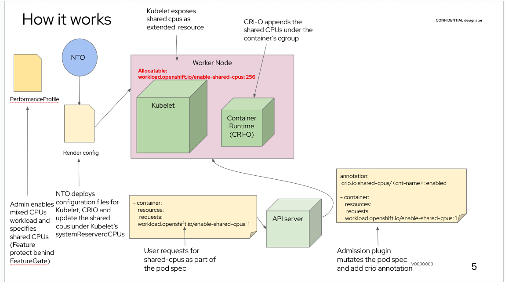

# mixed-cpu-node-plugin


## Summary

Resources management (particularly CPUs) in Kubernetes/OpenShift is limited and not flexible enough to cover all of
our customer use cases.
This enhancement introduces a new node-plugin that operates at runtime-level
for extending CPU resources management on top of Kubernetes and OpenShift platforms.
With the existing CPU management design, a container can either request exclusive CPUs or shared CPUs,
while with this new node plugin, it would be possible for container workload to request for both.

## Motivation

There is a growing interest from telco users in Kubernetes/OpenShift as a cloud management platform.
This proposal is motivated by the desire of optimizing the platform's capabilities for telco users,
such as cost reduction, power efficiency, higher pod density and sustainability.

The telco users have new use cases and requirements that especially related to resource management of the platform. 
In order to address some of those needs,
Kubelet CPU manager was created to allow users requesting for exclusive, isolated cpus.

But there are additional use cases that require more granular control of CPU management.
This enhancement aims to solve the following use case:
When the CPU manager allocates an exclusive set of CPUs for a given workloads, the workload shall still have the option 
to specify and access a set of shared CPUs, whether those shared CPUs are shared among containers in the 
same pod or containers in different ones.

By giving the users the flexibility to use exclusive CPUs only when it is an absolute necessity, we help them utilize
their existing compute resources in an optimal manner.

### User Stories

* As a developer who's building DPDK application,
I want to run my application in a container,
giving full exclusive access to cpu cores for the busy-loops polling threads,
but having the light-weight tasks like configuration processing and log printing not taking full cores,
in order to improve the application density and make more efficient use of the CPUs.
For that, my application container needs access to both shared and exclusive CPUs.

  
### Goals 
* Increase pod density, power efficiency, cost reduction and sustainability by optimizing CPUs resource management. 
* Provide a special-purpose at a runtime-level solution for containers in a pod to have the ability
to request and subsequently be allocated both exclusive and shared CPUs.
* Enable the telco-specific use case with a self-contained change,
    minimizing the changes to the platform

### Non-Goals
* Introducing a generic mechanism in the platform that does involve Kubelet and pod spec changes.

## Proposal

Container processes are restricted
to given [cpuset](https://man7.org/linux/man-pages/man7/cpuset.7.html) by their corresponding cgroup definition.
Essentially, the kernel enforces the processes of container to run only at the CPU (core) ids specified under its
cgroup.

The mixed-cpu-node-plugin is a runtime-agnostic, hybrid (composed of both [NRI-plugin](https://github.com/containerd/nri) and
[device-plugin](https://kubernetes.io/docs/concepts/extend-kubernetes/compute-storage-net/device-plugins/)), 
[mixed-cpu-node-plugin](https://github.com/openshift-kni/mixed-cpu-node-plugin) 
that communicates with the container-runtime
at various lifecycle stages of container e.g. CreateContainer, UpdateContainer, etc.,
and modifies the container's cgroup to include a set of shared CPUs.

Shared CPUs append to Kubelet [reservedSystemCpus](https://kubernetes.io/docs/tasks/administer-cluster/reserve-compute-resources/#explicitly-reserved-cpu-list).
This means that when the feature enabled, Kubelet's `reservedSystemCpus` composed of PerformanceProfile's 
`spec.cpu.reserved` + `spec.cpu.shared`.
The reason we utilize Kubelet `reservedSystemCpus` is because of CPU manager, which is not aware of the CPUs
lying in this pool, so it doesn't undo or changes the allocation logic performed by the plugin.
Therefore, the plugin assigns the shared CPUs to containers without racing/conflict
the CPU manager behavior. 
More about this decision at the [Alternative](mixed-cpu-node-plugin.md#alternatives) section

When management and workload partitioning is enabled,
the `reservedSystemCpus` were exclusive to management components (Kubelet/CRI-O) or pods that were labeled as management. 
With this proposal system reserved no longer maps to Kubelet's view of a system reserved.
Instead, there is an internal partition of `resrvedSystemCpus` in which the `reserved` cpus are dedicated
and exclusive to a management component ([same as today](https://github.com/openshift/cluster-node-tuning-operator/blob/master/pkg/performanceprofile/controller/performanceprofile/components/machineconfig/machineconfig.go#L592)).
While the `shared` cpus are dedicated for workloads which are asking for shared cpus.

The following shows the cpu layout and what processes can be running at what cpus:

Please check the [Risks and Mitigations](mixed-cpu-node-plugin.md#risks-and-mitigations) for additional information.

There is a plan for a feature called [shared-partition](https://github.com/openshift/enhancements/pull/1421) 
that implements additional pool.
When shared-partition lands, Kubelet's cpu pool layout should look roughly like:
1. `reservedSystemCpus`
2. `guaranteedCpus` <- new pool
3. `sharedCpus` = All CPUs - `reservedSystemCpus` - `guaranteedCpus`

When shared-partition feature enabled, 
mixed-cpu-node-plugin allocates the shared cpus from the `sharedCpus` pool and not
from the reservedSystemCpus anymore.

The following section summarizes the shared-cpus source in each flow:
* mixed-cpu enabled -> `cpu.shared` appends to Kubelet's `reservedSystemCPUs`
* shared-partition enabled -> Kubelet's `sharedCpus` = All cpus - `reserved` - `isolated`
* Both enabled -> sharedCpus = All cpus - `reserved` - `isolated`

The node-plugin populates a special device named `openshift.io/shared-cpus` to provide way for pods to request
for this special type of CPUs.
There's no meaning to the value/number of `openshift.io/shared-cpus` devices that the pod requests.
For example:
```yaml
requests:
   openshift.io/shared-cpus: 1
```
Or
```yaml
requests:
   openshift.io/shared-cpus: 2
```
Are the same in that context, the container has access to the same number of shared-cpus in both cases.
In other words, the device request only uses as a hint to tell the plugin that shared-cpus required for the container and
does not indicate any actual value.

The reason for specifying a device, and not, for example, an annotation,
is because when application pod requests for a device, the scheduler makes the pod pending till device up and running.
This gives the node plugin room for setup and not being depended on pod admission order.
So only when the node plugin finishes the registration process with NRI and device plugin, the scheduler
admits the application pod.

Once a container under the pod requests and gets access to shared cpus, new environment variable named
`OPENSHIFT_SHARED_CPUS=<CPU-IDs>` will be present under the container's environment variables.

The mixed-cpu-node-plugin itself is essentially a pod that runs as a DaemonSet on the worker nodes.
cluster-node-tuning-operator (NTO) will be modified to support the deployment of the DaemonSet and additional
resources (ServiceAccount, RBAC resources, SecurityContextConstraint, etc.)
NTO will also be responsible to watch, monitor and report the node-plugin's DaemonSet status.
Additionally, since the plugin is part of OCP infrastructure pods, NTO annotates the pods with:
```yaml
target.workload.openshift.io/management: {
  "effect":"PreferredDuringScheduling"
}
```
See https://github.com/openshift/enhancements/blob/master/enhancements/workload-partitioning/management-workload-partitioning.md for details.

Since both the components are related,
mixed-cpu-node-plugin [source code](https://github.com/openshift-kni/mixed-cpu-node-plugin) would be vendored under NTO.
By having different main.go + container entrypoint, NTO image can be also used as the
mixed-cpu-node-plugin image. 
This way saves the overhead of having a separate container image with all the maintenance cost that comes with it.

In order to activate NRI in container-runtime, NTO creates MachineConfig to enable NRI in 
the container-runtime configuration:
```yaml
[crio.nri]
enable_nri = true
```

The plugin is completely optional and is off by default.

No changes are needed in the container-runtime, because NRI hooks already supported by the runtime
and mixed-cpu-node-plugin implementing the NRI interface.
This minimizes risks and helps avoid regression on
a container-runtime component (CRI-O in OpenShift case).

_"A picture is worth a thousand words"_


### API

Extend PerformanceProfile with new `workloadHints` named `mixedCpus` in order to enable
the feature.

```yaml
workloadHints:
  mixedCpus: true
```

Specify the shared cpus under `cpus.shared`:

```yaml
cpu:
  shared: "2,3"
```

The CPU set value should follow the 
[cpuset](https://github.com/openshift/cluster-node-tuning-operator/blob/master/docs/performanceprofile/performance_profile.md#cpuset) conventions.
It defines a set of CPUs that can be allocated to guaranteed pods/containers that still require
non-exclusive ones.

The CPU set must not overlap with `spec.cpu.reserved` or `spec.cpu.isolated` and NTO
should return an error in case it does.

The reason for having a separate flag for enabling the feature, 
is because there is a coming feature named shared-partition
that uses the `cpu.shared` value as well.
The features must be enabled independently, hence the `workloadHints` flag.

Both workloadHints and `cpu.shared` have to be specified in order to activate the feature.

PerformanceProfile example:
```yaml
apiVersion: performance.openshift.io/v2
kind: PerformanceProfile
metadata:
  name: example-performance-profile
spec:
  cpu:
    reserved: "0-1"
    isolated: "4-8"
    shared: "2-3"
  hugepages:
    defaultHugepagesSize: "1G"
    pages:
      - size: "1G"
        count: 2
        node: 0
  realTimeKernel:
    enabled: true
  workloadHints:
    mixedCpus: true
  nodeSelector:
    node-role.kubernetes.io/performance: "test"
```

Specify the `cpu.shared` and `mixedCpus: true` in `workloadHints` activates the feature,
signals NTO to update the `reservedSystemCpus` in Kubelet config,
reboots the nodes that are associated with the updated PerformanceProfile,
and deploys the mixed-cpu-node-plugin.
The logic of updating reserved-cpus pool is NTO's responsibility and would be implemented as part of this feature.

Remove the `cpu.shared` value,
or `mixedCpus: true` from `workloadHints` reverts the changes from Kubelet `reservedSystemCpus`,
reboots the nodes that are associated with the updated PerformanceProfile,
and deletes the mixed-cpu-node-plugin from the cluster.

The feature can be activated/deactivated on a running system.

### Workflow Description

The premise is that OCP cluster is running, and there's an active performance-profile that already tuned the system.

1. The cluster administrator wants to support both exclusive and shared cpus for workloads running on the cluster.
2. The cluster administrator specifies the shared CPU ids in the PerformanceProfile `spec.cpu.shared`.
3. The cluster administrator waits for MCO to kick in, update and reboot the nodes.
4. The cluster administrator waits for the node to come back from reboot.
5. The application administrator wants to deploy their DPDK application as a Guaranteed pod with shared CPUs.
6. The application administrator specifies a request for `openshift.io/shared-cpus: 1` under the pod's `spec.containers[].resources.requests`.
7. The application administrator is waiting for the DPDK pod to be `Running`.
8. The DPDK's app user/developer wants to run a light-weight task (threads) on shared cpus.
9. The DPDK's app user/developer should pin the light-weight threads to CPUs that have shown in the `OPENSHIFT_SHARED_CPUS` environment variable of the container's process.

### API Extensions
N/A

### Risks and Mitigations

* With this solution, the platform's housekeeping processes also runs on the shared CPUs.
but the intent is to allocate those cpus to workload’s light-weight tasks,
so having some latency is bearable.
A way of mitigating that is to use workload partitioning
to ensure the platform housekeeping processes don't run on the shared cpus.

* There is no risk that workload’s tasks run on dedicated OCP’s housekeeping reserved cpus,
because only the shared cpus exposed via cgroups to the workload’s process.
In other words, platform's housekeeping processes can run on shared cpus dedicated to workload’s light-weight tasks,
but not the other way around.

* mixed-cpus-node-plugin is NRI-based plugin.
Bugs in the plugin or NRI framework might affect the containers at various lifecycle stages, e.g.,
CreateContainer, UpdateContainer, etc.
For mitigating such cases, it is possible to deactivate the node-plugin, and in severe cases it is possible to disable
NRI completely at runtime-level.

* From a performance perspective, the runtime communicates with the node-plugin via gRPC calls.
Therefore, for every container creation, there's another gRPC call between the runtime and the node-plugin.
We can't avoid this call even for containers that don't ask for shared CPUs, since runtime doesn't have any filtering
mechanism, it sends all the containers through the NRI framework to node-plugin, and the filtering is done at the
plugin side.

### Drawbacks

The way of how user should ask for shared CPUs in the pod spec is through device plugin.
While this approach fits in the model of how the workload requires resources,
better integration would require more invasive changes which are out of scope now.
    
## Design Details
N/A

### Test Plan

#### Unit testing
We will have unit-testing for the mixed-cpu-node-plugin to guarantee the basic functionality.

#### E2E testing on mixed-cpu-node-plugin
The behavior of the mixed-cpu-node-plugin will be validated in isolation (without NTO) by E2E tests

#### E2E testing on NTO
Validating a deployment process on NTO, verifying PerformanceProfile configuration and checking 
the functionality of mixed-cpu-node-plugin (running the e2e tests from mixed-cpu-node-plugin) 

### Graduation Criteria
N/A

#### Dev Preview -> Tech Preview
N/A

#### Tech Preview -> GA
N/A

#### Removing a deprecated feature
N/A

### Upgrade / Downgrade Strategy
N/A

### Version Skew Strategy
N/A

### Operational Aspects of API Extensions
N/A

#### Failure Modes
N/A

#### Support Procedures
N/A

## Implementation History
N/A

## Alternatives
* Implement directly in CRI-O.
The user specifies an annotation for shared-cpus and runs with high-performance runtime class under its workload.
Instead of calling NRI hook, CRI-O executes all the logic needed for the shared CPUs injection.

Pros:
1. Simplifies the solution by avoiding the need of running with DaemonSet 
2. No need to handle image artifacts/delivery
3. CRI-O always starts before all the pods, so no racing issue on startup.

Cons:
1. Vendor lock-in solution. cannot be used with other runtimes.
2. Makes CRI-O susceptible to regression due to new workflow added to CRI-O

* Taint the nodes with `NoSchedule`, `NoExecute` in order to keep the node from scheduling/run on nodes when
the plugin is not ready (critical for reboot scenarios). 
This replaces the `openshift.io/shared-cpu` request and eliminate the need in device plugin API.

Pros:
1. Using an annotation for shared-cpus request which is more descriptive than the `openshift.io/shared-cpu` request
which is fitter for counted resources while here it's a static request.
2. simplifies the node-plugin by removing the device plugin implementation part.

Cons:
1. All infra pods would require toleration that matches the taint.
2. A mutation webhook should be added in order to add the toleration for the workloads.
(we can guide the user to add that manually together with the annotation, but webhook is preferred for 
minimizing human errors). 
Such a webhook makes this feature vendor lock-in
3. There should be a component that makes sure to add/remove the relevant taints from the node. (NTO?)
 
* Suggest a change to Kubelet CPU manager to support a static shared-cpu pool (not dynamic as of today).
A change such as this requires changes to Kubelet, scheduler and other supporting controllers as 
eviction manager, HPA (horizontal pod autoscaling), etc.
Considering the u/s velocity, current deadlines, and the number of open questions that have to be addressed,
the plugin solution has a bigger chance to be completed on time.

* Another option is a [KEP](https://github.com/kubernetes/enhancements/pull/3853) proposed u/s
that tries to provide more general solution by having a pluggable resource manager,
so users can implement their custom resource management behavior. 
While this KEP is still under discussion in the community, it might take quite some time to
reach maturity, which at this point in time cannot address our short-term needs.
