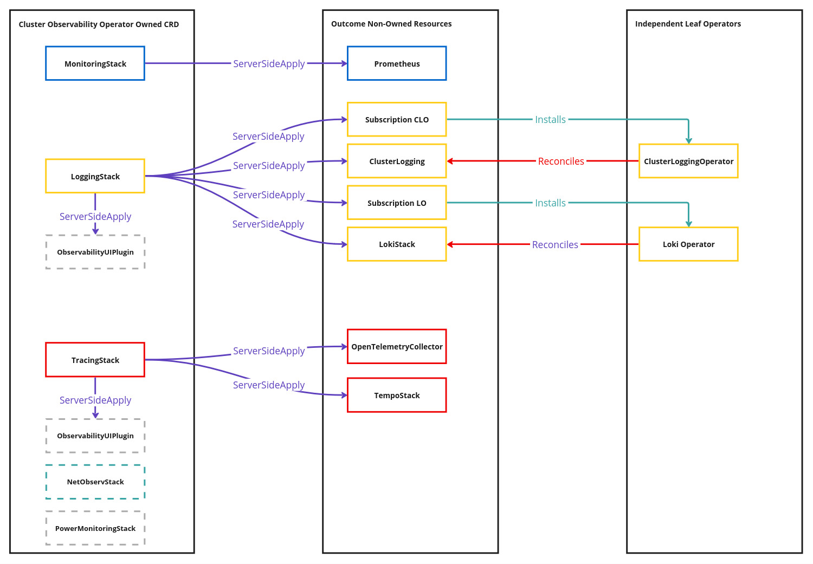

# Logging Stack for Cluster Observability Operator

## Release Signoff Checklist

- [X] Enhancement is `implementable`
- [X] Design details are appropriately documented from clear requirements
- [ ] Test plan is defined
- [ ] Operational readiness criteria is defined
- [ ] Graduation criteria for dev preview, tech preview, GA
- [X] User-facing documentation is created in [openshift-docs]([https://github.com/openshift/openshift-docs/](https://github.com/openshift/openshift-docs/))
  - The project documentation will be part of the project itself. No documentation in openshift-docs will be needed.
  See [Documentation Required](#documentation-required) for further details.

## Summary

This document proposes a solution and a delivery plan for a unified installation and upgrading procedure of the logging for Red Hat OpenShift product (short OpenShift Logging) as well as auxiliary UI and correlation (See [korrel8r](korrel8r)) components via the [Cluster Observability Operator](cluster-observability-operator)(COO). The proposed solution is intended to complement the existing OpenShift Logging stack managed by the [Cluster Logging Operator](cluster-logging-operator)(CLO) and the [Loki Operator](loki-operator)(LO). Furthermore the proposal aims to be a blueprint approach for other OpenShift Observability products (i.e distributed tracing, network observability, power monitoring).

## Background

OpenShift Logging is a multi-purpose product composed of two operators CLO (managing collection/normalization/forwarding and visualization) and LO (managing Loki-based storage, rules and alerts). Over time the two following usage themes emerged:

1. **Collection and Forwarding only**: This theme emerges in customer environments where storage and visualization are outsourced to third-party solutions (e.g. AWS Cloudwatch, Apache Kafka, Splunk). The requirements emphasize the need to export logs from a cluster **only** and focus on the efficiency aspects of that task (e.g. tuning, filtering, pruning, etc.).
2. **All-In-One stack**: This theme has been at the product's core since inception. It manifests in a single custom resource namely `ClusterLogging` to manage the installation of all components (collection/normalization/forwarding, storage and visualization). However, migrating to Loki-based storage as well as an OpenShift Console based visualization enabled more configuration flexibility but at the expense of installation/upgrade user experience, i.e.:
    1. The `ClusterLogging` resource does not directly manage the Loki-based storage installation (as previously with `Elasticsearch`). Nowadays it is an installation prerequisite, by the user, to create a `LokiStack` resource.
    2. The OpenShift Console visualization plugin namely [logging-view-plugin](logging-view-plugin) is not installed/upgraded by any resource. The user can **only** opt-in to use it when installing CLO.

Therefore this proposal aims to address the challenges users face when they follow the second theme, i.e. using OpenShift Logging as an all-in-one in-cluster offering.

## Motivation

Red Hat Observability products underwent similar inception and evolution paths as OpenShift Logging to gradually support a variety of customer environments: on-premises, OpenShift Dedicated and Managed Services.

Even though each product's development lifecycle is and should stay independent the sheer amount of installation/upgrading procedures impose a high tax on users. Auxiliary components that unify user experience under the hood of the OpenShift Console as well as emerging ones like correlation applify this negative impact over the product lifecycles.

As a result, to enhance user experience with OpenShift Observability products this proposal aims to be a foundation for future observability enhancements on:

* How to declaratively request the installation and/or upgrade of a specific Observability signal without applying separate procedures each time.
* How to uniformly handle the lifecycle, version skew and OpenShift Console dependencies of all Observability view plugins.
* How to add more value across signals applying automation (i.e. enable correlation components, sharing scheduling primitives, labeling rules/alerts).



### User Stories

As an OpenShift administrator, I want to install each observability capability creating a single custom resource, so I can easily set up custom-tailored observability for infrastructure and workloads.

As an OpenShift administrator, I want to upgrade each observability capability editing a custom resource, so I can focus only on post-upgrade steps.

As an OpenShift administrator, I want to edit observability components through underlying custom resoures, so I can improve overall reliability and performance of individual components when needed.

As an OpenShift administrator, I want to use metrics to logs correlation without additional installation procedure, so I can troubleshoot infrastructure/workloads by navigating from metrics to logs and vice versa.

### Goals

* Provide a custom resource managed by the Cluster Observability Operator that is responsible for installing and upgrading the OpenShift Logging stack (i.e. operators and operands).
* Provide a custom resource managed by the Cluster Observability Operator that is responsible for installing and upgrading each OpenShift Console observability UI plugin.
* Provide automation for installing and upgrading correlation components when at least two observability signals are available.

### Non-Goals

* Provide opinionated abstractions in form of custom resources to replace the OpenShift Logging custom resources.
* Provide replacement installations/upgrading procedures for the Operator Framework and Lifecycle Manager (OLM) to manage operators.

## Proposal

A `LoggingStack` CRD will be introduced. In addition the relation to the `ObservabilityUIPlugin` resource will be outlined on how to manage the [logging-view-plugin](logging-view-plugin) deployment. Finally the automation to manage and the [korrel8r](korrel8r) deployment for metrics-logs correlation will be introduced in the Cluster Observability Operator when a least a `MonitoringStack` and a `LoggingStack` resource are created by a user.

### Workflow Description

#### Installation Workflow

For the OpenShift Logging administrator using the Cluster Observability Operator installation under the proposed system:

1. The user goes to the console and creates a `LoggingStack` resource. In this resource the user providers an OpenShift Logging subscription channel (e.g. `stable-5.8`).
2. The Cluster Observability Operator creates an `OperatorGroup` and `Subscription` for CLO in `openshift-logging` from the catalog source `redhat-operator` and namespace `openshift-marketplace`.
3. The Cluster Observability Operator creates an `OperatorGroup` and `Subscription` for LO in `openshift-operators-redhat` from the catalog source `redhat-operator` and namespace `openshift-marketplace`.
4. The Cluster Observability Operator tracks the corresponding `ClusterServiceVersions` for CLO and LO until they reach the phase `succeeded`.
5. The Cluster Observability Operator creates a `ClusterLogForwarder` and a `LokiStack` resource in `openshift-logging` which create and manage all logging stack components.
6. The Cluster Observability Operator tracks on a high-level when all stack components (i.e. collection, storage, rules) reach the phase `ready`.
7. The Cluster Observability Operator creates an `ObservabilityUIPlugin` resource that will create and manage the [logging-view-plugin](logging-view-plugin) plugin.
8. **Optional**: The Cluster Observability Operator creates a [korrel8r](korrel8r) deployment resource if and only if a `MonitoringStack` resource exists.

#### Upgrades Workflow

For the OpenShift Logging administrator using the Cluster Observability Operator installation under the proposed system:

1. The user edits the `LoggingStack` resource by selecting a new OpenShift Logging subscription channel (e.g. `stable-5.9`).
2. The Cluster Observability Operator propagates the channel change in the `Subscription` for LO.
3. The Cluster Observability Operator tracks the newly selected LO `ClusterServiceVersion` for the new channel until it reaches phase `succeeded`.
4. The Cluster Observability Operator tracks the storage and rules components until they reach phase `ready`.
5. The Cluster Observability Operator propagates the channel change in the `Subscription` for CLO.
6. The Cluster Observability Operator tracks the newly selected CLO `ClusterServiceVersion` for the new channel until it reaches phase `succeeded`.
7. The Cluster Observability Operator tracks the collection components until they reach phase `ready`.

### API Extensions

The `LoggingStack` is meant to be an abstraction over two aspects of OpenShift Logging:
1. The declarative intent on installing/upgrading all subsequent operators and operands.
2. The minimum viable declaration of the logging stack possible, e.g. user provides refs to external dependencies like S3-compatible storage credentials, Certificate Authority bundles.

An example `LoggingStack` resource could look as follows:

```yaml
apiVersion: logging.rhobs/v1alpha1
kind: LoggingStack
metadata:
  name: sample-logging-stack
  namespace: openshift-logging
spec:
  monitoringSelector:
    openshift.io/cluster-monitoring: "true"
  subscription:
    installPlanApproval: Automatic
    channel: stable-5.8
  storage:
    size: 1x.extra-small
    storageClassName: gp3-csi
    storage:
      secret:
        name: aws-s3-credentials
        type: s3
```

The `ObservabilityUIPlugin` resources are discussed in a [separate proposal](observability-ui-proposal) here.

### Topology Considerations

#### Hypershift / Hosted Control Planes

N/A.

#### Standalone Clusters

This proposal is mainly targeting standalone clusters either on-premises or OpenShift Dedicated. Users upgrading from existing OpenShift Logging installation need to uninstall them first and re-install through the Cluster Observability Operator by following the above workflow. Doing so will enable to use the correlation component out of the box.

#### Single-node Deployments or MicroShift

N/A.

### Implementation Details/Notes/Constraints

#### Handling multiple LoggingStack resourceselector on the same cluster

Historically the OpenShift Logging product allows the creation **only** of a single logging stack per cluster. This design detail represents a choice to preserve resources on a cluster rather than a limitation. Having multiple end-to-end stacks is rather a very expensive solution and has been corroborated by different means:
- Soft tenancy combined with full RBAC-based controls on logs. This design choice renders the need for multiple expensive log storage installations obsolete.
- Using namespaced `ClusterLogForwarder` resources to offers users with configuration options on which workloads should be collected as well as how to filter logs.

Therefore it is possible to allow creating multiple `LoggingStack` resources on the same cluster with the following workflow:
1. Create main `LoggingStack` resource in `openshift-logging` namespace that reconciles the operator installation as well as the resources `ClusterLogging` and `Lokistack`.
2. Create a `LoggingStack` resource on any other namespace can be rendered on a `ClusterLogForwarder` resource accounting for collecting the workload logs of that namespace and forwarding them to the `default` log store backed by the `LokiStack` resource.

Limitations of the above worklow are:
1. Opt-in to collect audit logs should be allowed only via the main `LoggingStack` resource in `openshift-logging`. Any other `LoggingStack` resource will be ignored on this matter.
2. Using the API audit log filtering capabilities in `ClusterLogForwarder` (See [docs](clf-api-audit-log-filter)) is only possible in `openshift-logging`.

In summary although the above workflow is feasible, the present proposal does **not** recommend any further implementation leaving users to manage their own `ClusterLogForwarder` resource per namespace if needed, because:
1. The translation of per namespace `LoggingStack` resources to `ClusterLogForwarder` is of diminishing returns.
2. More important the limitations of Server-Side-Apply on list items make several annotation makers on the `ClusterLogForwarder` resource mandatory (See later on [SSA-Limitations](#limitations-of-server-side-apply-on-openshift-logging-resources))

#### Implications of Server-Side-Apply on OpenShift Logging resources

The Cluster Observability Operator's design is centered around the Kubernetes Server-Side-Apply capability. In short it allows sharing resources between separate operator on the resource field level. However each OpenShift Logging resource has mandatory requirements on field when created. These fields will inevitably change management ownership from CLO/LO to the Cluster Obserbability Operator.

In detail the following `ClusterLogging` fields will be managed by COO exclusively without allowing user edits:
```yaml
spec:
  managementState: Managed
  logStore:
    type: lokistack
    lokistack:
      name: <name-of-lokistack-resource>
  collection:
    type: vector
```

Also the following `LokiStack` fields will be managed by COO and allowing user edits through the `LoggingStack` resource:
```yaml
spec:
  storage:
    size: 1x.demo
    storageClassName: gp3-csi
    storage:
      secret:
        name: test
        type: s3
```

#### Limitations of Server-Side-Apply on OpenShift Logging resources

When using Server-Side-Apply the implementation needs to be informed of several caveats:
1. Fields that have default values will inevitably show up being managed by the Cluster Observability Operator.
2. List fields missing CRD markers such as OpenAPI `x-kubernetes-list-type` and `x-kubernetes-list-map-keys` the entire list is replaced which means the full list is managed by the Cluster Observability Operator.

The first caveat is not relevant because neither `ClusterLogging` nor `LokiStack` resource make use of the `+kubebuilder:default` CRD marker in fields required for creation. The second once has severe impact on when managing `ClusterLogForwarder` resource. As per now the `ClusterLogForwarder` spec consists mainly of list fields namely `inputs`, `outputs` and `pipelines` where none is annotated with the OpenAPI `x-kubernetes-list-type` and `x-kubernetes-list-map-keys` markers. Therefore managing a `ClusterLogForwarder` via `LoggingStack` effectively means re-exposing the whole API which is considered harmful and on the opposite of the entire proposal.

However, if future enhancements address use cases relevant for `LoggingStack` resources owning `ClusterLogForwarder` resources, then it will need the following markers:
* For `inputs`: The `x-kubernetes-list-type: map` in companion with `x-kubernetes-list-map-keys: ["name"]`.
* For `outputs`: The `x-kubernetes-list-type: map` in companion with `x-kubernetes-list-map-keys: ["name"]`.
* For `pipelines`: The `x-kubernetes-list-type: map` in companion with `x-kubernetes-list-map-keys: ["name"]`.

#### Migration of logging-view-plugin from CLO to COO

As above mentioned this proposal aims to move managing of UI relevant deployments link [logging-view-plugin](logging-view-plugin) from CLO to the Cluster Obserbability Operator. To enable a smooth transition period from the present setup (i.e. CLO exclusively deployment management) to the future setup (i.e. COO exclusively deployment management), a step-by-step approach is proposed over several CLO releases:

When used with previous released CLO versions:
1. COO creates a `Subscription` for CLO **without** enabling the Console plugin on the cluster-wide `Consoles` resource.
2. COO creates a `ClusterLogging` resource setting `spec.visualization.type: console`.
2. CLO creates and continues managing the [logging-view-plugin](logging-view-plugin) deployment resource.
3. COO patches the `Consoles` resource when reconciling the `ObserbabilityUIPlugin` resource owned by `LoggingStack`.

When used with future CLO version w/o [logging-view-plugin](logging-view-plugin) management:
1. COO simply creates a `Subscription` for CLO to install the operator. A Console plugin option is omitted as not existing anymore.
2. COO creates a `ClusterLogging` resource managing only `spec.collection` and `spec.logStorage`.
3. COO creates a deployment for [logging-view-plugin](logging-view-plugin) when reconciling the `ObserbabilityUIPlugin` resource owned by `LoggingStack`.
4. COO patches the `Consoles` resource when reconciling the `ObserbabilityUIPlugin` resource owned by `LoggingStack`.

### Cluster Obserbability Operator design impact managing OLM-based operators

When an operator (i.e. COO) managing the installation/upgrade of further operators (i.e. CLO and LO) as well as resources owned by the managed operators, they key consideration should be on when managed CRDs will registered on the Kube APIserver. The registration event is a cornerstone for the kubernetes clientsets used in COO to reconcile shared custom resources such as `ClusterLogging` and `Lokistack`. In particular it is mandatory for client abstration such as `informers` and `listers` to execute **only** on resource known by the Kube APIserver.

Therefore the Cluster Observability Operator requires a major design overhaul that supports the following aspects:
1. Independent reconciliation loops for installing/upgrading managed operators.
2. Reconciliation loops for shared resources such as `ClusterLogging` and `Lokistack` only and only if registration of the corresponding CRD successful
3. Robust signaling between the above two and in turn mindful setup and tear-down of underlying kubernetes clientsets/informers/listers.

In summary the Cluster Observability Operator binary will hold two actively communicating sub-controllers each managing distinct aspects for an owned resource like `LoggingStack`, i.e.:
1. **Operators-Controller**: This controller reconciles a `LoggingStack` resource into `OperatorGroup` and `Subscription` resources for CLO and LO only. It tracks success as well as failure conditions for each operator installation/upgrade phase on the `LoggingStack` status field.
2. **Components-Controller**: This controller reconciles the same `LoggingStack` resource into the resources `ClusterLogging`, `LoggingStack` and `ObservabilityUIPlugin` that in turn install and manage the logging stack components (e.g. collection, storage and visualization plugin).

### LoggingStack status conditions

To effectively track the success/failure status at any point in time of the managed operators (i.e. CLO and LO), the following conditions will be aggregated from OLM resources into the `LoggingStack` status conditions:
1. TBD
2. ...

To effectively track the success/failure status of the managed but shared custom resources, the following conditions will be aggregated from the `ClusterLogging` and `LokiStack` resources into the `LoggingStack` status conditions:
1. TBD
2. ...

Finally the following conditions will be managed in the `LoggingStack` status conditions about visulization and correlation:
1. TBD
2. ...

### Automated korrel8r deployment management

A separate controller namely `correlation_controller` will be introduced in the Cluster Obserbability Operator watching only on create and delete events of `MonitoringStack` and `LoggingStack` resources. If both exist the [korrel8r](korrel8r) deployment will be fully automated on the Cluster Observability Operator installation namespace.

#### Automated korrel8r deployment with CMO/UWM

For OpenShift environments still depending on Cluster-Monitoring-Operator managing the monitoring aspects of infrastructure and workloads (i.e. via User Workload Monitoring) the event of any Alertmanager instance being used on this platform can be be used as a surrogate event for a missing `MonitoringStack`. The events to track Alertmanager instances (via existence of Kubernetes `Service` resources) is a robust approach to inject [korrel8r](korrel8r) as per now the UI links are shown in Alerting related pages only.

### Risks and Mitigations

1. **Risk**: Tracking the installation/upgrading path following the trail of multiple Operator Framework resources (`Subscription` -> `InstallPlan` -> `ClusterServiceVersion`) requires detailed due dilligence on how to categorize and summarize their conditions into high-level ones for a better user experience.
2. **Risk**: We are well advised to consider the long-term goal of the Operator Framework to migrate to a newly multi-tenant / multi-version operator management approach using new designed CRDs which introduce breaking changes.
3. **Risk**: To manage install/uninstall robustly the Cluster Observability Operator is required to become aware of CRD registration at each time which in turn requires to re-instantiate internals like informers/listers/etc. This might require considerable custom design and work as per controller-runtime abstraction not designed or allowing restarting entire controllers.

### Drawbacks

The key threats of the above design that could lead to poor user experience and maybe higher migration/maintenance burden are:
1. If and when the Operator Framework switches from existing resources (i.e. `Subscription` and `ClusterServiceVersion`) to new resources designed for multi-tenancy and allowing co-hosting multiple version of the same operator, will eventually mean a rewrite the entire machinery managing for example a `LoggingStack` resource.
2. Lifting the current limitation from allowing a single `LoggingStack` to multiple ones requires to manage upgrade paths from `ClusterLogForwarder/v1` to the upcoming `ClusterLogForwarder/v2` CRD. This tasks is considered to be undertaken by a conversion webhook in CLO but uncertain if and when it materializes. Thus the Cluster Observability Operator complexity might grow over time to supplement missing behavior as such to cope with user expectations.


## Open Questions [optional]

This is where to call out areas of the design that require closure before deciding
to implement the design.  For instance,
 > 1. This requires exposing previously private resources which contain sensitive
  information.  Can we do this?

## Test Plan

TBD.

## Graduation Criteria


### Dev Preview -> Tech Preview

- Ability to utilize the enhancement end to end
- End user documentation, relative API stability
- Sufficient test coverage
- Gather feedback from users rather than just developers
- Enumerate service level indicators (SLIs), expose SLIs as metrics
- Write symptoms-based alerts for the component(s)

### Tech Preview -> GA

- More testing (upgrade, downgrade, scale)
- Sufficient time for feedback
- Available by default
- Backhaul SLI telemetry
- Document SLOs for the component
- Conduct load testing
- User facing documentation created in [openshift-docs](https://github.com/openshift/openshift-docs/)

**For non-optional features moving to GA, the graduation criteria must include
end to end tests.**

### Removing a deprecated feature

N/A.

## Upgrade / Downgrade Strategy

The upgrade strategy from OpenShift Logging to a `LoggingStack` managed approach that enables using correlation requires:
1. Uninstall the OpenShift Logging resources on a cluster.
2. Uninstall the OpenShift Logging operators.
3. Install the Cluster Observability Operator.
4. Re-create the above by creating a `LoggingStack` resource.

In addition the OpenShift Logging administrator should expect:
1. The above upgrade path can only be considered for supported OpenShift Logging version as listed in `loggingStack.spec.subscription.channel`.

## Version Skew Strategy

### Version skew between log storage, UI Plugin and OCP

TBD: Explain what happens with OCP upgrades here between UI features depending on OCP console features vs. log storage components.

### Version skew between log rules/alerts, UI Plugin and OCP

TBD: Explain what happens with OCP upgrades here between UI features depending on OCP console features vs. log ruler component.

## Operational Aspects of API Extensions

TBD.

## Support Procedures

TBD.

## Alternatives

TBD.

## Infrastructure Needed [optional]

N/A.

[clf-api-audit-log-filter]: https://docs.openshift.com/container-platform/4.14/logging/log_collection_forwarding/configuring-log-forwarding.html#logging_audit_filtering_configuring-log-forwarding
[cluster-logging-operator]:https://github.com/openshift/cluster-logging-operator
[cluster-observability-operator]:https://github.com/rhobs/observability-operator/
[korrel8r]:https://github.com/korrel8r/korrel8r
[logging-view-plugin]:https://github.com/openshift/logging-view-plugin
[loki-operator]:https://github.com/grafana/loki/tree/main/operator
[observability-ui-proposal]:https://github.com/openshift/enhancements/pull/1494
