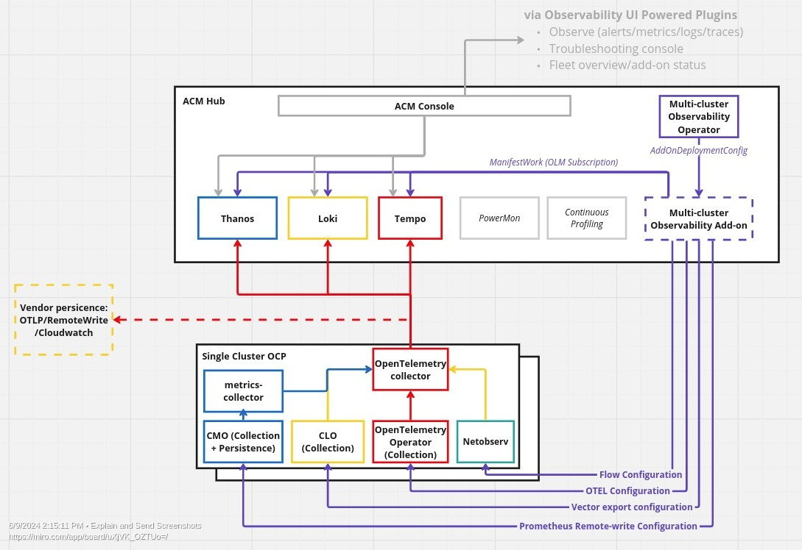

# Multi-Cluster telemetry data exportation

## Release Signoff Checklist

- [x] Enhancement is `implementable`
- [ ] Design details are appropriately documented from clear requirements
- [ ] Test plan is defined
- [ ] Graduation criteria for dev preview, tech preview, GA
- [ ] User-facing documentation is created in [openshift-docs](https://github.com/openshift/openshift-docs/)

## Summary

The objective of multi cluster observability is to offer users a capability to collect 
metrics, logs and traces from spoke clusters. Currently, the collection technology 
uses three different technology stacks and protocols for exporting data (Prometheus 
remote-write for metrics, Loki push for logs and OTLP for traces). 
Loki push and Prometheus remote-write are not commonly supported as ingest protocols by 
observability vendors.

This enhancement proposal seeks to strengthen interoperability of MCOA by unifying and 
simplifying exporting of all MCOA telemetry data (metrics, logs, traces) 
by exposing a unified export API and consolidating export protocols. This capability
enables users to send data from MCOA to any observability vendor and apply 
fine-grained filtering and routing on exported data to configurable sinks.

## Motivation

At the moment exporting all telemetry data from OpenShift is fragmented to three 
technology stacks (Prometheus, ClusterLoggingForwarder, OpenTelemetry collector). 
Every tool uses a different configuration API, export protocol and provides (or does 
not provide) filtering/PII capabilities.

### Prior art and user requests

* Red Hat OpenShift as OpenTelemetry (OTLP) native platform: https://www.redhat.com/en/blog/red-hat-openshift-opentelemetry-otlp-native-platform
* Export in-cluster metrics to 3rd party vendor https://github.com/openshift/cluster-monitoring-operator/issues/2000
* Exporting metrics to Dynatrace https://issues.redhat.com/browse/OBSDA-433
* Export all metrics to Dynatrace https://issues.redhat.com/browse/OBSDA-450
* Customer asking to export metric to Splunk https://redhat-internal.slack.com/archives/C04TFRRKUA2/p1687853284985279

### User Stories

* As a fleet administrator, I want to export all telemetry signals collected by MCOA to an OTLP compatible endpoint(s).
* As a fleet administrator, I want to filter sensitive data before it is exported to MCO telemetry store or 3rd party OTLP endpoint.
* As a fleet administrator, I want to decide which data is exported to MCO telemetry store or 3rd party OTLP endpoint.

### Goals

* Use OTLP protocol to export all telemetry data to a 3rd party system.
* Provide a single configuration API on MCO CRD for exporting all telemetry data.
* Provide unified filtering and routing capabilities for all exported telemetry data.

### Non-Goals

* Data visualization and querying.

## Proposal

The following section describes how data exportation, routing and filtering is 
configured in MCO and MCOA.

### Workflow Description

1. Configure OTLP endpoint in MCO (`MultiClusterObservability`) CR.
2. The MCOA configures an additional OTLP exporter in the OpenTelemetry collector. The 
   exporter is in the pipeline that receives all supported telemtery signals.
3. (optional) Filtering (e.g. for PII) can be configured in 
   `OpenTelemetryCollector` CR manged by MCOA by [transformprocessor](https://github.
   com/open-telemetry/opentelemetry-collector-contrib/blob/main/processor/transformprocessor/README.md).
4. (optional) Routing can be configured in `OpenTelemetryCollector` CR managed by MCOA by
   [routingprocessor](https://github.com/open-telemetry/opentelemetry-collector-contrib/tree/main/processor/routingprocessor).

### API Extensions

None - no new APIs for CRDs are introduced.

### Implementation Details/Notes/Constraints [optional]

#### General configuration and fleet-wide stanzas

To support above workflow MCOA deploys additional collector which forwards collected 
data to 3rd party OTLP endpoint.

- An `OpenTelemetryCollector` resource that enables receivers for supported telemetry 
  signals. The individual telemetry stacks will forward data to these endpoints. 
   The collector enables OTLP exporter for and forwarding to 3rd party vendor.

#### Hypershift [optional]

N/A

### Drawbacks

- MCOA configuration through the MultiClusterObservability: the MCO CR nowadays has an already extensive set of configuration fields, when designing the MCOA configuration, we will need to take extra caution as to not make this CR more complex and hard to navigate;
- MCOA manifest sync: with MCOA being deployed by MCO we will need to set up a procedure to maintain the MCOA manifests that live in the MCO repo up to date.
- CRD conflicts: MCOA will leverage the CRDs from other operators we will have to ensure that we will not be running into situations where two operators are managing the same CRD

## Design Details

### Open Questions [optional]

TBD

### Test Plan

TBD

### Graduation Criteria

TBD

#### Dev Preview

TBD

#### Dev Preview -> Tech Preview

TBD

#### Tech Preview -> GA

TBD

#### Removing a deprecated feature

None

### Upgrade / Downgrade Strategy

None

### Version Skew Strategy

None

### Operational Aspects of API Extensions

TBD

#### Failure Modes

TBD

#### Support Procedures

TBD

## Implementation History

TBD

## Alternatives

### Multiple OTLP exporter/sinks

OTLP exporter/sink could be implemented in all telemetry collectors (`Prometheus`, 
`ClusterLogForwarder`, `OpenTelemetryCollector`), however providing a common filtering 
and routing capabilities will be problematic if not possible.

In addition to exporting in OTLP, a single collector will enable MCO to easily support 
exporting data to other systems with custom protocols (e.g. AWS CloudWatch, 
Google Cloud Monitoring/Logging, Azure Monitor).

### Integrate directly into present Multi-Cluster-Observability-Operator

TBD

## Infrastructure Needed [optional]

None

[ocm-addon-framework]:https://github.com/open-cluster-management-io/addon-framework
[opentelemetry-operator]:https://github.com/open-telemetry/opentelemetry-operator
[rhacm-multi-cluster-observability]:https://github.com/stolostron/multicluster-observability-operator

## RANDOM  IDEAS

- 
