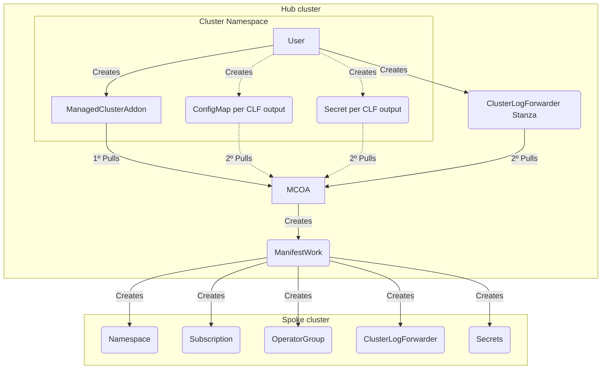
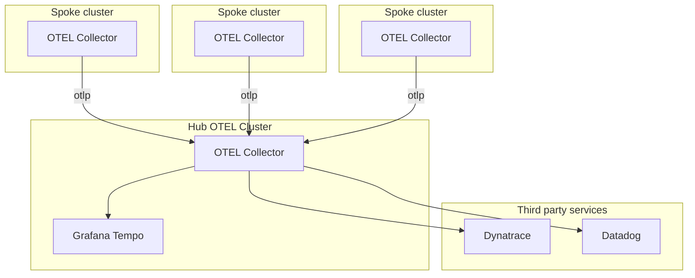

# Multi-Cluster Logs and Traces Forwarding

## Release Signoff Checklist

- [x] Enhancement is `implementable`
- [ ] Design details are appropriately documented from clear requirements
- [ ] Test plan is defined
- [ ] Graduation criteria for dev preview, tech preview, GA
- [ ] User-facing documentation is created in [openshift-docs](https://github.com/openshift/openshift-docs/)

## Summary

Multi-Cluster Observability has been an integrated concept in Red Hat Advanced Cluster Management (RHACM) since its inception but only incorporates one of the core signals, namely metrics, to manage fleets of OpenShift Container Platform (OCP) based clusters (See [RHACM Multi-Cluster-Observability-Operator (MCO)](rhacm-multi-cluster-observability)). The underlying architecture of RHACM observability consists of a set of observability components to collect a dedicated set of OCP metrics, visualizing them and alerting on fleet-relevant events.

This enhancement proposal seeks to bring a unified approach to collect and forward logs and traces from a fleet of OCP clusters based on the RHACM addon facility (See Open Cluster Management (OCM) [addon framework](ocm-addon-framework)) by enabling these signals events to land on third-party managed storage solutions (e.g. AWS Cloudwatch, Google Cloud Logging, Splunk). The proposed addon is an optional RHACM component. It is installed by the MCO Operator. It provides a unified installation approach of required dependencies (e.g. operator subscriptions) and resources (custom resources, certificates, CA Bundles, configuration) on the managed clusters to collect and forward logs and traces. The addon's name is MultiCluster-Observability-Addon (short MCOA).

## Motivation

The main goal here is to simplify and unify the installation of logs and traces collection and forwarding on a RHACM managed fleet of OCP clusters. The core function of the addon is to install required operators (i.e. [Red Hat OpenShift Logging](ocp-cluster-logging-operator) and [Red Hat OpenShift distributed tracing platform](opentelemetry-operator)), configure required custom
resources (i.e. `ClusterLogForwarder`, `OpenTelemetryCollector`) and reconcile per-cluster-related authentication resources (i.e. `Secrets`, `ConfigMaps`). This enables fleet-wide control of logs and traces collection and forwarding.

### User Stories

* As a fleet administrator, I want to install a homogeneous log collection and forwarding on any set of RHACM managed OCP clusters.
* As a fleet administrator, I want to install a homogeneous trace collection and forwarding on any set of RHACM managed OCP clusters.
* As a fleet administrator, I want to centrally control authentication credentials for the target log forwarding outputs.
* As a fleet administrator, I want to centrally control authentication credentials for the target trace exporters.

### Goals

* Provide an optional RHACM addon to control collection and forwarding of logs and traces on managed OCP clusters.
* Enable control of authentication and authorization of storage endpoints from the hub cluster.
* Enable TLS Certificate management local on the hub cluster for managed cluster TLS client certificates.

### Non-Goals

* Provide end-to-end experience to collect, forward, store and visualize logs and traces on the same RHACM fleet.
* Share MCO's ingestion and querying capabilities for logs and traces collected by MCOA.

## Proposal

The following sections describe in detail the required resources as well as the workflow to enable collection and forwarding of logs and traces on an RHACM managed fleet of OCP clusters.

### Workflow Description

The workflow implemented in this proposal enables fleet-wide collection and forwarding of logs and traces as follows:

1. When the fleet administrator either enables either Logs and/or Traces in the `MultiClusterObservability` resource, then MCOA is deployed by MCO.
2. The fleet administrator creates a default `ClusterLogForwarder` stanza in the `open-cluster-management` namespace that describes the list of log forwarding outputs. This stanza will then be used as a template by MCOA when generating the `ClusterLogForwarder` instance per managed cluster.
3. The fleet administrator creates a default `OpenTelemetryCollector` stanza in the `open-cluster-management` namespace that describes the list of trace receivers, processors, connectors and exporters. This stanza will then be used as a template by MCOA when generating the `OpenTelemetryCollector` instance per managed cluster.
4. For each managed cluster the MCOA or the fleet administrator provides on the managed cluster namespace additional configuration resources:
   1. For both Logs and Traces a `ConfigMap` with the authentication methods that should be used for each Log Output/ Trace Exporter. 
   2. Per Log Output / Trace Exporter `ConfigMap`: For each output a resource holding output specific configuration (See [ClusterLogForwarder Type: OutputTypeSpec](ocp-clusterlogforward-outputtypespec), [OpenTelemetry Collector Authentication](opentelemetry-collector-auth))
   3. Each resource created should be annotated with a special label `mcoa.openshift.io/signal` that should be set to the resource that should use that resource.
   4. Each log output related resource needs to also have an annotation `logging.openshift.io/target-output-name` that corresponds to name the target output spec in the default `ClusterLogForwarder` resource.
   5. Each trace exporter related resource needs to also have an annotation `tracing.mcoa.openshift.io/target-output-name` that corresponds to name the target extension in the default `OpenTelemetryCollector` config spec.
   6. Finally a `ManagedClusterAddon` specifying all the resources that should be used by the addon to configure the addon deployment on the managed cluster.
5. The MCOA will then render a `ManifestWorks` resource per cluster that consists of a rendered manifest list (i.e. `Subscription`, `ClusterLogForwarder`, `OpenTelemetryCollector` and accompanying `Secret`, `ConfigMap`).
6. The WorkAgentController on each managed cluster will apply each individual manifest from the `ManifestWorks` locally.

#### Variation and form factor considerations [optional]

- If the authentication method mTLS is used for either logs or traces then the user will also need to provide a resource containing the CA bundle that should be used for the mTLS workflow. This can be done by annotating either a `Secret` or `ConfigMap` with `authentication.mcoa.openshift.io/ca` and adding this resource to the `ManagedClusterAddon` configuration. MCOA will then consume this resource and inject the CA bundle data on the final secret.

### API Extensions

None as the MCOA is not providing any new custom resource definitions or changing any existing ones.

### Implementation Details/Notes/Constraints [optional]

The MCOA implementation sources three different set of manifests accompanying the addon registration and deployment on a RHACM hub cluster:
1. General configuration and fleet-wide stanzas: A `ClusterManagementAddon`, an `AddOnDeploymentConfig` and a `ClusterLogForwarder` (for logs) and/or `OpenTelemetryCollector` (for traces).
2. For multi-cluster logs collection and forwarding: Per log output `Secret` and/or `ConfigMap` resources.
3. For multi-cluster traces collection and forwarding: Per trace exporter `Secret` and/or `ConfigMap` resources.

#### General configuration and fleet-wide stanzas

To support the above workflow MCOA requires along the addon registration and installation two key resources:
- A `ClusterManagementAddOn` resource that describes which resources to be considered by the addon as source configuration.
- An `AddonDeploymentConfig` resource that describes which channel names to used by a managed cluster's Operator Lifecycle Manager (OLM) to install supported operators for logs and traces collection and forwarding. (TODO this might endup being moved to the MCO CR)
- A `ClusterLogForwarder` resource that describes the log outputs per log type to be used for log collection and forwarding on all managed clusters.
- An `OpenTelemetryCollector` resource that describes the trace exporters to be used for traces collection and forwarding on all managed clusters.

In detail, the resources look as follows:

```yaml
apiVersion: addon.open-cluster-management.io/v1alpha1
kind: ClusterManagementAddOn
metadata:
 name: multicluster-observability-addon
spec:
 addOnMeta:
   displayName: Multi Cluster Observability Addon
   description: "multicluster-observability-addon is the addon to configure spoke clusters to collect and forward logs/traces to a given set of outputs"
 supportedConfigs:
   # Describes the general addon configuration applicable for all managed clusters. It includes:
   # - Default subscription channel name for install the `Red Hat OpenShift Logging` operator on each managed cluster.
   # - Default subscription channel name for install the `Red Hat OpenShift distributed tracing platform` operator on each managed cluster.
   - group: addon.open-cluster-management.io
     resource: addondeploymentconfigs
     defaultConfig:
       name: multicluster-observability-addon
       namespace: open-cluster-management

   # Describe per managed cluster sensitive data per target forwarding location, currently supported:
   # - TLS client certificates for mTLS communication with a log output / trace exporter.
   # - Client credentials for password based authentication with a log output / trace exporter.
   - resource: secrets

   # Describe per managed cluster auxilliary config per log output / trace exporter.
   - resource: configmaps

   # Describes the default log forwarding outputs for each log type applied to all managed clusters.
   - group: logging.openshift.io
     resource: clusterlogforwarders
     # The default config is the main stanza of a ClusterLogForwarder resource
     # that describes where logs should be forwarded for all managed cluster.
     defaultConfig:
       name: instance
       namespace: open-cluster-management

   # Describes the default OpenTelemetryCollector type applied to all managed clusters.
   - group: opentelemetry.io
     resource: opentelemetrycollectors
     # The default config is the main stanza of an OpenTelemetryCollector resource
     # that describes where traces should be forwarded for all managed cluster.
     defaultConfig:
       name: spoke-otelcol
       namespace: open-cluster-management
```

and a default `AddonDeploymentConfig` describing the operator subscriptions to be used on each managed cluster:

```yaml
apiVersion: addon.open-cluster-management.io/v1alpha1
kind: AddOnDeploymentConfig
metadata:
  name: multicluster-observability-addon
  namespace: open-cluster-management
spec:
  customizedVariables:
    - name: clusterLoggingChannel
      value: stable-5.9
    - name: otelChannel
      value: stable
```

#### Multi Cluster Log Collection and Forwarding

The following diagram tries to encapsulate the workflow for the multi cluster Log Collection and Forwarding case, note that dotted lines mean optional actions:



To better understand the diagram let's assume that we now want to forward application logs to a Grafana Loki instance and infrastructure/audit logs to AWS Cloudwatch. 

In this example the user will have to create the following resources:
- `ClusterLogForwarder` stanza that will contain the majority of the configuration;
- `ManagedClusterAddOn` to actually install the addon on a cluster and reference the resources that will be user for configuration;
- A `ConfigMap` named `logging-auth` with a list containing each output and the authentication method;
- A `ConfigMap` with the `application-logs` output configuration;
- A `ConfigMap` with the `cluster-logs` output configuration;
- A `Secret` containing the AWS credentials that will be used for CloudWatch in the `cluster-logs` output;

In contrast MCOA will create the following resources:
- A `Secret` for the mTLS configuration for the `application-logs` output;
- `ManifestWork` containing a list of the resources that will be created on the spoke cluster;

```yaml
apiVersion: logging.openshift.io/v1
kind: ClusterLogForwarder
metadata:
  name: instance
  namespace: open-cluster-management
spec:
  outputs:
  - loki:
      labelKeys:
      - log_type
      - kubernetes.namespace_name
      - kubernetes.pod_name
      - openshift.cluster_id
    name: application-logs
    type: loki
    url: https://PLACEHOLDER # Use a placeholder value because field is required but will be set per cluster.
    secret: 
       name: PLACEHOLDER # Use a placeholder value because field is required but will be set per cluster.
  - cloudwatch:
      groupBy: logType
      region: PLACEHOLDER # Use a placeholder value because field is required but will be set per cluster.
    name: cluster-logs
    type: cloudwatch
    secret: 
       name: PLACEHOLDER # Use a placeholder value because field is required but will be set per cluster.
  pipelines:
  - inputRefs:
    - application
    name: application-logs
    outputRefs:
    - application-logs
  - inputRefs:
    - audit
    - infrastructure
    name: cluster-logs
    outputRefs:
    - cluster-logs
```

For each managed cluster the addon configuration that enables being considered by MCOA looks as follows. It references managed specific configuration resources, i.e. Secrets/ConfigMaps per `ClusterLogForwarder` output:

```yaml
apiVersion: addon.open-cluster-management.io/v1alpha1
kind: ManagedClusterAddOn
metadata:
  name: multicluster-observability-addon
  namespace: spoke
spec:
  installNamespace: open-cluster-management-agent-addon
  configs:
  # ConfigMap containing the authetication methods that should be used for each output
  - resource: configmaps
    name: logging-auth
    namespace: open-cluster-management
  # ConfigMap with the output configuration for application-logs
  - resource: configmaps
    name: logging-spoke-application-logs
    namespace: spoke
  # ConfigMap with the output configuration for cluster-logs
  - resource: configmaps
    name: logging-spoke-cluster-logs
    namespace: spoke
  # ConfigMap containing the CA bundle that will be injected for the mTLS connection with Loki 
  - resource: configmaps
    name: lokistack-hub-gateway-ca-bundle
    namespace: openshift-logging
```

For authentication the user needs to provide a ConfigMap `logging-auth` with a list containing each output and the authentication method:

```yaml
apiVersion: v1
kind: ConfigMap
metadata:
  name: logging-auth
  namespace: spoke
  labels:
    mcoa.openshift.io/signal: logging
data:
  cluster-logs: StaticAuthentication
  application-logs: mTLS
```

Since `StaticAuthentication` is used the user needs to create a secret with the data that will be used by CLO for that output:

```yaml
apiVersion: v1
kind: Secret
metadata:
  name: static-authentication
  namespace: open-cluster-management
data:
  access_key_id: "Base64 access key id"
  access_key_secret: "Base64 access key secret"
```

For the `application-logs` log forwarding output the user need to provide a ConfigMap `logging-spoke-application-logs` with all the required per-cluster fields:

```yaml
apiVersion: v1
kind: ConfigMap
metadata:
  name: logging-spoke-application-logs
  namespace: spoke
  labels:
    mcoa.openshift.io/signal: logging
  annotations:
    logging.mcoa.openshift.io/target-output-name: application-logs
data:
  url: https://mycompany.grafana.com/api/logs/v1/spoke
```

For `cluster-logs` log forwarding output the user needs to provide a ConfigMap `logging-spoke-cluster-logs` with all output configuration, e.g. AWS Cloudwatch:

```yaml
apiVersion: v1
kind: ConfigMap
metadata:
  name: logging-spoke-cluster-logs
  namespace: spoke
  labels:
    mcoa.openshift.io/signal: logging
  annotations:
    logging.openshift.io/target-output-name: cluster-logs
data:
  region: us-east-1
  groupPrefix: a-prefix
```

For the `application-logs` log forwarding output MCOA will provision a Secret `logging-spoke-application-logs` with all required authentication information, e.g. TLS client Certificate:

```yaml
apiVersion: v1
kind: Secret
metadata:
  name: logging-application-logs-auth
  namespace: spoke
stringData:
  'tls.crt': "TLS client certificate"
  'tls.key': "TLS key"
  'ca-bundle.crt': "Certificate Authority certificate" # Pull from the referenced ConfigMap lokistack-hub-gateway-ca-bundle
```


In turn the addon will compile a `ManifestWork` for the managed cluster `spoke` as follows and pass it over it's WorkAgentController:

```yaml
kind: ManifestWork
metadata:
  name: addon-multicluster-observability-addon-deploy-0
  namespace: spoke
spec:
  workload:
    manifests:
    - apiVersion: operators.coreos.com/v1alpha1
      kind: Subscription
      metadata:
        name: cluster-logging
        namespace: openshift-logging
      spec:
        channel: stable-5.9 # Pulled from the AddOnDeploymentConfig
        installPlanApproval: Automatic
        name: cluster-logging
        source: redhat-operators
        sourceNamespace: openshift-marketplace
        startingCSV: cluster-logging.v5.9.0
    - apiVersion: v1
      kind: Secret
      metadata:
        name: logging-spoke-cluster-logs
        namespace: openshift-logging
      data:
        access_key_id: "Base64 access key id"
        access_key_secret: "Base64 access key secret"
    - apiVersion: v1
      kind: Secret
      metadata:
        name: logging-spoke-application-logs
        namespace: openshift-logging
      data:
        'tls.crt': "Base64 encoded TLS client certificate"
        'tls.key': "Base64 endoded TLS key"
        'ca-bundle.crt': "Base64 encoded Certificate Authority certificate"
    - apiVersion: logging.openshift.io/v1
      kind: ClusterLogForwarder
      metadata:
        name: instance
        namespace: open-cluster-management
      spec:
        outputs:
        - loki:
            labelKeys:
            - log_type
            - kubernetes.namespace_name
            - kubernetes.pod_name
            - openshift.cluster_id
          name: application-logs
          type: loki
          url: "https://mycompany.grafana.com/api/logs/v1/spoke" # Pulled from the `logging-spoke-application-logs` configmap
          secret:
            name: spoke-application-logs
        - name: cluster-logs
          type: cloudwatch
          cloudwatch:
            groupBy: logType
            region: us-east-1 # Pulled from the `logging-spoke-cluster-logs` configmap
            groupPrefix: a-prefix # Pulled from the `logging-spoke-cluster-logs` configmap
          secret:
            name: spoke-cluster-logs
        pipelines:
        - inputRefs:
          - application
          name: application-logs
          outputRefs:
          - application-logs
        - inputRefs:
          - audit
          - infrastructure
          name: cluster-logs
          outputRefs:
          - cluster-logs
```

#### Multi Cluster OTLP Collection and Forwarding

For all managed clusters the fleet administrator is required to provide a single `OpenTelemetryCollector` resource stanza that describes the OpenTelemetry forwarding configuration for the entire fleet in the default namespace `open-cluster-management`.

The following example resource describes a configuration where a `OpenTelemetryCollector` instance is deployed per spoke cluster and it sends data to a Hub OTEL Cluster (note that this cluster can be different from the RHACM Hub cluster). The Hub OTEL Cluster then exports the received telemetry to a third-party storage solution.




The following example resource describes a configuration for forwarding application otlp data from one OpenTelemetry Collector (deployed in the spoke cluster) to the OpenTelemetry Hub instance:

```yaml
apiVersion: opentelemetry.io/v1alpha1
kind: OpenTelemetryCollector
metadata:
  name: spoke-otelcol
  namespace: open-cluster-management
spec:
  config: |
    receivers:
      jaeger:
        protocols:
          grpc:
      otlp:
        protocols:
          grpc:
          http:
    processors:
    exporters:
      debug:
      otlp:
        tls:
          insecure: true
    service:
      pipelines:
        traces:
          receivers: [jaeger,otlp]
          processors: []
          exporters: [otlp, debug]
```

For each managed cluster the addon configuration that enables being considered by MCOA looks as follows. It references managed specific configuration resources, i.e. Secrets/ConfigMaps per `OpenTelemetry Collector Exporter` output:

```yaml
apiVersion: addon.open-cluster-management.io/v1alpha1
kind: ManagedClusterAddOn
metadata:
  name: multicluster-observability-addon
  namespace: spoke
spec:
  installNamespace: open-cluster-management-agent-addon
  configs:
  # ConfigMap containing the authetication methods that should be used for each output in the OTC 
  - resource: configmaps
    name: tracing-auth
    namespace: spoke
  # ConfigMap with the output configuration for the otlp section
  - resource: configmaps
    name: tracing-spoke-otlp
    namespace: spoke
  # ConfigMap containing the CA bundle that will be injected for the mTLS connection with OTC
  - resource: secrets
    name: otel-gateway
    namespace: observability
```

For authentication the user needs to provide a ConfigMap `tracing-auth` with a list containing each output and the authentication method:

```yaml
apiVersion: v1
kind: ConfigMap
metadata:
  name: tracing-auth
  namespace: spoke
  labels:
    mcoa.openshift.io/signal: tracing
data:
  otlp: mTLS
```

For the `otlp` exporter the user need to provide a ConfigMap `tracing-spoke-otlp` with all the required per-cluster fields:

```yaml
apiVersion: v1
kind: ConfigMap
metadata:
  name: tracing-spoke-otlp
  namespace: spoke
  labels:
    mcoa.openshift.io/signal: tracing
  annotations:
    tracing.mcoa.openshift.io/target-output-name: otlp
data:
  url: https://mycompany.grafana.com/api/traces/v1/spoke
```


For the `otlp` exporter MCOA will provide a Secret `tracing-otlp-auth` with all required authentication information, e.g. TLS client Certificate:

```yaml
apiVersion: v1
kind: Secret
metadata:
  name: tracing-otlp-auth
  namespace: spoke
stringData:
  'tls.crt': "TLS client certificate"
  'tls.key': "TLS key"
  'ca-bundle.crt': "Certificate Authority certificate" # Pull from the referenced Secret otel-gateway
```

In turn the addon will compile a `ManifestWork` for the managed cluster `spoke` as follows and pass it over it's WorkAgentController:

```yaml
kind: ManifestWork
metadata:
  name: addon-multicluster-observability-addon-deploy-0
  namespace: spoke
spec:
  workload:
    manifests:
    - apiVersion: project.openshift.io/v1
      kind: Project
      metadata:
        name: openshift-opentelemetry-operator
    - apiVersion: operators.coreos.com/v1
      kind: OperatorGroup
      metadata:
        name: openshift-opentelemetry-operator-ghl6v
        namespace: openshift-opentelemetry-operator
      spec:
        upgradeStrategy: Default
    - apiVersion: operators.coreos.com/v1alpha1
      kind: Subscription
      metadata:
        name: opentelemetry-product
        namespace: openshift-opentelemetry-operator
      spec:
        channel: stable
        installPlanApproval: Automatic
        name: opentelemetry-product
        source: redhat-operators
        sourceNamespace: openshift-marketplace
        startingCSV: opentelemetry-operator.v0.81.1-5
    - apiVersion: v1
      kind: Secret
      metadata:
        name: tracing-otlp-auth
        namespace: spoke
      stringData:
        'tls.crt': "TLS client certificate"
        'tls.key': "TLS key"
        'ca-bundle.crt': "Certificate Authority certificate"
    - apiVersion: opentelemetry.io/v1alpha1
      kind: OpenTelemetryCollector
      metadata:
        name: spoke-otelcol
        namespace: open-cluster-management
      spec:
        config: |
          receivers:
            jaeger:
              protocols:
                grpc:
            otlp:
              protocols:
                grpc:
                http:
          processors:
          exporters:
            debug:
            otlp:
              tls:
                insecure: true
          service:
            pipelines:
              traces:
                receivers: [jaeger,otlp]
                processors: []
                exporters: [otlp, debug]
```


#### Hypershift [optional]

N/A

### Drawbacks

- MCOA configuration through the MultiClusterObservability: the MCO CR nowadays has an already extensive set of configuration fields, when designing the MCOA configuration, we will need to take extra caution as to not make this CR more complex and hard to navigate;
- MCOA manifest sync: with MCOA being deployed by MCO we will need to set up a procedure to maintain the MCOA manifests that live in the MCO repo up to date.
- CRD conflicts: MCOA will leverage the CRDs from other operators we will have to ensure that we will not be running into situations where two operators are managing the same CRD

## Design Details

### Open Questions [optional]

The [addon-framework](ocm-addon-framework) is still lacking some features that will fully enable the behaviours described in this proposal namelly: 
- [ ] Support for reconcile resources generated by the addon (Jira issues [LOG-5343](https://issues.redhat.com/browse/LOG-5343) and [TRACING-4148](https://issues.redhat.com/browse/TRACING-4148)). MCOA needs this otherwise it will not react on changes to those resources.
- [ ] Support for multiple resources of the same kind in the ManagedClusterAddOn resource (Jira issues [LOG-5344](https://issues.redhat.com/browse/LOG-5344)). MCOA needs this otherwise it will not react on changes to those resources.

### Test Plan

TBD

### Graduation Criteria

TBD

#### Dev Preview

- Installation of the ClusterLogForwarder and OpenTelemetryCollector CRs.
- Support for all the authentication methods supported by ClusterLogForwarder (i.e. static auth, mTLS auth, etc).
- Support for Per-ClusterSet ClusterLogForwarder.
- Health probing per Signal
- Status reporting

#### Dev Preview -> Tech Preview

- Refined CLF/OTelCollector CRs usage

#### Tech Preview -> GA

TBD

#### Removing a deprecated feature

None

### Upgrade / Downgrade Strategy

None

### Version Skew Strategy

None

### Operational Aspects of API Extensions

TBD

#### Failure Modes

- Cert Manager not installed: this will not allow the addon to create it's own CA and provision mTLS certificates
- Missing Stanza: if a ManagedClusterAddon references a stanza that doesn't exist this will block the reconciliation loop as the addon will not be able to generate a `ManifestWorks` 
- Incorrect signal labels: if the user incorrectly sets the signal label `mcoa.openshift.io/signal` on resources that are necessary these resources will not be used for configuration.
- Missing Secrets: if an output uses a secret provided by the user if that secret is missing then this will block the reconciliation loop;
- Wrong key in the CA resouce: if the users provide a resource with the CA data but define the wrong key (not `service-ca.crt`) then this will block the reconciliation


#### Support Procedures

TBD

## Implementation History

|      | PoC | Demo | DevPreview | TechPreview | General Availability |
|------|-----|------|------------|-------------|----------------------|
| MCOA |  ✅  |   ✅  |      🚧     |             |                      |

POC - https://github.com/ViaQ/logging-ocm-addon
Demo - https://github.com/rhobs/multicluster-observability-addon/tree/main/demo
DevPreview - https://github.com/rhobs/multicluster-observability-addon

## Alternatives

### Policy-Engine based workflow

The RHACM policy engine is part of the RHACM governance tools to apply certain policies on workloads and infrastructure on the entire fleet. It serves well to a degree however for the MCOA use-case it falls short since MCOA will need to:
- manage complext dependencies between multiple components, OpenShift Logging Operator installation (i.e Cluster-Logging-Operator) and the custom resources (i.e. ClusterLogForwarder) as well as authentication related artifacts (i.e. generating TLS certificates, Cloud Provider Managed Identities / ServiceAccounts, etc.).
- build dynamic error reporting (e.g. operator installation/upgrade failures, CRD handling) and health reporting (e.g. running/ready progress of operators and operands).

The spike for this alternative can be found here: https://gitlab.cee.redhat.com/openshift-logging/log-storage-toolbox/-/merge_requests/14

### Integrate directly into present Multi-Cluster-Observability-Operator

For the untrained eye the RHACM MCO operator looks like the natural place to add multi-cluster logging capabilities. It has a hybrid architecture being a Kubernetes operator (i.e managing the MultiClusterObservability CRD) and an addon (i.e. provisions observability agents/policies to clustersets). However, MCO nowadays has to many responsabilities which not only makes it hard to maintain but also hard to extend to further signals without a tremendous engineering effort.


## Infrastructure Needed [optional]

None

[ocm-addon-framework]:https://github.com/open-cluster-management-io/addon-framework
[ocp-cluster-logging-operator]:https://github.com/openshift/cluster-logging-operator
[ocp-clusterlogforwarder-outputsecretspec]:https://github.com/openshift/cluster-logging-operator/blob/627b0c7f8c993f89250756d9601d1a632b024c94/apis/logging/v1/cluster_log_forwarder_types.go#L226-L265
[ocp-clusterlogforward-outputtypespec]:https://github.com/openshift/cluster-logging-operator/blob/627b0c7f8c993f89250756d9601d1a632b024c94/apis/logging/v1/output_types.go#L21-L40
[opentelemetry-collector-auth]:https://opentelemetry.io/docs/collector/configuration/#authentication
[opentelemetry-operator]:https://github.com/open-telemetry/opentelemetry-operator
[rhacm-multi-cluster-observability]:https://github.com/stolostron/multicluster-observability-operator

## RANDOM  IDEAS 
- What happens if we need to reference multiple static secrets?
- Maybe we can use annotations for the authentication methods instead of having to create a seperate resouce for that