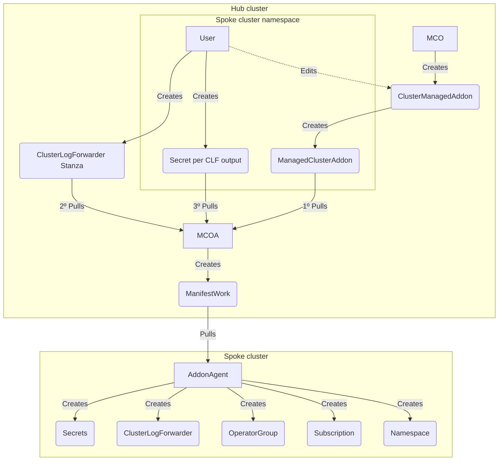
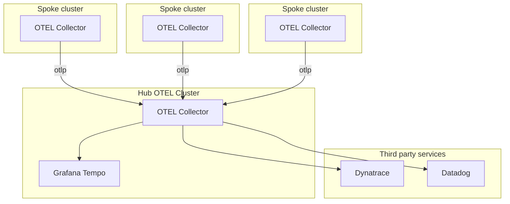

# Multi-Cluster Logs and Traces Forwarding

## Release Signoff Checklist

- [x] Enhancement is `implementable`
- [x] Design details are appropriately documented from clear requirements
- [ ] Test plan is defined
- [ ] Graduation criteria for dev preview, tech preview, GA
- [ ] User-facing documentation is created in [openshift-docs](https://github.com/openshift/openshift-docs/)

## Summary

Multi-Cluster Observability has been an integrated concept in Red Hat Advanced Cluster Management (RHACM) since its inception but only incorporates one of the core signals, namely metrics, to manage fleets of OpenShift Container Platform (OCP) based clusters (See [RHACM Multicluster-Observability-Operator (MCO)](rhacm-multi-cluster-observability)). The underlying architecture of RHACM observability consists of a set of observability components to collect a dedicated set of OCP metrics, visualizing them and alerting on fleet-relevant events.

This enhancement proposal seeks to bring a unified approach to collect and forward logs and traces from a fleet of OCP clusters based on the RHACM addon facility (See Open Cluster Management (OCM) [addon framework](ocm-addon-framework)) by enabling these signals to land on third-party managed storage solutions (e.g. AWS Cloudwatch, Google Cloud Logging, Splunk). The proposed addon is an optional RHACM component that is installed and configured by MCO. It provides a unified installation approach of required dependencies (e.g. operator subscriptions) and resources (custom resources, configuration, secrets) on the managed clusters to collect and forward logs and traces. The addon's name is MultiCluster-Observability-Addon (short MCOA).

## Motivation

The main goal here is to simplify and unify the installation of logs and traces collection and forwarding on a RHACM managed fleet of OCP clusters. The core function of the addon is to install required operators (i.e. [Red Hat OpenShift Logging](ocp-cluster-logging-operator) and [Red Hat Build of OpenTelemetry](opentelemetry-operator)), configure required custom
resources (i.e. `ClusterLogForwarder`, `OpenTelemetryCollector`) and reconcile per-cluster-related authentication resources (i.e. `Secrets`). This enables fleet-wide control of logs and traces collection and forwarding.

### User Stories

* As a fleet administrator, I want to install a homogeneous log collection and forwarding on any set of RHACM managed OCP clusters.
* As a fleet administrator, I want to install a homogeneous trace collection and forwarding on any set of RHACM managed OCP clusters.
* As a fleet administrator, I want to centrally control authentication credentials for the log stores.
* As a fleet administrator, I want to centrally control authentication credentials for the trace stores.

### Goals

* Provide an optional RHACM addon to control collection and forwarding of logs and traces on managed OCP clusters.
* Enable control of authentication and authorization of storage endpoints from the hub cluster.

### Non-Goals

* Provide end-to-end experience to collect, forward, store and visualize logs and traces on the same RHACM fleet.
* Share MCO's ingestion and querying capabilities for logs and traces collected by MCOA.

## Proposal

The following sections describe in detail the required resources as well as the workflow to enable collection and forwarding of logs and traces on an RHACM managed fleet of OCP clusters.

### Workflow Description

The workflow described in this proposal enables fleet-wide collection and forwarding of logs and traces as follows. Note that the steps described here are an example and do not cover all the different ways of configuring MCOA:

1. When the fleet administrator enables Logs and Traces collection in the `capabilities` section of the `MultiClusterObservability` resource, then MCO will create a `ClusterManagementAddon` and a `AddOnDeploymentConfig` resource that will be used by the MCOA deployment as configuration.
2. The fleet administrator creates a `ClusterLogForwarder` stanza in the `open-cluster-management-observability` namespace that describes the list of log forwarding outputs. This stanza will eventually be deployed on all the managed clusters.
3. The fleet administrator creates a `OpenTelemetryCollector` stanza in the `open-cluster-management-observability` namespace that describes the list of trace receivers, processors, connectors and exporters. This stanza will eventually be deployed on all the managed clusters.
4. For each managed cluster the **fleet administrator** or the **addon-manager** component provide on the managed cluster namespace additional configuration resources:
  1. The **fleet administrator** creates for each `Secret` referenced in the `ClusterLogForwarder` and/or `OpenTelemetryCollector` stanzas a `Secret` resource in each managed cluster namespace on the hub. (**Optional:** The **fleet administrator** can also create shared Secret's in `open-cluster-management-observability` namespace to be shared across all managed clusters).
  2. The **addon-manager** component will created based on the `ClusterManagementAddon` placements a `ManagedClusterAddon` resource. The `ManagedClusterAddon` specifies in turn the resources (CLF + OTELCol) that should be used by MCOA.
  3. For both CLF and OTELCol everytime a `Secret` is referenced, MCOA will look for a `Secret` with the refenced name in the namespace of the managed cluster. If no secret is found it will instead look for it in the namespace of the resource (CLF/OTELCol).
5. The MCOA will then render a `ManifestWorks` resource per cluster that consists of a rendered manifest list (i.e. `Subscription`, `ClusterLogForwarder`, `OpenTelemetryCollector`, `Secret`...).
6. The WorkAgentController on each managed cluster will apply each individual manifest from the `ManifestWorks` locally.

#### Variation and form factor considerations [optional]


The workflow above describes the default configuration for MCOA, however, it will also support deploying for both logs and traces multiple collectors. This is described in more detail in the [ACM-DDR-025: Multi-cluster Observability Addon](https://docs.google.com/document/d/1Yha0IvwmTOzc3HMqG0gj9edRjlPIzIAwvotIFqCBJ9E/edit#heading=h.pcdmckal8d53) document.

### API Extensions


With the introduction of MCOA we will extend the `MultiClusterObservability` resource with a new set of fields under an optional field called `capabilities`. The capabilities is the user's expression on which of the supported observability data collection and storage methods is desired to be used across the fleet. More detail in [ACM-DDR-025: Multi-cluster Observability Addon](https://docs.google.com/document/d/1Yha0IvwmTOzc3HMqG0gj9edRjlPIzIAwvotIFqCBJ9E/edit#heading=h.pcdmckal8d53) document.

### Implementation Details/Notes/Constraints [optional]

The MCOA implementation sources three different set of manifests accompanying the addon registration and deployment on a RHACM hub cluster:
1. General configuration should be done through the `MultiClusterObservability` CR which will result in updates to the `AddOnDeploymentConfig`;
2. Install strategy and references to the stanza resources (CLF/OTELCol) should be done through the `ClusterManagementAddon` resource;
3. Secrets should must always be provided either on the namespace of the managed cluster or in the namespace of the stanza resource

#### General configuration and fleet-wide stanzas

To support the above workflow MCOA requires along the addon registration and installation five key resources:
- The `MultiClusterObservability` CR where the user should enable the `capabilites` that he desires. 
- A `ClusterManagementAddOn` resource that describes not only which resources can be used to configure the addon but also the install strategy that the addon-manager should follow.
- An `AddonDeploymentConfig` resource that configures MCOA, this resource is not directly configured by users but is instead configured by MCO using the new `capabilities` field.
- A `ClusterLogForwarder` resource that describes the log outputs per log type to be used for log collection and forwarding on all managed clusters.
- An `OpenTelemetryCollector` resource that describes the trace exporters to be used for traces collection and forwarding on all managed clusters.

In detail, the resources look as follows:

```yaml
apiVersion: observability.open-cluster-management.io/v1beta2
kind: MultiClusterObservability
metadata:
  name: observability
spec:
  capabilities:
    platform:
      logs:
        collection:
          enabled: true
    userWorkloads:
      logs:
        collection:
          clusterlogforwarder: 
            enabled: true
      traces:
        collection:
          otelcol:
            enabled: true
```

The default `ClusterManagementAddOn`, user will then be able to change the `installStrategy` to configure custom placements:

```yaml
apiVersion: addon.open-cluster-management.io/v1alpha1
kind: ClusterManagementAddOn
metadata:
  name: multicluster-observability-addon
  annotations:
    addon.open-cluster-management.io/lifecycle: addon-manager
spec:
  addOnMeta:
    displayName: Multicluster Observability Addon
    description: "multicluster-observability-addon is the addon to configure spoke clusters to collect and forward logs/traces to a given set of outputs"
  supportedConfigs:
    # Describes the general addon configuration applicable for all managed clusters
    - group: addon.open-cluster-management.io
      resource: addondeploymentconfigs
      defaultConfig:
        name: multicluster-observability-addon
        namespace: open-cluster-management
    - group: logging.openshift.io
      resource: clusterlogforwarders
    - group: opentelemetry.io
      resource: opentelemetrycollectors
  installStrategy:
    type: Placements
    placements:
      - name: global
        namespace: open-cluster-management-global-set
        configs:
          # Describes the default ClusterLogForwarder applied to all managed clusters.
          - group: logging.openshift.io
            resource: clusterlogforwarders
            name: instance
            namespace: open-cluster-management
          # Describes the default OpenTelemetryCollector applied to all managed clusters.
          - group: opentelemetry.io
            resource: opentelemetrycollectors
            name: instance
            namespace: open-cluster-management

```

and MCO wil take the input from `MultiClusterObservability` and create the following `AddonDeploymentConfig` describing the addon configuration:

```yaml
apiVersion: addon.open-cluster-management.io/v1alpha1
kind: AddOnDeploymentConfig
metadata:
  name: multicluster-observability-addon
  namespace: open-cluster-management
spec:
  customizedVariables:
  # Operator Subscription Channels
  - name: openshiftLoggingChannel
    value: stable-5.9
  # Platform Observability
  - name: platformLogsCollection
    value: clusterlogforwarders.v1.logging.openshift.io
  # User Workloads Observability
  - name: userWorkloadLogsCollection
    value: clusterlogforwarders.v1.logging.openshift.io
  - name: userWorkloadTracesCollection
    value: opentelemetrycollectors.v1beta1.opentelemetry.io
```

#### Multi Cluster Log Collection and Forwarding

The following diagram tries to encapsulate the workflow for the multi cluster Log Collection and Forwarding case, note that dotted lines mean optional actions:



To better understand the diagram let's assume that we now want to forward application logs to a Grafana Loki instance and infrastructure/audit logs to AWS Cloudwatch. 

In this example the user will have to create the following resources:
- `ClusterLogForwarder` stanza that will contain the majority of the configuration;
- A `Secret` containing the AWS credentials that will be used for CloudWatch in the `cluster-logs` output;
- A `Secret` containing the mTLS credentials that will be used for Loki in the `application-logs` output;

In the end, MCOA will create a `ManifestWork` containing a list of the resources that will be created on the spoke cluster;

```yaml
apiVersion: logging.openshift.io/v1
kind: ClusterLogForwarder
metadata:
  name: instance
  namespace: open-cluster-management-observability
spec:
  outputs:
  - loki:
      labelKeys:
      - log_type
      - kubernetes.namespace_name
      - kubernetes.pod_name
      - openshift.cluster_id
    name: application-logs
    type: loki
    url: https://loki-foo.grafana.com
    secret: 
       name: application-logs-loki-mtls-credentials
  - cloudwatch:
      groupBy: logType
      region: eu-central-1
    name: cluster-logs
    type: cloudwatch
    secret: 
       name: cluster-logs-aws-cloudwatch-credentials
  pipelines:
  - inputRefs:
    - application
    name: application-logs
    outputRefs:
    - application-logs
  - inputRefs:
    - audit
    - infrastructure
    name: cluster-logs
    outputRefs:
    - cluster-logs
```

```yaml
apiVersion: v1
kind: Secret
metadata:
  name: cluster-logs-aws-cloudwatch-credentials
  namespace: spoke-cluster
data:
  access_key_id: "Base64 access key id"
  access_key_secret: "Base64 access key secret"
```

Notice that secrets referenced on CLF can either exist in the managed cluster namespace or on the CLF namespace (i.e. `open-cluster-management-observability`) as is the case for `application-logs` secret:

```yaml
apiVersion: v1
kind: Secret
metadata:
  name: application-logs-loki-mtls-credentials
  namespace: open-cluster-management-observability
stringData:
  'tls.crt': "TLS client certificate"
  'tls.key': "TLS key"
  'ca-bundle.crt': "Certificate Authority certificate"
```


In turn the addon will compile a `ManifestWork` for the managed cluster `spoke` as follows and pass it over it's WorkAgentController:

```yaml
kind: ManifestWork
metadata:
  name: addon-multicluster-observability-addon-deploy-0
  namespace: spoke
spec:
  workload:
    manifests:
    - apiVersion: operators.coreos.com/v1alpha1
      kind: Subscription
      metadata:
        name: cluster-logging
        namespace: openshift-logging
      spec:
        channel: stable-5.9 # Pulled from the AddOnDeploymentConfig
        installPlanApproval: Automatic
        name: cluster-logging
        source: redhat-operators
        sourceNamespace: openshift-marketplace
        startingCSV: cluster-logging.v5.9.0
    - apiVersion: v1
      kind: Secret
      metadata:
        name: cluster-logs-aws-cloudwatch-credentials
        namespace: openshift-logging
      data:
        access_key_id: "Base64 access key id"
        access_key_secret: "Base64 access key secret"
    - apiVersion: v1
      kind: Secret
      metadata:
        name: application-logs-loki-mtls-credentials
        namespace: openshift-logging
      data:
        'tls.crt': "Base64 encoded TLS client certificate"
        'tls.key': "Base64 endoded TLS key"
        'ca-bundle.crt': "Base64 encoded Certificate Authority certificate"
    - apiVersion: logging.openshift.io/v1
      kind: ClusterLogForwarder
      metadata:
        name: instance
        namespace: openshift-logging
      spec:
        outputs:
        - loki:
            labelKeys:
            - log_type
            - kubernetes.namespace_name
            - kubernetes.pod_name
            - openshift.cluster_id
          name: application-logs
          type: loki
          url: "https://loki-foo.grafana.com"
          secret:
            name: application-logs-loki-mtls-credentials
        - name: cluster-logs
          type: cloudwatch
          cloudwatch:
            groupBy: logType
            region: eu-central-1
          secret:
            name: cluster-logs-aws-cloudwatch-credentials
        pipelines:
        - inputRefs:
          - application
          name: application-logs
          outputRefs:
          - application-logs
        - inputRefs:
          - audit
          - infrastructure
          name: cluster-logs
          outputRefs:
          - cluster-logs
```

#### Multi Cluster OTLP Collection and Forwarding

For all managed clusters the fleet administrator is required to provide, at least, a single `OpenTelemetryCollector` resource stanza that describes the OpenTelemetry forwarding configuration for the entire fleet in the default namespace `open-cluster-management-observability`.

The following example resource describes a configuration where a `OpenTelemetryCollector` instance is deployed per spoke cluster and it sends data to a Hub OTEL Cluster (note that this cluster can be different from the RHACM Hub cluster). The Hub OTEL Cluster then exports the received telemetry to a third-party storage solution.




The following example resource describes a configuration for forwarding application otlp data from one OpenTelemetry Collector (deployed in the spoke cluster) to the OpenTelemetry Hub instance:

```yaml
apiVersion: opentelemetry.io/v1alpha1
kind: OpenTelemetryCollector
metadata:
  name: spoke-otelcol
  namespace: open-cluster-management-observability
spec:
  config: |
    receivers:
      jaeger:
        protocols:
          grpc:
      otlp:
        protocols:
          grpc:
          http:
    processors:
    exporters:
      debug:
      otlp:
        tls:
          insecure: true
    service:
      pipelines:
        traces:
          receivers: [jaeger,otlp]
          processors: []
          exporters: [otlp, debug]
```

For the `otlp` exporter MCOA will provide a Secret `tracing-otlp-auth` with all required authentication information, e.g. TLS client Certificate:

```yaml
apiVersion: v1
kind: Secret
metadata:
  name: tracing-otlp-auth
  namespace: spoke
stringData:
  'tls.crt': "TLS client certificate"
  'tls.key': "TLS key"
  'ca-bundle.crt': "Certificate Authority certificate" # Pull from the referenced Secret otel-gateway
```

In turn the addon will compile a `ManifestWork` for the managed cluster `spoke` as follows and pass it over it's WorkAgentController:

```yaml
kind: ManifestWork
metadata:
  name: addon-multicluster-observability-addon-deploy-0
  namespace: spoke
spec:
  workload:
    manifests:
    - apiVersion: v1
      kind: Namespace
      metadata:
        name: openshift-opentelemetry-operator
    - apiVersion: v1
      kind: Namespace
      metadata:
        name: mcoa-opentelemetry
    - apiVersion: operators.coreos.com/v1
      kind: OperatorGroup
      metadata:
        name: openshift-opentelemetry-operator-ghl6v
        namespace: openshift-opentelemetry-operator
      spec:
        upgradeStrategy: Default
    - apiVersion: operators.coreos.com/v1alpha1
      kind: Subscription
      metadata:
        name: opentelemetry-product
        namespace: openshift-opentelemetry-operator
      spec:
        channel: stable
        installPlanApproval: Automatic
        name: opentelemetry-product
        source: redhat-operators
        sourceNamespace: openshift-marketplace
        startingCSV: opentelemetry-operator.v0.81.1-5
    - apiVersion: v1
      kind: Secret
      metadata:
        name: tracing-otlp-auth
        namespace: spoke
      stringData:
        'tls.crt': "TLS client certificate"
        'tls.key': "TLS key"
        'ca-bundle.crt': "Certificate Authority certificate"
    - apiVersion: opentelemetry.io/v1alpha1
      kind: OpenTelemetryCollector
      metadata:
        name: spoke-otelcol
        namespace: open-cluster-management
      spec:
        config: |
          receivers:
            jaeger:
              protocols:
                grpc:
            otlp:
              protocols:
                grpc:
                http:
          processors:
          exporters:
            debug:
            otlp:
              tls:
                insecure: true
          service:
            pipelines:
              traces:
                receivers: [jaeger,otlp]
                processors: []
                exporters: [otlp, debug]
```


#### Hypershift [optional]

N/A

### Drawbacks

- MCOA configuration through the `MultiClusterObservability`: the MCO CR nowadays has an already extensive set of configuration fields, when designing the MCOA configuration, we will need to take extra caution as to not make this CR more complex and hard to navigate;
- MCOA manifest sync: with MCOA being deployed by MCO we will need to set up a procedure to maintain the MCOA manifests that live in the MCO repo up to date.
- CRD conflicts: MCOA will leverage the CRDs from other operators we will have to ensure that we will not be running into situations where two operators are managing the same CRD

## Design Details

### Open Questions [optional]

The [addon-framework](ocm-addon-framework) is still lacking some features that will fully enable the behaviours described in this proposal namelly: 
- [x] Support for reconcile on changes to resources not directly referenced in the `ManagedClusterAddon`. Currently we have a workaround with a side controller that watches for these resources.
- [ ] Support for multiple resources of the same kind in the `ManagedClusterAddOn` resource (Jira issues [ACM-11509](https://issues.redhat.com/browse/ACM-11509)). MCOA needs this otherwise we will not be able to support deploying multiple instances for the same resource.

### Test Plan

TBD

### Graduation Criteria

TBD

#### Dev Preview

- [ ] Installation of the ClusterLogForwarder and OpenTelemetryCollector CRs.
- [ ] Status reporting
- [ ] Add upstream support for addon-framework to handle multiple same-GVK config resources
- [x] [Add support for configuration through capabilities](https://github.com/rhobs/multicluster-observability-addon/pull/42)
- [x] [Support for all the authentication methods supported](https://github.com/rhobs/multicluster-observability-addon/pull/42) by ClusterLogForwarder and Red Hat Build of OpenTelemetry (i.e. static auth, mTLS auth, etc).
- [x] [Support for Per-ClusterSet ClusterLogForwarder and OpenTelemetryCollector.](https://github.com/rhobs/multicluster-observability-addon/pull/48) 
- [x] [Health probing per Signal](https://github.com/rhobs/multicluster-observability-addon/pull/42)

#### Dev Preview -> Tech Preview

- Refined CLF/OTelCollector CRs usage

#### Tech Preview -> GA

TBD

#### Removing a deprecated feature

None

### Upgrade / Downgrade Strategy

None

### Version Skew Strategy

None

### Operational Aspects of API Extensions

TBD

#### Failure Modes

- Missing Stanza: if a ManagedClusterAddon references a stanza that doesn't exist this will block the reconciliation loop as the addon will not be able to generate a `ManifestWorks` 
- Missing Secrets: if an output uses a secret provided by the user if that secret is missing then this will block the reconciliation loop;
- Missing Placement: if a placement is specifed in the `ClusterManagementAddon` but doesn't exist this will block the installation of the addon on the fleet;

#### Support Procedures

TBD

## Implementation History

|      | PoC | Demo | DevPreview | TechPreview | General Availability |
|------|-----|------|------------|-------------|----------------------|
| MCOA |  ✅  |   ✅  |      🚧     |             |                      |

POC - https://github.com/ViaQ/logging-ocm-addon
Demo - https://github.com/rhobs/multicluster-observability-addon/tree/main/demo
DevPreview - https://github.com/rhobs/multicluster-observability-addon

## Alternatives

### Policy-Engine based workflow

The RHACM policy engine is part of the RHACM governance tools to apply certain policies on workloads and infrastructure on the entire fleet. It serves well to a degree however for the MCOA use-case it falls short since MCOA will need to:
- manage complext dependencies between multiple components, OpenShift Logging Operator installation (i.e Cluster-Logging-Operator) and the custom resources (i.e. ClusterLogForwarder) as well as authentication related artifacts (i.e. generating TLS certificates, Cloud Provider Managed Identities / ServiceAccounts, etc.).
- build dynamic error reporting (e.g. operator installation/upgrade failures, CRD handling) and health reporting (e.g. running/ready progress of operators and operands).

The spike for this alternative can be found here: https://gitlab.cee.redhat.com/openshift-logging/log-storage-toolbox/-/merge_requests/14

### Integrate directly into present Multi-Cluster-Observability-Operator

For the untrained eye the RHACM MCO operator looks like the natural place to add multi-cluster logging capabilities. It has a hybrid architecture being a Kubernetes operator (i.e managing the MultiClusterObservability CRD) and an addon (i.e. provisions observability agents/policies to clustersets). However, MCO nowadays has to many responsabilities which not only makes it hard to maintain but also hard to extend to further signals without a tremendous engineering effort.


## Infrastructure Needed [optional]

None

[ocm-addon-framework]:https://github.com/open-cluster-management-io/addon-framework
[ocp-cluster-logging-operator]:https://github.com/openshift/cluster-logging-operator
[ocp-clusterlogforwarder-outputsecretspec]:https://github.com/openshift/cluster-logging-operator/blob/627b0c7f8c993f89250756d9601d1a632b024c94/apis/logging/v1/cluster_log_forwarder_types.go#L226-L265
[ocp-clusterlogforward-outputtypespec]:https://github.com/openshift/cluster-logging-operator/blob/627b0c7f8c993f89250756d9601d1a632b024c94/apis/logging/v1/output_types.go#L21-L40
[opentelemetry-collector-auth]:https://opentelemetry.io/docs/collector/configuration/#authentication
[opentelemetry-operator]:https://github.com/open-telemetry/opentelemetry-operator
[rhacm-multi-cluster-observability]:https://github.com/stolostron/multicluster-observability-operator
