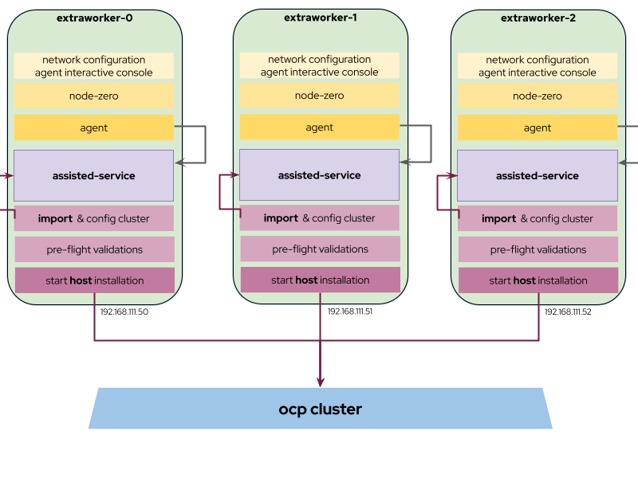

# Simplify and unify adding nodes to clusters on day 2 using agent-based installer approach

## Summary
This enhancement proposal describes how to easily add nodes to any existing non-IPI cluster using lessons and technology from the agent-based 
installer. The user generates an ISO image via an `oc adm` command with an optional configuration file to describe the new nodes. The image 
is used to boot the hosts so that they will be added to the cluster without any further action, except for the final approval that remains a 
manual operation up to the user. An additional `oc adm` command will allow the user to monitor the progress of the task.

## Motivation
The task of adding a node to an already existing non-IPI cluster (regardless of the installation approach adopted) still remains a complex 
task for the end user, with many different methods available that in some cases may lead to custom automations difficult to maintain. In 
general, scaling up an on-premises cluster should be a simple operation, mostly automated, for the convenience of the end user.

Currently the agent-based installer method significantly improved the user experience for deploying a cluster - especially in disconnected 
scenarios - by focusing on full automation of the OpenShift-specific parts of the process, and leaving to the user the decision to automate 
or not the required cluster infrastructure. The approach addressed several pain points, in particular by not requiring any additional provisioning 
hardware, and by applying a number of live pre-flight validations in the target environment to spot in advance those issues that could hamper 
the setup. Also, capturing all the necessary elements for the installation in a single ISO image simplified the application and distribution 
into different environments. 

So the current enhancement proposes a standard and unified way for adding nodes to an on-premises cluster, by replicating the same approach 
successfully adopted for the installation process, so that the end user could benefit from a more consistent and simple workflow. In addition, 
the standardization will make obsolete the hand-rolled UPI method, the need to use MCE to manage local clusters, and (unsupported) field-developed 
automations that are expensive to maintain.

### User Stories
- As a cluster administrator, I want to add (or replace) one or more nodes to an existing cluster (potentially deployed in a disconnected environment) 
  using the same simplified agent-based workflow already adopted for the installation
- As a cluster administrator, I want to provide the initial static network configuration required for each different host that will be added to the cluster
- As a cluster administrator, I want to validate the nodes to be added before initiating the procedure and be informed of any validation failures
- As a cluster administrator, I want to be able to monitor the process of adding new nodes

### Goals
- Allow the user to easily add one or more worker nodes to an existing (disconnected) non-IPI cluster, with the minimum amount of configuration requested
- Provide a simpler interface by reusing existing command line tools for cluster administration
- When adding multiple nodes, a failure in adding a node should not impact the other nodes currently involved in the process
- Cover at least Baremetal, vSphere, Nutanix and None platform (regardless of the installation method used)
- For IPI clusters, provide support for the scenario where the user can’t use the hosts BMCs

### Non-Goals
- Replace MachineSet-based management of hosts for IPI clusters
- Offer more or finer-grained configuration options for new nodes than those supported by the agent-based installer
- To allow the creation of the ISO image for adding the nodes into an environment not directly connected to the target cluster
- Provide an automation for final nodes approval

## Proposal
A key factor for simplifying the user experience consists in offering a simple enough - but sufficiently flexible -  user interface 
to accomplish the task of adding the required nodes to a cluster, and to monitor the progress of such activity. For this reason, 
the proposal consists into enhancing the `oc` cli with two new commands:

- `oc adm add-nodes-image` to generate the ISO for adding the nodes to the cluster
- `oc adm monitor-add-nodes` to monitor the nodes currently being added to the cluster

There are several reasons for choosing `oc` as a primary user interfaces for these tasks:
- It’s the official cluster administration tool, so it is expected to be already available in the target cluster environment
- It already supports the kubeconfig file for interacting with the target cluster (it’s relevant since it contains several pieces of 
  information required for adding the nodes, as explained in the design section)
- It already offers a couple of commands to manually approve/deny certificate signing requests (CRSs) when adding new nodes

The usage of `oc` will also help in reducing the amount of information that the user will need to provide, resulting thus in a simplified
input configuration file.

### add-nodes-image command
The format of the command will be the following:

```
oc -–kubeconfig=’’ adm add-nodes-image [-o=’agent-nodes.iso’] <nodes-config.yaml> 
```

Where:
-`-o=’agent-nodes.iso`. The name of the ISO image to be generated.
-`–kubeconfig=’’`. Path to the kubeconfig file (or `KUBECONFIG` if available)

`nodes-config.yaml` is a configuration file, similar to `agent-config.yaml`, used to specify the list of the hosts to be added as worker 
nodes. For each host, it will be possible to specify a number of attributes, including a piece of nmstate configuration for the initial 
static network configuration. If not specified, the tool will look for a `nodes-config.yaml` file in the current directory.

The command will use the configured kubeconfig file, and the connection to the target cluster, to retrieve all the additional information 
required to validate and generate the ISO image that will be used for adding the configured nodes. 

#### nodes-config.yaml sample file
Following an example of `nodes-config.yaml` file, where a couple of workers are described with an initial static network configuration:

```
hosts:
- hostname: extra-worker-1
  rootDeviceHints:
   deviceName: /dev/sda
  interfaces:
   - macAddress: 00:00:00:00:00:00
     name: eth0
   - macAddress: 00:00:00:00:00:01
     name: eth0
  networkConfig:
   interfaces:
     - name: eth0
       type: ethernet
       state: up
       mac-address: 00:00:00:00:00:00
       ipv4:
         enabled: true
         address:
           - ip: 192.168.122.2
             prefix-length: 23
         dhcp: false
- hostname: extra-worker-2
  rootDeviceHints:
   deviceName: /dev/sda
  interfaces:
   - macAddress: 00:00:00:00:00:01
     name: eth0
  networkConfig:
   interfaces:
     - name: eth0
       type: ethernet
       state: up
       mac-address: 00:00:00:00:00:02
       ipv4:
         enabled: true
         address:
           - ip: 192.168.122.3
             prefix-length: 23
         dhcp: false
```

### monitor-add-nodes command

The format of the command will be the following:

`oc -–kubeconfig=’’ adm monitor-add-nodes <IPs list>`

Where:
- `–kubeconfig=’’``. Path to the kubeconfig file (or KUBECONFIG if available)
- `IPs list`` is a list of the nodes IP to be monitored

The command will try to connect to each specified node to retrieve initially the results of the pre-flight validations, and then 
the progress of the activity. In case of validation failures, the command will report them to the console to allow the user to 
take the requested actions and troubleshoot the issues. In the future this command could be enhanced to automatically approve the node CSRs
(iudentifying the correct CSR requires the Node IP address, which this command already has as an input).

### Workflow Description
The working environment must satisfy the initial following conditions:
- `oc` tool is available
- A direct connection to the target cluster is available
- kubeconfig file is available

The following steps illustrates the expected workflow:
1. The cluster administrator prepares the `nodes-config.yaml` file listing all the nodes to be added, optionally with their initial network configuration
2. The cluster administrator runs the `oc adm add-nodes-image` command to generate the ISO
3. The cluster administrator boots every node previously listed using the freshly generated ISO
4. The cluster administrator runs the `oc adm monitor-add-nodes` command to monitor the activity progress
5. Once a node csr is pending, the cluster administrator runs the `oc adm certificate approve <csr-id>` to complete the process for the specified node

### API Extensions
N/A

### Implementation Details/Notes/Constraints
The implementation will largely reuse the same approach / code present in the openshift/installer repo for creating an ISO image 
for the installation, with a number of exceptions that will be detailed in the subsequent paragraphs.

#### Proposed architecture
Every node booted with the generated ISO will will be independent for adding itself to the cluster - without any need to specify a single rendezvous IP, 
as it happens for the installation scenario. In this way if a node is failing for some reason (for example, the pre-flight validations block the process), 
the other nodes may continue the joining process undisturbed.
The following hilights better the proposed architecture:



#### Assisted-service interaction
The following API calls will be used to add a single node to the target cluster:
- `/api/assisted-install/v2/clusters/import` to import an existing cluster
- `/api/assisted-install/infra-envs/${INFRA_ENV_ID}/hosts/${HOST_ID}` to add the specified host to the cluster

#### oc integration notes
Since most of the existing code for agent-based installer approach is currently stored into the openshift/installer repo, the proposal is to implement the 
commands in a way similar to the already existing `oc adm must-gather` command, where essentially a pod is run within the target cluster to execute specific 
code build from the installer and shipped into a release image. Such approach will offer the following benefits:

- No code duplication/pollution. The required code for the additional commands will exist only in the openshift/installer repo (it will not be vendored into 
  the openshift/oc repo)
- Simplified integration. `oc` will take care only of marshaling the inputs/outputs of the command

To achieve this kind of loosely coupled level of integration with `oc`, a specific binary with the described commands will be built from the openshift/installer 
repo code and distributed into an image of the release payload as an additional artifact.

### Risks and Mitigations
Most of the existing code for agent-based installer approach is currently stored into the openshift/installer repo (with additional vendoring of the api/client 
parts of openshift/assisted-service), and it wasn’t explicitly designed for being re-vendored. Vendoring the required parts in the openshift/oc repo will require
a significant amount of refactoring in the openshift/install repo. Also, `oc` is not tied to a particular version, while the agent-based installer code is. 

### Drawbacks
-
## Design Details

### Test Plan
- The agent-based installer already defined three different CI workflow (https://github.com/openshift/release/tree/master/ci-operator/step-registry/agent/e2e) for
  testing SNO/compact/HA topologies. These workflows are currently used by many different openshift/release repos and by release controller agent informing jobs.
  The workflows will be extended with a config var to allow exercising the task of adding a new node, using the method described.

### Graduation Criteria

#### Dev Preview -> Tech Preview
N/A

#### Tech Preview -> GA
N/A

#### Removing a deprecated feature
N/A

### Upgrade / Downgrade Strategy
N/A

### Version Skew Strategy
N/A

### Operational Aspects of API Extensions
N/A

#### Failure Modes
N/A

#### Support Procedures
N/A

## Implementation History
- N/A

## Alternatives
- It would be possible to create an automated UPI image that automatically starts the installation via chaining the Ignition generated by MCO in the cluster, 
  without using at all assisted-service. This would mean not offering to the end user the pre-flight validations, which are a key element for helping the user in 
  real case environments where not all the elements could be known upfront
- Using `oc` plugin mechanism to implement the required commands, instead of adding code directly into the openshift/oc repo. Note: with such approach it is not
  possible to add on to existing sub-commands (ie, to `oc adm`)
- Implement a cluster specific controller to generate the image. This approach seems anyhow to have several drawbacks: the controller would be always active, and 
  that is not ideal for a one-shot operation seldomly applied. In particular for SNO, it would consume additional resources unnecessarily.


