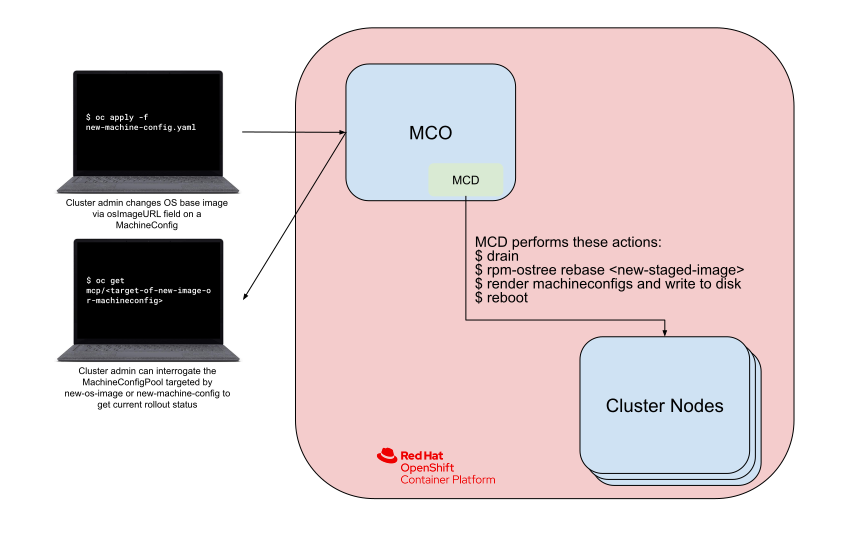
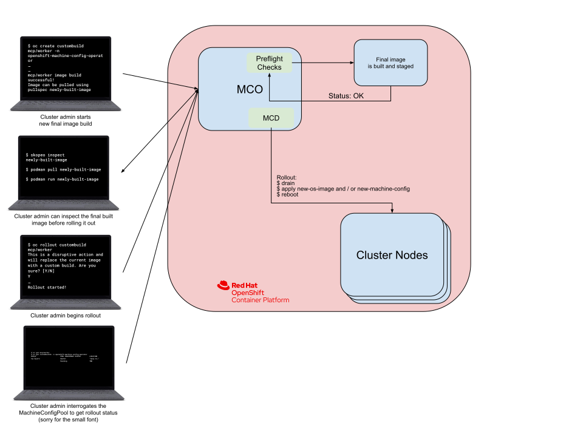

# OpenShift Layered CoreOS

## Release Signoff Checklist

- [ ] Enhancement is `implementable`
- [ ] Design details are appropriately documented from clear requirements
- [ ] Test plan is defined
- [ ] Operational readiness criteria is defined
- [ ] Graduation criteria for dev preview, tech preview, GA
- [ ] User-facing documentation is created in [openshift-docs](https://github.com/openshift/openshift-docs/)

## Summary

Change RHEL CoreOS as shipped in OpenShift to be a "base image" that can be used in layered container builds and then booted.  This will allow custom 3rd party agents delivered via RPMs installed in a container build. The MCO will roll out and monitor these custom containers the same way it does for the "pristine" CoreOS image today.

This is the OpenShift integration of [ostree native containers](https://fedoraproject.org/wiki/Changes/OstreeNativeContainer) or [CoreOS layering](https://github.com/coreos/enhancements/blob/main/os/coreos-layering.md) via the MCO.

## Motivation

1. We want to support more customization, such as 3rd party security agents (often in RPM format).
1. It is very difficult today to roll out a hotfix (kernel or userspace).
1. It should be possible to ship configuration with the same mechanism as adding content.
1. There are upgrade problems today caused by configuration updates of the MCO applied separately from OS changes.
1. It is difficult to inspect and test in advance what configuration will be created by the MCO without having it render the config and upgrade a node.

### Goals

- [ ] Administrators can add custom code alongside configuration via an opinionated, tested declarative build system and via e.g. `Dockerfile` as an unvalidated generic mechanism.
- [ ] The output is a container that can be pushed to a registry, inspected, and processed via security scanners. 
- [ ] Further, it can be executed as a regular container (via podman or as a pod) *and* booted inside or outside of a cluster.
- [ ] Gain [transactional configuration+code changes](https://github.com/openshift/machine-config-operator/issues/1190) by having configuration+encode captured atomically in a container.
- [ ] Avoid breaking existing workflow via MachineConfig (including extensions).
- [ ] Avoid overwriting existing custom modifications (such as files managed by other operators) during upgrades.

### Non-Goals

- While the base CoreOS layer/ostree-container tools will be usable outside of OpenShift, this enhancement does not cover or propose any in-cluster functionality for exporting the forward-generated image outside of an OpenShift cluster. In other words, it is not intended to be booted (`$ rpm-ostree rebase <image>`) from outside of a cluster.
- This proposal does not cover generating updated "bootimages"; see https://github.com/openshift/enhancements/pull/201 and https://github.com/coreos/fedora-coreos-tracker/issues/1151.
- Changing the existing workflow for RHEL worker nodes.

### User Stories

#### What works now continues to work

An OpenShift administrator at example.corp is happily using OpenShift 4 (with RHEL CoreOS) in several AWS clusters today, and has only a small custom MachineConfig object to tweak host level auditing.  They do not plan to use any complex derived builds, and expect that upgrading their existing cluster continues to work and respect their small audit configuration change with no workflow changes.

#### Adding a 3rd party security scanner/IDS

example.bank's security team requires a 3rd party security agent to be installed on bare metal machines in their datacenter.  The 3rd party agent comes as an RPM today, and requires its own custom configuration. While the 3rd party vendor has support for execution as a privileged daemonset on their roadmap, it is not going to appear soon.

The team uses the OCP docs and looks at examples such as https://github.com/coreos/coreos-layering-examples/ and writes a Dockerfile that looks similar to the Tailscale example that adds a 3rd party yum repository, and installs the 3rd party-security-agent.rpm. Note that the base image here would be published and consumable outside of the release image (as well as part of it).

They build this image in one of their “central” clusters and publish it into their air-gapped internal registry (registry.internal.example.bank) as `registry.internal.example.bank/examplecorp/rhel-coreos-base:4.12`.  (Note: The image could be built outside of a cluster too using any container build tools).

Next, they find the digested pull specification for this image (e.g. `registry.internal.example.bank/examplecorp/rhel-coreos-base@sha256:0ab2...`).

They create a `MachineConfig` object which specifies this pull spec as `osImageURL`.  This updated image is then rolled out across the targeted worker pool by MCO, including draining nodes in the same way it handles MachineConfig and OS updates today.

When the rollout is successful to worker nodes on staging, they also roll it out to the control plane nodes.

They deploy the change across the rest of their (e.g. 5) production clusters.

A few weeks later, Red Hat releases a kernel security update as part of a cluster image, which appears as a new image at registry.redhat.io/rhel-coreos-8.6:4.12. This triggers a rebuild on their central cluster, which is successful and pushed to the mirror registry.

As before, the administrator finds the new digested pull spec, and updates the `MachineConfig` object.  As before, this change is rolled out to the nodes.

Note that future `oc adm upgrade` will *not* override this image - the node OS version is now decoupled from the cluster/release image default.

#### Kernel hotfix in cluster

example.corp runs OCP 4.12 on aarch64 on bare metal.  An important regression is found that only affects the aarch64 architecture on some bare metal platforms.  While a fix is queued for a RHEL 8.x z-stream, there is also risk in fast tracking the fix to *all* OCP platforms.  Because this fix is important to example.corp, a hotfix is provided via a pre-release `kernel.rpm`.

The OCP admins at example.corp get a copy of this hotfix RPM into their internal data store, and use the latest tagged z-stream RHEL CoreOS image for 4.12 (e.g. `registry.redhat.io/rhel-coreos-8:4.12.7`)

They use this as part of a `Dockerfile` build that overrides the kernel, and just as above in the 3rd party scanner case, they find the digested pull spec and override via a `MachineConfig` with custom `osImageURL`.

Later, a fixed kernel is released in the official `registry.redhat.io/rhel-coreos-8:4.12.8` image. The customer (and support) can easily see the kernel version in that image, and know with confidence that they can upgrade to a default cluster level of `4.12.8`.
Specifically, the customer uses `oc adm upgrade` (or the GUI), and after that is complete they remove the `MachineConfig` object, which removes all the OS level overrides.

#### Externally built image

As we move towards having users manage many clusters (10, 100 or more), it will make sense to support building a node image centrally. This will allow submitting the image to a security scanner or review by a security team before deploying to clusters.

Acme Corp has 300 clusters distributed across their manufacturing centers. They want to centralize their build system in their main data center, and just distribute those images to single node edge machines. They provide a `custom-coreos-imagestream` object at installation time, and their node CoreOS image is deployed during the installation of each cluster without a build operation.

In the future, we may additionally support a signature mechanism (IMA/fs-verity) that allows these images to be signed centrally.  Each node verifies this image rather than generating a custom state.

## Proposal

Moving to layering model requires some architectural changes in the MCO. Changes are also required in RHEL CoreOS base image format being shipped and the tooling around it. To rollout changes safely and minimize risk, we will take incremental development approach. Incremental development will also help us to get early feedback and iterate over overall design.

### Development Phases

#### Phase 0
- The `machine-os-content` shipped as part of the release payload will change format to the new "native ostree-container" format, in which the OS content appears as any other OCI/Docker container. Epic: [MCO-293](https://issues.redhat.com/browse/MCO-293).
  (In contrast today, the existing `machine-os-content` has an ostree repository inside a UBI image, which is hard to inspect and cannot be used for derived builds).  For more information, see [ostree-rs-ext](https://github.com/ostreedev/ostree-rs-ext/) and [CoreOS layering](https://github.com/coreos/enhancements/pull/7).
- This new format container will *also* be shipped alongside the toplevel release image with a matching version scheme. For example, there will now be e.g `quay.io/openshift-release-dev/rhel-coreos-8:4.12.0-rc.5-x86_64`.
- The MCO will be modified to allow a cluster admin to override the `osImageURL` field on MachineConfigs to supply a new base image that overrides the default (RHEL) CoreOS image. The administrator can use the above image tags in a `Dockerfile` or other container build system.
- Everything else largely stays the same; the MCD continues to perform config changes per node. (See: [Buildless layering support](#buildless-layering-support)).

#### Phase 1
- Initial [preflight checks](#preflight-checks) are implemented. However, they will only be a warning and will not block image rollout since we will not (yet) have a way to bypass them.
- Iterate on the mechanism established in Phase 0 by enabling rendered MachineConfigs to be layered into a final OS image before they are applied to a nodes’ disk by using the BuildController. (see [Create Final Pool Images](#create-final-pool-images)).
- The BuildController will be reliant upon the OpenShift Image Builder. Alternatively, we could create our own custom solution (see: [How The Final Image Will Be Built](#how-the-final-image-will-be-built) for caveats).)

#### Phase 2
- CRD implementation is finalized. This enables the following:
  - A cluster admin can build and stage a final image prior to rolling it out.
  - Preflight checks can block an image rollout (assuming the documented overrides are not used).
  - Allows us to remove our dependency on the in-cluster registry and/or ImageStreams since it gives the cluster admin a place to configure where the final image is pushed. This allows them to optionally use an in-cluster registry or ImageStream assuming they’ve enabled those features on their cluster.
- Modify the BuildController to use customized build pods instead of OpenShift Image Builder to create the finalized OS image (assuming we did the initial implementation with OpenShift Image Builder).
- Add support for heterogeneous clusters using BuildController.

#### Phase 3
- oc command is augmented with sub-commands to provide syntactic sugar and a more polished synchronous user experience for cluster admins around staging a new OS image, watching preflight checks pass, and rolling it out. The web UI gains an equivalent UX flow.


**Note:** Rest of the enhancement proposal will focus on phase 0. For other phases, details can be found in [Future Phases](#future-phases) section.

With phase 0 implementation, it would be technically possible to perform all these user stories by building a custom image(derived from base RHEL CoreOS) and overriding `osImageURL`. But that won't be the ideal way we would expect users to use it and that's where remaining phases will help us with. See [Graduation Criteria](#graduation-criteria) for more.

### Workflow Description
By default, cluster admin shouldn't see any change in the behavior unless they want to override default osImageURL.

In phase 0, In order to apply a custom OS image, cluster admin would run following steps:
1. Creates a custom OS image derived from default RHEL CoreOS container image
1. Pushes this image to a container registry that is reachable to the cluster
1. Creates a MachineConfig overriding osImageURL for targeted pool
1. MCO will update OS with content provided via MachineConfig like it does today for any other MachineConfig being applied.
1. In case of an error, error message will be made visible for further debugging

### API Extensions
For phase 0, MCO will allow `osImageURL` field to be overridden via the MachineConfig. No API addition or deletion will be done.

### Implementation details

#### Phase 0 implementation

##### Buildless layering support

<!--Diagram Source: https://docs.google.com/drawings/d/1sM5QLxmAfx4GKZEM5Y5zNT-pT7t6shTkwdaM283-R3A/edit-->


In this phase, no final image build is required in MCO.
Flow would remain same:
1. Renders a new MachineConfig for desired pools.
1. Performs cordon and drain operation on node.
1. Writes rest of the MachineConfigs on the node
1. Applies the new native container format RHEL CoreOS image to the node.
1. Reboots the node

##### Upgrade flow

See [OSUpgrades](https://github.com/openshift/machine-config-operator/blob/master/docs/OSUpgrades.md) for the existing upgrade behavior.

- **With default osImageURL:**
When cluster is not using any custom osImageURL, MCO will perform OS update as usual with what is supplied in the upcoming release image.
- **With custom osImageURL:** With custom osImageURL provided, cluster admin grabs the steering wheel so they decide how and when to update the OS.
  - MCO will respect the overridden osImageURL provided by cluster admin and will stay on the older image after upgrade.
  - When cluster admin is ready to upgrade OS, they build new image derived from latest default RHEL CoreOS image supplied in release image and provides it via MachineConfig.
  - At any point, the cluster can be switched back to default OS Image by deleting the custom osImageURL supplied via MachineConfig.

##### Handling booting old nodes

We can't switch the format of the oscontainer easily because older clusters may have older bootimages with older `rpm-ostree` that won't understand the new container format. Hence firstboot upgrades would just fail.

Options:

- Double reboot; but we'd still need to ship the old image format in addition to new and really the only sane way to ship both is to generate the old from the new; we could do that in-cluster or per node or pre-generated as part of the payload
- Try to run rpm-ostree itself as a container
- Force bootimage updates (can't be a 100% solution due to UPI)

Related spike - https://issues.redhat.com/browse/MCO-312

##### Preserving old MCD behavior for RHEL nodes

The RHEL 8 worker nodes in-cluster will require us to continue support existing file/unit write as well as provision (`once-from`) workflows.  See also [openshift-ansible and MCO](https://github.com/openshift/machine-config-operator/issues/1592).

##### Handling extensions

We need to preserve support for [extensions](https://github.com/openshift/enhancements/blob/master/enhancements/rhcos/extensions.md). For example, `kernel-rt` support is key to many OpenShift use cases.

Extensions move to a `rhel-coreos-extensions` container that has RPMs and will be built part of release payload.

To apply an extension, MCO will pull in RPMs from `rhel-coreos-extensions` container image from the release payload and apply the required extensions to the targeted nodes like we do currently.

Cluster admin shouldn't see any change in the behavior. Interface for applying `kernelType` and supported `extensions` will remain same, the way it is done today via MachineConfig. See https://github.com/openshift/machine-config-operator/blob/master/docs/MachineConfiguration.md#rhcos-extensions .

##### Kernel Arguments

For now, updating kernel arguments will continue to happen via the MCD on each node via executing `rpm-ostree kargs` as it does today. See also https://github.com/ostreedev/ostree/issues/479

##### Drain and reboot

No changes in drain and reboot behavior, MCO will continue to perform drain and reboots like it does for existing releases.

##### Telemetry

We will be collecting telemetry data on how many clusters are using custom `osImageURL`. This data will help us understand how frequently layering feature is getting used as well as help us improve our future layering work.

### Risks and Mitigations

We're introducing a new format of shipping RHEL CoreOS image and allowing users to create their own custom image to override the default os on nodes.

This brings in certain risk but hopefully with good documentation, cluster admins would know what they are doing and tests it before applying custom Image to cluster.

### Drawbacks

If it turns out that e.g. upgrading existing RHCOS systems in place is difficult, that will be a problem.

## Design Details

### Test Plan

The FCOS / RHCOS base OCI containers will be published automatically by their respective CI pipelines. These pipelines already have a release promotion mechanism built into them. This means that early development versions of these containers are available (e.g. `:testing-devel` tags), hence other dependent systems, such as the MCO, can use them.

For example, the MCO’s tests can use those containers to get a signal on potentially breaking changes to rpm-ostree as well as the base container images.

MCO-specific tests will be run during each PR as part of the MCOs presubmits. Also, make sure that we're doing node scaling post-upgrade in some e2e tests.

### Graduation Criteria

 The goal for 4.12 is to have a supported path for users to apply hotfix (GA) into base RHEL CoreOS and ability to try out 3rd party software (Tech Preview).

#### Dev Preview -> Tech Preview

- Using layering, cluster admin can try installing specific 3rd party software on dev cluster and provide feedback.

#### Tech Preview -> GA
- A supported model to apply hotfix on 4.12 based cluster is available
- RHEL CoreOS image is shipped in the OSTree native container format and the MCO knows how to handle it.
- A CI test verifying installation of a new cluster and installing an extension is successful with the new OSTree native image format.
- A CI test verifying upgrade of existing cluster is successful with the new format.
- User documentation is available to create and apply hotfix

#### Removing a deprecated feature

Nothing will be deprecated as part of this.

### Upgrade / Downgrade Strategy

Since this change requires latest rpm-ostree version. We will backport required rpm-ostree version into latest OCP 4.11.z release. Any older cluster upgrade would go through that 4.11.z release pointed via CVO upgrade graph.

Downgrade shouldn't be problematic since older Machine Config Daemon will have old behavior and will pull in older machine-os-content format.

Additionally, MCO will perform update/upgrade based in `maxUnavailable` specified in the MCPs(default is 1). So, impact would be contained to fewer nodes which should give time to fix the problem with minimal disruption. 

### Version Skew Strategy

Similar to above.

### Operational Aspects of API Extensions

No addition/removal of API will be done in phase 0.

#### Failure Modes

It is highly likely that some users will perform complex configuration
of the operating system. This means that upgrades are at risk.

However, we will retain the current MCO approach of updating a single node
at once by default which limits the blast radius of misconfigured systems.

Another large mitigation is that some forms of failure will appear
as *build failures* and not affect running nodes at all.  We hope to encourage a CI testing flow for updates - testing the OS content *as a container* before the image gets applied to disk.

#### Support Procedures

We intend to make it extremely clear from a support perspective via official documentation that what changes in this model is supported.

## Implementation History

There was a prior version of this proposal which was OpenShift specific and called for a custom build strategy.  Since then, the "CoreOS layering" effort has been initiated, and this proposal is now dedicated to the OpenShift-specific aspects of using this functionality, rather than also containing machinery to build custom images.

## Alternatives

Continue as is - supporting both RHEL CoreOS and traditional RHEL (where it's more obvious how to make arbitrary changes at the cost of upgrade reliability), for example.


## Future Phases

This section contains details beyond phase 0 which we may pursue/update based on the feedback and learning from phase 0. 

### External image build workflow

The administrator will see a number of documented example Dockerfiles, like https://github.com/coreos/coreos-layering-examples/

They can copy and extend these and build them using any container build system they like.
The administrator can also use non-Dockerfile build systems such as Tekton or buildah.

The result will be a container image that can be passed via an API to clusters, in a similar way as way user workloads (pods).

The build and test workflow could resemble something like this:
<!--Diagram Source: https://docs.google.com/drawings/d/1OE1-h5SiABVGG2WtILTT99tG7FawcVhsFPVLNf58ufM/edit-->


### API Extensions ([MCO-280](https://issues.redhat.com/browse/MCO-280))

Note we will continue to support MachineConfig. The key goal is to allow the user to override the rhel-coreos base image.

#### Proposal 1: Configure via imagestream

This is currently prototyped in the https://github.com/openshift/machine-config-operator/tree/layering branch.  Here there’s an imagestream per MachineConfigPool, and the administrator can specify an image which overrides the default rhel-coreos base image.

##### User workflow in layering model
Using layering model, users will be able to build, test and use a custom image based on their requirements.

This process could look something like this:
<!--Diagram Source: https://docs.google.com/drawings/d/1gcumom25MHMW3l7mmYEXIcdW0b-MbkhJv4DSyqm_qA8/edit-->


The user experience is described in detail below:

###### Create Customer Base Image
- First of all the user will create a Customer Base Image. This image can run on compatible OCP clusters such as HyperShift, Heterogeneous cluster, Single Node OpenShift.
- Create a Dockerfile that uses compatible rhcos image and add the custom content (e.g. rpm, files) on top of it:
  ``` containerfile
  FROM registry.redhat.io/rhel-coreos:4.11
  RUN cd /etc/yum.repos.d/ && \
    curl -LO <user_yum_repo> && \
    rpm-ostree install <pkg> && \
    rpm-ostree cleanup -m && \
    systemctl enable <services> && \
    ostree container commit
  ADD <conf_file> /etc/<conf_file>
  ```
- Build the image using any image build tool (e.g. podman) and push it to the registry (e.g. quay)
- Generated Customer Base Image can be manually tested or integrated with a CI workflow to run desired internal tests. For example, this image can be run through a security scanner the same as any other image.
- Once all the tests on the image are green, it can be tagged for use in a OCP cluster, like:
  ```bash
  oc tag --source=docker quay.io/examplecorp/custom-rhel-coreos:4.11 machine-config-operator/coreos-external:latest
  ```
- Once the image has been tagged,  some verification will be performed in the cluster to ensure that rhcos version present in the Customer Base Image is compatible with the cluster and feedback will be provided accordingly.
  - **On compatibility check passed**: “quay.io/examplecorp/custom-rhel-coreos:4.11 successfully tagged”
  - **On compatibility check failed**: “failed to tag quay.io/examplecorp/custom-rhel-coreos:4.11: rhcos version 89.2423423 not compatible with OCP 4.11.5, expected: rhcos version 89.43920432”

###### Create Final Pool Images
When the Customer Base Image has been successfully tagged into cluster, a final image will be created for each pool.
- The Final Pool Image is cluster & pool specific
- It includes templates and other cluster pool specific content which gets layered on top of the Customer Base Image.
- By default the Customer Base Image will be applied to all pools unless the user specifies a target pool. There will also be an imagestream per pool that can be used for overrides as well.
- The user can watch the pool to keep track of build progress for the pool image to troubleshoot in case build fails.
- Final pool image generated from this build will be also available to customer to pull and test. This exact image will be used by MCO to update nodes in the desired pools.
- There are some [implementation details](#how-the-final-image-will-be-built) that will need to be solved.

**Note**: This text is proposing a new CRD and some custom flow.  Another alternative is having the final pool image be pushed to an imagestream, and simply using pool pause to control final rollout.

###### Rollout of Final Image to Node
- Once the built final pool image has been tested by the user, they can initiate a rollout to a specific pool:
   ```bash
   $ oc rollout custombuild mcp/worker
   This is a disruptive action and will replace the current rhcos image with a custom build. Are you sure?
  ```
- Rollout follows the existing MCO rollout paradigm - i.e. the images roll out to max unavailable nodes in a pool. This will cause reboots.
- After rollout has finished, there is an easy way to see which builds are present in the pools:
  ```bash
  $ oc get custombuilds -n openshift-machine-config-operator
  BUILD         POOL         BASEIMAGE     STATUS        LOCATION
  cp-layers    master        “quay.io…”    Pending          TBD
  w-layers     worker        “quay.io…”    Done         image-registry...
  ```

###### Reverting to Standard OS
- At any given time, the user should be able to revert to the stock rhcos image for that cluster which comes in via release image:
  ```bash
  $ oc delete custombuild mcp/worker
  This is a disruptive action and will replace custom build XXXX.XX with rhelcoreos 89.12. Are you sure?
  ```
- This action will remove all custom layers and cause nodes to use the image coming in through osimageurl with no modifications.
- Non-negotiable: roll-backs to stock must be tested and supported

###### Providing Customer Base Image during cluster upgrade
- OS can be updated with Customer Base Image during a cluster upgrade. For this, the user will need to create the Customer Base Image using the incoming rhcos version and supply to upgrade so that default osimageurl is not used:
  ```bash
  $ oc add upgrade —layeredsource -f
  ```
- Final image gets generated in-cluster once MCO upgrades.
- [Preflight check](#preflight-checks) is required here on incoming OS image vs user supplied image. Otherwise, the user will get to 84% and learn that their supplied image has a big problem.

#### Proposal 2: Special pod

In this proposal we support a “special” pod (specific label/annotation) which actually is the host OS.  We also implicitly support using e.g. daemonsets with node selectors to roll out the OS change across multiple pools.  The MachineConfigPool would actually just create a daemonset.  There’d be no need for a “node controller” in the MCO.

A key advantage of this approach is that we could make it work to also use ConfigMaps and particularly Secret objects alongside the pod.  Secret management is highly complex, and it’s already a best practice to *not* embed secrets in container images.

Note that this could work on top of a high level ImageStream proposal to support node specific overrides. 

### Heterogeneous clusters

To support [Heterogeneous clusters](https://github.com/openshift/enhancements/pull/1014), we clearly now need to generate an image per supported node architecture.

Today as noted, OCP native builds do not support this.  It seems likely that the MCO will need to
generate a build per supported architecture itself, and handle rolling them out.  This is its
own large topic, such as whether we try to use a fully-fledged solution for that or hand-craft
something that just handles monitoring OCP native builds across multiple architectures.
As of right now the internal registry doesn't support manifest lists either.

### HyperShift

[HyperShift]https://github.com/openshift/hypershift has its own implementation of inplace upgrade for nodepools today. A special mode of the MCD is used in conjunction with HyperShift hosted control plane operator to facilitate this.
We would definitely want feature parity in HyperShift eventually, as well as the benefits layering workflow would have for managing large amounts of hosted clusters. This can lag behind self-driving OCP for the time being.


### Future Implementation

#### How the final image will be built

While it is possible to render a MachineConfig and then append the files to an image without performing a container build context, certain MachineConfig updates require running a command on the underlying node. For example, changing kernel types will invoke `rpm-ostree`. Because of this fact, we still need a container build context as well as the capability of running arbitrary commands.

It is very tempting to use the [OpenShift Image Builder](https://github.com/openshift/builder) mechanism to build the necessary final images. However, there are a few issues with doing so:

- [Lack of manifestlist support](#manifest-list-support) means that we'll need to wrap multiple image builds within a pipeline to ensure that all final image builds complete at the same time (or not at all!) before we write the manifestlist.
- OpenShift Image Builds may become an [optional OpenShift feature](https://github.com/openshift/enhancements/blob/master/enhancements/installer/component-selection.md), so we may not be able to depend on it being present in the future.

Because of the above, it may be necessary for the MCO to manage its own build pods and pipeline completely independent of OpenShift Image Builder since MachineConfig support is essential.
It is also worth mentioning that this facility is only intended to make an externally-provided base image usable within a given cluster. Therefore, the full inner workings of this facility will not be completely exposted to cluster admins.

Related Spike: https://issues.redhat.com/browse/MCO-292

#### Preflight Checks

We need to ensure that a cluster admins' customized image contains the same components as the default OS image provided by OpenShift. At a minimum, we should validate that all base image layers are present within the customized OS image. There are more advanced checks we may wish to perform in the future so a pluggable architecture is needed.

Related Spike: https://issues.redhat.com/browse/MCO-298

#### Where the image will live

For [Phase 0](#phase-0) operation, the MCO doesn't have to worry about where the image is stored, since it's not responsible for building the images.

For [Phase 1](#phase-1) and [Phase 2](#phase-2), we may perform in-cluster ["builds"](#how-the-final-image-will-be-built) and we would then need a place to keep the result and serve it up for at least:

- Inspection by a scanning system
- Retrieval by our cluster nodes

The reason we're so worried about keeping these images instead of just rebuilding them on-the-fly from the content we're already storing is a function of [Image Reproducibility](#image-reproducibility) and time -- builds take awhile -- although depending on the content, we might be able to speed that up by assembling a tarfile ourselves instead of doing an entire build.

##### Internal Registry

Initially we can use the internal registry to host our images, and that does make things easier because it handles all of the storage management behind the scenes.

##### Alternative/External Registry

Unfortunately, due to things like baremental deployments and other types of minimal cluster deployment, the internal registry is not guaranteed to always be present, and so we can't always depend on it. This requires us to allow for and/or provide some other place to keep our images -- some type of alternative/external registry.

This alternative registry could be:

- a user-supplied external registry + pull/push credential ( strawman: quay.io )
- an MCO-supplied minimal registry such that the MCO would be able to serve and store the images it produces.
- A customer deployed 3rd party registry such as artifactory, etc.

For a secured user-supplied external registry, we would need to make sure that the credentials were available such that: 

- the MCO can push the final image and 
- rpm-ostree can pull the image during deployment

An external registry would also carry with it extra network overhead, as it could potentially be hosted outside the cluster, but that is an optimization problem to be dealt with later.

An MCO-supplied registry would need to be robust enough to scale to support multiple updating pools at once and be available during a control-plane upgrade, so a simple in-memory registry running on a single node is probably not sufficient.

We do not desire to recreate the internal registry piece-by-piece, so the functionality provided by any MCO-supplied registry would be absolutely minimal and limited only to what would be required to support the MCO's layering operations.

Related Spikes:
https://issues.redhat.com/browse/MCO-281
https://issues.redhat.com/browse/MCO-286

#### Image reproducibility

For images we would build in "Phase 1" and "Phase 2", the desire would eventually be that:

- As long as we have the same customer base image and the same MCO content, the output of our image build should always be the same and result in the same image

This would allow for easy change detection, as we'd be able to figure out if an image changed just by observing its digest. It would also make storing and preserving the MCO-built image less important -- we could always rebuild it, the only cost would be time.

Unfortunately, this is not currently a "solved problem" in the container image space, and we as the MCO don't have full control of the problem space to solve it. All it takes is for a single byte to be out of place -- something as simple as a timestamp -- and it's unclear whether we will be able to solve this in the near future.

For now we're assuming we will not have 100% reproducible images and are planning accordingly.

#### Future Upgrade flow
1. The "base image" will be part of the release image, the same as today.
1. The CVO will replace a ConfigMap in the MCO namespace with the OS payload reference, as it does today.
1. The MCO will update an `imagestream` object (e.g. `openshift-machine-config-operator/rhel-coreos`) when this ConfigMap changes.
1. The MCO builds a container image for each `MachineConfigPool`, using the new base image

1. Each machineconfig pool will support a `custom-external-coreos` imagestream for pulling externally built images
1. MCD continues to perform drains and reboots, but for the most part does not change files in `/etc` or install packages per node
1. The Machine Configuration Server (MCS) will only serve a "bootstrap" Ignition configuration (pull secret, network configuration) sufficient for the node to pull the target container image.

For clusters without any custom MachineConfig at all, the MCO will deploy the result of the `mco-coreos` build.

<!-- current drawing: https://docs.google.com/drawings/d/1cGly8mjYDezVjUQiUEWd63IO_S2ZrgSbv1cT5X1KJIk/edit -->

#### Preserving `MachineConfig`

We cannot just drop `MachineConfig` as an interface to node configuration. Hence, the MCO will be responsible for starting new builds on upgrades or when new machine config content is rendered.

For most configuration, instead of having the MCD write files on each node, it will be added into the image build run on the cluster.
To be more specific, most content from the Ignition `systemd/units` and `storage/files` sections (in general, files written into `/etc`) will instead be injected into an internally-generated `Dockerfile` (or equivalent) that performs an effect similar to the example from the [CoreOS layering enhancement](https://github.com/coreos/enhancements/blob/main/os/coreos-layering.md#butane-as-a-declarative-input-format-for-layering).

```dockerfile=
FROM <coreos>
# This is needed 
ADD mco-rendered-config.json /etc/mco-rendered-config.json
ADD ignition.json /tmp/ignition.json
RUN ignition-liveapply /tmp/ignition.json && rm -f /tmp/ignition.json
```

This build process will be tracked via a `mco-coreos-build` `BuildConfig` object which will be monitored by the operator.

The output of this build process will be pushed to the `imagestream/mco-coreos`, which should be used by further build processes.

It should be noted that MachineConfigs will behave exactly the same as they do today. In other words, they will not be subject to the same staging and rollout process that using a custom base image would.

#### Ignition

Ignition will continue to handle the `disks` and `filesystem` sections - for example, LUKS will continue to be applied as it has been today.

However, see below.

##### Per machine state, the pointer config

See [MCO issue 1720 "machine-specific machineconfigs"](https://github.com/openshift/machine-config-operator/issues/1720).
We need to support per machine/per node state like static IP addresses and hostname.

##### Transitioning existing systems

This is a complex and multi-faceted topic.  First, let's assume the node is already
running a new enough host stack (most specifically rpm-ostree with container support).

The system is running e.g. 4.11 and will be upgrading to e.g. 4.12 which will transition
to the new format.  In this case, the user is not customizing the image at all, and we just
want to perform a seamless transition.

One key aspect we need to handle here is the "per machine state" above.

- Node currently has a large set of files written to e.g. `/etc` and `/usr/local` via
  Ignition.
- The MCO asks the node to deploy the new format image
- The MCD detects it is transitioning from old format to native container format, and
  *does not perform any filesystem modifications at all*.
- MCD simply runs `rpm-ostree rebase` + drain + `reboot`

With this approach, any locally-modified files `/etc` will be preserved by this upgrade, such
as static IP addresses, etc.  This means that e.g. rollback will still work in theory.

However, there are two problems:

First, we will need to be careful to keep e.g. `kubelet.service` in `/etc`, and not as
part of the container build also migrate it to `/usr` (which we can do now!).  If we
moved the unit, then we'd have *two* copies.

This risk is greater for helper binaries (things in `/usr/local` i.e. `/var/usrlocal`).
Those must be moved into `/usr/bin` in the image.  We will need to be careful to ensure
that the binaries in `/usr/bin` are preferred by scripts.  In general, we should be
able to handle that by using absolute paths.

#### Ignition (pointer vs provisioning vs in-image)

We will likely keep the pointer configuration as is.  Attempting to scope in
changing that now brings its own risks.

However, the MCS will need to serve a "provisioning configuration" for example,
with at least a pull secret and other configuration sufficient to pull images.
(Alternatively, we may be able to provide a "bootstrap pull secret" that allows
 doing a pull-through from the in-cluster registry)

 If we do try changing the pointer config, we may be able to have that be the sole source of provisioning configuration, and then there is no MCS at all - everything else lives in the container image.

#### Single Node OpenShift

Clearly this mechanism needs to work on single node too. It would be a bit silly to build a container image and push it to a registry on that node, only to pull it back to the host. But it would (should) work.

#### Reboots and live apply

The MCO has invested in performing some types of updates without rebooting.  We will need to retain that functionality.

Today, `rpm-ostree` does have `apply-live`.  One possibility is that if just e.g. the pull secret changes, the MCO still builds a new image with the change, but compares the node state (current, new) and executes a targeted command like `rpm-ostree apply-live --files /etc/kubernetes/pull-secret.json` that applies just that change live.

Or, the MCD might handle live changes on its own, writing files instead to e.g. `/run/kubernetes/pull-secret.json` and telling the kubelet to switch to that.

Today the MCO supports [live updating](https://github.com/openshift/machine-config-operator/pull/2398) the [node certificate](https://docs.openshift.com/container-platform/4.9/security/certificate_types_descriptions/node-certificates.html).

#### Node firstboot/bootstrap

Today the MCO splits node bootstrapping into two locations: Ignition (which provisions all Ignition subfields of a MachineConfig) and `machine-config-daemon-firstboot.service`, which runs before kubelet to provision the rest of the MC fields, and reboots the node to complete provisioning.

We can't quite put *everything* configured via Ignition into our image build.  At the least, we will need the pull secret (currently `/var/lib/kubelet/config.json`) in order to pull the image to the node at all.  Further, we will also need things like the image stream for disconnected operation.

(Proposed spike: Create “openshift-node-base” which has the stock MachineConfig https://issues.redhat.com/browse/MCO-286 )

In our new model, Ignition will likely still have to perform subsets of MachineConfig (e.g. disk partitioning) that we do not modify post bootstrapping.
It will also need to write certain credentials for the node to access relevant objects, such as the pull secret. The main focus of the served Ignition config will be, compared to today, setting up the MCD-firstboot.service to fetch and pivot to the layered image.

This initial ignition config we serve through the MCS will also contain all the files it wrote, which is then encapsulated in the MCD firstboot to be removed, since we do not want to have any "manually written files". We need to be mindful to preserve anything provided via the pointer config, because we need to support that for per-machine state.

Alternatively, we could change the node firstboot join to have a pull secret that only allows pulling "base images" from inside the cluster.

Analyzing and splitting this "firstboot configuration" may turn out to be a nontrivial amount of work, particularly in corner cases.

A mitigation here is to incrementally move over to things we are *sure* can be done via the image build.

##### Compatibility with openshift-ansible/windows containers

There are other things that pull Ignition:

- [openshift-ansible for workers](https://github.com/openshift/openshift-ansible/blob/c411571ae2a0b3518b4179cce09768bfc3cf50d5/roles/openshift_node/tasks/apply_machine_config.yml#L23)
- [openshift-ansible for bootstrap](https://github.com/openshift/openshift-ansible/blob/e3b38f9ffd8e954c0060ec6a62f141fbc6335354/roles/openshift_node/tasks/config.yml#L70) fetches MCS
- [windows node for openshift](https://github.com/openshift/windows-machine-config-bootstrapper/blob/016f4c5f9bb814f47e142150da897b933cbff9f4/cmd/bootstrapper/initialize_kubelet.go#L33)

#### Intersection with https://github.com/openshift/enhancements/pull/201

In the future, we may also generate updated "bootimages" from the custom operating system container.  There is a lot to write about this, but a likely direction is that
[RHEL Image Builder](https://access.redhat.com/documentation/en-us/red_hat_enterprise_linux/8/html/composing_a_customized_rhel_system_image/composer-description_composing-a-customized-rhel-system-image)
will gain the ability to take a CoreOS-derived container image, and generate a disk image (e.g. Azure image, ISO) which just "wraps" it.

Image Builder would also be a natural place to use the underlying technology outside of OCP for RHEL.

Both of these things are out of scope of this enhancement at this time however.


#### Using RHEL packages - entitlements and bootstrapping

Today, installing OpenShift does not require RHEL entitlements - all that is necessary is a pull secret.

This CoreOS layering functionality will immediately raise the question of supporting `yum -y install $something` as part of their node, where `$something` is not part of our extensions that are available without entitlement.

For cluster-internal builds, it should work to do this "day 2" via [existing RHEL entitlement flows](https://docs.openshift.com/container-platform/4.9/cicd/builds/running-entitled-builds.html#builds-source-secrets-entitlements_running-entitled-builds).

Another alternative will be providing an image built outside of the cluster.

It may be possible in the future to perform initial custom builds on the bootstrap node for "day 1" customized CoreOS flows, but adds significant complexity around debugging failures.  We suspect that most users who want this will be better served by out-of-cluster image builds.

### Risks

We're introducing a whole new level of customization for nodes, and because this functionality will be new, we don't yet have significant experience with it.  There are likely a number of potentially problematic "unknown unknowns".

To say this another way: until now we've mostly stuck to the model that user code should run in a container, and keep the host relatively small.  This could be perceived as a major backtracking on that model.

This also intersects heavily with things like [out of tree drivers](https://github.com/openshift/enhancements/pull/357).

We will need some time to gain experience with what works and best practices, and develop tooling and documentation.

It is likely that the initial version will be classified as "Tech Preview" from the OCP product perspective.

#### Supportability of two update mechanisms

If for some reason we cannot easily upgrade existing FCOS/RHCOS systems provisioned prior to the existence of this functionality, and hence need to support *two* ways to update CoreOS nodes, it will become an enormous burden.

Also relatedly, we would need to continue to support [openshift-ansible](https://github.com/openshift/openshift-ansible) for some time alongside the `once-from` functionality.  See also [this issue](https://github.com/openshift/machine-config-operator/issues/1592).

#### Versioning of e.g. kubelet

We will need to ensure that we detect and handle the case where core components e.g. the `kubelet` binary is coming from the wrong place, or is the wrong version.

#### Location of builds

Today, ideally nodes are isolated from each other.  A compromised node can in theory only affect pods which land on that node.
In particular we want to avoid a compromised worker node being able to easily escalate and compromise the control plane.

#### Registry availability

If implemented in the obvious way, OS updates would fail if the cluster-internal registry is down.

A strong mitigation for this is to use ostree's native ability to "stage" the update across all machines before starting any drain at all.  However, we should probably still be careful to only stage the update on one node at a time (or `maxUnavailable`) in order to avoid "thundering herd" problems, particularly for the control plane with etcd.

Another mitigation here may be to support peer-to-peer upgrades, or have the control plane host a "bootstrap registry" that just contains the pending OS update.

#### Manifest list support

We know we want heterogeneous clusters, right now that's not supported by the build and image stream APIs. Support for manifest lists by image streams and the image registry are getting tracked [here](https://issues.redhat.com/browse/IR-192).


#### openshift-install bootstrap node process

A key question here is whether we need the OpenShift build API as part of the bootstrap node or not.  One option is to do a `podman build` on the bootstrap node.

Another possibility is that we initially use CoreOS layering only for worker nodes.

##### Single Node bootstrap in place

Today [Single Node OpenShift](https://docs.openshift.com/container-platform/4.9/installing/installing_sno/install-sno-installing-sno.html) performs a "bootstrap in place" process that turns the bootstrap node into the combined controlplane/worker node without requiring a separate (virtual/physical) machine.

It may be that we need to support converting the built custom container image into a CoreOS metal image that would be directly writable to disk to shave an extra reboot.

## Future Design Details

### Debugging custom layers (arbitrary images)

In this proposal so far, we support an arbitrary `BuildConfig`
which can do anything, but would most likely be a `Dockerfile`.

Hence, we need to accept arbitrary images, but will have the 
equivalent of `podman history` that is exposed to the cluster administrator and us.

Having history for the final image provides clear separation about the content. For example, we will be able to tell whether a cluster is using any custom layer or just using default content shipped with OCP. Also, layering related information will be made available into must-gather so that debugging an existing cluster can be performed easily without having access to live cluster.

### Exposing custom RPMs via butane (Ignition)

Right now we have extensions in MachineConfig; to support fully custom builds it might
suffice to expose yum/rpm-md repos and an arbitrary set of packages to
add.  

Note that Ignition is designed not to have distro-specific syntax. We'd need to either support RPM packages via Butane sugar, or think about a generic way to describe packages in the Ignition spec.

This would be a custom container builder tool that drops the files from the Ignition config
into a layer.

This could also be used in the underlying CoreOS layering proposal.

### External images

This will need some design to make it work nicely to build images for a different target OCP version. The build cluster will need access to base images for multiple versions.  Further, the MCO today dynamically templates some content based on target platform, so the build process would need to support running the MCO's templating code to generate per-platform config at build time.

Further, we have per-cluster data such as certificates.

We may need to fall back to doing a minimal per-cluster build, just effectively supporting replacing the coreos image instead of replacing the `mco-base`.
