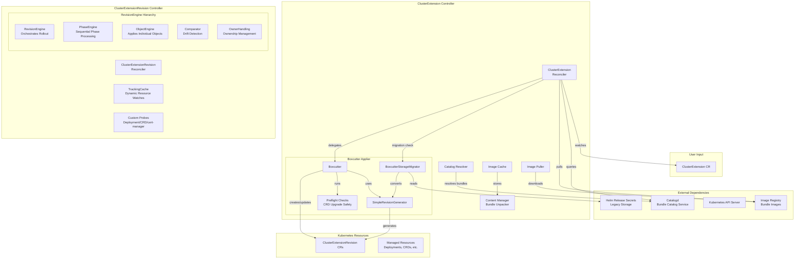
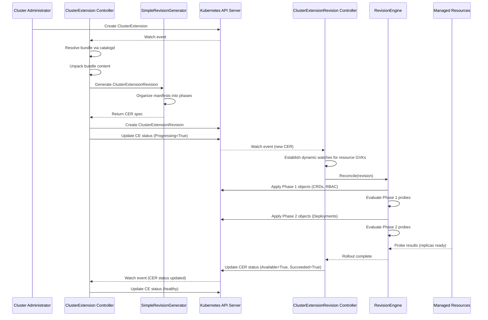

# Boxcutter Library

## Summary

This enhancement proposes replacing OLMv1's Helm-based kernel with the 
[Boxcutter](https://github.com/package-operator/boxcutter/) library. Boxcutter a battle-tested Kubernetes package 
reconciliation engine built by the Red Hat Hybrid Cloud Management organization as the core of their
[Package Operator](https://github.com/package-operator/package-operator) project. Boxcutter is well aligned with OLMv1's
goals and provides several desirable features out-of-the box that will accelerate OLMv1's roadmap, e.g. phased rollouts, 
detailed status reporting, rollback support, and anomaly detection. As part of this refactor, the enhancement also
proposes the introduction of the ClusterExtensionRevision API, which describes a snapshot of a package and its 
configuration as it should be applied to the cluster.


## Motivation

The motivation is threefold:

### Roadmap Acceleration

Adopting the Boxcutter library would accelerate the delivery of roadmap OLMv1 features:

**Revision Support**
A revision presents a snapshot of the application determined by its version and configuration. Boxcutter seamlessly
manages the transition between revisions supporting upgrade and reconfiguration use-cases. The transition between
revisions also provides the opportunity for other actors to participate in the lifecycle of the application, e.g.,
manual approval, automatic policy checks, or even the current revision of an Operator to block its upgrade until it has
performed some necessary pre-upgrade tasks.

**Phased Rollout And Teardown of Resources**
A revision also describes application deployment as a list of ordered phases. Each phase contains a set of manifests,
and optional object status probes that gate the progression of the rollout to the next phase
(e.g. wait for a CRD to registered, or for a Deployment to be available). When tearing down, the phases are executed in
reverse order. This phased approach give authors more control and predictability over how their application is applied
to the cluster and sufficient signal to ascertain whether it was successfully applied.

**Object Status Reporting**
Authors can define custom status probes for their application's resources and provide granular application state information.

**Resource Orphaning And Adoption**
The library allows for removal of objects from control of the library as well as adoption of already existing objects, to support migrations.

**Anomaly And Interference Detection**
The library eases debugging by outputting detailed information during reconciliation facilitating detection of other actors in
a system updating the same resource.

**Rollout History**
Boxcutter keeps a rollout history allowing administrators to look up bundle changes and facilitates rollback to
previously working revisions.

### ClusterExtension API

Boxcutter's revision based approach necessitates the introduction of a revision API that will introduce a step 
between determining the content that should be applied to the cluster, and actually applying it. This provides
the foundation for future use-cases, e.g. changeset calculation, manual approvals, policy-based control over
what can/cannot be applied to the cluster, allowing the content itself to be a participant in its own lifecycle (e.g.
a revision is paused until the current installation can perform some pre-upgrade tasks).

### Collaboration with Red Hat Hybrid Cloud Management

Both Package Operator and OLM have similar goals that make collaborating on a shared library desirable to avoid work
duplication. Another advantage is that Package Operator is build outside Red Hat's usual development cycle, meaning that
changes make it to production really quickly reducing the length of the feedback cycle.

### User Stories

#### Story 1: OLMv1 Developer Perspective

As an OLMv1 developer, I want to implement new lifecycle management features
(such as pause/resume, advanced rollback, or custom health checks) by extending
well-defined library interfaces rather than modifying complex reconciliation
logic, so that I can deliver features faster with higher quality and less risk
of introducing regressions in core functionality.

#### Story 2: Cluster Administrator Perspective

As a cluster administrator, I want detailed visibility into the rollout status
of `ClusterExtensions` including which specific resources are pending,
progressing, or failed, so that I can quickly diagnose and resolve deployment
issues without needing to manually inspect individual workload resources.

#### Story 3: Platform Engineer Perspective

As a platform engineer, I want to migrate existing ClusterExtensions from
Helm-based management to Boxcutter-based management without service disruption
or manual intervention, so that I can adopt new capabilities while maintaining
continuity for running workloads.

#### Story 4: Operationalization at Scale

As an SRE managing hundreds of ClusterExtensions across multiple clusters, I
want automated monitoring, alerting, and remediation capabilities that
integrate with standard Kubernetes observability tools, so that I can detect
and resolve lifecycle management issues proactively without manual toil.

### Goals

1. **Seamless Migration**: 100% of existing ClusterExtensions managed by Helm
   are automatically migrated to ClusterExtensionRevision-based management when
   the `BoxcutterRuntime` feature gate is enabled, with zero service disruption
   or manual intervention required.

2. **Enhanced Status Visibility**: `ClusterExtension` status reports include
   granular progress information with specific resource-level success/failure
   indicators, enabling administrators to diagnose issues in under 1 minute
   without needing to inspect individual workload resources.

3. **Phased Rollout Support**: ClusterExtensions support declarative phase
   definitions that ensure dependencies (e.g., CRDs, RBAC, ConfigMaps) are
   created and healthy before dependent resources (e.g., Deployments) are
   reconciled, eliminating race conditions in complex operator bundles.

4. **Historical Auditability**: All ClusterExtensions maintain a rolling
   history of the last 5 revisions, enabling point-in-time inspection of
   bundle content and automated rollback to known-good configurations when
   issues are detected.

5. **Production Readiness**: Boxcutter runtime demonstrates equivalent or
   superior performance compared to Helm applier across all key metrics
   (reconciliation latency, memory footprint, API server request rate) in
   large-scale environments (1000+ ClusterExtensions per cluster).

### Non-Goals

1. **Modification of ClusterExtension API Surface**: This enhancement does NOT
   introduce changes to the existing `ClusterExtension` CRD spec or user-facing
   configuration. Users continue to define ClusterExtensions using the same API
   they use today; the Boxcutter adoption is an internal implementation detail
   transparent to end users.

2. **Custom Resource Definition (CRD) Export**: While Boxcutter introduces the
   `ClusterExtensionRevision` CRD for internal state management, this API is NOT
   intended for direct user manipulation. Users should not create, modify, or
   delete `ClusterExtensionRevision` objects manually; these are managed
   exclusively by OLM controllers.

3. **Behavioral Changes to Existing Functionality**: Adoption of Boxcutter does
   NOT alter the semantics of existing `ClusterExtension` operations for users
   with the feature gate disabled. Helm-based applier remains the default and
   continues to function unchanged until `BoxcutterRuntime` is explicitly enabled
   by cluster administrators.

## Proposal

### Architecture Overview



The Boxcutter integration replaces the existing Helm-based applier with a
two-controller architecture:

**ClusterExtension Controller (Modified)**
- Continues to watch `ClusterExtension` resources and resolve bundle images via
  catalogd integration
- Unpacks bundle content using the existing contentmanager
- Delegates to a new Boxcutter applier implementation instead of Helm applier
- The Boxcutter applier uses `SimpleRevisionGenerator` to create or update
  `ClusterExtensionRevision` objects

```go
type SimpleRevisionGenerator struct {
      Scheme           *runtime.Scheme
      ManifestProvider ManifestProvider
  }
```
ref: https://github.com/openshift/operator-framework-operator-controller/blob/release-4.21/internal/operator-controller/applier/boxcutter.go#L45-L48

- Reports high-level status based on `ClusterExtensionRevision` conditions

**ClusterExtensionRevision Controller (New)**
- Watches `ClusterExtensionRevision` resources and uses the boxcutter
  [`RevisionEngine`](https://github.com/openshift/operator-framework-operator-controller/blob/release-4.21/internal/operator-controller/controllers/clusterextensionrevision_controller.go#L59-L62) to reconcile desired state
- Establishes dynamic watches on all resources managed by the revision using
  `TrackingCache`
- Executes phased rollout with custom probes (Deployment/StatefulSet
  availability, CRD establishment, cert-manager readiness)
- Reports detailed status conditions: Progressing (rollout in progress),
  Available (all probes passing), Succeeded (rollout complete)
- Handles lifecycle state transitions: Active (normal reconciliation), Paused
  (status-only updates), Archived (teardown and cleanup)
- Manages finalizers to ensure clean teardown of managed resources

**Storage Migration**
- [BoxcutterStorageMigrator](https://github.com/openshift/operator-framework-operator-controller/blob/release-4.21/internal/operator-controller/applier/boxcutter.go#L156-L160) detects existing Helm Release Secrets for each
  ClusterExtension
- Converts Helm manifest strings to `ClusterExtensionRevision` phase/object
  structure
- Sets revision number to 1 for migrated installations
- Allows collision-free adoption of existing resources via
  `CollisionProtection=None`

**Garbage Collection**
- Maintains the last 5 archived revisions per `ClusterExtension`
- Automatically archives previous revisions when a new revision reaches
  Succeeded=True status
- Deletes oldest archived revisions when count exceeds limit

### Key Differentiators from Helm

1. **Immutable Revisions**: Each `ClusterExtensionRevision` is immutable
   (spec.phases and spec.revision cannot be modified after creation). Updates
   create new revisions rather than mutating existing ones.

2. **Asynchronous Reconciliation**: `ClusterExtension` controller creates/updates
   `ClusterExtensionRevision` and returns immediately; actual rollout progresses
   asynchronously in the `ClusterExtensionRevision` controller.

3. **Granular Status**: Individual object-level probe results are surfaced in
   conditions, not just high-level "deployed" vs "failed" states.

4. **Phased Orchestration**: Objects are organized into named phases that
   reconcile sequentially; next phase only begins when all objects in current
   phase pass their probes.

5. **Lifecycle States**: Explicit Active/Paused/Archived states enable
   operational flexibility (e.g., pausing rollouts during maintenance,
   archiving old revisions to clean up while preserving history).

### Workflow Description

#### Sequence Diagram: Initial Installation Flow



#### Actors

- **Cluster Administrator**: Creates/updates `ClusterExtension` resources to install or upgrade operators
- **ClusterExtension Controller**: Resolves bundles and generates`ClusterExtensionRevision` objects
- **ClusterExtensionRevision Controller**: Reconciles managed resources to match revision spec
- **Boxcutter RevisionEngine**: Core library implementing rollout logic and probe evaluation
- **Kubernetes API Server**: Stores all resources and processes Server-Side Apply patches

#### Workflow: Initial Installation

1. Cluster Administrator creates a `ClusterExtension` resource referencing an
   operator bundle
2. `ClusterExtension` controller resolves the bundle reference via catalogd and
   unpacks content
3. `ClusterExtension` controller invokes `BoxcutterStorageMigrator` to check for
   existing Helm Release Secret (none found for new install)
4. `ClusterExtension` controller uses `SimpleRevisionGenerator` to create
   `ClusterExtensionRevision` named `<extension-name>-1` with revision=1
5. `SimpleRevisionGenerator` extracts manifests from bundle, organizes them into
   phases using PhaseSort (CRDs/RBAC first, workloads later), and sets
   objectLabels
6. `ClusterExtension` controller applies `ClusterExtensionRevision` with
   Server-Side Apply and reports Progressing=True
7. `ClusterExtensionRevision` controller detects new revision and establishes
   dynamic watches for all resource GVKs in the revision
8. `ClusterExtensionRevision` controller invokes RevisionEngine.Reconcile() which
   iterates through phases sequentially
9. For each object in Phase 1 (e.g., CRDs, RBAC), RevisionEngine applies via
   Server-Side Apply with field ownership
10. After all Phase 1 objects exist, RevisionEngine evaluates probes (CRD
    Established=True, no probes for RBAC)
11. Once all Phase 1 probes pass, RevisionEngine proceeds to Phase 2
    (Deployments, StatefulSets)
12. RevisionEngine applies Phase 2 objects and evaluates availability probes
    (replicas ready, ObservedGeneration matches)
13. When all phases complete successfully, `ClusterExtensionRevision` controller
    sets Available=True and Succeeded=True
14. `ClusterExtensionRevision` controller removes Progressing condition
15. `ClusterExtension` controller observes Succeeded=True and reports overall
    status as healthy

#### Workflow: Upgrade

1. Cluster Administrator updates `ClusterExtension` spec (e.g., changes bundle
   version)
2. `ClusterExtension` controller detects spec change, resolves new bundle, and
   unpacks content
3. `ClusterExtension` controller lists existing `ClusterExtensionRevisions` (finds
   `<extension-name>-1`)
4. `SimpleRevisionGenerator` creates new `ClusterExtensionRevision` named
   `<extension-name>-2` with revision=2
5. New revision includes spec.previous referencing `<extension-name>-1` (for
   history tracking)
6. `ClusterExtensionRevision` controller reconciles new revision following same
   phased rollout process
7. When new revision reaches Succeeded=True, `ClusterExtensionRevision`
   controller patches `<extension-name>-1` to set lifecycleState=Archived
8. Archived revision controller tears down resources it uniquely owns (those
   not adopted by new revision)
9. After 5 total revisions, oldest archived revision is deleted during garbage
   collection

#### Workflow: Migration from Helm

1. Cluster Administrator enables `BoxcutterRuntime` feature gate and restarts
   operator-controller
2. `ClusterExtension` controller now uses Boxcutter applier instead of Helm
   applier
3. On first reconcile of each existing ClusterExtension,
   BoxcutterStorageMigrator queries for Helm Release Secret
4. If found, migrator extracts manifests from helmRelease.Manifest field and
   creates `ClusterExtensionRevision` with revision=1
5. Migrator sets CollisionProtection=None to allow adoption of existing
   resources without ownership conflicts
6. Migrator resets OwnerReferences to enable `ClusterExtensionRevision` to take
   ownership
7. `ClusterExtensionRevision` controller reconciles and adopts existing resources
   via Server-Side Apply
8. No resources are deleted or recreated; ownership simply transfers from Helm
   to Boxcutter
9. Future updates use standard Boxcutter upgrade workflow creating revision=2,
   revision=3, etc.

### API Extensions

This enhancement introduces the `ClusterExtensionRevision` CRD for internal state
management. This API is NOT intended for direct usage by the user; it is
managed exclusively by OLM controllers.

The `ClusterExtensionRevision` CRD does not modify the behaviour of existing
resources owned by other teams. It only manages resources defined within
operator bundles that are explicitly referenced by `ClusterExtension` objects.

#### Spec

**LifecycleState**
Enum with the following values:
- `Active`: revision is being actively reconciled
- `Paused`: revision reconciliation is paused
- `Archived`: revision is archived for historical / audit purposes

**Revision**
Positive and immutable revision sequence number. It is unique and must be set to 1 + the previous revision's
sequence number, or 1 if it is the first revision.

**Phases**
A list of phase objects with the following spec:

- `Name`: unique identifier for the phase
- `Objects`: a list of revision objects

A revision object has the following spec:

- `Object`: the specific object manifest
- `CollisionProtection`: an enum that controls boxcutters treatment in case the object already exists on the cluster:
  - `Prevent`: only allow management of objects created by the revision
  - `IfNoController`: allows the existing object to be adopted if it is not already owned by another controller
  - `None`: forcibly takes ownership over the object independent of any existing owner reference

#### Status

**Conditions**

- `Progression`: must be true if the revision is actually making a change to the cluster. The change may be anything: desired user state, 
  desired user configuration, observed configuration, transitioning to new revision, etc. If this is false, it means the operator is not
  trying to apply any new state. It presents with the following reasons:
  - `ObjectCollisions`: when object collisions are detected
  - `RollingOut`: while the revision is being rolled out or transitioning to a new revision
  - `RolloutError`: when an error is detected during revision rollout
  - `RolledOut`: when the revision objects have been applied to the cluster
  - `Archived`: when the revision is archived and no longer actively being reconciled
- `Availability`: must be true if the revision is functional and available in the cluster at the level in status. If this is false, it means
  there is an outage. It presents with the following reasons:
  - `ProbeFailed`: when a object status probe fails
  - `ProbesSucceeded`: when all object status probes are successful
  - `Archived`: when the revision is archived and no longer being actively reconciled
- `Succeeded`: must be true is the revision has been successfully rolled out and all object status probes have been successful _once_. Signals
  that it the revision has been installed successfully at least once. It presents with the following reasons:
  - `RolloutSuccess`: when rollout has been successful.

**Notes**
- The `Succeeded` conditions may be removed in the future. It's value beyond initially facilitating integration with the ClusterExtension 
reconciliation process is still being discussed
- Revision objects are currently added inline in the phases. Before GA we aim to shard the resources across some kind of container
  (e.g. ConfigMap) to guard against blowing etcd document size limits
- The specific bundle reference is added as an annotation to the revision (similarly to how its currently done with the Helm release
  Secrets). This information will likely be added to the status before GA


#### Example:

```
apiVersion: olm.operatorframework.io/v1
kind: ClusterExtensionRevision
metadata:
  annotations:
    olm.operatorframework.io/bundle-name: dynamic-operator.1.2.0
    olm.operatorframework.io/bundle-reference: dynamic-registry.operator-controller-e2e.svc.cluster.local:5000/bundles/registry-v1/test-operator:v1.0.0
    olm.operatorframework.io/bundle-version: 1.2.0
    olm.operatorframework.io/package-name: ""
  creationTimestamp: "2025-11-13T15:13:56Z"
  finalizers:
  - olm.operatorframework.io/teardown
  generation: 1
  labels:
    olm.operatorframework.io/owner: clusterextension-h8284vg7
  name: clusterextension-h8284vg7-1
  ownerReferences:
  - apiVersion: olm.operatorframework.io/v1
    blockOwnerDeletion: true
    controller: true
    kind: ClusterExtension
    name: clusterextension-h8284vg7
    uid: 9afe946c-8068-44f4-9084-f146b6d9d167
  resourceVersion: "1665"
  uid: 04af3358-6601-4952-9e05-94a85397e63a
spec:
  lifecycleState: Active
  phases:
  - name: policies
    objects:
    - collisionProtection: Prevent
      object:
        apiVersion: networking.k8s.io/v1
        kind: NetworkPolicy
        metadata:
          labels:
            olm.operatorframework.io/owner-kind: ClusterExtension
            olm.operatorframework.io/owner-name: clusterextension-h8284vg7
          name: test-operator-network-policy
          namespace: clusterextension-h8284vg7
        spec:
          podSelector: {}
          policyTypes:
          - Ingress
  - name: rbac
    objects:
    - collisionProtection: Prevent
      object:
        apiVersion: v1
        kind: ServiceAccount
        metadata:
          labels:
            olm.operatorframework.io/owner-kind: ClusterExtension
            olm.operatorframework.io/owner-name: clusterextension-h8284vg7
          name: simple-bundle-manager
          namespace: clusterextension-h8284vg7
    - collisionProtection: Prevent
      object:
        apiVersion: rbac.authorization.k8s.io/v1
        kind: ClusterRole
        metadata:
          labels:
            olm.operatorframework.io/owner-kind: ClusterExtension
            olm.operatorframework.io/owner-name: clusterextension-h8284vg7
          name: testoperator.v1.0.0-t88i5epjh8oxp4klplhjyrsekwcp92b27w03ayr1ku5
        rules:
        - apiGroups:
          - authentication.k8s.io
          resources:
          - tokenreviews
          verbs:
          - create
        - apiGroups:
          - authorization.k8s.io
          resources:
          - subjectaccessreviews
          verbs:
          - create
    - collisionProtection: Prevent
      object:
        apiVersion: rbac.authorization.k8s.io/v1
        kind: ClusterRoleBinding
        metadata:
          labels:
            olm.operatorframework.io/owner-kind: ClusterExtension
            olm.operatorframework.io/owner-name: clusterextension-h8284vg7
          name: testoperator.v1.0.0-t88i5epjh8oxp4klplhjyrsekwcp92b27w03ayr1ku5
        roleRef:
          apiGroup: rbac.authorization.k8s.io
          kind: ClusterRole
          name: testoperator.v1.0.0-t88i5epjh8oxp4klplhjyrsekwcp92b27w03ayr1ku5
        subjects:
        - kind: ServiceAccount
          name: simple-bundle-manager
          namespace: clusterextension-h8284vg7
    - collisionProtection: Prevent
      object:
        apiVersion: rbac.authorization.k8s.io/v1
        kind: ClusterRole
        metadata:
          labels:
            olm.operatorframework.io/owner-kind: ClusterExtension
            olm.operatorframework.io/owner-name: clusterextension-h8284vg7
          name: testoperator.v1.0.-1eqned1rve17v8ggw7pxcudwuwxtutac7n2t3grh27tm
        rules:
        - apiGroups:
          - ""
          resources:
          - configmaps
          - serviceaccounts
          verbs:
          - get
          - list
          - watch
          - create
          - update
          - patch
          - delete
        - apiGroups:
          - networking.k8s.io
          resources:
          - networkpolicies
          verbs:
          - get
          - list
          - create
          - update
          - delete
        - apiGroups:
          - coordination.k8s.io
          resources:
          - leases
          verbs:
          - get
          - list
          - watch
          - create
          - update
          - patch
          - delete
        - apiGroups:
          - ""
          resources:
          - events
          verbs:
          - create
          - patch
        - apiGroups:
          - ""
          resources:
          - namespaces
          verbs:
          - get
          - list
          - watch
    - collisionProtection: Prevent
      object:
        apiVersion: rbac.authorization.k8s.io/v1
        kind: ClusterRoleBinding
        metadata:
          labels:
            olm.operatorframework.io/owner-kind: ClusterExtension
            olm.operatorframework.io/owner-name: clusterextension-h8284vg7
          name: testoperator.v1.0.-1eqned1rve17v8ggw7pxcudwuwxtutac7n2t3grh27tm
        roleRef:
          apiGroup: rbac.authorization.k8s.io
          kind: ClusterRole
          name: testoperator.v1.0.-1eqned1rve17v8ggw7pxcudwuwxtutac7n2t3grh27tm
        subjects:
        - kind: ServiceAccount
          name: simple-bundle-manager
          namespace: clusterextension-h8284vg7
  - name: crds
    objects:
    - collisionProtection: Prevent
      object:
        apiVersion: apiextensions.k8s.io/v1
        kind: CustomResourceDefinition
        metadata:
          annotations:
            controller-gen.kubebuilder.io/version: v0.16.1
          labels:
            olm.operatorframework.io/owner-kind: ClusterExtension
            olm.operatorframework.io/owner-name: clusterextension-h8284vg7
          name: olme2etests.olm.operatorframework.io
        spec:
          group: olm.operatorframework.io
          names:
            kind: OLME2ETest
            listKind: OLME2ETestList
            plural: olme2etests
            singular: olme2etest
          scope: Cluster
          versions:
          - name: v1
            schema:
              openAPIV3Schema:
                properties:
                  spec:
                    properties:
                      testField:
                        type: string
                    type: object
                type: object
            served: true
            storage: true
        status:
          acceptedNames:
            kind: ""
            plural: ""
          conditions: null
          storedVersions: null
  - name: deploy
    objects:
    - collisionProtection: Prevent
      object:
        apiVersion: v1
        data:
          name: test-configmap
          version: v1.0.0
        kind: ConfigMap
        metadata:
          annotations:
            shouldNotTemplate: |
              The namespace is {{ $labels.namespace }}. The templated $labels.namespace is NOT expected to be processed by OLM's rendering engine for registry+v1 bundles.
          labels:
            olm.operatorframework.io/owner-kind: ClusterExtension
            olm.operatorframework.io/owner-name: clusterextension-h8284vg7
          name: test-configmap
          namespace: clusterextension-h8284vg7
    - collisionProtection: Prevent
      object:
        apiVersion: v1
        data:
          httpd.sh: |
            #!/bin/sh
            echo true > /var/www/started
            echo true > /var/www/ready
            echo true > /var/www/live
            exec httpd -f -h /var/www -p 80
        kind: ConfigMap
        metadata:
          labels:
            olm.operatorframework.io/owner-kind: ClusterExtension
            olm.operatorframework.io/owner-name: clusterextension-h8284vg7
          name: httpd-script
          namespace: clusterextension-h8284vg7
    - collisionProtection: Prevent
      object:
        apiVersion: apps/v1
        kind: Deployment
        metadata:
          labels:
            app.kubernetes.io/component: controller
            app.kubernetes.io/name: test-operator
            app.kubernetes.io/version: 1.0.0
            olm.operatorframework.io/owner-kind: ClusterExtension
            olm.operatorframework.io/owner-name: clusterextension-h8284vg7
          name: test-operator
          namespace: clusterextension-h8284vg7
        spec:
          replicas: 1
          revisionHistoryLimit: 1
          selector:
            matchLabels:
              app: olme2etest
          strategy: {}
          template:
            metadata:
              annotations:
                alm-examples: |-
                  [
                    {
                      "apiVersion": "olme2etests.olm.operatorframework.io/v1",
                      "kind": "OLME2ETests",
                      "metadata": {
                        "labels": {
                          "app.kubernetes.io/managed-by": "kustomize",
                          "app.kubernetes.io/name": "test"
                        },
                        "name": "test-sample"
                      },
                      "spec": null
                    }
                  ]
                capabilities: Basic Install
                createdAt: "2024-10-24T19:21:40Z"
                olm.targetNamespaces: ""
                operators.operatorframework.io/builder: operator-sdk-v1.34.1
                operators.operatorframework.io/project_layout: go.kubebuilder.io/v4
              labels:
                app: olme2etest
            spec:
              containers:
              - command:
                - /scripts/httpd.sh
                image: busybox:1.36
                livenessProbe:
                  failureThreshold: 1
                  httpGet:
                    path: /live
                    port: 80
                  periodSeconds: 2
                name: busybox-httpd-container
                ports:
                - containerPort: 80
                readinessProbe:
                  httpGet:
                    path: /ready
                    port: 80
                  initialDelaySeconds: 1
                  periodSeconds: 1
                resources: {}
                startupProbe:
                  failureThreshold: 30
                  httpGet:
                    path: /started
                    port: 80
                  periodSeconds: 10
                volumeMounts:
                - mountPath: /scripts
                  name: scripts
                  readOnly: true
              serviceAccountName: simple-bundle-manager
              terminationGracePeriodSeconds: 0
              volumes:
              - configMap:
                  defaultMode: 493
                  name: httpd-script
                name: scripts
        status: {}
  revision: 1
status:
  conditions:
  - lastTransitionTime: "2025-11-13T15:13:57Z"
    message: Revision 1.2.0 is rolled out.
    observedGeneration: 1
    reason: RolledOut
    status: "False"
    type: Progressing
  - lastTransitionTime: "2025-11-13T15:13:57Z"
    message: 'Object Deployment.apps/v1 clusterextension-h8284vg7/test-operator: condition
      "Available" == "True": missing .status.conditions and ".status.updatedReplicas"
      == ".status.replicas": ".status.updatedReplicas" missing'
    observedGeneration: 1
    reason: ProbeFailure
    status: "False"
    type: Available
```

### Topology Considerations

#### Hypershift / Hosted Control Planes

OLM operator-controller runs in the management cluster and manages operators 
deployed to hosted clusters.

**Considerations:**
- `ClusterExtensionRevision` objects are created and stored in the management
  cluster alongside `ClusterExtension` objects
- Managed resources (Deployments, CRDs, etc.) are created in the hosted cluster
- Boxcutter's `TrackingCache` must watch resources in the hosted cluster context,
  not the management cluster
- Probe evaluation (checking Deployment replicas, CRD establishment) occurs
  against hosted cluster API server
- Network latency between management and hosted clusters may increase
  reconciliation time for probe evaluation
- Revision history storage (keeping last 5 revisions) adds minimal etcd
  overhead in management cluster

**Validation Required:**
- Ensure `TrackingCache` correctly establishes watches on hosted cluster
  resources
- Verify probe timeout values account for cross-cluster latency
- Test garbage collection behavior under hosted cluster API server
  unavailability

#### Standalone Clusters

This is the primary tested deployment model for Boxcutter (proven in Red Hat
HCM production). All controllers, CRDs, and managed resources colocate in the
same cluster. TrackingCache watches are local, minimizing latency. No special
configuration required.

#### Single-node Deployments or MicroShift

**Considerations:**
- `ClusterExtensionRevision` objects add incremental etcd storage overhead (~5
  revisions per `ClusterExtension`)
- `TrackingCache` dynamic watches increase controller memory footprint (one
  informer per unique GVK across all revisions)
- Boxcutter's phased rollout may increase total reconciliation time compared to
  Helm's synchronous apply-all approach
- Memory optimizations in `SimpleRevisionGenerator` (`cache.ApplyStripTransform`
  removes large annotations and managed fields) help mitigate footprint

**Validation Required:**
- Measure memory footprint with 10, 50, 100 `ClusterExtensions` on single-node
  cluster
- Compare against Helm applier baseline memory usage
- Verify garbage collection prevents unbounded revision growth
- Test behavior under memory pressure (ensure graceful degradation, not OOM
  kills)

#### OKE (OpenShift Kubernetes Engine)

OKE is a managed Kubernetes service; OLM behavior should be cloud-agnostic. No
OKE-specific APIs or integrations required. Standard Kubernetes API semantics
apply (Server-Side Apply, watches, etc.). Boxcutter library has no
cloud-specific dependencies.

### Implementation Details/Notes/Constraints

#### New Components

1. **ClusterExtensionRevision CRD** - Already implemented in current codebase.
   Defines spec with lifecycleState, revision number, phases, and previous
   revision references. Defines status with conditions (Available, Succeeded,
   Progressing). Includes validation rules for immutability and lifecycle state
   transitions.

2. **ClusterExtensionRevisionReconciler** - Already implemented behind
   `!standard` build tag. Integrates boxcutter RevisionEngine for reconcile and
   teardown operations. Implements custom probes for Deployment, StatefulSet,
   CRD, cert-manager resources. Manages lifecycle state transitions and
   automatic archiving of previous revisions.

3. **Boxcutter Applier** - Already implemented. Provides
   SimpleRevisionGenerator to create `ClusterExtensionRevision` from bundle
   filesystem. Provides BoxcutterStorageMigrator to convert Helm Release
   Secrets to revisions. Implements Apply() interface matching existing Helm
   applier signature.

4. **TrackingCache Implementation** - TrackingCache interface implementation already 
   present in `ClusterExtensionRevision` reconciler. Provides dynamic
   watch establishment per `ClusterExtensionRevision`. Manages informer lifecycle
   (start watches when revision becomes Active, stop when Archived/deleted).

#### Modified Components

1. **ClusterExtension Controller** - Add conditional logic to use Boxcutter
   applier when `BoxcutterRuntime` feature gate is enabled. Replace Helm applier
   instantiation with Boxcutter applier. Add watch on
   `ClusterExtensionRevision` to trigger reconcile when revision status changes.

2. **Manager Setup** - Already includes setupBoxcutter() function that
   registers `ClusterExtensionRevision` reconciler. Conditional cache
   configuration for `ClusterExtensionRevision` objects when feature gate
   enabled.

3. **Feature Gate Definitions** - 

#### Library Dependencies

1. **Boxcutter Library** (`pkg.package-operator.run/boxcutter`) - Already
   vendored at v0.7.1. Provides RevisionEngine interface and default
   implementation. Provides probing framework for custom health checks.

2. **Controller-runtime Extensions** - Potential need for custom cache
   implementation to support TrackingCache interface. May require upstreaming
   changes if dynamic watch management needs framework support.

### Risks and Mitigations

**Risk: Increased Complexity**
The introduction of a new `ClusterExtensionRevision` CRD and asynchronous
reconciliation model adds complexity to the system. New failure modes may be
introduced that were not present in the Helm-based approach.

*Mitigation:* Boxcutter has been battle-tested in production for over 2.5 years
in Red Hat Hybrid Cloud Management. The library's proven track record reduces
the risk of introducing regressions. Comprehensive e2e testing and gradual
rollout behind a feature gate allow for validation before general availability.

**Risk: Performance Degradation**
Phased rollout and dynamic watches may increase memory footprint and
reconciliation latency compared to Helm's synchronous approach.

**Risk: Migration Failures**
Automatic migration from Helm to Boxcutter may fail for ClusterExtensions with
unexpected configurations or edge cases.

*Mitigation:* BoxcutterStorageMigrator has been designed to handle existing
Helm Release Secrets and adopt resources without deletion. Comprehensive
migration testing across various operator bundle types will validate the
migration process. Feature gate provides escape hatch if issues are discovered.

**Risk: Dependency on External Library**
Adopting Boxcutter creates a dependency on Red Hat Hybrid Cloud Management's
Package Operator project. API changes or bugs in the library could impact OLM.

*Mitigation:* Boxcutter is vendored at a specific version, providing stability.
Red Hat HCM team's rolling release cadence provides continuous validation.
Shared ownership model distributes maintenance burden. Library abstraction
isolates OLM from internal implementation details.

### Drawbacks

**Increased API Surface**: The introduction of `ClusterExtensionRevision` CRD
increases the API surface area that must be documented, supported, and
maintained, even though it is not intended for direct user manipulation.

**Migration Effort**: While automatic migration is provided, troubleshooting
migration issues and validating successful migration across diverse
environments requires engineering investment.

**Version Skew Complexity**: During upgrades, the system must support both Helm
and Boxcutter appliers simultaneously, increasing version skew complexity.

These drawbacks are outweighed by the benefits of reduced maintenance burden,
accelerated feature delivery, and access to production-proven lifecycle
management capabilities.

## Alternatives (Not Implemented)

### Alternative 1: Continue with Helm-based Applier

Continue using the existing Helm-based applier and implement advanced lifecycle
management features (phased rollouts, detailed status reporting, rollback
support) in-house.

**Pros:**
- No new external dependencies
- Full control over implementation
- No learning curve for new library

**Cons:**
- Significant engineering investment required to implement features from
  scratch
- Increased maintenance burden for OLM team
- No production validation of new features
- Slower time-to-market for advanced capabilities

**Why Not Chosen:** This approach would consume significant engineering
resources that could be better spent on OLM-specific features like catalog
management and dependency resolution. Boxcutter provides these capabilities
today with 2.5 years of production hardening.

### Alternative 2: Build a New Library from Scratch

Design and implement a new, purpose-built lifecycle management library tailored
specifically to OLM's needs.

**Pros:**
- Optimized specifically for OLM use cases
- Full control over design decisions
- No external dependencies

**Cons:**
- Requires substantial engineering investment
- No production validation initially
- Duplicate effort with Red Hat HCM Package Operator
- Increased time-to-market

**Why Not Chosen:** Building from scratch would delay delivery of critical
features by months or years. Boxcutter already implements the majority of
OLM's lifecycle management roadmap with proven production reliability.

### Alternative 3: Use Flux or ArgoCD

Integrate with existing GitOps tools like Flux or ArgoCD for lifecycle
management.

**Pros:**
- Well-established tools with large communities
- Rich feature sets

**Cons:**
- Not designed for operator bundle management
- Requires fundamental architecture changes to OLM
- Misaligned with OLM's declarative `ClusterExtension` API
- Limited customization for OLM-specific requirements

**Why Not Chosen:** GitOps tools are designed for different use cases
(continuous delivery from Git repositories) and would require significant
adaptation to work with OLM's catalog-driven operator installation model.

## Open Questions

None at this time.

## Future Work

- Progression Deadline
- Rollback strategy
- Controlling revision lifecycle through ClusterExtension

## Test Plan

<!-- TODO: This section needs to be filled in -->

Per dev-guide/feature-zero-to-hero.md, all tests must include:
- `[OCPFeatureGate:BoxcutterRuntime]` label for the feature gate
- `[Jira:"OLM"]` label for the component (adjust component name as appropriate)
- Appropriate test type labels like `[Suite:...]`, `[Serial]`, `[Slow]`, or
  `[Disruptive]` as needed

Reference dev-guide/test-conventions.md for detailed test labeling
requirements.

**Testing Strategy:**

- Unit tests for Boxcutter applier, SimpleRevisionGenerator,
  BoxcutterStorageMigrator
- Integration tests for `ClusterExtensionRevisionReconciler` covering lifecycle
  states, probe evaluation, garbage collection
- E2E tests for migration scenarios (Helm → Boxcutter), upgrade flows with
  revision history, failure recovery

## Graduation Criteria

<!-- TODO: This section needs to be filled in -->

Per dev-guide/feature-zero-to-hero.md, promotion from `TechPreviewNoUpgrade` to
Default requires:
- Minimum 5 tests per feature
- All tests run at least 7 times per week
- All tests run at least 14 times per supported platform
- 95% pass rate across all tests
- Tests running on all supported platforms: AWS (HA, Single), Azure (HA), GCP
  (HA), vSphere (HA), Baremetal (HA with IPv4, IPv6, Dual)

### Dev Preview -> Tech Preview

- Phase objects are added inline
- Only the basic install/upgrade flows:
  - No high-level control of the lifecycle through ClusterExtension API surface (e.g. no pausing revisions etc.)
  - No orphaning and adoption support
  - No anomaly/interference detection, or only surfaced through logs if at all 
- End user documentation for `BoxcutterRuntime` feature gate
- Sufficient test coverage as outlined in Test Plan
- Gather feedback from early adopters
- Enumerate service level indicators (SLIs), expose SLIs as metrics for
  `ClusterExtensionRevision` conditions
- Write symptoms-based alerts for `ClusterExtensionRevision` failures

### Tech Preview -> GA

- Phase resource sharding
- Adoption / Orphaning
- Anomaly/interference detection
- More testing (upgrade, downgrade, scale)
- Sufficient time for feedback (at least one release cycle)
- Available by default (flip `BoxcutterRuntime` feature gate default to true)
- Backhaul SLI telemetry for `ClusterExtensionRevision` conditions
- Document SLOs for `ClusterExtensionRevision` reconciliation
- User facing documentation created in openshift-docs
- End to end tests covering all supported topologies
- Performance validation showing equivalent or superior metrics compared to
  Helm applier

### Removing a deprecated feature

Not applicable - this enhancement does not deprecate existing features. The
Helm-based applier will be deprecated in a future enhancement after Boxcutter
reaches GA.

## Upgrade / Downgrade Strategy

**Upgrade:**
- When a cluster upgrades to a version with `BoxcutterRuntime` feature gate
  available (but disabled by default), no changes occur to existing
  ClusterExtensions
- When an administrator enables `BoxcutterRuntime` feature gate and restarts
  operator-controller, BoxcutterStorageMigrator automatically converts existing
  Helm-managed ClusterExtensions to ClusterExtensionRevision-based management
- Migration is transparent; no user action required beyond enabling feature
  gate
- Existing deployed resources are adopted seamlessly without deletion and
  recreation

**Downgrade:**
- If `BoxcutterRuntime` feature gate is disabled after being enabled, the system
  reverts to Helm-based applier
- `ClusterExtensionRevision` objects remain in etcd but are no longer reconciled
- Future `ClusterExtension` updates use Helm applier instead of Boxcutter
  applier
- Manual cleanup of `ClusterExtensionRevision` objects may be required if feature
  gate is permanently disabled

**Version Skew:**
- During cluster upgrades, some operator-controller replicas may have
  `BoxcutterRuntime` enabled while others do not
- Leader election ensures only one replica reconciles a given ClusterExtension
  at a time, preventing conflicts
- `ClusterExtensionRevision` controller only runs when `BoxcutterRuntime` is
  enabled, preventing version skew issues

## Version Skew Strategy

The `BoxcutterRuntime` feature gate is operator-scoped (not node-scoped), so
version skew considerations are limited to operator-controller replicas during
rolling updates.

**During Upgrade:**
- New operator-controller replicas with `BoxcutterRuntime` enabled may coexist
  with old replicas using Helm applier
- Leader election ensures only one replica reconciles each ClusterExtension
- When new replica becomes leader, it will use BoxcutterStorageMigrator to
  convert Helm-managed ClusterExtensions to ClusterExtensionRevision-based
  management
- Old replicas that lose leader election will not interfere with new replicas'
  reconciliation

**Impact on Managed Operators:**
- Managed operators (the workloads deployed by ClusterExtensions) are
  unaffected by the applier implementation change
- Resources deployed by Helm applier are adopted by Boxcutter applier without
  deletion or recreation
- No version skew between operator-controller and managed operators

## Operational Aspects of API Extensions

The `ClusterExtensionRevision` CRD is introduced as an internal state management
resource. Key operational aspects:

**Service Level Indicators (SLIs):**
- `ClusterExtensionRevision` condition `Available=True` indicates all managed
  resources passed health probes
- `ClusterExtensionRevision` condition `Succeeded=True` indicates rollout
  completed successfully
- `ClusterExtensionRevision` condition `Progressing=True` indicates rollout in
  progress
- Metrics should be exposed for condition transitions and duration in each
  state

**Impact on Existing SLIs:**
- `ClusterExtensionRevision` objects add incremental etcd storage overhead (~5
  revisions per `ClusterExtension` with ~10-50KB per revision)
- Dynamic watches increase controller memory footprint (one informer per unique
  GVK across all active revisions)
- Expected use-cases: up to 1000 ClusterExtensions per cluster, resulting in
  ~5000 `ClusterExtensionRevision` objects maximum
- Performance testing required to validate impact on API throughput

**Failure Modes:**
- **Preflight Validation Failure**: Revision cannot be created due to invalid
  manifest content. `ClusterExtension` status reports validation error.
- **Collision Detection Failure**: Managed resource already owned by another
  controller. `ClusterExtensionRevision` condition reports collision error.
- **Probe Failure**: Managed resource exists but fails health check (e.g.,
  Deployment replicas not ready). `ClusterExtensionRevision` condition reports
  probe failure with specific resource name and reason.
- **Reconciliation Loop**: RevisionEngine cannot make progress due to API
  server errors or resource conflicts. `ClusterExtensionRevision` condition
  reports reconciliation failure.

**Impact on Cluster Health:**
- `ClusterExtensionRevision` failures do not impact core cluster functionality
  (kube-apiserver, kubelet, etc.)
- Failures only affect the specific `ClusterExtension` being reconciled
- Other ClusterExtensions continue to reconcile normally

**Teams for Escalation:**
- OLM team (primary owner of `ClusterExtension` and `ClusterExtensionRevision`
  APIs)
- Red Hat HCM team (Boxcutter library maintainers, for library-specific issues)

## Support Procedures

**Detecting Failures:**

*Symptoms:*
- `ClusterExtension` status condition shows `Progressing=True` stuck for extended
  period
- `ClusterExtension` status condition shows `Available=False`
- `ClusterExtensionRevision` status condition shows probe failures with specific
  resource names and reasons
- operator-controller logs show errors like "failed to apply object" or "probe
  timeout exceeded"

*Metrics/Alerts:*
- Prometheus metric `clusterextensionrevision_condition{condition="Available",
  status="False"}` triggers alert `ClusterExtensionRevisionUnavailable`
- Prometheus metric `clusterextensionrevision_condition{condition="Progressing",
  status="True"}` duration exceeds threshold triggers alert
  `ClusterExtensionRevisionStuckProgressing`

**Disabling the API Extension:**

To disable `BoxcutterRuntime` feature gate:
1. Update FeatureGate resource to remove `BoxcutterRuntime` from enabled features
2. Restart operator-controller pods
3. System reverts to Helm-based applier for future ClusterExtension
   reconciliations

*Consequences on Cluster Health:*
- `ClusterExtensionRevision` controller stops reconciling
- `ClusterExtensionRevision` objects remain in etcd but are no longer managed
- Future `ClusterExtension` updates use Helm applier instead

*Consequences on Existing Workloads:*
- Existing managed resources (Deployments, StatefulSets, etc.) continue running
  normally
- Resources remain owned by `ClusterExtensionRevision` objects but are no longer
  actively reconciled
- Drift from desired state will not be corrected until feature gate is
  re-enabled or `ClusterExtension` is updated (triggering Helm applier)

*Consequences on Newly Created Workloads:*
- New ClusterExtensions use Helm applier instead of Boxcutter applier
- Advanced features (phased rollouts, detailed status reporting) are not
  available
- Basic install/upgrade/uninstall functionality continues to work

**Graceful Failure and Recovery:**

`BoxcutterRuntime` feature gate can be disabled and re-enabled without risking
consistency:
- Disabling feature gate stops `ClusterExtensionRevision` reconciliation but does
  not delete managed resources
- Re-enabling feature gate resumes reconciliation from current state
- `ClusterExtensionRevision` controller uses Server-Side Apply with field
  ownership, preventing conflicts when resuming
- No "zombie" resources created during downtime; all resources remain tracked
  in `ClusterExtensionRevision` objects

## Infrastructure Needed

No additional infrastructure required. All development and testing can be
performed using existing OpenShift CI infrastructure.
