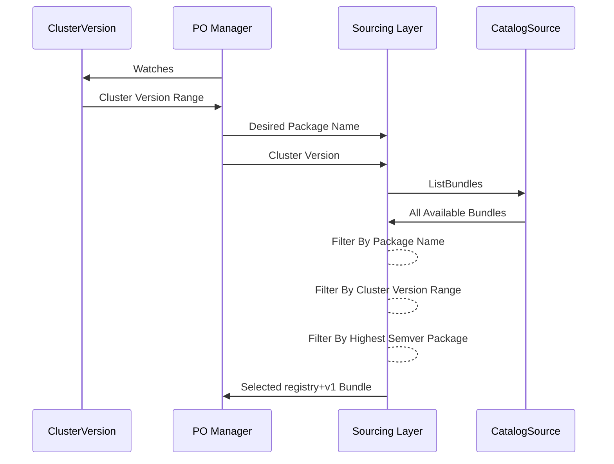
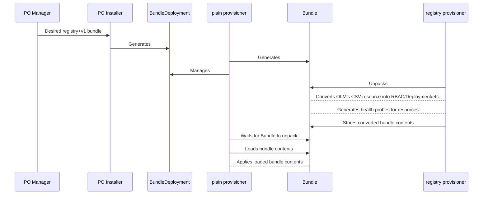
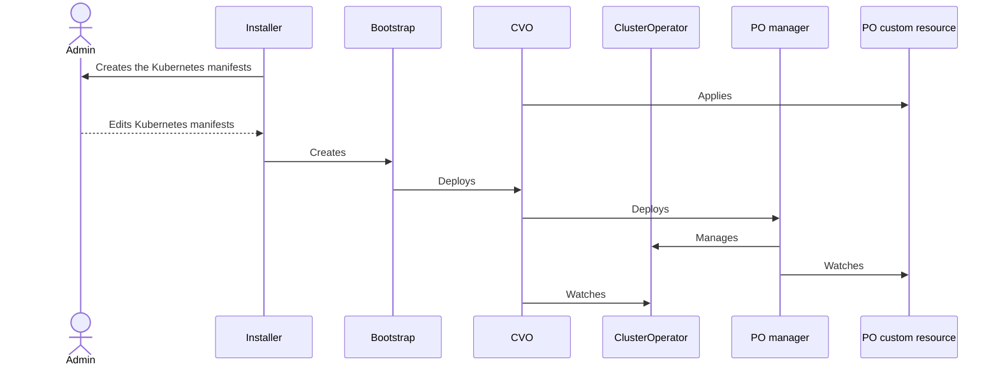

# Platform Operators

## Release Signoff Checklist

- [x] Enhancement is `implementable`
- [x] Design details are appropriately documented from clear requirements
- [ ] Test plan is defined
- [ ] Graduation criteria for dev preview, tech preview, GA
- [ ] User-facing documentation is created in [openshift-docs](https://github.com/openshift/openshift-docs/)

## Summary

Previous 4.x releases kickstarted the "Composable OpenShift" initiative by allowing users to disable a subset of existing CVO-based components that are [non-essential](#non-essential-operators) to the payload before cluster creation. This enhancement outlines the next iteration of this initiative, and introduces a mechanism that enables support for managing platform operators.

A platform operator (PO) is an OLM-based operator that can be installed during day zero operations, and participates in the [cluster's lifecycle](#cluster-lifecycle). Introducing this mechanism will be delivered in phases.

> Note: this enhancement will be focused on the first phase, denoted phase 0, which will be delivered through tech preview guidelines.

The first phase is centered around introducing a basic PO mechanism for installing existing OLM-based operators, and help build the foundational layer for subsequent phases. Given the high source of engineering effort needed to accomplish the eventual delegation of optional, CVO-based operators to OLM over time, phase 0 will include a slimmed down scope, and restrict which OLM-based operators can
be installed through this new mechanism. These restrictions are documented in more detail below.

A key goal for POs is to influence the [cluster lifecycle](#cluster-lifecycle). During phase 0, this means that OLM-based operators will be installed during day zero operations, and block cluster rollout when an individual PO fails to install successfully.
Support for automatically upgrading PO packages after cluster rollout is out-of-scope for this proposal. Future phases will iron out this participation model further.

Extending this PO mechanism to support any optional, CVO-based components is also out-of-scope for this phase. Future iterations of "Composable OpenShift" will start to onboard these existing payload components to OLM's management, and the requisite migration process for these components will be documented in more detail in future phase enhancements.
This migration may require existing payload components to re-package their manifests into one of the OLM supported registry+v1 (or plain+v1) bundle formats, and onboard to the CPaaS pipeline in order to build and release on their own schedule.

## Motivation

Historically, OpenShift's 4.x vision was centered around providing a self-managing, "batteries included" monolithic system that could run in a wide variety of environments. This included introducing optional components, which aimed to address functionality missing from core Kubernetes, directly into the OpenShift payload. A notable limitation with this model is that packaging these "value add"
components with the payload required that these components also lifecycle with the payload, and they couldn't release on their cadence. While this model has seen success, introducing new functionality to OpenShift has led to continuingly increasing the size of the payload, and the overall system requirements needed to run OpenShift.

As OpenShift expands into new markets, the emergence of new footprint requirements has led to a change in philosophy around our current payload model. The new strategic direction for OpenShift is to make the core installation smaller by default, while making it more flexible so that customers can tailor their installations to their use cases. This is what we’re calling “Composable OpenShift”.

To make the core smaller, OpenShift is attempting to reduce the CVO-managed payload to the very minimum set of operators required to run the OpenShift control plane. From a control plane perspective, any [non-essential](#non-essential-operators) operators can be installed after the cluster has been installed (or upgraded). However, from a customer standpoint, their business needs may dictate that
these non-essential operators are still included in the lifecycle of cluster installations and upgrades. The Platform Operator (PO) concept will allow cluster administrators to choose which of these non-control-plane-essential operators to include in the cluster lifecycle.

Secondly, some portion of the layered product operators in the OpenShift catalogs are conducive with inclusion in the cluster lifecycle (e.g. cert-manager, service binding operator, and the local storage operator). The Platform Operator concept will open the door for more of OLM’s optional operators to be included in (and impact) the cluster lifecycle. This will allow customers to further tailor
their cluster installs and upgrades to their business needs.

Lastly, the introduction of the PO concept will enable independent components to ship on their own release cadence, and independent of the OpenShift [payload lifecycle](#payload-lifecycle). Future iterations of the "Composable OpenShift" initiative will lead to the eventual delegating of optional, CVO-based components to OLM through this PO mechanism.

### User Stories

- As a cluster admin, I want the ability to choose a set of platform operators that will be installed during cluster creation, so I can further customize my OpenShift installation to meet my own needs and use cases.
- As a cluster admin, I want platform operators to be able to block cluster installation until all platform operators are ready in the cluster, so platform operators behave similar to how CVO’s second-level operators work today.
- As a cluster admin, I want the ability to monitor the status of platform operator rollouts during cluster installations and upgrades, so I can have confidence that cluster lifecycle events are successful.
- As a cluster admin, I want the ability to see a list and a detailed view of all installed platform operators, so I have a consistent UX that exists for CVO’s second-level operators today.
- As a cluster admin, I want the ability to make modifications to the configured set of platform operators after my cluster has been installed, so I don’t have to create a new cluster or uninstall an existing one when.
- As an operator author, I want to be able to rely on external dependencies (e.g. cert-manager) to manage my certificate needs, so I can reduce the amount of required dual maintenance for how I package and deploy my operator between vanilla Kubernetes and OpenShift environments.

### Goals

- Admins can enable this PO mechanism in "TechPreviewNoUpgrade" enabled clusters.
- Admins can select and configure POs before cluster creation.
- Admins can install and delete a PO after cluster creation.
- Ensure that OLM-based operators can be installed during day 0 operations.
- Ensure that any failed PO installations result in a failed cluster installation.
- Ensure that only AllNamespace OLM-based operators can be installed.
- Respect any Kubernetes/OCP cluster version constraints while selecting candidate bundles.
- Respect the "operatorframework.io/suggested-namespace" CSV annotation value.

### Non-Goals

- Prohibit multiple PO packages from being installed on the cluster during phase 0.
- Provide a first-class UX for configuring POs via the install-config API during phase 0.
- Provide a unified admin UX for installing OLM-based operators through this PO mechanism vs. the normal OLM workflow during phase 0.
- Enable POs to block cluster upgrades during phase 0.
- Onboard optional, CVO-based operators to OLM's management during phase 0.
- Detach optional, CVO-based operators from the [payload lifecycle](#payload-lifecycle) during phase 0.
- Enable all OLM-based operators to be deployed via the PO mechanism during phase 0.
- Support any essential operator to be deployed via the PO mechanism. Future phase designs may re-evaluate this agent-based approach.
- Support for extending the PO mechanism to cover any MAPI/CCM use cases that will enable supplementing OpenShift with platform-specific integrations during phase 0.
- Support sourcing catalog content from any CatalogSource in the cluster during phase 0.
- Support dependency resolution for PO packages during phase 0.
- Support automatic upgrades for PO packages during phase 0.
- Support more fine-tuned health checks during phase 0.
- Require PO packages to report state through an auxiliary API (e.g. ClusterOperator, OperatorCondition, etc.) during phase 0.
- Provide a mechanism for admins to manually approve PO package upgrades during phase 0.
- Permit non-essential operators to be rolled back.
- Provide any guarantees on the order that objects in an OLM bundle are created, updated, or deleted when my bundle is installed, upgraded, or removed.

## Terminology

### Payload Lifecycle

These are components that build/ship with the OCP payload as a unit. This unit includes both core, control plane components, in addition to the "value" add components (e.g. console, marketplace, etc.) that all release on the same release cadence.

### Cluster Lifecycle

These are components that are automatically upgraded when the cluster gets upgraded, and can block cluster lifecycle events:

- Block cluster rollout when an individual component cannot successfully install
- Block cluster upgrades when an individual component cannot tolerate the incoming version, or has another reason to block the upgrade.

These are the components that install and upgrade with the OCP payload, and influence cluster lifecycle events noted above.

### Non-Essential Operators

These are payload components that don't contribute to a working OpenShift control plane.

### Plain Bundle Format

> Note: this bundle format is in the alpha stages right now, and may be subject to change to change over time.

A "plain" bundle format is OLM's newest bundle format that supports packaging arbitrary Kubernetes resources. This bundle format can also be referred to as the plain+v0 bundle format.

### Bundle/BundleDeployment API(s)

A "BundleDeployment" is an OLM API that's responsible for managing OLM's first-class Bundle API, which represents content that needs to be made available to other consumers on the cluster. Much like the contents of a container image need to be pulled and unpacked in order for Pods to start using them, Bundles are used to reference content that may need to be pulled and should be unpacked.
In this sense, Bundle is a generalization of the image concept.

The BundleDeployment API is analogous to the core Deployment Kubernetes resource, and allows users to specify a Bundle template, and that template contains the desired specification
of a Bundle resource. The management of a Bundle and BundleDeployment resources is delegated to individual "provisioner" implementations.

Both of these APIs are cluster-scoped resources.

### Provisioner

A "provisioner" is a controller that understands the Bundle and BundleDeployment APIs. Individual provisioner implementations use ingress-style "class" name identifiers to distinguish between the BundleDeployment and Bundle resources that it needs to manage. Each provisioner implementation requires a unique provisioner ID definition.
This provisioner pattern helps abstract the various bundle formats that are defined throughout the Kubernetes landscape. Future provisioner implementations may manage helm charts, crossplane packages, and OLM bundle formats.

Both the Bundle and BundleDeployment APIs require a unique provisioner ID to be specified. This enables higher level systems (e.g. a PO manager) to generate BundleDeployments that referencing different unique provisioner IDs. This is useful for components that want more control over how to source, and apply, Bundle contents.

## Proposal

### Introducing a "PlatformOperator" CRD

This first phase will introduce a new, top-level "PlatformOperator" cluster-scoped CRD. While admins today could include OLM manifests before cluster installation, this approach lacks the ability to influence the cluster's lifecycle.
This new CRD will bring CVO awareness of these manifests, and help pave the way for adding a first-class UX (e.g. via the installer's install-config API) for configuring POs in future phases.

Given this is an OpenShift-only API, this proposal recommends introducing the CRD into the openshift/api repository under the `platform.openshift.io/v1alpha1` API group. During phase 0, this resource will only contain a single, required `spec.packageName` field. This field will be used to configure the desired OLM-based Operator package name.
Future phase requirements may necessitate more granular admin controls over how upgrades are approved, and how PO packages are sourced from OLM catalog content.

Before cluster creation, an admin would be responsible for creating, and editing, the cluster's Kubernetes manifests with their desired PlatformOperator(s) configuration, and a FeatureGate manifest that enables the "TechPreviewNoUpgrades" feature set. An example for how to configure an individual PO resource, and how to enable POs through this FeatureGate manifest will be detailed below.
The installer would then bootstrap the cluster using those custom manifests.

### The PO Manager (POM)

A PO manager (POM) component will also be introduced, which is responsible for watching and reconciling the PlatformOperator custom resources, and ensuring the set of admin desired OLM-based operators get installed on the cluster. This component will also be responsible for proxying individual PO state back to the CVO.

The CVO has the current limitation where any ClusterOperator resource that is defined outside of the payload will be ignored when determining whether cluster lifecycle events were successful. This means the POM component will need to manage a single, "aggregate" ClusterOperator resource in order to relay state back to the CVO, and result in zero CVO changes needed for this phase.

This "aggregate" ClusterOperator resource will ensure that cluster installations are not considered complete until all the POs are installed on the cluster. Future phases will further iron out this interaction between the CVO components and any OLM-based operators that are managed by this PO mechanism, and extend this interaction to influence cluster upgrades.

When reconciling PlatformOperator custom resources, the POM will reflect any failure states back to the individual PlatformOperator custom resource it's currently reconciling:

- Was the PO manager able to successfully source/find the desired package name?
- Was the PO manager able to successfully install the desired registry+v1 bundle contents?

At a high-level, this component is responsible for the following:

- Sourcing OLM bundles from supported catalog sources.
- Applying the sourced bundles, and persisting their manifests to the cluster.
- Reporting the state of an OLM-based operator through the PlatformOperator custom resource that represents that operator.
- Relaying the state of the PlatformOperator resources in the cluster back to the CVO component through the "core" and "aggregate" ClusterOperator resources.

The implementation of those responsibilities are discussed in more detail below.

### Configuring the "PlatformOperator" Resource

When configuring an individual PlatformOperator resource, the resource's `spec.packageName` field will be used to express the desired PO package name:

> Note: The `spec.packageName` field is a required field that must be populated.

```yaml=
apiVersion: platform.openshift.io/v1alpha1
kind: PlatformOperator
metadata:
  name: cert-manager
spec:
  packageName: openshift-cert-manager-operator
```

This approach was favored over using the resource's metadata.name to configure the desired package name. The main reason was that OLM's file-based catalog format accepts arbitrary strings for OLM package names, and Kubernetes has restrictions for what's valid for a resource name.
While using the resource's metadata.name would provide validation of package name uniqueness for free, we cannot guarantee a 1:1 mapping between what's valid as a resource's metadata.name vs. what's valid for an OLM package name. Implementing any translation, or custom mapping logic to accommodate this edge case would introduce additional complexity.

The POM component would be responsible for finding that package name from OLM's catalog content. In the case that multiple PO resources specify the same package name, the first PO resource to be created will be installed and the second PO resource will fail to successfully install.
Using an [admission controller](#admission-controller-for-package-name-uniqueness) to validate this package name uniqueness is listed as an alternative for this proposal. Future phases may re-evaluate this implementation and address any quality of life improvements.

### FeatureGate

The components outlined in the [Proposal](#Proposal) section will be delivered as a tech preview feature for OpenShift clusters, and therefore this mechanism won't be installed by default.

An admin can enable the "TechPreviewNoUpgrade" feature set before cluster creation as outlined in the [Workflow Description](#Workflow-Description) section:

> Note: admins can only enable POs through the TechPreviewNoUpgrade feature set, and therefore enabling the CustomNoUpgrade feature set requirement performing some manual steps.

```yaml
apiVersion: config.openshift.io/v1
kind: FeatureGate
metadata:
  name: cluster
spec:
  featureSet: TechPreviewNoUpgrade
```

Enabling the tech preview feature set will result in the installation of the PO components in the cluster. This requires adding the "release.openshift.io/feature-gate" annotation key to the PO's downstream CVO manifests, and setting that key's value to "TechPreviewNoUpgrade".

#### Reconcile POM "aggregate" ClusterOperator object

The PO manager will be responsible for acting as a proxy between the CVO, and the underlying PO packages during phase 0. This can be done by reconciling an "aggregate" ClusterOperator that reflects the overall state of installing PO packages.
Future phases may require PO packages to reconcile OLM's OperatorCondition API, or the directly manage a ClusterOperator resource to express their health and overall state.

> Note: The plain provisioner has the current limitation around applying Bundle contents that will produce runtime issues. In the case that unpacked Bundle contents contain a Deployment manifest, and that manifest references an invalid container image, then the result would be an unavailable container process after being applied to the cluster.
> Despite the presence of runtime issues here, the BundleDeployment that manages those manifests would reflect a successful installation state. Addressing this limitation is out-of-scope for phase 0, and will be addressed in future phases.

A separate controller will be introduced that will watch the "aggregate" ClusterOperator resource, and watch for any BundleDeployment events in the cluster.
During reconciliation, this controller will be responsible for listing the BundleDeployments in the cluster owned by PlatformOperators, aggregating the installation state of those individual resources into a single status, and writing that status back to the ClusterOperator resource that controller is managing.

#### Reconcile POM "core" ClusterOperator object

The POM component will also reconcile its own ("core") ClusterOperator resource to express the POM controller health.

### Requirements

This phase will have restrictions in place for which OLM-based operators can be installed through the platform operators mechanism:

- Must package Kubernetes manifests using OLM's registry+v1 bundle format.
- Cannot declare package or GVK dependencies.
- Cannot specify non-AllNamespace CSV install modes.
- Cannot specify any webhook or APIService definitions.
- All package bundles must live in the redhat-operators CatalogSource.

OLM's legacy registry+v1 bundle format will continue to be used for phase 0. This is because OLM's newest "plain bundle" format isn't ready for production usage yet, and migrating the entire catalog ecosystem away from the legacy registry+v1 bundle format is untenable right now.
Another notable limitation is OLM's runtime component cannot handle "hybrid" catalogs, which are composed with multi-format bundles yet.

This phase will need to restrict PO packages from declaring any package dependencies outside of depending on cluster version range constraints. Future phases will introduce dependency resolution and package management primitives once OLM's "deppy" component gets built out. Deppy is an OLM 1.x component that's responsible for dependency resolution.
A future design may elect to use deppy and it's APIs, and delegate package selection to that component.

In order to continue using the legacy registry+v1 bundle format, there will be restrictions on OLM-based operator packages. For phase 0, this means no support for registry+v1 bundles that configure any webhook or APIService definitions as OLM is moving away from its existing, built-in certificate management model,
and instead delegating that set of responsibilities to components like cert-manager (or service-ca-operator). In the future, operator authors can structure their plain+v1 bundles to declare a dependency on cert-manager, and then include the necessary cert-manager objects to meet their certificate needs.

Additionally, all packages must support the "AllNamespace" install mode. This is to help bridge the gap between OLM's "rukpak" component, which has a descoped API tenancy model, and existing OLM's opinionated tenancy model. RukPak is an OLM 1.x component that's responsible for applying, and managing, bundle contents.

### Implementation Details

> Note: The following sub-headers may frequently refer to OLM 1.x terminology. It's recommended to read through the ["Common Terminology"](#Common-Terminology) header for those less familiar with recent OLM developments.

#### The POM Component

The PO manager would abstract the process of sourcing registry+v1 bundles from catalog(s), choosing the "best bundle" to install for each desired package, and ensuring those packages get installed on the cluster.

In order to determine the set of bundles that need to be installed, the PO manager can interact with the default, `redhat-operators` CatalogSource, and use OLM's existing registry gRPC APIs to list the available bundles from those catalog contents.

> The OLM marketplace component is now an optional CVO component. Admins can disable this component using the component capabilities functionality introduced in previous 4.x releases. Available workarounds include admins creating their own CatalogSource resources.
> This behavior may require explicit documentation, or expanding the phase 0 design scope to be able to accommodate all the catalog sources in the cluster.

After determining the set of bundles that need to exist in order to satisfy admin package intent, the PO manager's installation layer will need to attempt to install those bundles. The management of those bundle contents will be delegated to OLM's rukpak layer, and the POM component would be responsible for generating an underlying BundleDeployment resource for the bundle that was selected.

The POM component will also be responsible for bubbling up any failure states during reconciliation:

- Failure to successfully source a bundle from the admin configured OLM package name.
- Failure to successfully install the OLM-based operator after determining a bundle that meets the desired package name intent.

In both cases, the POM component will relay those failure states back to the PlatformOperator custom resource's status sub-resource that it's currently reconciling. Any PlatformOperator custom resources that are expressing failing status condition types will eventually be reflected in the "aggregate" ClusterOperator resource.

Admins may elect to install or delete a PO package after cluster creation. This process would include creating, or deleting, a PlatformOperator custom resource. In order to delete a PO after cluster creation, admins would need to delete the top-level PlatformOperator custom resource for that package.

**Note**: Deleting the top-level PlatformOperator custom resource will result in the cascading deletion of bundle contents. This may result in Kubernetes garbage collecting cluster-scoped resources, e.g. CRDs, which can impact workload health in unsupported configurations.
This behavior differs from the current OLM 0.x behavior, which has an opinionated tenancy model it needs to protect, and can lead to data loss scenarios.

In the case that a bundle version has been rolled out to the cluster that's vulnerable, or broken in some capacity, admins may perform the following manual steps to upgrade the PO package version:

- Find the current bundle version for the configured PO package name.
- Verifying that the redhat-operators index image contains a newer, higher semver bundle than what's currently applied to the cluster.
- Deleting the underlying bundle deployment resources to force the PO manager to select a new bundle.

These steps will very likely result in workload disruption while new bundle contents are rolled out on the cluster and Kubernetes garbage collects the old bundle contents, and this behavior may require explicit documentation.

#### Sourcing Bundles



This phase will continue to use OLM's existing CatalogSource API in order to consume catalog content. In order to satisfy the admin intent for a specific package, the PO manager's sourcing layer will need to get the list of available bundles from the redhat-operator's CatalogSource resource, and then perform any client-side filtering logic to determine the "best bundle" to persist to the cluster.
This process can be done using the ListBundles gRPC registry API, which will return a stream of bundles that are present in that catalog's index image.

An initial implementation for the "best bundle" selection criteria may include selecting the highest semver bundle that's within the cluster version range requirements. Determining the cluster version information can be done by using a combination of the Kubernetes' discovery API, and the ClusterVersion resource.
Future phases may aim to improve this bundle selection implementation through constructing upgrade graphs, evaluating package/cluster constraints, and performing dependency resolution.

Once the list of available bundles within a catalog has been returned, additional filtering logic may be performed. As a result, a single registry+v1 bundle will be returned, and that bundle's metadata will be passed to the PO manager's installation layer for further processing.

#### Applying Bundles



After a single, resolved registry+v1 bundle has been selected by the PO manager's sourcing layer, a BundleDeployment resource will be generated that will manage those bundle contents.
When generating this underlying BundleDeployment resource during reconciliation, the POM component will update the status.activeBundleDeployment field with the metadata.name of this managed resource.

This BundleDeployment resource will also contain owner references to the parent PlatformOperator resource the POM is currently reconciling.

> Note: The PO API is a cluster-scoped resource, and therefore placing owner references on an underlying, cluster-scoped BundleDeployment resource is a supported workflow in Kubernetes.

When generating the BundleDeployment resource, the PO manager will use the unique "core.rukpak.io/plain" provisioner ID to manage and apply the desired Bundle template, and the "core.rukpak.io/registry" provisioner ID to source the desired registry+v1 bundle contents.

An example of this behavior can be seen below:

```yaml=
apiVersion: core.rukpak.io/v1alpha1
kind: BundleDeployment
metadata:
  name: openshift-cert-manager.v1.7.1
spec:
  provisionerClassName: core.rukpak.io/plain
  template:
    spec:
      provisionerClassName: core.rukpak.io/registry
      source:
        type: image
        image:
          ref: registry.redhat.io/cert-manager/cert-manager-operator-bundle:v4.12.0
```

After applying the BundleDeployment resource to the cluster, the PO manager delegates the lifecycle of this bundle to the plain and registry OLM provisioners.

OLM's existing plain provisioner is responsible for managing any BundleDeployment resources that specify the "core.rukpak.io/plain" unique provisioner ID. This provisioner knows how to interact with plain+v0 ("plain") bundle formats. A plain bundle is simply a collection of static, arbitrary, Kubernetes YAML manifests in a given directory.

When the plain provisioner's BundleDeployment controller sees a BundleDeployment resource that contains a desired Bundle template, and that template doesn't match any Bundles that exist on the cluster, a new Bundle will be generated to match that desired configuration.
In this case, the plain provisioner will generate a Bundle that gets sourced by the registry provisioner, and wait until that generated Bundle reports an unpacked phase.

The registry provisioner has logic that converts OLM’s registry+v1 bundle format into a plain bundle format. The OLM ClusterServiceVersion (CSV) resource can be decomposed into a set of core Kubernetes manifests (e.g. RBAC, Deployment, etc.).
This conversion logic allows the registry provisioner to effectively act as a bridge between higher-level components (e.g. PO manager) that want to apply registry+v1 bundle contents, and still have the rukpak stack manage those contents.

After the registry provisioner successfully unpacks the registry+v1 bundle, and converts that into a plain bundle format, the plain provisioner will attempt to apply those manifests. In the case that an individual manifest is invalid, and the Kubernetes API server rejects the creation of that manifest, then the plain provisioner will update the BundleDeployment resource to reflect that failed rollout.

### Workflow Description



Note: The above workflow requires admins to manually create, and edit, the cluster Kubernetes manifests with their desired PO intent. There's a chance that admins mistype the package names, and depending on whether upfront validation is possible, that invalid configuration may not be surfaced until after cluster creation. This behavior may require explicit documentation to reduce this risk.
These are obvious UX gaps with this workflow, which can be solidified in future phases, but it will result in zero installer changes during the 4.12 timeframe.

### API Extensions

When the "TechPreviewNoUpgrades" feature set is enabled for a cluster, several API extensions will be added during phase 0.

#### OpenShift API(s)

> Note: The following API(s) will live in the openshift/api repository.

- Introduces a top-level PlatformOperator custom-scoped v1alpha1 CRD:

```go
// Package contains fields to configure which OLM package this PlatformOperator will install
type Package struct {
	// name contains the desired OLM-based Operator package name
	// that is defined in an existing CatalogSource resource in the cluster.
	//
	// This configured package will be managed with the cluster's lifecycle. In
	// the current implementation, it will be retrieving this name from a list of
	// supported operators out of the catalogs included with OpenShift.
	// +kubebuilder:validation:Required
	//
	// +kubebuilder:validation:Pattern:=[a-z0-9]([-a-z0-9]*[a-z0-9])?
	// +kubebuilder:validation:MaxLength:=56
	// ---
	// + More restrictions to package names supported is an intentional design
	// + decision that, while limiting to user options, allows code built on these
	// + API's to make more confident assumptions on data structure.
	Name string `json:"name"`
}

// PlatformOperatorSpec defines the desired state of PlatformOperator.
type PlatformOperatorSpec struct {
	// package contains the desired package and its configuration for this
	// PlatformOperator.
	// +kubebuilder:validation:Required
	Package Package `json:"package"`
}

// ActiveBundleDeployment references a BundleDeployment resource.
type ActiveBundleDeployment struct {
	// name is the metadata.name of the referenced BundleDeployment object.
	// +kubebuilder:validation:Required
	Name string `json:"name"`
}

// PlatformOperatorStatus defines the observed state of PlatformOperator
type PlatformOperatorStatus struct {
	// conditions represent the latest available observations of a platform operator's current state.
	// +optional
	// +patchMergeKey=type
	// +patchStrategy=merge
	// +listType=map
	// +listMapKey=type
	Conditions []metav1.Condition `json:"conditions,omitempty" patchStrategy:"merge" patchMergeKey:"type"`

	// activeBundleDeployment is the reference to the BundleDeployment resource that's
	// being managed by this PO resource. If this field is not populated in the status
	// then it means the PlatformOperator has either not been installed yet or is
	// failing to install.
	// +optional
	ActiveBundleDeployment ActiveBundleDeployment `json:"activeBundleDeployment,omitempty"`
}

// +genclient
// +genclient:nonNamespaced
//+kubebuilder:object:root=true
//+kubebuilder:subresource:status
// +k8s:deepcopy-gen:interfaces=k8s.io/apimachinery/pkg/runtime.Object

// PlatformOperator is the Schema for the PlatformOperators API.
//
// Compatibility level 4: No compatibility is provided, the API can change at any point for any reason. These capabilities should not be used by applications needing long term support.
// +openshift:compatibility-gen:level=4
type PlatformOperator struct {
	metav1.TypeMeta   `json:",inline"`
	metav1.ObjectMeta `json:"metadata,omitempty"`

	Spec   PlatformOperatorSpec   `json:"spec"`
	Status PlatformOperatorStatus `json:"status,omitempty"`
}
```

#### Upstream OLM 1.x API(s)

> Note: The following API(s) will live in the openshift/operator-framework-rukpak repository.

- [Introduces the upstream Bundle and BundleDeployment OLM 1.x v1alpha1 API(s)](https://github.com/operator-framework/rukpak/tree/main/api/v1alpha1).
- [Introduces a validating webhook for the Bundle API](https://github.com/operator-framework/rukpak/blob/main/api/v1alpha1/bundle_webhook.go).

### Risks and Mitigations

#### Risks

- Early phases will introduce multiple v1alpha1 CRDs downstream.
- Early phases will introduce OLM v1 components that are in alpha stages.
- No concrete migration plan from legacy OLM 0.x to OLM v1.
- Coordination around external team dependencies.
- The BundleDeployment API has a large net of permissions.
- The upstream rukpak project has a direct dependency on cert-manager.

#### Mitigations

The v1alpha1 CRDs won't be deployed by default, and those APIs will be hidden behind the "TechPreviewNoUpgrade" feature set that admins need to explicitly enable before cluster creation. Any new components introduced during these early phases will also specify the `release.openshift.io/feature-gate` annotation in their CVO manifests, and set that key's value to "TechPreviewNoUpgrade".
This annotation will ensure that the CVO won't deploy any tech preview components in a non-tech preview cluster.

The BundleDeployment API is a cluster-scoped API, which means that only users with wildcard permissions should be able to access this API by default. It's recommended that admins should limit access to the BundleDeployment API to the minimum set of users in order to mitigate the plain provisioner's wide net of permissions. This behavior may require explicit downstream documentation.

We can mitigate the upstream rukpak project's direct dependency on the cert-manager operator by removing that dependency in favor of the downstream service-ca-operator component.

### Drawbacks

- Implementing this PO mechanism using legacy OLM would provide more immediate business value. That implementation is outlined below in the alternatives section.
- Early phases will be delivered through tech preview guidelines. This leads to little customer feedback, given it precludes production clusters.
- Early phases may introduce a new OLM 1.x control plane that has little-to-no interaction with the existing, legacy OLM 0.x control plane.
- Early phases may introduce validating webhooks. These webhooks can impact the cluster's overall health when they're not available.
- Early phases may introduce validating webhooks. By default, these webhooks will be deployed using an HA configuration, but may not have logic to accommodate SNO cluster environments.
- Early phases may introduce a dynamic watching implementation for managing the underlying OLM operator resources. This has potential performance implications that need to be measured through benchmarking and/or addressed before any GA phase.
- Future phase designs may require a large-scale rewrite of the OLM component.

## Design Details

### Open Questions [optional]

- Can future phase designs evaluate whether platform operators can be extended to cover things like the MAPI and CCM operators?
  - The phase 0 design requires a working control plane, but there's some questions whether POs can be used during the cluster bootstrapping phase.
  - Use case would be configuring infrastructure-specific POs during the initial installation phases, which would be incompatible with the current agent-based approach.
- Does having separate APIs for ClusterOperators and POs provide a degraded admin UX?
- How to prevent an admin installing an operator that was installed through the PO mechanism, and vice-versa.
- What's the desired upgrade workflow and admin UX?
- How does installing or deleting a PO after cluster creation affect cluster lifecycle events?

### Answered Questions

- Will the POM component need to be particularly highly privileged? If it's creating these bundles for another operator to consume, I guess the other component will need to be highly privileged to install rbac for the operators?
  - Answer: It's the latter that will be highly privileged, and this is also an issue with the current OLM. In theory, you could escalate permissions through the BundleDeployment API, which is why the drawbacks section had that behavior outlined. You'd be able to limit this scenario through upfront RBAC to users that require these permissions.
  During phase 0, the only immediate consumer of the BundleDeployment API will be the POM component. It's still possible that users could configure their own BundleDeployment resources assuming they have those permissions. In the future, we're looking at expressing approval knobs as a first-class citizen on OLM's 1.x roadmap.
- How do admins determine the PO package name ahead of time?
  - Answer: During phase 0 this can be done through a combination of upfront documentation, and using existing clusters to discover package names. This is an obvious UX gap but it allows us to avoid any CVO/installer changes for this phase. Future phases will invest in a first-class UX that reduces the number of configuration decisions that are required.
- Do we need a downstream rukpak-operator for deploying and configuring rukpak?
  - Answer: Likely yes. In order to be able to accommodate SNO cluster environments, having a controller configure the rukpak stack seems like the right direction. Future use cases may include configuring feature gates.
- Should the POM inject its own labels into BundleDeployments so that PO-related controllers can optimize listing/watching?
  - Answer: Likely yes. This could be done as an optimization after the initial design once we get a clearer picture around how these labels would be consumed. This would allow the "aggregate" ClusterOperator controller to be able to label select any BundleDeployments that belong to a PO resource in the future.
- How do we identify POs from an OLM catalog? Are there any restrictions on channel names?
  - Answer: During phase 0 there's no restrictions on channel names. A ConfigMap implementation that stores an allowlist of OLM package names that can be installed as POs has been floated around, but that implementation wasn't critical to the initial design, and would likely be removed in subsequent phases for longer term implementations.
  Longer term, adding channel-level properties to OLM's catalog format may be sufficient for identifying POs from an arbitrary catalog.
- Are cluster admins allowed to reference a specific source for catalog content?
  - Answer: During phase 0 this won't be supported, but future phases will support this behavior.
- How to handle the maxOpenShiftVersion constraint given it's defined in the CSV resource?
  - Answer: The POM component will need to read the CSV's metadata.annotations field for the maxOpenShiftVersion value when sourcing bundle candidates for an admin configured package name.
- Should the existing minKubeVersion and maxOpenShiftVersion fields be unified?
  - Answer: Yes, but this will be done in future phases as dependency resolution is rolled out. The current plan is for both the minKubeVersion and maxOpenShiftVersion fields to be modeled as version range constraints in the future.
- Is it possible to have a dedicated PO index image?
  - Answer: No, we don't want to restrict vendors/partners/customers from being able to produce their own OLM catalog images for POs.
- For components that are commonly used, but would become optional under this plan, what would the experience be for mirroring them into a disconnected environment?
  - Answer: This would require running the current `oc adm catalog mirror` workflow that's used for mirroring OLM-based operators in disconnected environments today.
- If I mirror a release image in the future, will that include less stuff than today, and I'll have to take extra steps to mirror the optional components I want?
  - Answer: Yes, but this won't happen until later phases that move optional components outside of the payload. This first phase is centered around OLM-based operators, and onboarding any optional, CVO-based components will happen in later phases.
- What would happen if they try to upgrade a cluster to a version where some component they're using is no longer in the payload, but that component isn't available via any OLM catalog?
  - Answer: The upgrade should be blocked if the existing installed operator can't support the new OCP version. If the existing installed operator can support the new OCP version, we'd allow the upgrade, you just wouldn't get a new version of that operator.
- What does migration look like for a component that's removed from the payload and becomes optional, or one that's OLM-based today and would fall under this new category?
  - Answer: For a CVO-based component, this would require re-packaging their manifests to use OLM's supported registry+v1 or plain+v1 (TBD) bundle formats. For OLM-based operators, migration should be limited, but there are restrictions/requirements on which operators can be installed through this PO mechanism. Those requirements/restrictions are outlined in this proposal.
- Are cluster admins allowed to pin package versions?
  - Answer: Yes. This can be deferred to future phases though.
- Does this phase need to enforce cluster invariants?
  - Answer: No. This can be enforced in future phases, and phase 0 can document these limitations.
- Does this phase need to be SNO compliant?
  - Answer: No, but the rukpak webhooks will need to be deployed using an HA configuration by default.
- How are phase 0 requirements enforced?
  - Answer: Documentation can suffice for phase 0. Future phases may introduce cluster invariants (e.g. one GVK/package per cluster) that help codify these requirements.
- What legacy OLM runtime changes are during phase 0?
  - Answer: Unknown. There may be some issues with OLM's 0.x InstallPlan resource, but installing an OLM-based operator that was already installed through the PO mechanism should result in a failure. Future phases should aim to iron out this interaction, and determine whether a common layer can be used to proxy traffic to both OLM control planes.
- Does the console need to be able to provide a UI experience for POs?
  - Answer: Yes. [CONSOLE-3219](https://issues.redhat.com/browse/CONSOLE-3219) is tracking this effort.

### Test Plan

N/A

### Graduation Criteria

N/A

#### Dev Preview -> Tech Preview

N/A

#### Tech Preview -> GA

N/A

#### Removing a deprecated feature

N/A

### Upgrade / Downgrade Strategy

N/A

### Version Skew Strategy

N/A

### Operational Aspects of API Extensions

- Fails creation of Bundle resources when the webhook is not available.

#### Failure Modes

N/A

#### Support Procedures

N/A

## Implementation History

- Started development of the base [rukpak](https://github.com/operator-framework/rukpak) OLM 1.x component upstream.
- Introduced support for a "plain" bundle format in rukpak, which allows OLM to reconcile arbitrary Kubernetes manifests.
- Created a pre-EP for platform operators.
- Introduced support for a rukpak "provisioner" that converts a subset of registry+v1 bundle formats into plain bundle formats.
- Started prototyping platform operator alternatives leading up to the 4.12 release.
- Started prototyping the [deppy](https://github.com/operator-framework/deppy) OLM 1.x component upstream.
- Created an EP for the platform operator phases.

## Alternatives

### Implement phase 0 requirements using OLM 0.x

This alternative is focused on using OLM 0.x for the first phase of the platform operators initiative. The clear advantage here is providing immediate business value while allowing the OLM team to continue to iterate on OLM 1.x in the interim. Ultimately, this was rejected because the OLM team would prefer to avoid further investment in the OLM 0.x API(s) and overall architecture.
Additionally, migrating from the OLM 0.x control plane, to an OLM 1.x control plane may introduce additional complexity, scope, and engineering effort towards devising a migration path.

### A dedicated phase 0 prototyping phase

This alternative is focused on a dedicated prototyping phase 0. The clear advantages here are more runway to properly design the foundational layer, and prepare for future phase requirements. That said, pursuing this alternative may have larger implications on the overall roadmap and timelines for composable OpenShift.

### Admission Controller for package name uniqueness

This alternative is focused on implementing an admission controller that's responsible for validating that a cluster contains a unique single PO package name. While this implementation would be a quality of life improvement over handling this validation logic in controller code, it's not immediately needed for delivering phase 0.
A future phase may elect to use this admission controller implementation, or validate package name uniqueness in a cluster using OLM's 1.x deppy component once that project is ready for production.

## Future Work

The phase 0 design focuses on building out a minimal cluster participation layer that only affects cluster installation for now. In subsequent phases, we'll start to see support for being able to upgrade PO packages after installation, which has implications for the cluster participation model we're trying to build out.
One of the main goals for POs is being able to block cluster upgrades when an individual PO cannot tolerate an incoming version, or has another reason to block the upgrade.

We've said in the past that POs will automatically be upgraded when the cluster upgrades as that's implicit admin approval, and requiring multiple maintenance windows for both POs and the core platform's payload components is untenable.
This has implications on whether this implicit admin approval is scoped to only cluster major and minor versions, or whether it also applies to patch release versions as well. The argument for accommodating patch release versions is that we want POs to behave like COs during cluster lifecycle events.
In either case, it's highly likely that an admin upgrading their cluster's patch version wouldn't expect a PO to be upgraded to a new minor version.

In addition, we may encounter ordering issues when attempting to upgrade POs with the rest of the payload components. These ordering issues would affect the current POM component's ClusterOperator status reporting model.
This may indicate the want/need for a more robust implementation for the status reporting model when communicating with the CVO component, and preflight checking mechanisms to ensure POs can tolerate the incoming cluster server version.

For more information, see [a discussion thread centered around this topic in the o/enhancements#1170 proposal](https://github.com/openshift/enhancements/pull/1170#discussion_r915034676).

## Infrastructure Needed [optional]

- [x] Downstream repositories created in the OpenShift organization for the new API components.
