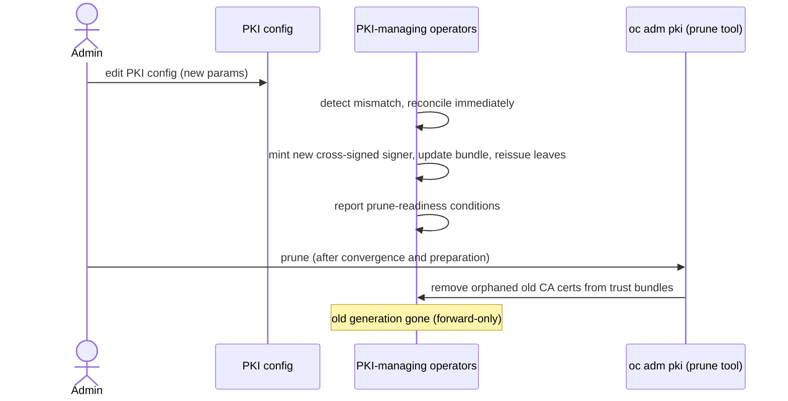

# Configurable PKI for OpenShift Internal Certificates

## Summary

This enhancement introduces the ability to configure cryptographic parameters (key algorithm, key size, and elliptic curves) for certificates and keys generated internally by OpenShift components. Currently, OpenShift uses hardcoded defaults (primarily RSA 2048-bit keys) for all internally generated certificates, with no mechanism for administrators to adjust these parameters to meet organizational security requirements or compliance mandates.

This proposal adds a new resource in the `config.openshift.io` API group:

- **PKI**: A cluster-level configuration resource that allows administrators to specify cryptographic parameters at multiple levels: global defaults and category overrides (explicit fields for signer, serving, and client certificates), plus a `keyManagement` section for in-scope non-certificate signing keys such as the bound service-account token signer.

OpenShift uses a flat PKI topology where signer certificates directly sign serving and client certificates, rather than a traditional hierarchical CA model.

## Motivation

Enterprise customers are increasingly required to meet stringent security compliance requirements that mandate specific cryptographic parameters for PKI infrastructure. Common requirements include:

- Larger RSA key sizes (3072-bit or 4096-bit) for long-lived certificates
- Use of elliptic curve cryptography (ECDSA) for better performance with equivalent security
- Consistent cryptographic parameters across the entire certificate hierarchy
- Ability to align with organizational PKI policies
- Readiness for post-quantum cryptography, so the platform can adopt quantum-resistant algorithms through the same configuration surface as standards and runtime support mature. Federal guidance (the executive-order direction for government systems to adopt post-quantum cryptography by the end of 2027) makes a clear migration path to PQC a near-term requirement, not a hypothetical one.

Currently, OpenShift provides no mechanism to configure these parameters for internally generated certificates, forcing customers to either accept the hardcoded defaults or seek exemptions from their security policies. This creates significant friction for adoption in regulated industries and government environments.

### User Stories

**Configuration**

* As a cluster administrator, I want to configure the key algorithm and parameters (RSA key size or ECDSA curve) used for internally generated certificates, so that my cluster's PKI meets my organization's compliance requirements.

* As a cluster administrator, I want to set cluster-wide defaults and override them per certificate category (signers, serving, clients) or for a specific named certificate, with the most-specific setting winning, so that I can apply stronger parameters to long-lived signers and accommodate a lagging component without weakening cluster-wide policy.

* As a component author, I want documented, stable override names for the certificates my operator manages, so that administrators can target them precisely.

**Install and upgrade safety**

* As a cluster administrator, I want to select a named PKI profile at install time that seeds my cluster's initial certificates, so that new clusters start out meeting my crypto policy without a post-install migration.

* As a cluster administrator, I want upgrades to leave my existing PKI configuration and certificates unchanged, so that upgrading never alters my cluster's cryptography without my involvement.

**Rotation and migration**

* As a cluster administrator, I want to apply a configuration change immediately on demand instead of waiting for natural certificate expiry, so that I can reach a known, converged state on my own schedule.

* As a cluster administrator, I want rotation to keep existing connections working while components adopt the new trust at their own pace, so that a migration does not require every consumer to reload or restart within a deadline.

* As a cluster administrator, I want to control when migrations happen and keep my break-glass credentials valid across them, so that I can transition smoothly without locking myself out.

**Signer retirement**

* As a cluster administrator, I want to retire superseded signer CAs on demand, so that old trust anchors are removed rather than lingering until their (up to 10-year) expiry.

**Observability**

* As a cluster administrator, I want PKI status to report configuration, migration, and retirement progress, so that I can tell whether a change is in progress, converged, failed, or unsafe.

Post-quantum migration to ML-DSA builds on this baseline and is covered by the separate layered ML-DSA / PQC enhancement. That enhancement, not this one, owns the ML-DSA mechanics, including: algorithm selection and additive adoption followed by a gated removal of classical algorithms; the larger ML-DSA key/signature sizes; the TLS 1.3 requirement; enabling the corresponding upstream Kubernetes ML-DSA feature gates; admission validation that webhook integrations present PQC-compliant CA bundles; and upgrade gating.

### Goals

- Provide a declarative API for configuring cryptographic parameters (algorithm, key size, curve) for OpenShift internal certificates
- Support configuration at different levels of granularity: global defaults, certificate category overrides (signer, serving, client), and overrides for specific named certificates (most-specific wins)
- Support RSA (with configurable key sizes: 2048-4096 in multiples of 1024) and ECDSA (with configurable curves: P-256, P-384, P-521) algorithms in the initial implementation
- Apply configuration to both Day-1 certificates (generated by openshift-installer) and Day-2 certificates (rotated by cluster operators)
- Provide a declarative way to configure the algorithm of in-scope platform signing keys that are not certificates, starting with the bound service-account token signing key (see [Key Management](#key-management-service-account-token-signing))
- Maintain backward compatibility: clusters upgraded without PKI configuration continue using existing defaults
- Ensure new certificates generated during rotation respect the PKI configuration
- Reissue non-conforming certificates immediately when the configuration changes (reconciliation), rather than waiting for natural expiry; certificates that already conform are left untouched

### Non-Goals

- Modifying certificate lifetimes or rotation schedules (this is handled by existing mechanisms)
- Supporting external CA integration or certificate injection (this is covered by existing user-provided certificate features such as cert-manager and custom CA bundles)
- Re-keying certificates that already conform to the configuration (reconciliation reissues only non-conforming certificates, immediately, when the configuration changes)
- Supporting algorithms beyond RSA and ECDSA in the initial implementation (e.g., Ed25519, RSA-PSS)
- Configuring signature algorithms separately from key algorithms (signature algorithm is derived from key type)
- Changing certificate subject names, SANs (Subject Alternative Names), or other X.509 extensions (only cryptographic parameters)
- Configuring the certificate issuance of layered products (OLM-installed operators that manage their own certificates); layered-product authors maintain their own certificate configuration, and OLM applies the cluster PKI configuration only to the certificates OLM itself manages
- Rotating external or third-party token issuers, and changing the OAuth server access-token keys, which are random 256-bit secrets rather than configurable signing algorithms

### Relationship to Existing Certificate Configuration Features

OpenShift provides several certificate-related configuration mechanisms. This enhancement affects OpenShift’s internal certificate generation, not user-provided certificates, trust anchors, TLS parameters, or external CA integration.

In scope are the platform-**generated** artifacts: serving certificates, client certificates, the platform-generated CA certificates that make up the cluster-wide trust stores, and the bound service-account token signing key (see [Key Management](#key-management-service-account-token-signing)). Any user-provided certificate or trust anchor always takes precedence and is out of scope (see below).

**Service-account token signing (in scope, via key management).** The API server signs bound service-account tokens with a bare signing key (managed by `BoundSATokenSignerController`, currently hardcoded RSA 2048) whose public half is published as raw JWKs at the OIDC JWKS endpoint. There is no X.509 certificate, so it falls outside `certificateManagement`; it is configured instead through the `keyManagement` section of the `PKI` resource (see [Key Management](#key-management-service-account-token-signing)).

#### User-Provided Certificates (Out of Scope)

**APIServer.spec.servingCerts**:
- Allows administrators to provide **custom serving certificates** for the API server
- Certificates are **externally generated** and **injected** into OpenShift
- This PKI enhancement does **not** affect user-provided certificates
- Relationship: **Complementary, with user-provided taking precedence** - administrators choose between:
  - Using this PKI API to configure how OpenShift **generates** its internal certificates, OR
  - Using APIServer.servingCerts to **provide** externally-generated certificates
- Precedence: a user-provided serving certificate is **always used when specified**; the PKI configuration governs only the endpoints where OpenShift still generates the certificate itself. The PKI API never overrides a user-supplied certificate.

**Custom CA Bundles** (e.g., APIServer.spec.clientCA, Proxy.spec.trustedCA):
- Allows injection of custom CA certificates for trust purposes
- Does not configure certificate generation
- This PKI enhancement does **not** affect custom CA bundles
- Relationship: **Independent** - custom CA bundles control trust, this API controls generation

**cert-manager and External CA Integration**:
- Tools like cert-manager can request certificates from external CAs
- Typically used for workload certificates, not platform infrastructure
- This PKI enhancement does **not** affect cert-manager workflows
- Relationship: **Independent** - different use cases (platform infrastructure vs. workload certificates)

#### TLS Security Profiles (Related but Distinct)

**TLSSecurityProfile**:
- Configures **cipher suites** and **TLS protocol versions**
- Applied to API server, ingress, and other TLS endpoints
- Does **not** configure certificate generation parameters
- This PKI enhancement does **not** modify TLS security profiles
- Relationship: **Complementary** - both work together:
  - TLSSecurityProfile: Controls **how TLS connections are negotiated** (protocol version, ciphers)
  - PKI API: Controls **how certificates are generated** (key algorithm, key size)
  - Example: Administrator can configure ECDSA P-384 certificates (PKI API) with TLS 1.3 and strong cipher suites (TLSSecurityProfile)

#### Summary Table

| Feature                        | Scope                    | What It Configures             | Relationship to PKI API                 |
|--------------------------------|--------------------------|--------------------------------|-----------------------------------------|
| **PKI API** (this enhancement) | Internal certificates    | Key algorithm, key size, curve | N/A (this proposal)                     |
| **APIServer.servingCerts**     | API server serving certs | User-provided certificates     | Complementary (choose one or the other) |
| **Custom CA Bundles**          | Trust anchors            | Trusted CA certificates        | Independent (different concern)         |
| **cert-manager**               | Workload certificates    | External CA integration        | Independent (different use case)        |
| **TLSSecurityProfile**         | TLS connections          | Cipher suites, TLS versions    | Complementary (both apply together)     |

## Proposal

This proposal introduces a new resource in the `config.openshift.io/v1alpha1` API group, along with a `ConfigurablePKI` feature gate to control the rollout:

- **PKI**: A cluster-scoped singleton configuration resource that allows administrators to specify cryptographic parameters for internal certificates organized by defaults, category overrides (explicit fields for signer, serving, and client certificates), and overrides for specific named certificates.

**Note:** During development, the API will start as `v1alpha1` with TechPreviewNoUpgrade feature gate enablement. The API will be promoted to `v1` and the feature gate will be enabled by default before the target OpenShift release, shipping as GA.

**Note:** Named certificate overrides (targeting individual certificates by name) are supported in the initial release. Because certificates can be installed dynamically (for example, by OLM operators), a static registry of valid names is not possible, so override names are validated for format only. Selector-based matching (label selectors or regular expressions) is deferred to a future release.

At a high level, the changes include:

1. **New API Resource**:
   - `PKI` configuration resource in `config.openshift.io/v1alpha1` (cluster-scoped singleton)
2. **Feature Gate**: `ConfigurablePKI` to enable the functionality (TechPreviewNoUpgrade during development, enabled by default at GA)
3. **Installer Integration**: Day-1 configuration via a named `pki.profile` that seeds the initial PKI resource
4. **Operator Updates**: Modifications to PKI-managing operators to:
   - Watch and consume the PKI configuration independently
5. **Certificate Rotation**: Operators reissue non-conforming certificates immediately when the configuration changes (reconciliation), reusing the existing rotation primitives (no new rotation mechanism)

Note: There is **no central PKI controller**. A **PKI-managing operator** (the term used throughout this document) is any operator that watches the PKI resource and applies the resolved configuration to the certificates (and, where in scope, the signing keys) it owns. Each PKI-managing operator reconciles its own material directly; there is no component that orchestrates, aggregates, or gates on its behalf.

### Workflow Description

**cluster administrator** is a human user responsible for configuring and managing the OpenShift cluster.

#### Initial Cluster Installation (Day-1)

1. The cluster administrator prepares an install-config.yaml that selects a PKI profile:

```yaml
apiVersion: v1
baseDomain: example.com
metadata:
  name: my-cluster
platform:
  aws:
    region: us-east-1
# New PKI configuration section
pki:
  profile: Default
```

2. The openshift-installer resolves the selected profile and generates the cluster, creating signer certificates using the profile's cryptographic parameters (the `Default` profile uses ECDSA P-384 signer keys).

3. All other certificates (serving certificates, client certificates), including the short-lived bootstrap certificates that live only ~24 hours, are generated at installation time using the profile's parameters. There is no window in which Day-1 certificates use non-profile parameters.

4. The installer creates the initial `PKI` custom resource in the cluster reflecting the Day-1 configuration.

#### Post-Installation Configuration (Day-2)

1. The cluster administrator wants to configure ECDSA P-384 for all serving certificates to comply with their company policy:

```bash
oc edit pki cluster
```

2. The administrator modifies the PKI resource:

```yaml
apiVersion: config.openshift.io/v1alpha1
kind: PKI
metadata:
  name: cluster
spec:
  certificateManagement:
    # Global default for all certificates (key is required in defaults)
    defaults:
      key:
        algorithm: ECDSA
        ecdsa:
          curve: P256

    # Category-level overrides (optional, explicit fields)
    signerCertificates:
      key:
        algorithm: ECDSA
        ecdsa:
          curve: P384

    servingCertificates:
      key:
        algorithm: ECDSA
        ecdsa:
          curve: P384

    clientCertificates:
      key:
        algorithm: ECDSA
        ecdsa:
          curve: P256
```

3. Operators detect that existing certificates no longer match the configuration and reconcile **immediately**, generating new certificates using the configured parameters. Cross-signing (see [Cross-Signing to Ease Rotation](#cross-signing-to-ease-rotation)) keeps existing clients working during the change.

#### Applying Configuration and Retiring Old Signers

When an administrator changes the `PKI` configuration, operators reconcile it **immediately**: certificates that no longer match the configuration are reissued, without waiting for natural expiry. Cross-signing (see [Cross-Signing to Ease Rotation](#cross-signing-to-ease-rotation)) keeps existing clients working during the change, so there is no need to confirm cluster-wide trust-bundle propagation before new serving or client certificates are issued.

In the normal case nothing further is needed: the superseded signer CAs are left in place and age out on their own, per their X.509 validity. Explicitly retiring (pruning) a superseded signer is an exception, used only when an administrator does not want a still-valid old signer to remain trusted, for example to complete an algorithm migration by disabling the old algorithm before its signers would otherwise expire. That prune is a separate, deliberate, forward-only step (there is no rollback once an old signing key is removed): the administrator prepares the cluster first (confirming rotation has converged and that off-cluster consumers and break-glass credentials are ready), then prunes. See [Rotation and Signer Retirement](#rotation-and-signer-retirement) for details.

#### End-to-end rollout walkthrough

This walks a single algorithm migration from a configuration change through optional signer retirement, to make the sequence and its gates explicit.

1. **Configuration change.** The administrator edits the `PKI` resource (for example, RSA to ECDSA). Changing the configuration is the trigger; there is no separate apply step.
2. **Immediate reconciliation.** Each PKI-managing operator detects the mismatch and reconciles immediately. For each affected signer it mints a new signer with the same subject and ships a forward cross-signing certificate (old signs new) with the new leaves, so consumers that still trust only the old CA keep validating. A routine same-strength rotation would also add a backward cross-signing certificate to the trust bundle; a strength-increasing migration (like this RSA-to-ECDSA example) does not (see Cross-Signing to Ease Rotation).
3. **Trust distribution.** Updated trust bundles propagate. Because of cross-signing, new-signer leaves already validate against still-old trust, so leaves can be reissued without waiting for every consumer to observe the new bundle.
4. **Leaf reissue.** Non-conforming serving and client certificates are reissued under the new configuration; conforming certificates are left untouched.
5. **Convergence and readiness.** The cluster converges when every consumer trusts the new anchors directly and every presenter has rotated to a new-signer leaf. Each operator reports prune-readiness through status conditions.
6. **Optional prune.** Once converged and the administrator has prepared off-cluster consumers and break-glass credentials, the out-of-band prune tooling removes the now-orphaned old signer CA certs from the trust bundles, which also drops any cross-signing certificates that depend on them. This step is forward-only.
7. **Optional further rotation.** A later configuration change repeats the sequence; a post-quantum migration is the same reissue-then-prune sequence, with ML-DSA specifics owned by the separate layered enhancement.

The rotation-then-prune sequence:



Each signer independently walks from the old generation to evicted:

```mermaid
stateDiagram-v2
  direction LR
  [*] --> OldGen: conforming to prior policy
  OldGen --> NewGen: config mismatch, reconcile and cross-sign
  NewGen --> Distributed: new CA in all bundles, consumers rolled
  Distributed --> LeavesRotated: all presenters on new leaf
  LeavesRotated --> Converged: readiness conditions satisfied
  Converged --> Evicted: deliberate out-of-band prune
  Evicted --> [*]: old generation gone
```




#### Upgrade Scenario

1. A cluster running OpenShift M.N is upgraded to M.N+1 which includes this feature.

2. The upgrade installs the PKI CRD and creates the `cluster` PKI resource populated with a `Legacy` configuration that reproduces the existing hardcoded defaults exactly, so there is no rollout and no behavior change on upgrade.

3. To adopt a stronger configuration, the cluster administrator edits the PKI resource post-upgrade, which operators reconcile and apply immediately. On new installs, the installer populates the resource from the selected profile, and the installer-provided configuration takes precedence over the default the cluster ships.

4. To revert to the pre-feature defaults, the administrator restores the equivalent configuration from backup or documentation. Profiles such as `Legacy` are an install-time convenience and are not a Day-2 API value. The parameters that define the `Legacy` profile are documented under [Day-1 (Installer) Integration](#day-1-installer-integration), so the administrator knows precisely what to restore.

### API Extensions

This enhancement adds a new Custom Resource Definition (CRD) to the OpenShift API:

- **PKI**: Cluster-scoped singleton for configuring certificate cryptographic parameters

#### Compatibility Level

The PKI API will be developed initially at **Compatibility Level 4** (TechPreviewNoUpgrade) and graduate to **Compatibility Level 1** (GA) before the target OpenShift release.

- **Development phase (v1alpha1, Level 4):**
  - No compatibility guarantees during development
  - API can change at any point for any reason
  - Breaking changes are allowed without migration path
  - Suitable for iterative development and testing
  - Gated by ConfigurablePKI feature gate with TechPreviewNoUpgrade enablement

- **Release phase (v1, Level 1):**
  - Shipped as GA in target OpenShift release
  - Breaking changes no longer allowed
  - API stable within major release for 12 months or 3 minor releases
  - Full backward compatibility guarantees

- **Graduation timeline:**
  - v1alpha1 at Level 4: Early development (feature gate: TechPreviewNoUpgrade)
  - v1 at Level 1: Target OpenShift release (feature gate: enabled by default)
  - No intermediate v1beta1 or TechPreview release planned

The compatibility level is enforced through the `+openshift:compatibility-gen:level` annotation and will be validated by the API review process. The annotation will change from `level=4` to `level=1` when the API is promoted to v1.

#### PKI Resource

The `PKI` resource is a cluster-scoped singleton named `cluster` in the `config.openshift.io/v1alpha1` API group. It is a required, always-present singleton: the installer creates it on new installs and the upgrade creates it with a `Legacy` configuration, and it cannot be deleted (deletion is rejected). Administrators change PKI behavior by editing it, never by creating or removing it.

The full API type definitions are available in the API PR: [openshift/api#2645](https://github.com/openshift/api/pull/2645).

Key aspects of the API:

- **`PKISpec`** contains a `certificateManagement` object holding the cryptographic configuration directly: a required `defaults`, optional category overrides (`signerCertificates`, `servingCertificates`, `clientCertificates`), and optional overrides for specific named certificates. The most-specific setting wins (named override, then category, then defaults). (Earlier drafts wrapped these in a management-`mode` discriminated union and a `custom` container; those are removed. The fields are flattened up one level, and the removed v1alpha1 fields are tombstoned in the API types.)
- **`KeyConfig`** is a discriminated union on `algorithm` (`RSA` or `ECDSA`), with `RSAKeyConfig` (key sizes 2048-4096) and `ECDSAKeyConfig` (curves P256, P384, P521) as union member types.
- **`KeyManagement`** is a sibling of `certificateManagement` that configures in-scope non-certificate signing keys as named, opt-in entries with no inherited default; the bound service-account token signer is the first entry (see [Key Management](#key-management-service-account-token-signing)).
- **Rotation is immediate and signer retirement is a deliberate administrator action**, not fields on the `PKI` resource: operators reconcile configuration changes immediately, and superseded signer CAs are pruned as the final step of an algorithm migration. See [Rotation and Signer Retirement](#rotation-and-signer-retirement).

An illustrative example of the full API surface as an administrator would see it (the API PR is authoritative for exact field names, defaults, and validation):

```yaml
apiVersion: config.openshift.io/v1alpha1
kind: PKI
metadata:
  name: cluster
spec:
  # Certificate cryptographic parameters, resolved most-specific-wins:
  # named certificate, then category, then defaults.
  certificateManagement:
    # Required. Global default for every certificate without a more-specific setting.
    defaults:
      key:
        algorithm: ECDSA
        ecdsa:
          curve: P384
    # Optional per-category overrides.
    signerCertificates:
      key:
        algorithm: ECDSA
        ecdsa:
          curve: P384
    servingCertificates:
      key:
        algorithm: ECDSA
        ecdsa:
          curve: P256
    clientCertificates:
      key:
        algorithm: ECDSA
        ecdsa:
          curve: P256
    # Optional. Overrides for specific named certificates (highest precedence).
    # Modeled as a list keyed by name (+listType=map / +listMapKey=name), so names are unique.
    namedCertificates:
      - name: openshift.io/service-ca.service-serving-signer
        key:
          algorithm: RSA
          rsa:
            keySize: 2048
  # Non-certificate signing keys: named, opt-in, with no inherited default, in the
  # same named-list style as namedCertificates. The bound service-account token signer
  # is the first entry. (Exact field names are defined by the API PR.)
  keyManagement:
    namedKeys:
      - name: openshift.io/kube-apiserver.bound-service-account-token-signer
        key:
          algorithm: RSA
          rsa:
            keySize: 4096
```

Peer certificates are intentionally absent from the surface: their parameters are derived (see [Peer Certificates](#peer-certificates-category-peer)), not set directly.

#### Platform Default Profile

On upgrade the resource is created with a `Legacy` configuration that reproduces the existing hardcoded defaults (mostly RSA 2048, though a small number of leaf certificates already use ECDSA P-256 today: kubelet client/serving certs generated via the Kubernetes CSR mechanism, and OLM-managed certs), so existing clusters see zero behavior change.

The platform default profile, used by the installer `Default` profile and recommended for new configurations, specifies:

  | Certificate Category | Algorithm | Params | Security Strength |
  |----------------------|-----------|--------|-------------------|
  | Signer (CA)          | ECDSA     | P-384  | 192-bit           |
  | Serving              | ECDSA     | P-256  | 128-bit           |
  | Client               | ECDSA     | P-256  | 128-bit           |
  | Peer                 | ECDSA     | P-256  | 128-bit           |

**Peer is derived, not a settable category.** Peer certificates (dual client+server auth) have no category override field; their parameters are derived as the stronger of the resolved serving and client configurations (see [Peer Certificates](#peer-certificates-category-peer)). The Peer row above shows the value that derivation yields under this profile, where serving and client are both ECDSA P-256.

This profile provides stronger security than the legacy RSA 2048 defaults (112-bit security) while improving performance (see [Performance Considerations](#performance-considerations)). It is also consistent with the ECDSA P-256 keys that the kubelet already generates via the CSR mechanism today.

Administrators may override any of these by setting `defaults` and the category fields (`signerCertificates`, `servingCertificates`, `clientCertificates`) on the `PKI` resource.

#### Key Management (service-account token signing)

Some platform-generated signing material is not an X.509 certificate and so falls outside `certificateManagement`, yet it raises the same crypto-agility concerns (algorithm choice, rotation with verification overlap, and an eventual post-quantum migration). The in-scope example is the bound service-account token signing key: the kube-apiserver signs bound service-account tokens with a bare signing key (currently a hardcoded RSA 2048 keypair) whose public half is published as raw JWKs at the OIDC JWKS endpoint. There is no certificate involved.

These keys are configured through a `keyManagement` section of the `PKI` resource, a sibling to `certificateManagement`. Because such keys are few, heterogeneous, and each has distinct off-cluster verifier constraints, `keyManagement` uses named, opt-in entries with no inherited default, in the same named-list style as certificate named overrides: changing one of these algorithms is an explicit administrator action, never a side effect of a cluster-wide certificate default. The bound service-account token signer is the first in-scope entry.

Out of scope for this workstream: the OAuth server access-token keys are random 256-bit secrets rather than asymmetric signing keys, so they need no algorithm configuration and are unchanged. Rotation of external or third-party token issuers is also out of scope. Which in-cluster issuers actually sign JWKS-published JWTs, and are therefore in scope, is still being confirmed against the implementation (see [Open Questions](#open-questions)).

#### Rotation and Signer Retirement

Changing the PKI configuration normally involves a single operation, **rotation**; the superseded signer CAs are then left to **expire on their own** per their X.509 validity. A second operation, **pruning**, is optional and used only to retire a still-valid superseded signer early, for example to finish an algorithm migration by disabling the old algorithm before its signers would otherwise expire. Both operations are **cluster-wide** (never per-certificate or per-signer):

- **Rotation** (always) reissues certificates under the new configuration.
- **Pruning** (migration only) removes a still-valid superseded signer CA from trust before it would expire.

##### Immediate reconciliation (rotation)

When an administrator changes the `PKI` configuration, the PKI-managing operators reconcile **immediately** on detecting that existing certificates no longer match the configuration, rather than waiting for the next natural rotation cycle. This matches standard OpenShift config-API behavior. Cross-signing (see [Cross-Signing to Ease Rotation](#cross-signing-to-ease-rotation)) keeps existing clients working throughout, so applying a change immediately does not break in-flight connections. An unconfigured cluster keeps its hardcoded defaults until an administrator sets explicit configuration.

There is no separate "apply now" trigger: applying is simply the effect of changing the configuration. This is consistent with the model in which each operator watches the `PKI` resource and reconciles its own certificates, with no central PKI controller.

##### Pruning superseded signers

Because OpenShift has no certificate-revocation primitive, a signer CA leaves a trust bundle only when it is pruned or expires; pruning is therefore **forward-only** (there is no rollback once an old signing key is removed). Once rotation has moved every consumer to the new signer, the superseded signer's CA cert is an orphan (no controller re-sources it into the trust bundles), so the prune can remove it directly from the trust-bundle config maps and the removal sticks. No new library-go revocation primitive is required; pruning is performed out-of-band from the PKI-managing operators rather than through a change to the rotation controllers' API.

Pruning is a **deliberate, one-off administrator action**, performed as the last step of migrating from one algorithm to another while disabling the old one. It is **not** an automated controller behavior and is **not** arbitrated by a central PKI controller (there is none): the prune runs out-of-band from the PKI-managing operators, as a deliberate tool-driven step (for example, an `oc adm` subcommand) that removes the superseded signers' now-orphaned CA certs directly from the managed trust bundles once the cluster has converged.

Before pruning, the administrator prepares the cluster following documented guidance: confirm rotation has converged, confirm every operator has distributed the new signers into its trust stores, rotate break-glass credentials, and update off-cluster consumers (kubeconfigs, external mTLS clients, external trust stores) that the cluster cannot observe. The prune tooling may perform minimal sanity checks to reduce the chance of removing a still-needed CA, but the administrator remains responsible for the readiness of consumers outside the cluster's visibility.

**Readiness conditions (phased).** Rather than an opaque attestation, each PKI-managing operator reports its prune-readiness through status conditions describing observable facts, for example that its latest CA bundle has been distributed and loaded by its consumers, and that its latest leaf certificates have been distributed and loaded. These conditions let the administrator (and, over time, the tooling) tell when it is safe to drop a superseded signer. This starts deliberately minimal: the initial design may report few or no automatic conditions and lean on administrator preparation and judgment, and grow the set of automatically-reported conditions as the technical design matures and we learn which facts can be observed reliably in-cluster. Today, library-go's certificate rotation reports only a single aggregate `CertRotation_<controller>_Degraded` condition per controller, and the signer, CA-bundle, and target sub-controllers set no conditions of their own, so these finer-grained, per-signer prune-readiness conditions are additive work on top of the existing mechanism.

**Serving vs. client signers.** The two directions differ in what "safe to prune" requires:

- **Serving-CA signers**: once the superseded serving CA has left the trust bundles (all consumers trust the new CA and are served chains that validate), the platform's responsibility ends and the signer can be pruned. A subsequent client-side rotation, so clients no longer trust the old CA, is the administrator's follow-up.
- **Client-CA (signer) signers**: dropping a superseded client signer additionally requires explicit administrator acknowledgement that **break-glass client certificates and critical-path clients have rotated** to the new signer. Because the cluster cannot observe every holder of a client certificate (notably off-cluster break-glass kubeconfigs), this ACK keeps a human in the loop before the old client trust anchor is removed.

The exact prune interface is still being designed (it may be an `oc adm` subcommand, for example `oc adm pki prune-superseded-signers`, or a documented procedure). Whatever its form, it is cluster-wide and removes the signer generations that no longer match the resolved PKI configuration.

##### Scope and continuity

- **Cluster-wide only.** Rotation and pruning operate across the cluster, not on individual certificates or signer lineages.
- **Cross-signing continuity.** Immediate rotation is safe because the new signer cross-signs the old signer's key, so both old and new trust validate during the transition (see [Cross-Signing to Ease Rotation](#cross-signing-to-ease-rotation)).
- **Migration shape.** A configuration change (applied immediately) followed by a prune brackets a full algorithm migration: reissue under the new algorithm, then disable the old one by pruning its signers.

##### Scenarios

**Algorithm migration.** The administrator changes the `PKI` configuration (for example, RSA to ECDSA). Operators reconcile immediately, reissuing certificates under the new algorithm while cross-signing keeps existing clients working. Once the cluster has converged and the administrator has prepared it as described above, the administrator prunes the superseded signers to disable the old algorithm. This reissue-then-prune sequence is the full migration.

**Post-quantum migration.** Disabling classical algorithms after a PQC migration is the same reissue-then-prune sequence, applied as the deliberate final step of that migration. The ML-DSA specifics are covered by the separate layered ML-DSA / PQC enhancement.

##### Shelved

**Forced rotation** (reissuing certificates without a configuration change, such as for key-compromise recovery or same-config re-issue) is out of scope for the initial migration-focused design. It may be added later as an additive feature; it would reintroduce signer-scoped targeting, which the current cluster-wide design deliberately omits.


### Topology Considerations

#### Hypershift / Hosted Control Planes

For Hypershift deployments, a hosted cluster's control plane runs as pods on a management cluster. The PKI configuration for a hosted cluster is defined per hosted cluster: a hosted cluster configures its own PKI, covering both its hosted control plane and its guest data plane. The management cluster's PKI configuration has no bearing on hosted clusters. This keeps multi-tenancy clean and does not assume the management cluster is itself an OpenShift cluster or that it exposes a PKI resource. (Guest-cluster *data-plane* certificates such as kubelet and in-cluster operator certificates are governed by the hosted cluster's own configuration, as for any standalone cluster.)

The likely shape is a new field on the `HostedCluster` and `HostedControlPlane` APIs that mirrors the standalone `PKI` resource's configuration, with the configured parameters applied to both the hosted control plane and the guest data plane. The precise component-by-component topology (which certificates are governed where) is to be worked out with HyperShift SMEs, and a Hypershift-team feedback session is planned. A rejected alternative, a management-cluster floor that hosted clusters inherit, is recorded in [Alternative 7](#alternative-7-management-floor-plus-hostedcluster-override-for-hypershift).

An open sub-question is whether the **break-glass customer and SRE admin certificates** generated for a hosted cluster follow the hosted cluster's PKI configuration or are configured independently.

#### Standalone Clusters

This enhancement is fully applicable and relevant for standalone clusters. All internally generated certificates will respect the PKI configuration.

#### Single-node Deployments or MicroShift

**Single-Node OpenShift (SNO):**
- Supported with the same API and behavior as multi-node clusters.
- SNO is more sensitive to the disruption a reconfiguration can cause. It has no redundant control-plane instance to absorb a failed rollout, it has less resource headroom, and it is more sensitive to restarts, so a configuration change that triggers broad reissue and reloads has a larger relative impact than on a multi-node cluster.
- Key-generation cost matters more here, so ECDSA is preferred for frequently rotated certificates to keep generation and handshake overhead low (see [Performance Considerations](#performance-considerations)).
- SNO-specific testing is required to characterize the disruption of a reconfiguration and to confirm the cluster converges without manual intervention (see [Test Plan](#test-plan)).

**MicroShift:**
- Out of scope. MicroShift does not use the OpenShift operators or the `config.openshift.io` PKI resource, so this enhancement does not apply to it.

#### OpenShift Kubernetes Engine

This enhancement is fully compatible with OpenShift Kubernetes Engine (OKE). The PKI configuration resource controls cryptographic parameters for internally generated certificates, which is a core platform capability available in both OCP and OKE. It does not depend on any features excluded from the OKE product offering.

### Implementation Details/Notes/Constraints

#### Certificate Category Classification

OpenShift's internal PKI uses a **flat topology** rather than a traditional hierarchical CA model. Certificates are classified into three configurable categories based on their purpose and lifecycle. (A fourth grouping, *peer* certificates, is not separately configurable: its parameters are derived; see [Peer Certificates](#peer-certificates-category-peer).)

1. **Signer Certificates** (`Signer`): CA certificates that directly sign either serving or client certificates
   - Examples: `etcd-signer`, `kube-apiserver-to-kubelet-signer`, `service-ca`, `kubelet-bootstrap-kubeconfig-signer`, `admin-kubeconfig-signer`
   - Typical lifetime: **Varies by purpose**
     - **10 years**: Signers for bootstrapping new nodes and disaster recovery (e.g., `kubelet-bootstrap-kubeconfig-signer`, `admin-kubeconfig-signer`, `kube-apiserver-localhost-signer`, `kube-apiserver-service-network-signer`, `kube-apiserver-lb-signer`)
     - **1 year**: Control plane signers that are rotated by operators (e.g., `kube-apiserver-to-kubelet-signer`, `kube-control-plane-signer`)
     - **1 day**: Short-lived signers for frequently rotated certificates (e.g., `aggregator-signer`, `kubelet-signer`)
   - Generated: Mix of Day-1 (installer) and Day-2 (operators)
   - Purpose: Each signer is responsible for a specific trust domain (e.g., etcd peer communication, kubelet authentication)
   - Distribution: Signers are distributed to various CA bundles throughout the cluster based on expected trust relationships between components
   - Note: These are not "root CAs" in the traditional sense as they don't form a hierarchical chain; each signer directly signs leaf certificates

2. **Serving Certificates** (`Serving`): TLS serving certificates for cluster components
   - Examples: kube-apiserver serving cert, etcd serving certs, service serving certs
   - Typical lifetime: 30-365 days
   - Generated: Mostly Day-2, rotated frequently
   - Signed by: A signer certificate in the `Signer` category
   - Purpose: Present a server identity during TLS handshakes

3. **Client Certificates** (`Client`): Client authentication certificates
   - Examples: kubelet client certs, controller client certs, service account client certs
   - Typical lifetime: 1-30 days
   - Generated: Mostly Day-2, rotated very frequently
   - Signed by: A signer certificate in the `Signer` category
   - Purpose: Authenticate clients to servers

#### Certificate Rotation and Cross-Signing

OpenShift manages certificate rotation through a combination of operator-driven processes and the cluster's internal PKI infrastructure:

- **Signer rotation**: When a signer is rotated, cross-signing certificates maintain trust during the transition. A **forward cross-signing certificate** (the old signer signs the new signer) is always created and shipped with new-signer leaves, so consumers that still trust only the old CA accept new-signer leaves. A **backward cross-signing certificate** (the new signer signs the old signer) is created only for routine rotations that do not increase security strength, and is omitted for strength-increasing migrations (see [Cross-Signing to Ease Rotation](#cross-signing-to-ease-rotation)).

- **CA bundle management**: The cluster automatically manages CA bundles (collections of trusted signer certificates) and updates them when signers are rotated. Components watch these bundles and reload them to maintain trust relationships.

- **Leaf certificate rotation**: Serving and client certificates are rotated according to their configured lifetimes. During rotation, new certificates are signed by the current signer, and the system coordinates updates to ensure zero downtime.

#### Cross-Signing to Ease Rotation

As part of this feature we adopt **cross-signed certificates** to make signer (CA) rotation safe, and to replace the fragile *time-based checkpoints* the platform relies on today. The `service-ca-operator` already uses this technique for its serving certificates; this feature extends the same idea to the rest of the internal PKI.

##### The problem

When we replace a signing CA, two things must happen across the cluster: every component must (1) start **trusting** certificates from the new CA, and (2) eventually **present** certificates issued by the new CA. Components do not all update at the same instant: some reload their trust store seconds after rotation, and some not until they restart hours later. During that gap, a client that only trusts the *old* CA can be handed a certificate signed by the *new* CA (or vice-versa) and reject the connection.

##### How we solve it today: time-based checkpoints

The current rotation machinery (library-go `certrotation`) manages that gap with **timing**:

- Both the old and new CA are kept in a **union trust bundle**, and the bundle is distributed *before* any certificate from the new signer is issued (bundle-first ordering).
- A new leaf certificate is not allowed to move to the new signer until the signer has **aged ~10%** of its lifetime, giving consumers time to pick up the new bundle.
- The system leans on the certificate **validity overlap** and on components **restarting** (reloading the bundle) to close the window in time.

Nothing hard-enforces that every consumer has actually ingested the new bundle before a new-signer leaf is presented: the only backstops are the signer's ~10% minimum age, the certificate validity overlap, and the expectation ("hope") that consumers reload in time. This works, but it is a race against a clock: a component that is slow to reload, or cannot hot-reload at all, can miss the window and break. It also couples leaf rotation to an arbitrary delay.

##### How cross-signing works: forward and, conditionally, backward cross-signing certificates

When a signer rotates, the new CA keeps the **same identity (subject)** as the old one, and up to two cross-signing certificates are minted:

- **Forward cross-signing certificate** (the old CA signs the new CA, so the old CA vouches for the new CA). **Always minted**, and shipped alongside every new-signer leaf, so a consumer that still trusts only the old CA validates a new-signer leaf via `leaf -> new CA -> forward cross-signing certificate -> old CA`.
- **Backward cross-signing certificate** (the new CA signs the old CA, so the new CA vouches for the old CA). Placed in the trust bundle, so a consumer that already has the new CA validates a not-yet-rotated old-signer leaf via `new CA -> backward cross-signing certificate -> old CA`. This is what `service-ca-operator` does today. It is minted **only for routine rotations**, per the rule below.

**Routine rotation versus strength-increasing migration.** The backward certificate makes the new CA vouch for the old CA, which caps a new-anchor consumer's effective security at the old anchor's. That is only harmful when the new signer is **stronger** than the old. The platform therefore compares the new and old signers' NIST security strength (the bits used for peer derivation; see [Peer Certificates](#peer-certificates-category-peer)), treating a quantum-resistant (ML-DSA) signer as strictly stronger than any classical signer because against a cryptographically-relevant quantum computer a classical signer's effective strength is 0:

- **New no stronger than old (routine rotation): mint both certificates.** When the new signer's strength is equal to or lower than the old signer's (most commonly a periodic refresh with the same algorithm and parameters), there is no asymmetry, so the backward certificate does not lower the security bar and is minted for smooth overlap. Using the backward certificate (rather than simply retaining the old self-signed CA as a co-root) re-anchors the old signer under the new CA with its own controlled validity, which guarantees a minimum trust-overlap window for not-yet-rotated old-signer leaves even when the old CA has little of its own lifetime left; retaining the old root would cap that overlap at the old CA's remaining validity. This is the behavior `service-ca-operator` implements today. An attacker gains nothing by targeting the old signer instead of the new one, because both require breaking the same strength. The one residual exception, compromise of the old signer's private key, is not a routine rotation; it is handled by the deliberate prune that removes the old signer from trust (see [Rotation and Signer Retirement](#rotation-and-signer-retirement)), not by cross-signing.
- **New stronger than old (strength-increasing migration): forward only.** A larger RSA key, a stronger ECDSA curve, or a classical-to-post-quantum move omits the backward certificate. Post-rotation consumers validate not-yet-rotated old-signer leaves via the **old CA retained as a co-anchor in the union trust bundle** until it is pruned or expires, not via a new-vouches-for-old certificate, and the migration is completed by the deliberate prune that drops the old anchor. Any classical-to-ML-DSA rotation is therefore always forward-only. (ML-DSA specifics are owned by the layered ML-DSA / PQC enhancement.)

In all cases new-signer leaves validate old-to-new via the forward certificate, so **trust is continuous from the moment of rotation**, with no clock involved.

##### Why it helps: walking through the scenarios

The key move: a server (or client) always presents a chain that ends at a CA the other side *already* trusts.

| Situation | What is presented | How it validates |
|---|---|---|
| An **un-updated** consumer (trusts only the old CA) is handed a **new-signer** leaf | leaf + forward cross-signing certificate | chain ends at the **old** CA it still trusts, accepted immediately, no reload |
| An **updated** consumer is handed a not-yet-rotated **old-signer** leaf, **routine rotation** | leaf | validated via the backward cross-signing certificate in its bundle, ending at the **new** CA, accepted |
| An **updated** consumer is handed a not-yet-rotated **old-signer** leaf, **strength-increasing migration** | leaf | validated via the **old CA retained in its union bundle** (no backward certificate), accepted |
| **mTLS / client direction**: a client on a new client-CA connects to a server that still trusts only the old client-CA | client leaf + forward cross-signing certificate | server validates the chain back to the **old** client-CA, accepted |

In every case the connection succeeds *without waiting* for the peer to reload anything, provided the peer can verify the leaf's key algorithm (a cross-signing certificate supplies a trust path, not algorithm support; see Costs and constraints).

##### Improving the time-based checkpoints

With cross-signing in place, the timing gates become unnecessary or soften into eventual consistency:

- The **~10% signer-age delay** before leaves may use the new signer is **removed**. Leaves can re-issue immediately or lazily, in any order, because both old- and new-issued leaves are trusted throughout.
- Bundle reload changes from a **deadline** into **eventual consistency**: an un-updated consumer still validates via the forward cross-signing certificate served with the leaf; it only needs to reload eventually, to drop the *expired* old root. No component has to be restarted to stay connected.
- The **union bundle** idea is kept, augmented with the forward cross-signing certificate (and, for routine rotations, the backward cross-signing certificate).

This is what makes immediate reconciliation safe: because trust is continuous from t=0, there is no need to first confirm that the new trust bundle has propagated everywhere before issuing new certificates.

##### Costs and constraints (so readers know the trade-offs)

- The **old signer's key is used once** at rotation time to sign the forward cross-signing certificate (and, for routine rotations, the new signer's key signs the backward one). The prior signer secret still exists, so the key is available.
- **Every endpoint must materialize its full chain in the served Secret** (leaf + forward cross-signing certificate), not a bare leaf. Go serves and validates whatever chain the Secret contains, but it will not synthesize a cross-signing certificate from a trust pool, so PKI-managing operators must write the full chain into the Secret. Standard Go TLS clients then validate automatically; the audit burden is non-Go proxies, CA-pinning consumers, and code that reads only the first certificate. Test both Go and non-Go consumers.
- A cross-signing certificate provides a **trust path, not algorithm support**: a consumer that cannot negotiate or verify the new key algorithm still rejects the leaf even when the chain reaches a trusted CA. Immediate reissue to a new algorithm therefore requires algorithm-compatible consumers (or a named override to hold a laggard), exactly as for the service-CA signer.
- Continuity for an old-anchor consumer is **bounded by the old CA's validity**: the forward cross-signing certificate's chain ends at the old CA, so once it expires or is pruned that path fails. Consumers must adopt the new trust anchor before then. Cross-signing certificates are **short-lived** (not matched to the signer's full lifetime), so they are not a long-term dependency.
- Each active CA generation adds **one or two small cross-signing certificates** (they expire or prune out). This removes the *time pressure* to rotate/reload quickly, but by itself does **not** fix trust-bundle overflow from rapid regeneration; that root cause still needs its own guard.

#### Configuration Resolution Order

When generating a certificate, the cryptographic parameters are determined by the following precedence (highest to lowest):

1. **Named Override**: If an override targets the specific certificate by name, use those parameters
2. **Category Override**: If the corresponding category field (`signerCertificates`, `servingCertificates`, or `clientCertificates`) is set, use those parameters
3. **Default Configuration**: Use the `defaults` configuration
4. **Hardcoded Defaults**: the operator's built-in defaults, a last-resort fallback used only if the PKI resource cannot be read. The resource is a required, always-present singleton with a required `defaults`, so normal resolution terminates at `defaults`.

Peer certificates (dual client/server authentication) have no category override field of their own. Absent a named override, their parameters are **derived** as the stronger (by NIST security strength) of the resolved serving and client configurations, with ECDSA preferred on ties; a named override that targets a peer certificate by name still takes precedence over the derived value (see [Peer Certificates](#peer-certificates-category-peer)).

#### Day-1 (Installer) Integration

The installer surface is intentionally minimal: `install-config.yaml` takes only a named `pki.profile`.

```yaml
# install-config.yaml
apiVersion: v1
metadata:
  name: my-cluster
# ... other configuration ...
pki:
  profile: Default
```

A profile is an **installer-only, version-defined** bundle of cryptographic settings. At install time the installer resolves the named profile and writes the resolved values into the initial `PKI` resource; the profile name itself does not persist in the API.

A profile is a bundle of **category defaults** (signers are configured stronger and longer-lived than leaves), not a single key size. Named profiles come in three kinds:

- **Opinionated algorithm profiles** bake a sensible signer-stronger-than-leaf split for an algorithm family. Their resolved parameters may be refined across installer versions (new installs only; existing clusters are never changed on upgrade):
  - `Default` / `ECDSA` - ECDSA P-384 signers, P-256 serving/client (the platform default profile above)
  - `RSA` - RSA 4096 signers, RSA 2048 serving/client
  - `PostQuantum` / `MLDSA` - **name reserved here; parameters delivered by the layered ML-DSA / PQC enhancement** once ML-DSA algorithm support (and the required Go runtime support) lands. The name is reserved now so there is a stable, documented install-time intent for the post-quantum migration driven by the end-of-2027 federal guidance; selecting it before the layered enhancement ships is rejected by the installer.
- **Explicit all-uniform pins** apply one concrete parameter set to every category and are **not** redefined across installer versions, for compliance regimes that must pin exact parameters:
  - e.g. `RSA4096All`, `ECDSAP384All`, `RSA2048All` (`RSA2048All` pins uniform RSA 2048 for every category)
- **`Legacy`** is a special profile that reproduces the platform's pre-feature defaults *exactly*: mostly RSA 2048, but preserving the specific leaf certificates that are ECDSA P-256 today (kubelet client/serving certs via the Kubernetes CSR mechanism, and OLM-managed certs). It is the profile the upgrade applies so existing clusters see zero behavior change, and the configuration an administrator restores to revert. Unlike `RSA2048All`, it is **not** uniform: `RSA2048All` would switch those ECDSA P-256 leaves to RSA 2048.

Administrators who need arbitrary per-category day-0 values (rather than a named bundle) are covered by the open question on accepting a full PKI manifest at install time (see [Open Questions](#open-questions)); Day-2 the full `PKI` resource provides complete per-category control.

Rationale:
- **Simplicity**: administrators select a named intent at install rather than authoring full cryptographic configuration during bootstrap.
- **10-year signer certificates**: the installer generates several long-lived (10-year) signers used for **bootstrapping new nodes** (e.g., `kubelet-bootstrap-kubeconfig-signer`) and **disaster recovery** (e.g., `admin-kubeconfig-signer`). These are never automatically rotated, so the profile-resolved parameters must be applied to them at install.
- **No silent upgrade changes**: profile *definitions* may change across installer versions, but this only affects **new** installs. An existing cluster is never modified on upgrade: once the initial `PKI` resource is created it belongs to the administrator, and the platform never rewrites an administrator's configuration.

The installer will:
1. Resolve the named profile to concrete cryptographic parameters.
2. Generate all Day-1 certificates using the resolved parameters: every signer (10-year, 1-year, and 1-day) and every leaf, including the short-lived (~24-hour) bootstrap certificates.
3. Create the initial `PKI` resource populated from the resolved profile.
4. Leave all subsequent changes to the administrator via the `PKI` resource (Day-2).

#### Operator Integration

Each PKI-managing operator will:

1. Watch the `PKI` cluster resource for changes
2. Implement configuration resolution logic to determine parameters for each certificate
3. Reissue non-conforming certificates immediately on detecting a configuration change (reconciliation), rather than waiting for natural expiry; certificates that already conform are left untouched (see [Rotation and Signer Retirement](#rotation-and-signer-retirement)). Cross-signing keeps existing clients working during the change.
4. Report prune-readiness status conditions for the signers it owns (phased; see [Pruning superseded signers](#pruning-superseded-signers))
5. Annotate the Secrets and ConfigMaps it generates with the certificate's well-known override name and category (for example, the `pki.openshift.io/name` annotation set to `openshift.io/etcd.signer`), so that administrators can discover the exact name to target with a named override
6. Update operator status conditions if configuration is invalid or cannot be applied

Key operators to update:
- `cluster-kube-apiserver-operator` - API server serving and client certificates
- `cluster-etcd-operator` - etcd peer and client certificates
- `cluster-kube-controller-manager-operator` - Controller manager client certificates
- `service-ca-operator` - Service CA and service serving certificates (see special note below)
- `machine-config-operator` - Kubelet certificates
- `cluster-authentication-operator` - OAuth server certificates
- `cluster-monitoring-operator` - Thanos GRPC TLS certificates
- `control-plane-pki-operator` (HyperShift) - Break-glass customer admin and SRE admin signer and client certificates
- OLM (`operator-lifecycle-manager`) - the webhook and APIService self-signed certificates OLM generates itself (see special note below)
- Note: layered products that manage their own certificates are a non-goal and are not updated by this enhancement (see the OLM / layered products note below and [Non-Goals](#non-goals))

**Special Case: service-ca-operator**

The [service-ca-operator](https://github.com/openshift/service-ca-operator) generates serving certificates on-demand for services annotated with `service.beta.openshift.io/serving-cert-secret-name`. This operator behaves differently from other PKI-managing operators:

- **Signer certificate (`service-ca`)**: Can be configured via the `signerCertificates` field to specify cryptographic parameters for the service CA itself
- **Service serving certificates**: Generated on-demand and will use:
  - **`servingCertificates`** field if specified in the PKI resource
  - otherwise the required **`defaults`** configuration

**Important limitation**: Individual service serving certificates cannot be configured independently because:
- They are generated dynamically in response to service annotations
- There are potentially thousands of services in a cluster
- Certificate names are service-specific (e.g., `<namespace>/<service-name>`) and not well-known at the platform level

This design is intentional and maintains consistency with the PKI API's philosophy: defaults apply broadly and category overrides target certificate categories.

**Migration constraint**: Because the `service-ca` signer is configurable only cluster-wide (there is no per-service override), its algorithm is effectively shared by every consumer of service-CA-issued certificates, both OpenShift platform components and customer workloads that rely on service-CA serving certificates. As a consequence, an administrator cannot migrate the `service-ca` signer to a new algorithm until **all** consuming workloads support that algorithm; changing the signer affects all of them at once. A customer whose workloads cannot yet support a stronger algorithm must keep the `service-ca` signer on an algorithm those workloads accept, which also holds back any platform component issuing through service-CA.

**Cross-signing**: Today `service-ca-operator` unconditionally mints both cross-signing certificates on every rotation. Under this enhancement it is updated to apply the shared strength rule (see [Cross-Signing to Ease Rotation](#cross-signing-to-ease-rotation)): it continues to mint both for a routine (same-or-lower-strength) rotation, but for a strength-increasing migration it mints only the forward cross-signing certificate and retains the old self-signed CA in the bundle until it is pruned or expires. The strength comparison and this decision live in shared library-go so service-ca and the other PKI-managing operators behave identically.

**Special Case: OLM / layered products**

OLM consumes the PKI configuration for the certificates it manages. The deeper design is being worked out with the OLM team; the main points for this EP are:

- **The OLM operator consumes the PKI configuration itself.** OLM generates its own webhook and APIService self-signed certificates. Like any other PKI-managing operator above, OLM watches the `PKI` resource and applies the resolved configuration to those certificates. When an OLM-managed operator cannot roll out because of a certificate issue (for example, it cannot read a generated self-signed certificate), this surfaces through OLM's existing "deployment failed" signalling rather than a new mechanism.
- **This is all-or-nothing, in the same way as the service-ca operator:** OLM applies the cluster's PKI configuration to the certificates it manages, and there are no per-installed-operator overrides in the initial release. The OLM team may design a more specific, per-operator mechanism later if one proves necessary.

Certificates issued by layered products through their own certificate-management code are a non-goal (see [Non-Goals](#non-goals)). The PKI configuration resource is not a control surface for layered products; layered-product authors remain responsible for their own certificate issuance and for adopting compatible algorithms. Such certificates fall into the off-cluster or unmanaged set that the administrator is responsible for during migrations and pruning.

The specifics of OLM integration, including whether any per-operator mechanism is added later, are deferred to engagement with the OLM team.

#### Validation

The PKI API uses **CRD-level CEL validation** for comprehensive validation.

**CRD-Level CEL Validation (PKI resource):**

1. **Union enforcement** (`KeyConfig` type):
   - When `algorithm == "RSA"`: `rsa` field must be set, `ecdsa` field must not be set
   - When `algorithm == "ECDSA"`: `ecdsa` field must be set, `rsa` field must not be set
   - When `algorithm` is not set: neither `rsa` nor `ecdsa` may be set
   - CEL rules:
     - `has(self.algorithm) && self.algorithm == 'RSA' ? has(self.rsa) : !has(self.rsa)`
     - `has(self.algorithm) && self.algorithm == 'ECDSA' ? has(self.ecdsa) : !has(self.ecdsa)`

2. **CertificateConfig minimum properties:**
   - `+kubebuilder:validation:MinProperties=1` ensures at least one field is set in override certificate configs

3. **DefaultCertificateConfig required fields:**
   - `key` is required in `defaults` to ensure all certificates have a well-defined key configuration

4. **Enum and range constraints:**
   - `algorithm`: RSA, ECDSA
   - `keySize`: Multiples of 1024 from 2048 to 4096
   - `curve`: P256, P384, P521

5. **Named override names:**
   - Override names are validated for **format only** (a syntactically valid name). No static list of valid names is enforced, because certificates can be registered dynamically (for example, by OLM operators). Names outside the core platform must not use the `openshift.io` prefix; some names may map to multiple certificates (for example, etcd per-node serving certs) and are documented by the owning component.
   - Named overrides are modeled as a list keyed by name (`+listType=map`, `+listMapKey=name`), so the API server enforces that a given name appears at most once without a CEL expression. This is structural uniqueness only; it does not validate that the name refers to an existing certificate.

**Additional Runtime Validation:**
- Operators validate that certificate lifetimes are compatible with key sizes (e.g., log warning if using RSA 2048 for a 10-year certificate)

#### API Extensibility

The API is designed for future extensibility through the `CertificateConfig` type:

**Current fields:**
- `key` - Cryptographic parameters for key generation

**Future additions** (examples, not committed for v1alpha1):
- `lifetime` - Certificate validity period override
- `rotation` - Rotation policy configuration
- `extensions` - Custom X.509 extensions
- `signatureAlgorithm` - Signature algorithm override (if different from key algorithm)

New certificate-level configuration can be added to `CertificateConfig` without restructuring the API hierarchy. This maintains backward compatibility while allowing the API to evolve with new requirements.

**Design note:** The `key` field is optional in `CertificateConfig` (used by category overrides), even though it is currently the only field. This is intentional: when future fields are added (e.g., `lifetime`), an administrator should be able to override just that new field without also specifying `key`. The `+kubebuilder:validation:MinProperties=1` constraint ensures that at least one field is always set, preventing empty overrides today while allowing any single future field to be set independently. In `DefaultCertificateConfig`, `key` is required because defaults must fully specify all certificate parameters.

#### Performance Considerations

The choice of algorithm and key size has performance implications for key generation, certificate signing, and memory usage. The following benchmarks were collected on an AWS `m6i.xlarge` instance (Intel Xeon Platinum 8375C @ 2.90GHz, 4 vCPUs, 16 GB RAM), which is the default OCP control plane instance type. Benchmarks used Go 1.25, linux/amd64, and measured key generation + certificate signing per operation.

**CA Certificate Creation (key generation + self-signed certificate):**

| Algorithm | Params   | Median Time | Relative        | Peak Alloc/op |
|-----------|----------|-------------|-----------------|---------------|
| ECDSA     | P-256    | 0.16 ms     | 0.002x          | 20 KB         |
| ECDSA     | P-384    | 1.2 ms      | 0.016x          | 21 KB         |
| ECDSA     | P-521    | 3.5 ms      | 0.048x          | 24 KB         |
| RSA       | 2048-bit | 73 ms       | 1.0x (baseline) | 620 KB        |
| RSA       | 3072-bit | 258 ms      | 3.5x            | 1.7 MB        |
| RSA       | 4096-bit | 681 ms      | 9.3x            | 4.9 MB        |
| RSA       | 8192-bit | 29 sec      | ~400x           | 7.7 GB        |

**Serving Certificate Creation (key generation + CA-signed certificate + signature verification):**

| Algorithm | Params   | Median Time | Relative        | Peak Alloc/op |
|-----------|----------|-------------|-----------------|---------------|
| ECDSA     | P-256    | 0.25 ms     | 0.004x          | 22 KB         |
| ECDSA     | P-384    | 1.9 ms      | 0.028x          | 24 KB         |
| ECDSA     | P-521    | 5.9 ms      | 0.087x          | 26 KB         |
| RSA       | 2048-bit | 68 ms       | 1.0x (baseline) | 656 KB        |
| RSA       | 3072-bit | 292 ms      | 4.3x            | 2.2 MB        |
| RSA       | 4096-bit | 841 ms      | 12x             | 5.1 MB        |
| RSA       | 8192-bit | 41 sec      | ~600x           | 10.3 GB       |

**TLS Handshake Latency (full client + server handshake over TCP loopback, TLS 1.3):**

| Algorithm | Params   | Median Latency | Relative            | Alloc/op |
|-----------|----------|----------------|---------------------|----------|
| ECDSA     | P-256    | 0.63 ms        | 0.37x (2.7x faster) | 75 KB    |
| RSA       | 2048-bit | 1.7 ms         | 1.0x (baseline)     | 75 KB    |
| ECDSA     | P-384    | 2.2 ms         | 1.3x                | 77 KB    |
| RSA       | 3072-bit | 4.4 ms         | 2.6x                | 190 KB   |
| ECDSA     | P-521    | 5.8 ms         | 3.4x                | 79 KB    |
| RSA       | 4096-bit | 8.4 ms         | 4.9x                | 239 KB   |
| RSA       | 8192-bit | 169 ms         | 99x                 | 16 MB    |

**Key observations:**
- ECDSA P-256 handshakes are **2.7x faster** than the current RSA 2048 default. Switching to ECDSA P-256 for serving certificates would reduce API server TLS handshake latency
- ECDSA P-384 is comparable to RSA 2048 for handshakes while providing significantly stronger security (192-bit vs 112-bit equivalent)
- RSA 4096 adds ~6.7ms per handshake vs RSA 2048. At high connection rates (e.g., kube-apiserver), this could measurably increase API latency
- RSA 8192 adds ~167ms per handshake, making it impractical for serving certificates on high-traffic endpoints

**RSA 8192 Memory Concern:** RSA 8192-bit key generation transiently allocates 2-10 GB of memory per operation. OCP operator pods typically have memory limits of 256 MB to 1 GB, meaning RSA 8192 key generation would cause the operator pod to be OOM-killed. For this reason the API caps RSA key sizes at 4096 bits; RSA 8192 is not offered in the initial release. The 8192 benchmarks above are retained to document why. Larger RSA key sizes may be revisited in a future release if a concrete need arises and a generation path that does not run inside memory-limited operator pods is available.

**Recommendations:**
- Use ECDSA P-256 or P-384 for serving and client certificates for faster handshakes, faster key generation, and negligible memory overhead
- Use larger RSA keys (3072/4096) only for long-lived signer certificates where generation is rare and handshake performance is not a concern (signers don't serve TLS directly)
- Use ECDSA P-384 for compliance with CNSA 2.0 while maintaining good performance
- RSA 8192 is not offered in the initial release (operator pods cannot generate 8192-bit keys within their memory limits); RSA 4096 is the practical upper bound for RSA on default instance types

These tradeoffs will be documented in user-facing documentation to help administrators make informed choices.

### Risks and Mitigations

**Risk: Invalid PKI configuration in install-config.yaml prevents cluster installation**

*Mitigation:*
- Installer validates PKI configuration schema before starting cluster creation
- Clear error messages indicate which PKI parameters are invalid
- Installation fails fast with actionable error message before any resources are created
- Documentation provides validated examples for common configurations
- Install-config validation can be tested with `openshift-install create manifests` without committing to full installation

**Risk: Invalid configuration causes certificate generation failures (Day-2)**

*Mitigation:*
- Comprehensive CEL validation rules prevent most invalid configurations at admission time
- Invalid configurations are rejected before being persisted (fail-fast)
- Operators report detailed errors in status conditions and events
- Operators will not generate certificates until the PKI configuration is available; transient API server errors cause the operator to report `Degraded` and block certificate generation until the error is resolved
- Support procedures document how to identify and fix configuration issues

**Risk: Incompatible cryptographic parameters across certificate hierarchy**

Example: Signing a certificate with a stronger key than the CA itself

*Mitigation:*
- Documentation includes best practices for certificate hierarchies
- CEL validation ensures configuration is structurally valid (algorithm/keySize/curve consistency)
- Operators log warnings for potentially problematic configurations (e.g., weak keys for long-lived certs)

**Risk: Performance degradation from large RSA keys**

*Mitigation:*
- Documentation clearly explains performance implications of different key sizes
- Recommend ECDSA for frequently rotated certificates

**Risk: Upgrade disruption if PKI configuration is misconfigured**

*Mitigation:*
- On upgrade, the PKI resource is created with a `Legacy` configuration that reproduces existing behavior with no rollout
- An administrator must explicitly create or change the PKI configuration before anything is reissued; the platform never changes cryptography on its own
- Cross-signing keeps existing clients working across an applied change. A change that triggers a revisioned rollout can still drop in-flight connections when the operand restarts, but cross-signing lets clients reconnect without waiting for a trust-store update once the rollout completes

**Risk: Security downgrade if configuration allows weak parameters**

*Mitigation:*
- Minimum supported parameters (RSA 2048, ECDSA P-256) meet current best practices
- Future versions can increase minimums without breaking compatibility

**Risk: service-CA signer migration blocked by lagging consumer workloads**

The `service-ca` signer is cluster-wide only (no per-service override), so migrating it to a new algorithm affects every platform component and customer workload consuming service-CA-issued certificates simultaneously. A single workload that cannot yet accept the new algorithm blocks the migration for all of them (see the service-ca-operator special case under [Operator Integration](#operator-integration)). Cross-signing does not help here: it preserves trust continuity across a signer rotation, but it cannot make a consumer that does not understand the new key algorithm negotiate it, so flipping the shared `service-ca` signer is immediate-and-breaking for any algorithm-incompatible consumer.

*Mitigation:*
- Documentation makes the shared-signer constraint explicit so administrators audit service-CA consumers before changing the signer algorithm.
- The administrator can hold the `service-ca` signer on a compatible algorithm using a **named override** that targets the service-CA signer specifically (for example `openshift.io/service-ca.service-serving-signer`), leaving the rest of the cluster's PKI configuration on the stronger algorithm, until all consuming workloads support it. (Using the `signerCertificates` category field would hold back *every* signer, not just service-CA, so the named override is the correct tool here.)

**Risk: Premature signer retirement breaks trust**

Removing an old signer CA before every consumer has ingested the new trust bundle breaks any connection that still presents, or only trusts, a certificate signed by the retired CA. Retirement is irreversible (forward-only).

*Mitigation:*
- Signer retirement is an explicit, one-off administrator action, not automatic, keeping a human in the loop for a destructive step.
- Pruning is preceded by documented cluster preparation (confirming rotation has converged, that every operator has distributed the new signers, and that off-cluster consumers and break-glass credentials are ready); the prune tooling may perform minimal sanity checks, but no central controller can observe off-cluster consumers for the administrator.
- Operators report prune-readiness through status conditions (for example, latest CA bundle and leaf certificates distributed and loaded), starting minimal and growing more automatic over time (see [Pruning superseded signers](#pruning-superseded-signers)). Pruning a client-CA signer additionally requires explicit administrator acknowledgement that break-glass and critical-path client certificates have rotated, because those holders cannot all be observed in-cluster.
- Cross-signing keeps existing leaf certificates valid during rotation, so serving/client switchover does not itself depend on cluster-wide bundle propagation.
- Long-lived break-glass signers (e.g., `admin-kubeconfig-signer`, `kubelet-bootstrap-kubeconfig-signer`) are preserved so customer-held break-glass kubeconfigs are not stranded.

**Risk: Rotation churn from immediate reconciliation**

Reconciling a configuration change can reissue many non-conforming certificates at once, which can overload the API server and etcd and, in pathological cases, cascade (cf. rapid signer regeneration overflowing CA bundles). A continuous-reconfiguration disruption test is planned to characterize this.

*Mitigation:*
- Reconciliation is rate-limited / staged rather than regenerating everything simultaneously.
- Some certificates cannot be reissued by the normal operator path (10-year installer signers, on-disk kubeconfigs); these are documented as limitations.

**Risk: Unrevisioned certificates remove the rollback path and have a large blast radius**

Certificates generated under this feature are not revisioned, so if a reconfiguration produces a bad certificate there is no previous revision to roll back to. A bug in the reissue path, or an incorrect cross-signing assumption, could affect many certificates at once. On a single-node cluster this can take down the only control-plane instance; on multi-node clusters, uncoordinated reissue could disrupt several API server instances at the same time. The risk is not unique to SNO but is most severe there.

*Mitigation:*
- A continuous-reconfiguration disruption test and a full-rotation-cycle end-to-end test, including SNO, are planned to characterize and bound the impact (see [Test Plan](#test-plan)).
- Cross-signing keeps existing clients working during reissue, which narrows the window in which a bad rollout can break connections.
- Reconciliation is rate-limited and staged rather than regenerating everything at once.
- Coordinating rollout across control-plane instances, so that they do not all reissue or restart simultaneously, is an open question for multi-node clusters (see [Open Questions](#open-questions)).

### Security Considerations

Cross-signing is the main new security-relevant mechanism this enhancement introduces, so it warrants explicit due diligence.

**Trust does not flow from a stronger new anchor to a weaker old one.** New-signer leaves always validate old-to-new via the forward cross-signing certificate. For the reverse direction, the new CA vouches for the old CA (a backward cross-signing certificate) **only when the new signer is no stronger than the old**; when the new signer is stronger (a key-size or curve increase, or a classical-to-post-quantum move) the backward certificate is omitted and the old CA is retained as a co-anchor in the union bundle until pruned. This keeps the new anchor from ever vouching for a weaker old one, which is what makes a post-quantum migration safe: if the old classical algorithm is later broken, nothing lets a forged old-CA certificate be accepted by consumers that trust the new (PQC) anchor. We eliminate the backward direction for migrations rather than constrain it, because OpenShift has no revocation primitive (a backward certificate could not be withdrawn once issued) and X.509 path constraints (`pathLenConstraint`, `NameConstraints`) are not honored by all clients.

**Chain verification is required end to end.** Cross-signing depends on every endpoint presenting its full chain (leaf plus the forward cross-signing certificate) rather than a bare leaf, and on verifiers building the chain to an anchor they trust. Standard Go TLS clients and servers do this automatically. The due-diligence burden is on non-Go proxies, CA-pinning consumers, and any code that inspects only the first certificate in a presented chain; these must be audited to confirm they validate the full chain and do not pin to an intermediate that cross-signing will rotate.

**Key exposure is unchanged.** The old signer key is used once more, at rotation time, to sign the forward cross-signing certificate (and the new signer key signs the backward one for routine rotations). The prior signer secret already exists, so this introduces no exposure of key material beyond its existing storage. Pruning removes the old CA from trust, which is why the old anchor can be pruned only once every verifier trusts the new anchor directly.

**No weakening of verification is intended.** Cross-signing shortens the window in which a rotation can break connections; it does not relax any verification requirement, bypass expiry, or introduce a new trust root. The union trust bundle continues to hold only CAs the platform already manages.

### Drawbacks

**Increased Complexity**: This feature adds a new configuration surface that administrators must understand. However, customizing it is optional: clusters keep working with the shipped profile (`Default` on new installs, `Legacy` on upgrades) unless an administrator changes it.

**Maintenance Burden**: Each PKI-managing operator must be updated to support PKI configuration. However, the implementation is straightforward (read config, apply parameters), and the centralized configuration reduces operator-specific configuration sprawl.

**Profile-only Day-1 Configuration**: install-config exposes only a named `pki.profile`, not full cryptographic configuration. This keeps bootstrap simple; fine-grained configuration is available Day-2 via the `PKI` resource.

**Selective, not wholesale, re-keying**: Changing the PKI configuration immediately re-keys the certificates that no longer conform, but does not regenerate certificates that already conform. This is deliberate (regenerating conforming certificates would cause needless disruption), but it means a configuration change does not touch every certificate at once.

## Alternatives (Not Implemented)

### Alternative 1: Operator-Specific Configuration

Each operator could expose its own API for certificate configuration (e.g., `KubeAPIServerOperatorConfig.spec.certificateKeySize`).

**Not selected because:**
- Requires administrators to configure each operator individually
- No consistency across the cluster
- Difficult to audit and enforce policy
- More complex to implement (many API changes vs. one central API)

### Alternative 2: Per-Certificate Configuration

The PKI API could require explicit configuration of every certificate by name, without defaults or categories.

**Not selected because:**
- Extremely verbose for large clusters (hundreds of certificates)
- Higher chance of misconfiguration (missing a certificate)
- Difficult to apply consistent policy across certificate types
- Poor user experience

### Alternative 3: Support All Cryptographic Algorithms

Support a wider range of algorithms from the start (Ed25519, RSA-PSS, etc.).

**Not selected because:**
- RSA and ECDSA cover the vast majority of use cases
- Additional algorithms increase implementation and testing burden
- Can be added in future releases based on demand
- Golang crypto library has varying support for different algorithms

### Alternative 4: Change the Default to ECDSA Without Configurability

Instead of making cryptographic parameters configurable, simply change the platform default from RSA 2048 to ECDSA (e.g., P-384 for signers, P-256 for leaf certificates) and remove the need for a configuration API.

**Not selected because:**
- **Workload compatibility**: Some workloads, libraries, and tools assume RSA keys (e.g., older TLS stacks, certain HSMs, legacy Java clients). A non-configurable switch to ECDSA could break these workloads with no recourse. Configurability allows administrators to fall back to RSA where needed.
- **Compliance mandates vary**: Some organizations specifically require RSA with minimum key sizes (e.g., RSA 4096), while others require ECDSA with specific curves (e.g., CNSA 2.0 mandates P-384). A single default cannot satisfy all compliance regimes.
- **Upgrade safety**: Changing cryptographic algorithms for all certificates on upgrade is a high-risk operation. Creating the PKI resource with a `Legacy` configuration that reproduces the existing defaults ensures zero behavior change on upgrade, while selecting a stronger profile provides an opt-in path to ECDSA when the administrator is ready.
- **Category-level control**: Different certificate categories have different security and performance tradeoffs. Long-lived signer certificates benefit from stronger keys (e.g., ECDSA P-384 or RSA 4096), while short-lived leaf certificates can use faster, smaller keys (e.g., ECDSA P-256). A single default doesn't allow this differentiation.

**Note:** The platform default profile does adopt ECDSA (P-384 for signers, P-256 for serving/client), so administrators who want ECDSA can simply apply that profile. The configuration API exists for cases where the default doesn't fit.

Additionally, this configuration surface provides an extensibility point for future adoption of post-quantum cryptographic (PQC) algorithms. As NIST PQC standards (e.g., ML-KEM, ML-DSA) mature and Go adds library support, new algorithm options can be added to the `KeyConfig` union without requiring a new API. Administrators will be able to transition to PQC certificates through the same configuration mechanism. The PQC algorithm options and migration mechanics themselves are delivered by the separate layered ML-DSA / PQC enhancement; this baseline EP only provides the configuration surface they plug into.

### Alternative 5: Defer configuration changes to natural rotation

Apply a PKI configuration change only as each certificate reaches its next natural (expiry-driven) rotation, rather than reconciling immediately. This was the earlier design before cross-signing was adopted.

**Not selected because:**
- It does not match how Kubernetes configuration APIs behave: changing a config resource is expected to take effect promptly through reconciliation, not to wait on an unrelated expiry timer.
- Certificate lifetimes range from ~1 day to 1 year, and signer CAs up to 10 years, so a cluster could sit in a mixed, partially non-compliant state for months or years after an administrator sets a compliance-driven configuration.
- Cross-signing (see [Cross-Signing to Ease Rotation](#cross-signing-to-ease-rotation)) removes the trust-continuity and ordering concerns that previously argued for deferring, so there is no longer a safety reason to wait.

The adopted behavior is **immediate reconciliation** of non-conforming certificates when the configuration changes (see [Rotation and Signer Retirement](#rotation-and-signer-retirement)). Certificates that already conform are left untouched; regenerating every certificate wholesale (including conforming ones) is likewise not done, as it would cause needless disruption.

### Alternative 6: Request resources or declarative policy fields for rotation and pruning

Earlier drafts expressed rotation and pruning as either new request resources (CRDs modeled on `CertificateSigningRequest`) or as fields on the `PKI` resource. Both were **not** selected, in favor of immediate reconciliation for rotation plus a deliberate, documented administrator prune action (see [Rotation and Signer Retirement](#rotation-and-signer-retirement)).

Variants considered:
- **Standing policy enums** (for example `rollout.strategy: OnExpiry|Immediate`, `rollout.supersededSigners: Retain|Prune`). Rejected because a standing prune would keep retiring superseded signers automatically (the failure mode behind rapid-regeneration cascades).
- **A `forceRedeploymentReason`-style nonce string** on the spec. Rejected because re-triggering is awkward and it offers no history.
- **Request-resource CRDs.** Rejected to minimize complexity: the design is cluster-wide only, rotation is simply immediate reconciliation, and pruning is a one-off administrator action delivered through a configuration signal processed by the existing rotation controllers rather than a new control loop.

### Alternative 7: Management floor plus HostedCluster override for Hypershift

Instead of configuring hosted-cluster PKI purely per hosted cluster, the management cluster could set a default or floor policy that hosted control planes inherit unless the HostedCluster overrides it.

**Not selected because** it couples tenant PKI to the host and assumes the management cluster exposes a PKI configuration that hosted-cluster components can read, which is not guaranteed (a management cluster need not be an OpenShift cluster). A fleet-wide compliance baseline can be enforced at the fleet-management layer instead. The adopted model is per-hosted-cluster configuration (see [Hypershift / Hosted Control Planes](#hypershift--hosted-control-planes)).

A further open sub-question is whether the break-glass customer and SRE admin certificates for a hosted cluster follow the hosted cluster's configuration. The model and its topology details will be worked out with the HyperShift team before GA.

### Alternative 8: Nil (Unmanaged) spec with Upgradeable=false

A considered alternative was to treat a nil `PKI` spec as "Unmanaged" (operators keep their previous hardcoded code paths) and report `Upgradeable=false` until an administrator defines the spec.

**Not selected.** We are confident the `Legacy` configuration reproduces the pre-feature defaults, so on upgrade the resource is created with that configuration and is a required, undeletable singleton. There is no nil or absent state to handle, and upgrades are never blocked on PKI configuration.

## Open Questions

- The exact prune interface (an `oc adm` subcommand, for which `oc adm pki prune-superseded-signers` is a candidate name, a documented procedure, or another configuration signal) and what minimal safety checks it performs, and which operator-reported readiness conditions gate it (see [Pruning superseded signers](#pruning-superseded-signers)).
- Which core-platform certificates do not auto-rotate today, and which issuers support cross-signing (both under investigation).
- PKI status reporting is distributed (per-operator), reusing existing operator conditions; migration documentation will include an `oc get clusteroperators` convergence check. (Still open: whether an aggregated view is worth adding later.)
- Whether rollout coordination across control-plane instances is needed to prevent simultaneous reissue or restart during a reconfiguration (relevant to multi-node clusters, most impactful on SNO).
- Whether to detect and report conflicts between the PKI configuration and the cluster's `TLSSecurityProfile`. The one real conflict today is TLS 1.2-specific: there the cipher suite encodes the authentication algorithm, so a profile whose cipher list offers only RSA-authentication suites (for example `ECDHE-RSA-*`) cannot complete a handshake with an ECDSA serving certificate, and vice versa. TLS 1.3 removes this coupling (authentication is negotiated via `signature_algorithms`, and Go supports both RSA and ECDSA), so profiles that require TLS 1.3 are immune. In Go the cipher-suite list is honored only for TLS 1.2 (ignored for 1.3) and signature algorithms are not admin-configurable, which bounds the conflict surface to this single case. Looking ahead, post-quantum signature algorithms (ML-DSA) are TLS 1.3-only, which adds a second axis: a PKI configuration selecting ML-DSA requires `minTLSVersion: 1.3` and conflicts with any profile that permits TLS 1.2 (ML-DSA mechanics are owned by the layered ML-DSA / PQC enhancement, and cross-signing does not bridge algorithm capability, only trust-anchor distribution). The two settings are independent today; detection (for example, warning when a TLS-1.2-capable profile pins a single-auth cipher list that excludes the resolved serving-cert algorithm, or when ML-DSA is configured without TLS 1.3) is not yet designed.
- Whether the installer should accept a full PKI manifest at install time (for GitOps), given that some compile-time certificate paths may not pick it up.
- **`keyManagement` is in scope (see [Key Management](#key-management-service-account-token-signing)), with the bound service-account token signer as the first entry.** The design choices and residual open points:
  - **Candidate keys.** The clearest is **service-account token signing** (the bound SA signer, currently a hardcoded RSA 2048 keypair published as raw JWKs at the OIDC JWKS endpoint; and the legacy SA token signing key). Other possible future members: any in-cluster JWT issuer, JWT-SVID-style workload-identity signing, or cluster-generated attestation/image-signing keys. The set is small today, which itself raises whether a dedicated section is warranted versus handling these ad hoc per component.
  - **Default vs named-only.** Unlike certificates (many, homogeneous, internally trusted), these bare keys are few and heterogeneous, and each has distinct *off-cluster* verifier constraints. For example, changing the SA signing-key algorithm changes the JWT signature algorithm, which OIDC / workload-identity federation (AWS IRSA, Azure, GCP) and external auth proxies must support. A cluster-wide default could silently break those external verifiers. This argues for **named entries only, opt-in, with no inherited default**, rather than mirroring the `defaults` + category shape of `certificateManagement`.
  - **Rollout behavior for token issuers.** For any JWT-issuing path that signs with one of these keys (most clearly the bound service-account token signer, whose public keys are published at the OIDC JWKS endpoint), changing the algorithm has a two-sided rollout analogous to certificate rotation but without X.509 chains: the issuer must mint new tokens under the configured signature algorithm, while the JWKS endpoint publishes the new-algorithm public keys **alongside** the old ones and drops the old keys only once tokens signed by them have aged out. This verification-overlap window is the key-space equivalent of a union trust bundle. It is analogous to the existing upstream Kubernetes service-account signing-key rotation procedure, which the kube-apiserver-operator already implements with a staged two-key model (a current signing key plus a staged next key): the API server signs with the new key while continuing to publish and accept the previous key, and prunes the previous key from the published set only once tokens signed by it can no longer be valid. It also eventually extends to ML-DSA signatures (changing the JWT `alg`), which is why it belongs with the broader crypto-agility story even though it is not a certificate. (Exactly which issuers sign JWTs today, and therefore which are in scope, needs to be confirmed against the implementation; the oauth-server's access tokens, for example, are not necessarily JWKS-published JWTs.)
  - Whether such keys should ever inherit `certificateManagement.defaults`, or remain fully independent (the compatibility risk above leans toward independent).

  Note: service-account token signing is in scope for this EP via the `keyManagement` section (see [Key Management](#key-management-service-account-token-signing)). The OAuth server access-token keys remain out of scope, since they are symmetric secrets rather than configurable signing algorithms.

## Test Plan

**Unit Tests:**
- PKI API validation (CEL validation rules)
- Category override fields validation (signerCertificates, servingCertificates, clientCertificates)
- CertificateConfig MinProperties validation
- DefaultCertificateConfig key required validation
- Configuration resolution logic (precedence rules)
- Certificate generation with different algorithms and parameters
- RSA key size combinations: 2048, 3072, and 4096 bits
- ECDSA curve combinations: P-256, P-384, and P-521
- Upgrade path (empty config → defaults)

**Integration Tests:**
- Deploy cluster with PKI configuration in install-config
- Verify signer certificates generated with correct parameters
- Create PKI resource post-installation
- Verify certificate rotation applies new parameters
- Test configuration changes (edit PKI resource)

**E2E Tests:**
- Install cluster with RSA 4096 signer certificates
- Configure ECDSA P-384 for serving certificates post-install
- Force certificate rotation
- Verify all serving certificates use ECDSA P-384 after rotation
- Upgrade cluster from version without feature to version with feature
- Verify existing certificates continue to work and rotate with defaults
- Create PKI config post-upgrade and verify it applies on next rotation

**Performance Tests:**
- Measure certificate generation time for different algorithms/sizes
- Measure TLS handshake latency with large RSA key sizes (4096 bits) to quantify performance impact compared to RSA 2048 and ECDSA alternatives
- Validate that ECDSA provides expected performance improvements for TLS handshakes

**Compatibility Tests:**
- Verify old clients can connect to servers with ECDSA certificates
- Verify RSA and ECDSA certificates can coexist in the same cluster
- Test certificate chains with mixed algorithms (ECDSA cert signed by RSA CA)

## Graduation Criteria

This feature will be released as **GA in OpenShift M.N**. The graduation criteria must be met before the M.N release.

### Dev Preview -> Tech Preview

During early development with v1alpha1 and TechPreviewNoUpgrade feature gate:

- Feature complete as described in this enhancement
- ConfigurablePKI feature gate available with TechPreviewNoUpgrade enablement
- PKI CRD installed
- Installer integration for signer certificate configuration
- At least kube-apiserver-operator, etcd-operator, and service-ca-operator:
  - Support PKI configuration for certificate generation
- Comprehensive unit and integration test coverage
- Basic documentation in openshift-docs
- Early feedback gathered from development testing

### Tech Preview -> GA

Before the M.N release, all of the following criteria must be met:

- All PKI-managing operators:
  - Support PKI configuration for certificate generation
- Thorough e2e test coverage including upgrade scenarios
- **API promoted to v1 at Compatibility Level 1:**
  - PKI API stable
  - Breaking changes no longer allowed
  - API stable within major release for 12 months or 3 minor releases
  - Comprehensive migration path from v1alpha1 if breaking changes were made
  - All API fields finalized and documented
- Performance testing validates ECDSA performance improvements
- Performance testing validates acceptable TLS handshake and certificate generation latency across all supported RSA key sizes (2048 through 4096 bits), with documented results characterizing the impact of large key sizes
- **E2E test requirements met:**
  - Minimum 5 tests tagged with `[OCPFeatureGate:ConfigurablePKI]`
  - Tests run on all supported platforms (AWS, Azure, GCP, bare metal, etc.)
  - At least 14 test runs per platform
  - 95% pass rate achieved across all platforms (Level 1 requirement)
  - Tests cover: installation with PKI config, Day-2 configuration, rotation, upgrade scenarios
- Comprehensive user-facing documentation including:
  - Configuration examples for common scenarios
  - Best practices for certificate hierarchies
  - Performance implications of different algorithms
  - Troubleshooting guide
  - **API migration guide (v1alpha1 → v1)** if breaking changes were made
- SLIs defined and documented:
  - Operator `Degraded` condition rate for PKI-related failures
  - PKI resource readability (operators can watch and read the PKI resource)
  - Certificate rotation completes without PKI-related errors (observed via operator status conditions and events)
- Support procedures documented for common failure modes
- Feature gate enabled by default
- Hypershift integration tested and documented
- Internal testing and feedback incorporated from development cycle

### Removing a deprecated feature

This enhancement does not deprecate or remove any existing features. It adds new functionality for configuring cryptographic parameters while maintaining all existing defaults and behaviors.

## Upgrade / Downgrade Strategy

**Upgrade:**

When upgrading from a version without this feature to a version with it:

1. The PKI CRD is installed during upgrade
2. The cluster PKI resource is created with a `Legacy` configuration that reproduces existing hardcoded defaults, ensuring zero behavior change
3. Existing certificates continue to function unchanged
4. Certificate rotation uses the `Legacy` configuration until the administrator changes it
5. Administrators can edit the PKI resource post-upgrade to adopt a stronger configuration
6. New parameters are reconciled and applied immediately

This approach ensures zero disruption during upgrade and preserves backward compatibility.

**Downgrade:**

When downgrading from a version with this feature to a version without it:

1. The PKI CRD remains in the cluster but is ignored
2. Operators revert to hardcoded defaults for new certificate generation
3. Existing certificates continue to function (they don't change on downgrade)
4. Certificate rotation uses hardcoded defaults
5. Any PKI resource remains in the cluster but is ignored by the older operators

No manual intervention is required for downgrade. Certificates generated with non-default parameters continue to work (certificate verification doesn't change).

**Version Skew:**

During rolling upgrades, different operator versions will coexist:
- On upgrade the PKI resource is created with a `Legacy` configuration that maps to the hardcoded defaults everywhere
- Old operator versions don't know about PKI configuration and use hardcoded defaults
- New operator versions read the `Legacy` configuration and produce the hardcoded defaults
- All operators use the same default parameters (typically RSA 2048), ensuring consistency
- Administrator can update the PKI resource after upgrade completes to configure parameters
- Certificate rotation is gradual and asynchronous
- Mixed algorithms (RSA and ECDSA) are explicitly supported when intentionally configured

## Version Skew Strategy

Version skew is not a concern for this feature because:

- All supported OpenShift component versions can validate and use both RSA (2048-8192) and ECDSA (P-256/P-384/P-521) certificates
- Certificate verification is based on CA trust, not on specific algorithms or key sizes
- Components communicate using standard TLS, which transparently handles different certificate types
- Each operator independently manages its own certificates without coordination

During upgrades:
- The `Legacy` configuration created on upgrade ensures all operators (old and new) use consistent hardcoded defaults
- Administrators can update PKI configuration after upgrade completes
- Certificate rotation is gradual and asynchronous per existing mechanisms
- Mixed certificate parameters across the cluster are explicitly supported

## Operational Aspects of API Extensions

### PKI CRD

**SLIs:**
- PKI resource exists and is readable: `GET /apis/config.openshift.io/v1alpha1/pkis/cluster` returns 200
- CEL validation functions correctly: PKI resource creation/updates succeed with valid configuration and are rejected with invalid configuration
- Operators can watch and read PKI resource: Operators successfully retrieve PKI configuration

**Impact on Existing SLIs:**

This feature has minimal impact on existing SLIs because:
- Certificate generation is infrequent (only during rotation)
- Each operator independently watches the PKI resource (no central controller overhead)
- Configuration validation happens at admission time (doesn't impact runtime)
- Operators already watch multiple config resources, adding one more has negligible impact

However, there are some considerations:

1. **Certificate Rotation Duration**: Larger RSA keys increase rotation time
   - RSA 4096 adds ~600ms per certificate vs RSA 2048 (see [Performance Considerations](#performance-considerations))
   - Certificate rotation is infrequent (shortest-lived certificates rotate daily, most rotate on longer cycles), so the cumulative impact is negligible
   - Impact: Negligible on user-facing workloads (rotation is a background process)

2. **API Admission Latency**: CEL validation adds minimal latency (<1ms)
   - Only impacts PKI resource create/update operations (rare)
   - CEL validation runs in-process at API server (faster than webhook calls)
   - Does not impact other resource types

3. **Operator Resource Consumption**: Watching the PKI resource adds minimal overhead
   - Memory: Negligible (one additional watch, cached resource is small <10KB)
   - CPU: Negligible (config changes are rare, operators already watch many resources)

**Failure Modes:**

1. **Invalid Configuration**:
   - *Symptom*: PKI resource creation/update is rejected by CEL validation
   - *Impact*: Configuration change is blocked, existing certificates continue to rotate with current config
   - *Mitigation*: CEL validation errors clearly identify the problem with specific field and rule
   - *Detection*: Client (oc, console) receives error message with CEL validation failure details

2. **Transient API Server Errors Reading PKI Resource**:
   - *Symptom*: Operator logs show transient errors watching or reading PKI resource
   - *Impact*: The PKI resource is always present (a required, undeletable singleton), so a read failure is transient: the operator cannot confirm the desired configuration, so it holds its last-known configuration rather than regenerating on incomplete information.
   - *Mitigation*: Investigate and resolve the underlying API server issue. The operator resumes reconciliation automatically once it can read the PKI resource state.
   - *Detection*: Operator status shows `Degraded=True`, operator emits a warning event and logs errors

3. **Unsupported Configuration**:
   - *Symptom*: PKI configuration specifies parameters that an older operator doesn't support
   - *Impact*: Certificate generation is blocked. The operator will not generate certificates with parameters it does not support.
   - *Mitigation*: Upgrade the operator to a version that supports the configured parameters, or update the PKI configuration to use parameters the operator supports.
   - *Detection*: Operator status shows `Degraded=True` with a message indicating unsupported PKI configuration, operator emits a warning event and logs the unsupported parameters

**Teams for Escalation:**
- **Security Team**: Configuration policy questions, cryptographic parameter selection
- **API Review Team**: API design, CRD issues
- **TRT/Platform Team**: Operational issues, certificate rotation failures
- **Component Teams**: Issues with specific PKI-managing operators

## Support Procedures

### Detection and Diagnosis

**Symptom: PKI configuration is not being applied to new certificates**

1. Check PKI resource exists and is valid:
   ```bash
   oc get pki cluster -o yaml
   ```

2. Verify ConfigurablePKI feature gate is enabled:
   ```bash
   oc get featuregate cluster -o yaml | grep ConfigurablePKI
   ```

3. Check PKI-managing operator status:
   ```bash
   oc get clusteroperator kube-apiserver -o yaml
   # Look for Degraded=True conditions related to PKI
   ```

4. Review operator logs for PKI-related errors:
   ```bash
   oc logs -n openshift-kube-apiserver-operator deployment/kube-apiserver-operator | grep -i pki
   ```

**Symptom: Certificate generation failures**

1. Check operator events:
   ```bash
   oc get events -n openshift-kube-apiserver-operator --field-selector reason=CertificateGenerationFailed
   ```

2. Check operator logs for certificate generation errors:
   ```bash
   oc logs -n openshift-kube-apiserver-operator deployment/kube-apiserver-operator | grep -i "certificate.*error"
   ```

3. Verify cryptographic libraries are functioning:
   ```bash
   # Operator logs should show successful key generation test on startup
   oc logs -n openshift-kube-apiserver-operator deployment/kube-apiserver-operator | grep "crypto test"
   ```

**Symptom: Certificates have wrong parameters after rotation**

1. Extract certificate from secret:
   ```bash
   oc get secret -n openshift-kube-apiserver kube-apiserver-serving-cert -o jsonpath='{.data.tls\.crt}' | base64 -d | openssl x509 -text -noout
   ```

2. Check public key algorithm and size:
   ```bash
   # Look for "Public Key Algorithm" and "Public-Key" fields
   ```

3. Compare against PKI configuration:
   ```bash
   oc get pki cluster -o jsonpath='{.spec.certificateManagement.servingCertificates.key}'
   ```

4. Check certificate generation time vs PKI configuration update time:
   ```bash
   # Certificate NotBefore time should be after PKI config update
   oc get pki cluster -o jsonpath='{.metadata.creationTimestamp}'
   ```

### Reverting to Default State

The PKI resource is a required, undeletable singleton, so reverting means restoring its configuration, not deleting the resource.

1. Edit the PKI resource and restore the pre-feature (Legacy-equivalent) configuration from backup or the documented `Legacy` parameters:
   ```bash
   oc edit pki cluster
   ```

2. Operators reconcile immediately, reissuing non-conforming certificates under the restored configuration; cross-signing keeps existing clients working during the change.

**Note:** `oc delete pki cluster` is rejected; the singleton cannot be removed. Revert by restoring the configuration, not by deleting the resource.

### Recovery Procedures

**Scenario: Invalid PKI configuration was applied and certificates are failing**

1. Edit the PKI resource to fix or revert the configuration:
   ```bash
   oc edit pki cluster
   # Remove or fix invalid configuration
   ```

2. Operators reconcile the corrected configuration immediately; cross-signing keeps existing clients working while non-conforming certificates are reissued. To force a specific certificate to regenerate now, delete its secret:
   ```bash
   # Each operator regenerates certificates when secrets are deleted
   # Example for kube-apiserver serving certificate:
   oc delete secret -n openshift-kube-apiserver kube-apiserver-serving-cert
   ```

4. Monitor rotation progress:
   ```bash
   oc get clusteroperators
   # Wait for all operators to report Available=True, Progressing=False
   ```

**Scenario: Certificates with wrong parameters are causing compatibility issues**

1. Identify problematic certificates:
   ```bash
   # Check API server logs for TLS handshake failures
   oc logs -n openshift-kube-apiserver kube-apiserver-xxx | grep -i tls
   ```

2. Determine if issue is with serving cert or client cert:
   - Serving cert issues: clients can't connect to server
   - Client cert issues: server rejects client authentication

3. Update PKI configuration to use compatible parameters:
   ```bash
   oc edit pki cluster
   # Change to more compatible algorithm (e.g., ECDSA P-521 → RSA 2048)
   ```

4. Force rotation of affected certificate by deleting the secret:
   ```bash
   # Delete the secret to force regeneration
   oc delete secret -n openshift-kube-apiserver kube-apiserver-serving-cert
   ```

5. Verify new certificate is generated and working:
   ```bash
   oc get secret -n openshift-kube-apiserver kube-apiserver-serving-cert -o jsonpath='{.metadata.creationTimestamp}'
   # Should show recent timestamp after regeneration
   ```

**Scenario: Need to revert all certificates to defaults**

1. Edit the PKI resource and restore the pre-feature (Legacy-equivalent) configuration:
   ```bash
   oc edit pki cluster
   ```

2. Operators reconcile immediately. To force a specific certificate to regenerate now, delete its secret:
   ```bash
   # Delete certificate secrets to force regeneration
   # Example for kube-apiserver serving certificate:
   oc delete secret -n openshift-kube-apiserver kube-apiserver-serving-cert
   # Repeat for other certificates as needed
   ```

3. Certificates will be regenerated with hardcoded defaults

## Infrastructure Needed [optional]

No special infrastructure is needed for this enhancement. All development and testing can use existing OpenShift CI infrastructure.

For documentation:
- User-facing docs in openshift-docs repository
- Admin guide section for PKI configuration
- Security hardening guide updates
- Certificate management section updates

## Future Extensions

The following features are not included in the initial release but may be added in future versions:

### Selector-Based Override Matching

Named certificate overrides are supported in the initial release, but each override targets a single certificate name. Matching multiple certificates by pattern (label selectors or regular expressions) is deferred to a future release, and would be added in a backward-compatible way (for example, a round-trippable migration from the single-name form to a selector form).

A future release may also add optional runtime validation of override names against the set of certificates actually registered by operators (for example, via a cluster-wide aggregating resource). This was explored during design but is not required for the initial release, where override names are validated for format only.

### Additional Certificate Configuration Options

The `CertificateConfig` type is designed for extensibility. Future releases may add:

- **Lifetime configuration**: Override default certificate validity periods
- **Rotation policy**: Configure rotation schedules and overlap periods
- **X.509 extensions**: Custom extensions for specific compliance requirements
- **Signature algorithm override**: Separate signature algorithm from key algorithm

### Additional Cryptographic Algorithms

The initial release supports RSA and ECDSA. Future releases may add:

- **Ed25519**: Modern elliptic curve with excellent performance
- **RSA-PSS**: Probabilistic signature scheme for RSA
- **Post-quantum algorithms** (ML-DSA): delivered by the separate layered ML-DSA / PQC enhancement as standards and runtime support mature

### TLS Artifact Audit

A **nice-to-have** future capability, building on the existing TLS artifact registry, would let a support engineer or administrator enumerate every certificate and CA bundle in the cluster together with the **cryptographic algorithm actually in use** and **ownership/management metadata** (which operator manages it, how it is managed). This would make it possible to verify conformance to the PKI configuration and to diagnose migration and coverage gaps, including whether all certificates have converged after a configuration change, and which artifacts fall outside automated coverage before a prune. It addresses the need to audit certificate and PKI coverage (a capability deferred from the initial release) and the open question on PKI status reporting.

### Certificate Expiry Monitoring

A separate enhancement may add comprehensive certificate monitoring:

- Certificate expiry metrics and alerts
- Compliance dashboards
- Automated rotation recommendations

## Well-Known Certificate Names

Named certificate overrides are part of the initial release; the names below are what an administrator can target today. They are documented by the owning components, and each PKI-managing operator also annotates the Secrets and ConfigMaps it generates with the certificate's override name (via the `pki.openshift.io/name` annotation) and its category (via `pki.openshift.io/category`), so an administrator can read the name to target directly from the generated object rather than consulting documentation. This list is an informative illustration of the certificates the platform generates:

#### Signer Certificates (Category: Signer)

These CA certificates directly sign serving or client certificates. OpenShift uses a flat PKI topology rather than a hierarchical CA model.

Certificate names use the `openshift.io/component.certname` form: the `openshift.io/` prefix marks core-platform certificates, and `component.certname` identifies the managing operator and certificate. A certificate's category (signer, serving, client, or peer) is metadata on the certificate, shown by the table groupings below and reported on the certificate; it is not part of the override name.

| Certificate Name                                   | Description                                                        | Managed By                       |
|----------------------------------------------------|--------------------------------------------------------------------|----------------------------------|
| `openshift.io/kube-apiserver.aggregator-front-proxy-signer`     | Signs aggregator client certificates for API server extension      | kube-apiserver-operator          |
| `openshift.io/kube-apiserver.control-plane-client-signer`       | Signs control plane client certificates                            | kube-apiserver-operator          |
| `openshift.io/kube-apiserver.kubelet-client-signer`             | Signs kube-apiserver to kubelet client certificates                | kube-apiserver-operator          |
| `openshift.io/kube-apiserver.loadbalancer-serving-signer`       | Signs kube-apiserver load balancer serving certificates            | kube-apiserver-operator          |
| `openshift.io/kube-apiserver.localhost-recovery-serving-signer` | Signs kube-apiserver localhost recovery serving certificates       | kube-apiserver-operator          |
| `openshift.io/kube-apiserver.localhost-serving-signer`          | Signs kube-apiserver localhost serving certificates                | kube-apiserver-operator          |
| `openshift.io/kube-apiserver.node-system-admin-signer`          | Signs node system admin client certificates                        | kube-apiserver-operator          |
| `openshift.io/kube-apiserver.service-network-serving-signer`    | Signs kube-apiserver service network serving certificates          | kube-apiserver-operator          |
| `openshift.io/etcd.signer`                                      | Signs etcd peer and client certificates                            | etcd-operator                    |
| `openshift.io/etcd.metrics-signer`                              | Signs etcd metrics serving certificates                            | etcd-operator                    |
| `openshift.io/kube-controller-manager.csr-signer-signer`        | Signs CSR signer certificates                                      | kube-controller-manager-operator |
| `openshift.io/kube-controller-manager.csr-signer`               | Signs kubelet CSR certificates                                     | kube-controller-manager-operator |
| `openshift.io/service-ca.service-serving-signer`                | Signs service serving certificates                                 | service-ca-operator              |
| `openshift.io/network.signer`                                   | Signs OperatorPKI peer certificates                                | cluster-network-operator         |
| `openshift.io/machine-config.machine-config-server-signer`      | Signs MCS serving certificate (installer root-ca)                  | machine-config-operator          |
| `openshift.io/monitoring.grpc-tls-signer`                       | Signs Thanos GRPC TLS client and server certificates               | cluster-monitoring-operator      |
| `openshift.io/installer.admin-kubeconfig-signer`                | Signs admin kubeconfig client certificates (10yr, Day-1 only)      | installer                        |
| `openshift.io/installer.kubelet-csr-signer`                     | Signs kubelet CSR certificates (Day-1 only)                        | installer                        |
| `openshift.io/installer.kubelet-bootstrap-kubeconfig-signer`    | Signs kubelet bootstrap kubeconfig certificates (10yr, Day-1 only) | installer                        |
| `openshift.io/control-plane-pki.customer-admin-signer`          | Signs customer break-glass admin client certificates (HyperShift)  | control-plane-pki-operator       |
| `openshift.io/control-plane-pki.sre-admin-signer`               | Signs SRE break-glass admin client certificates (HyperShift)       | control-plane-pki-operator       |

#### Serving Certificates (Category: Serving)

Serving certificates present server identity during TLS handshakes.

| Certificate Name                               | Description                                             | Managed By                  |
|------------------------------------------------|---------------------------------------------------------|-----------------------------|
| `openshift.io/kube-apiserver.external-loadbalancer-serving` | External load balancer SNI endpoint                     | kube-apiserver-operator     |
| `openshift.io/kube-apiserver.internal-loadbalancer-serving` | Internal load balancer SNI endpoint                     | kube-apiserver-operator     |
| `openshift.io/kube-apiserver.localhost-recovery-serving`    | Localhost recovery SNI endpoint                         | kube-apiserver-operator     |
| `openshift.io/kube-apiserver.localhost-serving`             | Localhost SNI endpoint                                  | kube-apiserver-operator     |
| `openshift.io/kube-apiserver.service-network-serving`       | Service network SNI endpoint                            | kube-apiserver-operator     |
| `openshift.io/etcd.serving`                                 | etcd client connections                                 | etcd-operator               |
| `openshift.io/etcd.metrics-serving`                         | etcd metrics endpoint                                   | etcd-operator               |
| `openshift.io/service-ca.service-serving`                   | Service serving certificates (on-demand)                | service-ca-operator         |
| `openshift.io/machine-config.machine-config-server-serving` | MCS TLS serving certificate                             | machine-config-operator     |
| `openshift.io/monitoring.grpc-tls-serving`                  | Prometheus GRPC server certificate                      | cluster-monitoring-operator |
| `openshift.io/installer.ingress-router-initial`             | Initial ingress router serving certificate (Day-1 only) | installer                   |

#### Client Certificates (Category: Client)

Client certificates authenticate clients to servers.

| Certificate Name                                 | Description                                                | Managed By                  |
|--------------------------------------------------|------------------------------------------------------------|-----------------------------|
| `openshift.io/kube-apiserver.aggregator-front-proxy-client`   | API server aggregation proxy                               | kube-apiserver-operator     |
| `openshift.io/kube-apiserver.check-endpoints-client`          | Check endpoints client certificate                         | kube-apiserver-operator     |
| `openshift.io/kube-apiserver.control-plane-node-admin-client` | Control plane node admin client certificate                | kube-apiserver-operator     |
| `openshift.io/kube-apiserver.kube-controller-manager-client`  | Kube controller manager client certificate                 | kube-apiserver-operator     |
| `openshift.io/kube-apiserver.kube-scheduler-client`           | Kube scheduler client certificate                          | kube-apiserver-operator     |
| `openshift.io/kube-apiserver.kubelet-client`                  | API server authentication to kubelet                       | kube-apiserver-operator     |
| `openshift.io/kube-apiserver.node-system-admin-client`        | Node system admin client certificate                       | kube-apiserver-operator     |
| `openshift.io/monitoring.grpc-tls-client`                     | Thanos querier GRPC client certificate                     | cluster-monitoring-operator |
| `openshift.io/installer.kubelet-client`                       | Kubelet bootstrap client certificate (Day-1 only)          | installer                   |
| `openshift.io/control-plane-pki.customer-admin-client`        | Customer break-glass admin client certificate (HyperShift) | control-plane-pki-operator  |
| `openshift.io/control-plane-pki.sre-admin-client`             | SRE break-glass admin client certificate (HyperShift)      | control-plane-pki-operator  |

#### Peer Certificates (Category: Peer)

Peer certificates authenticate both as client and server (dual ExtKeyUsage: ClientAuth + ServerAuth). PKI profile resolution compares the serving and client key configurations by NIST security strength in bits (RSA: 2048→112, 3072→128, 4096→152, 8192→200; ECDSA: P-256→128, P-384→192, P-521→256) and selects the configuration with higher security strength. On equal strength, ECDSA is preferred for its better performance characteristics. This comparison is implemented once in shared library-go (the common certificate-generation code), so every component that issues peer certificates derives identical parameters.

| Certificate Name                    | Description                                       | Managed By               |
|-------------------------------------|---------------------------------------------------|--------------------------|
| `openshift.io/etcd.peer-serving`                 | etcd peer communication                           | etcd-operator            |
| `openshift.io/network.peer`                      | OperatorPKI peer certificate (server+client auth) | cluster-network-operator |
| `openshift.io/installer.admin-kubeconfig-client` | Admin kubeconfig certificate (Day-1 only)         | installer                |
| `openshift.io/installer.journal-gateway`         | Journal gateway certificate (Day-1 only)          | installer                |

**Note:** These names illustrate certificates that can be targeted by named overrides; the owning components document the authoritative names.
