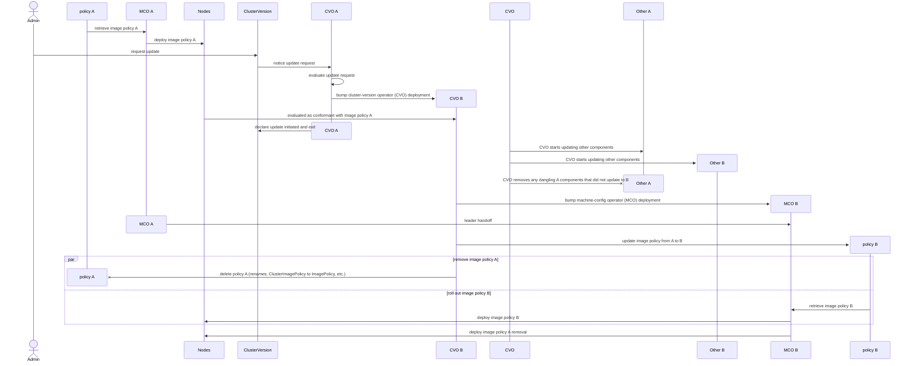
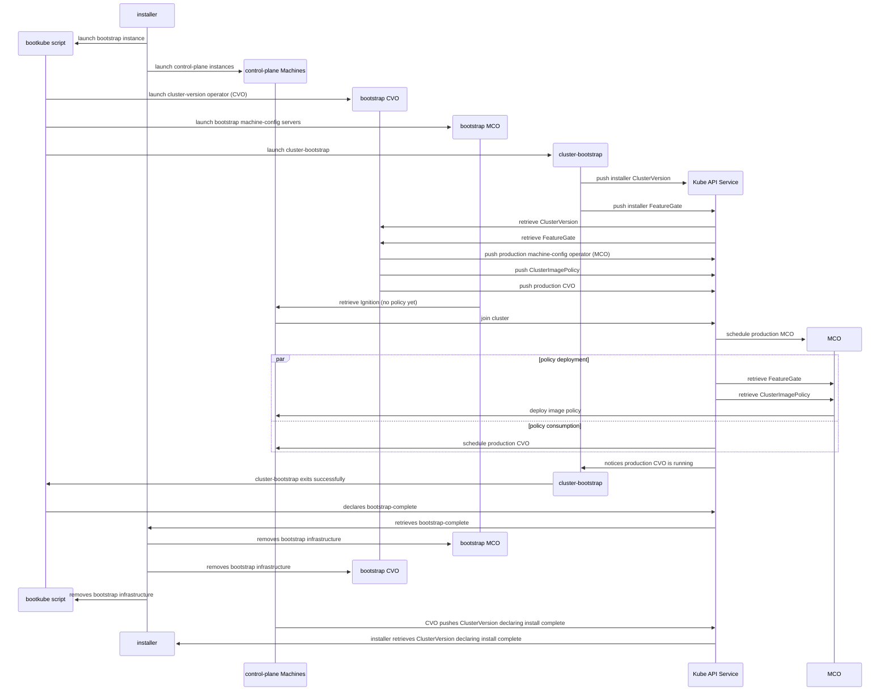

# OpenShift Image Policy

## Summary

[An existing enhancement](/enhancements/api-review/add-ClusterImagePolicy-and-ImagePolicy-for-Signature-Verification.md) is adding ClusterImagePolicy and ImagePolicy primitives to config image policy.
This enhancement describes how those primatives will be used by OpenShift clusters to secure core workloads:

* The `quay.io/openshift-release-dev/ocp-release` scope, used for OpenShift release images, will require [Sigstore][] signature signed by Red Hat, for any namespace in the cluster.
* Users may add additional policies if they want, to add additional requirements as they see fit, including for the `quay.io/openshift-release-dev` scope.

## Motivation

As an OpenShift cluster administrator, I want to trust that the release image I'm running comes from Red Hat using the emerging industry standard for doing so: [Sigstore][].
Sigstore is cheaper to run, because it's less custom as an image-signing mechanism than the existing OpenPGP / GPG system, and the ecosystem around generating, propagating, and verifying signatures is expected to be more robust.

CRI-O policies are more powerful than the cluster-version operator's OpenPGP verification, because they verify signatures on every pod launch, not just during OpenShift updates.
[`containers-policy.json` supports OpenPGP requirements too][containers-policy-signedBy], but that property has not yet been exposed as an OpenShift configurable.

However, [the signing systems are orthogonal](#overlap-with-openpgp-signing), so technically we can run both in parallel or [change our minds](#changing-our-minds) and decide to refocus on OpenPGP or some new third signing method, as our understanding evolves.
This proposal covers the early stages of bringing in the Sigstore policy, and later work will cover things like removing OpenPGP to complete [a transitional overlap phase](#overlap-with-openpgp-signing).

### User Stories

* As a cluster administrator, I want to trust that the OpenShift release image I'm running comes from Red Hat, checking whenever a pod is launched from such an image, and not just at update-time.
* As a cluster administrator, I want to be able to declare my own additional image policies, including restricting the use of the `quay.io/openshift-release-dev` scope.
* As a Red Hat CI job maintainer or quality engineer, I have a way to disable Sigstore verification while testing releases before they have been signed.

### Goals

* Define an initial OpenShift ClusterImagePolicy that will be installed in all 4.17 clusters to restrict `quay.io/openshift-release-dev/ocp-release` to Red-Hat-signed images.

### Non-Goals

There are a number of possible next-steps that I'm punting on for now, as I try to nibble off the smallest possible slice of progress.
This enhancement will not:

* Figure out how to configure a ClusterImagePolicy for verifying a mirrored release image, although this will need to happen before we can use Sigstore signatures in disconnected/restricted-network environments.
* Suggest changes to mirroring tools, although they will need to learn to mirror Sigstore signatures for use in disconnected/restricted-network environments.
* Suggest changes to the ImageStream controller, although it will need to learn to mirror Sigstore signatures for verification when running pods from ImageStream sources, e.g. [must-gather][].
* Suggest policies for `quay.io/openshift-release-dev/ocp-v4.0-art-dev`, although those would help tighten down security for other `openshift-*` namespaces.
* Support testing unsigned releases as HyperShift hosted clusters on a management cluster that requires signed releases.

## Proposal

This enhancement proposes a new `openshift` ClusterImagePolicy that requires Red Hat signatures for `quay.io/openshift-release-dev/ocp-release` images.
The new ClusterImagePolicy will be managed by the ClusterVersion operator and applied to all clusters by default.
The ClusterImagePolicy CRD and controller are gated by the `SigstoreImageVerification` feature gate, which is [currently `TechPreviewNoUpgrade`][feature-gate].
The new `openshift` ClusterImagePolicy would be initially gated by that same `SigstoreImageVerification` feature gate, and so also initially `TechPreviewNoUpgrade`.

Internal test clusters, which need to run releases that are not signed by official Red Hat keys, will use a new installer environment variable: `OPENSHIFT_INSTALL_EXPERIMENTAL_DISABLE_IMAGE_POLICY`.
When set non-empty, [the installer's ClusterVersion `overrides` handling][installer-overrides] will include an entry for the new `openshift` ClusterImagePolicy.
When [ClusterVersion `overrides`](/dev-guide/cluster-version-operator/dev/clusterversion.md#setting-objects-unmanaged) is set from cluster-installation like this, the cluster-version operator will never create the resource, so there is no need for further tooling to delete it.
Having `overrides` set blocks the cluster-version operator from updating, but because all internal updates between unsigned releases use `force`, that is not a problem for that use-case.

### Workflow Description

There is no supported workflow for this enhancement; when the relevant feature gate is enabled, this functionality works transparently without cluster administrator involvement.

For Red-Hat-internal CI and QE, the agent calling the installer needs to set `OPENSHIFT_INSTALL_EXPERIMENTAL_DISABLE_IMAGE_POLICY`.
The new property can be set regardless of version or whether the `SigstoreImageVerification` feature gate is enabled, because [the installer does not fail on unrecognized properties][install-config-unrecognized-properties].

### API Extensions

As part of implementing this policy, we will drop the following Godocs from [ClusterImagePolicy][ClusterImagePolicy-scope-restriction] and [ImagePolicy][ImagePolicy-scope-restriction]:

```golang
// Please be aware that the scopes should not be nested under the repositories of OpenShift Container Platform images.
// If configured, the policies for OpenShift Container Platform repositories will not be in effect.
```

[The backing implementation][container-runtime-scope-restriction] will also be removed.
This guard was [initially intended][scope-restriction-motivation] to protect cluster adminstrators from breaking their clusters by configuring policies that blocked critical images.
And before Red Hat was publishing signatures for `quay.io/openshift-release-dev/ocp-release` releases, that made sense.
But now that Red Hat is [almost][OTA-1267] publishing Sigstore signatures for those release images, it makes sense to allow policies covering those images.
And even if a cluster administrator creates a policy that blocks critical image pulls, PodDisriptionBudgets should keep the Kubernetes API server and related core workloads running for long enough for the cluster administrator to use the Kube API to remove or adjust the problematic policy.

### Topology Considerations

#### Hypershift / Hosted Control Planes

HyperShift clusters run pods [on the management cluster and in the hosted cluster][hypershift-concepts].
A ClusterImagePolicy applied to the hosted Kubernetes API server will only be distributed to hosted nodes, and none of those nodes are likely to run an image from `quay.io/openshift-release-dev/ocp-release` (platform DaemonSets will use `quay.io/openshift-release-dev/ocp-v4.0-art-dev` images referenced from the `quay.io/openshift-release-dev/ocp-release` image).
However, a ClusterImagePolicy applied to the management cluster's Kubernetes API server would cover both the management cluster's cluster-version operator (CVO), and the CVOs associated with hosted clusters (which run as pods in mangement-cluster namespaces).
That means that it would take an ImagePolicy to be able to distinguish between constraints on the management cluster's CVO and constraints on the hosted components running on the management cluster, which is [out of scope for this enhancement](#use-an-imagepolicy-for-openshift--namespaces).

#### Standalone Clusters

This proposal is aimed at standalone clusters.

#### Single-node Deployments or MicroShift

This proposal is aimed at single-node OpenShift deployments (SNOs), and will function there the same way it does in standalone clusters.
It is not expected to affect resource consumption, because pod-launches are expected to be a relatively insignificant fraction of overall pod lifetime, and the `quay.io/openshift-release-dev/ocp-release` scope check covered by this proposal is expected to cheaply exclude most pods.

This proposal is not relevant for MicroShift, which does not run a cluster-version operator or machine-config operator, and which handles trust via RPM signing.

#### OKD

By using [the cluster-update keys tooling](#cluster-update-keys), OKD's image policies (or lack of image policies) can be managed completely independently from OCP's.
For this proposal, there will be no OKD image policy.
Once can be added in follow-up work if/when [the OKD release controller][OKD-releases] grows the ability to generate Sigstore signatures.

### Implementation Details/Notes/Constraints

#### Machine-config operator

As discussed in [the *API Extensions* section](#api-extensions), the scope guard around OCP images will be dropped.

#### Cluster-update keys

[The cluster-update-keys repository][cluster-update-keys] repository is currently used to distribute the cluster's OpenPGP policy, and it has [a restricted approver set][cluster-update-keys-OWNERS].
The current OpenPGP signatures have different signing keys for [OKD releases][OKD-releases] ([Dockerfile][OKD-Dockerfile], [manifest][OKD-manifest]) and OCP releases ([Dockerfile][OCP-Dockerfile], [manifest][OCP-manifest]).
For this proposal, there will be [no OKD image policy](#okd), and the cluster-update-keys repository will add an OCP manifest with:

```yaml
apiVersion: config.openshift.io/v1alpha1
kind: ClusterImagePolicy
metadata:
  name: openshift
  annotations:
    kubernetes.io/description: Require Red Hat signatures for quay.io/openshift-release-dev/ocp-release container images.
    exclude.release.openshift.io/internal-openshift-hosted: "true"
    include.release.openshift.io/self-managed-high-availability: "true"
    release.openshift.io/feature-set: TechPreviewNoUpgrade
spec:
  scopes:
  - quay.io/openshift-release-dev/ocp-release
  policy:
    rootOfTrust:
      policyType: PublicKey
      publicKey:
        keyData: LS0tLS1CRUdJTiBQVUJMSUMgS0VZLS0tLS0KTUlJQ0lqQU5CZ2txaGtpRzl3MEJBUUVGQUFPQ0FnOEFNSUlDQ2dLQ0FnRUEzQzJlVGdJQUo3aGxveDdDSCtIcE1qdDEvbW5lYXcyejlHdE9NUmlSaEgya09ZalRadGVLSEtnWUJHcGViajRBcUpWYnVRaWJYZTZKYVFHQUFER0VOZXozTldsVXpCby9FUUEwaXJDRnN6dlhVbTE2cWFZMG8zOUZpbWpsVVovaG1VNVljSHhxMzR2OTh4bGtRbUVxekowR0VJMzNtWTFMbWFEM3ZhYmd3WWcwb3lzSTk1Z1V1Tk81TmdZUHA4WDREaFNoSmtyVEl5dDJLTEhYWW5BMExzOEJlbG9PWVJlTnJhZmxKRHNzaE5VRFh4MDJhQVZSd2RjMXhJUDArRTlZaTY1ZE4zKzlReVhEOUZ6K3MrTDNjZzh3bDdZd3ZZb1Z2NDhndklmTHlJbjJUaHY2Uzk2R0V6bXBoazRjWDBIeitnUkdocWpyajU4U2hSZzlteitrcnVhR0VuVGcyS3BWR0gzd3I4Z09UdUFZMmtqMnY1YWhnZWt4V1pFN05vazNiNTBKNEpnYXlpSnVSL2R0cmFQMWVMMjlFMG52akdsMXptUXlGNlZnNGdIVXYwaktrcnJ2QUQ4c1dNY2NBS00zbXNXU01uRVpOTnljTTRITlNobGNReG5xU1lFSXR6MGZjajdYamtKbnAxME51Z2lVWlNLeVNXOHc0R3hTaFNraGRGbzByRDlkVElRZkJoeS91ZHRQWUkrK2VoK243QTV2UVV4Wk5BTmZqOUhRbC81Z3lFbFV6TTJOekJ2RHpHellSNVdVZEVEaDlJQ1I4ZlFpMVIxNUtZU0h2Tlc3RW5ucDdZT2d5dmtoSkdwRU5PQkF3c1pLMUhhMkJZYXZMMk05NDJzSkhxOUQ1eEsrZyszQU81eXp6V2NqaUFDMWU4RURPcUVpY01Ud05LOENBd0VBQVE9PQotLS0tLUVORCBQVUJMSUMgS0VZLS0tLS0K
```

#### Installer

As discussed in [the *Proposal* section](#proposal), the installer will grow a new, feature-gated `OPENSHIFT_INSTALL_EXPERIMENTAL_DISABLE_IMAGE_POLICY` environment variable driving ClusterVersion `overrides` extension.
When set non-empty, the following `overrides` entry will be added to the ClusterVersion manifest:

```yaml
kind: ClusterImagePolicy
group: config.openshift.io
name: openshift
unmanaged: true
```

##### Installer callers

Hive, the assisted installer, and other actors who create install-configs will need to learn to set `OPENSHIFT_INSTALL_EXPERIMENTAL_DISABLE_IMAGE_POLICY` if they wish to test unsigned releases that enable the feature-gate.

#### Cincinnati graph data

The graph-data repository will add additional testing to [ensure Sigstore signatures are in place](#bfore-promoting-new-releases-into-update-channels) before accepting a release into update channels.

#### Implementation order

To reduce risk, the recommended implementation order is:

1. Machine-config operator [lifts the release payload scope restriction](#api-extensions).
2. [Parallel Cincinnati work][OTA-1267] allows ART to push Sigstore signatures to `quay.io/openshift-release-dev/ocp-release:sha256-....sig`.
    1. Without blocking further main-line work, [cincinnati-graph-data extends its presubmits](#cincinnati-graph-data).
3. Testing [the planned ClusterImagePolicy](#machine-config-operator) confirms that the approach works, possibly including [restricted-network use](#restricted-network-use).
    If testing turns up gaps, round to see if we want to pivot or abandon this effort.
4. [Installer `OPENSHIFT_INSTALL_EXPERIMENTAL_DISABLE_IMAGE_POLICY` environment variable](#installer).
5. Tooling interacting with unsigned `quay.io/openshift-release-dev/ocp-release` release images ([CI, QE, assisted-installer, Hive, others?](#installer-callers)) updated to set `OPENSHIFT_INSTALL_EXPERIMENTAL_DISABLE_IMAGE_POLICY`.
6. Cluster-update keys [adds the `openshift` ClusterImagePolicy manifest](#cluster-update-keys).

### Risks and Mitigations

#### Changing our minds

Not much risk for connected clusters.
If we decide that the policy is not helpful, we can remove from future releases via a [deletion annotation](/enhancements/update/object-removal-manifest-annotation.md).

#### Signing key compromise

4.odd releases are currently supported [for 18 months after GA][maintenance-support].
There's a risk with a single trusted key that the key 4.17.0 trusts is compromised before 4.17 goes end-of-life.
With this single-key proposal, the only way to update those clusters if a key is revoked would be the process for disabling the image policy is described in [the *Upgrade / Downgrade Strategy* section](#upgrade--downgrade-strategy), and have cluster administrators install a replacement policy with the new key, after somehow establishing trust in that new key.
There is [an upstream request for "trust if any of these keys have signed..."][containers-image-2319], so the single-key limitation might be something that a later 4.y could relax.

But even if that feature is added in a 4.17.middle, we would still need to continue signing with the compromised key or use a manual workaround to get 4.17.0 clusters up to 4.17.tip.
Because we occasionally have regressions with z streams like [`CephCapDropPanic`][CephCapDropPanic], and we don't want 4.17.0 adminstrators to have to choose between updating into a 4.17.middle regression or breaking the Sigstore chain by going directly to a 4.17.tip that was not signed with the old, compromised key.
And we don't want to delay the 4.17.0 adminstrator's access to the other bugs fixed in 4.17.tip.
So we would have to either continue signing 4.17.tip with the compromised key, or do the image policy replacement discussed in the previous paragraph, or both.

The current OpenPGP system [bakes in trust for a `Red Hat, Inc. (release key 2)` key and a `Red Hat, Inc. (beta key 2)` key][cluster-update-keys-ocp], and a signature from either is accepted by the cluster-version operator.
But support for [revocation][rfc-4880-5.2.3.15] has not been implemented, so even with one key in this proposal, we're not more exposed than we were with the OpenPGP system.

#### Signing key destruction

Similar to [a signing key compromise](#signing-key-compromise), we could lose access to the single signing key.
In that case, continuing to sign later releases would not be an option, and recovery would follow the process for disabling the image policy is described in [the *Upgrade / Downgrade Strategy* section](#upgrade--downgrade-strategy), and have cluster administrators install a replacement policy with the new key, after somehow establishing trust in that new key.

#### ClusterImagePolicy removal

There is some risk that the v1alpha1 ClusterImagePolicy is dropped before becoming a generally-available v1 API, and we would have to work to find a replacement.
But the worst-case scenario here is returning to only use OpenPGP signatures, and we can keep the OpenPGP tooling in place until we are more confident that the image policy APIs are going to go generally available.

#### Installer vs. cluster API stability

The installer is expected to [use `overrides` to block the `openshift` ClusterImagePolicy](#installer).
But that may be a moving target, with future clusters using an `openshift-release` ClusterImagePolicy, or pivoting to an `openshift-cluster-version` ImagePolicy, or multiple `openshift-*` ImagePolicies, etc.
The installer can be taught to adjust with each transition, and overlap isn't a problem, because `overrides` entries can be populated before the cluster learns about a new release manifest:

1. Installer sets `overrides` for the `openshift` ClusterImagePolicy (which the cluster uses).
2. Installer sets `overrides` for the `openshift` ClusterImagePolicy (which the cluster uses) and also for the `openshift-cluster-version` ImagePolicy.
3. Installer sets `overrides` for the `openshift` ClusterImagePolicy and also for the `openshift-cluster-version` ImagePolicy (which the cluster uses).
4. Installer sets `overrides` for the `openshift-cluster-version` ImagePolicy (which the cluster uses).

But things get sticky on updates:

1. Installer sets `overrides` for the `openshift` ClusterImagePolicy (which the cluster uses).
2. Cluster updates to a new release, which adds the `openshift-cluster-version` ImagePolicy and removes the `openshift` ClusterImagePolicy.
3. But nothing in-cluster pivots `overrides` to include the `openshift-cluster-version` ImagePolicy, so the unsigned cluster-version operator can no longer be pulled.

I think this risk is acceptable, because the installer knob is supposed to be for internal testing of short-lived clusters.
But if it turns out we need something in-cluster to migrate these settings, we may want to pivot to [have the machine-config operator manage the policy directly](#have-the-machine-config-operator-manage-the-policy-directly) with a more structured in-cluster knob.

#### Transitioning unsigned-release testing

There is a transitional cost to the additional step (`OPENSHIFT_INSTALL_EXPERIMENTAL_DISABLE_IMAGE_POLICY` for installs, `overrides` for updating older clusters) needed to run an unsigned release image for internal testing.
But that transitional cost is only expected to affect internal use-cases; external users should always be using signed releases.

#### Restricted-network use

Disconnected/restricted-network use is out of scope for this enhancement, so external clusters running `TechPreviewNoUpgrade` and getting this feature may also need the `OPENSHIFT_INSTALL_EXPERIMENTAL_DISABLE_IMAGE_POLICY` or `overrides` workaround.
It's possible that an ImageDigestMirrorSet like this would be sufficient:

```yaml
apiVersion: config.openshift.io/v1
kind: ImageDigestMirrorSet
metadata:
  name: openshift-release-payload
spec:
  imageDigestMirrors:
  - mirrors:
    - example.com/my-mirror/whatever
    source: quay.io/openshift-release-dev/ocp-release
```

In any case, it's out of scope for a reason, but until it gets picked up, it might make things more difficult for `TechPreviewNoUpgrade` disconnected/restricted-network clusters.

##### Mirror registries that do not support Sigstore signatures

As a subset of the restricted-network use case, when a user has an ImageDigestMirrorSet set to point at a mirror, and the canonical quay.io is either not reachable, or [`mirrorSourcePolicy: NeverContactSource`][ImageDigestMirrorSet] is set, the mirror registry will need to allow Sigstore signatures in order for CRI-O to be able to retrieve signatures.
Quay support for Sigstore is [new and ongoing][PROJQUAY-3400], so it's likely that there are other mirror registries in use where Sigstore hosting is not yet possible.
But again, restricted-network use is out of scope for this initial policy, and once it comes into scope, mirror support will be a generic issue for all ClusterImageProfile and ImageProfile users, and will not be unique to OpenShift's internal policies.

#### Security

How will security be reviewed and by whom?

I have no idea; suggestions welcome :).

There will be a gap during install before the ClusterImagePolicy has been created and rolled out to nodes, during which unsigned `quay.io/openshift-release-dev/ocp-release` images might run.
But we do not perform any in-cluster signature checking during installs today; they are secured by a trusted installer using a baked-in release image digest.
Trust in the installer is either transitive via trust in the hosting site from which the installer was downloaded, or via mirror signatures like [this one][4.15.0-multi-mirror-signature].

##### Relevant maintainer set

The cluster-update keys (CUK) repository used to [declare policy](#cluster-update-keys) has [a restricted approver set][cluster-update-keys-OWNERS].
But the cluster-version operator (CVO) verifies OpenPGP signatures directly, so the relevant set of maintainers for security was:

* CUK maintainers: setting policy.
* oc/CVO maintainers: reliably transmitting CUK policy manifests to release images with `oc adm release new ...`.
* Automated-release tooling (ART): reliably building CUK, CVO, and release images.
    And to reliably request signatures for the releases they'd built using the internal build pipeline.
* Internal signers: reliably signing ART-built releases and protecting signing keys from compromise.
* CVO maintainers: reliably enforcing policy.

With Sigstore signatures, the relevant maintainer set expands to:

* CUK maintainers: setting policy.
* oc/CVO maintainers: reliably transmitting CUK policy manifests to release images with `oc adm release new ...`.
* ART: reliably building CUK, CVO, and release images.
    And to reliably request signatures for the releases they'd built using the internal build pipeline.
* Internal signers: reliably signing ART-built releases and protecting signing keys from compromise.
* CVO/machine-config maintainers: reliably transmitting CUK policy from release images to CRI-O.
* Node/CRI-O maintainers: reliably enforcing policy.

#### User experience

How will UX be reviewed and by whom?

I expect "images are failing to meet the relevant image policy/policies" to be something with a solid user experience, regardless of whether OpenShift defines its own image policy, or leaves image policies entirely up to users.

##### Updating a standalone cluster to a release without an OpenPGP signature

For comparison, the current OpenPGP verification process is one of several cluster-version operator (CVO) steps feeding [ClusterVersion's `ReleaseAccepted` condition][ReleaseAccepted].
When [the CVO fails to retrieve an image signature][cluster-version-operator-signature-retrieval-failure], it generates Events:

```console
$ oc -n openshift-cluster-version get -o json events | jq -r '.items[] | select(.reason | contains("Payload")) | .reason + ": " + .message' | grep verified | sort | uniq -c
      1 RetrievePayloadFailed: Retrieving payload failed version="" image="quay.io/openshift-release-dev/ocp-release@sha256:0000000000000000000000000000000000000000000000000000000000000000" failure=The update cannot be verified: unable to verify sha256:0000000000000000000000000000000000000000000000000000000000000000 against keyrings: verifier-public-key-redhat // [2023-12-09T01:33:34Z: prefix sha256-0000000000000000000000000000000000000000000000000000000000000000 in config map signatures-managed: no more signatures to check, 2023-12-09T01:33:34Z: unable to retrieve signature from https://storage.googleapis.com/openshift-release/official/signatures/openshift/release/sha256=0000000000000000000000000000000000000000000000000000000000000000/signature-1: no more signatures to check, 2023-12-09T01:33:34Z: unable to retrieve signature from https://mirror.openshift.com/pub/openshift-v4/signatures/openshift/release/sha256=0000000000000000000000000000000000000000000000000000000000000000/signature-1: no more signatures to check, 2023-12-09T01:33:34Z: parallel signature store wrapping containers/image signature store under https://storage.googleapis.com/openshift-release/official/signatures/openshift/release, containers/image signature store under https://mirror.openshift.com/pub/openshift-v4/signatures/openshift/release: no more signatures to check, 2023-12-09T01:33:34Z: serial signature store wrapping ClusterVersion signatureStores unset, falling back to default stores, parallel signature store wrapping containers/image signature store under https://storage.googleapis.com/openshift-release/official/signatures/openshift/release, containers/image signature store under https://mirror.openshift.com/pub/openshift-v4/signatures/openshift/release: no more signatures to check, 2023-12-09T01:33:34Z: serial signature store wrapping config maps in openshift-config-managed with label "release.openshift.io/verification-signatures", serial signature store wrapping ClusterVersion signatureStores unset, falling back to default stores, parallel signature store wrapping containers/image signature store under https://storage.googleapis.com/openshift-release/official/signatures/openshift/release, containers/image signature store under https://mirror.openshift.com/pub/openshift-v4/signatures/openshift/release: no more signatures to check]
```

And sets a shorter message in ClusterVersion:

```console
$ oc adm upgrade
Cluster version is 4.15.0-0.test-2023-12-09-005930-ci-ln-0ryhgq2-latest

ReleaseAccepted=False

  Reason: RetrievePayload
  Message: Retrieving payload failed version="" image="quay.io/openshift-release-dev/ocp-release@sha256:0000000000000000000000000000000000000000000000000000000000000000" failure=The update cannot be verified: unable to verify sha256:0000000000000000000000000000000000000000000000000000000000000000 against keyrings: verifier-public-key-redhat

warning: Cannot display available updates:
  Reason: NoChannel
  Message: The update channel has not been configured.
```

The detailed Event failure message is still fairly intimidating, but it has a lot of information. Formatting:

```console
$ oc -n openshift-cluster-version get -o json events | jq -r '.items[] | select(.reason | contains("Payload")) | .metadata.creationTimestamp + " " + .reason + ": " + .message' | grep verified | tail -n1 | sed 's| // |\n|g;s/, 2023/,\n2023/g'
2023-12-09T01:35:29Z RetrievePayloadFailed: Retrieving payload failed version="" image="quay.io/openshift-release-dev/ocp-release@sha256:0000000000000000000000000000000000000000000000000000000000000000" failure=The update cannot be verified: unable to verify sha256:0000000000000000000000000000000000000000000000000000000000000000 against keyrings: verifier-public-key-redhat
[2023-12-09T01:35:29Z: prefix sha256-0000000000000000000000000000000000000000000000000000000000000000 in config map signatures-managed: no more signatures to check,
2023-12-09T01:35:29Z: unable to retrieve signature from https://storage.googleapis.com/openshift-release/official/signatures/openshift/release/sha256=0000000000000000000000000000000000000000000000000000000000000000/signature-1: no more signatures to check,
2023-12-09T01:35:29Z: unable to retrieve signature from https://mirror.openshift.com/pub/openshift-v4/signatures/openshift/release/sha256=0000000000000000000000000000000000000000000000000000000000000000/signature-1: no more signatures to check,
2023-12-09T01:35:29Z: parallel signature store wrapping containers/image signature store under https://storage.googleapis.com/openshift-release/official/signatures/openshift/release, containers/image signature store under https://mirror.openshift.com/pub/openshift-v4/signatures/openshift/release: no more signatures to check,
2023-12-09T01:35:29Z: serial signature store wrapping ClusterVersion signatureStores unset, falling back to default stores, parallel signature store wrapping containers/image signature store under https://storage.googleapis.com/openshift-release/official/signatures/openshift/release, containers/image signature store under https://mirror.openshift.com/pub/openshift-v4/signatures/openshift/release: no more signatures to check,
2023-12-09T01:35:29Z: serial signature store wrapping config maps in openshift-config-managed with label "release.openshift.io/verification-signatures", serial signature store wrapping ClusterVersion signatureStores unset, falling back to default stores, parallel signature store wrapping containers/image signature store under https://storage.googleapis.com/openshift-release/official/signatures/openshift/release, containers/image signature store under https://mirror.openshift.com/pub/openshift-v4/signatures/openshift/release: no more signatures to check]
```

Which shows us walking the ConfigMap store, failing to find any signatures, and then walking both default sig-store stores, failing to find any signatures, and then failing out the wrapping stores.

##### Updating a standalone cluster to a release without a Sigstore signature

When updating a standalone cluster to a release that is not compatible with an image policy, the experience is not quite as clear.
Down at the Pod/Event level, there are some details:

```console
$ oc -n openshift-cluster-version get pods
NAME                                        READY   STATUS                           RESTARTS       AGE
cluster-version-operator-66c5f676db-c26p4   1/1     Running                          1 (107m ago)   118m
version--h4m96-5xhzn                        0/1     Init:SignatureValidationFailed   0              56s
$ oc -n openshift-cluster-version get events | grep -i signature
49s         Warning   Failed              pod/version--h4m96-5xhzn                         Failed to pull image "quay.io/openshift-release-dev/ocp-release@sha256:1995202f11dc5a4763cdc44ff30d4d4d6560b3a6e29873b51af2992bd8e33109": SignatureValidationFailed: Source image rejected: A signature was required, but no signature exists
49s         Warning   Failed              pod/version--h4m96-5xhzn                         Error: SignatureValidationFailed
```

But the details are not bubbled up through the Job controller:

```console
$ oc -n openshift-cluster-version get jobs
NAME             STATUS    COMPLETIONS   DURATION   AGE
version--h4m96   Running   0/1           84s        84s
$ oc -n openshift-cluster-version get -o json jobs | jq '.items[].status'
{
  "active": 1,
  "ready": 0,
  "startTime": "2024-06-12T19:41:33Z",
  "terminating": 0,
  "uncountedTerminatedPods": {}
}
```

so the cluster-version operator (CVO) doesn't have them to present to the customer when explaining that version downloads are failing:

```console
$ oc adm upgrade
Cluster version is 4.17.0-0.nightly-2024-06-12-101500

Upgradeable=False

  Reason: FeatureGates_RestrictedFeatureGates_TechPreviewNoUpgrade
  Message: Cluster operator config-operator should not be upgraded between minor versions: FeatureGatesUpgradeable: "TechPreviewNoUpgrade" does not allow updates

ReleaseAccepted=False

  Reason: RetrievePayload
  Message: Retrieving payload failed version="" image="quay.io/openshift-release-dev/ocp-release@sha256:1995202f11dc5a4763cdc44ff30d4d4d6560b3a6e29873b51af2992bd8e33109" failure=Unable to download and prepare the update: deadline exceeded, reason: "DeadlineExceeded", message: "Job was active longer than specified deadline"

warning: Cannot display available updates:
  Reason: NoChannel
  Message: The update channel has not been configured.
```

We have some options:

* Live with the current UX.
* Teach the CVO to reach around the Job controller and inspect the child Pods directly, for some subset of failure modes we consider common/important enough to be worth that special handling.
* Drop the Job controller and have the CVO manage the version-download Pods directly.
* Improve the "deadline exceeded" error with some next-step debugging hints like a suggestion to run:

```console
$ oc -n openshift-cluster-version get --field-selector=involvedObject.kind=Pod --sort-by='{.lastTimestamp}{.metadata.creationTimestamp}' events
...
76s         Warning   Failed             pod/version--fw8dk-gn9l4                        Error: ImagePullBackOff
63s         Normal    AddedInterface     pod/version--v4jsv-zs87s                        Add eth0 [10.130.0.149/23] from ovn-kubernetes
24s         Normal    Pulling            pod/version--v4jsv-zs87s                        Pulling image "quay.io/openshift-release-dev/ocp-release@sha256:1995202f11dc5a4763cdc44ff30d4d4d6560b3a6e29873b51af2992bd8e33109"
23s         Warning   Failed             pod/version--v4jsv-zs87s                        Error: SignatureValidationFailed
23s         Warning   Failed             pod/version--v4jsv-zs87s                        Failed to pull image "quay.io/openshift-release-dev/ocp-release@sha256:1995202f11dc5a4763cdc44ff30d4d4d6560b3a6e29873b51af2992bd8e33109": SignatureValidationFailed: Source image rejected: A signature was required, but no signature exists
8s          Warning   Failed             pod/version--v4jsv-zs87s                        Error: ImagePullBackOff
8s          Normal    BackOff            pod/version--v4jsv-zs87s                        Back-off pulling image "quay.io/openshift-release-dev/ocp-release@sha256:1995202f11dc5a4763cdc44ff30d4d4d6560b3a6e29873b51af2992bd8e33109"
```

##### Overlap with OpenPGP signing

This enhancemnt's image policy proposal is completely orthogonal to the existing OpenPGP / GPG system.
But there have been some questions about the transition and possibility of interaction, so this section covers the transitions do address those concerns.

All OpenShift releases are [already signed with OpenPGP signatures][OCP-signatures].
Sigstore will add a new, orthogonal signing method.
The transition looks like:

1. An old-style cluster running release A knows how to trust OpenPGP signatures.
2. The cluster administrator requests an update to a new release B that is signed with both OpenPGP and Sigstore, and knows how to validate both.
3. The outgoing cluster-version operator from A checks for an OpenPGP signature on B, finds a signature it trusts, and initiates the update, just like we've always done.
4. The incoming B components install the new image policy (this enhancement proposal), and when launching future release-image pods, CRI-O checks for a Sigstore signature, finds a signature it trusts, and launches the pod.

That can continue with releases with both OpenPGP and Sigstore signatures for however long folks want.
Eventually, if folks decide Sigstore alone is the way to go, we can drop the OpenPGP signatures and verification process.

### Drawbacks

We're building a new thing here without a lot of experience defining ClusterImagePolicies.
And not any for the `quay.io/openshift-release-dev/ocp-release` scope, because those don't have Sigstore signatures [yet][OTA-1267].
Designing core-image verification without much experience is risky.
But passing around OpenPGP / GPG signatures in non-registry storage for disconnected/restricted-networks is awkward, so doing nothing has risks too.

Building something that is partly designed to make mirroring and disconnected/restricted-network use easier without understanding what the disconnected/restricted-network solution will look like is also risky.
We could mitigate that with more clarity on what the disconnected/restricted-network solution would look like.

## Test Plan

### End-to-end signature policy testing

Testing release signature validation is a gap in our current process, because we don't have triggers to run CI jobs after they've been signed _and_ a later release that we can update to has also been signed.
We could fill this in with a periodic, but if we test once A and B have both been signed, it's likely that A has already been shipped, and it's too late to catch and fix any bugs the tests turn up in A.
We could close this gap by signing CI releases with a CI key, [as envisioned years ago for OpenPGP signatures][ci-signing-key], but so far never implemented.
It's unclear if this gap is considered severe enough to be worth that kind of investment, when occasional manual testing has done a fairly good job at keeping bugs out of slow-changing code (although we have had at least [one bug][verified-vs-graceful-shutdown] with signature handling that CI might have caught).

### Before promoting new releases into update channels

The existing graph-data `e2e` presubmit currently requires valid OpenPGP keys before promoting new releases into update channels, and that sometimes fails, although [usually on transient Quay hiccups][cincinnati-graph-data-quay-500].

## Graduation Criteria

This functionality is expected to use [the existing `SigstoreImageVerification` feature gate][feature-gate], and have the same graduation criteria.

### Dev Preview -> Tech Preview

[The existing `SigstoreImageVerification` feature gate is already `TechPreviewNoUpgrade`][feature-gate], so this transition will never happen for this new functionality.

### Tech Preview -> GA

This functionality is expected to use [the existing `SigstoreImageVerification` feature gate][feature-gate], and have the same graduation criteria.

### Removing a deprecated feature

This proposal does not deprecate any features.
This proposal does not remove any features, with the possible exception of the removal of the OCP image scope guard discussed in [the *API Extensions* section](#api-extensions).

## Upgrade / Downgrade Strategy

Existing clusters can return to the previous behavior after updating by setting the `overrides` entry mentioned in [the *Installer* section](#installer) and removing the policy with:

```console
$ oc delete clusterimagepolicy openshift
```

## Version Skew Strategy

The new ClusterImagePolicy manifest should have a late enough run-level that the cluster-version operator (CVO) applies it after the ClusterImagePolicy CRD and any machine-config tooling needed to process the custom resource.
Because the machine-config is at run-level 80, late in the update, this means that updates into new image policies will be applied after most other components have rolled out their new images, which may require slower ratcheting for things like signing key rotations.
This sequence diagram shows that:

* Both release A and release B need to be compatible with image policy A.
* Only release B needs to be compatible with image policy B, because by the time policy B rolls out, all of the release A pods are gone.



## Operational Aspects of API Extensions

None of the changes proposed in [the *API Extensions* section](#api-extensions) have operational impact.

## Support Procedures

I expect "images are failing to meet the relevant image policy/policies" to be something with a solid support experience, regardless of whether OpenShift defines its own image policy, or leaves image policies entirely up to users.

The process for disabling the image policy is described in [the *Upgrade / Downgrade Strategy* section](#upgrade--downgrade-strategy).

## Alternatives (Not Implemented)

### Continue with OpenPGP signatures

We could continue to use OpenPGP signatures, and save the trouble of building a new process and tooling.
But our OpenPGP image-signing system is largely custom, and that has more maintenance costs than a more standardized, upstream process.
The OpenPGP signatures are also not stored in registries, which makes [mirroring more complicated][OTA-946].
The OpenPGP signatures also only covered the root release image, requiring a chain of trust based on image digests to extend the trust to referenced payload images like the machine-config operator.
Using Sigstore signatures allows for a more standard process that will eventually be supported out of the box by a wider slice of tools, and which can eventually cover all Red Hat images, not just OpenShift release images.

### Have the cluster-version operator check Sigstore signatures directly

This would be a closer match to the CVO's existing OpenPGP signature verification.
But registry access is complicated, and requires the client to understand the Sigstore protocols and signature format, the Proxy configuration, and the various mirroring configurations like ImageContentSourcePolicy, ImageDigestMirrorSet, and ImageTagMirrorSet.
By having CRI-O alone be responsible for Sigstore verification, CVO maintainers can avoid implementing similar logic that they are less familiar with, which avoids the risk of them shipping a buggy implementation and the cost of building and maintaining that implementation.

### Set a broader policy for more Red Hat images

I think a policy for all of `quay.io/openshift-release-dev` (both the `quay.io/openshift-release-dev/ocp-release` release images and the `quay.io/openshift-release-dev/ocp-v4.0-art-dev` images referenced from release images), would provide more protection.
Covering the operator-lifecycle manager (OLM) catalogs in `registry.redhat.io/redhat/*-operator-index` and other Red Hat images would provide even more protection.
But I'm limiting this initial proposal to just `quay.io/openshift-release-dev/ocp-release` to get the smallest possible slice of progress.
If the initial steps go well, we can extend the image policy to other Red Hat scopes in future iterations.

### Use an ImagePolicy for `openshift-*` namespaces

The current ClusterImagePolicy approach restricts the scoped images, regardless of which namespace they run in.
But it does not restrict other images from running in `openshift-*` namespaces, including `openshift-cluster-version`.
Ideally we would use ImagePolicy as well to add those restrictions, but again, I'm looking for the smallest possible slice of progress.
And while [api#1457][api-1457] landed both ClusterImagePolicy and ImagePolicy, [mco#4160][machine-config-operator-4160] only pulled the former into the cluster.
We might come back and pick up namespaced policies once [ImagePolicy has been implemented][OCPNODE-2333], but I'm deferring on OpenShift policies based on that custom resource for now.

### Delay running a cluster-version operator pod until the image policy is in place

We could add logic to ensure the current, relevant image policies were in place before launching a new release image pod.
This would avoid gaps where a cluster-version operator (CVO) pod, or [the `version-*` pod it uses to get manifests for an incoming release image][cluster-version-operator-payload-job], launch against old policies (or on install, against a non-existent policy).

But while there is some has been applied wording in [the (Cluster)ImagePolicy enhancement](/enhancements/api-review/add-ClusterImagePolicy-and-ImagePolicy-for-Signature-Verification.md), there are some corner cases, like one compute machine not letting us roll out the policy, that probably shouldn't block CVO pod creation.
As it stands, this proposal lets the new `quay.io/openshift-release-dev/ocp-release` Pods race ClusterImagePolicy.
If the images violate the incoming image policy, they'll fail on their first reschedule.
(Cluster)ImagePolicy changes will [trigger CRI-O reloads][machine-config-operator-reload-crio], but not drain the node, so there might not be any immediate sign that a policy change had broken the ability to pull a critical image.
But that kind of conformance check could limit the risk of this kind of race.
And we are not performing in-cluster signature checking during installs today; instead [that trust is established via the installer](#security).



### Wait for a Red Hat Rekor

There are long-term plans for Red Hat to host a [Rekor][] ledger of Sigstore activity.
When that happens, the image policies will pivot to [the `FulcioCAWithRekor` policy type][FulcioCAWithRekor].
But that hasn't happened yet, and we want to start working now, so this proposal opens with `PublicKey`.
Once there is a Red Hat Rekor, we will update new releases to use `FulcioCAWithRekor`, with at least one overlapping 4.y release stream signed via both approaches.

### Have the machine-config operator manage the policy directly

This proposal recommends [cluster-update-keys use a release image manifest](#cluster-update-keys) to manage the `openshift` ClusterImagePolicy.
That gives convenient access to the existing [ClusterVersion `overrides`](#installer) as a mechanism for disabling the policy.
But it means the cluster-version operator (CVO) will have to learn how to reliably manage the new kind, and CVO maintainers are not ClusterImagePolicy specialists.
The node team has the ClusterImagePolicy specialists, and they work with the MCO maintainers on the ClusterImagePolicy controller, so having them also manage `openshift` ClusterImagePolicy reconciliation directly would reduce the chance of reconciliation bugs.
However, the MCO does not currently have a configuration knob analogous to `overrides`, so a new system for configuring the MCO to not reconcile the `openshift` ClusterImagePolicy would need to be built.
The current proposal does not exclude pivoting to such a system in the future, if we decide CVO reconciliation of ClusterImagePolicy manifests is too costly to maintain, or that the `overrides` approach is too awkward for the folks that need to use it.

### Have the installer use an install-config property

Instead of [the *Proposal*](#proposal)'s environment variable, the installer could add an install-config property like `internalTestingImagePolicy: Disable` (also gated by the `SigstoreImageVerification` feature gate, [precedent for a feature-gated install-config property][install-config-feature-gate-precedent]).
That would be more customer-facing than the environment variable.
But wee are initially using the environment variable because we do not expect external users to need this knob, as all externally-accessbile supported releases (including Engineering Candidates and other prerelease) will have published Red Hat signatures.
And if we decide that customer access is necessary, we can add an install-config property in later work.
For now, we're expecting the only folks who need this knob will be Red-Hat-internall CI and QE, and the environment variable gives those folks access, and follows existing precedent like [`OPENSHIFT_INSTALL_EXPERIMENTAL_CLUSTER_PROFILE`][installer-OPENSHIFT_INSTALL_EXPERIMENTAL_CLUSTER_PROFILE] and [`OPENSHIFT_INSTALL_OS_IMAGE_OVERRIDE`][installer-OPENSHIFT_INSTALL_OS_IMAGE_OVERRIDE]

[4.15.0-multi-mirror-signature]: https://mirror.openshift.com/pub/openshift-v4/multi/clients/ocp/4.15.0/sha256sum.txt.gpg
[api-1457]: https://github.com/openshift/api/pull/1457
[CephCapDropPanic]: https://issues.redhat.com/browse/COS-2781
[ci-signing-key]: https://github.com/openshift/cluster-update-keys/blame/c0641e083d1bbe7d6f78e7e0c98c6d56a8b89d24/manifests/0000_90_cluster-update-keys_configmap.yaml#L4-L5
[cincinnati-graph-data-signature-verification]: https://github.com/openshift/cincinnati-graph-data/blob/113823badcb443d3ff15c1ffa9fd1ce1565b0b76/graph-data.rs/src/check_signatures.rs
[cincinnati-graph-data-quay-500]: https://github.com/openshift/cincinnati-graph-data/pull/5287#issuecomment-2127876526
[cluster-update-keys]: https://github.com/openshift/cluster-update-keys
[cluster-update-keys-ocp]: https://github.com/openshift/cluster-update-keys/blob/c0641e083d1bbe7d6f78e7e0c98c6d56a8b89d24/Makefile#L35-L36
[cluster-update-keys-owners]: https://github.com/openshift/cluster-update-keys/blob/c0641e083d1bbe7d6f78e7e0c98c6d56a8b89d24/OWNERS
[cluster-version-operator-payload-job]: https://github.com/openshift/cluster-version-operator/blob/5d39f27c9f645c68d0cad059dc781bad7506f310/pkg/cvo/updatepayload.go#L186-L288
[cluster-version-operator-signature-retrieval-failure]: https://github.com/openshift/cluster-version-operator/pull/1003#issuecomment-1848075607
[ClusterImagePolicy-scope-restriction]: https://github.com/openshift/api/blob/ba11c1587003dc84cb014fd8db3fa597a3faaa63/config/v1alpha1/types_cluster_image_policy.go#L41-L42
[container-runtime-scope-restriction]: https://github.com/openshift/machine-config-operator/blob/4b809a4214f/pkg/controller/container-runtime-config/container_runtime_config_controller.go#L1053-L1057
[containers-image-2319]: https://github.com/containers/image/issues/2319
[containers-policy-signedBy]: https://github.com/containers/image/blob/aa935041e3161fbb4fe9c64ad69eb0cfe8333696/docs/containers-policy.json.5.md#signedby
[feature-gate]: https://github.com/openshift/api/blob/8da8de571496f968c1ce283e51718f218cc9eedc/features/features.go#L164-L169
[FulcioCAWithRekor]: https://github.com/openshift/api/blob/ba11c1587003dc84cb014fd8db3fa597a3faaa63/config/v1alpha1/types_image_policy.go#L96
[hypershift-concepts]: https://hypershift-docs.netlify.app/reference/concepts-and-personas/#concepts
[ImageDigestMirrorSet]: https://docs.openshift.com/container-platform/4.15/openshift_images/image-configuration.html#images-configuration-registry-mirror-configuring_image-configuration
[ImagePolicy-scope-restriction]: https://github.com/openshift/api/blob/ba11c1587003dc84cb014fd8db3fa597a3faaa63/config/v1alpha1/types_image_policy.go#L40-L41
[install-config-feature-gate-precedent]: https://github.com/openshift/installer/blob/00146f85ae96a8d3d10ae8ae7bae06134d70c95d/pkg/types/gcp/platform.go#L55-L58
[install-config-unrecognized-properties]: https://github.com/openshift/installer/pull/6039
[installer-OPENSHIFT_INSTALL_EXPERIMENTAL_CLUSTER_PROFILE]: https://github.com/openshift/installer/blob/80b0e17aa87de9a28f9ed9a4fe48368f35530ec8/pkg/types/utils.go#L50
[installer-OPENSHIFT_INSTALL_OS_IMAGE_OVERRIDE]: https://github.com/openshift/installer/blob/80b0e17aa87de9a28f9ed9a4fe48368f35530ec8/pkg/asset/rhcos/image.go#L54
[installer-overrides]: https://github.com/openshift/installer/blob/d48a31ffb568f6a0c94d050af0d2f91652e561bc/pkg/asset/ignition/bootstrap/cvoignore.go#L96-L105
[machine-config-operator-4160]: https://github.com/openshift/machine-config-operator/pull/4160
[machine-config-operator-reload-crio]: https://github.com/openshift/machine-config-operator/blob/ff7ef2ec8ddbdf4f5758ee8f3ba3fea2d364e581/docs/MachineConfigDaemon.md?plain=1#L165-L169
[maintenance-support]: https://access.redhat.com/support/policy/updates/openshift#maintenancesupport
[must-gather]: https://github.com/openshift/oc/blob/0d1b31450255dca5d1bf1761b5594c2f050868af/pkg/cli/admin/mustgather/mustgather.go#L228-L274
[OCP-Dockerfile]: https://github.com/openshift/cluster-update-keys/blob/c0641e083d1bbe7d6f78e7e0c98c6d56a8b89d24/Dockerfile.rhel
[OCP-manifest]: https://github.com/openshift/cluster-update-keys/blob/c0641e083d1bbe7d6f78e7e0c98c6d56a8b89d24/manifests.rhel/0000_90_cluster-update-keys_configmap.yaml
[OCP-signatures]: https://mirror.openshift.com/pub/openshift-v4/signatures/openshift/release/
[OCPNODE-2333]: https://issues.redhat.com/browse/OCPNODE-2333
[OKD-Dockerfile]: https://github.com/openshift/cluster-update-keys/blob/c0641e083d1bbe7d6f78e7e0c98c6d56a8b89d24/Dockerfile
[OKD-manifest]: https://github.com/openshift/cluster-update-keys/blob/c0641e083d1bbe7d6f78e7e0c98c6d56a8b89d24/manifests/0000_90_cluster-update-keys_configmap.yaml
[OKD-releases]: https://amd64.origin.releases.ci.openshift.org/
[OTA-946]: https://issues.redhat.com/browse/OTA-946
[OTA-1267]: https://issues.redhat.com/browse/OTA-1267
[PROJQUAY-3400]: https://issues.redhat.com/browse/PROJQUAY-3400
[Rekor]: https://docs.sigstore.dev/logging/overview/
[ReleaseAccepted]: https://github.com/openshift/cluster-version-operator/blame/5d39f27c9f645c68d0cad059dc781bad7506f310/pkg/cvo/status.go#L167-L169
[rfc-4880-5.2.3.15]: https://www.rfc-editor.org/rfc/rfc4880#section-5.2.3.15
[scope-restriction-motivation]: https://github.com/openshift/enhancements/pull/1402#discussion_r1223543692
[Sigstore]: https://docs.sigstore.dev/about/overview/
[verified-vs-graceful-shutdown]: https://github.com/openshift/cluster-version-operator/pull/501
