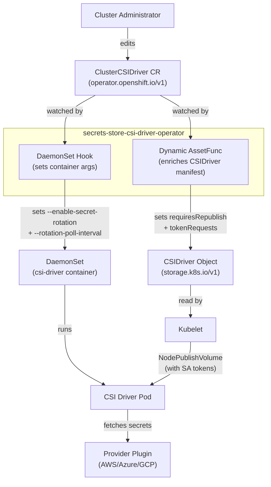
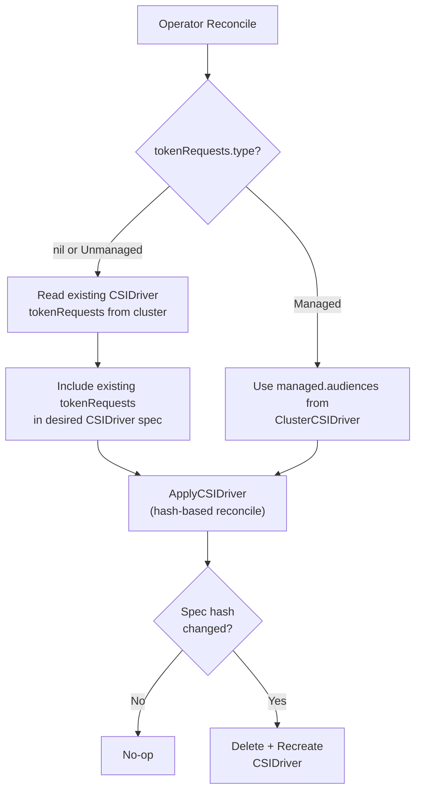

# Configurable Secret Rotation and Workload Identity Federation for the Secrets Store CSI Driver

## Summary

This enhancement will extend the OpenShift Secrets Store CSI Driver Operator to
allow cluster administrators to configure secret rotation behavior (enable/disable,
polling interval) and workload identity federation (WIF) token audiences through
the `ClusterCSIDriver` custom resource. These settings will be dynamically
propagated by the operator to both the `storage.k8s.io/v1` `CSIDriver` object and
the driver's node DaemonSet, replacing the current hardcoded defaults and enabling
multi-cloud WIF scenarios without requiring manual edits to operand manifests.

## Motivation

The Secrets Store CSI Driver was GA'd in OpenShift 4.17 (see
[csi-secrets-store.md](/enhancements/storage/csi-secrets-store.md)) with hardcoded
secret rotation enabled at a fixed 2-minute poll interval. While these defaults are
reasonable for many workloads, they present two problems:

1. **No user control over rotation behavior.** Administrators cannot disable rotation
   for workloads that do not need it (saving unnecessary provider API calls), nor can
   they tune the polling interval for environments that need faster or slower rotation.

2. **No support for workload identity federation.** Cloud providers (AWS, Azure, GCP)
   support federated identity using pod-bound service account tokens. The upstream
   Secrets Store CSI Driver [v1.6.0](https://github.com/kubernetes-sigs/secrets-store-csi-driver/releases/tag/v1.6.0)
   replaced its internal rotation controller with kubelet-driven
   [`requiresRepublish`](https://secrets-store-csi-driver.sigs.k8s.io/topics/secret-auto-rotation.html)
   and added [`tokenRequests`](https://kubernetes.io/docs/reference/generated/kubernetes-api/v1.28/#csidriverspec-v1-storage-k8s-io)
   support in the `CSIDriver` spec, but the OpenShift operator does not yet expose
   these capabilities to administrators.

### User Stories

- As a cluster administrator, I want to disable automatic secret rotation for
  workloads that use static secrets, so that the driver does not make unnecessary
  provider API calls that may count against rate limits.

- As a cluster administrator, I want to configure the rotation polling interval
  so that I can tune the trade-off between secret freshness and provider API load
  for my cluster's workloads.

- As a platform engineer, I want to configure `tokenRequests` audiences on the
  `CSIDriver` object through the operator configuration, so that pods can use
  workload identity federation to authenticate with AWS STS, Azure AD, or GCP IAM
  when fetching secrets from external vaults.

- As a multi-cloud operator, I want to configure multiple token audiences on a single
  Secrets Store CSI Driver instance, so that different workloads on the same cluster
  can federate identity with different cloud providers (e.g. AWS and Azure
  simultaneously).

- As a cluster administrator, I want my rotation and token configuration to persist
  across operator upgrades and pod restarts without manual re-intervention.

### Goals

- Allow administrators to enable or disable secret rotation via `ClusterCSIDriver`.
- Allow administrators to configure the rotation polling interval via `ClusterCSIDriver`.
- Allow administrators to configure `tokenRequests` (audience + optional expiration)
  for workload identity federation via `ClusterCSIDriver`.

### Non-Goals

- This enhancement does not add automatic detection of which cloud provider a
  cluster runs on to auto-configure token audiences. Administrators must explicitly
  configure the audiences for their environment.
- This enhancement does not modify the upstream Secrets Store CSI Driver or
  add features beyond what upstream v1.6.0 provides.
- This enhancement does not cover provider-specific configuration (e.g. Azure Key
  Vault, AWS Secrets Manager, HashiCorp Vault). Provider plugins are installed
  separately.

## Proposal

This proposal will extend the `ClusterCSIDriver` API with a new `SecretsStore`
driver configuration type and update the operator to dynamically propagate these
settings to the CSI driver operand.

### High-Level Changes

1. **API extension**: Add `SecretsStore` to the `CSIDriverConfigSpec` discriminated
   union in `openshift/api`, defining `secretRotation` and `tokenRequests` fields.

2. **Dynamic `CSIDriver` object management**: Replace the static `csidriver.yaml`
   with a dynamic `AssetFunc` that programmatically sets
   `spec.requiresRepublish` and `spec.tokenRequests` on the `CSIDriver` object
   based on `ClusterCSIDriver` configuration.

3. **Dynamic DaemonSet argument injection**: Add a `DaemonSetHookFunc` that sets
   `--enable-secret-rotation` and `--rotation-poll-interval` container arguments
   on the driver DaemonSet based on `ClusterCSIDriver` configuration.

### Workflow Description

**Cluster administrator** is responsible for managing CSI driver
configuration.

#### High-Level Architecture



#### tokenRequests Type Flow



#### Enabling Workload Identity Federation

The `tokenRequests` field uses a `type` discriminator to control whether the
operator manages the `CSIDriver.spec.tokenRequests` field or preserves existing
user-configured values.

**Why `tokenRequests.type` exists**: Some clusters already have manually patched
`tokenRequests` on the CSIDriver object (e.g., Azure WIF audiences configured
before this feature existed). On upgrade, the operator will add `requiresRepublish: true`
to the desired CSIDriver spec, changing the spec-hash and triggering a
delete+recreate. Without the type field, this would wipe any existing
tokenRequests and disrupt WIF. The `"Unmanaged"` type ensures existing
configurations are preserved until the administrator explicitly opts in to
operator management.

**Migration workflow**:
- On upgrade, when `tokenRequests` is omitted, the operator preserves any
  existing tokenRequests on the CSIDriver.
- When ready, the administrator sets `tokenRequests.type: "Managed"` and
  populates `tokenRequests.managed.audiences` with the desired audiences.
- From that point, the operator is the sole source of truth for tokenRequests.
- Once set to `"Managed"`, the type cannot be reverted back to `"Unmanaged"`.

1. The cluster administrator edits the `ClusterCSIDriver` for
   `secrets-store.csi.k8s.io`:

   ```yaml
   apiVersion: operator.openshift.io/v1
   kind: ClusterCSIDriver
   metadata:
     name: secrets-store.csi.k8s.io
   spec:
     driverConfig:
       driverType: SecretsStore
       secretsStore:
         tokenRequests:
           type: Managed
           managed:
             audiences:
               - audience: "sts.amazonaws.com"
                 expirationSeconds: 3600
   ```

2. The operator will detect the `ClusterCSIDriver` change via the shared informer.
3. The `StaticResourceController` will call the dynamic `AssetFunc` which will
   read the `ClusterCSIDriver` configuration and generate a `CSIDriver` manifest
   with `spec.tokenRequests` populated from the audiences list.
4. `resourceapply.ApplyCSIDriver` will detect the spec hash difference and
   recreate the `CSIDriver` object with the new `tokenRequests`.
5. Kubelet will observe the updated `CSIDriver` and begin providing the requested
   service account tokens in the `volume_context` of `NodePublishVolume` calls.
6. The provider plugin will receive the token and use it for workload identity
   federation with the cloud provider.

#### Configuring Rotation

1. The cluster administrator edits the `ClusterCSIDriver`:

   ```yaml
   spec:
     driverConfig:
       driverType: SecretsStore
       secretsStore:
         secretRotation:
           type: Custom
           custom:
             rotationPollIntervalSeconds: 300
   ```

2. The operator will re-sync:
   - The dynamic `AssetFunc` will set `requiresRepublish: true` on the `CSIDriver`.
   - The `DaemonSetHookFunc` will set `--enable-secret-rotation=true` and
     `--rotation-poll-interval=5m0s` (from `rotationPollIntervalSeconds: 300`) on the driver container.
3. The DaemonSet pods will be rolling-updated with the new arguments.
4. Kubelet will periodically call `NodePublishVolume` (because `requiresRepublish`
   is true), and the driver will re-fetch secrets from the provider if the cache
   window (5 minutes) has elapsed.

#### Disabling Rotation

1. The cluster administrator sets `secretRotation.type: "None"`.
2. The operator will set `requiresRepublish: false` on the `CSIDriver` and
   `--enable-secret-rotation=false` on the DaemonSet.
3. Kubelet will stop periodic `NodePublishVolume` calls. Secrets will only be
   fetched at initial pod mount time.

### API Extensions

This enhancement adds a new `SecretsStore` variant to the existing
`CSIDriverConfigSpec` discriminated union in `operator.openshift.io/v1`.

A top-level CEL rule on `ClusterCSIDriver` enforces that the resource name and
`driverType` are consistent (with a `has()` guard for minimal CRs that omit
`driverConfig` entirely):

```go
// +kubebuilder:validation:XValidation:rule="!has(self.spec.driverConfig) || (self.spec.driverConfig.driverType == 'SecretsStore' ? self.metadata.name == 'secrets-store.csi.k8s.io' : (self.metadata.name != 'secrets-store.csi.k8s.io' || self.spec.driverConfig.driverType == ''))",message="metadata.name 'secrets-store.csi.k8s.io' requires driverType 'SecretsStore', and driverType 'SecretsStore' requires metadata.name 'secrets-store.csi.k8s.io'"
type ClusterCSIDriver struct { ... }
```

```go
// +kubebuilder:validation:Enum="";AWS;Azure;GCP;IBMCloud;vSphere;SecretsStore
type CSIDriverType string

// +kubebuilder:validation:XValidation:rule="has(self.driverType) && self.driverType == 'SecretsStore' ? has(self.secretsStore) : !has(self.secretsStore)",message="secretsStore must be set if driverType is 'SecretsStore', but remain unset otherwise"
type CSIDriverConfigSpec struct {
    // ... existing fields (aws, azure, gcp, ibmcloud, vSphere) ...

    // secretsStore is used to configure the Secrets Store CSI driver.
    // +optional
    SecretsStore *SecretsStoreCSIDriverConfigSpec `json:"secretsStore,omitempty"`
}

// SecretsStoreCSIDriverConfigSpec defines properties that can be configured
// for the Secrets Store CSI driver.
// +kubebuilder:validation:MinProperties=1
// +kubebuilder:validation:XValidation:rule="!has(oldSelf.tokenRequests) || oldSelf.tokenRequests.type != 'Managed' || (has(self.tokenRequests) && self.tokenRequests.type == 'Managed')",message="tokenRequests cannot be removed when type is Managed"
type SecretsStoreCSIDriverConfigSpec struct {
    // secretRotation controls automatic secret rotation behavior.
    // When omitted, secret rotation is enabled with a default poll interval
    // of 2 minutes.
    // +optional
    SecretRotation *SecretsStoreSecretRotation `json:"secretRotation,omitempty"`

    // tokenRequests controls service account token configuration for
    // workload identity federation (WIF) with cloud providers.
    // +optional
    TokenRequests *SecretsStoreTokenRequests `json:"tokenRequests,omitempty"`
}

// TokenRequestsType determines how the operator manages the tokenRequests
// field on the storage.k8s.io CSIDriver object.
// +kubebuilder:validation:Enum=Managed;Unmanaged
type TokenRequestsType string

const (
    // TokenRequestsManaged means the operator uses the audiences list
    // as the sole source of truth for the CSIDriver.spec.tokenRequests field.
    TokenRequestsManaged TokenRequestsType = "Managed"

    // TokenRequestsUnmanaged means the operator preserves any existing
    // tokenRequests already configured on the CSIDriver object and does not
    // overwrite them.
    TokenRequestsUnmanaged TokenRequestsType = "Unmanaged"
)

// SecretsStoreTokenRequests configures how service account tokens are
// provided to the Secrets Store CSI driver for workload identity federation.
// +kubebuilder:validation:XValidation:rule="has(self.type) && self.type == 'Managed' ? has(self.managed) : !has(self.managed)",message="managed must be set when type is 'Managed', and must not be set otherwise"
// +kubebuilder:validation:XValidation:rule="!has(oldSelf.type) || oldSelf.type != 'Managed' || self.type == 'Managed'",message="type cannot be changed from Managed back to Unmanaged"
// +union
type SecretsStoreTokenRequests struct {
    // type determines how the operator manages tokenRequests on the
    // CSIDriver object.
    // When "Unmanaged", existing tokenRequests on the CSIDriver are preserved
    // and the managed field is not used.
    // When "Managed", the operator sets tokenRequests from the audiences
    // specified in the managed field, replacing any previously configured values.
    // Once set to "Managed", type cannot be reverted back to "Unmanaged".
    // +unionDiscriminator
    // +required
    Type TokenRequestsType `json:"type"`

    // managed holds configuration for operator-managed tokenRequests.
    // Only valid when type is "Managed".
    // +optional
    Managed *ManagedTokenRequests `json:"managed,omitempty"`
}

// ManagedTokenRequests holds the configuration for operator-managed
// service account token requests.
type ManagedTokenRequests struct {
    // audiences specifies service account token audiences that kubelet will
    // provide to the CSI driver during NodePublishVolume calls. These tokens
    // enable workload identity federation (WIF) with cloud providers such as
    // AWS, Azure, and GCP.
    // +optional
    // +listType=atomic
    // +kubebuilder:validation:MaxItems=10
    Audiences []SecretsStoreTokenRequest `json:"audiences,omitempty"`
}

// SecretRotationType determines the secret rotation behavior for the
// Secrets Store CSI driver.
// +kubebuilder:validation:Enum=None;Custom
type SecretRotationType string

const (
    // SecretRotationNone disables automatic secret rotation. Secrets are only
    // fetched at initial pod mount time.
    SecretRotationNone SecretRotationType = "None"

    // SecretRotationCustom enables automatic secret rotation with the
    // configuration specified in the custom field.
    SecretRotationCustom SecretRotationType = "Custom"
)

// SecretsStoreSecretRotation configures the automatic secret rotation
// behavior for the Secrets Store CSI driver.
// +kubebuilder:validation:XValidation:rule="has(self.type) && self.type == 'Custom' ? has(self.custom) : !has(self.custom)",message="custom must be set when type is 'Custom', and must not be set otherwise"
// +union
type SecretsStoreSecretRotation struct {
    // type determines the secret rotation behavior.
    // When "None", secret rotation is disabled and secrets are only fetched
    // at initial pod mount time.
    // When "Custom", secret rotation is enabled with the configuration
    // specified in the custom field.
    // +unionDiscriminator
    // +required
    Type SecretRotationType `json:"type"`

    // custom holds the custom rotation configuration.
    // Only valid when type is "Custom".
    // +optional
    Custom *CustomSecretRotation `json:"custom,omitempty"`
}

// CustomSecretRotation holds configuration for custom secret rotation behavior.
type CustomSecretRotation struct {
    // rotationPollIntervalSeconds is the minimum time in seconds between
    // secret rotation attempts. The driver skips provider calls if less than
    // this interval has elapsed since the last successful rotation.
    // When omitted, the platform chooses a reasonable default (currently 120).
    // +default=120
    // +optional
    RotationPollIntervalSeconds *int32 `json:"rotationPollIntervalSeconds,omitempty"`
}

// SecretsStoreTokenRequest specifies a service account token audience
// configuration for workload identity federation (WIF) with the Secrets
// Store CSI driver.
type SecretsStoreTokenRequest struct {
    // audience is the intended audience of the service account token.
    // An empty string means the issued token will use the kube-apiserver's
    // default APIAudiences.
    // +kubebuilder:validation:MinLength=0
    // +kubebuilder:validation:MaxLength=253
    // +required
    Audience *string `json:"audience,omitempty"`

    // expirationSeconds is the requested duration of validity of the
    // service account token. The token issuer may return a token with
    // a different validity duration.
    // When omitted, the token expiration is determined by the kube-apiserver
    // (defaults to 1 hour). Must be at least 600 seconds (10 minutes) and
    // no more than 4294967296 (1 << 32) seconds.
    // +kubebuilder:validation:Minimum=600
    // +kubebuilder:validation:Maximum=4294967296
    // +optional
    ExpirationSeconds *int64 `json:"expirationSeconds,omitempty"`
}
```

#### Example ClusterCSIDriver YAML

```yaml
apiVersion: operator.openshift.io/v1
kind: ClusterCSIDriver
metadata:
  name: secrets-store.csi.k8s.io
spec:
  managementState: Managed
  driverConfig:
    driverType: SecretsStore
    secretsStore:
      secretRotation:
        type: Custom
        custom:
          rotationPollIntervalSeconds: 300
      tokenRequests:
        type: Managed
        managed:
          audiences:
            - audience: "sts.amazonaws.com"
              expirationSeconds: 3600
            - audience: "api://AzureADTokenExchange"
```

#### Resulting CSIDriver Object

The operator will generate the following `storage.k8s.io/v1` `CSIDriver`:

```yaml
apiVersion: storage.k8s.io/v1
kind: CSIDriver
metadata:
  name: secrets-store.csi.k8s.io
spec:
  podInfoOnMount: true
  attachRequired: false
  fsGroupPolicy: File
  volumeLifecycleModes:
    - Ephemeral
  requiresRepublish: true
  tokenRequests:
    - audience: "sts.amazonaws.com"
      expirationSeconds: 3600
    - audience: "api://AzureADTokenExchange"
```

#### Validation Rules

- `secretsStore` must be set if and only if `driverType` is `SecretsStore`
- `rotationPollIntervalSeconds` defaults to 120 seconds (2 minutes). No minimum
  is enforced at the API level; the administrator is trusted to choose an appropriate value.
- `tokenRequests.type` is immutable once set to `"Managed"`:
  - The `type` field cannot be changed from `"Managed"` back to `"Unmanaged"` (CEL
    transition rule on the struct: `!has(oldSelf.type) || oldSelf.type != 'Managed' || self.type == 'Managed'`).
  - The `tokenRequests` struct cannot be removed from `secretsStore` if its `type`
    was `"Managed"` (CEL rule on the parent struct prevents removal).
  - This is a one-way transition: once the operator takes ownership of `tokenRequests`,
    the administrator cannot revert to unmanaged mode. To clear WIF configuration,
    set `type: "Managed"` with `managed.audiences` set to an empty list instead.
- `secretRotation` and `tokenRequests` are discriminated unions:
  - `secretRotation.type` is the discriminator with values `"None"` (disabled) or `"Custom"` (enabled with config).
  - `tokenRequests.type` is the discriminator with values `"Managed"` or `"Unmanaged"`.
  - CEL rules enforce that the associated branch field (`custom`/`managed`) is set if and only if
    the discriminator selects it.

### Topology Considerations

#### Hypershift / Hosted Control Planes

N/A

#### Standalone Clusters

N/A

#### Single-node Deployments or MicroShift

The Secrets Store CSI Driver Operator is not part of MicroShift yet.

#### OpenShift Kubernetes Engine

N/A

### Implementation Details/Notes/Constraints

#### Upstream `requiresRepublish` Mechanism

Starting with Secrets Store CSI Driver v1.6.0, the upstream project replaced the
internal rotation controller with the kubelet-native `requiresRepublish` field. 
When `requiresRepublish: true` is set on the `CSIDriver`
object, kubelet periodically calls `NodePublishVolume` for already-mounted volumes.
The driver then:

1. Checks if the cache window (`--rotation-poll-interval`) has elapsed since the
   last provider call.
2. If yes, contacts the provider to fetch the latest secret version and updates
   the mounted volume.
3. If no, returns success immediately without contacting the provider.


#### Dynamic Asset Generation

The operator uses library-go's `StaticResourceController` to manage the
`CSIDriver` object. A custom `AssetFunc` will be added that:

1. Reads the base `csidriver.yaml` manifest.
2. Deserializes it into a typed `storagev1.CSIDriver` object using
   `resourceread.ReadCSIDriverV1OrDie`.
3. Reads the `ClusterCSIDriver` via a lister to obtain the desired
   `requiresRepublish` and `tokenRequests` values.
4. Sets these fields on the `CSIDriver` object.
5. Serializes back to JSON for the `StaticResourceController` to apply.

This will work because `StaticResourceController` will be wired to the
`ClusterCSIDriver` informer, so any change to the CR will trigger a re-sync. The
downstream `resourceapply.ApplyCSIDriver` will detect spec changes via
annotation-based spec hashing and recreate the `CSIDriver` object as needed (since
`CSIDriver.spec` is effectively immutable in Kubernetes).

#### DaemonSet Hook

The operator will use a `DaemonSetHookFunc` to set the `--enable-secret-rotation` and
`--rotation-poll-interval` arguments on the csi-driver container. The hook will
read the `ClusterCSIDriver` via a lister and find/replace arguments by their
`--flag=` prefix.

The `CSIDriverNodeServiceController` will be configured with the
`ClusterCSIDriver` informer as an optional informer, so that DaemonSet
reconciliation will trigger immediately when the administrator changes the
`ClusterCSIDriver` configuration.

#### Default Behavior and Upgrade Safety

All new fields will have defaults that match the operator's current hardcoded
behavior:
- When `secretRotation` is omitted, the operator defaults to rotation enabled with a 2-minute poll interval
- When `secretRotation.type` is `"Custom"`, `rotationPollIntervalSeconds` defaults to `120`
- When `tokenRequests` is omitted, the operator preserves existing CSIDriver tokenRequests (Unmanaged behavior)

Clusters upgrading to the new operator version with no `driverConfig` set will see
**no change in behavior**. The operator will fall back to these defaults when the
`ClusterCSIDriver` does not specify a `SecretsStore` driver config.

##### What Happens to the API During Upgrade

Existing clusters install the operator with a minimal `ClusterCSIDriver`:

```yaml
apiVersion: operator.openshift.io/v1
kind: ClusterCSIDriver
metadata:
  name: secrets-store.csi.k8s.io
spec:
  managementState: Managed
```

On upgrade:

1. **Stored object does not change.** Kubernetes CRD defaults are applied only
   during create/update admission, not retroactively to stored objects. The
   `ClusterCSIDriver` in etcd will remain as-is with no `driverConfig` field.

2. **No nested defaults are injected.** Since `driverConfig` is entirely absent,
   the API server cannot inject sub-field defaults (like `secretRotation.type`
   or `tokenRequests.type`) into a struct that does not exist.

3. **Operator handles nil gracefully.** The operator code checks each level:
   - If `DriverType` is not `SecretsStore` (or empty): returns built-in defaults
     for rotation (`true`, `2m`) and preserves existing `CSIDriver.spec.tokenRequests`
     from the live cluster object.
   - If `SecretsStore` is nil: same behavior as above.
   - If `SecretRotation` is nil: uses built-in defaults (`--enable-secret-rotation=true`,
     `--rotation-poll-interval=2m`).
   - If `TokenRequests` is nil: preserves existing `CSIDriver.spec.tokenRequests`.

4. **DaemonSet is unchanged.** The DaemonSet hook returns the same defaults
   (`true`, `2m`) that are already hardcoded in the static `node.yaml` template.
   The `setArg` function finds the existing args and replaces them with the same
   values — resulting in a no-op update.

5. **Existing manually-patched tokenRequests are preserved.** If a cluster has
   manually configured `tokenRequests` on the `CSIDriver` object (e.g., Azure WIF
   with `api://AzureADTokenExchange`), the operator reads the live `CSIDriver`
   object and includes those tokenRequests in the desired spec. This prevents the
   spec-hash from changing and avoids an unnecessary delete+recreate.

##### How Users Can Start Using the New Configuration

After upgrade, administrators can opt-in to the new fields by editing the
`ClusterCSIDriver`:

```yaml
spec:
  managementState: Managed
  driverConfig:
    driverType: SecretsStore
    secretsStore:
      secretRotation:
        type: Custom
        custom:
          rotationPollIntervalSeconds: 300
      tokenRequests:
        type: Managed
        managed:
          audiences:
            - audience: "sts.amazonaws.com"
              expirationSeconds: 3600
```

Once `driverConfig` is set, the CRD schema defaults (e.g.,
`rotationPollIntervalSeconds: 120` inside `custom`) will apply to omitted
sub-fields during future updates. Since `secretRotation` and `tokenRequests`
are discriminated unions with required `type` fields, the administrator must
always specify the union discriminator when setting these fields.


### Risks and Mitigations

**Risk**: Setting `rotationPollIntervalSeconds` too low could overwhelm the external
secret provider with API calls.

**Mitigation**: OpenShift document will suggest users to choose a wise value.

### Drawbacks

- The `CSIDriver.spec` is effectively immutable in Kubernetes; changes require
  delete and recreate. `library-go`'s `ApplyCSIDriver` will handle this
  transparently via spec-hash annotations, but it will mean a brief window where
  the `CSIDriver` object does not exist during updates. In practice, this window
  will be negligible and will not affect running pods.

## Alternatives (Not Implemented)

Nothing considered.

## Open Questions [optional]

1. Should `requiresRepublish` on the `CSIDriver` object always be set to `true`,
   or should it mirror the value of `secretRotation.type`?

2. Should `expirationSeconds` enforce a minimum value of 600 (10 minutes)?

   - The minimum of 600 seconds is already enforced by the
   kube-apiserver's [TokenRequest API](https://kubernetes.io/docs/reference/kubernetes-api/authentication-resources/token-request-v1/) and [Doc](https://kubernetes-csi.github.io/docs/token-requests.html).

   - The upstream `storage.k8s.io/v1` CSIDriver type also does not enforce this at
   the CSIDriver spec level. We can document the constraint in the field comment.


## Test Plan

### Unit Tests

- Rotation config extraction: nil `driverConfig`, nil `secretsStore`, nil
  `secretRotation`, explicitly enabled, explicitly disabled, custom interval
  all return the correct enable/interval values.
- CSIDriver config mapping: `ClusterCSIDriver` settings correctly map to
  `requiresRepublish` boolean and `storagev1.TokenRequest` list.
- DaemonSet hook arg replacement: hook correctly sets/replaces
  `--enable-secret-rotation=` and `--rotation-poll-interval=` by prefix match.
- DaemonSet hook error handling: hook returns an error when the expected
  csi-driver container is not found.
- Dynamic asset func: `CSIDriver` manifest correctly receives
  `requiresRepublish` and `tokenRequests` fields from `ClusterCSIDriver` config.
- Namespace substitution: non-CSIDriver assets continue to have namespace
  replacement applied correctly.
- tokenRequests preservation on nil paths:
  - `DriverType != SecretsStore` with existing CSIDriver tokenRequests: existing
    tokenRequests are returned (not nil).
  - `DriverType == SecretsStore` but `SecretsStore` is nil with existing CSIDriver
    tokenRequests: existing tokenRequests are returned.
  - `DriverType != SecretsStore` with no existing CSIDriver: returns nil (no error).
  - `SecretsStore` is nil with no existing CSIDriver: returns nil (no error).

### API Integration Tests (CRD Validation)

**tokenRequests.type immutability:**
- Attempt to change `tokenRequests.type` from `"Managed"` to `"Unmanaged"`: rejected
  with error "type cannot be changed from Managed back to Unmanaged".
- Attempt to remove the `tokenRequests` struct entirely when `type` was `"Managed"`:
  rejected with error "tokenRequests cannot be removed when type is Managed".
- Transition from `"Unmanaged"` to `"Managed"`: allowed (one-way transition).
- Update `managed.audiences` while `type` remains `"Managed"`: allowed.
- Set `type` to `"Managed"` on first creation: allowed.

**Discriminated union validation:**
- `secretRotation.type: "Custom"` without `custom` field: rejected.
- `secretRotation.type: "None"` with `custom` field: rejected.
- `tokenRequests.type: "Managed"` without `managed` field: rejected.
- `tokenRequests.type: "Unmanaged"` with `managed` field: rejected.

### E2E Tests

**Secret Rotation scenarios:**
- No `driverConfig` set: operator uses defaults (`requiresRepublish: true`,
  `--enable-secret-rotation=true`, `--rotation-poll-interval=2m0s`).
- `secretRotation.type: "Custom"` with `custom.rotationPollIntervalSeconds: 300`:
  verify CSIDriver has `requiresRepublish: true` and DaemonSet has
  `--rotation-poll-interval=5m0s`.
- `secretRotation.type: "None"`: verify CSIDriver has `requiresRepublish: false`
  and DaemonSet has `--enable-secret-rotation=false`.
- Toggle rotation from None back to Custom: verify CSIDriver and DaemonSet
  revert to rotation-enabled state.

**tokenRequests migration scenarios:**
- Pre-existing manually patched tokenRequests on CSIDriver (Azure WIF) + upgrade
  with no `tokenRequests` configured in ClusterCSIDriver: verify existing
  tokenRequests are preserved on CSIDriver (Unmanaged default behavior).
- `tokenRequests.type: "Unmanaged"`: verify existing CSIDriver tokenRequests
  are preserved.
- `tokenRequests.type: "Managed"` with `managed.audiences`: verify
  CSIDriver.spec.tokenRequests is set from the audiences list.
- `tokenRequests.type: "Managed"` with empty `managed.audiences`: verify
  CSIDriver.spec.tokenRequests is cleared.
- Transition from Unmanaged to Managed: user sets type to Managed with
  managed.audiences, verify CSIDriver is updated to match.

**Multi-cloud WIF scenarios:**
- Multiple audiences (e.g., AWS + Azure): verify CSIDriver has both tokenRequests entries.
- Audience with custom expirationSeconds: verify expirationSeconds is propagated
  to CSIDriver.

**Upgrade scenarios (no driverConfig set on ClusterCSIDriver):**
- Minimal CR (`spec.managementState: Managed` only), no existing CSIDriver
  tokenRequests: verify operator applies defaults (`requiresRepublish: true`,
  rotation enabled at 2m) and CSIDriver has no tokenRequests.
- Minimal CR with pre-existing manually patched tokenRequests on CSIDriver
  (e.g., Azure WIF `api://AzureADTokenExchange`): verify existing tokenRequests
  are preserved, CSIDriver spec-hash does not change, no delete+recreate occurs.
- Minimal CR with pre-existing tokenRequests + DaemonSet: verify DaemonSet args
  remain unchanged (`--enable-secret-rotation=true`, `--rotation-poll-interval=2m`),
  no rolling update is triggered.
- `driverType` set to a non-SecretsStore value (e.g., AWS) with existing
  tokenRequests on CSIDriver: verify tokenRequests are still preserved.
- Upgrade from previous version with manually patched Azure WIF: no disruption,
  pods continue to mount secrets.
- Upgrade from previous version with no tokenRequests: defaults maintained, no
  behavior change.
- Post-upgrade opt-in: administrator sets `driverType: SecretsStore` with
  `tokenRequests.type: "Managed"` and `managed.audiences`, verify CSIDriver is
  updated to match and DaemonSet args are updated.

## Graduation Criteria

This feature will target GA directly.

### Dev Preview -> Tech Preview

N/A

### Tech Preview -> GA

N/A

### Removing a deprecated feature

N/A

## Upgrade / Downgrade Strategy

**Upgrade**: Clusters upgrading to the new operator version will see no behavior
change. The existing `ClusterCSIDriver` object (with only `managementState: Managed`)
remains unchanged in etcd — the new `driverConfig` field is not retroactively
injected. The operator handles the nil `driverConfig` by using built-in defaults
that match the previously hardcoded values:

| Component                             | Before Upgrade    | After Upgrade (no driverConfig) |
| ------------------------------------- | ----------------- | ------------------------------- |
| DaemonSet `--enable-secret-rotation=` | `true` (template) | `true` (operator default)       |
| DaemonSet `--rotation-poll-interval=` | `2m` (template)   | `2m` (operator default)         |
| CSIDriver `requiresRepublish`         | unset (nil)       | `true` (operator default)       |
| CSIDriver `tokenRequests`             | user-configured   | preserved from live object      |

**tokenRequests migration**: When `tokenRequests` is omitted (or `type` is
`"Unmanaged"`), the operator preserves any existing `tokenRequests` already
configured on the CSIDriver object (e.g., manually patched Azure WIF audiences).
This ensures no disruption to workload identity federation on upgrade.
The preservation works at every nil-check level — whether `driverConfig` is absent,
`driverType` is not `SecretsStore`, `secretsStore` is nil, or `tokenRequests` is nil,
the operator always reads the live `CSIDriver` object and includes its existing
`tokenRequests` in the desired spec.

To adopt operator-managed tokenRequests, the administrator must:
1. Set `tokenRequests.type: "Managed"` in the `ClusterCSIDriver`.
2. Populate `tokenRequests.managed.audiences` with the desired audiences.
3. Note: once `type` is set to `"Managed"`, it cannot be reverted back to `"Unmanaged"`.

To adopt the new configuration, the administrator must edit the `ClusterCSIDriver`
to set `driverType: SecretsStore` with the desired `secretsStore` configuration.
No changes are required to keep the existing behavior.

## Version Skew Strategy

The feature is be supported since OpenShift 5.0

## Operational Aspects of API Extensions

N/A

## Support Procedures

- **Detecting misconfiguration**: Check the `ClusterCSIDriver` status conditions.
  If the operator fails to apply the `CSIDriver` or DaemonSet, the `Degraded`
  condition will be set.

- **Verifying rotation config**: Inspect the DaemonSet args:
  ```bash
  oc get ds -n openshift-cluster-csi-drivers secrets-store-csi-driver-node -o jsonpath='{.spec.template.spec.containers[?(@.name=="csi-driver")].args}'
  ```

- **Verifying CSIDriver spec**: Inspect the `CSIDriver` object:
  ```bash
  oc get csidriver secrets-store.csi.k8s.io -o yaml
  ```
  Check that `spec.requiresRepublish` and `spec.tokenRequests` match the
  `ClusterCSIDriver` configuration.

- **Disabling the feature**: Set `driverConfig.secretsStore.secretRotation.type: "None"`
  to disable rotation, or set `tokenRequests.type: "Managed"` with empty
  `managed.audiences` to clear WIF configuration.


## Infrastructure Needed [optional]

No additional infrastructure is needed.

## Implementation History

- 2026-05-15: Initial proposal

## References

- [Secrets Store CSI Driver v1.6.0 Release Notes](https://github.com/kubernetes-sigs/secrets-store-csi-driver/releases/tag/v1.6.0)
- https://secrets-store-csi-driver.sigs.k8s.io/getting-started/upgrades#pre-v160
- [Upstream requiresRepublish PR](https://github.com/kubernetes-sigs/secrets-store-csi-driver/pull/1622)
- [Kubernetes CSIDriver API - requiresRepublish](https://kubernetes.io/docs/reference/generated/kubernetes-api/v1.28/#csidriverspec-v1-storage-k8s-io)
- [Kubernetes CSIDriver API - tokenRequests](https://kubernetes.io/docs/reference/generated/kubernetes-api/v1.28/#tokenrequest-v1-storage-k8s-io)
- [Upstream Secret Auto Rotation Documentation](https://secrets-store-csi-driver.sigs.k8s.io/topics/secret-auto-rotation.html)
- https://kubernetes-csi.github.io/docs/csi-driver-object.html
- [Kubernetes CSI Token Requests](https://kubernetes-csi.github.io/docs/token-requests.html)
- [Kubernetes TokenRequest API](https://kubernetes.io/docs/reference/kubernetes-api/authentication-resources/token-request-v1/)
- https://kubernetes-csi.github.io/docs/token-requests.html#status