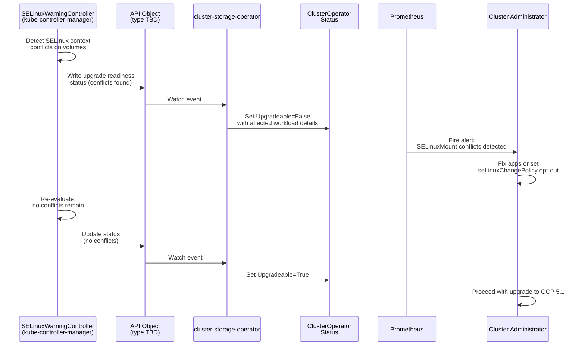

# SELinuxMount GA Upgrade Readiness

## Summary

This enhancement prepares OpenShift 5.0 for the SELinuxMount
feature going GA in Kubernetes 1.37 / OpenShift 5.1. When
SELinuxMount becomes GA, volumes will be mounted with SELinux
mount options by default instead of the container runtime
recursively relabeling files via `chcon`. This behavioral
change can break workloads that share volumes across pods or
containers with different SELinux contexts. To protect clusters
from upgrade-induced breakage, this enhancement adds upgrade
readiness checks that mark a 5.0 cluster as non-upgradeable when
it contains workloads incompatible with SELinuxMount GA,
raises alerts to inform administrators, and provides guidance
on remediation.

## Motivation

The upstream Kubernetes SELinuxMount feature
[KEP 1710](https://github.com/kubernetes/enhancements/issues/1710)
changes how SELinux labels are applied to volumes.
This is a breaking change for workloads that:

- Share the same PersistentVolume between multiple pods
  running with different SELinux contexts.
- Mount the same volume in multiple containers within a single
  pod using different SELinux contexts.

If a cluster upgrades to OCP 5.1 with such
incompatible workloads, pods may fail to start because the
volume is already mounted with a different SELinux context.

We must block upgrades from OCP 5.0 to 5.1 when the cluster
contains workloads that would break, give administrators
visibility into which workloads are affected, and provide
clear remediation steps.

### User Stories

* As a cluster administrator, I want to see which
  applications (pods) in my cluster would break before
  upgrading to OCP 5.1 with SELinuxMount GA, so that I can
  proactively fix or opt them out before attempting the
  upgrade.

* As a cluster administrator, I want the cluster to prevent
  me from upgrading to OCP 5.1 when SELinuxMount GA would
  break my applications, so that I can rely on OpenShift
  marking the cluster `Upgradeable=True` only when the
  upgrade is safe.

### Goals

- Block upgrades from OCP 5.0 to OCP 5.1 when the cluster
  contains workloads incompatible with SELinuxMount GA.
- Raise Prometheus alerts identifying workloads that would
  break under SELinuxMount GA.
- Provide clear documentation on how to remediate affected
  workloads (fix applications or opt out via
  `seLinuxChangePolicy`).
- Ensure the upgrade block is automatically lifted once all
  incompatible workloads are resolved.

### Non-Goals

- Implementing the SELinuxMount feature itself (that is
  upstream Kubernetes work tracked by STOR-2719).
- Implementing the `seLinuxChangePolicy` namespace-level
  defaulting mechanism (covered by the
  [storage-performant-security-policy](storage-performant-security-policy.md)
  enhancement).

## Proposal

The solution consists of three components working together:

1. **SELinuxWarningController carry patch** in
   `kube-controller-manager`: The upstream Kubernetes
   `SELinuxWarningController` already detects pods that use
   volumes with conflicting SELinux contexts. An
   OpenShift-specific `<carry>` patch will extend this
   controller to write upgrade readiness status to *an API
   object*, indicating whether incompatible workloads exist in
   the cluster.

2. **cluster-storage-operator (CSO) upgrade check**: CSO will
   watch *the API object* written by the
   `SELinuxWarningController` and set its `Upgradeable`
   condition accordingly. When incompatible workloads are
   detected, CSO sets `Upgradeable=False` with a message
   describing the affected workloads and remediation steps.
   When all issues are resolved, CSO sets
   `Upgradeable=True`.

3. **Prometheus alerts**: Alerts will be defined to notify
   administrators about workloads incompatible with
   SELinuxMount GA, providing actionable information about
   which pods and volumes are affected.

What is *the actual API object* is currently open. Ideas:

* A ConfigMap in a shared namespace, such as
  `openshift-config/selinux-conflicts`. Does KCM have permissions to do so?
* Directly cluster-storage-operator CR
  `storages.operator.openshift.io` named `cluster`. KCM
  for sure does not have permissions to do so. And the
  CR is available only when Storage capability is enabled,
  so it would add some error cases to KCM when the capability
  is not enabled.

In 5.1, we remove the KCM carry patch, i.e. KCM will
stop updating the API object. 5.1 CSO will remove the
object completely and clear any `Upgradeable: false`
conditions.

### Workflow Description

**cluster administrator** is a human user responsible for
maintaining an OpenShift cluster.

**SELinuxWarningController** is a controller running in
kube-controller-manager that detects SELinux context
conflicts on volumes.

**cluster-storage-operator (CSO)** is the operator managing
storage components in OpenShift.

1. The SELinuxWarningController continuously monitors pods
   and their volume mounts for SELinux context conflicts.
2. When the controller detects pods that share a volume with
   different SELinux contexts, it writes this information to
   an API object. With some throttling, so it does not get
   updated too often.
3. CSO watches this API object and evaluates whether the
   cluster is safe to upgrade.
4. If incompatible workloads exist, CSO sets
   `Upgradeable=False` on its ClusterOperator status with a
   descriptive message.
5. Prometheus alerts fire to notify the cluster
   administrator.
6. The cluster administrator reviews the alerts and either:
   - Fixes the application to use consistent SELinux
     contexts across pods sharing a volume, or
   - Opts out of SELinuxMount for the affected
     namespace/pods by setting `seLinuxChangePolicy` via the
     `storage.openshift.io/selinux-change-policy` namespace
     label (see the
     [storage-performant-security-policy](storage-performant-security-policy.md)
     enhancement).
7. Once all conflicts are resolved, the
   SELinuxWarningController updates the API object.
8. CSO detects the change and sets `Upgradeable=True`.
9. The cluster administrator can now safely upgrade to
   OCP 5.1.
10. During the upgrade to 5.1, a newly started 5.1 KCM stops updating
    the API object. A newly started CSO deletes it + removes any
    `Upgradeable: false` condition caused by it.

### API Extensions

This enhancement does not add new CRDs, admission or
conversion webhooks, aggregated API servers, or finalizers.

The SELinuxWarningController carry patch will write to an
existing API object type to communicate upgrade readiness
status. The specific API object type is an open question
(see Open Questions section).

### Topology Considerations

#### Hypershift / Hosted Control Planes

In Hypershift, the kube-controller-manager runs in the
management cluster. The SELinuxWarningController carry patch
must be able to detect SELinux context conflicts for pods in
the guest cluster.

The API object used to signal presence of unsafe workloads must be
in the guest cluster, because that's the only cluster that KCM sees.

CSO already has a kubeconfig to the guest cluster, so it can read
the object there easily.

#### Standalone Clusters

No special considerations are needed.

#### Single-node Deployments or MicroShift

No special considerations are needed for SNO.

MicroShift does not use cluster-storage-operator or the
ClusterOperator upgrade mechanism, so this enhancement does
not apply to MicroShift.

#### OpenShift Kubernetes Engine

This enhancement does not depend on features excluded from
the OKE product offering.

### Implementation Details/Notes/Constraints

The implementation involves changes to two repositories:

1. **openshift/kubernetes** (carry patch):
   - Modify the `SELinuxWarningController` in
     kube-controller-manager to write upgrade readiness
     information to an API object when SELinux context
     conflicts are detected on volumes.
   - The carry patch must be maintainable across Kubernetes
     rebases.

2. **openshift/cluster-storage-operator**:
   - Add a controller that watches the API object written
     by the SELinuxWarningController.
   - Based on the contents, set the `Upgradeable` condition
     on the `storage` ClusterOperator.
   - Define Prometheus alert rules for workloads
     incompatible with SELinuxMount GA.
   - Potentially add RBAC rules to the CSO to be able to
     access the API object.

The feature must be gated behind a feature gate
`SELinuxMountGAReadiness`. It is expected to graduate to GA in 5.0.

### Risks and Mitigations

**Risk**: The carry patch in openshift/kubernetes increases
maintenance burden across Kubernetes rebases.
**Mitigation**: Keep the carry patch minimal and
well-isolated. The upstream SELinuxWarningController
provides the detection logic; the carry patch only adds the
API object write.

**Risk**: False negatives could allow upgrades that break
workloads.
**Mitigation**: The SELinuxWarningController analyzes
currently running pods. Workloads not running at the time of
the check may not be detected. Documentation should advise
administrators to ensure all relevant workloads are running
before attempting an upgrade.

### Drawbacks

This enhancement introduces a carry patch in
openshift/kubernetes, which adds maintenance burden during
Kubernetes rebases. However, the carry patch is necessary
because the upstream SELinuxWarningController does not
include upgrade-blocking semantics specific to OpenShift's
ClusterOperator upgrade mechanism.

## Alternatives (Not Implemented)

**Implement detection entirely in cluster-storage-operator**:
CSO could directly watch all pods and PersistentVolumes to
detect SELinux context conflicts, rather than relying on
the SELinuxWarningController carry patch. This was rejected
because it would duplicate the detection logic already
present in the upstream controller and would require CSO to
have broader RBAC permissions and huge memory overhead.

**Use kube-controller-manager-operator**: Implement the
`Upgradeable: false` as condition in KCM-o ClusterOperator
and not CSO. This is a viable alternative, we've chosen
CSO only because we're more familiar with it and `SELinuxMount`
is a sig-storage feature.

**Use a standalone controller/operator**: A dedicated
operator could handle both detection and upgrade blocking.
This was rejected because it would add another component to
deploy and manage, and the SELinuxWarningController in
kube-controller-manager already has the necessary
information and logic.

**Block upgrade based on metrics**: KCM already reports
a metric with all conflicting Pods. CSO could read the metric
and decide its own `Upgradeable` condition based on it.
However, CSO would be the first component to do that. It
would need to:

* Scrape directly all KCM Pods, because Prometheus is an
  optional component and can be unavailable in a cluster.
* Find all KCM Pods, as they run on different places in
  standalone OCP and in a hosted control plane.
* Have necessary RBAC rules to scrape KCM metrics.
* Parse the metrics to find what it needs.

There are attempts to read metrics in an operator:
* [etcd-operator](https://github.com/openshift/cluster-etcd-operator/blob/c0614ca08f4f22f9c11684c7e1f05da5f57389d6/pkg/operator/metriccontroller/client.go#L46)
* [kcm-operator](https://github.com/openshift/cluster-kube-controller-manager-operator/blob/ca150c42a7982509b8bba34080308cff00c09310/pkg/operator/gcwatchercontroller/gcwatcher_controller.go#L150)

But both of them require Prometheus to run in the cluster and
Prometheus is an optional component. We should not leave clusters
without Prometheus behind and let them break during upgrade to 5.1.

Even platform monitoring folks suggested against reading metrics
[on slack](https://redhat-internal.slack.com/archives/C0VMT03S5/p1764751289740489?thread_ts=1764669221.888849&cid=C0VMT03S5).

For the reasons above, we've decided that a carry patch would
be much smaller and less problematic.

## Open Questions [optional]

1. What API object should the SELinuxWarningController carry
   patch write to in order to communicate upgrade readiness
   to cluster-storage-operator? Options include a ConfigMap
   in a well-known namespace, or a status condition on an
   existing Custom Resource (Storage CR?).
   The choice affects RBAC requirements for
   kube-controller-manager and the watch complexity in CSO.

2. What more e2e tests to add.

3. What should be the update frequency of the API object.
   On a busy cluster, conflicting Pods can come and
   disappear quickly. Idea: the carry patch in KCM
   updates the object every minute. It clears it only
   when for the whole minute there were no conflicting
   Pods. For that, we would need the cache introduced in
   https://github.com/kubernetes/kubernetes/pull/138981.

## Test Plan

Kubernetes already has comprehensive e2e tests for
SELinuxWarningController that create conflicting
Pods and test that KCM SELinuxWarningController emits
the right metrics. They would lead to the cluster
to get Upgradeable=false. However, the tests may be too
quick to be noticed by CSO and we can't extend upstream
tests to wait for OCP CRs to get updated (i.e. get
`Upgradeable: false`).

We think it would be waste of time to re-implement the
same tests and just wait for the cluster getting
un-upgradeable on the OCP level.

Proposing just a single new test:

* `[Serial]` Get the cluster un-upgradeable:
    1. Run two pods that share a RWO volume whose CSI
       driver supports SELinuxMount, each having a
       different SELinux label.
    2. Wait for the cluster to get `Upgradeable: false`.
    3. Remove one of the Pods.
    4. Wait for the cluster to get `Upgradeable: true`.

The test will use the default CSI driver on each platform.
The test will not run on bare metal, which does not have
a default storage available.
The default CSI drivers in all clouds already support SELinuxMount.

## Graduation Criteria

### Dev Preview -> Tech Preview

The KEP is fully implemented, including e2e test(s).

### Tech Preview -> GA

The test pass the current graduation criteria:
* All tests run at least 7 times per week.
* All tests run at least 14 times per supported platform.
* 95% pass rate.

However, **we may have just 1 test instead of 5.**
Or suggest new tests.

### Removing a deprecated feature

This feature is tied to the SELinuxMount GA transition.
It can be removed in 5.1.

## Upgrade / Downgrade Strategy

**Upgrade to OCP 5.0**: When OCP 5.0 is installed or
upgraded to, the SELinuxWarningController carry patch and
CSO upgrade check become active. If the cluster has
incompatible workloads, the Upgradeable condition will be
set to False. This does not block the upgrade to 5.0
itself, only the subsequent upgrade to 5.1.

**Upgrade from OCP 5.0 to 5.1**: This is the upgrade that
the enhancement protects. The cluster will not be marked as
upgradeable until all SELinux context conflicts are
resolved.

During the upgrade, a newly started 5.1 KCM stops updating
the API object. A newly started CSO deletes it + removes any
`Upgradeable: false` condition caused by it.

**Downgrade from OCP 5.0**: If a cluster downgrades from
5.0 to a previous version, the carry patch and CSO
controller will no longer be present. Cluster admin
may need to perform manual cleanup of the API object,
as the old KCM won't know about it.

Leaving the API object as it is should not harm anything.
The old CSO will ignore it.

## Version Skew Strategy

During an upgrade to OCP 5.0, the kube-controller-manager
and cluster-storage-operator may be at different versions
temporarily. This is safe because:

- If the SELinuxWarningController carry patch is active but
  CSO has not been updated yet, the API object will be
  written but not consumed. The old CSO will not set the
  Upgradeable condition based on it, which is acceptable
  because the upgrade to 5.1 is not imminent during a 5.0
  upgrade.
- If CSO is updated before kube-controller-manager, CSO
  will not find the API object and will default to
  `Upgradeable=True`, which is safe because the upgrade to
  5.1 cannot happen until the 5.0 upgrade completes.

## Operational Aspects of API Extensions

This enhancement does not add new API extensions (CRDs,
webhooks, aggregated API servers, or finalizers). The API
object used for signaling between the
SELinuxWarningController and CSO uses an existing API type
and does not impact API throughput, availability, or
scalability.

## Support Procedures

- **Detecting issues**: If the `storage` ClusterOperator
  shows `Upgradeable=False`, the condition message will
  describe how to find the workloads that caused SELinux
  context conflicts. The Prometheus alert
  (name TBD) will also fire with details about how to find
  affected Pods and namespaces.

- **Remediation**:
  1. Identify affected workloads from the ClusterOperator
     condition message or Prometheus alert.
  2. For each affected workload, either:
     - Fix the application to use consistent SELinux
       contexts across all pods sharing a volume.
     - Opt out by setting
       `storage.openshift.io/selinux-change-policy` label
       on the affected namespace (see the
       [storage-performant-security-policy](storage-performant-security-policy.md)
       enhancement).
  3. Verify that the ClusterOperator condition returns to
     `Upgradeable=True`.

- **If the SELinuxWarningController is not functioning**:
  Check kube-controller-manager logs for errors related to
  the SELinuxWarningController. If the controller is not
  running, the API object will not be updated, and CSO may
  default to `Upgradeable=True`. This means the upgrade
  safety check will not be active, and manual verification
  of workload compatibility is recommended before upgrading.

## Infrastructure Needed [optional]

No new infrastructure is needed. The enhancement can use
existing OpenShift CI infrastructure for testing.
