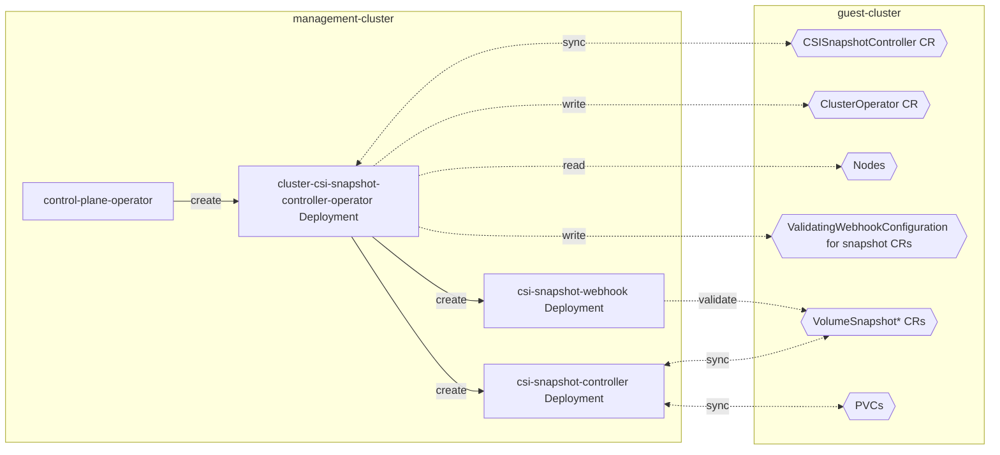
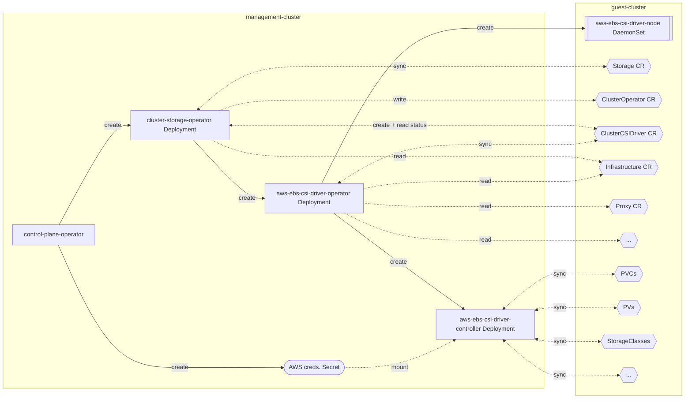

# Running storage operators in HyperShift management cluster

## Summary

This enhancement describes how OCP storage components will run in HyperShift's managed control plane and in the guest
cluster.

The components currently are:

* cluster-csi-snapshot-controller-operator and its operand, csi-snapshot-controller.
* cluster-storage operator and its operand aws-ebs-csi-driver-operator and its operand AWS EBS CSI driver.
  * All other CSI driver operators + CSI drivers should follow the same approach, AWS EBS is just the first one to
    run its control plane in HyperShift's management cluster.

## Motivation

A guest cluster in HyperShift should ideally run only user workloads, and it should not be possible to break the cluster
from within it. [See HyperShift goals](https://hypershift-docs.netlify.app/reference/goals-and-design-invariants/).
In this enhancement, we're getting closer to this goal, however, an evil cluster-admin can still break storage parts of
the guest cluster. See Risks and Mitigations below.

### User Stories

See [HyperShift Personas](https://hypershift-docs.netlify.app/reference/concepts-and-personas/) for definition of
various roles used below.

* As a Cluster Instance Admin / User, I want the cluster to run as little OCP infrastructure workloads as possible to
  have the cluster just for my applications.

* As a Cluster Instance Admin, I want the cluster to be as robust as possible, I should not be able to break it
  by my actions.

* As a Cluster Instance Admin / User, I don't want OCP infrastructure components running there to have elevated RBACs,
  so a compromised component cannot break my cluster (too much).
  * Still, CSI driver Pods *must* run on each worker node in the guest cluster as privileged, to be able to format and
    mount volumes. A compromised CSI driver Pod can do anything to the application data - steal it, delete it, encrypt
    it..., and it can fully compromise the node.

* As a Cluster Service Consumer, I want to spawn new OCP guest clusters on AWS, so the guest clusters can use AWS EBS
  storage out of the box.
  * Explicitly, the guest clusters can run in different AWS regions and zones than the HyperShift management cluster.
    The management cluster does not need to run on AWS at all. In addition, one management cluster may run guest
    clusters in different AWS regions or even in different clouds.

* As a Cluster Service Consumer, I want my OCP guest clusters with no worker nodes, so I can 1) autoscale the cluster
  from zero or 2) "hibernate" the cluster when it's idle and resume it later.
  * Control-plane components should keep working without any issues.
    * Cluster Instance Users should be e.g. able to delete PVCs and expect that the corresponding volume is deleted in AWS.
    * Dynamic provisioning should work if forced by `volumeBindingMode: Immediate`. Users are then responsible
      for creating nodes in the right availability zones so that they can use the provisioned volumes.

* Phase 2: As a Cluster Service Provider, I want to get metrics of storage management cluster components, so I can
  monitor them.
  * This is Phase 2, as most useful storage metrics are already emitted by kube-controller-manager. While metrics of the
    CSI driver, its sidecars, snapshot-controller and their operators are interesting, they're not crucial.

* Phase 2: As a Cluster Service Provider, I want all management cluster components that talk to a guest cluster to have
  proper RBACs, so a compromised storage component can't break the guest cluster (too much).
  * The initial implementation may give cluster-admin role in the guest cluster to storage components in the management
    cluster - a compromised component in the management cluster could get full access the guest cluster, but not to the
    management cluster.
  * Even with the minimal RBACs, CSI driver components will be able to delete any PV and any volume in the cloud,
    messing up the guest cluster pretty badly.

* As a Cluster Service Provider, I want the control plane for guest clusters to be as small as possible, so I can run
  many guest clusters in my management clusters.
  * Especially AWS EBS CSI driver control-plane Deployment is taking ~300 MiB of memory, because it runs too many
    sidecars + RBAC proxies.

* As a Cluster Service Provider, I want guest clusters without any AWS credentials, so Cluster Instance Admins can't
  mis-use the credentials to either run something out of the guest cluster or break the cloud objects.

### Goals

Move storage control plane components to HyperShift management cluster.

### Non-Goals

In Phase 1:

* Metrics of the storage components running in the management cluster.
* Fine-grained guest cluster RBACs for the storage components running in the management cluster.
* Trimming down AWS EBS CSI driver control-plane Deployment memory requirements.

Overall:

* OLM based CSI driver(s).
  * For example, AWS EFS CSI driver will be installed by OLM as usual, and it will run in the guest
    cluster only. There is no plan to move its controller parts to the management cluster.
  * This includes all 3rd party CSI drivers that are provided by our partners / storage vendors and
    are available through OLM.
* Similarly, local-storage-operator will run in the guest cluster only.
* Upgrade from HyperShift 4.11, where storage operators + CSI drivers run in the guest cluster.

## Proposal

Run following storage components in a **HyperShift management cluster**:

* cluster-storage-operator
* aws-ebs-csi-driver-operator
* AWS EBS CSI driver controllers

* cluster-csi-snapshot-controller-operator
* csi-snapshot-controller

In the **guest cluster** remains:

* AWS EBS CSI driver DaemonSet - it must format + mount volumes on worker nodes.
* All storage objects - CSIDrivers, StorageClasses, PersistentVolumes, PersistentVolumeClaims, VolumeAttachments, ...
* VolumeSnapshot, VolumeSnapshotContent and VolumeSnapshotClass CRDs and CRs.

Operators mentioned above (cluster-storage-operator, csi-driver-operator, and csi-snapshot-controller-operator) will
basically get two kubeconfigs (one to the management cluster and one to the guest cluster) and they will create their
operands in the right clusters.

### Workflow Description

Generic interaction between storage operators should be:

1. Cluster Service Consumer creates HostedCluster in Hypershift.
2. control-plane-operator creates + reconciles the necessary cluster-storage-operator and
   cluster-csi-snapshot-controller-operator Deployments + whatever they need (RBACs, ...) and CRs for the operators.
3. The operators, running in the management cluster, report their status via usual ClusterOperator instances in the
   guest cluster. The operators overwrite any user changes in the ClusterOperator.Status.
   (This is the same as in standalone OCP.)
4. CVO running in the management cluster collects ClusterOperators from the guest cluster and composes ClusterVersion
   in the guest cluster. (This is the same as in standalone OCP.)
5. control-plane-operator reads ClusterVersion from the guest cluster and reports the cluster health to the Cluster
   Service Consumer.

Interaction between cluster-storage-operator and a CSI driver operator (say AWS EBS):

1. cluster-storage-operator will create and sync aws-ebs-csi-driver-operator in the management cluster's control plane
   namespace, and create ClusterCSIDriver CR for it in the guest cluster.
2. aws-ebs-csi-driver-operator, running in the management cluster, will deploy:
   * AWS EBS CSI driver control plane to the management cluster as a Deployment.
   * AWS EBS CSI driver DaemonSet, CSIDriver, StorageClass, VolumeSnapshotClass, and other objects into the guest
     cluster
3. aws-ebs-csi-driver-operator reports its status in ClusterCSDriver.Status in the guest cluster.
4. cluster-storage-operator collects ClusterCSDriver.Status and translates it to its own ClusterOperator.Status in the
   guest cluster.

All storage operators (cluster-storage-operator, csi-driver-operator, and csi-snapshot-controller-operator) behave the
same as in standalone OCP, they just create / watch / sync objects in two clusters instead of one. This allows us to
reuse the existing operators.

<!--
Explain how the user will use the feature. Be detailed and explicit.
Describe all of the actors, their roles, and the APIs or interfaces
involved. Define a starting state and then list the steps that the
user would need to go through to trigger the feature described in the
enhancement. Optionally add a
[mermaid](https://github.com/mermaid-js/mermaid#readme) sequence
diagram.

Use sub-sections to explain variations, such as for error handling,
failure recovery, or alternative outcomes.

For example:

**cluster creator** is a human user responsible for deploying a
cluster.

**application administrator** is a human user responsible for
deploying an application in a cluster.

1. The cluster creator sits down at their keyboard...
2. ...
3. The cluster creator sees that their cluster is ready to receive
   applications, and gives the application administrator their
   credentials.

-->

#### Variation [optional]

N/A ?

<!--
If the cluster creator uses a standing desk, in step 1 above they can
stand instead of sitting down.

See
https://github.com/openshift/enhancements/blob/master/enhancements/workload-partitioning/management-workload-partitioning.md#high-level-end-to-end-workflow
and https://github.com/openshift/enhancements/blob/master/enhancements/agent-installer/automated-workflow-for-agent-based-installer.md for more detailed examples.

-->

### API Extensions

No API changes for now.

cluster-storage-operator, cluster-csi-snapshot-controller-operator and aws-ebs-csi-driver-operator currently allow users
only to set ManagementState, LogLevel and OperatorLogLevel in their CRs (`Storage`, `CSISnapshotController`
and `ClusterCSIDriver`). Since hosted-cluster-config-operator will overwrite any user changes in these CRs (see below),
users, SREs, or developers are not able to set log level of storage components directly, they have to pause
hosted-cluster-config-operator first.

In a future HyperShift release, log level could be set as a field in HostedCluster / HostedControlPlane and then
projected into storage operators. Such API is out of scope of this enhancement.

In a future OCP release, CSI driver operators may have more configuration fields, such as
[a flag that disables StorageClass creation](https://github.com/openshift/enhancements/pull/1152/files). How user sets
them is out of scope of this enhancement.

### Implementation Details/Notes/Constraints [optional]

<!-- What are the caveats to the implementation? What are some important details that
didn't come across above. Go in to as much detail as necessary here. This might
be a good place to talk about core concepts and how they relate.
-->

#### csi-snapshot-controller

**Deployment**:

##### csi-snapshot-controller objects
Here is list of objects to be able to run the final csi-snapshot-controller and its webhook.

Legend:
* Files
  * Source yaml file, typically in operator's manifests or assets or openshift/api.
* Who - who creates the object (in HyperShift)
  * CPO - control-plane-operator.
  * CVO - cluster-version-operator. It can create objects only in the guest cluster.
  * CSCO - cluster-csi-snapshot-controller-operator.
* Where - where is the object created (in HyperShift).
  * MC = management cluster.
  * G = guest cluster.

| File                                         | Who  | Where | Description                                                                              |
|----------------------------------------------|------|-------|------------------------------------------------------------------------------------------|
| csi_snapshot_controller_operator_01_crd.yaml | CVO  | G     | Operator CRD.                                                                            |
| manifests/02_operator_cr.yaml                | CVO  | G     | Operator CR.                                                                             |
| manifests/03_configmap.yaml                  | ?    | ?     | Operator’s config map, what is it good for? TODO: check if we can remove it.             |
| manifests/03_service.yaml                    | CPO  | MC    | Metrics service for the operator, unused? TODO: check if we can remove it.               |
| manifests/04_serviceaccount.yaml             | CVO  | G     | Operator’s ServiceAccount for RBACs in the guest cluster.                                |
 | NEW: operator + operand ServiceAccounts      | CPO  | MC    | Operator's ServiceAccount in the management  cluster. Not sure if it's needed.           |
| manifests/05_operand_rbac.yaml               | CVO  | G     | Few RBAC objects for the operand. We can run the operand with kubeadmin for now.         |
| manifests/05_operator_rbac.yaml              | CVO  | G     | Operator RBAC, basically cluster-admin binding. No special RBAC is needed in HyperShift. |
| manifests/05_user_rbac.yaml                  | CVO  | G     | Aggregate RBAC roles to add to storage-admin and basic-user to manage snapshots.         |
| manifests/07_deployment.yaml                 | CPO  | MC    | Operator's Deployment.                                                                   |
| manifests/08_webhook_service.yaml            | CSCO | MC    | Service for the operand (webhook).                                                       |
| manifests/10_clusteroperator.yaml            | CVO  | G     | ClusterOperator.                                                                         |
| assets/csi_controller_deployment.yaml        | CSCO | MC    | Operand's Deployment (the csi-snapshot-controller).                                      |
| assets/csi_controller_deployment_pdb.yaml    | CSCO | MC    | PodDisruptionBudget for the above.                                                       |
| assets/volumesnapshotclasses.yaml            | CSCO | G     | VolumeSnapshot CRD.                                                                      |
| assets/volumesnapshotcontents.yaml           | CSCO | G     | VolumeSnapshotContent CRD.                                                               |
| assets/volumesnapshots.yaml                  | CSCO | G     | VolumeSnapshotClass CRD.                                                                 |
| assets/webhook_config.yaml                   | CSCO | G     | ValidationWebhookConfiguration to validate snapshot CRs.                                 |
| assets/webhook_deployment.yaml               | CSCO | MC    | Operand's Deployment (the webhook).                                                      |
| assets/webhook_deployment_pdb.yaml           | CSCO | MC    | PodDisruptionBudget for the above.                                                       |
| NEW: csi-snapshot-controller-kubeconfig      | CPO  | MC    | The operator's + operand's kubeconfig to use when talking to the guest cluster.          |
| NEW: csi-snapshot-webhook-secret             | CPO  | MC    | TLS key for the webhook service                                                          |

##### cluster-csi-snapshot-controller-operator inputs

Apart from the objects mentioned in the previous chapter, the operator accesses following API objects:

| Object            | Where | Description                                                                          |
|-------------------|-------|--------------------------------------------------------------------------------------|
| Nodes             | G     | The operator needs nr. of nodes to scale the operand correctly on SNO.               |
| Infrastructure CR | G     | The operator needs to know if it's on HyperShift to update the operands accordingly. |

##### Required changes for snapshots in HyperShift

* **control-plane-operator**:
  * Create ServiceAccount for the operator.
  * Generate csi-snapshot-webhook-secret with TLS key for the webhook. In standalone OCP this is done by
    annotation `service.beta.openshift.io/serving-cert-secret-name` in `manifests/08_webhook_service.yaml`.
  * Create csi-snapshot-controller-kubeconfig with kubeconfig for the operator + operand to the guest cluster.
    cluster-admin is OK in Phase1.
  * Create the operator Deployment.
    * Pass it csi-snapshot-controller-kubeconfig as a Secrets volume.
    * Add an init container that waits until CVO creates CSISnapshotController CRD + CR + ClusterOperator in the guest
      cluster.
  * Phase 2: generate TLS configs for cluster-csi-snapshot-controller-operator and csi-snapshot-controller for metrics.

* **hosted-cluster-config-operator**
  * Overwrite any user changes in `CSISnapshotController.Spec` to set HyperShift's defaults.

* **cluster-csi-snapshot-controller-operator**:
  * Refactor / modernize the operator (it's quite old one):
    * Check and remove manifests/03_configmap.yaml, it does not seem to be useful.
    * Check and remove manifests/03_service.yaml, it does not seem to be useful (at least now).
    * Use DeploymentController from library-go to sync Deployments.
    * Get rid of `common/` package? It does not seem to be useful.
    * Use StaticResourceController for static content.
    * Move volume snapshot CRD creation from the operator to CVO.
      * The CRDs are static, and they were created by the operator only to block upgrade from a version when user could
        manually install v1alpha1 version of them. The CRDs are v1 for few releases already.
    * Move creation of manifests/08_webhook_service.yaml from CVO to the operator - it needs to be created in the
      management cluster.
    * Fix metrics collection - currently it looks like we don't collect neither operator nor operand metrics even
      in standalone OCP.
  * Add a new cmdline option for the guest cluster kubeconfig file location.
    * Parse both kubeconfigs:
      * One from projected service account, which leads to the management cluster.
      * Second from the new cmdline option introduced above. This one leads to the guest cluster.
  * Only on HyperShift:
    * Replace namespaces in all Deployments, PDBs and other objects that are created in the management cluster. They
      must be created in the same namespace as the operator.
    * Update ValidationWebhookConfiguration to point directly to URL exposed by manifests/08_webhook_service.yaml
      instead of a Service. The Service is not available in the guest cluster.
    * When interacting with Kubernetes API, carefully choose the right kubeconfig to watch / create / update objects in
      the right cluster.
    * Pass only the guest kubeconfig to the operands (both the webhook and csi-snapshot-controller).
    * Allow DaemonSet with zero replicas to handle cluster without any worker nodes.
    * Phase 2: create ServiceAccount + RBACs in the guest cluster for the operand.

* **csi-snapshot-controller and the webhook**:
  * No changes there! They will run in the management cluster, but they get kubeconfig to the guest cluster.

#### cluster-storage-operator

**cluster-storage-operator and aws-ebs-csi-driver-operator deployment**:

This diagrams shows the most important objects the operators + operands consume in which cluster. See below for a full list.

##### cluster-storage-operator and aws-ebs-csi-driver-operator objects
| File                                                                  | Who  | Where |                                                                                                                                                                                                      |
|-----------------------------------------------------------------------|------|-------|------------------------------------------------------------------------------------------------------------------------------------------------------------------------------------------------------|
| manifests/0000_50_cluster_storage_operator_01_crd.yaml                | CVO  | G     | Storage CRD                                                                                                                                                                                          |
| manifests/0000_90_cluster_csi_driver_01_config.crd.yam                | CVO  | G     | ClusterCSIDriver CRD                                                                                                                                                                                 |
| manifests/0000_49_cluster-storage-operator_01_operator_namespace.yaml | CVO  | G     | openshift-cluster-storage-operator namespace                                                                                                                                                         |
| manifests/0000_90_cluster-storage-operator_01_prometheusrbac.yaml     | N/A  | N/A   | RBAC for Prometheus to scan openshift-cluster-storage-operator namespace Something in the management cluster already gives Prometheus to scan hypershift namespace.                                  |
| manifests/0000_90_cluster-storage-operator_02_servicemonitor.yaml     | CPO  | MC    | ServiceMonitor to scrape CSO metrics                                                                                                                                                                 |
| manifests/02_csi_driver_operators_namespace.yaml                      | CVO  | G     | openshift-cluster-csi-drivers namespace                                                                                                                                                              |
| manifests/03_credentials_request_*.yaml                               | N/A  | N/A   | CredentialRequests for all clouds. We use STS in AWS HyperShift, we assume CPO already provides cloud credentials.                                                                                   |
| manifests/06_operator_cr.yaml                                         | CVO  | G     | operator CR                                                                                                                                                                                          |
| manifests/07_serviceaccount.yaml                                      | CVO  | G     | Operator's ServiceAccount in the guest cluster                                                                                                                                                       |
| NEW: CSO + AWSO ServiceAccounts                                       | CPO  | MC    | ServiceAccounts for the operator RBACs in the management cluster. Not sure if it's needed.                                                                                                           |
| manifests/08_operator_rbac.yaml                                       | CVO  | N/A   | Operator RBAC in the guest cluster, basically cluster-admin binding.                                                                                                                                 |
| manifests/09_metrics_service.yaml                                     | CPO  | MC    | Service for metrics                                                                                                                                                                                  |
| manifests/10_deployment.yaml                                          | CPO  | MC    | Operator Deployment                                                                                                                                                                                  |
| manifests/11_cluster_operator.yaml                                    | CVO  | G     | ClusterOperator                                                                                                                                                                                      |
| manifests/12_prometheusrules.yaml                                     | N/A  | N/A   | Prometheus alerts. We're not creating any alerts on the control plane side. In a managed scenario like ROSA, alerts will be defined in the central RHOBS cluster and not in the individual clusters. |
| assets/aws-ebs/02_sa.yaml                                             | CSO  | G     | ServiceAccount of AWSO for RBACs in the guest cluster.                                                                                                                                               |
| assets/aws-ebs/03_role.yaml                                           | CSO  | G     | AWSO’s RBAC in the AWSO namespace (i.e. not much)                                                                                                                                                    |
| assets/aws-ebs/04_rolebinding.yaml                                    | CSO  | G     | AWSO’s RBAC in the AWSO namespace (i.e. not much)                                                                                                                                                    |
| assets/aws-ebs/05_clusterrole.yaml                                    | CSO  | G     | AWSO’s RBAC in the guest cluster (lot of perms.)                                                                                                                                                     |
| assets/aws-ebs/06_clusterrolebinding.yaml                             | CSO  | G     | AWSO’s RBAC in the guest cluster (lot of perms.)                                                                                                                                                     |
| assets/aws-ebs/07_role_aws_config.yaml                                | CSO  | G     | RBAC to allow AWSO to read ConfigMaps in openshift-config-managed namespace in the guest cluster                                                                                                     |
| assets/aws-ebs/08_rolebinding_aws_config.yaml                         | CSO  | G     | RBAC to allow AWSO to read ConfigMaps in openshift-config-managed namespace in the guest cluster                                                                                                     |
| assets/aws-ebs/09_deployment.yaml                                     | CSO  | MC    | AWSO Deployment                                                                                                                                                                                      |
| assets/aws-ebs/10_cr.yaml                                             | CSO  | G     | AWSO CR                                                                                                                                                                                              |
| aws-ebs-csi-driver-operator/assets/cabundle_cm.yaml                   | AWSO | G     | ConfigMap where service-ca operator will inject cluster CA bundle                                                                                                                                    |
| awso/assets/controller.yaml                                           | AWSO | MC    | CSI driver Deployment                                                                                                                                                                                |
| awso/assets/controller_pdb.yaml                                       | AWSO | MC    | CSI driver Deployment PodDisruptionBudget                                                                                                                                                            |
| awso/assets/controller_sa.yaml                                        | AWSO | G     | CSI driver Deployment ServiceAccount. Will be used for the control plane RBAC in the guest cluster (see rbac/ below)                                                                                 |
| awso/assets/csidriver.yaml                                            | AWSO | G     | CSIDriver instance                                                                                                                                                                                   |
| awso/assets/node.yaml                                                 | AWSO | G     | CSI driver DaemonSet                                                                                                                                                                                 |
| awso/assets/node_sa.yaml                                              | AWSO | G     | CSI driver DaemonSet ServiceAccount                                                                                                                                                                  |
| awso/assets/service.yaml                                              | AWSO | MC    | CSI driver Deployment metrics Service                                                                                                                                                                |
| awso/assets/servicemonitor.yaml                                       | AWSO | MC    | CSI driver Deployment ServiceMonitor                                                                                                                                                                 |
| awso/assets/storageclass_gp2.yaml                                     | AWSO | G     | StorageClass for the driver                                                                                                                                                                          |
| awso/assets/storageclass_gp3.yaml                                     | AWSO | G     | StorageClass for the driver                                                                                                                                                                          |
| awso/assets/volumesnapshotclass.yaml                                  | AWSO | G     | VolumeSnapshotClass for the driver                                                                                                                                                                   |
| awso/assets/rbac/attacher_binding.yaml                                | AWSO | G     | RBAC for the CSI driver Deployment in the management cluster to watch/get/update/create objects in the guest cluster                                                                                 |
| awso/assets/rbac/attacher_role.yaml                                   | AWSO | G     | RBAC for the CSI driver Deployment in the management cluster to watch/get/update/create objects in the guest cluster                                                                                 |
| awso/assets/rbac/controller_privileged_binding.yaml                   | AWSO | G     | RBAC for the CSI driver Deployment in the management cluster to watch/get/update/create objects in the guest cluster                                                                                 |
| awso/assets/rbac/kube_rbac_proxy_binding.yaml                         | AWSO | G     | RBAC for the CSI driver Deployment in the management cluster to watch/get/update/create objects in the guest cluster                                                                                 |
| awso/assets/rbac/kube_rbac_proxy_role.yaml                            | AWSO | G     | RBAC for the CSI driver Deployment in the management cluster to watch/get/update/create objects in the guest cluster                                                                                 |
| awso/assets/rbac/node_privileged_binding.yaml                         | AWSO | G     | RBAC for the CSI driver DaemonSet to be privileged                                                                                                                                                   |
| awso/assets/rbac/privileged_role.yaml                                 | AWSO | G     | RBAC for the CSI driver DaemonSet to be privileged                                                                                                                                                   |
| awso/assets/rbac/prometheus_role.yaml                                 | N/A  | N/A   | RBAC for Prometheus to scan CSI driver namespace.                                                                                                                                                    |
| awso/assets/rbac/prometheus_rolebinding.yaml                          | N/A  | N/A   | RBAC for Prometheus to scan CSI driver namespace.                                                                                                                                                    |
| awso/assets/rbac/provisioner_binding.yaml                             | AWSO | G     | RBAC for the CSI driver Deployment in the management cluster to watch/get/update/create objects in the guest cluster                                                                                 |
| awso/assets/rbac/provisioner_role.yaml                                | AWSO | G     | RBAC for the CSI driver Deployment in the management cluster to watch/get/update/create objects in the guest cluster                                                                                 |
| awso/assets/rbac/resizer_binding.yaml                                 | AWSO | G     | RBAC for the CSI driver Deployment in the management cluster to watch/get/update/create objects in the guest cluster                                                                                 |
| awso/assets/rbac/resizer_role.yaml                                    | AWSO | G     | RBAC for the CSI driver Deployment in the management cluster to watch/get/update/create objects in the guest cluster                                                                                 |
| awso/assets/rbac/snapshotter_binding.yaml                             | AWSO | G     | RBAC for the CSI driver Deployment in the management cluster to watch/get/update/create objects in the guest cluster                                                                                 |
| awso/assets/rbac/snapshotter_role.yaml                                | AWSO | G     | RBAC for the CSI driver Deployment in the management cluster to watch/get/update/create objects in the guest cluster                                                                                 |
| NEW: AWS cloud credentials                                            | CPO  | MC    | AWS credentials for the operator + driver                                                                                                                                                            |
| NEW: TLS keys for metrics                                             | CPO  | MC    | Secret with TLS keys for kube-rbac-proxy for the operator + operand metrics in the management cluster.                                                                                               |

##### cluster-storage-operator inputs
Apart from the objects mentioned in the previous chapter, the operator accesses following API objects:

| Object            | Where | Description                                                            |
|-------------------|-------|------------------------------------------------------------------------|
| Nodes             | G     | The operator needs nr. of nodes to scale the operand correctly on SNO. |
| Infrastructure CR | G     | The operator needs to know on which cloud it runs.                     |
| FeatureGates CR   | G     | To enable optional CSI driver operators.                               |

##### aws-ebs-csi-driver-operator inputs
Apart from the objects mentioned in the previous chapters, the operator accesses following API objects:

| Object                           | Where | Description                                                            |
|----------------------------------|-------|------------------------------------------------------------------------|
| Nodes                            | G     | The operator needs nr. of nodes to scale the operand correctly on SNO. |
| Infrastructure CR                | G     | The operator needs to know on which cloud it runs and its parameters.  |
| ConfigMap with cluster CA bundle | G     | To inject it into the CSI driver Pods.                                 |
| ConfigMap with cloud CA bundle   | G     | To inject it into the CSI driver Pods.                                 |
| ConfigMap with kube-cloud-config | G     | To get AWS config (e.g. the CA bundle above).                          |
| Nodes                            | G     | To set parameters for SNO.                                             |
| Proxy                            | G     | To inject cluster-wide proxy to the CSI driver.                        |

Note: Injection of cluster-wide proxy support is not straightforward. A libary-go controller watches Proxy object and
updates proxy details in `ClusterCSIDriver.Spec.ObservedConfig` and another controller
watches `ClusterCSIDriver.Spec.ObservedConfig` and injects it into the CSI driver Deployment.
This could be fixed.

##### Required changes for AWS EBS CSI driver in HyperShift

* **control-plane-operator**:
  * Create ServiceAccount (SA) for the operator.
    * Add any RBAC if needed, the SA will create Deployment, PDBs, SAs, Secrets, ConfigMaps, ... in the same namespace
      as control-plane-operator.
  * Create cluster-storage-operator-kubeconfig with kubeconfig for the operator + operand + 2nd level operand to
    the guest cluster.
    * cluster-admin is OK in Phase1.
    * Phase 2:
      * Create RBACs for cluster-storage-operator and aws-ebs-csi-driver-operator in the guest cluster + generate
        separate kubeconfigs for them. Sharing the same YAML files as in the standalone cluster would be very
        beneficial, so we don't need to update the RBACs in two places.
  * Create a role in AWS for the CSI driver and generate a Secret with STS credentials of the operator and the driver
    (IMO they can share the same creds). The role should look the same as
    in [standalone OCP](https://github.com/openshift/cluster-storage-operator/blob/master/manifests/03_credentials_request_aws.yaml).
    Sharing the same CredentialsRequest yaml would be very beneficial, so we don't need to update the role in two
    places.
  * Phase 2: generate TLS configs for cluster-storage-operator, aws-ebs-csi-driver-operator and the CSI driver for
    metrics services.
  * Create cluster-storage-operator Deployment.
    * Pass it cluster-storage-operator-kubeconfig as a Secrets volume.
    * Add an init container that waits until CVO creates Storage CRD + CR + ClusterOperator in the guest cluster.

* **hosted-cluster-config-operator**
  * Overwrite any user changes in `Storage.Spec` and `ClusterCSIDriver.Spec` to set HyperShift's defaults.
    * Do not overwrite `ClusterCSIDriver.Spec.ObservedConfig` with cluster wide proxy configuration.

* **cluster-storage-operator**:
  * Add a new cmdline option for the guest cluster kubeconfig file location.
    * Parse both kubeconfigs:
      * One from projected service account, which leads to the management cluster.
      * Second from the new cmdline option introduced above. This one leads to the guest cluster.
  * Only on HyperShift:
    * Replace namespaces in all Deployments, PDBs and other objects that are created in the management cluster. They
      must be created in the same namespace as the operator.
    * When interacting with Kubernetes API, carefully choose the right kubeconfig to watch / create / update objects in
      the right cluster.
    * When running aws-ebs-csi-driver-operator Deployment:
      * Give it kubeconfig to the guest cluster as a Secret volume + cmdline parameter.
      * Pass it Secret with STS creds generated by control-plane-operator.
      * Add `token-minter` sidecar, which will create STS secrets to the driver.
      * Set `priorityClassName: hypershift-control-plane`.
    * Use `priorityClassName: hypershift-control-plane` for the driver operator.
    * Phase 2: add metrics services + TLS keys.

* **aws-ebs-csi-driver-operator**:
  * Add a new cmdline option for the guest cluster kubeconfig file location.
    * Parse both kubeconfigs:
      * One from projected service account, which leads to the management cluster.
      * Second from the new cmdline option introduced above. This one leads to the guest cluster.
    * Rework CSI driver Deployment to run only the control plane parts of the CSI driver, i.e.:
      * Remove `hostNetwork: true`.
      * Add `controller` as the first command line arg.
      * Set env. var. `AWS_REGION=us-east2` with the actual guest cluster region. The region can be read from
        `Infrastructure` CR.
      * This removes dependency on AWS metadata service and allows us to run the controller parts of the driver outside
        of AWS.
    * Rework CSI driver DaemonSet to run only node parts of the CSI driver.
      * Add `node` as the first command line arg.
      * This allows us not to give the DaemonSet any AWS credentials.
  * Only on HyperShift:
    * When interacting with Kubernetes API, carefully choose the right kubeconfig to watch / create / update objects in
      the right cluster.
    * Replace namespaces in the driver Deployment, PDBs and other objects that are created in the management cluster.
      They must be created in the same namespace as the operator.
    * Update the CSI driver control-plane Deployment:
      * Give it kubeconfig to the guest cluster as a Secret volume.
      * Pass it Secret with STS creds generated by control-plane-operator.
      * Add `token-minter` sidecar, which will create STS secrets to the driver.
      * Set `priorityClassName: hypershift-control-plane`.
    * Phase 2: add metrics services + TLS keys.

* **AWS EBS CSI driver**:
  * Phase 1: no code changes.
    * Controller parts will run in the management cluster, but they get kubeconfig to the guest cluster.
    * Node DaemonSet will get the default projected kubeconfig that can access objects only in the
    openshift-cluster-csi-drivers namespace.
  * Phase 2 (or even later): reduce memory requirements of AWS EBS CSI driver control-plane Deployment.
    * Review memory requirements of each sidecar.
    * Union kube-rbac-proxies, if possible.
    * Union all sidecars into a single container, so they share informers? This will need serious investment upstream.
  * Phase 2 (or even later): move leader-election of CSI sidecars to the management cluster.
    * I.e. the sidecars get a special kubeconfig just for the leader election.
    * The sidecars already have a parameter with namespace where the Lease objects are created, CSI driver operators
      will need to set correctly in HyperShift, so CSI sidecars of different guest clusters don't collide.

#### Notes about other CSI drivers

* Azure Disk CSI driver
  * It needs some cloud credentials available on nodes. We need to check what permissions the CSI driver pods that run
    on worker nodes actually need and perhaps create two roles in Azure - one for the control-plane of the CSI driver
    (create / delete / attach / detach volumes) and second for the node (read volume details?).

* vSphere CSI driver
  * vSphere API is often behind a firewall and is often not accessible from outside vSphere itself. I.e. if the
    management cluster is outside vSphere, it may be necessary to open new firewall ports.
* On vSphere, cluster-storage-operator installs vsphere-problem-detector. It's not clear if it should run in the
  management cluster or in the guest cluster or in both. Because both cluster will need to talk to vSphere API
  and the problem detector is there to check for common problems in the connection.

### Risks and Mitigations

#### Storage CRs are in the guest cluster

* Since CRs for cluster-storage-operator, aws-ebs-csi-driver-operator and cluster-csi-snapshot-controller-operator are
  in the guest cluster, a Cluster Instance Admin can DOS the whole CSI driver / CSI snapshots by editing these CRs in
  an endless loop. The operators will redeploy the operands with each CR change and the new operands will need to wait
  for leader election to expire, while the old operands are already terminated.
  * We mitigate this issue a bit by overwriting user changes in the operator CRs by Hosted Cluster Config Operator that
    runs in HyperShift management cluster. Still, an evil Cluster Instance Admin can easily write a loop that updates
   the CRs in a busy loop.

* Since leader election leased of the operands (AWS EBS CSI driver sidecars and csi-snapshot-controller) are in the
  guest cluster, an evil Cluster Instance Admin can DOS the whole CSI driver / CSI snapshots by holding these leases
  forever.
  * To mitigate this we would need to teach upstream CSI sidecars to handle two kubeconfigs. One for leader election
    in the management cluster and second to handle the actual storage objects in the guest cluster. There is no
    such plan today upstream.

* Due to our operator design based on library-go controllers, the operators use many conditions and overall
  ClusterOperator conditions are computed as their union. A Cluster Instance Admin may add a condition
  to `storage.status`, `clustercsidriver.status` or `csisnapshotcontroller.status` that would be translated by the
  operators to overall `clusterOperator.status` of the corresponding operator.
  * For example, adding condition `ExplitDegraded: true` to `storage.status` will render ClusterOperator `storage`
    `Degraded: true`. cluster-storage-operator will not sanitize it.
  * Fixing this is hard in library-go, as we use really a lot of conditions and creating a whitelist of the "official
    ones" would be error-prone.

All three issues are not specific to HyperShift, they exist in standalone OCP too. Fixing all these issues is IMO
impossible if there is an evil Cluster Instance Admin. Since Cluster Instance Admin can break the guest cluster in
many ways already, we think this risk is acceptable. In addition, both standalone OCP and HyperShift users can get
storage status from the same CRs.

If we still want to fix it properly in a future OCP release, we may need to redesign storage operators completely! See
Alternatives below.

#### Less code sharing

* There is a significant difference between CVO starting cluster-storage-operator and
  cluster-csi-snapshot-controller-operator in a standalone OCP and control-plane-operator starting the same operator in
  HyperShift. It would be better if control-plane-operator had ability to process release manifest in a similar fashion
  as CVO, so we would share the yaml files of our operators in a single place.

#### Code complexity

* Complexity of cluster-storage-operator, cluster-csi-snapshot-controller-operator, and aws-ebs-csi-driver-operator
  will grow significantly, they need to handle two kubeconfigs / kubeclients where one was needed before. We can expect
  regressions.
  * We will mitigate this risk by reworking the unit tests to handle primarily hypershift case. Standalone OCP is
    a variation of HyperShift, where both kube clients are actually the same and both lead to the standalone OCP.

#### Gaps in the design

"Required changes" are sometimes high level, like "generate TLS", "generate kubeconfig". And some required changes may
be completely missing in the list. Actual implementation may be more complicated than drafted above.

<!--What are the risks of this proposal and how do we mitigate. Think broadly. For
example, consider both security and how this will impact the larger OKD
ecosystem.

How will security be reviewed and by whom?

How will UX be reviewed and by whom?

Consider including folks that also work outside your immediate sub-project.
-->

### Drawbacks

See the risks above - with CRs in the guest cluster, the operators can't be fixed to make the guest cluster really
robust.

<!--
The idea is to find the best form of an argument why this enhancement should
_not_ be implemented.

What trade-offs (technical/efficiency cost, user experience, flexibility,
supportability, etc) must be made in order to implement this? What are the reasons
we might not want to undertake this proposal, and how do we overcome them?

Does this proposal implement a behavior that's new/unique/novel? Is it poorly
aligned with existing user expectations?  Will it be a significant maintenance
burden?  Is it likely to be superceded by something else in the near future?
-->

## Design Details

### Open Questions [optional]

<!--
This is where to call out areas of the design that require closure before deciding
to implement the design.  For instance,
 > 1. This requires exposing previously private resources which contain sensitive
  information.  Can we do this?
-->

### Test Plan

#### Unit tests

Refactor unit tests of cluster-storage-operator, cluster-csi-snapshot-controller-operator and shared library-go CSI
controllers to primarily work with two kubeclients and carefully check if operands are created using the right client.

#### E2E tests

* Add pull CI jobs with hypershift to these repos with openshift/conformance/parallel to test installation + few
  StatefulSet tests that exercise basic storage functionality:
  * cluster-csi-snapshot-controller-operator
  * cluster-storage-operator
  * aws-ebs-csi-driver-operator
  * aws-ebs-csi-driver
  * All CSI sidecars (about 6 of them)

* Add a periodic job with openshift/csi test on HyperShift to exercise full AWS EBS CSI driver test suite.

* Add periodic jobs that check for version skews between management and guest cluster:
  * Install the oldest supported version of the management cluster and run the newest supported guest cluster.
  * Install the newest support version of the management cluster and run the oldest supported guest cluster.

* Add periodic job that runs a guest cluster with zero nodes (if it does not exist).
  * Add a test there that checks dynamic provisioning + deletion works (when forced by `volumeBindingMode: Immediate`).

* We assume that there already exist tests that check management cluster update and guest cluster update.

* Nice to have: test that runs the management cluster outside of AWS (either bare metal or in another cloud) and
  the guest in AWS to ensure that the control-plane parts for AWS EBS CSI driver work outside of AWS.

<!--

**Note:** *Section not required until targeted at a release.*

Consider the following in developing a test plan for this enhancement:
- Will there be e2e and integration tests, in addition to unit tests?
- How will it be tested in isolation vs with other components?
- What additional testing is necessary to support managed OpenShift service-based offerings?

No need to outline all of the test cases, just the general strategy. Anything
that would count as tricky in the implementation and anything particularly
challenging to test should be called out.

All code is expected to have adequate tests (eventually with coverage
expectations).

-->

### Graduation Criteria

<!--
**Note:** *Section not required until targeted at a release.*

Define graduation milestones.

These may be defined in terms of API maturity, or as something else. Initial proposal
should keep this high-level with a focus on what signals will be looked at to
determine graduation.

Consider the following in developing the graduation criteria for this
enhancement:

- Maturity levels
  - [`alpha`, `beta`, `stable` in upstream Kubernetes][maturity-levels]
  - `Dev Preview`, `Tech Preview`, `GA` in OpenShift
- [Deprecation policy][deprecation-policy]

Clearly define what graduation means by either linking to the [API doc definition](https://kubernetes.io/docs/concepts/overview/kubernetes-api/#api-versioning),
or by redefining what graduation means.

In general, we try to use the same stages (alpha, beta, GA), regardless how the functionality is accessed.

[maturity-levels]: https://git.k8s.io/community/contributors/devel/sig-architecture/api_changes.md#alpha-beta-and-stable-versions
[deprecation-policy]: https://kubernetes.io/docs/reference/using-api/deprecation-policy/

**If this is a user facing change requiring new or updated documentation in [openshift-docs](https://github.com/openshift/openshift-docs/),
please be sure to include in the graduation criteria.**

**Examples**: These are generalized examples to consider, in addition
to the aforementioned [maturity levels][maturity-levels].
-->

#### Dev Preview -> Tech Preview

N/A, going GA directly (!)

#### Tech Preview -> GA

* E2E CI jobs introduced above are stable.
* Both the management cluster upgrade and the guest cluster upgrade CI jobs are stable.

#### Removing a deprecated feature

N/A?

### Upgrade / Downgrade Strategy

In general, the upgrade will be very similar to standalone cluster, just the new operators will not be started by
CVO, but by control-plane-operator.

Explicitly, we do not support upgrade of HyperShift 4.11, where storage operators runs in the guest cluster, to 4.12.

<!--
If applicable, how will the component be upgraded and downgraded? Make sure this
is in the test plan.

Consider the following in developing an upgrade/downgrade strategy for this
enhancement:
- What changes (in invocations, configurations, API use, etc.) is an existing
  cluster required to make on upgrade in order to keep previous behavior?
- What changes (in invocations, configurations, API use, etc.) is an existing
  cluster required to make on upgrade in order to make use of the enhancement?

Upgrade expectations:
- Each component should remain available for user requests and
  workloads during upgrades. Ensure the components leverage best practices in handling [voluntary
  disruption](https://kubernetes.io/docs/concepts/workloads/pods/disruptions/). Any exception to
  this should be identified and discussed here.
- Micro version upgrades - users should be able to skip forward versions within a
  minor release stream without being required to pass through intermediate
  versions - i.e. `x.y.N->x.y.N+2` should work without requiring `x.y.N->x.y.N+1`
  as an intermediate step.
- Minor version upgrades - you only need to support `x.N->x.N+1` upgrade
  steps. So, for example, it is acceptable to require a user running 4.3 to
  upgrade to 4.5 with a `4.3->4.4` step followed by a `4.4->4.5` step.
- While an upgrade is in progress, new component versions should
  continue to operate correctly in concert with older component
  versions (aka "version skew"). For example, if a node is down, and
  an operator is rolling out a daemonset, the old and new daemonset
  pods must continue to work correctly even while the cluster remains
  in this partially upgraded state for some time.

Downgrade expectations:
- If an `N->N+1` upgrade fails mid-way through, or if the `N+1` cluster is
  misbehaving, it should be possible for the user to rollback to `N`. It is
  acceptable to require some documented manual steps in order to fully restore
  the downgraded cluster to its previous state. Examples of acceptable steps
  include:
  - Deleting any CVO-managed resources added by the new version. The
    CVO does not currently delete resources that no longer exist in
    the target version.
-->

### Version Skew Strategy

* Version skew in the guest cluster is going to be the same as in a standalone OCP cluster.

* There could be potentially large version skew between the management cluster and the guest cluster.
  * Client-go used by the operators may be either older or newer than the API server that runs the management cluster.
    We expect that the API and protocols to access it remains stable and such older / newer client-go can access it.
  * CI jobs that check that were suggested above in E2E test chapter.
* Upstream components (CSI driver, csi-snapshot-controller) will always get kubeconfig only to the guest
  cluster, so only the same version skew as in standalone OCP can occur there.

<!--
How will the component handle version skew with other components?
What are the guarantees? Make sure this is in the test plan.

Consider the following in developing a version skew strategy for this
enhancement:
- During an upgrade, we will always have skew among components, how will this impact your work?
- Does this enhancement involve coordinating behavior in the control plane and
  in the kubelet? How does an n-2 kubelet without this feature available behave
  when this feature is used?
- Will any other components on the node change? For example, changes to CSI, CRI
  or CNI may require updating that component before the kubelet.
-->

### Operational Aspects of API Extensions

N/A? This enhancement does not add new APIs nor its extensions.

<!--
Describe the impact of API extensions (mentioned in the proposal section, i.e. CRDs,
admission and conversion webhooks, aggregated API servers, finalizers) here in detail,
especially how they impact the OCP system architecture and operational aspects.

- For conversion/admission webhooks and aggregated apiservers: what are the SLIs (Service Level
  Indicators) an administrator or support can use to determine the health of the API extensions

  Examples (metrics, alerts, operator conditions)
  - authentication-operator condition `APIServerDegraded=False`
  - authentication-operator condition `APIServerAvailable=True`
  - openshift-authentication/oauth-apiserver deployment and pods health

- What impact do these API extensions have on existing SLIs (e.g. scalability, API throughput,
  API availability)

  Examples:
  - Adds 1s to every pod update in the system, slowing down pod scheduling by 5s on average.
  - Fails creation of ConfigMap in the system when the webhook is not available.
  - Adds a dependency on the SDN service network for all resources, risking API availability in case
    of SDN issues.
  - Expected use-cases require less than 1000 instances of the CRD, not impacting
    general API throughput.

- How is the impact on existing SLIs to be measured and when (e.g. every release by QE, or
  automatically in CI) and by whom (e.g. perf team; name the responsible person and let them review
  this enhancement)
-->

#### Failure Modes

Same as in standalone OCP - status of all storage operators is reported to ClusterOperator CRs in the guest cluster.

<!--
- Describe the possible failure modes of the API extensions.
- Describe how a failure or behaviour of the extension will impact the overall cluster health
  (e.g. which kube-controller-manager functionality will stop working), especially regarding
  stability, availability, performance and security.
- Describe which OCP teams are likely to be called upon in case of escalation with one of the failure modes
  and add them as reviewers to this enhancement.
-->

#### Support Procedures

TODO: link to HyperShift support procedures, we don't plan anything special for storage.

<!--
Describe how to
- detect the failure modes in a support situation, describe possible symptoms (events, metrics,
  alerts, which log output in which component)

  Examples:
  - If the webhook is not running, kube-apiserver logs will show errors like "failed to call admission webhook xyz".
  - Operator X will degrade with message "Failed to launch webhook server" and reason "WehhookServerFailed".
  - The metric `webhook_admission_duration_seconds("openpolicyagent-admission", "mutating", "put", "false")`
    will show >1s latency and alert `WebhookAdmissionLatencyHigh` will fire.

- disable the API extension (e.g. remove MutatingWebhookConfiguration `xyz`, remove APIService `foo`)

  - What consequences does it have on the cluster health?

    Examples:
    - Garbage collection in kube-controller-manager will stop working.
    - Quota will be wrongly computed.
    - Disabling/removing the CRD is not possible without removing the CR instances. Customer will lose data.
      Disabling the conversion webhook will break garbage collection.

  - What consequences does it have on existing, running workloads?

    Examples:
    - New namespaces won't get the finalizer "xyz" and hence might leak resource X
      when deleted.
    - SDN pod-to-pod routing will stop updating, potentially breaking pod-to-pod
      communication after some minutes.

  - What consequences does it have for newly created workloads?

    Examples:
    - New pods in namespace with Istio support will not get sidecars injected, breaking
      their networking.

- Does functionality fail gracefully and will work resume when re-enabled without risking
  consistency?

  Examples:
  - The mutating admission webhook "xyz" has FailPolicy=Ignore and hence
    will not block the creation or updates on objects when it fails. When the
    webhook comes back online, there is a controller reconciling all objects, applying
    labels that were not applied during admission webhook downtime.
  - Namespaces deletion will not delete all objects in etcd, leading to zombie
    objects when another namespace with the same name is created.

-->

## Implementation History

<!--
Major milestones in the life cycle of a proposal should be tracked in `Implementation
History`.
-->

## Alternatives

### Add CSI driver + csi-snapshot-controller creation directly to control-plane-operator

control-plane-operator could directly run the CSI driver and csi-snapshot-controller, without cluster-storage-operator,
cluster-csi-snapshot-controller-operator or aws-ebs-csi-driver-operator.

* Pro: There would be no CRs in the guest cluster, control-plane-operator could read all information it needs from
  HosterCluster / HostedControlPlane CR.
* Con: We would end up with two separate code bases that are able to run the operands, and we would need to update both
  of them when fixing a bug.
  * Esp. the CSI driver operators are complex, each of them is a bit different, and we have ~9 of them (and the number is
    growing). We would need to reimplement it in the control-plane-operator and the implementation would get out of sync
    with the standalone OCP easily.
* Con: If vSphere or OpenStack was added in the future, then control-plane-operator would need to
  vendor their cloud provider dependencies, which are huge, and the operator would call vSphere or
  OpenStack API to get their CSI driver configurations.
  * AWS, Azure and GCE would not bring any deps and no cloud API calls are needed in
    control-plane-operator.
* Con: Slightly higher CPU/memory usage, cluster-storage-operator and aws-ebs-csi-driver-operator are two separate Pods.
  * Storage team wants to merge them together eventually.

### Rework storage operators to watch HostedCluster / HostedControlPlane

All storage operators (cluster-csi-snapshot-controller-operator, cluster-storage-operator, aws-ebs-csi-driver-operator)
may be extended to watch HostedControlPlane as their CRs and never **read** from the guest cluster, only write to it
and eventually overwrite any user changes there.

* Pro: changes in the guest cluster could not break the cluster in any way.
* Con: Code paths for HyperShift and standalone OCP would be very different, it feels like they would be totally
  separate operators. All bugs would need to be fixed in both places.
  * Esp. the CSI driver operators are complex, each of them is a bit different, and we have ~9 of them (and the number
    is growing). We would need to reimplement it in the control-plane-operator and the implementation would get out of
    sync with the standalone OCP easily.
* Con: Or storage operators would need to be re-architected from scratch.

### Rework control-plane-operator to be like CVO

CVO is able to process manifests from a release payload and install them. IMO control-plane-operator could easily do the
same instead of hardcoding the objects to create in control-plane-operator code.

There would be necessary some logic that changes object namespace and e.g. generates TLS keys based on "magic"
annotations in Service objects, similar to standalone OCP. Similarly, kubeconfigs for the guest cluster should be
generated automatically.

* Pro: very similar behavior to CVO, we would just annotate our manifests for control-plane-operator + regenerate
  manifests for HyperShift via yaml patches.
* Con: significant change of control-plane-operator code.

### Run everything as in standalone OCP

Run cluster-csi-snapshot-controller-operator, csi-snapshot-controller, cluster-storage operator, operand
aws-ebs-csi-driver-operator, and AWS EBS CSI driver in the guest cluster, created by CVO.

It seems that Prometheus already runs in the guest cluster, so the requirement about running only user apps in the guest
has been broken already.

* Pro: No code changes needed, sharing 100% of code with standalone OCP.
* Con: AWS credentials are in the guest cluster.
  * Brainstorming mitigation of this issue: can we send calls to AWS API through a proxy in the management cluster that
    would add the authentication? We would need SOCKS proxy from the guest cluster to "dedicated AWS proxy" in the
    management cluster.
* Con: Too many infrastructure pods in the guest cluster.

### Split CSI driver installation between control-plane-operator and cluster-storage-operator / aws-ebs-csi-driver-operator

(Posting here for completeness, this is not a really viable option)

control-plane-operator would have hardcoded Deployment with the control-plane parts of AWS EBS CSI driver.
cluster-storage-operator would be running in the guest cluster, and it would run aws-ebs-csi-driver-operator as usual.
aws-ebs-csi-driver-operator would then just run DaemonSet of the CSI driver on all cluster nodes.

Pro: ?
Con: Messy architecture, control-plane-operator and aws-ebs-csi-driver-operator would get out of sync eventually.

### Write a new hypershift-storage-operator

This operator would run only in HyperShift management cluster and run CSI drivers corresponding to the guest cluster
clouds. Still use ClusterOperator / Storage / ClusterCSIDriver CRs in the guest cluster.

* Pro: Fresh, clean code. The major difference would be cleaner code without `if hypershift {}`.
* Con: The code would be quite similar to cluster-storage-operator + CSI driver operators, still with two kubeconfigs.
* Con: We would end up with two separate code bases that are able to run the operands, and we would need to update both
of them when fixing a bug.

### Add csi-snapshot-controller and AWS EBS CSI driver deployment to control-plane-operator

Enhance control-plane-operator to install csi-snapshot-controller and AWS EBS CSI driver directly, without any storage
operators in between.

* Pro: No storage operators need any code change, they will be used only in standalone OCP.
* Pro: Saving some CPU/memory, as there would be no storage operators running.
* Con: We would end up with two separate code bases that are able to run the operands, and we would need to update both
  of them when fixing a bug.
* Con: If vSphere or OpenStack support were added later to HyperShift, then control-plane-operator would need to talk
  to the corresponding cloud to get vSphere / OpenStack CSI driver configuration. This would bring huge cloud API
  dependencies to `vendor/`.
  * AWS, Azure and GCE don't require any cloud API calls to deploy their CSI drivers, everything is in Infrastructure
    and related objects.
* Con: control-plane-operator would need to create CSI driver objects in the guest cluster.

## Infrastructure Needed [optional]

No special architecture is needed.

<!--
Use this section if you need things from the project. Examples include a new
subproject, repos requested, github details, and/or testing infrastructure.

Listing these here allows the community to get the process for these resources
started right away.
-->
