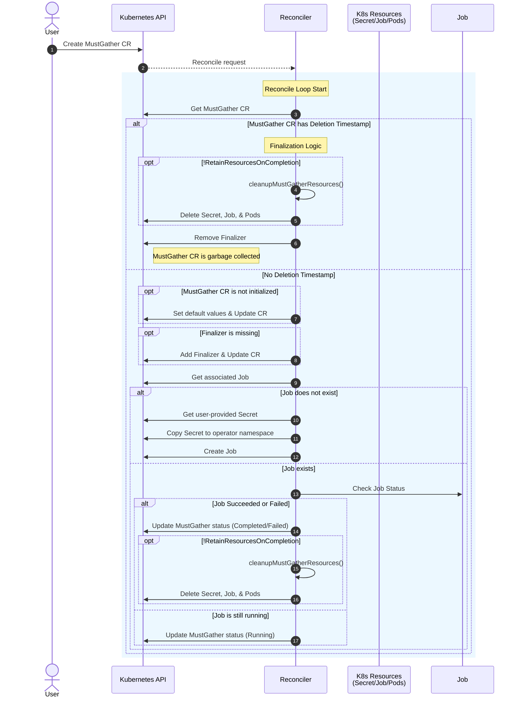
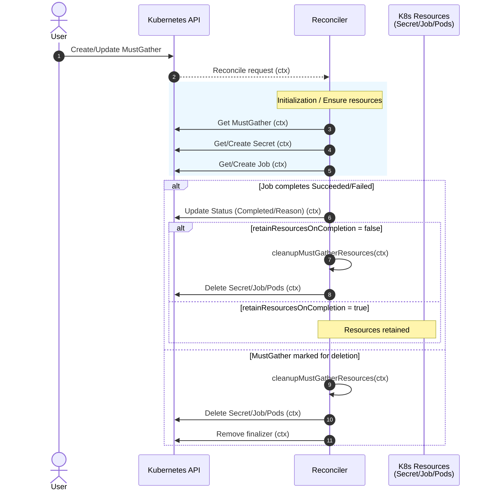

# Support Log Gather f.k.a. must-gather Operator

## Summary

The Must Gather Operator is an OLM-installable operator deployed on an OpenShift cluster that closely integrates with the must-gather tool. This enhancement describes how the operator provides a user-configurable interface (a new CustomResource) to gather data, diagnostic information from a cluster using must-gather and upload it to a Red Hat support case.

## Motivation

The cli utility, oc adm must-gather can collect data from the cluster and dump the results into the local filesystem where the oc binary is running. Today, there is no means for users of OpenShift to trigger collection of a must-gather job that runs in the cluster asynchronously. Moreover, the oc cli requires cluster-admin privileges and is not feasible each time for cluster administrators to run the cli tool which hogs their local system and can often be a very long running time-consuming process. Also, there is no provision for a developer on the OpenShift cluster with a lesser permissions to capture a must-gather and forward it to Red Hat for any support.

### User Stories

- As an OpenShift administrator, I want to trigger collection of a must-gathers on the cluster
- As a non-privileged OpenShift user, I want to be able to collect a must-gather and automatically upload it to a Red Hat support case

### Goals

1. A day-2 operator that installs on top of the core OpenShift platform
2. Allow a CR on the cluster to trigger collection of a platform must-gather (pods, nodes, openshift objects, etc.)
3. Enable automated upload of must-gather results to Red Hat support cases
4. Provide role-based access control allowing users can trigger must-gather collection by creating a MustGather CR
5. Maintain compatibility with existing must-gather toolchain and image formats
6. Report status of the must-gather collection into the MustGather CR

### Non-Goals

1. Ability to collect information when a cluster installation had failed (day-0)
2. Collect a must-gather dump in the event of apisever being completely off
3. Different products or operators should be responsible for gathering for their own components from the operator (see <https://github.com/advisories/GHSA-77c2-c35q-254w>)
4. Reduce or skim the information collected by the must-gather script itself

## Proposal

The Must Gather Operator provides a Kubernetes-native way to collect diagnostic information from OpenShift clusters through a declarative API. The operator will introduces a new CustomResource `MustGather` allowing users to trigger collection (batch) jobs within the cluster, eliminating the need for cluster administrators to run the CLI must-gather tool everytime.

The operator is designed as a day-2 operator installable through OLM (Operator Lifecycle Manager) and operates within the cluster to:

1. Users create `MustGather` CustomResources which trigger collection jobs that run as pods within the cluster, allowing the collection process to continue without requiring the user persist a tedious long running local process.
2. The operator provides configurable RBAC that allows non-cluster-admin users to trigger must-gather collection for their permitted namespaces or cluster-scoped resources, depending on their roles.
4. The operator integrates with Red Hat Case Management APIs to automatically upload collected data to support cases, streamlining the support workflow for customers via SFTP.
5. The `MustGather` CR provides detailed status information about collection progress, completion, and any errors encountered during the process in the `.status` part.

The operator leverages the existing must-gather image format and `/usr/bin/gather` script convention, ensuring compatibility with the current ecosystem while providing a declarative interface for triggering data collections.

### Workflow Description

1. **Installation**:
   - Cluster administrator installs the Must Gather Operator via OLM from OperatorHub

2. **Must-Gather Collection**:
   - User (with appropriate permissions) creates a `MustGather` CustomResource
   - User provides a reference to the service account to be used for the collection Job
   - User provides a reference to the secret to be used to authenticate to sftp.access.redhat.com

   - Operator creates a Kubernetes Job that has 2 containers: gather, upload
   - The gather pod runs the specific platform must-gather image
   - The upload container waits for the gather process to finish (via pgrep)
   - The upload container once ready, tars the gathered directory and uploads to Red Hat's SFTP server
   - Status is updated and propogated to the `MustGather.status` subresource

### API Extensions

The operator does not introduce a new API group and lives in the `operator.openshift.io` with the following CustomResource: `mustgather`:

#### MustGather Custom Resource

```go
//+kubebuilder:object:root=true
//+kubebuilder:subresource:status
// 
// MustGather is the Schema for the mustgathers API
type MustGather struct {
    metav1.TypeMeta   `json:",inline"`
    metav1.ObjectMeta `json:"metadata,omitempty"`

    Spec   MustGatherSpec   `json:"spec,omitempty"`
    Status MustGatherStatus `json:"status,omitempty"`
}

//+kubebuilder:object:root=true

// MustGatherList contains a list of MustGather
type MustGatherList struct {
    metav1.TypeMeta `json:",inline"`
    metav1.ListMeta `json:"metadata,omitempty"`
    Items           []MustGather `json:"items"`
}

// MustGatherSpec defines the desired state of MustGather
type MustGatherSpec struct {
    // the service account to use to run the must gather job pod, defaults to default
    // +optional
    ServiceAccountRef corev1.LocalObjectReference `json:"serviceAccountRef,omitempty"`

    // additionalConfig contains extra parameters used to customize the gather process,
    // currently enabling audit logs is the only supported field.
    // +optional
    AdditionalConfig *AdditionalConfig `json:"additionalConfig,omitempty"`

    // A time limit for gather command to complete a floating point number with a suffix:
    // "s" for seconds, "m" for minutes, "h" for hours, or "d" for days.
    // Will default to no time limit.
    // +optional
    // +kubebuilder:validation:Format=duration
    MustGatherTimeout metav1.Duration `json:"mustGatherTimeout,omitempty"`

    // A flag to specify if resources (secret, job, pods) should be retained when the MustGather completes.
    // If set to true, resources will be retained. If false or not set, resources will be deleted (default behavior).
    // +optional
    // +kubebuilder:default:=false
    RetainResourcesOnCompletion bool `json:"retainResourcesOnCompletion,omitempty"`

    // uploadTarget sets the target config for uploading the collected must-gather tar.
    // Uploading is disabled if this field is unset.
    // +optional
    UploadTarget *UploadTarget `json:"uploadTarget,omitempty"`

    // storage represents the volume where collected must-gather tar
    // is persisted. Persistent storage is disabled if this field is unset,
    // an ephemeral volume will be used.
    // +optional
    Storage *StorageConfig `json:"storage,omitempty"`
}

// AdditionalConfig sets extra parameters for the gather process.
type AdditionalConfig struct {
    // A flag to specify if audit logs must be collected
    // See documentation for further information.
    // +kubebuilder:default:=false
    Audit bool `json:"audit,omitempty"`
} 

// UploadType is a specific method for uploading to a target.
// +kubebuilder:validation:Enum=SFTP
type UploadType string

// UploadTarget defines the configuration for uploading the must-gather tar.
// +kubebuilder:validation:XValidation:rule="has(self.type) && self.type == 'SFTP' ? has(self.sftp) : !has(self.sftp)",message="sftp upload target config is required when upload type is SFTP, and forbidden otherwise"
// +union
type UploadTarget struct {
    // type defines the method used for uploading to a specific target.
    // +unionDiscriminator
    // +required
    Type UploadType `json:"type"`

    // sftp defines the target details for uploading to a valid SFTP server.
    // +unionMember
    // +optional
    SFTP *SFTPUploadTargetConfig `json:"sftp,omitempty"`
}

// SFTPUploadTargetConfig defines the configuration for SFTP uploads.
type SFTPUploadTargetConfig struct {
    // caseID specifies the Red Hat case number for support uploads.
    // +kubebuilder:validation:MaxLength=128
    // +kubebuilder:validation:MinLength=1
    // +required
    CaseID string `json:"caseID"`

    // host specifies the SFTP server hostname.
    // +kubebuilder:default:="sftp.access.redhat.com"
    // +optional
    Host string `json:"host,omitempty"`

    // caseManagementAccountSecretRef references a secret containing the upload credentials.
    // +required
    CaseManagementAccountSecretRef corev1.LocalObjectReference `json:"caseManagementAccountSecretRef"`

    // A flag to specify if the upload user provided in the caseManagementAccountSecret is a RH internal user.
    // See documentation for further information.
    // +optional
    // +kubebuilder:default:=false
    InternalUser bool `json:"internalUser,omitempty"`
}

// StorageType is a specific method for persisting collected must-gather tar.
// +kubebuilder:validation:Enum=PersistentVolume
type StorageType string

// StorageConfig defines the configuration for persisting must-gather tar.
// +kubebuilder:validation:XValidation:rule="has(self.type) && self.type == 'PersistentVolume' ? has(self.persistentVolume) : !has(self.persistentVolume)",message="persistentVolume config is required when storage type is PV, and forbidden otherwise"
// +union
type StorageConfig struct {
    // type defines the method used for persisting to a specific storage method.
    // +unionDiscriminator
    // +required
    Type StorageType `json:"type"`

    // persistentVolume specifies the PersistentVolume that will be used to store the must-gather archive.
    // The PersistentVolume must be created in the same namespace as the MustGather CR.
    // +unionMember
    // +optional
    PersistentVolume *PersistentVolumeConfig `json:"persistentVolume,omitempty"`
}

// PersistentVolumeConfig defines the configuration for Persistent Volume storage.
type PersistentVolumeConfig struct {
    // claim is a required field that specifies the configuration of the PersistentVolumeClaim that will be used to store the must-gather archive.
    // The PersistentVolumeClaim must be created in the must gather operator namespace.
    // +required
    Claim PersistentVolumeClaimReference `json:"claim"`
    // subPath is path to a directory on the PersitentVolume where
    // gathered tar will be stored.
    // +optional
    SubPath string `json:"subPath,omitempty"`
}

// persistentVolumeClaimReference is a reference to a PersistentVolumeClaim.
type PersistentVolumeClaimReference struct {
    // name is a string that follows the DNS1123 subdomain format.
    // +kubebuilder:validation:MaxLength:=253
    // +required
    Name string `json:"name"`
}

// MustGatherStatus defines the observed state of MustGather
type MustGatherStatus struct {
 Status     string             `json:"status,omitempty"`
 LastUpdate metav1.Time        `json:"lastUpdate,omitempty"`
 Reason     string             `json:"reason,omitempty"`
 Conditions []metav1.Condition `json:"conditions,omitempty" patchStrategy:"merge" patchMergeKey:"type"`
 Completed  bool               `json:"completed"`
}

```

### Implementation Details/Notes/Constraints

1. **Pod Creation**: The operator creates a collection Job which creates a pod with:
   - Local hostPath emptyDir for output storage
   - ServiceAccount with necessary RBAC permissions that are necessary for the [gather script](https://github.com/openshift/must-gather/blob/release-4.20/collection-scripts/gather) to succeed.

2. **Data Flow**:
   - Each gather container writes to `/must-gather/<image-name>/`
   - The upload container creates a compressed tar archive before uploading via SFTP
   - PVC is removed once the pod gets recycled

### Implementation

A brief overview of the MustGather CR's reconciliation flow is depicted below.



#### Resource Retention Policy

The operator by default cleans up the Jobs, the child pods and upload secret that are spin up for collection and upload process. This behaviour can be toggled by use of the `mustgather.spec.retainResourcesOnCompletion` field, which is false by default. Once the `retainResourcesOnCompletion` field is enabled, the operator will not cleanup the resources it manages as a part of the CR and user will be responsible for manual cleanup as desired. Irrespective, the operator's MustGather resource retains the status conditions for future reference and it is the onus of the creator (human user, any other controller, GitOps, etc.) of the MustGather object to cleanup the resource when necessary.



If the MustGather CR is created in a different namespace than the operator, the secret gets copied from that namespace into the operator namespace which is cleaned up upon `retainResourcesOnCompletion: false`. The secret in the original namespace where MustGather resource was created will not be deleted irrespective.

#### Security Considerations

- **Privilege Escalation/RBAC**
  - The operator does not provide for a ClusterRole that is intended to be bound to the ServiceAccount which will be run on the Job pods.
  - While the ServiceAccount being provided `cluster-admin` role succeeds in running a must-gather collection, this is not recommended and will be need to be refined for lesser privileges ([eg.](https://github.com/openshift/must-gather-operator/pull/264)) before GA.
  - Additionally, the SecurityContextConstraint privileges for the same ServiceAccount would need hardening too.
- **Credential Management**
  - Red Hat Case Management API provides for short-lived and one-time use credentials, which should be preferred by users of this operator.
  - As the secret for the credential to access Red Hat SFTP server is provided by the user, it is upto the user to cleanup/update/remove the secret. The operator only references this secret and any copies made by the operator are deleted in cleanup phase of reconciliation.
- **Data Validation**
  - This can be considered before GA, but is not in current scope.

### Topology Considerations

None, as a day-2 operator dedicated OpenShift and Hosted Clusters are both treated equally although the amount of data collection by must-gather itself may vary.

#### Hypershift / Hosted Control Planes
#### Standalone Clusters
#### Single-node Deployments or MicroShift

#### Proxy clusters

The operator inherits cluster-wide proxy settings from the `configv1.Proxy` object via environment variables propagated by OLM and passes them to the upload container of the Job.

For SFTP uploads through HTTP proxies (common in air-gapped OpenShift environments), the upload process uses an HTTP CONNECT proxy via netcat (`nc --proxy-type http`) as an SSH `ProxyCommand`. This allows SFTP traffic to tunnel through the configured HTTP proxy.

To customize proxy settings, a cluster administrator can override the `HTTP_PROXY`, `HTTPS_PROXY`, and `NO_PROXY` environment variables through the OLM Subscription object.

### Trusted Certificate Authority

The operator supports custom Certificate Authority (CA) bundles for environments using proxy servers with TLS interception. When the `TRUSTED_CA_CONFIGMAP_NAME` environment variable is set on the operator deployment (via OLM Subscription or direct patch), the operator mounts the referenced ConfigMap containing the CA bundle at `/etc/pki/tls/certs/ca-bundle.crt`. This ConfigMap should be labeled with `config.openshift.io/inject-trusted-cabundle=true` to leverage OpenShift's [CA bundle injection](https://docs.openshift.com/container-platform/4.12/networking/configuring-a-custom-pki.html#certificate-injection-using-operators_configuring-a-custom-pki).

#### Reconcile flow

During the MustGather CR reconciliation, the operator copies the trusted CA ConfigMap from the operator namespace (`must-gather-operator`) to the operand namespace where the MustGather CR is present. This ensures that the upload container in the must-gather job can mount and use the trusted CA bundle for SFTP uploads, even when the job runs in a different namespace than the operator.

The copied ConfigMap should include an `ownerReference` pointing to the MustGather CR. Since both the MustGather CR and the copied ConfigMap reside in the same namespace, Kubernetes garbage collection will automatically delete the ConfigMap when the MustGather CR is deleted. This approach ensures automatic cleanup without explicit deletion logic in the operator.

## Implementation History

1. <https://github.com/openshift/must-gather-operator/> was previously maintained by OSD SREs
2. Outdated old fork <https://github.com/redhat-cop/must-gather-operator> that still installs on OpenShift from the Community Catalog

## Alternatives (Not Implemented)

None

## Infrastructure Needed

While all the APIs provided by Red Hat for Case Management are available at access.redhat.com would be used by end-users and customers of OpenShift, for CI and local testing, use of access.stage.redhat.com: staging APIs requires Red Hat VPN connectivity on the cluster. Additionally, a new CI chain for triggering collection of must-gather from a CI cluster via the operator would be desirably helpful.

<!--
### Risks and Mitigations

### Drawbacks

## Test Plan

## Graduation Criteria

### Dev Preview -> Tech Preview

### Tech Preview -> GA

### Removing a deprecated feature

## Upgrade / Downgrade Strategy

## Version Skew Strategy

## Operational Aspects of API Extensions

## Support Procedures

-->
