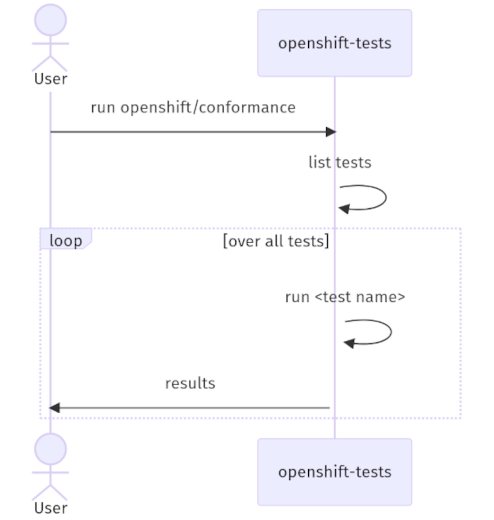

# Improved Platform Tests

## Summary

Allow maintaining and building end-to-end (e2e) tests outside of
[origin](https://github.com/openshift/origin/) repository, and running them under
single `openshift-tests` umbrella, by extracting the necessary test binaries
during runtime.

## Motivation

The reasoning behind this change are two-fold:

1. Short term goal is to speed up the [kubernetes updates](#kubernetes-updates),
   by enabling to run the updated tests coming from kubernetes bump pull request,
   rather than relying on current version available in OpenShift (usually one
   minor version older).
2. Long term goal is separating all e2e tests so that they can live in their
   [respective component repos](#tests-co-located-with-code).

### User Stories

- As an OpenShift developer, I want to be able to seamlessly run OpenShift
  and kubernetes-specific tests using `openshift-tests run`, so that my current
  workflows continue working as before.
- As an OpenShift developer, I want to be able to run newest kubernetes tests
  without the necessity to bump vendored code, to limit the amount of re-vendoring
  work and ensure all proper test coverage/alignment of the version of the code
  being tested with the version of the tests.
- As an OpenShift developer, I want to be able to extend and monitor cluster
  during tests execution, to ensure high availability of the platform.
- As an OpenShift partner or user, I want to be able to verify that my cluster is providing
  the desired functionality (CSI for example) running one of the provided test suites.
- As an OpenShift developer, I want to be able to deliver new e2e tests in the
  same pull request (PR) that introduces the feature being tested, so that I can
  ensure my new feature code is properly tested prior to merging.

### Goals

1. Reduce the risk updating kubernetes caused by excessive co-located code,
   and minimize time when we start running newest kubernetes tests.
2. Remove the requirement that all test code lives in a single repository.
3. Maintain `openshift-tests` API for running tests.
4. Ensure that kubernetes tests are still vendored in `openshift-tests` binary,
   to allow for an explicit fallback when the release payload image is not available.

### Non-Goals

1. Abandon existing tests.
2. Change the available functionality of `openshift-tests`.
3. Minimize memory footprint for running `openshift-tests`.
4. Moving the upgrade and monitoring tests that live in [origin](https://github.com/openshift/origin/)
   out of that repository.

### Kubernetes updates

Over the past releases the time to deliver the [updated kubernetes (o/k)](https://github.com/openshift/kubernetes/)
to our [tests (origin)](https://github.com/openshift/origin/) has increased significantly.
The delta for these was:
- OpenShift 4.10 / kubernetes 1.23 - 7 days (compare [o/k#1087](https://github.com/openshift/kubernetes/pull/1087)
  vs [origin#26753](https://github.com/openshift/origin/pull/26753)).
- OpenShift 4.11 / kubernetes 1.24 - 21 days (compare [o/k#1252](https://github.com/openshift/kubernetes/pull/1252)
  vs [origin#27244](https://github.com/openshift/origin/pull/27244)).
- OpenShift 4.12 / kubernetes 1.25 - 40 days (compare [o/k#1360](https://github.com/openshift/kubernetes/pull/1360)
  vs [origin#27526](https://github.com/openshift/origin/pull/27526)).
- OpenShift 4.13 / kubernetes 1.26 - 20 days (compare [o/k#1432](https://github.com/openshift/kubernetes/pull/1432)
  vs [origin#27738](https://github.com/openshift/origin/pull/27738)).
- OpenShift 4.14 / kubernetes 1.27 - 15 days (compare [o/k#1558](https://github.com/openshift/kubernetes/pull/1558)
  vs [origin#27894](https://github.com/openshift/origin/pull/27894)).

Moreover, the changes to origin repository were reverted at least once, due to multiple
issues found, which also affected the increased delays.

By separating OpenShift tests from the ones coming from kubernetes we will:
- shorten the time when we start running most up-to-date tests from kubernetes;
- run all tests coming from kubernetes fork, especially those introduced in patch releases;
- start getting the new results already during [kubernetes update process](https://github.com/openshift/kubernetes/blob/master/REBASE.openshift.md).

### Tests co-located with code

As of this writing (4.14 in progress), every major change in OpenShift requires
the following steps:
1. Modify [API](https://github.com/openshift/api/), [client-go](https://github.com/openshift/client-go/)
   and optionally [library-go](https://github.com/openshift/library-go/).
2. Modify the appropriate operator(s) repository(ies).
3. Add new tests to [origin](https://github.com/openshift/origin/) repository.

At any point in time during bumping one of the libraries in the repository mentioned
in the last step above, one can expect to pick up additional, unrelated changes,
which would require to either find the owner of that change, or react to those changes.

Separating operator-specific tests to be co-located with the actual logic we will:
- run the tests during submitting the actual change;
- shorten the time when we start testing the new functionality;
- limit the external factors which can affect the test merge.

## Proposal

### Workflow Description - old

Currently, `openshift-tests run <test-suite>` does a few things:
1. Discovers all available tests and splits them into suites based on test names/labels,
   and test code paths (e.g. k8s package path).
2. Filters tests based on: desired suite, configuration/environment of the cluster
   being tested, parallel/serial requirements.
3. Discovers the deployment topology and sets up all the arguments necessary
   to monitor the cluster and run the tests.
4. Starts monitoring the cluster functionality.
5. Iterates over all the tests, creating a subprocess invoking `openshift-tests run-test`
   passing a single test name to run as the argument, and reports back the result
   to the main process.
6. Present the summary results of running tests.

Below diagram shows the current flow:

<!--
Above diagram was generated at https://mermaid.live/ using following code:
sequenceDiagram
    actor U as User
    participant O as openshift-tests
    U->>+O: run openshift/conformance
    O->>+O: list tests
    loop over all tests
        O->>+O: run #lt;test name#gt;
        O->>+U: results
    end
-->

### Workflow Description - new

This proposal's goal is to extend test discovery (step 1), and running the actual
test (step 5) with external binaries, which are retrieved from the payload image.
The improved flow would be as follows:
1. Retrieve test binaries from the images referenced by the payload image.
2. Discover all tests, both the built-in into `openshift-tests` binary, and the
   ones provided by external binaries by executing `<binary>-tests list`.
   Split them into suites based on test names/labels.
3. Filter tests based on: desired suite, configuration/environment of the cluster
   being tested, parallel/serial requirements.
4. Discover the deployment topology and set up all the arguments necessary
   to monitor the cluster and run the tests.
5. Start monitoring the cluster functionality.
6. Iterate overall all the test creating a subprocess invoking `<binary>-tests run-test`
   passing a single test to run as the argument, and report back the results to the
   main process.
7. Present the summary results of running tests.

Below diagram shows the proposed flow:

<!--
Above diagram was generated at https://mermaid.live/ using following code:
sequenceDiagram
    actor U as User
    participant O as openshift-tests
    participant E as external-tests
    participant R as release:tag
    U->>+O: run openshift/conformance
    O->>+O: list tests
    O->>+R: extract test binary
    rect rgb(177, 177, 177)
        opt test binary exists?
            R->>+E: external-tests
            O->>+E: list tests
            E->>+O: tests
        end
    end
    loop over all tests
        alt embedded test?
            O->>+O: run #lt;test name#gt;#10;
        else external test?
            rect rgb(177, 177, 177)
                O->>+E: run #lt;test name#gt;
                E->>+O: results
            end
        end
    end
    O->>+U: results
-->

### API Extensions

N/A

### Implementation Details/Notes/Constraints

To achieve the first step of the proposal, we need to:
1. Provide a library for building `<binary>-tests` which exposes two commands:
   - `list` - responsible for listing tests in JSON format;
   - `run` - run a single test, returning results in ginkgo compatible format;
2. Provide a mechanism for labeling tests, similarly how we currently indicate
   that a test is part of a special group. See [origin/rules.go](https://github.com/openshift/origin/blob/cc42164781a728b804d0bb07f09cf878ec8f7807/test/extended/util/annotate/rules.go)
   or [kubernetes/rules.go](https://github.com/openshift/kubernetes/blob/8bd5514be14de7fb3105962c8fc206ef5e921a0b/openshift-hack/e2e/annotate/rules.go),
   in combination with [the annotation mechanism](https://github.com/openshift/kubernetes/blob/8bd5514be14de7fb3105962c8fc206ef5e921a0b/openshift-hack/e2e/annotate/annotate.go).
3. Help managing the use of disconnected images (i.e. ensure they are only referencing
   images that are mirrored, at least for conformance tests). See [images used by e2e tests](https://github.com/openshift/origin/blob/cc42164781a728b804d0bb07f09cf878ec8f7807/test/extended/util/image/README.md).
4. Provide an image annotation or similar mechanism informing where the test
   binary is embedded in the release payload.

The proposed extensions to `openshift-tests` will require the following changes:
1. Add extraction logic responsible for retrieving test binaries from the
   release payload, based on the annotations provided by the authors of these
   images.
2. Add logic responsible for iterating over all test binaries invoking the `list`
   subcommand, and reading the list of tests provided by the binary. Every tests
   should have an associated binary name, which will be used during invocation.
3. Expand the current filtering, shuffling, and randomization logic to also take
   into account the new tests coming from external binaries.
4. Add logic responsible for iterating over all tests, invoking the `run`
   subcommand using the associated test's binary and reading its results.
5. Provide a fallback path allowing to use the vendored tests on demand (`OPENSHIFT_SKIP_EXTERNAL_TESTS`
   environment variable, for example).

### Risks and Mitigations

- **The current policy when the [origin](https://github.com/openshift/origin/) pull
  request bringing the updated k8s version breaks the CI is to revert PR. This
  policy will be harder to execute with this change because reverting the o/k
  rebase PR can be problematic and was never tried before.**

  There should be fewer reasons to do any reverting, because with this new mechanism
  we should get the appropriate signal during extensive payload testing required
  to land every k8s bump PR.

- **Some of the work that has been done to build the partner certification tool will
  need to be updated to pull additional images with separate test binaries.**

  The `openshift-tests` binary will contain the necessary logic to ensure that test
  invocation is working as before.

- **Not available release image can prevent from running the tests.**

  The proposed mechanism will contain a fallback path, which will ensure that in
  cases where the release payload is not reachable we will be able to run all the
  tests bundled within the `openshift-tests` binary. This includes the basic
  OpenShift and Kubernetes conformance tests.

- **Slowing down the local development cycle due to pulling the external test binaries.**

  The initial proposal is to use an environment variable `OPENSHIFT_SKIP_EXTERNAL_TESTS`,
  which bypasses the mechanism and always uses the tests bundled in `openshift-tests`
  binary.
  At a later point in time, it's reasonable to re-use test binaries downloaded
  in prior executions, through exposing an environment variable,
  `OPENSHIFT_EXTERNAL_TESTS_DIRECTORY` for example.

- **Slowing down the overall execution time due to pulling down external binaries
  from the release image.**

  Based on the tests performed during implementation of the [proof of concept](https://github.com/openshift/origin/pull/27570),
  the additional time required to download and extract the additional binary is
  in tens of seconds, assuming a good internet connection is available.
  In cases where that addition is not acceptable, `OPENSHIFT_SKIP_EXTERNAL_TESTS`,
  which bypasses the mechanism and always uses the tests bundled in `openshift-tests`
  binary, is an option.

- **In some cases, after landing newer version of kubernetes it is possible that
  we'll be having issues with tests relying on newer kubelets, which is usually
  shipped with updated base image with some delay.**

  This problem will not present during PR testing, because then we always build
  the base image from scratch to ensure all components are using newest versions
  for tests. For those rare cases where tests will rely on newer functionality in
  kubelet we can either temporarily disable the test before landing the PR, or
  sync with ART to ensure the updated kubelet is shipped as quickly as possible.

- **Upgrade tests, unlike other tests are executed within single test binary
  making it harder to migrate to use external test binaries.**

  The current upgrade test suite runs only a handful of tests which don't change
  that often. For that reason, we've initially decided to rely only on the vendored
  code for the upgrade tests.

### Drawbacks

This proposal might lead to unnecessary proliferation of external tests binaries,
which might cause problems when the release image is not available, or for local
development.

## Design Details

The initial proof of concept was implemented in the following PRs:
- https://github.com/openshift/kubernetes/pull/1485
- https://github.com/openshift/origin/pull/27570

It is enabling the split between [origin](https://github.com/openshift/origin/)
and [kubernetes](https://github.com/openshift/kubernetes/) repositories. Although,
for backwards compatibility the re-vendoring is still required to ensure that
projects like Microshift, or local development can still use all required
tests from a single binary setting `OPENSHIFT_SKIP_EXTERNAL_TESTS` environment
variable.

The general flow of the code is as follows:

1. When invoking `openshift-tests run <suite>` we jump to code responsible for
   reading all the tests and filtering out only the requested suite, see [Run](https://github.com/openshift/origin/blob/cc42164781a728b804d0bb07f09cf878ec8f7807/pkg/test/ginkgo/cmd_runsuite.go#L141).
   The new addition, responsible for pulling and executing external binaries
   resides [there as well](https://github.com/openshift/origin/blob/cc42164781a728b804d0bb07f09cf878ec8f7807/pkg/test/ginkgo/cmd_runsuite.go#L166-L189),
   it invokes [externalTestsForSuite](https://github.com/openshift/origin/blob/cc42164781a728b804d0bb07f09cf878ec8f7807/pkg/test/ginkgo/external.go#L29).
2. Like previously, all the tests are [shuffled](https://github.com/openshift/origin/blob/cc42164781a728b804d0bb07f09cf878ec8f7807/pkg/test/ginkgo/cmd_runsuite.go#L193-L195)
   to ensure no tests' dependency affects the results.
3. The next part of `Run` method is responsible for:
   - filtering tests based on API groups;
   - setting up various monitors, which gather data about cluster under test;
   - splitting the tests into several buckets such as early, late, and several others,
     which help with parallelization of the execution.
4. The actual logic responsible for executing tests is located [here](https://github.com/openshift/origin/blob/cc42164781a728b804d0bb07f09cf878ec8f7807/pkg/test/ginkgo/cmd_runsuite.go#L367-L402),
   it places all items in the [queue](https://github.com/openshift/origin/blob/master/pkg/test/ginkgo/queue.go),
   and [executes tests in a new process](https://github.com/openshift/origin/blob/cc42164781a728b804d0bb07f09cf878ec8f7807/pkg/test/ginkgo/test_runner.go#L296)
   invoking `<test-binary> run-test <test-name>`.
5. The reminder of the `Run` method is responsible for:
   - analyzing the monitor data;
   - summarizing the tests results.

### Future work

The current state of art, as mentioned above, provided mechanism for both
extracting the test binaries, and using those binaries for running tests.
The followup work requires:

1. Extracting common test library for re-use. The library should be based on the
   contents of [k8s-tests directory](https://github.com/openshift/kubernetes/tree/8bd5514be14de7fb3105962c8fc206ef5e921a0b/openshift-hack/cmd/k8s-tests).
2. Expanding [externalTestsForSuite](https://github.com/openshift/origin/blob/cc42164781a728b804d0bb07f09cf878ec8f7807/pkg/test/ginkgo/external.go#L29)
   to allow extracting test binaries from other images, currently it uses hardcoded
   `hyperkube` image from the release payload, but should rather rely on [an annotation](#implementation-detailsnotesconstraints),
   telling which images contain the external test binary, and its location inside
   the image.
3. Preparing a template/demo for one of operators building on top of steps 1 and 2
   above.

Additionally, to enable flows where release payload is not available, one should be
able to point to a local directory containing external binaries that should be
used instead. For example, through `OPENSHIFT_EXTERNAL_TESTS_DIRECTORY` environment
variable.

### Even more future work

As mentioned in [risks section](#risks-and-mitigations), upgrade tests are relying
on the vendored code only, it would be reasonable to address this issue in the long,
to run the upgrade tests in a similar fashion as the other tests.

Re-evaluate [goal #4](#goals) which explicitly requires providing a fallback for
kubernetes vendored tests. Currently, at least Microshift requires us to have
the kubernetes tests vendored since they don't provide release image from which
we can extract the kubernetes test binaries.

### Test Plan

Not applicable, since this is changing testing mechanism. Prior landing this PR
we will ensure that all payload tests are passing.

### Graduation Criteria

N/A

#### Dev Preview -> Tech Preview

N/A

#### Tech Preview -> GA

N/A

#### Removing a deprecated feature

N/A

### Upgrade / Downgrade Strategy

N/A

### Version Skew Strategy

N/A

### Operational Aspects of API Extensions

N/A

#### Failure Modes

N/A

#### Support Procedures

N/A

## Implementation History

- *2022-11-16* - Initial draft.
- *2023-05-31* - Updated document based on the proof of concept implementation.

## Alternatives

### Runtime Assembly - Multiple pods

Test binaries are built into each release payload component image at conventionally
established location; e.g. `/openshift-tests/<component-name>`. Once a cluster
has been installed, the `openshfit-tests` binary inspects the components of the
running cluster's payload and creates pods, running those images, with
`/openshift-tests/<component-name>` binaries as the entrypoint.
`openshift-tests` would still be responsible for aggregating the results.

Pros:
- It’s “easy” to have a PR add a new test and that test will run in pre-merge testing.
- It’s easier to implement, since the coordination mechanism will exist only inside origin repository.

Cons:
- An amd64 build farm cluster cannot run release payload component pods from an ARM cluster.

### Build-time Assembly - Aggregating Source

`openshift-tests` contains a traditional binary for running the tests, however
it is built from a source tree composed from multiple repositories.

Cons:
- Longer test times due to the compilation of openshift-tests.
- Consistency across all repos source which contributes to this binaries.

### Build-time Assembly - Aggregating Binaries

`openshift-tests` contains a traditional binary for running the tests, and all
the additional test binaries, which are injected while building the release image.

Cons:
- Longer test times due to the compilation of openshift-tests.
- Consistency across all repos source which contributes to this binaries.
- Necessary changes in the build pipeline which will allow constructing binaries
  from multiple repositories.
