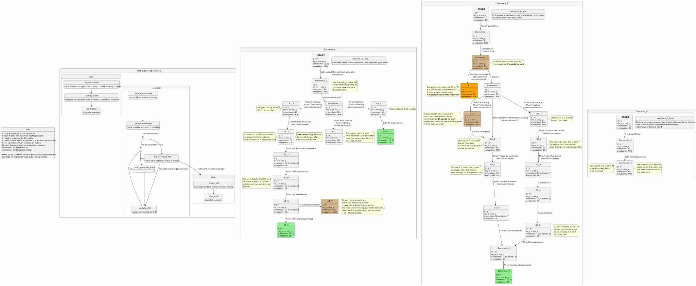

# Two Node OpenShift with Fencing (TNF)

## Terms

**RHEL-HA** - a general-purpose clustering stack shipped by Red Hat (and others) primarily consisting of Corosync and Pacemaker.  Known to be in use by airports, financial exchanges, and defense
organizations, as well as used on trains, satellites, and expeditions to Mars.

**Corosync** - a Red Hat led [open-source project](https://corosync.github.io/corosync/) that provides a consistent view of cluster membership, reliable ordered messaging, and flexible quorum
capabilities.

**Pacemaker** - a Red Hat led [open-source project](https://clusterlabs.org/pacemaker/doc/) that works in conjunction with Corosync to provide general-purpose fault tolerance and automatic failover
for critical services and applications.

**Fencing** - the process of “somehow” isolating or powering off malfunctioning or unresponsive nodes to prevent them from causing further harm, such as data corruption or the creation of divergent
datasets.

**Quorum** - having the minimum number of members required for decision-making. The most common threshold is 1 plus half the total number of members, though more complicated algorithms predicated on
fencing are also possible.
 * C-quorum: quorum as determined by Corosync members and algorithms
 * E-quorum: quorum as determined by etcd members and algorithms

**Split-brain** - a scenario where a set of peers are separated into groups smaller than the quorum threshold AND peers decide to host services already running in other groups.  Typically, it results
in data loss or corruption.

**MCO** - Machine Config Operator. This operator manages updates to the node's systemd, cri-o/kubelet, kernel, NetworkManager, etc., and can write custom files to it, configurable by MachineConfig
custom resources.

**ABI** - Agent-Based Installer. A installation path through the core-installer that leverages the assisted service to facilate bare-metal installations. Can be used in disconnected environments.

**BMO** - Baremetal Operator. An optional operator whose primary function is to provide the ability to scale clusters in bare-metal deployment environments.

**CEO** - cluster-etcd-operator. The OpenShift operator responsible for deploying and maintaining healthy etcd instances for the cluster.

**BMC** - Baseboard Management Console. Used to manage bare-metal machines. Can modify firmware settings and machine power state.

## Summary

Leverage traditional high-availability concepts and technologies to provide a container management solution that has a minimal footprint but remains resilient to single node-level failures suitable
for customers with numerous geographically dispersed locations.

## Motivation

Customers with hundreds, or even tens of thousands, of geographically dispersed locations are asking for a container management solution that retains some level of resilience to node-level failures
but does not come with a traditional three-node footprint and/or price tag.

The need for some level of fault tolerance prevents the applicability of Single Node OpenShift (SNO), and a converged 3-node cluster is cost prohibitive at the scale of retail and telcos - even when
the third node is a "cheap" one that doesn't run workloads.

While the degree of resiliency achievable with two nodes is not suitable for safety-critical workloads like emergency services, this proposal aims to deliver a solution for workloads that can trade
off some amount of determinism and reliability in exchange for cost-effective deployments at scale that fully utilize the capacity of both nodes while minimizing the time to recovery for node-level
failures of either node.

The benefits of the cloud-native approach to developing and deploying applications are increasingly being adopted in edge computing. This requires our solution to provide a management experience
consistent with "normal" OpenShift deployments and be compatible with the full ecosystem of Red Hat and partner workloads designed for OpenShift.

### User Stories

* As a solutions architect for a large enterprise with multiple remote sites, I want a cost-effective OpenShift cluster solution so that I can manage applications without incurring the cost of a third
  node at scale.
* As a solutions architect for a large enterprise running workloads on a minimal OpenShift footprint, I want to leverage the full capacity of both control-plane nodes to run my workloads.
* As a solutions architect for a large enterprise running workloads on a minimal OpenShift footprint, I want to minimize time-to-recovery and data loss for my workloads when a node fails.
* As an OpenShift cluster administrator, I want a safe and automated method for handling the failure of a single node so that the downtime of the control-plane is minimized and the cluster fully
  recovers.

### Goals

* Provide a two-node control-plane for physical hardware that is resilient to a node-level failure for either node
* Provide a transparent installation experience that starts with exactly 2 blank physical nodes, and ends with a fault-tolerant two-node cluster
* Prevent both data corruption and divergent datasets in etcd
* Minimize recovery-caused unavailability (e.g. by avoiding fencing loops, wherein each node powers cycles its peer after booting, reducing the cluster's availability)
* Recover the API server in less than 120s, as measured by the surviving node's detection of a failure
* Minimize any differences to existing OpenShift topologies
* Provide an OpenShift cluster experience as similar to that of a 3-node hyperconverged cluster as can be achieved accepting the resiliency compromises of having 2 nodes
* Minimize scenarios that require manual intervention to initiate cluster recovery
* Provide a mechanism for cluster components (e.g. CVO operators, OLM operators) to detect this topology and behave contextually for its limitations

### Non-Goals

* Achieving the same level of resilience or guarantees provided by a cluster with 3 control-plane nodes or 2 nodes with an arbiter
* Achieving the same level of deterministic failure modes as can be provided by setting up two Single-Node OpenShift instances as an active-passive pair
* Workload resilience - see related [Pre-DRAFT enhancement](https://docs.google.com/document/d/1TDU_4I4LP6Z9_HugeC-kaQ297YvqVJQhBs06lRIC9m8/edit)
* Resilient storage - see future enhancement
* Support for platforms other than `platform: "None"` and `platform: "Baremetal"`
* Support for other topologies (eg. hypershift)
* Support disconnected cluster installation
* Adding worker nodes
* Supporting upgrade/downgrade paths between 2-node and other topologies (e.g. single-node, 3-node, 2-node with arbiter) (highly requested future extension)
* Cluster upgrades when only a single node is available
* Creation of RHEL-HA events and metrics for consumption by the OpenShift monitoring stack (future extension)
* Support for IBI (image-based install) and IBU (image-based upgrade)

## Proposal

We will use the RHEL-HA stack (Corosync, and Pacemaker), which has been used to deliver supported two-node cluster experiences for multiple decades, to manage cri-o, kubelet, and the etcd daemon. We
will run etcd as a voting member on both nodes. We will take advantage of RHEL-HA's native support for systemd and re-use the standard cri-o and kubelet units, as well as create a new Open Cluster
Framework (OCF) script for etcd. The existing startup order of cri-o, then kubelet, then etcd will be preserved. The `etcdctl`, `etcd-metrics`, and `etcd-readyz` containers will remain part of the
static pod definitions, the contents of which remain under the exclusive control of the cluster-etcd-operator (CEO).

In the case of an unreachable peer, we will use RedFish compatible Baseboard Management Controllers (BMCs) as our primary mechanism to power off (fence) the unreachable node and ensure that it cannot
harm while the remaining node continues.

Upon a peer failure, the RHEL-HA components on the survivor will fence the peer and use the OCF script to restart etcd as a new cluster-of-one.

Upon a network failure, the RHEL-HA components ensure that exactly one node will survive, fence its peer, and use the OCF script to restart etcd as a new cluster-of-one.

Upon an etcd failure, the OCF script will detect the issue and try to restart etcd.

In both cases, the control-plane's dependence on etcd will cause it to respond with errors until etcd has been restarted.

Upon rebooting, the RHEL-HA components ensure that a node remains inert (not running cri-o, kubelet, or etcd) until it sees its peer. If the failed peer is likely to remain offline for an extended
period, admin confirmation is required on the remaining node to allow it to start OpenShift. This functionality exists within RHEL-HA, but a wrapper will be provided to take care of the details.

When starting etcd, the OCF script will use etcd's cluster ID and version counter to determine whether the existing data directory can be reused, or must be erased before joining an active peer.


### Summary of Changes

At a glance, here are the components we are proposing to change:

| Component                                                         | Change                                                                                                                          |
| ----------------------------------------------------------------- | ------------------------------------------------------------------------------------------------------------------------------- |
| [Feature Gates](#feature-gate-changes)                            | Add a new `DualReplicaTopology` feature which can be enabled via the `CustomNoUpgrade` feature set                              |
| [OpenShift API](#openshift-api-changes)                           | Add `DualReplica` as a new value for `ControlPlaneTopology`, `PacemakerCluster` CRD for CEO health checking                     |
| [ETCD Operator](#etcd-operator-changes)                           | Add external etcd mode, new scaling strategy, new TNF controller for initializing pacemaker, and pacemaker health  checker      |
| [Install Config](#install-config-changes)                         | Update install config API to accept fencing credentials in the control plane for `platform: None` and `platform: Baremetal`     |
| [Installer](#installer-changes)                                   | Populate the nodes with initial pacemaker configuration when deploying with 2 control-plane nodes and no arbiter                |
| [MCO](#mco-changes)                                               | Add an MCO extension for installing pacemaker and corosync in RHCOS; MachineConfigPool maxUnavailable set to 1                  |
| [RHEL CoreOS](#rhcos-changes)                                     | A symbolic link will be added to /usr/lib to ensure that we can install podman-etcd via a MachineConfig                         |
| [Authentication Operator](#authentication-operator-changes)       | Update operator to accept minimum 1 kube api servers when `ControlPlaneTopology` is `DualReplica`                               |
| [Hosted Control Plane](#hosted-control-plane-changes)             | Disallow HyperShift from installing on the `DualReplica` topology                                                               |
| [OLM Filtering](#olm-filtering-changes)                           | Leverage support for OLM to filter operators based off of control plane topology                                                |
| [Bare Metal Operator](#bare-metal-operator-changes)               | Prevent power-management of control-plane nodes when the controlPlaneTopology is set to `DualReplica`                           |
| [Cluster Monitoring Operator](#monitoring-operator-changes)       | Add telemetry for topology fields of infra config and add custom alerts for failover thresholds                                 |
| [OpenShift Console](#openshift-console-changes)                   | Include TNF in the valid topology check                                                                                         |
| [OpenShift Origin](#openshift-origin-changes)                     | Add `DualReplica` topology mode to the list of topologies for the monitoring tests                                              |

### Workflow Description

#### Cluster Creation

User creation of a two-node control-plane is possible via the Assisted Installer and the Agent-Based Installer (ABI). The initial implementation will focus on providing support for the Assisted
Installer in managed cluster environments (i.e. ACM), followed by stand-alone cluster support via the Agent-Based Installer. The requirement that the cluster can be deployed using only 2 nodes is key
because requiring a third bare-metal server for installation can be expensive when deploying bare metal at scale. To accomplish this, deployments will use one of the target machines as the bootstrap
node before it is rebooted into a control-plane node.

A critical transition during bootstrapping is when the bootstrap reboots into the control-plane node. Before this reboot, it needs to be removed from the etcd cluster so that quorum can be maintained
as the machine reboots into a second control-plane.

Otherwise, the procedure follows the standard flow except for the configuration of 2 nodes instead of 3.

To constrain the scope of support, we've targeted Assisted Installer (in ACM) and Agent-Based Installer (ABI) as our supported installation paths. Support for other installation paths may be
reevaluated as business requirements change. For example, it is technically possible to install a cluster with two control-plane nodes via `openshift-install` using an auxiliary bootstrap node but we
don't intend to support this for customers unless this becomes a business requirement. Similarly, ZTP may be evaluated as a future offering for clusters deployed by ACM environments via Multi-Cluster
Engine (MCE), Assisted Installer, and Bare Metal Operator.

Because BMC passwords are being collected to initialize fencing, the Assisted Installer SaaS offering will not be available (to avoid storing customer BMC credentials in a Red Hat database).

Everything else about cluster creation will be an opaque implementation detail not exposed to the user.

##### Transitioning to a RHEL-HA Controlled Cluster
Three aspects of cluster creation need to happen for a vanilla two-node cluster to have RHEL-HA functioning as described in the proposal.
1. Initializing the RHEL-HA cluster
2. Transitioning control of etcd to RHEL-HA
3. Enabling fencing in RHEL-HA

###### Transitioning etcd Management to RHEL-HA
An important facility of the installation flow is the transition from a CEO deployed etcd to one controlled by RHEL-HA. The basic transition works as follows:
1. [MCO extensions](https://docs.openshift.com/container-platform/4.17/machine_configuration/machine-configs-configure.html#rhcos-add-extensions_machine-configs-configure) are used to ensure that the
   pacemaker and corosync RPMs are installed. The installer also creates MachineConfig manifests to pre-configure resource agents.
2. Upon detecting that the DualReplica controlPlaneTopology is set in the infrastructure config, CEO will trigger a job to start a TNF controller to run commands on the cluster nodes to initialize
   pacemaker. The outcome of this is that the podman-etcd resource agent will be started on both nodes.
3. The aforementioned TNF controller will signal CEO to relinquish control of etcd by setting CEO's `useUnsupportedUnsafeEtcdContainerRemoval` and `useExternalEtcdSupport` flags. When this happens,
   CEO immediately removes the etcd container from the static pod configs. The resource agents for etcd are running from step 2, and they are configured to wait for etcd containers to be gone so they
   can restart them using Podman.
4. The installation proceeds as normal once the containers start. If for some reason, the etcd containers cannot be started, then the installation will fail. The installer will pull logs from the
control-plane nodes to provide context for this failure.

###### Managing Pacemaker and Resource/Fence agent Configuration
Pacemaker configurations (as well as its resource and fence agent configurations) do not need to be stored as files, as they are dynamically created using pcs commands run by new controller called the
TNF controller.

For the initial Technical Preview phase, we will use default values for these configurations, except for fencing configurations (which are covered in the next section).

Looking ahead to General Availability (GA), we are considering a mapping solution that will allow users to specify certain values, which will then be used to generate the configurations dynamically.

###### Configuring Fencing Via MCO
Fencing setup is the last important aspect of the cluster installation. For the cluster installation to be successful, fencing should be configured and active before we declare the installation
successful. To do this, baseboard management console (BMC) credentials need to be made available to the control-plane nodes as part of pacemaker initialization. To ensure rapid fencing using
pacemaker, we will collect RedFish details (address, username, and **password**) for each node via the install-config (see proposed install-config changes). This will take a format similar to that of
the [Bare Metal
Operator](https://docs.openshift.com/container-platform/4.17/installing/installing_bare_metal_ipi/ipi-install-installation-workflow.html#bmc-addressing_ipi-install-installation-workflow). We will
create a new MachineConfig that writes BMC credentials to the control-plane disks. This will resemble the BMC specification used by the
[BareMetalHost](https://docs.openshift.com/container-platform/4.17/rest_api/provisioning_apis/baremetalhost-metal3-io-v1alpha1.html#spec-bmc) CRD.

BMC information can be used to change the power state of a bare-metal machine, so it's critically important that we ensure that pacemaker is the **only entity** responsible for these operations to
prevent conflicting requests to change the machine state. This means that we need to ensure that there are installer validations and validations in the Bare Metal Operator (BMO) to prevent
control-plane nodes from having power management enabled in a two-node topology. Additionally, optional operators like Node Health Check, Self Node Remediation, and Fence Agents Remediation must have
the same considerations but these are not present during installation.

See the API Extensions section below for sample install-configs.

For a two-node cluster to be successful, we need to ensure the following:
1. The BMC secrets for RHEL-HA, located in a new section of the install-config.yaml, are consumed by the installer which renders Secret manifests and applies them to the openshift-etcd namespace
   during cluster bootstrap.
2. When pacemaker is initialized by the TNF controller, the TNF controller will pass it the fencing credentials extracted from the secrets in openshift-etcd, which will be used by pacemaker to set up
   fencing. If this is not successful, it throws an error which will cause the degradation of CEO to fail the installation process.
3. Pacemaker periodically checks that the fencing configuration is correct (i.e. can connect to the BMC) and will create an alert if it cannot access the BMC.
   * In this case, in order to allow manually fixing the fencing configuration by the user, a script will be available on the node which will reset Pacemaker with the new fencing credentials.
4. The cluster will continue to run normally in the state where the BMC cannot be accessed, but ignoring this alert will mean that pacemaker can only provide a best-effort recovery - so operations
   that require fencing will need manual intervention.
5. When the designated script manually run on the node, it will also update the Secret in order to make sure the Secret is aligned with the credentials kept in Pacemaker's cib file.

Future Enhancements
1. Allowing usage of external credentials storage services such as Vault or Conjur. In order to support this:
   * Expose the remote access credentials to the TNF controller
   * We will need an indication for using that particular mode
   * Introduce another operator (such as Secrets Store CSI driver) to consume the remote credentials
   * Make sure that the relevant operator for managing remote credentials is part of the setup (potentially by using the Multi-Operator-Manager operator)
 2. Allowing refresh of the fencing credentials during runtime. One way to do so would be for CEO to watch for a credential change made by the user, and re-trigger the TNF controller job to update the
    pacemaker resources.


#### Day 2 Procedures

As per a standard 3-node control-plane, OpenShift upgrades and `MachineConfig` changes that would trigger a node reboot cannot proceed if the aforementioned reboot would go over the `maxUnavailable`
allowance specified in the machine config pool, which defaults to 1. For a two-node control plane, `maxUnavailable` should only ever be set to 1 to help ensure that these events only proceed when both
peers are online and healthy, or 0 in the case where the administrator wishes to temporarily disable these events.

The experience of managing a two-node control-plane should be largely indistinguishable from that of a 3-node one. The primary exception is (re)booting one of the peers while the other is offline and
expected to remain so.

As in a 3-node control-plane cluster, starting only one node is not expected to result in a functioning cluster. Should the admin wish for the control-plane to start, the admin will need to execute a
supplied confirmation command on the active cluster node. This command will grant quorum to the RHEL-HA components, authorizing it to fence its peer and start etcd as a cluster-of-one in read/write
mode. Confirmation can be given at any point and optionally make use of SSH to facilitate initiation by an external script.

### API Extensions

The full list of changes proposed is [summarized above](#summary-of-changes). Each change is broken down in greater detail below.

#### Feature Gate Changes

We will define a new `DualReplicaTopology` feature that can be enabled in `install-config.yaml` to ensure the clusters running this feature cannot be upgraded until the feature is ready for general
availability.

#### OpenShift API Changes

A mechanism is needed for components of the cluster to understand that this is a two-node control-plane topology that may require different handling. We will define a new value for the
`controlPlaneTopology` field of the Infrastructure config's `TopologyMode` enum. Specifically, the value of `DualReplica` will be added to the currently supported list, which includes
`HighlyAvailable`, `SingleReplica`, and `External`.

InfrastructureTopology is assumed to be immutable by components of the cluster. While there is strong interest in changing this to allow for topology transitions to and from TNF, this is beyond the
scope of this enhancement proposal and should be detailed in its own enhancement.

#### etcd Operator Changes

Initially, the creation of an etcd cluster will be driven in the same way as other platforms. Once the cluster has two members, the etcd daemon will be removed from the static pod definition and
recreated as a resource controlled by a RHEL-HA resource agent called podman-etcd. At this point, the cluster-etcd-operator (CEO) will be made aware of this change so that some membership management
functionality that is now handled by RHEL-HA can be disabled. To enable this flow, we set the `useUnsupportedUnsafeEtcdContainerRemoval` flag in the `etcd` cluster resource.

While set to `External`, CEO will still need to render the configuration for the etcd container to be consumed by pacemaker. This ensures that the etcd instance managed by pacemaker's podman-etcd
resource agent can be updated accordingly in the case of an upgrade event or whenever certificates are rotated. To enable this, we set `useExternalEtcdSupport` in the `etcd` cluster resource.

In future iterations, we will explore driving both changes from the `useExternalEtcdSupport` option.

Additionally, we need to introduce new bootstrap scaling modes to ensure that bootstrap would complete if only two control-plane etcd instances were available (or one control-plane etcd instance in
the case of the assisted and agent-based installers).

##### The TNF Controller
Pacemaker initialization is done by a new job in CEO that runs a TNF controller when it detects that the cluster's control-plane topology is set to `DualReplica`. This job and controller pair separate
the concerns of managing TNF-specific behavior from the rest of CEO. The TNF controller is responsible for invoking the `pcs` commands needed to initialize pacemaker and ensures CEO ends up in a
degraded state if they are unsuccessful. You can think of this controller as the component responsible for ensuring that etcd is healthy and set up to properly handle split-brain and node-failure
events in TNF clusters.

The TNF controller requires privileged mode because it will call the `pcs` utility to configure the pacemaker cluster (which needs elevated permissions). CEO has the `cluster-admin` RBAC role and the
openshift-etcd namespace has the `pod-security.kubernetes.io/enforce: privileged` label, so we can deploy our new controller via a job in this namespace. The controller will run in the
`openshift-etcd` namespace in privileged mode with `hostPID = true`.

A full discussion of the CEO changes, as well as alternatives to this this approach, is available in our [TNF in CEO design
document](https://docs.google.com/document/d/1ZqRYPM2OZ6kdD_tua4lB-gf3iSL-cuAoicvqIbM10MQ/edit?usp=sharing).

In the future, it may be possible to lower the privilege level of the TNF controller once the RHEL-HA team rearchitects `pcs` to a full client-server architecture which would allow the `pcs` commands
to run without root privileges. We are working with the RHEL-HA team to identify the specific set of commands that we use to narrow the scope of progress towards this goal. This remains a long-term
objective for both teams.

##### The PacemakerCluster Health Check
See [Status Propagation with PacemakerCluster Health Check](#status-propagation-with-pacemakercluster-health-check)

#### Install Config Changes

In order to initialize pacemaker with valid fencing credentials, they will be consumed by the installer via the installation config and created on the cluster as a cluster secret.

A sample install-config.yaml for `platform: none` type clusters would look like this:
```
apiVersion: v1
baseDomain: example.com
compute:
- name: worker
  replicas: 0
controlPlane:
  name: master
  replicas: 2
  fencing:
    credentials:
      - hostname: <control-0-hostname>
        address: https://<redfish-api-url>
        username: <username>
        password: <password>
      - hostname: <control-1-hostname>
        address: https://<redfish-api-url>
        username: <username>
        password: <password>
metadata:
  name: <cluster-name>
platform:
  none:
pullSecret: ''
sshKey: ''
```

For `platform: baremetal`, a valid configuration is quite similar.
```
apiVersion: v1
baseDomain: example.com
compute:
- name: worker
  replicas: 0
controlPlane:
  name: master
  replicas: 2
  fencing:
    credentials:
      - hostname: <control-0-hostname>
        address: https://<redfish-api-url>
        username: <username>
        password: <password>
      - hostname: <control-1-hostname>
        address: https://<redfish-api-url>
        username: <username>
        password: <password>
metadata:
  name: <cluster-name>
platform:
  baremetal:
    apiVIPs:
      - <api_ip>
    ingressVIPs:
      - <wildcard_ip>
pullSecret: ''
sshKey: ''
```

Unfortunately, Bare Metal Operator already has an API that accepts BMC credentials as part of configuring BareMetalHost CRDs. Adding BMC credentials to the BareMetalHost CRD allows the Baremetal
Operator to manage the power status of that host via ironic. To work around this, we detach the control-plane nodes from ironic once they are provisioned by adding the detached annotation
(`baremetalhost.metal3.io/detached: ""`).

##### Why don't we reuse the existing APIs in the `Baremetal` platform?
Reusing the existing APIs tightly couples separate outcomes that are important to distinguish for the end user.

The `fencing` API exists for deploying TNF and is *only valid* when TNF is being deployed. Failure to define this section when using TNF will result in the installer throwing an error.

The `hosts` API exists for configuring the BareMetalHost entries that will be managed by the Bare Metal Operator. For TNF clusters, we don't want the hosts to be managed by ironic via the Bare Metal
Operator because of fencing conflicts.

To keep this as simple as possible for the user, we will make `fencing` mutually exclusive with `hosts` when deploying on TNF.

This will allow us to clearly define the subset of BMC options acceptable to enable fencing - which is not a one-to-one correlation with the BMC options that exists in the `hosts` API. As an example
we will only support redfish for the initial release, whereas the `hosts` list accepts `ipmi`.

#### Installer Changes
Aside from the changes mentioned above detailing the new install config, the installer will be also be responsible for detecting a valid two-node footprint (one that specifies two control-plane nodes
and zero arbiters) and populating the nodes with the configuration files and resource scripts needed by pacemaker. t will also need update the cluster's FeatureGate CR in order to enable the
`CustomNoUpgrade` feature set with the `DualReplicaTopology` feature.

A cluster is assumed to be a 2-node cluster if the following statements are true:
1. The number of control-plane replicas is set to 2
2. The number of arbiter replicas is set to 0

The number of compute nodes is also expected to be zero, but this will not be enforced.

Additionally, we will enforce that 2-node clusters are only allowed on platform `none` or platform `baremetal`. This is not a technical restriction, but rather one that stems from a desire to limit
the number of supportable configurations. If use cases emerge, cloud support for this topology may be considered in the future.

#### MCO Changes
The delivery of RHEL-HA components will be opaque to the user and be delivered as an [MCO Extension](../rhcos/extensions.md) in the 4.19 timeframe. This extension, called `two-node-ha`, is enabled on
the control-plane nodes as part of the MCO-rendered MachineConfig for the control-plane machine pool. This MachineConfig will also be updated with a few systemd one shot services to initialize pcsd,
as well as baked in podman-etcd agent. This agent is planned to be delivered as part of the `resource-agents` rpm in the `two-node-ha` extension in future releases. A switch to [MCO
Layering](../ocp-coreos-layering/ocp-coreos-layering.md ) will be investigated once it is GA in a shipping version of OpenShift.

Additionally, in order to ensure the cluster can upgrade safely, the MachineConfigPool `maxUnavailable` control-plane nodes will be set to 1. This should prevent upgrades from trying to proceed if a
node is unavailable.

One minor update is to update this [enum](https://github.com/openshift/machine-config-operator/blob/5ad8612aa1ba1ee240b545946e052d39311aaa7a/pkg/daemon/daemon.go#L2801) for technical completeness.

#### RHCOS Changes
The podman-etcd agent needs to be installed via a MachineConfig in the 4.19 timeframe. Since this would require writing a new file to `/usr/lib/ocf/resource.d/...`, we cannot do this purely in a
MachineConfig because `/usr/lib` is readonly. To keep this simple in RHCOS, we will introduce a symbolic link pointing `/usr/lib/ocf/resource.d/ocp-tnf/podman-etcd` to
`/usr/local/lib/ocf/resource.d/ocp-tnf/podman-etcd`. When the podman-etcd agent merges into the `resource-agents` rpm is and is picked up in the `two-node-ha` extension, it will be included in
`/usr/lib/ocf/heartbeat/podman-etcd`, preventing a file conflict. At this point, we'll update RHCOS to repoint the symbolic link to the new source of truth, and then retire the symbolic link entirely
in future release. This should help us keep upgrade behavior safe and consistent across releases.

#### Authentication Operator Changes
The authentication operator is sensitive to the number of kube-api replicas running in the cluster for [test stability
reasons](https://github.com/openshift/cluster-authentication-operator/commit/a08be2324f36ce89908f695a6ff3367ad86c6b78#diff-b6f4bf160fd7e801eadfbfac60b84bd00fcad21a0979c2d730549f10db015645R158-R163).
To get around this, it runs a [readiness
check](https://github.com/openshift/cluster-authentication-operator/blob/2d71f164af3f3e9c84eb40669d330df2871956f5/pkg/controllers/readiness/unsupported_override.go#L58) that needs to be updated to
allow for a minimum of two replicas available when using the `DualReplica` infrastructure topology to ensure test stability.

#### Hosted Control Plane Changes
Two-node clusters are no compatible with hosted control planes. A check will be needed to disallow hosted control planes when the controlPlaneTopology is set to `DualReplica`.

#### OLM Filtering Changes
Layering on top of the enhancement proposal for [Two Node with Arbiter (TNA)](../arbiter-clusters.md#olm-filter-addition), it would be ideal to include the `DualReplica` controlPlaneTopology as an
option that operators can leverage to communicate cluster-compatibility.

The option suggested by the console team was to include a console filter for `features.operators.openshift.io` annotations. This are already included in the side bar when looking an the operator
install page in the marketplace UI.

#### Assisted Installer Family Changes
In order to achieve the requirement for deploying two-node openshift with only two-nodes, we will add support for installing using 2 nodes in the Assisted and Agent-Based installers. The core of this
change is an update to the assisted-service validation. Care must be taken to ensure that the SaaS offering is not included in this, since we do not wish to store customer fencing credentials in a Red
Hat database. In other words, installing using the Assisted Installer will only be supported using MCE.

#### Bare Metal Operator Changes
Because paceamaker is the only entity allowed to take fencing actions on the control-plane nodes, the Bare Metal Operator will need to be updated to ensure that `BareMetalHost` entries cannot be added
for the control-plane nodes. This will prevent power management operations from being triggered outside of the purview of pacemaker.

#### Node Health Check Operator Changes
The Node Health Check operator allows a user to create fencing requests, which are in turn remediated by other optional operators. To ensure that the control-plane nodes cannot end up in a reboot
deadlock between fencing agents, the Node Health Check operator should be rendered inert on this topology. Another approach would be to enforce this limitation for just the control-plane nodes, but
this proposal assumes that no dedicated compute nodes will be run in this topology.

#### Monitoring Operator Changes
In order to accurately count the number of installed TNF clusters and distiguish between this topology and the Two Node OpenShift with Arbiter, we will need to add the infrastructure config's topology
fields to the list of fields monitoring includes in telemetry.

Additionally, we are looking into how to include custom alerting for thresholds that have an impact on failover behavior. As an example, if a customer wanted to ensure that all of their workloads
could failover to a single node, we would need an alert to determine when the CPU usage across both nodes surpasses what can be scheduled to a single node.

#### OpenShift Console Changes
The console container has a strict start up validation for topologies. We need to add `DualReplica` to the list of know topologies so that the console replicas come up successfully.

#### OpenShift Origin Changes
While a review of the individual tests in Openshift origin is an important step to baselining this new topology, another key change will be to add `DualReplica` topology mode to the list of topologies
for the monitoring tests. This will help us with setting up tools like sippy and component readiness.

### Topology Considerations

TNF represents a new topology and is not appropriate for use with HyperShift, SNO, or MicroShift

#### Standalone Clusters

Two-node OpenShift is first and foremost a topology of OpenShift, so it should be able to run without any assumptions of a cluster manager. To achieve this, we will need to enable the installation of
two-node clusters via the Agent-Based Installer to ensure that we are still meeting the installation requirement of using only 2 nodes.

### Implementation Details/Notes/Constraints

While the target installation requires exactly 2 nodes, this will be achieved by proving out the "bootstrap plus 2 nodes" flow in the core installer and then using assisted-service-based installers to
bootstrap from one of the target machines to remove the requirement for a bootstrap node.

So far, we've discovered topology-sensitive logic in ingress, authentication, CEO, and the cluster-control-plane-machineset-operator. We expect to find others once we introduce the new infrastructure
topology.

Once installed, the configuration of the RHEL-HA components will be done via a TNF controller, which runs as a job triggered by the cluster-etcd-operator (CEO). This organization aims to maintain a
separation of concerns in CEO, while still allowing the new TNF controller to run in privileged mode in the `openshift-etcd` namespace.

Sensible defaults will be chosen where possible, and user customization only where necessary.

This RHEL-HA initialization script will also configure a fencing priority for the nodes - alphabetically by name. The priority takes the form of a delay, where the second node will wait 20 seconds to
prevent parallel fencing operations during a primary-network outage where each side powers off the other - resulting in a total cluster outage.

RHEL-HA has no real understanding of the resources (IP addresses, file systems, databases, even virtual machines) it manages. It relies on resource agents to understand how to check the state of a
resource, as well as start and stop them to achieve the desired target state. How a given agent uses these actions, and associated states, to model the resource is opaque to the cluster and depends on
the needs of the underlying resource.

Resource agents must conform to one of a variety of standards, including systemd, SYS-V, and OCF. The latter is the most powerful, adding the concept of promotion, and demotion. More information on
creating OCF agents can be found in the upstream [developer guide](https://github.com/ClusterLabs/resource-agents/blob/main/doc/dev-guides/ra-dev-guide.asc).

Tools for extracting support information (must-gather tarballs) will be updated to gather relevant logs for triaging issues.

As part of the fencing setup, the cri-o and kubelet services will still be owned by systemd when running under pacemaker. The main difference is that the resource agent will be responsible for
signaling systemd to change their active states. The etcd containers are different in this respect since they will be restarted using Podman, but this will be running as root, as it was under CEO.

#### The Fencing Network
The [goals](#goals) section of this proposal highlights the intent of minimizing the scenarios that require manual administrator intervention and maximizing the cluster's similarity to the experience
of running a 3-node hyperconverged cluster - especially in regard to auto-recovering from the failure of either node. The key to delivering on these goals is fencing.

In order be able to leverage fencing, two conditions must be met:
1. The fencing network must be available
2. Fencing must be properly configured

Because of the criticality of the fencing network being available, the fencing network should be isolated from main network used by the cluster. This ensures that a network disruption experienced
between the nodes on the main network can still proceed with a recovery operation with an available fencing network.

Addressing the matter of ensuring that fencing is configured properly is more challenging. While the installer should protect from some kinds of invalid configuration (e.g. an incorrect BMC password),
this is not a guarantee that the configuration is actually valid. For example, a user could accidentally enter the BMC credentials for a different server altogether, and pacemaker would be
none-the-wiser. The only way to ensure that fencing is configured properly is to test it.

##### Fencing Health Check
To test that fencing is operating as intended in an installed cluster, a special fencing-verification Day-2 operation will be made available to users. At first, this would exist as a Fencing Health
Check script that is run to crash each of the nodes in turn, waiting for the cluster to recover between crash events. As a longer term objective, it might make sense to explore if this could be
integrated into the OpenShift client. It is recommended that cluster administrators run the Fencing Health Check operation regularly for TNF clusters. A future improvement could add reminders for
cluster administrators who haven't run the Fencing Health Check in the last 3 or 6 months.

#### Platform `none` vs. `baremetal`
One of the major design questions of two-node OpenShift is whether to target support for `platform: none` or `platform: baremetal`. The advantage of selecting `platform: baremetal` is that we can
leverage the benefits of deploying an ingress-VIP out of the box using keepalived and haproxy. After some discussion with the metal networking team, it is expected that this might work without
modifications as long as pacemaker fencing doesn't remove nodes from the node list so that both keepalived instances are always peers. Furthermore, it was noted that this might be solved more simply
without keepalived at all by using the ipaddr2 resource agent for pacemaker to run the `ip addr add` and `ip addr remove` commands for the VIP. The bottom line is that it will take some engineering
effort to modify the out-of-the-box in-cluster networking feature for two-node OpenShift.

Outside of potentially reusing the networking bits of `platform: baremetal`, we discussed potentially reusing its API for collecting BMC credentials for fencing. In this approach, we'd use the
`platform: baremetal` BMC entries would be loaded into `BareMetalHost` CRDs and we'd extend BMO to initialize pacemaker. After a discussion with the Bare Metal Platform team, we were advised against
using the Bare Metal Operator because the capabilities of fencing in BMO depend on a functioning read-write control plane. See [the explanation
above](#why-dont-we-reuse-the-existing-apis-in-the-baremetal-platform) for other concerns about reusing this API.

Given the likelihood of customers wanting flexibility over the footprint and capabilities of the platform operators running on the cluster, the safest path forward is to target TNF clusters on both
`platform: none` and platform `platform: baremetal` clusters.

For `platform: none` clusters, this will require customers to provide a load balancer for ingress and API traffic. That said, if in-cluster networking becomes a feature customers request for
`platform: none` we can work with the Metal Networking team to prioritize this as a feature for this platform in the future. Some discussion for this has already begun in this [enhancement
proposal](https://github.com/openshift/enhancements/pull/1666).

With the ongoing discussion around `platform: none` being deprecated in favor of `platform: external`, we will ensure that any `platform: none` specific changes also apply to `platform: external`.

#### Handling Failures via RHEL-HA
In this section we explore in detail the steps taken to recover a cluster in the event of a node or network-level failure. The bottom line is that as long as fencing is configured properly and both
nodes are available, the cluster should recover without manual intervention.

| Section                                                                                 | Description                                                                                               |
| --------------------------------------------------------------------------------------- | --------------------------------------------------------------------------------------------------------- |
| [Failure Modes Across Deployment Options](#failure-modes-across-deployment-options)     | A table detailing a high-level overview comparing failure modes in TNF versus other deployment options    |
| [Graceful vs. Unplanned Reboots](#graceful-vs-unplanned-reboots)                        | A description and illustration of the two main patterns that address node-level failures in TNF           |
| [Failure Scenario Timelines](#failure-scenario-timelines)                               | A list of interesting scenarios that two-node clusters have to solve and an outline of how to solve them  |
| [Illustrations of Multi-Node Failures](#illustrations-of-multi-node-failures)           | A collection of diagrams that show what happens in scenarios where both nodes fail                        |

##### Failure Modes Across Deployment Options
See this [published table](https://docs.google.com/spreadsheets/d/e/2PACX-1vSbSjwiCCyIIV-0UZ7a9vWw5DPoSdtotbBIpjD4EfrqKPrOeu1glzews8Eb96iNqSCugQTsAJmlflR3/pubhtml?gid=0&single=true) for a detailed
breakdown of failure modes across OpenShift deployment options.

##### Graceful vs. Unplanned Reboots
Events that have to be handled uniquely by a two-node cluster can largely be categorized into one of two buckets. In the first bucket, we have things that trigger graceful reboots. This includes
events like upgrades, MCO-triggered reboots, and users sending a shutdown command to one of the nodes. In each of these cases - assuming a functioning two-node cluster - the node that is shutting down
must wait for pacemaker to signal to etcd to remove the node from the etcd quorum to maintain e-quorum. When the node reboots, it must rejoin the etcd cluster and sync its database to the active node.

Unplanned reboots include any event where one of the nodes cannot signal to etcd that it needs to leave the cluster. This includes situations such as a network disconnection between the nodes, power
outages, or turning off a machine using a command like `poweroff -f`. The point is that a machine needs to be fenced so that the other node can perform a special recovery operation. This recovery
involves pacemaker restarting the etcd on the surviving node with a new cluster ID as a cluster-of-one. This way, when the other node rejoins, it must reconcile its data directory and resync to the
new cluster before it can rejoin as an active peer.

The diagram illustrates the state transition of the etcd resource agent managed by pacemaker on both nodes.


##### Failure Scenario Timelines:
This section provides specific steps for how two-node clusters would handle interesting events.

1. Cold Boot
   1. One node (Node1) boots
   2. Node1 does have “corosync quorum” (C-quorum)  (requires forming a membership with its peer)
   3. Node1 does not start etcd or kubelet, remains inert waiting for Node2
   4. Peer (Node2) boots
   5. Corosync membership containing both nodes forms
   6. Pacemaker starts kubelet on both nodes
   7. Pacemaker starts etcd on both nodes
      * if one node has a more recent dataset than the peer:
         * Pacemaker starts etcd standalone on the node with the most recent dataset and adds the peer as learning member
         * Pacemaker starts etcd on the peer as joining member
      * otherwise, Pacemaker starts both instances as joining members
   10. CEO promotes the learning member as voting member
   11. Fully functional cluster
2. Network Failure
   1. Corosync on both nodes detects separation
   2. Internal quorum for etcd (E-quorum) and goes read-only
   3. Both sides retain C-quorum and initiate fencing of the other side. RHEL-HA's fencing priority avoids parallel fencing operations and thus the total shutdown of the system.
   4. One side wins, pre-configured as Node1
   5. Pacemaker on Node1 restarts etcd forcing a new cluster with old state to recover E-quorum. Node2 is added to etcd members list as learning member.
   6. Cluster continues with no redundancy
   7. … time passes …
   8. Node2 boots - persistent network failure
      * Node2 does not have C-quorum (requires forming a membership with its peer)
      * Node2 does not start etcd or kubelet, remains inert waiting for Node1
   9. Network is repaired
   10. Corosync membership containing both nodes forms
   11. Pacemaker starts kubelet
   12. Pacemaker detects etcd is running standalone already on the peer, it backs up the etcd data and resets the etcd state to allow Node2 to start as a follower of Node1
   13. CEO promotes etcd on Node2 as a voting member
   14. Cluster continues with 1+1 redundancy
3. Node Failure
   1. Corosync on the survivor (Node1)
   2. Internal quorum for etcd (E-quorum) and goes read-only
   3. Node1 retains “corosync quorum” (C-quorum) and initiates fencing of Node2
   4. Pacemaker on Node1 restarts etcd forcing a new cluster with old state to recover E-quorum. Node2 is added to etcd members list as learning member.
   5. Cluster continues with no redundancy
   6. … time passes …
   7. Node2 has a persistent failure that prevents communication with Node1
      * Node2 does not have C-quorum (requires forming a membership with its peer)
      * Node2 does not start etcd or kubelet, remains inert waiting for Node1
   8. Persistent failure on Node2 is repaired
   9. Corosync membership containing both nodes forms
   10. Pacemaker starts kubelet
   11. Pacemaker detects etcd is running standalone already on the peer, it backs up the etcd data and resets the etcd state to allow Node2 to start as a follower of Node1
   12. CEO promotes etcd on Node2 as a voting member
   13. Cluster continues with 1+1 redundancy
4. Two Failures
   1. Node2 failure (1st failure)
   2. Corosync on the survivor (Node1)
   3. Internal quorum for etcd (E-quorum) and goes read-only
   4. Node1 retains “corosync quorum” (C-quorum) and initiates fencing of Node2
   5. Pacemaker on Node1 restarts etcd forcing a new cluster with old state to recover E-quorum. Node2 is added to etcd members list as learning member.
   6. Cluster continues with no redundancy
   7. Node1 experience a power failure (2nd Failure)
   8. … time passes …
   9. Node1 Power restored
   10. Node1 boots but can not gain quorum before Node2 joins the cluster due to a risk of fencing loop
       * Mitigation (Phase 1): manual intervention (possibly a script)  in case the admin can guarantee Node2 is down, which will grant Node1 quorum and restore cluster limited (none HA)
         functionality.
       * Mitigation (Phase 2): limited automatic intervention for some use cases: for example, Node1 will gain quorum only if Node2 can be verified to be down by successfully querying its BMC status.
5. Kubelet Failure
   1. Pacemaker’s monitoring detects the failure
   2. Pacemaker restarts kubelet
   3. Stop failure is optionally escalated to a node failure (fencing)
   4. Start failure defaults to leaving the service offline
6. Failure in etcd
   1. Pacemaker’s monitoring detects the failure
   2. Pacemaker removes etcd from the members list and restart it, so it can resync
   3. Stop failure is optionally escalated to a node failure (fencing)
   4. Start failure defaults to leaving the service offline

##### Illustrations of Multi-Node Failures
This collection of diagrams collects a series of scenarios where both nodes fail.



#### Status Propagation with PacemakerCluster Health Check
An important goal of Two Node OpenShift with Fencing is ensuring an early warning when the cluster enters a state where automatic recovery from quorum loss is not possible. To provide this
warning, we need pacemaker health information to be available in the cluster. An example of this would be if the cluster administrator rotated their BMC password without updating the fencing secret
in the cluster. This would be caught by the pacemaker monitoring checks, but something in the cluster needs to propagate that information to the user directly.

To achieve this, we use two controllers in CEO. The first is a status collector which syncs every 30 seconds to gather the current state of pacemaker via `sudo pcs status xml`.
This is parsed to update the `PacemakerCluster` status, a singleton resource created by CEO when the transition to etcd running externally is completed.
Additionally, it creates events for:
- Error events when kubelet, etcd, or fencing agents enter an unhealthy state
- Warning events when resources are started or stopped
- Warning events when fencing actions are taken

The `PacemakerCluster` status structure:
- `lastUpdated` - timestamp tracking when status was last updated (required, immutable once set)
- `conditions` - cluster-level conditions: `Healthy`, `InService`, `NodeCountAsExpected`
- `nodes` - list of node statuses (0-5 nodes; empty indicates catastrophic failure)

Each `PacemakerClusterNodeStatus` contains:
- `name` - node name (RFC 1123 subdomain)
- `addresses` - list of `PacemakerNodeAddress` entries (type: `InternalIP`, address: canonical IPv4/IPv6). The first address is used for etcd peer URLs.
- `conditions` - 9 node conditions: `Healthy`, `Online`, `InService`, `Active`, `Ready`, `Clean`, `Member`, `FencingAvailable`, `FencingHealthy`
- `resources` - status for `Kubelet` and `Etcd` resources (each with 8 conditions: `Healthy`, `InService`, `Managed`, `Enabled`, `Operational`, `Active`, `Started`, `Schedulable`)
- `fencingAgents` - fencing agent status (mapped to target node, not scheduling node)

For full API details, see the [openshift/api pull request](https://github.com/openshift/api/pull/2544).

The `PacemakerCluster` object used by a new pacemaker healthcheck controller to inform the status of CEO. The healthcheck controller is responsible for applying conditions to
the cluster-etcd-operator to reflect when pacemaker is unhealthy and at risk of not being able to automatically recover from quorum loss events. Specifically it sets the CEO's
status to degraded if one of the following conditions are true:
- One or more of the nodes has an unhealthy kubelet, etcd, or fencing agent
- The `PacemakerCluster` status object is stale (hasn't been updated in the last 5 minutes)

Both of these conditions indicate that the cluster adminstrator should take action to restore these health checks or services to ensure the continued healthy operation of their cluster. The risk of
ignoring this is that automic quorum recovery might not be active in the cluster.

The only time the contents of `PacemakerCluster` are used outside of operator status reporting is during a node replacement event. In this situation, we need to match the node being removed to a node
registered by pacemaker. This ensures that CEO can enforce replacing the correct (failed) node in pacemaker as well as the cluster.

#### Running Two Node OpenShift with Fencing with a Failed Node

An interesting aspect of TNF is that should a node fail and remain in a failed state, the cluster recovery operation will allow the survivor to restart etcd as a cluster-of-one and resume normal
operations. In this state, we have an operation running cluster with a single control plane node. So, what is the difference between this state and running Single Node OpenShift? There are three key
aspects:

1. Operators that deploy to multiple nodes will become degraded.
2. Operations that would violate pod-disruption budgets will not work.
3. Lifecycle operations that would violate the `MaxUnavailable` setting of the control-plane [MachineConfigPool](https://docs.openshift.com/container-platform/4.17/updating/understanding_updates/
   understanding-openshift-update-duration.html#factors-affecting-update-duration_openshift-update-duration) cannot proceed. This includes MCO node reboots and cluster upgrades.

In short - it is not recommended that users allow their clusters to remain in this semi-operational state longterm. It is intended help ensure that api-server and workloads are available as much as
possible, but it is not sufficient for the operation of a healthy cluster longterm.

Because of the flexibility it can offer users to adjust their cluster capacity according to their needs, transitioning between control-plane topologies may be introduced for evaluation in a future
enhancement.

#### Notes About Installing with or Adding Compute Nodes

As currently envisioned, it doesn't make sense for a customer to install a new TNF cluster with compute nodes. If the cluster has compute capacity for 3 nodes, it should always be installed as a
highly available (3 control-plane) cluster. This becomes more complicated for customers that discover after installing a fleet of TNF clusters that they need to add compute capacity to meet a rise in
demand. The preferred solution for this would be to support some kind of topology transition to a highly available compact (3-node) cluster. This is not currently supported, and may never be in
OpenShift.

The alternative that we expect to be asked for is to support compute nodes in TNF. For this reason, we'd like to avoid investing heavily in preventing compute nodes from joining the cluster - at
install or runtime. It's worth noting that no variant of OpenShift currently actively prevents compute nodes from being added to the cluster.

The only boundary we'd set to is declare compute nodes as unsupported in documentation. This would limit the amount of technical debt that we will likely need to undo in a future release.

#### Hypershift / Hosted Control Planes

This topology is anti-synergistic with HyperShift. As the management cluster, a cost-sensitive control-plane runs counter to the proposition of highly-scaleable hosted control-planes since your
compute resources are limited. As the hosted cluster, the benefit of hypershift is that your control-planes are running as pods in the management cluster. Reducing the number of instances of
control-plane nodes would trade the minimal cost of a third set of control-plane pods at the cost of having to implement fencing between your control-plane pods.

#### Single-node Deployments or MicroShift

This proposal is an alternative architecture to Single-node and MicroShift, so it shouldn't introduce any complications for those topologies.

### Risks and Mitigations

1. Risk: If etcd were to be made active on both peers during a network split, divergent datasets would be created
   1. Mitigation: RHEL-HA requires fencing of a presumed dead peer before restarting etcd as a cluster-of-one
   2. Mitigation: Peers remain inert (unable to fence peers, or start cri-o, kubelet, or etcd) after rebooting until they can contact their peer

2. Risk: Multiple entities (RHEL-HA, CEO) attempting to manage etcd membership would create multiple containers competing to control the same ports and database files
   1. Mitigation: The CEO will run in a mode that does manage not etcd membership

3. Risk: Other operators that perform power-management functions could conflict with pacemaker.
   1. Mitigation: Update the Bare Metal and Node Health Check operators to ensure control-plane nodes can not perform power operations for the control-plane nodes in the two-node topology.

4. Risk: Rebooting the surviving peer would require human intervention before the cluster starts, increasing downtime and creating an admin burden at remote sites
   1. Mitigation: Lifecycle events, such as upgrades and applying new `MachineConfig`s, are not permitted in a single-node degraded state
   2. Mitigation: Usage of the MCO Admin Defined Node Disruption [feature](https://github.com/openshift/enhancements/pull/1525) will further reduce the need for reboots.
   3. Mitigation: The node will be reachable via SSH and the confirmation can be scripted
   4. Mitigation: It may be possible to identify scenarios where, for a known hardware topology, it is safe to allow the node to proceed automatically.

5. Risk: “Something changed, let's reboot” is somewhat baked into OCP’s DNA and has the potential to be problematic when nodes are actively watching for their peer to disappear, and have an obligation
   to promptly act on that disappearance by power cycling them.
   1. Mitigation: Identify causes of reboots, and either avoid them or ensure they are not treated as failures. Most OpenShift-trigger events, such as upgrades and MCO-triggered restarts, should
   follow the logic described above for graceful reboots, which should result in minimal disruption.

6. Risk: We may not succeed in identifying all the reasons a node will reboot
   1. Mitigation: So far, we've classified all failure events on this topology as belonging to the expected (i.e. graceful) reboot flow, or the unexpected (i.e. ungraceful) reboot flow. Should a third
   classification emerge during testing, we will expand out test to include this and enumerate the events that fall into that flow.

7. Risk: This new platform will have a unique installation flow
   1. Mitigation: A new CI lane will be created for this topology

8. Risk: PodDisruptionBudgets behave incorrectly on this topology.
   1. Mitigation: We plan to review each of the PDBs set in the cluster and set topology appropriate configuration for each.


### Drawbacks

The two-node architecture represents yet another distinct install type for users to choose from, and therefore another addition to the test matrix for bare-metal installation variants. Because this
topology has so many unique failure recovery paths, it also requires an in-depth new test suite which can be used to exercise all of these failure recovery scenarios.

More critically, this is the only variant of OpenShift that would recommend a regular maintenance check to ensure that failures that require fencing result in automatic recovery. Conveying the
importance of a regular disaster recovery readiness checks will be an interesting challenge for the user experience.

The existence of 1, 2, and 3+ node control-plane sizes will likely generate customer demand to move between them as their needs change. Satisfying this demand would come with significant technical and
support overhead which is out of scope for this enhancement.

## Alternatives (Not Implemented)

#### Active-Passive Single-Node OpenShift
One of the first options that comes to mind when thinking about how to run OpenShift with two control plane nodes at scale without the risk of split-brain is deploying 2 Single-Node OpenShift
instances and setting them up as an active node with a passive backup.

This option requires the user to run external software like keepalived in front of the instances to ensure that only one instance is the active instance and receiving traffic at a time.

The advantage of this this kind of set up is that failures of each instance is reliably deterministic. A failure of the active instance passes traffic over to the passive instance, and a failure of
the passive instance doesn't interrupt the active instance. Since both instances cannot be the active instance at the same time, there is no risk of a split-brain situation. Additionally, each Single
Node OpenShift instance is a cluster by itself - meaning it does not need the other instance to be operational for it to proceed with upgrade or configuration operations that require a node reboot.

That said, there are major tradeoffs of structuring the nodes in the fashion. Firstly, all aspects of the customer's applications must be available on both nodes. This means that the cluster
administrator needs to actively synchronize both nodes so that either of them could become the active node at any given time. How this data is synchronized between the SNO instances is left as an a
challenge for the solutions architect. For some applications, this results in more overhead on each node since both need to be able to run fully independently. For example, a deployment that specifies
two replicas would end up with two replicas on each SNO instance. Furthermore, stateful workloads require special configuration to synchronize data between the active and passive clusters. Finally,
the end user cannot utilize the full capacity of both nodes at the same time.

The bottom line is that this solution may be viable for simple setups with stateless workloads, but it becomes logistically much harder to deploy and maintain for workloads that need to maintain
synchronised state between the OpenShift instances. Solving the state synchronization challenges means having to solve the same core issues TNF faces around maintaining data integrity - without
actively benefiting from the computation power of the second server.

#### MicroShift
MicroShift was considered as an alternative but it was ruled out because it does not support multi-node and has a very different experience than OpenShift which does not match the TNF initiative which
is on getting the OpenShift experience on two nodes

#### 2 SNO + KCP:
[KCP](https://github.com/kcp-dev/kcp/) allows you to manage multiple clusters from a single control-plane, reducing the complexity of managing each cluster independently. With kcp, you can manage the
two single-node clusters, each single-node OpenShift cluster can continue to operate independently even if the central kcp management plane becomes unavailable. The main advantage of this approach is
that it doesn’t require inventing a new Openshift flavor and we don’t need to create a new installation flow to accommodate it.

Disadvantages:
* Production readiness
* KCP itself could become a single point of failure (need to configure pacemaker to manage KCP)
* KCP adds additional complexity to the architecture

## Open Questions [optional]
1. Are there any normal lifecycle events that would be interpreted by a peer as a failure, and where the resulting "recovery" would create unnecessary downtime? How can these be avoided?

   So far, we haven't found any of these. Normal lifecycle events can be handled cleanly through a the graceful recovery flow.

2. In the test plan, which subset of layered products needs to be evaluated for the initial release (if any)?

3. How do we notify the user of problems found by pacemaker?

   Pacemaker will be running as a system daemon and reporting errors about its various agents to the system journal. The question is, what is the best way to expose these to a cluster admin? A simple
   example would be an issue where pacemaker discovers that its fencing agent can no longer talk to the BMC. What is the best way to raise this error to the cluster admin, such that they can see that
   their cluster may be at risk of failure if no action is taken to resolve the problem?

   For situations where we recognize a risk to etcd health if no action is taken, we plan on monitoring the pacemaker status via the TNF controller and setting CEO to degraded with a message to
   explain the action(s) needed. This has the added benefit of ensuring that the installer fails during deployment if we cannot properly set up etcd under pacemaker.

See [Status Propagation with PacemakerCluster Health Check](#status-propagation-with-pacemakercluster-health-check) for more details.

## Test Plan

**Note:** *Section not required until targeted at a release.*

### CI
The initial release of TNF should aim to build a regression baseline.

| Type  | Name                                        | Description                                                                                                       |
| ----- | ------------------------------------------- | ----------------------------------------------------------------------------------------------------------------- |
| Job   | End-to-End tests (e2e)                      | The standard test suite (openshift/conformance/parallel) for establishing a regression baseline between payloads. |
| Job   | Upgrade between z-streams                   | The standard test suite for evaluating upgrade behavior between payloads.                                         |
| Job   | Upgrade between y-streams [^1]              | The standard test suite for evaluating upgrade behavior between payloads.                                         |
| Job   | Serial tests                                | The standard test suite (openshift/conformance/serial) for establishing a regression baseline between payloads.   |
| Job   | TechPreview                                 | The standard test suite (openshift/conformance/parallel) run with TechPreview features enabled.                   |
| Suite | TNF Recovery                                | This is a new suite consisting of the tests listed below.                                                         |
| Test  | Double Node failure                         | A new TNF test to detect if the cluster recovers if both nodes crash and are manually reset                       |
| Test  | Cold boot                                   | A new TNF test to detect if the cluster recovers if both nodes are stopped gracefully and then restarted together |
| Test  | Node restart [^2]                           | A new TNF test to detect if the cluster recovers if a node is gracefully restarted.                               |
| Test  | Node failure [^2]                           | A new TNF test to detect if the cluster recovers if a node crashes.                                               |
| Test  | Network failure [^2]                        | A new TNF test to detect if the cluster recovers if the network is disrupted such that a node is unavailable.     |
| Test  | Kubelet failure [^2]                        | A new TNF test to detect if the cluster recovers if kubelet fails.                                                |
| Test  | Failure in etcd [^2]                        | A new TNF test to detect if the cluster recovers if etcd fails.                                                   |
| Test  | Valid PDBs                                  | A new TNF test to verify that PDBs are set to the correct configuration                                           |
| Test  | Conformant recovery                         | A new TNF test to verify recovery times meet or beat requirements if requirements are set.                        |
| Test  | Fencing health check                        | A new TNF test to verify that the [Fencing Health Check](#fencing-health-check) process is successful             |
| Test  | Replacing a control-plane node              | A new TNF test to verify that you can replace a control-plane node in a 2-node cluster                            |
| Test  | Certificate rotation with an unhealthy node | A new TNF test to verify certificate rotation on a cluster with an unhealthy node that rejoins after the rotation |

[^1]: This will be added after the initial release when more than one minor version of OpenShift is compatible with the topology.
[^2]: These tests will be designed to make a component on a randomly selected node fail.

### QE
This section outlines test scenarios for TNF.

| Scenario                      | Description                                                                                                               |
| ----------------------------- | ------------------------------------------------------------------------------------------------------------------------- |
| Payload install               | A basic evaluation that the cluster installs on supported hardware. Should be run for each supported installation method. |
| Payload upgrade               | A basic evaluation that the cluster can upgrade between releases.                                                         |
| Performance                   | Performance metrics are gathered and compared to SNO and Compact HA                                                       |
| Scalability                   | Scalability metrics are gathered and compared to SNO and Compact HA                                                       |
| TNF Recovery Suite            | Ensures all of the 2-node specific behaviors are working as expected                                                      |

As noted above, there is an open question about how layered products should be treated in the test plan. Additionally, it would be good to have workload-specific testing once those are defined by the
workload proposal.

## Graduation Criteria

**Note:** *Section not required until targeted at a release.*

### Dev Preview -> Tech Preview

- Ability to install a two-node cluster using the core installer via a bootstrap node
- Ability to install a two-node cluster using assisted installer (via ACM)
- End user documentation, relative API stability
- CI that shows verifies that nightlies can be installed and pass most conformance tests
- QE verification that the 2-node clusters can handle graceful and ungraceful failures

### Tech Preview -> GA

- Telco input is gathered, documented, and addressed based on feedback
- OLM allows for operator owners to opt-in or out of 2-node topology support
- Ability to install a 2-node cluster using the agent-based installer
- Working upgrades
- Available by default (no longer behind feature gate)
- Documentation for replacing a failed control-plane node
- Documentation for post-installation fencing validation
- Full test coverage (see CI and QE plans above)
- Backhaul SLI telemetry to track TNF installs
- Document SLOs for the topology
- User facing documentation created in [openshift-docs](https://github.com/openshift/openshift-docs/)

### Removing a deprecated feature

- Announce deprecation and support policy of the existing feature
- Deprecate the feature

## Upgrade / Downgrade Strategy

This topology has the same expectations for upgrades as the other variants of OpenShift. For tech preview, upgrades will only be achieved by redeploying the machine and its workload. However, fully
automated upgrades are a requirement for graduating to GA.

One key detail about upgrades is that they will only be allowed to proceed when both nodes are healthy. The main challenge with upgrading a 2-node cluster is ensuring the cluster stays functional and
consistent through the reboots of the upgrade. This can be achieved by setting the `maxUnavailable` machines in the control-plane MachineConfigPool to 1.

Downgrades are not supported outside of redeployment.

## Version Skew Strategy

The biggest concern with version skew would be incompatibilities between a new version of pacemaker and the currently running resource agents. Upgrades will not atomically replace both the RPM and the
resource agent configuration, not are there any guarantees that both nodes will be running the same versions. It's difficult to imagine a case where such an incompatibility wouldn't be caught during
upgrade testing. This will be something to keep a close eye on when evaluating upgrade jobs for potential race conditions.

## Operational Aspects of API Extensions

- For conversion/admission webhooks and aggregated API servers: what are the SLIs (Service Level Indicators) an administrator or support can use to determine the health of the API extensions

  N/A

- What impact do these API extensions have on existing SLIs (e.g. scalability, API throughput, API availability)

  Toggling CEO control values with result in etcd being briefly offline. The transition is almost immediate, though, since the resource agent is watching for the etcd container to disappear so it can
  start its replacement.

  The other potential impact is around reboots. There may be a small performance impact when the nodes reboot since they have to leave the etcd cluster and resync etcd to join.

- How is the impact on existing SLIs to be measured and when (e.g. every release by QE, or automatically in CI) and by whom (e.g. perf team; name the responsible person and let them review this
  enhancement)

  The impact of the etcd transition as well as the reboot interactions with etcd are likely compatible with existing SLIs.

- Describe the possible failure modes of the API extensions.

  There shouldn't be any failures introduced by adding a new topology. Transitioning etcd from CEO-managed to externally managed should be a one-way switch, verified by a ValidatingAdmissionPolicy. If
  it fails, it should result in a failed installation. This is also true of the initial fencing setup. If pacemaker cannot be initialized, the cluster installation should ideally fail. If the BMC
  access starts failing later in the cluster lifecycle and the administrator fails to remediate this before a fencing operation is required, then manual recovery will be required by SSH-ing to the
  node.

- Describe how a failure or behaviour of the extension will impact the overall cluster health (e.g. which kube-controller-manager functionality will stop working), especially regarding stability,
  availability, performance, and security.

  As mentioned above, a network outage or a BMC credential rotation could result in a customer "breaking" pacemaker's ability to fence nodes. On its own, pacemaker has no way of communicating this
  kind of failure to the cluster admin. Whether this can be raised to OpenShift via monitoring or something similar remains an open question.

- Describe which OCP teams are likely to be called upon in case of escalation with one of the failure modes and add them as reviewers to this enhancement.

  In case of escalation, the most likely team affected outside of Edge Enablement (or whoever owns the proposed topology) is the Control Plane team because etcd is the primary component that two-node
  OpenShift needs to manage properly to protect against data corruption/loss.

## Support Procedures

- Failure logs for pacemaker will be available in the system journal. The installer should report these in the case that a cluster cannot successfully initialize pacemaker.
- A BMC connection failure detected after the cluster is installed can be remediated as long as the cluster is healthy. A new MachineConfig can be applied to update the secrets file. If the cluster is
  down, this file would need to be updated manually.
- In the case of a failed two-node cluster, there is no supported way of migrating to a different topology. The most practical option would be to deploy a fresh environment.

## Infrastructure Needed [optional]

Bare-metal systems will be needed from Beaker to test and gather performance metrics.
