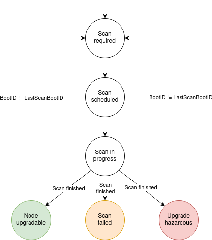
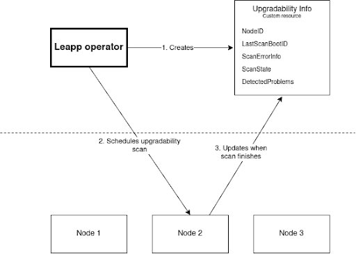

# OCP cluster pre-upgrades with Leapp

## Summary

This proposal describes an opt-in feature to automatically scan cluster nodes before an upgrade of the OS that crosses major versions to detect possible problems such as running on hardware that is deprecated in the upgrade target OS.

## Motivation

Upgrading between major OS versions typically includes several breaking changes. Although the overall structure of the OS-level cluster infrastructure greatly limits the risks, some problems such as HW deprecation or other kernel-specific changes cannot be avoided and they pose an unpleasant post-upgrade surprise. Therefore, we propose to use RedHat’s leapp tooling that already includes necessary data and mechanisms to detect these changes statically, prior to the upgrade, and inform the cluster administrator of potential dangers.

### User Stories

* **[Deprecated HW]** As an administrator of a cluster running on top of bare-metal, I would like to know whether any of the used HW has been deprecated in the upgrade target OS.
  * The leapp tooling has information about the hardware that has been deprecated, or hardware with dropped support. The information is obtained from tight collaboration with RedHat’s kernel engineering team, tracked internally, and periodically compiled into a JSON that is then used by the leapp tooling.

### Goals

The goal of this proposal is to provide a mechanism to detect potential problems before the upgrade, and inform the cluster administrator about them. The goal is to provide a clear and understandable report that will help the administrator to see the potential problems and decide whether to proceed with the upgrade or not.

### Non-Goals

This proposal does not include any automatic actions based on the scan results. The scan results are only informative and the administrator is expected to make the decision based on them. The proposal also does not include the upgrade process itself, only the pre-upgrade scan.

## Proposal

We propose an opt-in feature Leapp preupgrade scan - an automatic detection of problems encountered when upgrading nodes between major OS versions prior to performing the upgrade, and thus, determining whether the individual cluster nodes are eligible for upgrade.

The proposed solution consists of two parts:

1. Development and integration of a new operator within OpenShift, called ***Leapp Operator***, responsible for orchestrating the preupgrade scan.
2. A reduced, containerized version of the leapp tool – RedHat’s official tool to perform an in-place upgrade of a RHEL system.

Leapp preupgrade scan will be an opt-in feature that needs to be enabled by a user with an admin or cluster-admin role. This is done by installing the Leapp Operator.

The proposal introduces a single new custom resource:

* leapp.redhat.com/v1/UpgradabilityInfo: a single instance for every node in the cluster. The resource contains:
  * node identification
  * node boot ID - to know whether there have been any reboots since the last scan, and thus, new hardware might have been added
  * an error that caused the failure (empty if the scan is not in the failed state)
  * and a list of problems (e.g. obsolete hardware) with the node (initially empty, populated by the leapp tool upon termination)
  * Information about whether the upgradability scan has started

Operator also labels every node with a label reflecting the current upgradability information:

* scan-required > scan-scheduled > scan-in-progress >  node-upgradable | upgrade-hazardous | upgradability-scan-failed
  * node-upgradable - no problems preventing an upgrade have been found
  * upgrade-hazardous - performing an upgrade likely results in a node with impaired functionality
  * upgradability-scan-failed - leapp tool crashed

### Workflow Description

The workflow of proposed operator is following:

1. Install the leapp operator onto the cluster.
2. The operator monitors the cluster, detecting nodes that have no corresponding UpgradabilityInfo instance. For any of such nodes, a new UpgradabilityInfo is created and the node is labeled with ScanRequired.
3. The operator monitors the cluster for nodes with BootID different from the one in the corresponding UpgradabilityInfo.LastScanBootID. Every such node has its label changed to ScanRequired.
4. For any of the nodes in the state ScanRequired, a run of the containerized leapp tool is scheduled, changing node’s state to ScanScheduled.
5. Upon starting, the leapp tool changes the node label to ScanInProgress.
6. Upon successful termination, the pod instance modifies the corresponding UpgradabilityInfo with the list of potential problems detected with the node, changing node’s label into UpgradeHazardous/NodeUpgradable.
7. Problematic nodes can be identified by looking at their labels.

### API Extensions

This enhancment doesnt not alter the existing API surface, just adds a optional operator with a new CRD.

### Topology Considerations

#### Hypershift / Hosted Control Planes

N/A

#### Standalone Clusters

N/A

#### Single-node Deployments or MicroShift

N/A

### Implementation Details

A preview diagram of how the operator works:

Leapp is designed in a very modular fashion (actor model). The proposed containerized version of leapp utilizes this modularity, and it is designed in a fashion allowing for easy cherry picking of leapp’s features, while excluding any features not relevant to cluster upgrades.

### Risks and Mitigations

The proposal is designed to be as non-intrusive as possible. The leapp tool is a well-established tool, and the proposed operator is designed to be as simple as possible. The pre-upgrade process is done without the changes on the nodes.

### Drawbacks

There are no known drawbacks to this proposal.

## Design Details

## Test Plan

Leapp tooling is already tested and used in RHEL upgrade process. The testing will primarily focus on the integration of the leapp tool with the OpenShift cluster, and the operator itself.

## Graduation Criteria

**Note:** *Section not required until targeted at a release.*

### Dev Preview -> Tech Preview

**Note:** *Section not required until targeted at a release.*

### Tech Preview -> GA

**Note:** *Section not required until targeted at a release.*

### Removing a deprecated feature

**Note:** *Section not required until targeted at a release.*

## Upgrade / Downgrade Strategy

**Note:** *Section not required until targeted at a release.*

## Version Skew Strategy

N/A

## Operational Aspects of API Extensions

N/A

## Support Procedures

N/A

## Alternatives

No alternatives are known at this time.
