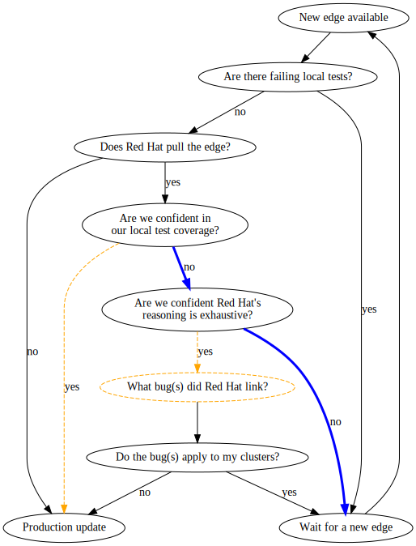

# Overriding Blocked Edges

We work hard to ensure update and release stability before even cutting candidate release images, but sometimes bugs slip through, as you can see [by our blocked edges][blocked-edges].
This can make users uncomfortable.
For example, a user might:

1. See a new A -> B edge appear in their channel.
2. Begin sending stage clusters over the edge to test its stability for their cluster flavor.
3. Become confident in the update's stability for their flavor.
4. Schedule a maintenance window to update their production cluster(s).
5. Have the edge pulled from their channel, causing distress when the maintenance window arrives and the A -> B edge is no longer recommended.

There have been many requests about rendering update graphs or pushing notifications about edge-pulls to mitigate these concerns, but I'm still not clear on how useful those would be.
I understand the user's decision tree for production clusters to flow something like:

  

I've marked the risky flows dashed and orange and the conservative flows thick and blue.

For me the sticking point is: who would ever say "yes" to "Are we confident Red Hat's reasoning is exhaustive?"?
If you feel like there are bugs you missed in your local testing but that there are no bugs which Red Hat has missed, why are you even doing local testing?
I've marked the "What bug(s) did Red Hat link?" node dashed and orange to show that I consider it a risky pathway that we do not need to enable with a convenient, structured response.

We try to update the edge-blocking comments as we discover new reasons, but:

1. There are probably additional edge-blocking reasons that we are not aware of at the moment.
2. We don't look too hard at edges after we pull them from the graph.

For pulling edges, we just need to find *one* sufficiently severe bug on the edge.
For initiating an update, users need confidence that there are no likely, severe bugs affecting their clusters.
These are two different things.

Getting [targeted edge blocking](../targeted-update-edge-blocking.md) in place will allow us to decrease the amount of collateral damage where we currently have to pull an edge for all clusters to protect a known, vulnerable subset of clusters.
And [alerting on available updates][alert-on-available-updates] will inform folks who have had an edge restored that they have been ignoring the (new) update opportunity.
Between those two, and similar efforts, I don't think that broadcasting edge-pulled motivations is a useful activity, and I think encouraging users to actively consume our blocked-edge reasoning in order to green-light their own off-graph updates is actively harmful.
Because do we support them if they hit some new bug?
Our docs around this are [currently wiggly][off-graph-support], but I expect there will be a lot of pain if we offer blanket support for folks taking any blocked edge we have ever served in a fast/stable channel.

Also note that the flow is always going through "Do local tests pass?".
We want users testing in candidate and fast to help turn up issues with their particular cluster flavor that we might not be catching in CI.
We also want them reporting Telemetry/Insights when possible too, so we can pick out lower-signal feedback that they might miss.
Or at least filing bugs if they find an issue and aren't reporting it via Telemetry/Insights.
Phased roll-outs ([when we get them][phased-rollouts]) allow us to minimize the impact of "nobody explicitly tested this flavor/workflow (enough times, for flaky failures)", but is ideally not the first line of defense.

If I was administering a production cluster, I'd personally be conservative and avoid both dashed and orange "yes" paths.

If a user came to me claiming "yes" to "Are we confident in our local test coverage?", I'd mention the existence of `oc adm upgrade --allow-explicit-upgrade --to-image ...`, and then immediately start trying to talk them into "no" (for both the local confidence and the "Are we confident Red Hat's reasoning is exhaustive?" nodes) to get them over to the "Wait for a new edge" endpoint.
But if they stick to "yes" and waived support, it's their cluster and their decision to make.
Testing clusters and others that are easily replaceable can attempt risky updates without going through this decision tree, because if they have issues during the update or on the target release, the administrators can just tear down the impacted cluster and provision a replacement on the original release.
This sort of testing with expendable clusters is how administrators would address the "local test" portions of the production cluster decision tree.

And hopefully updates soon become boring, reliable details, and folks just set [an auto-update switch][auto-update] and forget about scheduling updates entirely.

[alert-on-available-updates]: https://github.com/openshift/cluster-version-operator/pull/415
[auto-update]: https://github.com/openshift/enhancements/pull/124
[blocked-edges]: https://github.com/openshift/cincinnati-graph-data/tree/master/blocked-edges
[off-graph-support]: https://github.com/openshift/openshift-docs/blame/0a4d88729eccc2323ff319346e7824ca2f964b9e/modules/understanding-upgrade-channels.adoc#L101-L102
[phased-rollouts]: https://github.com/openshift/enhancements/pull/427
