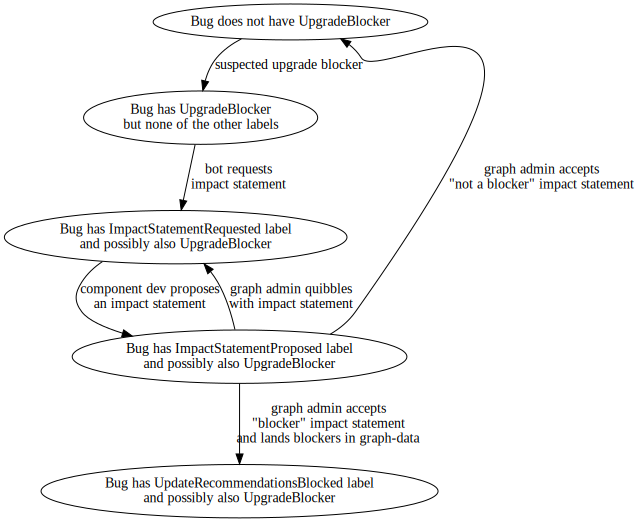

# Update-blocker Lifecycle

We occasionally have bugs which impact update success or the stability of the target release.
When that happens, we protect users by [removing the impacted updates from our update recommendations][graph-data-block].
This enhancement describes the process used to identify these bugs and determine which edges should be blocked because of them.

## Release Signoff Checklist

- [x] Enhancement is `implementable`
- [x] Design details are appropriately documented from clear requirements
- [ ] Test plan is defined
- [ ] Graduation criteria for dev preview, tech preview, GA
- [ ] User-facing documentation is created in [openshift-docs](https://github.com/openshift/openshift-docs/)

## Summary

The lifecycle for update blockers looks like:

  

Currently all tracking through the lifecycle is manual, and it is tedious for graph-admins to audit bugs with `UpgradeBlocker` to see where they are in the lifecycle and, when necessary, poke component teams about outstanding impact statement requests.
Having an explicit, machine-readable lifecycle reduces the chances that suspected update blockers fall through the cracks by clarifying the responsible parties for moving the bug to the next stage, which supports tracking and automated reminders.

With the changes from this enhancement, the queues become:

* [Suspect queue][suspect-queue].
* [Component developer queue][component-dev-queue] (individual component teams probably want to add additional filtering for their components).
* [Graph-admin queue][graph-admin-queue].

## Motivation

### Goals

* Clearly define, in a machine-readable fashion, the currently responsible party for bugs in the update-blocker lifecycle.

### Non-Goals

This enhancement does not attempt to:

* Cover issues which have not yet arrived in Bugzilla.
* Cover bugs which do not have the `UpgradeBlocker` keyword.
    For example, bugs with just the `Upgrades` keyword are not included in the update-blocker lifecycle.
* Remove the `UpgradeBlocker` keyword, because that might disrupt existing consumers.

## Proposal

Add new `Whiteboard` labels for `ImpactStatementRequested`, `ImpactStatementProposed`, and `UpdateRecommendationsBlocked`.
Write tooling that automatically:

* Removes the new labels if any labels from later in the process are set.
* Adds `Upgrades` and `UpgradeBlocker` to any bugs with any of the new labels.

### Impact statement request

The following statement (or a link to this section) can be pasted into bugs when adding `ImpactStatementRequested`:

We're asking the following questions to evaluate whether or not this bug warrants blocking an upgrade edge from either the previous X.Y or X.Y.Z.
The ultimate goal is to avoid delivering an update which introduces new risk or reduces cluster functionality in any way.
Sample answers are provided to give more context and the ImpactStatementRequested label has been added to this bug.
When responding, please remove ImpactStatementRequested and set the ImpactStatementProposed label.
The expectation is that the assignee answers these questions.

Who is impacted?  If we have to block upgrade edges based on this issue, which edges would need blocking?
* example: Customers upgrading from 4.y.Z to 4.y+1.z running on GCP with thousands of namespaces, approximately 5% of the subscribed fleet
* example: All customers upgrading from 4.y.z to 4.y+1.z fail approximately 10% of the time

What is the impact?  Is it serious enough to warrant blocking edges?
* example: Up to 2 minute disruption in edge routing
* example: Up to 90 seconds of API downtime
* example: etcd loses quorum and you have to restore from backup

How involved is remediation (even moderately serious impacts might be acceptable if they are easy to mitigate)?
* example: Issue resolves itself after five minutes
* example: Admin uses oc to fix things
* example: Admin must SSH to hosts, restore from backups, or other non standard admin activities

Is this a regression (if all previous versions were also vulnerable, updating to the new, vulnerable version does not increase exposure)?
* example: No, it has always been like this we just never noticed
* example: Yes, from 4.y.z to 4.y+1.z Or 4.y.z to 4.y.z+1

### User Stories

#### A developer wondering about a serious bug

Before this enhancement, the "is this an update blocker?" process was less discoverable.
With this enhancement, the concerned developer only needs to add the `UpgradeBlocker` keyword to initiate the process.
And they also have access to this document to more easily understand the rest of the process, if they need to push the whole decision through before an update monitor is available to help out.

#### A component maintainer assigned to a bug

This enhancement adds labels to make it clear whether the bug assignee is currently responsible for providing an impact statement (`ImpactStatementRequested`), or whether the bug assignee has fulfilled their responsibility and moved the bug to `ImpactStatementProposed`.

#### An update monitor managing multiple bugs

This enhancement formalizes the various steps in the decision process, allowing for some steps to be automated, and giving a clear `ImpactStatementProposed` queue for final block-or-not considertion.

### Risks and Mitigations

No risks.

## Design Details

It's all up in [the *proposal* section](#proposal).

### Test Plan

No test plan.

### Graduation Criteria

No graduation criteria; this is internal policy and has no backwards-compatibility commitments.

#### Dev Preview -> Tech Preview

No graduation criteria.

#### Tech Preview -> GA

No graduation criteria.

#### Removing a deprecated feature

We might decide to do something completely different tomorrow.
Don't build anything on top of this process that you would be sad about throwing away.

### Upgrade / Downgrade Strategy

This enhancement is only intended to help ongoing graph-data operation.
If we pivot strategies, we will likely abandon any closed bugs without porting them to the new strategy.
Or we may port closed bugs to new strategies, if that makes implementing the next strategy easier.

### Version Skew Strategy

All of the data is in Bugzilla, and we control all the consumers for this internal workflow.
So if we pivot strategies, we can turn off any robots and port everything that needs porting at once.
There is no need to provision for version skew.

## Implementation History

No implementation.

## Drawbacks

No drawbacks.

## Alternatives

### Drop `UpgradeBlocker`

As an alternative to keeping the `UpgradeBlocker` keyword, we could replace it with `ImpactStatementRequestRequested` or some such if folks need bot assistance to move bugs into the component developer's queue.
This would avoid the need for tooling to add `UpgradeBlocker` when missing, and makes it less likely that folks misconstrue a suspect (`ImpactStatementRequested`) as an actual blocker (`UpdateRecommendationsBlocked`).

However, removing `UpgradeBlocker` would break folks who are expecting the current keyword.
But it's not clear to me who would want to keep consuming that keyword after we grow the fine-grained labeling, but we have been trying to train developers to set `UpgradeBlocker` on potential blockers, and retraining developers is hard.

[graph-data-block]: https://github.com/openshift/cincinnati-graph-data/tree/50e5eb7ebb123f584bcdb5dbc5cab0cfcedd82ea#block-edges
[suspect-queue]: https://bugzilla.redhat.com/buglist.cgi?order=Last%20Changed&product=OpenShift%20Container%20Platform&query_format=advanced&f1=keywords&o1=casesubstring&v1=UpgradeBlocker&f2=status_whiteboard&o2=nowordssubstr&v2=ImpactStatementRequested%20ImpactStatementProposed%20UpdateRecommendationsBlocked
[component-dev-queue]: https://bugzilla.redhat.com/buglist.cgi?order=Last%20Changed&product=OpenShift%20Container%20Platform&query_format=advanced&status_whiteboard=ImpactStatementRequested&status_whiteboard_type=casesubstring
[graph-admin-queue]: https://bugzilla.redhat.com/buglist.cgi?order=Last%20Changed&product=OpenShift%20Container%20Platform&query_format=advanced&status_whiteboard=ImpactStatementProposed&status_whiteboard_type=casesubstring
