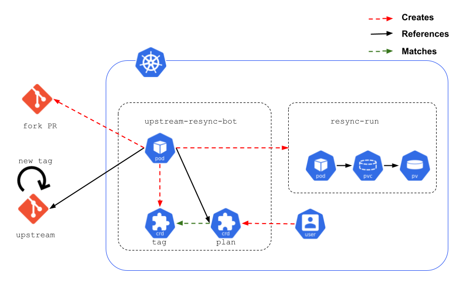

# Upstream Repository Resync

## Release Signoff Checklist

- [ ] Enhancement is `implementable`
- [ ] Design details are appropriately documented from clear requirements
- [ ] Test plan is defined
- [ ] Graduation criteria for dev preview, tech preview, GA
- [ ] User-facing documentation is created in [openshift-docs](https://github.com/openshift/openshift-docs/)

## Summary

This enhancement will reduce the time spent on syncing downstream repositories with their upstreams.
It aims to automate repetitive activities and leave only the creative/intellectual work, such as
conflict resolution, to repository maintainers.

## Motivation

Many Openshift teams frequently spend time synchronizing downstream projects with their upstreams.
Different ways of dealing with this activity exist. Often with hard-coded steps that fit a specific team's
habits, and there is an opportunity to provide a generic and semi- or fully-automated answer to this issue through Openshift CI.

### Goals

Automate the syncing of upstream projects with their downstreams following the 80/20 rule.
* Automatically fetch upstream changes
* Automate common tasks, such as dependency resolution
* Create a pull request in downstream repository
* When a change in upstream repository causes conflicts with downstream repository, notify downstream repository maintainers and resume once conflicts have been resolved by the maintainers.

### Non-Goals

* Teaching a program how to resolve conflicts between upstream and downstream repositories.

## Proposal

Opinionated, yet configurable bot, that can follow resync plans and interact with downstream repository maintainers via Github Pull Requests.

There are existing solutions within Openshift, each written to accommodate one team's approach, and are inspiration for this enhancement. These typically include hard-coded steps, such as running `git` or `go mod` commands.
* [merge-bot](https://github.com/shiftstack/merge-bot/blob/main/src/merge_bot/merge_bot.py#L135)
* [rebase-bot](https://github.com/openshift-cloud-team/rebasebot/blob/main/rebasebot/bot.py#L82)

This proposal describes how the hard-coded steps can be abstracted into a config file, thus a single implementation can be leveraged by multiple teams.

The goal is to automatically create a PR that contains the results of a prepared list of steps resynchronizing the downstream, for the maintainers to review.

### User Stories

As the downstream repository maintainer, I want a new upstream resync activity to be triggered when a new upstream release is created.

As the downstream repository maintainer, I would like to define an upstream resync plan, with an ordered list of steps to run so that the bot executes these steps and updates the downstream.

As the downstream repository maintainer, I would like to pick up a PR resulting from an upstream resync attempt, and resolve the conflicts so that the resync activity can resume.

As the CI administrator, I need to deploy pre-packaged manifests to the openshift CI so that upstream resync is installed in a simple manner and can be used on openshift dowstream repositories.

### API Extensions

This enhancement proposal aims to help maintainers be more productive by enhancing
existing CI infrastructure. CRDs and webhooks defined in this document are not meant
to be shipped outside this scope.

CRDs and webhooks are described in detail below.

### Implementation Details/Notes/Constraints

Teams handle synchronization activities in many ways, depending on the legacy of the project, on the types of changes that need to be imported to the downstream (patches, new versions, etc.) and other factors.
It is therefore not possible to propose a single recipe for syncrhonizing one repo with its upstream.

Rather, this proposal aims to allow the team to:
* watch for changes in upstream repositories,
* and to define recipe (plan), with specific steps, that would match this synchronization use case.

Both of these elements (tags and plans) become Custom Resources that are used to run a sync-run in Openshift CI, which results in creating Pull Request containing the synchronization changes.



#### Tag

Representation of a release inside an Openshift cluster. This resource is used to keep track of releases in the upstream.
When a new Tag comes in, it's put in a re-sync graph and matched against Plans. If no Plan for the Tag exists,
the Tag is left as it is. If a Plan exists, the Tag is considered for syncing based on its priority in the re-sync graph.
The re-sync graph follows the principles of semantic versioning. Older Tags have higher priority.

Example:
```yaml
kind: tag
metadata:
  name: 1.21.2
spec:
  repository: github.com/kubernetes/kubernetes
  next: 1.21.3
status:
  plan: z-release-4.8
  phase: finished
  pullRequest: github.com/openshift/kubernetes/pulls/13123
  conditions:
  - type: ResynchroPlanStatus
    status: finished
    reason: ""
    message: resynchro plan z-release-4.8 is finished
```

#### Plan

The Plan Custom Resource mainly defines the steps that the CI will perform in order to prepare a PR synchronizing the repository with its upstream for a certain tag.

It contains 2 major sections:
* config: defines, at minimum, the upstream tag, and the downstream branch as well as the container image that the plan will use
* steps: lists the steps that will run sequentially  during the plan execution

Example:
```yaml
kind: plan
metadata:
  name: z-release-4.8
spec:
  config:
    upstream:
      name: github.com/kubernetes/kubernetes
      matchedVersions:
      - 1.21.x
    downstream:
      name: github.com/openshift/kubernetes
      branch: release-4.8
    enablePrereleases: false
    image: registry.ci.openshift.org/openshift/release:rhel-8-release-golang-1.16-openshift-4.8
    env:
    - name: UPSTREAM_REF
      from: .config.upstream.name
    - name: DOWNSTREAM_REF
      from: .config.downstream.name
    - name: CHANGELOG_LINK
      value: https://github.com/kubernetes/kubernetes/blob/ster/CHANGELOG/CHANGELOG-1.21.md#1212
    slack:
      credentials:
        secretSelector: slack-secret
    github:
      credentials:
        secretSelector: github-secret
  steps:
  - name: Git merge
    run: git merge $UPSTREAM_REF
  - name: Update go.mod
    run: 'sed -E "/=>/! s/(\tgithub.com\/openshift\/[a-z|-]+) (.*)$/\1 $DOWNSTREAM_REF/" go.mod'
  - name: Go mod tidy
    run: go mod tidy
  - name: Update vendor
    run: hack/update-vendor.sh
  - name: Update hyperkube Dockerfile
    run: 'sed -E "s/(io.openshift.build.versions=\"kubernetes=)(1.[1-9]+.[1-9]+)/\1$k8s_tag/" openshift-hack/images/hyperkube/Dockerfile.rhel'
  - name: Re-generate files
    run: make update OS_RUN_WITHOUT_DOCKER=yes
  - name: Git add
    run: git add -A
  - name: Git commit
    run:  'git commit -m "UPSTREAM: <drop>: hack/update-vendor.sh, make update and update image"'
  - name: Create PR
    action:
      type: pull-request
      title: "Bug $BUGZILLA_ID: Rebase $UPSTREAM_REF"
      body: "Changelog: $CHANGELOG_LINK"
  - name:
    action:
      type: slack-notification
      channel: chan-1
      message: "New version!"
```

### Risks and Mitigations

This enhancement leverages past experience of rebasing z-stream releases of
kubernetes/kubernetes into openshift/kubernetes manually as well as automating
some steps in a [bash script](https://github.com/openshift/kubernetes/commit/980405ba6f7a238cf966801f438981304b2b31c9).

The authors believe that the investment into automating repository synchronization is worthwhile.

There already exist rebase/merge bots that live in silos. This enhancement aims to be generic enough
to benefit the wider organization. The risk is that this enhancement will result in a silo of its own.
To mitigate this risk, the authors commit to open and inclusive communication with all interested parties.

_TODO:_ bot's github credentials access scope

## Design Details

### Open Questions [optional]

 > 1. Keeping track of sync jobs via pod status vs. dedicated CRD

### Test Plan

**Note:** *Section not required until targeted at a release.*

### Graduation Criteria

**Note:** *Section not required until targeted at a release.*

#### Dev Preview -> Tech Preview

#### Tech Preview -> GA

#### Removing a deprecated feature

### Upgrade / Downgrade Strategy

### Version Skew Strategy

### Operational Aspects of API Extensions

#### Failure Modes

#### Support Procedures

## Implementation History

## Drawbacks

## Alternatives

* Manual upgrades
* Scripts
* Single-project purposed bots

## Infrastructure Needed [optional]

* GitHub App setup
* Openshift CI cluster
