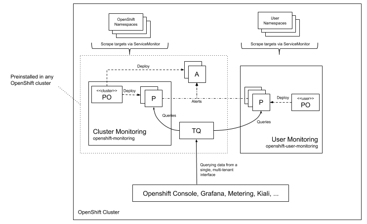

# user-workload-monitoring

## Release Signoff Checklist

- [x] Enhancement is `implementable`
- [x] Design details are appropriately documented from clear requirements
- [ ] Test plan is defined
- [ ] Graduation criteria for dev preview, tech preview, GA
- [ ] User-facing documentation is created in [openshift/docs]

## Summary

This enhancement describes a new feature for OpenShift cluster observability, namely user workload monitoring.
User workload monitoring will not be enabled by default, it is an opt-in feature
that can be enabled after installation.
It is an extension to the existing cluster monitoring stack to enable observability of user namespaces.
Currently, the cluster monitoring stack only reconciles OpenShift namespaces.

## Motivation

Currently, there is no supported solution for customers to monitor their business critical applications.
The existing cluster monitoring stack has no support for adding scrape targets in user namespaces
as it is only available for OpenShift components scraping workloads from `openshift-*` namespaces.
Other Red Hat products, outside the OpenShift framework components also
don’t have a monitoring solution to integrate their metrics and out-of-the-box insights into their well being.
Currently it is difficult to achieve metering/chargeback for Red Hat products without a central observability stack.

### Goals

Allow deployment and reconciliation of scrape targets, recording rules, and alerting rules in user namespaces.
This effectively means the following custom resources:

-  [ServiceMonitor](https://github.com/openshift/prometheus-operator/blob/master/Documentation/api.md#servicemonitor)
- [PodMonitor](https://github.com/openshift/prometheus-operator/blob/master/Documentation/api.md#podmonitor)
- [PrometheusRule](https://github.com/openshift/prometheus-operator/blob/master/Documentation/api.md#prometheusrule)

Allow the correlation between app and cluster centric metrics.

### Non-Goals

Out of scope are:

- Definition of Dashboards.
- Deployment of Prometheus instances in user namespaces.
- Deployment of Alertmanager instances in user namespaces.

## Proposal

The existing cluster monitoring stack is going to be extended with additional Prometheus (P) servers
and one additional Prometheus Operator (PO) reconciling user namespaces
as well as the newly added Prometheus servers.

The cluster Prometheus Operator (PO) continues to operate the cluster-level Prometheus.
We will continue to use a centralized Alertmanager (A) cluster.
The existing Alertmanager cluster will aggregate both user workload alerts as well as cluster alerts. Tenancy will be achieved by forcing specific labels onto metrics and alerts by which the central Alertmanager config can route similarly to how tenancy is achieved at the query level (see below).

Querying data from a single, multi-tenant interface is done using the Thanos Querier (TQ) component.
Tenancy is enforced at the prometheus query layer. This is achived by leveraging the existing topology using kube-rbac-proxy [1] and prom-label-proxy [2].

Differences between cluster- and user-level is mainly upgrade guarantees. The cluster-level Prometheus stack is an integral part of OpenShift and its reliability is important, keeping the stack immutable and fully testable by us allows us to rely on it to a higher degree. As we have no such possibility for user defined configurations and scrape targets, we can't provide the same guarantees.

There are edge cases where an automated upgrade is not possible in the face of user workload monitoring.
If users declare i.e. queries in ServiceMonitors which break in newer Prometheus versions
we most likely cannot perform an automated migration. Such migration without knowledge of user intention behind each query would be exceptionally difficult.

Instead, the "upgradable" condition in the ClusterOperator will be set to false.
Routing configurations for alerts to be sent to specific teams need to be communicated/configured by an infrastructure owner using the existing Alertmanager stack that is part of cluster-monitoring.
We will look into extension mechanisms post GA.
With any OpenShift deployment, we only install the cluster-level part
and allow infrastructure owner to "enable" the addition of user workload monitoring.

### User Stories

#### US1

As a service owner, I’d like to configure a ServiceMonitor CRD so that Red Hat’s supported monitoring solution is able to scrape metrics for my service.

#### US2

As a service owner, I’d like to configure alerting rules for my service so that Red Hat’s supported monitoring solution notifies me if problems turn up.

#### US3

As a member of the operations team, I want to configure Prometheus one time so that all existing and any new namespaces will have access to user workload monitoring.

#### US4

As a member of the operations team, I'd like to add my own exporters so that I can monitor infrastructure services that are not monitored out-of-the-box.

Note: This covers adding ServiceMonitor and PrometheusRule CRDs.

#### US5

As a developer working on a Red Hat product not part of the infrastructure, I’d like to integrate my metrics into a single, supported Prometheus stack so that they are available for my customers.

#### US6

As a service owner, I’d like to query the metrics I have access to from the OpenShift console.

#### US7

As a member of the operations tenant, I’d like to make sure that one tenant doesn't have access to metrics from another tenant.

#### US8

As a member of the operations team, I'd like the ability for application developers to access container cpu and memory usage metrics.

### Implementation Details/Notes/Constraints

#### Isolation

The cluster monitoring as well as the user workload monitoring stack are composed of custom resources
reconciled by two separate prometheus operators.
Both prometheus operators are under supervision of cluster monitoring operator.
This allows a separation of concerns in terms of upgradability, security settings, and scalability.
The cluster monitoring Prometheus Operator continues to be deployed in the `openshift-monitoring` namespace.
The user workload monitoring Prometheus Operator will be deployed in the `openshift-user-monitoring` namespace.

Currently, cluster monitoring operator scans all namespaces filtering `openshift` namespaces labeled with
`openshift.io/cluster-monitoring: "true"` and takes this set of namespaces as the _allowed list_ of reconcilable
namespaces for the existing cluster monitoring prometheus operator.

The same set of openshift namespaces that exist today will be configured as a _deny list_ of reconcilable namespaces
at the user workload monitoring prometheus operator.
Deny listing of namespaces was added recently in prometheus operator, see [3].

To make sure that users cannot add Prometheus instances in user namespaces,
a new WIP feature [4] will ensure that reconciliation of Prometheus custom resources
will be limited to the `openshift-user-monitoring` namespace for the user workload monitoring prometheus operator
and `openshift-monitoring` namespace for the cluster monitoring prometheus operator.

User workload monitoring Prometheus Operator (green) then will reconcile Prometheus custom resources
in the `openshift-user-monitoring` namespace only.
It ignores Prometheus custom resources in any other namespace.
The same holds true for the cluster monitoring prometheus operator (red).

#### Aggregation

The front facing Kubernetes service has to make it as simple as possible
for integrators to leverage both user workload monitoring as well as cluster monitoring.

This is achieved by using Thanos Querier which allows to aggregate
and optionally deduplicate the cluster and user workload monitoring metrics backends
under single Prometheus Query endpoint.

Usage of the Thanos querier component inside cluster monitoring has many advantages:
1. Aggregation of multiple sources (user workload monitoring and cluster monitoring) into one global view.
2. Run-time deduplication of metrics available today.
3. Gap-filling of metrics series in the Prometheus HA user and cluster monitoring setup.
4. Potentially add the possibility of adding a query cache for increased performance in the future.

See [5] and [6] for more details.

### Tenancy

Tenancy is achieved by leveraging the existing topology that is protecting cluster monitoring Prometheus already today.
The kube-rbac-proxy sidecar will be deployed along with prom-label-proxy in the Thanos Querier Deployment.

For details about the tenancy model see the README for prom-label-proxy [2].

### Risks and Mitigations

Risks are for one in the area of security, namely in the realm of accessing metrics a user has no permissions for.
This is achieved by reusing the existing tenancy stack as well as with the newly added features for allow-lists,
deny-lists and reconcilation limiting settings for prometheus operator.

Another risks are related to saturation of Prometheus servers.
Potential queries of death (QoD) or aggressive scrapte targets with high cardinality
can impact the availability of the user workload monitoring prometheus instances.

## Design Details

### Test Plan

TBD

### Graduation Criteria

N/A

#### Examples

These are generalized examples to consider, in addition to the aforementioned
[maturity levels][maturity-levels].

##### Dev Preview -> Tech Preview

There is no dev preview planned, just tech preview.

##### Tech Preview -> GA 

- More testing (upgrade, downgrade, scale)
- Sufficient time for feedback
- Available by default
- Document relationship to user workload monitoring
when launching prometheus operator via OLM.
- Specify deprecation strategy for OperatorGroup custom resources in OLM.
The OperatorGroup is marked as deprecated,
the removal is blocked by OLM's prometheus operator.
- Analyze saturation of new prometheus servers
and evaluate fitness for GA by analyzing telemetry.

##### Removing a deprecated feature

- Announce deprecation and support policy of the existing feature
- Deprecate the feature

### Upgrade / Downgrade Strategy

Upgrades and downgrades will be orchestrated by cluster monitoring operator
the same way as the cluster monitoring stack.
User workload monitoring leverages the same semantics in terms of deployable assets
and custom resources.

### Version Skew Strategy

N/A

## Implementation History

N/A

## Drawbacks

N/A

## Alternatives

One alternative is to stick with the current way of user workload monitoring
by launching prometheus operator via OLM.

In OpenShift 4.3 the user has to mutually exclusively decide
between an OLM based prometheus operator deployment
or the new user workload monitoring stack.
Both features are opt-in after installation.

This alternative though is not desirable as many customers are not fully satisfied
with the this approach and this alternative does not allow to deprecate OperatorGroups.

## References

[1] https://github.com/brancz/kube-rbac-proxy

[2] https://github.com/openshift/prom-label-proxy

[3] https://github.com/coreos/prometheus-operator/pull/2710

[4] https://github.com/coreos/prometheus-operator/pull/2197

[5] https://deploy-preview-1541--thanos-io.netlify.com/components/query.md/

[6] https://github.com/cortexproject/cortex/issues/1672
