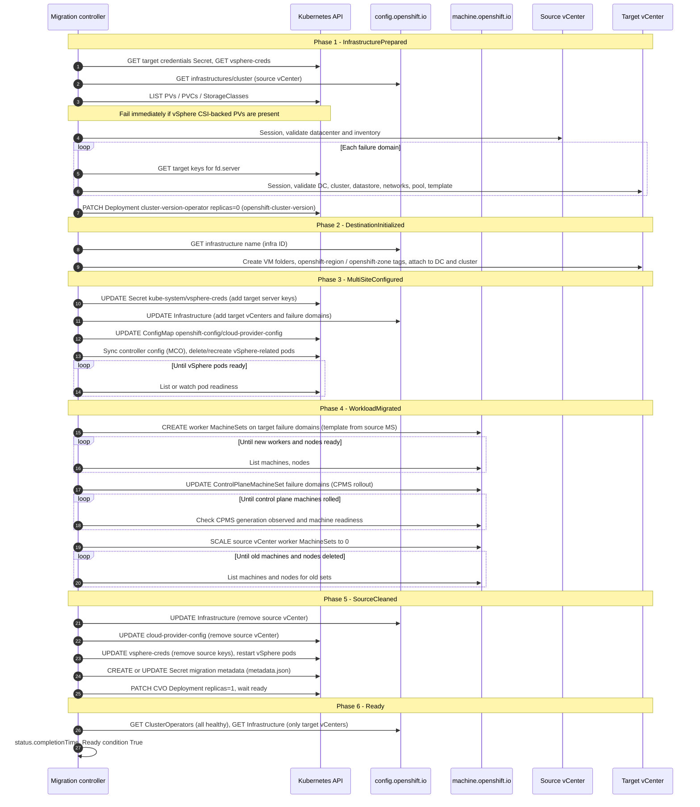

# VCF Migration Operator

## Summary

Migrate OpenShift clusters from a source vCenter to a destination vCenter.

## Motivation

Customers are upgrading to greenfield VCF environments, they need a better method of migration than rebuild and MTC.

### User Stories

The following one-line stories map to child issues under epic [SPLAT-2644](https://issues.redhat.com/browse/SPLAT-2644).

- **[SPLAT-2645](https://issues.redhat.com/browse/SPLAT-2645):** Implement pre-merge testing for OpenShift cluster migration on vSphere.
- **[SPLAT-2646](https://issues.redhat.com/browse/SPLAT-2646):** Automate end-to-end testing for OpenShift cluster migration on vSphere.
- **[SPLAT-2647](https://issues.redhat.com/browse/SPLAT-2647):** Implement CI for OpenShift cluster migration on vSphere.
- **[SPLAT-2649](https://issues.redhat.com/browse/SPLAT-2649):** Change OpenShift API validation so users can add additional vCenters as a day-2 operation.
- **[SPLAT-2651](https://issues.redhat.com/browse/SPLAT-2651):** Convert INI-format vSphere cloud-config to YAML during migration.
- **[SPLAT-2652](https://issues.redhat.com/browse/SPLAT-2652):** Deliver a pre-flight validation framework before migration runs.
- **[SPLAT-2653](https://issues.redhat.com/browse/SPLAT-2653):** Support operator installation and deployment (including OLM).
- **[SPLAT-2654](https://issues.redhat.com/browse/SPLAT-2654):** Migrate control plane nodes via CPMS on IPI clusters.
- **[SPLAT-2655](https://issues.redhat.com/browse/SPLAT-2655):** Roll worker nodes to the destination on IPI clusters.
- **[SPLAT-2656](https://issues.redhat.com/browse/SPLAT-2656):** Expose migration progress tracking for operators.
- **[SPLAT-2657](https://issues.redhat.com/browse/SPLAT-2657):** Allow pausing and resuming a migration safely.
- **[SPLAT-2658](https://issues.redhat.com/browse/SPLAT-2658):** Publish operator installation and usage documentation.
- **[SPLAT-2659](https://issues.redhat.com/browse/SPLAT-2659):** Create and publish the OLM bundle.
- **[SPLAT-2661](https://issues.redhat.com/browse/SPLAT-2661):** Maintain a unit test suite for the operator.
- **[SPLAT-2662](https://issues.redhat.com/browse/SPLAT-2662):** Update `metadata.json` and persist configuration using ConfigMap storage.
- **[SPLAT-2663](https://issues.redhat.com/browse/SPLAT-2663):** Create required vCenter tag categories and tags for topology.
- **[SPLAT-2664](https://issues.redhat.com/browse/SPLAT-2664):** Gate day-2 vCenter addition behind an appropriate feature gate.
- **[SPLAT-2681](https://issues.redhat.com/browse/SPLAT-2681):** Enable the operator repository in OpenShift release tooling.
- **[SPLAT-2683](https://issues.redhat.com/browse/SPLAT-2683):** Create VM templates on the destination vCenter for replacement nodes.
- **[SPLAT-2684](https://issues.redhat.com/browse/SPLAT-2684):** Create folder layout on the destination vCenter for migrated machines.
- **[SPLAT-2701](https://issues.redhat.com/browse/SPLAT-2701):** Investigate Konflux for builds or delivery.
- **[SPLAT-2702](https://issues.redhat.com/browse/SPLAT-2702):** Author and merge the OpenShift enhancement proposal.
- **[SPLAT-2703](https://issues.redhat.com/browse/SPLAT-2703):** Migrate control plane nodes via CPMS on UPI clusters.
- **[SPLAT-2704](https://issues.redhat.com/browse/SPLAT-2704):** Roll worker nodes to the destination on UPI clusters.

### Goals

- Migrate OpenShift on vSphere from a source vCenter to a destination vCenter using Machine API and Control Plane Machine Set (CPMS), with operator-driven validation and phased reconciliation.

### Non-Goals

- Migration of vSphere CSI persistent volumes in v1 (Phase 2 / Storage); Phase 1 should **fail preflight immediately** if vSphere CSI-backed persistent volumes are detected on the cluster.


## Proposal

Implementation lives in [`openshift/vcf-migration-operator`](https://github.com/openshift/vcf-migration-operator): Kubebuilder / Operator SDK (`go.kubebuilder.io/v4`), Go 1.25+, `controller-runtime`, OpenShift `config` and `machine` clients, and `govmomi` for vSphere. The manager deploys into namespace **`openshift-vcf-migration`** (kustomize default). An optional **OpenShift Console dynamic plugin** (React/PatternFly + Go backend) provides a migration wizard, vCenter inventory browse APIs, and an SSE event stream for progress; install is separate from the core operator (`make deploy-console-plugin`).

Deliverables present in-tree: **`VmwareCloudFoundationMigration`** CRD (`migration.openshift.io/v1alpha1`, namespaced, short name `vcfm`), reconciler with ordered conditions, OLM **`bundle/`** (Operator SDK 1.42–style CSV + CRD), **Prometheus metrics** via controller-runtime (secure metrics Service in bundle), **envtest unit tests** (`make test`), and **Ginkgo e2e** scaffolding against Kind (`test/e2e`).

### Workflow Description

Reconciliation runs only when **`spec.state`** is **`Running`**; **`Pending`** and **`Paused`** skip work (pause is spec-driven). Stages map to **`status.conditions`** in order:

1. **InfrastructurePrepared** — Prerequisites validation (CR, secrets, **Infrastructure**, storage eligibility, live vSphere inventory on source and each target), then **CVO** scaled to **0** in **`openshift-cluster-version` / `cluster-version-operator`**. See [InfrastructurePrepared: prerequisites validation](#infrastructureprepared-prerequisites-validation).
2. **DestinationInitialized** — On target vCenter: VM folders, **`openshift-region` / `openshift-zone`** tag categories and tags, attach tags to datacenter/cluster (govmomi vAPI).
3. **MultiSiteConfigured** — Add target vCenter(s) and failure domains to **`Infrastructure`** `spec.platformSpec.vsphere`, merge **`cloud-provider-config`** in `openshift-config` (YAML, `k8s.io/cloud-provider-vsphere` config types), refresh affected pods; cluster must see both sites.
4. **WorkloadMigrated** — **CPMS** failure domains updated and rolled out to target; new worker **MachineSets** on target failure domains; scale old source worker sets to zero; wait for machines ready / rollout complete.
5. **SourceCleaned** — Remove source vCenter from Infrastructure and cloud config; update installer **`metadata.json`** (stored in a **Secret** `<migration-name>-metadata`, key `metadata.json`); re-enable **CVO** and wait for it healthy.
6. **Ready** — Aggregate completion.

End-to-end interactions (controller ↔ cluster APIs ↔ vSphere): [Migration sequence (end-to-end)](#migration-sequence-end-to-end).

### Migration sequence (end-to-end)

High-level sequence aligned with the reconciler in [`openshift/vcf-migration-operator`](https://github.com/openshift/vcf-migration-operator). Steps **requeue** with backoff while waiting for pods, machines, or CVO; the diagram omits those loops except where noted.



### InfrastructurePrepared: prerequisites validation

This stage runs only when **`spec.state: Running`**. Status is set to **`InfrastructurePrepared`** = **False**, **`reason: Progressing`**, with **`message`** updated as checks advance. Any failure returns an error, sets the condition **False** / **`Failed`**, and blocks CVO changes.

#### Controller-enforced checklist (order enforced in controller)

| Step | What is validated | Failure symptom (representative) |
|------|-------------------|-----------------------------------|
| 1 | **`spec.failureDomains`** non-empty | `spec.failureDomains must not be empty` |
| 2 | **`spec.targetVCenterCredentialsSecret.name`** set; Secret exists in referenced namespace (default = migration CR namespace) | secret not found |
| 3 | **`Infrastructure`** `cluster`: **`spec.platformSpec.vsphere.vcenters[0]`** present (source vCenter); **`.datacenters[0]`** non-empty | no vCenters / no datacenters |
| 4 | **Storage eligibility:** inspect cluster **PVs / PVCs / StorageClasses** and **fail immediately** if any bound or provisioned storage is backed by **vSphere CSI** (for example via CSI driver **`csi.vsphere.vmware.com`**, a vSphere CSI provisioner, or a vSphere CSI storage class) | vSphere CSI storage detected |
| 5 | **Source credentials** in **`kube-system/vsphere-creds`**: keys **`{sourceServer}.username`** and **`{sourceServer}.password`** (`sourceServer` = Infrastructure source vCenter **server** string) | missing keys |
| 6 | **Source vSphere session** (govmomi, TLS verify skipped in implementation) to **source vCenter** using datacenter **name** from step 3 | connect/login failure |
| 7 | **Source datacenter** resolvable via finder | datacenter not accessible |
| 8 | **Per `failureDomain`** (sequential): read **`{fd.server}.username` / `{fd.server}.password`** from the **target** credentials Secret; open session to **`fd.server`** using **`fd.topology.datacenter`** | bad keys or connect failure |
| 9 | Same failure domain: finder resolves **datacenter**, **compute cluster** path, **datastore** path, each **network** name/path | object not found |
| 10 | If **`topology.resourcePool`** set: finder resolves resource pool | not found |
| 11 | If **`topology.template`** set: finder resolves **virtual machine** (template) path | not found |
| 12 | **Disable CVO**: scale Deployment **`cluster-version-operator`** in **`openshift-cluster-version`** to **0** replicas | scale API error |

On success: **`InfrastructurePrepared`** = **True**, **`reason: Completed`**, message *Infrastructure prepared and CVO disabled*; Kubernetes **Event** *Preflight validation passed, CVO disabled*.

Phase 1 of the [end-to-end migration sequence](#migration-sequence-end-to-end) diagram matches this checklist at the interaction level.

#### Additional customer prerequisites before setting `spec.state: Running`

The controller can validate vCenter inventory and some cluster state, but **Phase 1 is not a complete site-cutover validator**. Before a migration is started, customers must confirm the following prerequisites manually or with their own automation:

- **Cluster endpoint continuity:** The cluster's **`api`**, **`api-int`**, and **`*.apps`** DNS names must continue to resolve to reachable VIPs / load balancers for the entire migration window. v1 assumes those names remain stable; renaming cluster endpoints or re-issuing the API / ingress trust chain is a separate cutover workflow.
- **External load balancers / VIP managers:** Systems such as **F5**, **Avi**, **NSX**, or hardware load balancers are **not** reconciled by this operator. Their backend pools, health checks, and maintenance windows must be prepared for mixed source/target nodes before any Machine rollout begins.
- **Proxy and egress pathing:** If the cluster uses **`Proxy`**, ensure the destination vCenter FQDNs / IPs and any site-local DNS, NTP, IPAM, or storage endpoints are present in the correct **`proxy`** / **`noProxy`** scope for both nodes and control-plane components.
- **Firewall and routing reachability:** Nodes, control-plane components, and the operator Pod must be able to reach the source and destination vCenters, storage endpoints, DNS, NTP, and any external IPAM / automation service used during the move. Inventory lookup from the operator Pod alone is not sufficient proof of end-to-end connectivity.
- **MTU and network policy parity:** Stretched L2 or same-subnet designs do not guarantee matching **MTU**, ACLs, or micro-segmentation policy on the destination port groups; validate those characteristics before pausing **CVO**.
- **Operational ownership:** Before **CVO** is paused, identify the people or automation responsible for external DNS, load balancer, firewall, and IPAM changes, and take the recommended cluster backup (see [Support Procedures](#support-procedures)).

#### Reviewer notes

- **Credential layout** must match **exact** vCenter address strings between **Infrastructure**, **`vsphere-creds`**, **`failureDomains[].server`**, and Secret key prefixes, or lookups fail.
- **Phase 1 storage gate:** the operator should reject migrations for clusters that already use **vSphere CSI-backed persistent volumes**; this should happen **before CVO is paused**.
- **No folder-only preflight** for `topology.folder` in this stage; **template** (if set) is validated as an inventory VM path.
- **Paused CVO** means cluster version reconciliation stops until a later stage re-enables it; clusters should complete migration or follow recovery runbooks if this stage succeeds but later stages fail.
- **L2 and latency are not validated here today:** Preflight proves **API reachability** and **inventory** on each vCenter; it does **not** assert **layer-2 adjacency** for node networks or acceptable **RTT** between sites—operators should add a **documented manual or automated latency check** (see [Risks and Mitigations](#risks-and-mitigations)) before setting **`spec.state: Running`**.
- **Post-v1 option:** a future release could provision a short-lived **RHCOS** validation VM per target failure domain to test node-like reachability (for example **`api`** / **`api-int`**, vCenter, DNS, proxy, and MTU assumptions) before **CVO** is paused. That is a follow-on enhancement, not part of v1.

**`spec`:** `targetVCenterCredentialsSecret` (keys per target FQDN) and **`failureDomains`** as embedded **`configv1.VSpherePlatformFailureDomainSpec`** (same shape as platform API).

### API design

Reviewers: canonical schema is generated in [`openshift/vcf-migration-operator`](https://github.com/openshift/vcf-migration-operator) as CRD `vmwarecloudfoundationmigrations.migration.openshift.io` (OpenAPI from `controller-gen`).

#### Group, version, resource

| Item | Value |
|------|--------|
| **Group** | `migration.openshift.io` |
| **Version** | `v1alpha1` (breaking changes allowed until beta) |
| **Kind** | `VmwareCloudFoundationMigration` |
| **Resource** | `vmwarecloudfoundationmigrations` |
| **Short name** | `vcfm` |
| **Scope** | Namespaced |
| **Subresources** | `status` |

Additional printer columns: **`spec.state`**, **`status.conditions[Ready].status`**, **age**.

#### `spec`

| Field | Type | Required | Description |
|-------|------|----------|-------------|
| `state` | `string` enum | yes | `Pending` (default), `Running`, or `Paused`. The controller **only reconciles when `Running`**; `Paused` stops work without tearing down completed steps. |
| `targetVCenterCredentialsSecret` | object | yes | Reference to a Secret (`name`, optional `namespace`; default namespace is the migration CR’s namespace). Secret **must** contain credential keys named `{server}.username` and `{server}.password` where `{server}` is the **target vCenter FQDN or IP** matching each `failureDomains[].server`. |
| `failureDomains` | array | yes | Min length **1**. Each element is **`config.openshift.io`’s `VSpherePlatformFailureDomainSpec`** (embedded OpenAPI): `name`, `region`, `zone`, `server`, `topology` (datacenter, computeCluster, networks, datastore, optional resourcePool/folder/template), optional feature-gated fields (`regionAffinity`, `zoneAffinity`). Aligns with [`Infrastructure` vSphere failure domains](https://docs.openshift.com/container-platform/latest/installing/installing_vsphere/installing-vsphere-installer-provisioned.html) so the same topology shape can be copied into `Infrastructure` during migration. |

No `source` block on the CR: the **source** vCenter and failure domain are read from the cluster **`Infrastructure`** (`cluster`) and existing cloud credentials.

#### `status`

| Field | Description |
|-------|-------------|
| `conditions` | List of **`metav1.Condition`**, list map key **`type`**. Types and order are defined below. |
| `startTime` | Set on first reconcile while `spec.state` is `Running`. |
| `completionTime` | Set when the workflow finishes successfully (all conditions satisfied). |

#### Condition types (ordered pipeline)

Each type uses standard **`status`**, **`reason`**, **`message`**, **`lastTransitionTime`**. Recommended reasons (from implementation): `Progressing`, `Completed`, `Failed`, `Paused`, `Pending`.

| `type` | Meaning when **True** |
|--------|------------------------|
| `InfrastructurePrepared` | Preflight passed; **CVO paused** so platform edits are safe. |
| `DestinationInitialized` | Target vCenter has required folders and **openshift-region / openshift-zone** tags applied. |
| `MultiSiteConfigured` | **Infrastructure** and **cloud-provider-config** include target vCenter(s); multi-site wiring complete. |
| `WorkloadMigrated` | CPMS/workers reflect target failure domains; old source workers scaled away. |
| `SourceCleaned` | Source vCenter removed from config; **metadata** Secret updated; **CVO re-enabled** and healthy. |
| `Ready` | Aggregate: migration complete from the operator’s perspective. |

The reconciler advances **the first condition that is not True**; failures set that condition **False** with `reason: Failed` and an error **message**.

#### Minimal example

```yaml
apiVersion: migration.openshift.io/v1alpha1
kind: VmwareCloudFoundationMigration
metadata:
  name: example
  namespace: openshift-vcf-migration
spec:
  state: Running
  targetVCenterCredentialsSecret:
    name: target-vcenter-creds
  failureDomains:
    - name: target-fd-1
      region: target-region
      zone: target-zone-1
      server: vcenter-target.example.com
      topology:
        datacenter: TargetDC
        computeCluster: /TargetDC/host/TargetCluster
        networks:
          - VM Network
        datastore: /TargetDC/datastore/TargetDatastore
        folder: /TargetDC/vm/my-cluster-infra-id
        resourcePool: /TargetDC/host/TargetCluster/Resources
        template: /TargetDC/vm/rhcos-template
```

#### API review notes

- **Alpha:** field renames or condition semantics may change; prefer **`beta`** before declaring GA-stable install paths.
- **Embedding `VSpherePlatformFailureDomainSpec`:** couples this CR to OpenShift **`config/v1`**; when OpenShift adds fields or validation, regenerate CRD and re-test.
- **Single active migration:** not enforced by CRD; operators should document whether multiple CRs per cluster are supported (today’s controller assumes one coherent workflow per cluster).

### API Extensions

Day-2 updates to `Infrastructure` (`config.openshift.io/v1`, name `cluster`) must allow more than one entry in `spec.platformSpec.vsphere.vcenters` after install so the migration workflow can register additional vCenters without reinstalling.

Today [`openshift/api` `config/v1/types_infrastructure.go`](https://github.com/openshift/api/blob/master/config/v1/types_infrastructure.go) enforces that with three CEL `+kubebuilder:validation:XValidation` rules (see for example [`1f2fa3f0`](https://github.com/openshift/api/blob/1f2fa3f09f4ea0d6c2b5a09ba8608b70c41f616f/config/v1/types_infrastructure.go)):

1. **`PlatformSpec`** — when `vsphere` is first set on `platformSpec`, `size(self.vsphere.vcenters) < 2` (message: *vcenters can have at most 1 item when configured post-install*).
2. **`VSpherePlatformSpec`** — same restriction when `vcenters` first appears on the nested vSphere spec.
3. **`vcenters` list field** (~[L1659](https://github.com/openshift/api/blob/1f2fa3f09f4ea0d6c2b5a09ba8608b70c41f616f/config/v1/types_infrastructure.go#L1659)) — list size may only change from empty to fewer than two entries (*vcenters cannot be added or removed once set*).

**Required change:** remove all three markers so admission no longer blocks growing `vcenters` post-install. Maximum list length remains whatever the CRD already enforces (`MaxItems` / feature gates such as `VSphereMultiVCenters`). After editing the Go types, run the normal `openshift/api` codegen (`make update` or project-equivalent) so generated CRD/OpenAPI validation matches.

### Topology Considerations

#### Hypershift / Hosted Control Planes

N/A

#### Standalone Clusters

**In scope for the current code path:** vSphere **IPI-style** clusters with **ControlPlaneMachineSet** and **Machine API** (workers as MachineSets). The controller updates CPMS failure domains and creates/targets MachineSets explicitly.

**Not yet covered in-repo:** **UPI** control-plane and worker flows (tracked as separate epic stories); multi-cluster/fleet orchestration beyond applying one CR per cluster.

For **UPI** or otherwise "odd" VM designs, the migration design should not assume installer-shaped VM templates. A likely approach is to **interrogate the existing source virtual machines** (or the source control-plane / worker machine definitions where present) and synthesize an equivalent target template or providerSpec from the observed CPU, memory, firmware/boot mode, disks, NIC layout, placement, tags, and other vSphere-specific settings. That synthesized shape can then be fed back into **CPMS** and/or **MAO** driven replacement instead of requiring the user to hand-author a perfectly matching template up front.

Networking/addressing must also be part of standalone planning:

- **Static IP on IPI** must be preserved or re-derived for replacement machines.
- **IPAM-managed** environments need an explicit handoff between the migration operator and the address allocator so replacement nodes do not come up with conflicting or unusable addresses.
- If the destination site requires a **new subnet**, the workflow may need a pre-migration step to extend the cluster **`machineNetworks`** (and any dependent config) before new nodes are created there.

Cluster access and site services must remain consistent while nodes are replaced:

- **`api`**, **`api-int`**, and **`*.apps`** are stable cluster contracts. The supported v1 shape is that these names continue to resolve to reachable VIPs / load balancers throughout migration; changing endpoint names or certificates is outside the operator's scope.
- External **load balancers / VIP managers** remain customer-managed dependencies. The operator replaces machines but does not reprogram **F5**, **Avi**, **NSX**, or hardware load balancer backend membership.
- Cluster-wide **`Proxy`** / **`noProxy`**, firewall policy, **DNS**, **NTP**, and path **MTU** must work for both sites during the period when both source and destination vCenters are configured.

Customer workload planning must also account for node replacement side effects:

- The Phase 1 storage gate only rejects **vSphere CSI** usage. Other storage footprints such as **NFS**, **iSCSI**, **FC**, **ODF**, local PVs, **`hostPath`**, and device-plugin-backed workloads still need explicit review for data locality, endpoint reachability, and failover behavior when nodes move sites.
- Replacement nodes will carry the target **`region`** / **`zone`** labels. Workloads using **`topologySpreadConstraints`**, affinity / anti-affinity, topology-aware routing, or zone-scoped storage classes may need pre-migration changes so scheduling remains valid after the first target nodes join.
- **PodDisruptionBudgets**, stateful workloads, and **DaemonSets** can slow or block drain-driven replacement. A migration runbook should include workload disruption checks, not just Machine readiness checks.
- Controllers that create, scale, or remediate machines independently such as **`MachineHealthCheck`**, **`ClusterAutoscaler`**, and **`MachineAutoscaler`** should be paused, narrowed, or otherwise coordinated so they do not fight deliberate node replacement.

#### Single-node Deployments or MicroShift

N/A

#### OpenShift Kubernetes Engine

Same vSphere/Machine API assumptions as standalone clusters where those subsystems are available; product packaging and support stance **TBD** with OpenShift Kubernetes Engine PM/enablement.

### Implementation Details/Notes/Constraints

- **API group:** `migration.openshift.io`, **`VmwareCloudFoundationMigration`** `v1alpha1` (subject to breaking changes until beta/GA).
- **Secrets:** Target vCenter creds via referenced Secret; migration metadata persisted as JSON in a Secret (not a ConfigMap) because it includes credentials.
- **Cloud config:** Reads/writes `openshift-config/cloud-provider-config` key `config` as **YAML** only; **legacy INI→YAML conversion is not implemented** in this repository yet (epic item still open).
- **Storage eligibility:** Before migration begins, the operator should query Kubernetes storage objects and **fail immediately** when **vSphere CSI-backed PVs** are present; Phase 1 is limited to stateless or non-vSphere-CSI storage footprints.
- **OpenShift API:** Adding a second vCenter in **`Infrastructure`** requires **`openshift/api`** validation relaxation (see API Extensions); operator logic assumes multi-vCenter spec updates are permitted.
- **CVO:** Intentionally unmanaged during middle phases; failure to complete **SourceCleaned** leaves the cluster in a sensitive state—operational runbooks must cover recovery.
- **Console plugin:** Separate image/deployment; vCenter browse uses admin-supplied credentials through the plugin backend—hardening and support boundaries should be documented for reviewers.
- **Cluster endpoints and certificates:** v1 assumes the existing **`api`**, **`api-int`**, and **`*.apps`** names remain in service for the duration of migration. The operator does not rotate API / ingress certificates or own a DNS cutover to brand-new endpoint names.
- **Cross-site networking:** Phase 1 assumes **L2 continuity** (or equivalent) so node IPs and data paths remain valid while machines on the **target** vCenter join the same cluster network as existing nodes—**stretched VLAN / same subnet** style designs are in scope; **routed-only** or **NAT** topologies between sites are **out of scope** unless explicitly redesigned and tested. **Inter-site latency** (administrator → vCenter APIs, and **cluster nodes ↔ opposite vCenter** during the window when both sites are in use) can inflate Machine API / CSI / etcd timeouts, slow rollouts, and worsen failure modes; document expected **RTT** envelopes for support.
- **External dependencies:** The operator does not program external load balancers, DNS providers, corporate firewalls, **`Proxy`** / **`noProxy`**, IPAM, or NTP. Those systems must be validated and, where needed, updated by customer automation or documented manual steps.
- **UPI / non-standard VM shapes:** For UPI and clusters with customized VM layouts, the operator likely needs a **discovery** step that inspects the source VMs and derives a destination template/providerSpec rather than assuming a stock installer template.
- **Addressing / IPAM:** Static-IP IPI, UPI with guest-level addressing, and external **IPAM** integrations are not yet modeled in the CRD. Any design that moves nodes into a **new subnet** may require coordinated updates to cluster **`machineNetworks`**, install metadata, and whichever component actually allocates addresses for replacement VMs.
- **Non-vSphere storage and node-local dependencies:** Rejecting **vSphere CSI** is necessary but not sufficient. Any environment using remote storage endpoints, local PVs, **`hostPath`**, SR-IOV, GPUs, or other node-local devices must separately qualify those dependencies on the destination site before migration is considered supported.
- **Scheduling and remediation controllers:** Topology-aware workloads, **PodDisruptionBudgets**, **`MachineHealthCheck`**, and autoscaling controllers can interfere with controlled replacement. v1 should either require them to be paused / reviewed before migration or explicitly fail preflight when they are unsupported.
- **Backup and rollback posture:** Customers should take an **etcd** / cluster-state backup before setting **`spec.state: Running`**. v1 should prefer pause/resume and forward recovery over promising automatic rollback once dual-site configuration changes have started.

### Risks and Mitigations

| Risk | Mitigation |
|------|------------|
| CVO paused while platform drifts | Time-box migration; complete **SourceCleaned**; document emergency CVO re-enable procedure. |
| Partial rollout (mixed vCenters) | Condition order and requeue semantics; status conditions and events; console SSE for visibility. |
| **API / ingress DNS, VIP, or certificate drift** | Require stable **`api`**, **`api-int`**, and **`*.apps`** endpoints for v1, or treat endpoint/certificate changes as a separately validated cutover with explicit DNS and trust-chain steps. |
| **External load balancer, proxy, or firewall mismatch** | Pre-stage load balancer pool membership and health checks, validate **`Proxy`** / **`noProxy`**, and verify routing / ACLs from nodes and operator components to both sites before **CVO** is paused. |
| **L2 / L3 mismatch** between vCenters (no shared L2 where the design requires it) | Customer prerequisite docs and install-time network validation; refuse or warn in preflight when detectable (e.g. wrong port group / subnet expectations). |
| **High latency** between sites (WAN or distant datacenters) | Capacity planning: allow longer rollout windows; tune Machine API / component timeouts where supported; **consider an optional preflight RTT check** from the operator (or a documented manual test) from cluster nodes and from the operator pod to **both** vCenter endpoints so slow links are caught before CVO is paused. |
| **Non-vSphere storage or node-local dependencies fail after node replacement** | Qualify a support matrix for non-**vSphere CSI** storage, audit local PV / **`hostPath`** / device dependencies, and validate storage endpoint reachability from destination nodes before rollout. |
| **Topology-aware workloads or remediation controllers interfere with rollout** | Audit **`topologySpreadConstraints`**, affinity rules, **PDBs**, and zone expectations; pause or narrow **`MachineHealthCheck`** / autoscaling controllers during migration. |
| **UPI / customized VM shapes** not reproducible on the destination | Add a **source VM discovery** phase that inspects live VM characteristics and generates the target template/providerSpec for CPMS / MAO consumption; do not assume stock IPI machine definitions. |
| **Static IP / IPAM / subnet expansion** not coordinated with node replacement | Treat addressing as a first-class preflight item: validate IP ownership model, required IPAM integration, and whether **`machineNetworks`** must be updated before any target-node creation. |
| **Rollback expectations are unclear once dual-site changes begin** | Publish a per-phase recovery matrix, require pre-migration **etcd** backup, and document when to prefer pause/resume, forward-fix, or restore rather than automatic rollback. |
| `v1alpha1` API changes | Version CRD carefully; OLM upgrade graph and release notes. |

### Drawbacks

- **Alpha API** and behavior may change.
- **Reduced capacity** during rolling replacement (by design).
- **Two components** (operator + optional console plugin) increase install and upgrade surface.

## Alternatives (Not Implemented)

- Full **cluster reinstall** and application move.
- **MTC** for app-centric migration without in-place platform move.
- **vMotion / HCX** VM moves without OpenShift-aware node identity (breaks Machine API references).

## Open Questions [optional]

- **UPI:** CPMS/worker strategy for clusters without the same IPI machine topology ([SPLAT-2703](https://issues.redhat.com/browse/SPLAT-2703), [SPLAT-2704](https://issues.redhat.com/browse/SPLAT-2704)).
- **UPI source introspection:** What is the authoritative source of truth for "odd" VM designs on UPI clusters: live VM inspection, installer metadata, Machine API objects where present, or a user-provided override? How much of that can be losslessly projected into **CPMS** and/or **MAO** inputs?
- **Static IP / IPAM:** For clusters using static addressing or external IPAM, which component allocates replacement-node addresses, and how is address continuity or reassignment expressed in the migration API?
- **`machineNetworks` expansion:** If the destination vCenter or site uses a new subnet, should the operator modify **`Infrastructure.spec.platformSpec.vsphere.machineNetworks`** (and related cluster networking inputs) automatically, or require that as an explicit prerequisite?
- **External DNS / LB ownership:** Should v1 remain validation-only for **`api`**, **`api-int`**, and **`*.apps`** reachability, or should the operator expose explicit pause points / hooks so customer automation can update external DNS and load balancer systems during cutover?
- **Controller coordination:** Should v1 merely document required suspension of **`MachineHealthCheck`** / autoscaling, or should a future version pause and restore those objects automatically?
- **Non-vSphere storage support matrix:** Which storage stacks besides **vSphere CSI** are explicitly supported, unsupported, or require partner certification for Phase 1?
- **INI cloud-config:** Conversion path for pre-4.18-style configs not present in repo ([SPLAT-2651](https://issues.redhat.com/browse/SPLAT-2651)).
- **Feature gate** for day-2 vCenter count vs. plain API change ([SPLAT-2664](https://issues.redhat.com/browse/SPLAT-2664)).
- **Konflux / OpenShift release** inclusion ([SPLAT-2701](https://issues.redhat.com/browse/SPLAT-2701), [SPLAT-2681](https://issues.redhat.com/browse/SPLAT-2681)).
- **Console vs CLI-only** UX ownership and support ([SPLAT-2644](https://issues.redhat.com/browse/SPLAT-2644) open questions).
- **Cross-vCenter latency preflight:** Should **InfrastructurePrepared** (or a separate pre-migration hook) measure **round-trip time** to each vCenter API (from the operator Pod and/or from representative nodes) and **fail or warn** above a documented threshold? (Implementation, thresholds, and whether ICMP vs HTTPS/TCP is authoritative are **TBD**.)
- **Post-v1 node-like connectivity probe:** Should a future version create an ephemeral **RHCOS** VM in each target failure domain and run one-shot validation of DNS, **`api`** / **`api-int`**, vCenter, proxy, storage endpoint, and MTU reachability before migration starts?

## Test Plan

- Use existing CI, request a two pool lease across vCenters. Install on one pool, migrate to the other.
- **Unit / integration:** `make test` (envtest) — controller reconciliation paths, `internal/openshift` (e.g. CPMS updates), `internal/vsphere` (tags), `internal/metadata`.
- **E2E (Kind):** `test/e2e` — deploy manager, CR lifecycle smoke, metrics RBAC probe (see Makefile `setup-test-e2e` / e2e targets).
- **Pre-migration qualification:** In real infrastructure, validate **`api`**, **`api-int`**, and **`*.apps`** reachability, certificate validity, load balancer health checks, **`Proxy`** / **`noProxy`** coverage, node-to-vCenter reachability, node-to-storage reachability, **NTP**, and **MTU** assumptions before setting **`spec.state: Running`**.
- **Real infra:** CI or manual job on **two reachable vCenters** (or two pools): install OCP on source, run migration CR to destination, validate nodes, workloads, external LB behavior, and **CVO** health after completion (align with [SPLAT-2646](https://issues.redhat.com/browse/SPLAT-2646), [SPLAT-2647](https://issues.redhat.com/browse/SPLAT-2647)).
- **Workload matrix:** Exercise at least one stateless app, one disruption-sensitive app with a **PDB**, one topology-aware workload, and one supported non-**vSphere CSI** storage footprint so drain, scheduling, and data-path assumptions are tested in addition to node readiness.
- **Recovery drills:** Pause and resume during at least **`MultiSiteConfigured`** and **`WorkloadMigrated`**, restart the operator mid-migration, verify manual **CVO** re-enable guidance, and document expected operator behavior when external dependencies (DNS / LB / proxy) are intentionally misconfigured.
- **Console plugin:** Separate build (`make console-plugin-frontend`, `console-plugin-backend`) and manual UI verification on a live console.

## Graduation Criteria

- OLM bundle published and installable without cluster breakage; CRD promoted toward **beta** once API stabilizes.
- Documented migration procedure, limitations (Phase 1 storage), and failure recovery.
- Passing automated tests on representative topologies (multi-node; SNO if claimed).
- Downstream docs and errata path agreed with OpenShift release management.

### Dev Preview -> Tech Preview

- Alpha API with explicit “not production” messaging; basic e2e on real vSphere; SPLAT-owned support.

### Tech Preview -> GA

- Beta API (or GA-stable contract), scale testing, defined SLOs for migration duration, support lifecycle documented, storage Phase 2 scope clearly separate.

### Removing a deprecated feature

N/A for initial release; future API versions should follow Kubernetes deprecation policy.

## Upgrade / Downgrade Strategy

- **Operator:** OLM-based upgrades replace manager Deployment; in-flight migrations should complete or be **`Paused`** before upgrade (exact matrix **TBD** in runbooks).
- **Downgrade:** Not supported while a migration is **`Running`**; document rollback to prior CSV only when safe.

## Version Skew Strategy

- Target **OpenShift 4.18+** on vSphere per epic; operator must pin/test against supported `openshift/api` and `machine` API levels bundled in that stream.
- Console plugin version should track operator/API expectations for the same OCP minor.

## Operational Aspects of API Extensions

- **`VmwareCloudFoundationMigration`:** cluster-scoped admin workflow but CR is **namespaced**; SPLAT default namespace **`openshift-vcf-migration`**.
- RBAC: OLM bundle ships aggregated **admin/editor/viewer** ClusterRoles for the CRD.
- **`Infrastructure`** and **`cloud-provider-config`** mutations are cluster-critical; restrict who can create migration CRs.
- Metrics: scrape controller metrics Service where Prometheus/OpenShift monitoring allows (namespace may need `metrics: enabled` label per network policy comments in repo).

## Support Procedures

- Troubleshooting: migration **conditions**, Kubernetes **events**, operator logs, console plugin SSE stream; re-run preflight if stuck in early conditions.
- Before migration: take an **etcd** / cluster-state backup, record the current **`Infrastructure`**, **`cloud-provider-config`**, and relevant Secrets, and identify the owners for external DNS, load balancer, firewall, and IPAM changes.
- Recovery expectations by phase:
  - Before **`InfrastructurePrepared`** completes: the CR can be corrected or removed because no cluster-critical mutations should have landed yet.
  - After **`InfrastructurePrepared`** but before **`WorkloadMigrated`**: the cluster is still source-primary, but **CVO** may be paused and target-side artifacts may exist. Recovery should focus on re-enabling **CVO**, removing partial target configuration, and re-running preflight rather than promising a fully automatic rollback.
  - During **`WorkloadMigrated`**: mixed source/target machines are expected. The preferred recovery model is **`Paused`** plus forward-fix and resume; `v1` should not promise automatic rollback while workload placement and external dependencies may already be split across sites.
  - After **`SourceCleaned`**: the destination is the source of truth. This is the practical point of no return for the in-place workflow; returning to the old vCenter is a new migration or a restore-from-backup scenario, not an automatic rollback.
- Escalation and ownership: **SPLAT** / epic [SPLAT-2644](https://issues.redhat.com/browse/SPLAT-2644) until handoff to GSS is defined.
- Manual cutover ownership: unless a future integration is added, external DNS, load balancer, firewall, and IPAM updates remain customer or partner responsibilities outside the operator reconcile loop.

## Infrastructure Needed [optional]

- Lab: **Source** vCenter/VCF + **destination** VCF9 (or equivalent), **L2-aligned** networking for the migration design (e.g. stretched segment / same subnet for nodes as required), **latency** between sites within the envelope you intend to support, credentials secrets, and OCP install aligned with CPMS+IPI assumptions.
- Characterize **RTT** administrator→vCenter and **node↔vCenter** during dual-site phases; record baselines for CI and support.
- CI: Prow or equivalent job with leased vSphere (dual environment) once available ([SPLAT-2647](https://issues.redhat.com/browse/SPLAT-2647)).
