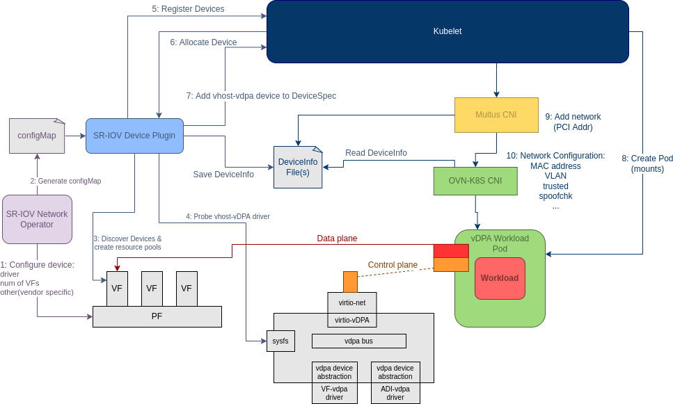

# Virtio/vDPA with OVN HW offloading

The purpose of this enhancement is to provide a proposal for integrating Virtio/vDPA in OCP for container workloads.

## Summary
See [VDPA support in OCP (Overview)](https://github.com/openshift/enhancements/blob/master/enhancements/vdpa/overview.md).

Main aspects of this enhancement:
- primary interface in the pod is configured as a Virtio/vDPA device
- NIC configured in switchdev mode
- OVS HW offloading enabled
- Supported HW: NVIDIA CTX-6 DX

## Motivation

The main motivation is to integrate a Virtio/vDPA device in Openshift.

### User Stories

Details are provided in the overview enhancement.

### Goal

- As a user I want to configure an Openshift cluster with Virtio/VDPA support.
- As a user I want to determine how many VFs to create for a given NIC and how each VF should be consumed by workloads (e.g., netdev device in the container network namespace)
- As a user I want the VDPA solution to be integrated with OVN-kubernetes and with HW offloading enabled

### Non-Goals

- The Vhost-vdpa driver won't be supported in CNFs (VMs only). The virtio-vdpa driver will be supported in CNFs, i.e. netdev device to be consumed.
- Scalable IOV and Sub-functions are out of scope, only switchdev SR-IOV will be supported (with OVS HW offloading to the NIC)

## Proposal

The following diagram depicts all the involved components and their interactions:

### Workflow Description

#### Pre-requirements

- Create the Openshift cluster on a baremetal node
- Deploy OVN-kubernetes
- Deploy the SRIOV network operator

#### SRIOV network operator workflow

 - Deploy the SRIOV device plugin
 - Deploy OpenVswitch in HW offload mode
 - Configure the VFs (same as SR-IOV: echo N > /sys/devices/{PF}/sriov_numvfs)
 - Install vendor-independent kernel drivers: vdpa, virtio-vdpa
 - Install vendor-dependent kernel drivers, e.g. mlx5-vdpa for Mellanox cards
 - Put NIC in switchdev mode (smart NIC)
 - (Vendor specific) Bind the right PCI driver. Some vendors might implement vdpa in a different PCI driver (e.g: Intel’s ifcvf). Others might keep the same pci driver and require extra steps (e.g: in mellanox vdpa, the VF is still bound to “mlx5_core”)
 - Enable HW offload mode on PF, VFs and port representors
 - (Vendor specific) Create the vdpa device. Some vendors might require no extra steps because they create the vdpa device on a pci driver probe (e.g: ifcvf). Others might need extra steps (e.g: Mellanox requires loading an additional driver and in the future, they 	might require managing a “virtual bus”(source)). The plan is to extend the govdpa library to provide such functionality.
- Bind the vdpa device to the correct vdpa bus driver (virtio-vdpa driver in the first implementation). This is not vendor specific and uses a sysfs-based API.
- Add the appropriate vdpa flags to the SR-IOV Device Plugin’s configMap.
- Create the Network Attachment Definitions

Note: the operator will have to support the tear-down of resources during the undeploying phase.

### API Extensions

The plan is to extend the SriovNetworkNodePolicy CRD API to support the vDPA feature.

There are two proposals:

#### **Proposal A**
Change the semantics of the deviceType field to express the way the device is exposed to the user and let the SR-IOV Network Operator in cooperation with the vendor plugins determine what is the driver that must be bound at the PCI bus (and, of course the vdpa bus).
**deviceType** would assume one of the following values: netdev/vfio-pci/vdpa-virtio/vdpa-vhost.
The problem with this approach:
**isRdma** goes in another direction. isRdma changes the way the device is exposed to the user but is only compatible with netdev type (and only one vendor implements it AFAIK).
So for this proposal to be complete, deviceType would also include “rdma”. This could become a compatibility issue but backwards compatibility should be manageable.
Benefits of this proposal: Easier for the user.
#### **Proposal B**
Keep deviceType meaning “driver bound to PCI device”. And add a field called **vdpaType** to select the type of vdpa device (vhost/virtio).
We need to add a runtime check to verify that a user does not specify { “deviceType”:  “vfio-pci”, “vdpaType”: “virtio” } because that doesn’t make sense.
Benefits:
Easier to implement
Problems:
If another vendor requires another driver for vdpa in the future we would need to expand deviceType to add the new driver.
Relies more on knowledge from the user.
Runtime errors (user creates a combination of fields that are wrong) are more difficult to return to the user.

### Implementation Details/Notes/Constraints

The proposed implementation depends on the CX-6 OVS hardware work which is not fully ready yet in OCP 4.11.

**TBD: check if any dependencies with other projects, e.g. RHEL, drivers, etc**

The work can be split into 4 main repos: [ovn-kubernetes](https://github.com/ovn-org/ovn-kubernetes), [sriov-network-device-plugin](https://github.com/k8snetworkplumbingwg/sriov-network-device-plugin), [sriov-networking-operator](https://github.com/k8snetworkplumbingwg/sriov-network-operator) and [govdpa](https://github.com/k8snetworkplumbingwg/govdpa).

#### **Ovn-kubernetes**

Revive and merge the PR: https://github.com/ovn-org/ovn-kubernetes/pull/2664

Note: currently OVN CNI doesn't support the reading of the DeviceInfo. It is recommended to support this functionality for a better and consistent design.

This PR works in combination with [this PR in the SR-IOV Network Device Plugin](https://github.com/k8snetworkplumbingwg/sriov-network-device-plugin/pull/306) to provide support for vDPA devices.
This functionality is based on [OVS Hardware Offload](https://github.com/ovn-org/ovn-kubernetes/blob/master/docs/ovs_offload.md) and allows ovn-kubernetes to expose an open standard netdev such as a virtio-net to the pod.
Most of the heavy-lifting (detecting vdpa devices, ensuring they are bound to the right driver, etc) is done by the SR-IOV Network Device Plugin. From an ovn-kubernetes perspective, it's just a matter of selecting the right netdev to move to the pod's namespace.

#### **SRIOV-network-device-plugin**

The relevant PR has been already merged to github: https://github.com/k8snetworkplumbingwg/sriov-network-device-plugin/pull/306

Additional unit tests to be implemented.

#### **SRIOV-network operator**

Implement the changes as described in the above workflow section.

#### **Govdpa library**

Github repository: https://github.com/k8snetworkplumbingwg/govdpa

The library needs to be extended with the following functionalities:
- Create a vdpa device for a given vdpa management device
- Delete a vdpa device
- Unit testing

### Risks and Mitigations

Check if the implementation would fit Openshit 4.12 code freeze date

### Drawbacks

None

## Design Details

### Open Questions [optional]

TBD

### Test Plan

**Note:** *Section not required until targeted at a release.*

TBD

### Graduation Criteria

**Note:** *Section not required until targeted at a release.*

TBD

#### Dev Preview -> Tech Preview

- Ability to utilize the enhancement end to end
- End user documentation, relative API stability
- Sufficient test coverage
- Gather feedback from users rather than just developers
- Enumerate service level indicators (SLIs), expose SLIs as metrics
- Write symptoms-based alerts for the component(s)

#### Tech Preview -> GA

- More testing (upgrade, downgrade, scale)
- Sufficient time for feedback
- Available by default
- Backhaul SLI telemetry
- Document SLOs for the component
- Conduct load testing
- User facing documentation created in [openshift-docs](https://github.com/openshift/openshift-docs/)

**For non-optional features moving to GA, the graduation criteria must include
end to end tests.**

#### Removing a deprecated feature

None

### Upgrade / Downgrade Strategy

TBD

### Version Skew Strategy

TBD

### Operational Aspects of API Extensions

TBD

#### Failure Modes

TBD

#### Support Procedures

TBD

## Implementation History

TBD

## Alternatives

TBD
