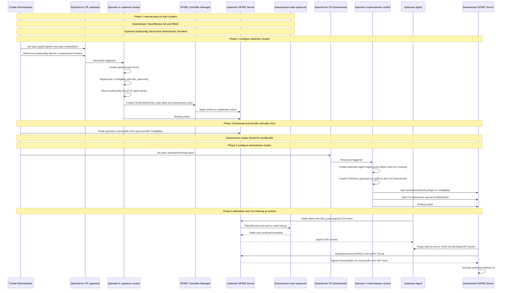

# Nested SPIRE Support for Zero Trust Workload Identity Manager

## Summary

This enhancement adds [nested SPIRE](https://spiffe.io/docs/latest/planning/scaling_spire/#nested-spire) support to the Zero Trust Workload Identity Manager (ZTWIM) operator. A SPIRE server in one OpenShift cluster obtains its signing CA from a SPIRE server in another cluster instead of self-signing.

Both servers share a single trust domain and form a certificate hierarchy: the upstream server holds the top-level signing CA (self-signed or itself chained to an external PKI), each downstream server holds an intermediate signed by it, and X.509 workload SVIDs chain back to a common root of trust. JWT-SVIDs are verified using signing keys propagated across the topology.

On a downstream cluster the operator adds `spire` to `SpireServer.spec.upstreamAuthority` and manages the upstream agent and SPIFFE CSI driver the plugin needs. On an upstream cluster it adds `spec.grpcEndpoint` (Route to the server gRPC API) and `spec.nestedSpire` (downstream cluster registration). `grpcEndpoint` is separate from `nestedSpire` so the administrator can choose operator-managed Route creation (`managedRoute: "true"`) or supply their own Route (`managedRoute: "false"`).

### Terminology

The word "upstream" is overloaded in SPIRE. This document uses these terms consistently:

- **Trust domain**: the SPIFFE trust domain shared by every cluster in a nested topology. Nesting does not span trust domains; that is federation.
- **Upstream cluster**: a cluster whose SPIRE server signs intermediate CAs for downstream SPIRE servers. Configured with `spec.grpcEndpoint` and `spec.nestedSpire`. Its own CA may be self-signed, chained to an external PKI via `certManager` or `vault`, or obtained from another SPIRE server via `spec.upstreamAuthority.spire`.
- **Downstream cluster**: a cluster whose SPIRE server holds an intermediate CA signed by an upstream SPIRE server. Configured with `spec.upstreamAuthority.spire`.
- The same cluster may be **both** an upstream and a downstream cluster in one topology (intermediate tier): it chains to a server above it and registers downstream clusters beneath it.
- **UpstreamAuthority**: the SPIRE server plugin interface that supplies a server's signing CA. `certManager` and `vault` are already shipped; this enhancement adds `spire`.
- **Upstream agent**: the dedicated SPIRE agent this enhancement deploys on the downstream cluster, attested against the *upstream* server. It exists only to provide the Workload API socket the plugin requires, and is distinct from the cluster's existing SPIRE agent DaemonSet that serves workloads.
- **Node alias**: a SPIRE registration entry that defines a stable parent SPIFFE ID (for example `spiffe://<trust-domain>/downstream/<cluster>`) for upstream agents matching `k8s_psat` selectors. The agent still attests with a concrete node SVID (`spire/agent/k8s_psat/<cluster>/<node-uid>`); the alias is a registration parent so child entries (such as the downstream server entry) do not have to track a per-node agent ID.

## Motivation

Organizations running multiple OpenShift clusters need workload identities that chain to a single root of trust so that cross-cluster mTLS works transparently: peers verify each other's SVIDs against one CA hierarchy without federation configuration or hand-distributed workload certificates.

ZTWIM deploys one independent SPIRE server per cluster. Each server self-signs its CA unless configured with the `certManager` or `vault` UpstreamAuthority plugin. Nested SPIRE is the SPIFFE-native way to unify the hierarchy across clusters while SPIRE itself owns issuance and rotation on the nested portion of the chain.

Today, achieving nested SPIRE on OpenShift requires manual work outside the operator: enabling `CREATE_ONLY_MODE`, patching generated ConfigMaps, deploying upstream agents and CSI drivers by hand, and creating `ClusterStaticEntry` objects manually. That setup has no reconciliation, no self-healing, and blocks normal OLM upgrades.

This enhancement replaces that with declarative `SpireServer` fields, full operator lifecycle management, and compatibility with standard OLM upgrades (no `CREATE_ONLY_MODE` required).

In a fleet sharing a single trust domain, a workload's SPIFFE ID means the same thing and validates against the same root wherever it runs.

With nested SPIRE, an upstream cluster outage does not immediately stop downstream clusters: they keep issuing SVIDs from their already-signed intermediate CA.

### User Stories

- As an OpenShift cluster administrator, I want to chain a cluster's SPIRE server to an upstream SPIRE server by setting `spec.upstreamAuthority.spire` in the SpireServer CR, so that the local SPIRE server obtains its signing CA from an upstream server and workload SVIDs chain to the shared trust domain root instead of a per-cluster self-signed CA.
- As an OpenShift cluster administrator, I want the operator to deploy the dedicated SPIRE agent and second SPIFFE CSI driver instance that `spec.upstreamAuthority.spire` requires, so that I do not hand-assemble a DaemonSet, a CSIDriver, a ServiceAccount, and an SCC binding to satisfy the plugin's need for a local Workload API socket.
- As an OpenShift cluster administrator of the upstream cluster, I want to onboard a downstream cluster by appending one entry to `spec.nestedSpire.downstreamClusters`, so that the operator configures `k8s_psat` validation against that cluster's API server and creates the registration entries that authorize the downstream SPIRE server to obtain an intermediate CA.
- As an SRE, I want `SpireServer` status conditions to show whether nested SPIRE resources are created and are in healthy state on each cluster.
- As an OpenShift security engineer, I want the SPIRE server pod to stay on the `restricted` SCC while only the upstream agent (which needs `hostPID` and `hostPath`, like the existing spire agent daemonset) and its CSI DaemonSet (which needs `privileged`, like the existing SPIFFE CSI driver) receive elevated privileges, so that enabling nested SPIRE does not broaden the server pod's security context.

### Goals

1. Configure a **downstream cluster** that obtains its intermediate CA from an upstream SPIRE server via `spec.upstreamAuthority.spire`, with the operator managing the dedicated upstream agent, RBAC, and second SPIFFE CSI driver instance end to end.
2. Expose the upstream SPIRE server's gRPC API via `spec.grpcEndpoint`, with the operator managing a passthrough Route at `grpc.<clusterName>.<trustDomain>` (required for downstream clusters to obtain an intermediate CA).
3. Configure an **upstream cluster** that accepts one or more downstream clusters via `spec.nestedSpire`, including `k8s_psat` registration and generated `ClusterStaticEntry` objects parented to node aliases.
4. Support **N-level nesting**: a cluster may be both upstream and downstream by setting `spec.upstreamAuthority.spire` and `spec.nestedSpire` together.
5. Keep the SPIRE server pod on the `restricted` SCC; confine elevated privileges to the upstream agent (dedicated SCC with the same `hostPID`/`hostPath` requirements as the workload agent), the CSI DaemonSet (`privileged` binding, same pattern as the existing SPIFFE CSI driver), and nothing else.
6. Garbage-collect all operator-created nested SPIRE resources when the feature is removed from the CR.
7. Report nested SPIRE health through `SpireServer` status conditions. Conditions cover operator-managed resources on each cluster; SPIRE runtime outcomes (attestation success, upstream-signed CA) are confirmed via logs.

### Non-Goals

1. **Automating cross-cluster Secret distribution.** Trust bundles and kubeconfigs are administrator-provided Secrets referenced in the CR. The operator consumes them; it does not fetch or push them between clusters.
2. **Node attestors other than** `k8s_psat` **for the upstream agent in this iteration.**
3. **Propagating federated bundles downstream.** The plugin propagates the X.509 CA chain and JWT signing keys only, not federated trust bundles ([spiffe/spire#4128](https://github.com/spiffe/spire/issues/4128)). A downstream cluster that must authenticate peers in a foreign trust domain needs its own `ClusterFederatedTrustDomain`.
4. **Automatic cross-cluster discovery.** Each upstream-downstream link must be configured explicitly on both clusters.

## Proposal

### Supported topologies

A nested topology is a tree of SPIRE servers in one trust domain. Each downstream cluster chains to exactly one upstream server; an upstream cluster may register many downstream clusters.


| Topology                | Shape                                                             | Example                                                                        |
| ----------------------- | ----------------------------------------------------------------- | ------------------------------------------------------------------------------ |
| Single upstream cluster | One upstream, N downstreams                                       | Corporate cluster signs for ten regional clusters                              |
| Multi-tier              | Root → tier-1 → tier-2 → …                                        | Corporate → regional → edge; each tier may fan out to many downstream clusters |
| Mixed external root     | Upstream chains to cert-manager/Vault, downstreams chain to SPIRE | AWS PCA at corporate, nested SPIRE beneath it                                  |


**On the upstream cluster**, `spec.grpcEndpoint` configures exposure of the SPIRE server's gRPC API. When `managedRoute` is `"true"`, the operator creates a passthrough Route to the existing `spire-server` Service `grpc` port with host `grpc.<clusterName>.<trustDomain>` (using this cluster's `ZeroTrustWorkloadIdentityManager.spec.clusterName` and `ZeroTrustWorkloadIdentityManager.spec.trustDomain`); when `"false"`, the administrator creates and maintains the Route themselves.

**On the upstream cluster**, `spec.nestedSpire` causes the operator to:

1. Add each downstream cluster to the `k8s_psat` `NodeAttestor` block of the generated `spire-server` ConfigMap, including a reference to the kubeconfig Secret the server uses to call `TokenReview` against that cluster.
2. Mount those kubeconfig Secrets into the SPIRE server StatefulSet.
3. Generate, per downstream cluster, a **node alias** `ClusterStaticEntry` selected by `k8s_psat` selectors, and a **downstream entry** parented to that alias with `downstream: true`.

Enabling `spec.nestedSpire` requires `spec.grpcEndpoint` to be configured because downstream clusters reach the upstream server through that Route. The API enforces this dependency via CEL validation on `SpireServer`.

**On the downstream cluster**, `spec.upstreamAuthority.spire` causes the operator to:

1. Add the `UpstreamAuthority "spire"` plugin to the generated `spire-server` ConfigMap, pointed at the upstream Route and at a local Workload API socket path.
2. Create a dedicated **upstream agent** Deployment, pinned by pod affinity to the node running the SPIRE server pod. It attests to the *upstream* cluster's server and is separate from the cluster's own `spire-agent` DaemonSet, which attests locally. The Deployment mounts `trustBundleSecret` at `/run/spire/bundle` and sets `trust_bundle_path` to `/run/spire/bundle/bundle.crt` in the generated `agent.conf`.
3. Create that agent's ServiceAccount, ClusterRole, ClusterRoleBinding, and a dedicated `spire-agent-upstream` SCC (same privilege profile as the workload facing `spire-agent` SCC, scoped to the upstream agent ServiceAccount only).
4. Create a second SPIFFE CSI driver instance, `upstream.csi.spiffe.io`, with its own DaemonSet and ServiceAccount, using the same `privileged` SCC binding pattern as the existing SPIFFE CSI driver, to project the upstream agent's socket into the SPIRE server pod.
5. Add that CSI ephemeral volume and its mount to the SPIRE server StatefulSet.

The requirement that drives steps 3 through 5 is that the `UpstreamAuthority "spire"` plugin does not talk to the upstream server directly. It reads an SVID from a local Workload API Unix domain socket and only then authenticates a gRPC call, and there is no option to bypass the socket.

The chosen design keeps the agent in a separate pod and delivers the socket with a second CSI driver so the SPIRE server pod stays on the `restricted` SCC; see [Why a dedicated agent and a second CSI driver](#why-a-dedicated-agent-and-a-second-csi-driver).

### Workflow Description




**Steady-state variations:**

- **Adding another downstream cluster.** The administrator appends one entry to `spec.nestedSpire.downstreamClusters`. The Route from `spec.grpcEndpoint` already exists. Regenerating the `k8s_psat` map restarts the upstream SPIRE server briefly. Existing downstream clusters keep issuing from their current intermediate CA; any scheduled CA rotation request that overlaps the restart is retried automatically once upstream is back. No administrator action is needed.
- **Removing a downstream cluster.** On the upstream cluster, the operator drops the cluster from the `k8s_psat` configuration, unmounts the kubeconfig, and deletes the two generated `ClusterStaticEntry` objects.
On the downstream cluster, clearing `spec.upstreamAuthority.spire` removes the upstream agent Deployment, CSI driver DaemonSet, `CSIDriver`, StatefulSet volume changes, the `spire-agent-upstream` SCC, and related RBAC. That does not immediately change the signing CA: the server keeps issuing from its cached upstream-signed intermediate until the next rotation, then self-signs. Re-initialize the datastore only if an immediate return to a self-signed CA is required; see [Upgrade / Downgrade Strategy](#upgrade--downgrade-strategy).
- **Upstream outage.** The downstream server keeps issuing workload SVIDs from its active intermediate CA. SPIRE begins preparing the next intermediate at about half of `ca_ttl`. If upstream is unreachable, preparation fails and is retried automatically on a short interval while the current intermediate remains valid. Issuance continues until that intermediate expires; once upstream is back, preparation succeeds on the next retry. No administrator action is needed.
- **Node drain or loss.** Draining or deleting the node that runs `spire-server` evicts both the server and the upstream agent. When both pods are recreated, `podAffinity` is evaluated at schedule time and they typically land together on a new node without manual intervention. Assert the node alias still matches after the upstream agent re-attests and CA rotation continues.
- **SPIRE server reschedule without agent eviction.** If only the `spire-server` pod moves to a different node while the upstream agent keeps running on the old node, co-location breaks until the agent is recreated (see [Open Questions](#open-questions)). Workload issuance from the cached intermediate CA continues until that intermediate expires. The node alias keeps the downstream registration parent ID stable across the new node UID in `k8s_psat` attestation, so no upstream `ClusterStaticEntry` change is required once a replacement agent is co-located.

### API Extensions

This enhancement modifies the existing cluster-scoped `SpireServer` CRD. On a downstream cluster, enabling `spec.upstreamAuthority.spire` adds a dedicated SPIRE agent that attests to the upstream server (separate from this cluster's own `spire-agent` DaemonSet), connects that agent's Workload API socket to the local SPIRE server pod (via new CSI driver instance), and creates a dedicated `spire-agent-upstream` SCC for that agent.

On an upstream cluster, the operator also creates `ClusterStaticEntry` objects to register each downstream cluster. Operator-created entries are named with a `nested-spire-` prefix so they are easy to tell apart from entries administrators create by hand.

#### Downstream cluster: `spec.upstreamAuthority.spire`

`UpstreamAuthorityConfig` today requires exactly one of `certManager` or `vault`. This enhancement adds `spire` as a third option and widens the existing CEL rule.

```go
// UpstreamAuthorityConfig selects and configures an UpstreamAuthority plugin.
// Exactly one of certManager, vault, or spire must be set.
// +kubebuilder:validation:XValidation:rule="(has(self.certManager) && !has(self.vault) && !has(self.spire)) || (!has(self.certManager) && has(self.vault) && !has(self.spire)) || (!has(self.certManager) && !has(self.vault) && has(self.spire))",message="exactly one of certManager, vault, or spire must be set"
type UpstreamAuthorityConfig struct {
    // certManager and vault are unchanged.

    // spire configures the SPIRE UpstreamAuthority plugin.
    // +kubebuilder:validation:Optional
    Spire *UpstreamAuthoritySpire `json:"spire,omitempty"`
}

// UpstreamAuthoritySpire configures nested SPIRE on a downstream cluster.
type UpstreamAuthoritySpire struct {
    // serverAddress is the DNS hostname of the upstream SPIRE server's gRPC endpoint
    // as published by the upstream cluster's Route (grpc.<upstream-clusterName>.<trustDomain>
    // when the operator in the upstream cluster manages the Route). Must not include a
    // URL scheme, port, or path
    // +kubebuilder:validation:Required
    // +kubebuilder:validation:MinLength=1
    // +kubebuilder:validation:MaxLength=253
    // +kubebuilder:validation:Pattern=`^[a-z0-9]([-a-z0-9]*[a-z0-9])?(\.[a-z0-9]([-a-z0-9]*[a-z0-9])?)*$`
    // +kubebuilder:validation:XValidation:rule="!self.contains('://') && !self.contains(':') && !self.contains('/')",message="serverAddress must be a hostname without scheme, port, or path"
    ServerAddress string `json:"serverAddress"`

    // serverPort is the port of the upstream gRPC endpoint.
    // +kubebuilder:default=443
    // +kubebuilder:validation:Minimum=1
    // +kubebuilder:validation:Maximum=65535
    // +kubebuilder:validation:Optional
    ServerPort int32 `json:"serverPort,omitempty"`

    // trustBundleSecret is the name of a Secret in the operator namespace that
    // holds the upstream SPIRE server's trust bundle. The Secret must contain
    // data key bundle.crt with PEM-encoded X.509 root certificate(s).
    // +kubebuilder:validation:Required
    TrustBundleSecret string `json:"trustBundleSecret"`
}
```

Only `k8s_psat` is supported in this iteration. The operator uses `ZeroTrustWorkloadIdentityManager.spec.clusterName` as this cluster's `k8s_psat` cluster identifier and hardcodes `spire-server` as the projected ServiceAccount token audience.

#### Upstream cluster: `spec.grpcEndpoint`

The operator creates a fixed-name Route (`spire-server-grpc`) targeting the existing `spire-server` Service on the `grpc` port. When `managedRoute` is `"true"`, the Route host is `grpc.<clusterName>.<trustDomain>`, derived from this cluster's `ZeroTrustWorkloadIdentityManager.spec.clusterName` and `ZeroTrustWorkloadIdentityManager.spec.trustDomain`. That keeps each cluster's gRPC endpoint hostname unique in multi-tier topologies that share one trust domain. The administrator must ensure the hostname resolves from downstream clusters to this cluster's ingress. The Route uses passthrough TLS termination: the downstream SPIRE server calls the upstream SPIRE server over gRPC with TLS client authentication, and both sides present X.509 SVIDs and check each other's SPIFFE ID. If the Route terminated TLS at the ingress router (edge or re-encrypt), the downstream server would see the router's certificate instead of the upstream server's SVID and the handshake would fail.

```go
type GRPCEndpointConfig struct {
    // managedRoute enables or disables automatic Route creation for the gRPC endpoint.
    // +kubebuilder:default:="true"
    // +kubebuilder:validation:Enum:="true";"false"
    // +kubebuilder:validation:Optional
    ManagedRoute string `json:"managedRoute,omitempty"`
}
```

On `SpireServer`:

```go
// +kubebuilder:validation:XValidation:rule="!has(self.nestedSpire) || has(self.grpcEndpoint)",message="grpcEndpoint is required when nestedSpire is set"
type SpireServerSpec struct {
    // ... existing fields ...

    // grpcEndpoint exposes the SPIRE server's gRPC API.
    // +kubebuilder:validation:Optional
    GRPCEndpoint *GRPCEndpointConfig `json:"grpcEndpoint,omitempty"`

    // nestedSpire registers downstream clusters for node attestation.
    // Requires grpcEndpoint to be set.
    // +kubebuilder:validation:Optional
    NestedSpire *NestedSpireConfig `json:"nestedSpire,omitempty"`
}
```

#### Upstream cluster: `spec.nestedSpire`

```go
type NestedSpireConfig struct {
    // downstreamClusters enumerates clusters whose SPIRE servers chain to this one.
    // +listType=map
    // +listMapKey=name
    // +kubebuilder:validation:Optional
    DownstreamClusters []DownstreamCluster `json:"downstreamClusters,omitempty"`
}

type DownstreamCluster struct {
    // name identifies the downstream cluster on the upstream server. Immutable once set.
    // Must match the downstream cluster's ZeroTrustWorkloadIdentityManager.spec.clusterName.
    // Must be a valid DNS-1123 subdomain (same validation as clusterName).
    // +kubebuilder:validation:Required
    // +kubebuilder:validation:MinLength=1
    // +kubebuilder:validation:MaxLength=63
    // +kubebuilder:validation:Pattern=`^[a-z0-9]([-a-z0-9]*[a-z0-9])?(\.[a-z0-9]([-a-z0-9]*[a-z0-9])?)*$`
    // +kubebuilder:validation:XValidation:rule="self == oldSelf",message="name is immutable"
    Name string `json:"name"`

    // kubeConfigSecret is the name of a Secret in the operator namespace
    // holding a kubeconfig for Downstream cluster's API server.
    // +kubebuilder:validation:Required
    KubeConfigSecret string `json:"kubeConfigSecret"`
}
```

The operator hardcodes `spire-server` as the `k8s_psat` audience and `<operator-namespace>:spire-agent-upstream` as the only permitted downstream ServiceAccount (`service_account_allow_list`) for each cluster entry. That matches the upstream agent the operator in the downstream cluster creates.

#### Generated registration entries

For a downstream cluster `cluster01` in trust domain `example.com`, the operator in the upstream cluster generates two entries.

**Node alias** (`nested-spire-cluster01-node-alias`). When the downstream cluster's upstream agent attests to this server with `k8s_psat`, SPIRE issues a concrete agent node SVID that embeds the node UID (`spire/agent/k8s_psat/cluster01/<node-uid>`). That ID changes on every node replacement. This entry matches any upstream agent from `cluster01` (by `k8s_psat` selectors) and defines a stable parent SPIFFE ID, `spiffe://example.com/downstream/cluster01`, parented to the local SPIRE server. Matching agents still receive the `k8s_psat` node SVID on attestation; downstream registrations parent to the alias ID instead of a specific agent instance.

```yaml
apiVersion: spire.spiffe.io/v1alpha1
kind: ClusterStaticEntry
metadata:
  name: nested-spire-cluster01-node-alias
spec:
  className: zero-trust-workload-identity-manager-spire
  parentID: spiffe://example.com/spire/server
  spiffeID: spiffe://example.com/downstream/cluster01
  selectors:
  - k8s_psat:cluster:cluster01
  - k8s_psat:agent_ns:zero-trust-workload-identity-manager
  - k8s_psat:agent_sa:spire-agent-upstream
```

**Downstream server entry** (`nested-spire-cluster01-downstream`). This authorizes the downstream cluster's SPIRE server to request an intermediate signing CA from the upstream server. It is parented to the node alias above. Selectors bind it to the operator-managed `spire-server` StatefulSet (namespace, ServiceAccount, pod name, and container name). The entry sets `downstream: true` so SPIRE treats the caller as a nested downstream server (permitted to invoke `NewDownstreamX509CA`). Without this entry, the downstream server could not obtain an upstream-signed CA even if the upstream agent attests successfully.

```yaml
apiVersion: spire.spiffe.io/v1alpha1
kind: ClusterStaticEntry
metadata:
  name: nested-spire-cluster01-downstream
spec:
  className: zero-trust-workload-identity-manager-spire
  parentID: spiffe://example.com/downstream/cluster01
  spiffeID: spiffe://example.com/downstream/cluster01/spire-server
  selectors:
  - k8s:ns:zero-trust-workload-identity-manager
  - k8s:sa:spire-server
  - k8s:pod-name:spire-server-0
  - k8s:container-name:spire-server
  downstream: true
  x509SVIDTTL: 1h
```

Together, the alias absorbs node-level identity churn from `k8s_psat` attestation and the downstream entry grants the CA-chaining permission. The operator creates both so administrators do not have to hand-author the node-alias pattern or update downstream registration parent IDs after node replacement.

### Topology Considerations

#### Hypershift / Hosted Control Planes

#### Standalone Clusters

The primary target. Both upstream and downstream cluster configurations are supported.

#### Single-node Deployments or MicroShift

#### OpenShift Kubernetes Engine

### Implementation Details/Notes/Constraints

#### Why a dedicated agent and a second CSI driver

Two separate problems drive the downstream-cluster design.

**1. Why a second agent is required.** The [UpstreamAuthority `spire` plugin](https://github.com/spiffe/spire/blob/main/doc/plugin_server_upstreamauthority_spire.md) fetches an SVID from a local Workload API Unix socket and uses that identity to call the upstream SPIRE server. There is no configuration to skip the socket or use a remote Workload API. The cluster's existing `spire-agent` DaemonSet cannot provide that SVID: it is attested to the *local* SPIRE server, which is the server that does not yet have an upstream-signed CA. A second agent, attested to the upstream server, is required.

**2. How to get that socket into the `spire-server` pod.** The plugin runs in the `spire-server` container; the upstream agent runs elsewhere. A Unix socket is a filesystem object: another container can open it only if both share the same mount (same pod) or if the socket file is made visible through a shared path on the node.

The three possible approaches:


| Approach                                           | Layout                                                          | How the server reaches the socket                                                                                                                                                                                                                             | Why not chosen                                                                                                                                                                                                                                         |
| -------------------------------------------------- | --------------------------------------------------------------- | ------------------------------------------------------------------------------------------------------------------------------------------------------------------------------------------------------------------------------------------------------------- | ------------------------------------------------------------------------------------------------------------------------------------------------------------------------------------------------------------------------------------------------------ |
| **Sidecar**                                        | Upstream agent as a second container in the `spire-server` pod  | Shared `emptyDir` volume in the same pod; socket never leaves the pod                                                                                                                                                                                         | The agent needs `hostPID` (and related settings) for `k8s_psat` workload attestation, which applies to the whole pod and moves `spire-server` off the `restricted` SCC. Agent and server lifecycles are also coupled: any agent change restarts SPIRE. |
| **Shared `hostPath`**                              | Upstream agent in a separate pod                                | Agent writes the socket to a host directory; `spire-server` mounts the same `hostPath`                                                                                                                                                                        | A `hostPath` mount on `spire-server` also moves it off `restricted`. On OpenShift, the server and agent pods have different SELinux MCS labels, so the server often cannot open the socket without broader SCC grants.                                 |
| **Separate agent + CSI ephemeral volume** (chosen) | Upstream agent in a one-replica Deployment on the server's node | Agent writes the socket to a host directory (same pattern as the workload `spire-agent`). A node-local SPIFFE CSI DaemonSet reads that directory and bind-mounts the socket into `spire-server` through a CSI ephemeral volume at `/run/spire/upstream-agent` | Agent pod uses a dedicated `spire-agent-upstream` SCC; CSI DaemonSet uses `privileged`; `spire-server` stays `restricted`. Requires `podAffinity` so agent and server share a node.                                                                    |


**3. What the chosen design deploys.** ZTWIM already delivers Workload API sockets to pods this way for workloads:

1. The `spire-agent` DaemonSet creates a Unix socket on the node (under `/run/spire/agent-sockets` by default).
2. The `csi.spiffe.io` CSI DaemonSet on that node watches the same host directory.
3. When a pod declares a CSI ephemeral volume from `csi.spiffe.io`, the driver bind-mounts the agent socket into the pod at schedule time.

Nested SPIRE repeats that pattern for the upstream agent, but cannot reuse `csi.spiffe.io` as-is: the upstream agent is a separate Deployment, it writes its socket to a different host directory, and Kubernetes requires a distinct `CSIDriver` name per plugin. Enabling `spec.upstreamAuthority.spire` therefore adds a parallel stack:

1. `spire-agent-upstream` Deployment: creates the Workload API socket on the node (under a dedicated host path, using the `spire-agent-upstream` SCC).
2. `upstream.csi.spiffe.io` : a second `CSIDriver` plus CSI DaemonSet on each node, watching that upstream-agent socket directory instead of `/run/spire/agent-sockets`.
3. `spire-server` StatefulSet: gains a CSI ephemeral volume from `upstream.csi.spiffe.io`, mounted at `/run/spire/upstream-agent/spire-agent.sock` (the path hardcoded into the UpstreamAuthority plugin config).

This second driver is operator-internal wiring turned on by `spec.upstreamAuthority.spire`, not a second `SpiffeCSIDriver` CR. Administrators already configure one `SpiffeCSIDriver` for workload sockets; exposing upstream socket paths as a user-facing CR would add a way to point the driver at the wrong socket.

#### Resources created on the downstream cluster


| Resource                           | Kind                         | Purpose                                                                                 | SCC                     |
| ---------------------------------- | ---------------------------- | --------------------------------------------------------------------------------------- | ----------------------- |
| `spire-agent-upstream`             | ServiceAccount               | Upstream agent identity                                                                 |                         |
| `spire-agent-upstream`             | ClusterRole + Binding        | `get` on `pods`, `nodes`, `nodes/proxy` for k8s workload attestor                       |                         |
| `spire-agent-upstream`             | ConfigMap                    | Generated `agent.conf`                                                                  |                         |
| `spire-agent-upstream`             | Deployment (1 replica)       | Upstream agent, pinned by `podAffinity` to the SPIRE server's node                      | `spire-agent-upstream`  |
| `spire-agent-upstream`             | SecurityContextConstraints   | Same `hostPID`/`hostPath` profile as workload `spire-agent`, scoped to upstream SA only |                         |
| `upstream.csi.spiffe.io`           | CSIDriver                    | Second driver registration, labelled `csi-ephemeral-volume-profile: restricted`         |                         |
| `spire-spiffe-csi-driver-upstream` | SA + RoleBinding + DaemonSet | Projects the agent's socket into the SPIRE server pod                                   | `privileged` (existing) |
| `spire-server`                     | StatefulSet (modified)       | Gains a CSI ephemeral volume at `/run/spire/upstream-agent`                             | `restricted`, unchanged |


The `SpireServer` controller creates and garbage-collects the `spire-agent-upstream` SCC when `spec.upstreamAuthority.spire` is enabled or removed. The SCC mirrors the workload `spire-agent` SCC privileges but lists only `system:serviceaccount:<operator-namespace>:spire-agent-upstream` in `Users` .

The upstream agent is a one-replica Deployment rather than a DaemonSet. It only needs to exist on the node running the SPIRE server pod. `podAffinity` with `topologyKey: kubernetes.io/hostname` and `requiredDuringSchedulingIgnoredDuringExecution` places new pods on that node at schedule time only; it does not evict or relocate a running agent when the server moves. How co-location is restored automatically is an open question (see [Open Questions](#open-questions)).

#### Resources created on the upstream cluster


| Resource                         | Kind                   | Purpose                                                                                                                                          |
| -------------------------------- | ---------------------- | ------------------------------------------------------------------------------------------------------------------------------------------------ |
| `spire-server-grpc`              | Route                  | Passthrough Route to the `grpc` port of the `spire-server` Service (from `spec.grpcEndpoint`)                                                    |
| `spire-server`                   | ConfigMap (modified)   | `k8s_psat` `clusters` map gains one entry per downstream cluster                                                                                 |
| `spire-server`                   | StatefulSet (modified) | Mounts each kubeconfig Secret under `/run/spire/downstream-clusters/<name>/`                                                                     |
| `nested-spire-<name>-node-alias` | ClusterStaticEntry     | Per downstream cluster `<name>`: node alias for that cluster's upstream agent                                                                    |
| `nested-spire-<name>-downstream` | ClusterStaticEntry     | Per downstream cluster `<name>`: `downstream: true` entry for that cluster's SPIRE server to obtain an intermediate CA from this upstream server |


When `spec.grpcEndpoint` is set and `managedRoute` is `"true"`, the operator creates or updates `spire-server-grpc` with host `grpc.<clusterName>.<trustDomain>`; when `managedRoute` is `"false"`, the operator does not manage a Route and reports `GRPCEndpointAvailable=False` with reason `RouteDisabled`.

On the downstream cluster, `spec.upstreamAuthority.spire.serverAddress` must be set to the hostname the downstream cluster uses to reach its direct upstream server. When the operator in the upstream cluster manages the Route, that value is `grpc.<upstream-clusterName>.<trustDomain>`, where `<upstream-clusterName>` is the upstream cluster's `ZeroTrustWorkloadIdentityManager.spec.clusterName`. That value is not auto-filled because the operator in the downstream cluster has no visibility into the upstream cluster.

#### Generated configuration

Downstream `server.conf` gains:

```json
"UpstreamAuthority": [{
  "spire": {
    "plugin_data": {
      "server_address": "grpc.cluster01.example.com",
      "server_port": "443",
      "workload_api_socket": "/run/spire/upstream-agent/spire-agent.sock"
    }
  }
}]
```

Upstream, each downstream cluster appends an entry to the existing `k8s_psat` `clusters` list:

```json
{"cluster01": {
  "audience": ["spire-server"],
  "service_account_allow_list": ["zero-trust-workload-identity-manager:spire-agent-upstream"],
  "kube_config_file": "/run/spire/downstream-clusters/cluster01/kubeconfig"
}}
```

#### Status conditions

Nested SPIRE adds the conditions below to `SpireServer.status.conditions`, alongside existing operand conditions. 

Downstream:

- `UpstreamAgentAvailable`: upstream agent Deployment has an available replica, trustBundleSecret exists. Reasons: `Ready`, `DeploymentNotReady`, `TrustBundleMissing`.
- `UpstreamCSIDriverAvailable`: upstream CSI DaemonSet is fully ready. Reasons: `Ready`, `DaemonSetNotReady`.

Upstream:

- `GRPCEndpointAvailable`: Route exists with the expected spec (host `grpc.<clusterName>.<trustDomain>`). Reasons: `RouteCreated`, `RouteCreationFailed`, `RouteDisabled`.
- `DownstreamClustersValid`: for each `downstreamClusters[]` entry, kubeconfig Secret exists, operator-created `ClusterStaticEntry` objects exist, and `spire-controller-manager` has set `status.rendered=true` and `status.masked=false` on both. Reasons: `Ready`, `KubeConfigMissing`, `EntryNotApplied` (`status.rendered=false`), `EntryMasked` (`status.masked=true`).

#### Constraints

From the feature requirements:

1. **Shared trust domain.** Every cluster in a hierarchy must use the same `ZeroTrustWorkloadIdentityManager.spec.trustDomain`.
2. `**k8s_psat` only in this iteration.** The upstream agent attests with projected service account tokens; upstream clusters validate tokens against each downstream cluster's API server.
3. **Administrator-provided cross-cluster Secrets.** Kubeconfigs (upstream → downstream API server) and trust bundles (downstream → upstream root) are referenced in the CR, not generated or distributed by the operator.
4. **Root CA path length (external PKI only).** Default SPIRE self-signed roots do not set a `pathLen` constraint and can support multi-tier nesting. This constraint applies when the root or upstream signing CA comes from external PKI (cert-manager, Vault, AWS PCA, etc.): that CA must allow at least one subordinate CA per nesting level.

Additional constraints:

1. **Datastore re-initialization.** A server holding a valid self-signed CA continues using it until rotation time, even after the plugin is configured. Clearing the PVC is required to force immediate use of the new plugin. The operator does not perform this destructive step automatically.
2. **Cross-cluster API reachability.** With `k8s_psat`, each upstream cluster must reach every registered downstream cluster's API server.

### Risks and Mitigations

- The upstream cluster holds a credential with `TokenReview` and pod/node read on every downstream cluster
  - Impact: High: lateral movement across the fleet
  - Mitigation: Bind the kubeconfig to a SA holding exactly `system:auth-delegator` plus `get` on `pods` and `nodes` (minimal required permission).
- Upstream outage eventually stops CA rotation on every downstream that chains to it
  - Impact: High, but time-delayed per downstream
  - Mitigation: Each downstream keeps issuing from its cached intermediate CA until it expires (typically hours with the default `ca_ttl`). SPIRE retries preparation on a short interval, but an outage longer than the remaining CA lifetime blocks rotation.
- Trust domain and cluster name must agree across clusters
  - Impact: Medium: opaque attestation failure
  - Mitigation: `downstreamClusters[].name` must equal the downstream cluster's `ZeroTrustWorkloadIdentityManager.spec.clusterName`; trust domain must also match. Document the agreement.
- SPIRE server rescheduled to a different node while upstream agent stays behind
  - Impact: Medium: CA rotation stalls until agent is recreated on the server's node; workload issuance continues from cached intermediate CA
  - Mitigation: Node alias keeps upstream registration stable across agent node UID changes. Automating agent recreation is an open question.
- Each change to `spec.nestedSpire.downstreamClusters` rolls the upstream `spire-server` pod (ConfigMap hash change)
  - Impact: Low: upstream server briefly unavailable; downstream workload issuance continues from cached intermediate CAs; upstream-agent attestation and CA preparation on downstream clusters retry once the pod is back
  - Mitigation: Batch onboarding or removal during a maintenance window to avoid repeated restarts. No manual recovery after the roll completes. SPIRE retries any CA rotation that overlapped the restart.

### Drawbacks

This is operationally complex feature. Each upstream-downstream link needs configuration on both clusters. Each downstream cluster adds privileged components and a cross-cluster dependency in the issuance path.

An upstream cluster signing for N downstream clusters holds N kubeconfig credentials and restarts its SPIRE server when the downstream list changes. A mistake on the upstream cluster affects every downstream cluster that chains to it.

With `k8s_psat`, the upstream cluster holds standing credentials on every downstream API server.

## Alternatives (Not Implemented)

- **Sidecar container in the SPIRE server pod.** The upstream agent runs as a second container in the `spire-server` pod, sharing the socket through an `emptyDir`. Attractive because it adds no CSI driver, no `hostPath`, and no pod affinity.
  - Not chosen because the agent needs `hostPID` for pod-based workload attestation, which would move the SPIRE server pod off the `restricted` SCC. It also couples the agent's lifecycle to the server's.
- **Raw `hostPath` shared between the agent and the server.** Simplest option, no CSI driver.
  - Rejected because a `hostPath` mount moves the SPIRE server pod off `restricted`. On OpenShift the two pods' SELinux MCS labels differ, so the server cannot open the socket without an SCC granting `spc_t`.
- **Reuse the existing `spire-agent` DaemonSet.**
  - Not possible. It is attested to the local server.
- **Add the upstream agent ServiceAccount to the existing `spire-agent` SCC.** Avoids a second SCC object with identical settings.
  - Rejected because the `spire-agent` SCC is owned and reconciled by the `SpireAgent` controller, which today sets `Users` to the workload facing spire agent only. Sharing the SCC would require the `SpireAgent` reconciler to read `SpireServer.spec.upstreamAuthority.spire`, watch `SpireServer`, and merge `Users` on every loop so it does not drop `spire-agent-upstream` when `SpireAgent` reconciles. A dedicated `spire-agent-upstream` SCC keeps all nested-SPIRE resources under the `SpireServer` controller.
- `**x509pop` node attestation.** The agent presents a pre-provisioned X.509 certificate with a proof-of-possession challenge.
  - Deferred rather than rejected: it needs certificate provisioning, distribution, and rotation on both clusters.
- `**join_token` node attestation.** A one-time token minted on the upstream server. Simplest bootstrap, needs no cross-cluster access.
  - Rejected because join tokens are consumed on first use and produce a non-re-attestable agent.
- **Upstream agent as a DaemonSet.** Would remove the pod affinity requirement.
  - Rejected: one agent per node would multiply upstream-server attestation and sync load with no benefit, since only the agent on the SPIRE server's node provides the Workload API socket the plugin uses.
- **SPIRE federation instead of nesting.** Already shipped, and it solves cross-cluster authentication.
  - It is a different capability rather than an alternative: federation joins *distinct* trust domains, each with its own root, whereas nesting produces one trust domain with one root.

## Open Questions

1. **How should gRPC Route exposure be configured for nested SPIRE?** Nested SPIRE requires downstream clusters to reach the upstream SPIRE server over a passthrough Route. Options:
  - **(a) Separate `spec.grpcEndpoint` field (current proposal).** The administrator enables gRPC exposure explicitly. With `managedRoute: "true"`, the operator creates the Route; with `managedRoute: "false"`, the administrator creates their own Route. *Tradeoff:* two fields to configure (`grpcEndpoint` and `nestedSpire`), but the administrator controls whether a Route exists at all and who manages it.
  - **(b) Fold Route configuration into `spec.nestedSpire`.** Drop the standalone `spec.grpcEndpoint` field; the operator creates the Route automatically when nesting is enabled (and removes it when nesting is disabled). *Tradeoff:* simpler configuration and the SPIRE server gRPC API is never exposed without nesting, but administrators cannot manage their own Route via `managedRoute: "false"`.
2. **Should the operator create `ClusterStaticEntry` objects or leave them to the administrator?** This proposal has the operator create them because the node-alias pattern is error-prone to hand-author. The alternative is documenting a manual procedure and accepting that node replacement breaks until entries are updated.
3. **Can the upstream agent share the workload** `spire-agent` **SCC?** This couples nested SPIRE to `SpireAgent` SCC reconciliation. This proposal uses a separate `spire-agent-upstream` SCC for implementation simplicity; consolidating later is possible if the cross-controller coordination cost is judged acceptable.
4. **Who restores upstream-agent co-location when the SPIRE server moves to a different node?** The upstream agent is a one-replica Deployment co-scheduled with `spire-server` via `podAffinity.requiredDuringSchedulingIgnoredDuringExecution`. `IgnoredDuringExecution` means Kubernetes does not evict or reschedule the agent when the server pod later lands on another node; the agent stays on the old node until something creates a new pod. Recovery itself is straightforward: deleting the agent pod or rolling its Deployment re-evaluates affinity at schedule time and places a replacement on the server's current node. Until that happens, the CSI mount on the server points at a host path on the new node where no agent socket exists, so the `UpstreamAuthority` plugin cannot reach upstream and **CA rotation** stalls (workload issuance from the cached intermediate CA continues until it expires). **Not an option today:** `requiredDuringSchedulingRequiredDuringExecution` for `podAffinity` - Kubernetes only supports `IgnoredDuringExecution` for inter-pod affinity; there is no built-in eviction when pod affinity is violated. Once a replacement agent is co-located and attests, the node-alias `ClusterStaticEntry` covers upstream registration (stable SPIFFE ID despite the new node UID in `k8s_psat` attestation); no upstream entry edits are required.

## Test Plan

### Unit tests

- CEL validation: exactly one of `certManager`, `vault`, or `spire` may be set; required fields within `spire`; `nestedSpire` requires `grpcEndpoint`; immutability and duplicate rejection on `downstreamClusters[].name`.
- Generation of the downstream `UpstreamAuthority` block, the upstream agent `agent.conf`, and the upstream `k8s_psat` `clusters` map.
- Generation of the node alias and downstream entry pairs.
- Status condition transitions for each enumerated reason.

### Integration tests

- Creating, updating, and removing `spec.upstreamAuthority.spire`, `spec.grpcEndpoint`, and `spec.nestedSpire`, asserting created, updated, and garbage-collected resources.
- SCC lifecycle: enabling `spec.upstreamAuthority.spire` creates `spire-agent-upstream` SCC; disabling removes it; the `SpireAgent` controller does not modify it.
- Ownership conflict when a `ClusterStaticEntry` with a generated name already exists and is not owned by the operator.

### End-to-end tests

The CI lane needs at least two OpenShift clusters; mid-tier scenarios need three.

- **Happy path (single upstream cluster)**: configure one upstream and one downstream cluster; assert the downstream cluster receives an intermediate CA from the upstream cluster (certificate chain verification), workloads receive SVIDs chaining to the shared root, and cross-cluster mTLS succeeds without federation.
- **Multiple downstream clusters per upstream cluster**: register two downstream clusters on one upstream cluster; assert both receive upstream-signed CAs independently.
- **Mid-tier (three-cluster SPIRE chain)**: cluster A (root) → cluster B (mid-tier, downstream of A and upstream of C) → cluster C (leaf). Assert B is both upstream and downstream, C's CA chains through B to A, and cross-cluster mTLS works across all three.
- **External root chain**: upstream cluster chained to cert-manager, downstream cluster nested beneath it. Assert expected certificate chain depth.
- **Resource cleanup**: remove `spec.upstreamAuthority.spire` on a downstream cluster and a `downstreamClusters[]` entry on the upstream cluster; assert all operator-created resources are garbage-collected.
- **Node drain**: drain and delete the node running `spire-server`; assert both `spire-server` and `spire-agent-upstream` reschedule together, the node alias still matches after re-attestation, and CA rotation continues.
- **Server-only reschedule**: delete or evict only the `spire-server` pod so it lands on a different node while the upstream agent remains on the old node; assert CA rotation stalls until co-location is restored (per the settled open question), then resumes.
- **Upstream outage**: delete the upstream cluster Route; assert the downstream cluster keeps issuing SVIDs from its cached intermediate CA (verified via server logs and workload SVID chain depth).
- **Misconfiguration matrix**: trust domain mismatch, cluster name mismatch, missing trust bundle, invalid kubeconfig.
- **Coexistence with federation**: an upstream cluster's SPIRE server acting as both upstream authority and federation peer, asserting both work and that federated bundles do not appear downstream.

## Graduation Criteria

### Dev Preview

Maps to the feature acceptance criteria:

- Downstream cluster receives its intermediate CA from the upstream cluster, verified by certificate chain inspection.
- Mid-tier topology works: three-cluster SPIRE chain (A → B → C) with B as both upstream and downstream cluster.
- Multiple downstream clusters supported per upstream cluster.
- Resource cleanup on configuration removal (upstream entries, downstream agent, CSI driver, `spire-agent-upstream` SCC).
- Status conditions report nested SPIRE health (operator resource reconciliation on each cluster).

### Dev Preview -> Tech Preview

- Sufficient test coverage including upgrade and failure scenarios.
- End user documentation.
- Enough feedback to settle open questions 1 through 4 and to confirm or refute the `k8s_psat`-only scope.

### Tech Preview -> GA

- Load testing at maximum downstream cluster count
- All open questions resolved.
- Upgrade and downgrade tested.
- Alerts and metrics implemented.
- User-facing documentation covering single-upstream-cluster and multi-tier procedures

### Removing a deprecated feature

## Upgrade / Downgrade Strategy

**Upgrading to the release that introduces this feature** requires no action. The new fields are optional and absent by default.

**Adopting the feature on an existing cluster** is the disruptive case only when nested SPIRE must work immediately after enable. Set `spec.upstreamAuthority.spire` and wait for `UpstreamAgentAvailable=True` and `UpstreamCSIDriverAvailable=True`. If SPIRE server logs still show `self_signed=true` on the latest `X509 CA prepared` entry, re-initialize the datastore: scale the StatefulSet to zero, delete its PVC, and scale back to one.

The server then mints a fresh CA through the plugin. Running `spire-agent` pods re-attest on the next server sync; the operator does not roll the DaemonSet. Deleting the PVC invalidates every SVID and agent registration in that cluster. This is a maintenance-window operation. The same constraint applies to the shipped `certManager` and `vault` plugins.

**Downgrading the operator** to a release without this feature orphans the generated resources. The older operator regenerates the ConfigMap without the plugin, so the server runs on its existing CA until expiry and then self-signs. Recovery means deleting the orphaned resources by label and re-initializing the datastore for moving to self-signed CA immediately.

## Version Skew Strategy

Within a cluster, the upstream agent uses the same SPIRE image the operator ships, so it upgrades with the operator and stays matched to the local server.

The consequential skew is between clusters. SPIRE's policy is that [agents must not be newer than the oldest server they communicate with, and may be up to one minor version older](https://github.com/spiffe/spire/blob/main/doc/upgrading.md). The upstream agent runs in the downstream cluster but talks to the *upstream* server.

Therefore **a cluster's direct upstream should be upgraded before that cluster**, and **downstream clusters must not fall more than one SPIRE minor version behind their upstream cluster**. In multi-tier topologies, upgrade **from the root outward**: each tier before the one below it.

## Operational Aspects of API Extensions

## Support Procedures

The most useful single diagnostic is the downstream server's CA report:

```bash
oc logs spire-server-0 -c spire-server -n zero-trust-workload-identity-manager | grep "X509 CA"
```

A healthy nested downstream logs `X509 CA prepared` with `self_signed=false` and a non-empty `upstream_authority_id` (structured log fields on the `spire-server` container).

Symptoms:

- `self_signed=true` or empty `upstream_authority_id` in server logs
  - Cause: Server holds a valid self-signed CA and ignores the plugin
  - Action: Re-initialize the datastore (scale to 0, delete PVC, scale to 1)
- Agent logs `failed to receive attestation response`
  - Cause: Upstream cannot validate the token against downstream API server
  - Action: Check kubeconfig Secret and `system:auth-delegator` binding
- Upstream logs `not configured` for the cluster
  - Cause: `downstreamClusters[].name` matches no attesting cluster
  - Action: Compare upstream `downstreamClusters[].name` with downstream `ZeroTrustWorkloadIdentityManager.spec.clusterName`; they are case-sensitive
- Agent logs `403 Forbidden` from workload attestor
  - Cause: SA lacks `nodes/proxy` access
  - Action: Verify the `spire-agent-upstream` ClusterRole
- SPIRE server pod in `ContainerCreating`
  - Cause: CSI DaemonSet not running or agent socket not created yet
  - Action: Check `UpstreamCSIDriverAvailable` and upstream agent pod on that node
- `x509: too many intermediates for path length constraint`
  - Cause: Upstream uses external PKI with path length 0 (not default SPIRE self-signed)
  - Action: Reissue with path length >= 1 (e.g., AWS PCA `PathLen1` template)

## Infrastructure Needed [optional]

A **multi-cluster CI lane** is the primary infrastructure requirement:

- **Two clusters** for single-upstream-cluster, cleanup, and failure scenarios.
- **Three clusters** for mid-tier (A → B → C) acceptance testing.

Each lane needs reachability from every downstream cluster to its upstream cluster's gRPC Route and, with `k8s_psat`, from every upstream cluster to each downstream cluster's API server.