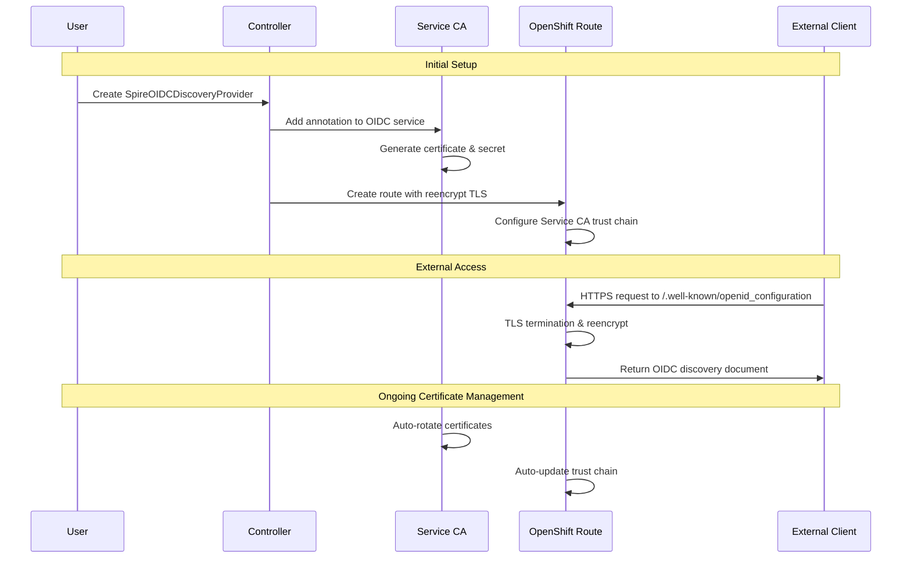

# OIDC Routes Integration for Zero Trust Workload Identity Manager

## Summary

This enhancement proposes exposing SPIRE OIDC Discovery Provider endpoints through OpenShift Routes under the domain `*.apps.<cluster-domain>` for the selected default installation.

## Motivation

The SpireOIDCDiscoveryProvider serves as a critical bridge between SPIFFE identities and OIDC standards, allowing external systems to validate and trust SPIRE-issued JWTs. By exposing well-known endpoints (/.well-known/openid-configuration and /keys), it provides the OIDC discovery document and corresponding public keys required for verifying JWT-SVIDs.

In OpenShift environments, administrators need a straightforward and reliable way to make these endpoints accessible. They may choose to leverage the default OpenShift wildcard DNS entry (*.apps.<cluster-domain>), which points to the ingress routers, or alternatively configure a custom DNS entry that aligns with organizational requirements. Providing flexibility in how the SpireOIDCDiscoveryProvider endpoints are exposed ensures smoother integration with external identity consumers and supports varied deployment scenarios.


### User Stories

- As an OpenShift cluster administrator, I want to enable a managed Route for the SPIRE OIDC Discovery Provider by setting `spec.managedRoute: true`, so that the discovery endpoints are exposed on the cluster’s default `*.apps.<cluster-domain>` without additional YAML or manual DNS steps.

- As an OpenShift cluster administrator, I want to optionally specify a custom host, so that I can expose the OIDC issuer on an organization-owned domain (e.g., `oidc.example.com`) that aligns with corporate DNS and certificate policies

- As an OpenShift cluster administrator, I want to disable the managed Route by setting `spec.managedRoute: false`, so that I can expose the endpoints through self-managed OpenShift routes or ingress.

- As an Openshift security engineer, I want to attach labels/annotations to the managed `Route`, so that I can integrate with tools for auditability.

- As an SRE, I want clear status conditions on the CR and events, so that I can quickly diagnose exposure, DNS, or certificate issues.

- As an OpenShift cluster administrator, I want RBAC guardrails and explicit errors if the operator lacks permission to manage Routes, so that I can understand required privileges and safely delegate responsibilities.

- As an OpenShift cluster administrator, I want the managed Route to default to Service CA certificates so that the endpoints are automatically secured and trusted in-cluster without manual certificate management.

- As an Openshift security engineer, I want the managed Route to support re-encrypt termination so that TLS is enforced end-to-end with cluster-managed certificates, providing stronger security than edge while avoiding the operational burden of passthrough.


### Goals
- Provide a managed Route option for the SpireOIDCDiscoveryProvider that automatically exposes OIDC discovery endpoints on the cluster’s default `*.apps.<cluster-domain>`.
- Allow administrators to disable the managed Route, supporting self-managed exposure of the endpoints through OpenShift Routes, ingress, or service mesh gateways.
- Support attaching labels and annotations to the managed Route for better auditing and monitoring.
- Default the managed Route to use Service CA–issued certificates, ensuring automatic TLS and certificate rotation.
- Default re-encrypt termination for the managed Route, providing end-to-end TLS with cluster-managed certificates as a stronger security option compared to edge termination, while avoiding the complexity of passthrough.
- Provide clear status conditions and events so that SREs can quickly diagnose DNS, TLS, or exposure issues.
- Validation check to reject updates to Route termination type or configurations that override usage of ServiceCA operator managed certificates.
- Allow the use of custom PKI with the default managed Route for TLS connections between clients and the ingress router.

### Non-Goals
- Manage custom PKI without default managed Route.
- Deletion of default managed Route automatically when the option is disabled.
- Support managed Route for applications that are not using default Openshift `*.apps.<cluster-domain>`
- Reconciliation of updates to DNS changes for SpireOIDCDiscoveryProvider endpoints.
- Support edge and passthrough termination types for default managed Route.
- Support usage of SVIDs for SpireOIDCDiscoveryProvider endpoints.
- Custom PKI integration for the default managed Route of the SpireOIDCDiscoveryProvider endpoints to replace Service CA–issued certificates when using re-encrypt termination.


## Proposal

This enhancement implements default OIDC route creation by extending the existing `SpireOIDCDiscoveryProvider` controller and introducing an optional API field to control managed route creation.

#### Automatic Route Creation

The implementation enhances the existing `SpireOIDCDiscoveryProvider` controller to create and manage `Routes` as part of its reconciliation logic. These `Routes` will integrate with OpenShift’s Service CA operator, enabling automatic TLS certificate provisioning and lifecycle management without manual intervention. By default, all Routes will be created with secure configurations, including `re-encrypt` TLS termination and enforced redirection of insecure requests. In addition, the controller will ensure that a complete certificate trust chain is automatically established from the Route to the backing Service using the Service CA, providing end-to-end security and minimizing the operational burden on administrators.

For example, when a SpireOIDCDiscoveryProvider resource is created as

```yaml
apiVersion: operator.openshift.io/v1alpha1
kind: SpireOIDCDiscoveryProvider
metadata:
  name: cluster
spec:
  trustDomain: cluster.local
  managedRoute: "true"  # Enable operator-managed Route (default)
  # ... other existing fields remain unchanged
```
the controller automatically provisions a secure Route with Service CA–managed certificates and configures it with secure defaults.

### Workflow Description

This section outlines an end-to-end workflow.

#### Initial Setup
1. **User Action**: Creates `SpireOIDCDiscoveryProvider` resource with `managedRoute` flag being enabled.
2. **Controller Response**: Detects the resource and initiates automatic route setup
3. **Service Preparation**: Adds Service CA annotation to the OIDC discovery service
4. **Certificate Provisioning**: Service CA operator generates certificates and creates `oidc-serving-cert` secret
5. **Route Creation**: Controller creates OpenShift Route with secure defaults (reencrypt TLS, HTTPS redirect)

#### Ongoing Operations
6. **External Access**: OIDC discovery endpoint becomes available at `https://<route-hostname>/.well-known/openid_configuration`
7. **Certificate Management**: Service CA automatically handles certificate renewal and rotation
8. **Route Maintenance**: Controller manages route lifecycle tied to `SpireOIDCDiscoveryProvider` resource lifecycle

#### Enhanced Workflow Diagram


### API Extensions

```go
// managedRoute is for enabling routes for oidc-discovery-provider
// +kubebuilder:default:="true"
// +kubebuilder:validation:Enum:="true";"false"
// +kubebuilder:validation:required
ManagedRoute string `json:"managedRoute"`
```

The enhancement adds a mandatory `managedRoute` field to `SpireOIDCDiscoveryProvider` CR. Correspondingly, a new `ManagedRouteReady` condition is introduced to provide detailed status, reason, and message fields for troubleshooting the OIDC Route.

When `managedRoute` is enabled (default), the controller automatically creates OpenShift Routes with re-encrypt TLS termination and integrates with the Service CA operator for comprehensive certificate management. The controller annotates the `spire-oidc-discovery-provider` service with `service.beta.openshift.io/serving-cert-secret-name: oidc-serving-cert` to enable automatic certificate generation, provisioning, and lifecycle management including renewal and trust establishment with the cluster's Certificate Authority.


### Topology Considerations

#### Hypershift / Hosted Control Planes

#### Standalone Clusters

Only standalone cluster topology is in consideration for the tech-preview

#### Single-node Deployments or MicroShift


### Implementation Details/Notes/Constraints

The implementation enhances the existing SPIRE OIDC Discovery Provider controller to automatically create and manage OpenShift Routes with integrated certificate management through the Service CA operator.

As part of this implementation, the spiffe-helper container will be removed from the spire-oidc-discovery-provider deployment to streamline the attestation flow through the SPIRE agent’s Workload API socket when requesting JWKS bundles and eliminate the dependency on SPIRE server–generated certificates for endpoints. The spire-oidc-discovery-provider will instead use Service CA–managed certificates.

#### Managed Route Lifecycle and Validation

The controller manages the Route lifecycle based on the managedRoute flag. The Route object has ownerReference `spire-spiffe-oidc-discovery-provider` deployment object. 

When managedRoute is enabled, the controller creates Routes automatically with secure defaults, including TLS re-encryption and enforced best practices for exposure.

When managedRoute is disabled, the controller stops managing Routes but preserves any existing configurations. This allows users to add custom Route object.

If managedRoute is re-enabled, the controller attempts to create a new Route. If an existing Route is already present, it validates the configuration against the expected defaults. If there are deviations from expected defaults, the controller records an error in the CR status and sets the `ManagedRouteReady` condition to `false`. This ensures operators receive clear signals when Routes are misconfigured or diverge from secure defaults.

#### TLS Security and Validation

Re-encrypt termination is enforced to ensure end-to-end TLS, dual-layer certificate validation, and seamless integration with OpenShift’s Service CA for automated certificate lifecycle management. This approach delivers key benefits as it supports custom PKI integration in environments with strict security policies or existing PKI infrastructures and it mitigates risks from external PKI compromise by re-encrypting traffic at the router, providing an additional layer of protection through internal–external separation.

#### RBAC Validation

The controller validates required RBAC permissions before attempting Route operations, checking for `routes.route.openshift.io` (create, update, get, list, watch, delete) and `services` (get, update, patch) permissions. When permissions are missing, the controller provides specific error messages identifying the missing permissions for administrators. The controller sets status conditions to indicate permission errors while continuing to manage other aspects of the SpireOIDCDiscoveryProvider.

#### Labels/Annotations

The Route object inherits user-defined labels and annotations from `SpireOIDCDiscoveryProvider` CRD fields, with controller-managed labels taking precedence over user labels for conflicts.

#### Constraints

- Toggling the `spec.managedRoute` from `false` to `true` will not overwrite the Route object. User will have to delete any conflicting existing Route for successful operation.
- The deletion of a `SpireOIDCDiscoveryProvider` custom resource triggers a cascade of cleanup operations that removes managed Route.
- Uninstallation of managed Route object is not supported.
- Routes are always created in the same namespace as their corresponding `spire-spiffe-oidc-discovery-provider` deployment resource.
- The managed Route is supported only for applications that use the *.apps.<cluster-domain> wildcard DNS.

### Risks and Mitigations

### Drawbacks

The approach introduces a dependency on Service CA operations for certificate management, which may not align with all organizational requirements. Additionally, the solution can incur performance overhead, increase troubleshooting complexity, and lead to higher resource consumption under heavy load.

## Alternatives (Not Implemented)

###  Manual Route Configuration
- **Pros**: Full control over route configuration.
- **Cons**: Prone to external PKI compromises and compliance errors, possibilities of leaking cluster-internal CAs, management of custom DNS entries and routes.
- **Decision**: Rejected in favour of integration with Service CA operator as default secured route.

## Test Plan

- Managed Route enable/disable and re-enable behavior with drift validation.
- Custom host support with DNS, cert issuance, and discovery validation.
- Secure defaults enforced with re-encrypt termination and redirects.
- Service CA integration with cert issuance, rotation, and trust chain verification.
- RBAC guardrails with explicit errors on insufficient permissions.
- Label/annotation propagation for auditability and policy integration.
- Status and events accuracy via ManagedRouteReady condition and diagnostics.

## Graduation Criteria

### Dev Preview -> Tech Preview

- Feature available for end-to-end usage.
- Complete end user documentation.
- UTs and e2e tests are present.
- Gather feedback from the users.

### Tech Preview -> GA
N/A. This feature is for Tech Preview, until decided for GA.

### Removing a deprecated feature

## Upgrade / Downgrade Strategy

Upgrades scenarios not supported in the Tech Preview version.

## Version Skew Strategy

## Operational Aspects of API Extensions

## Support Procedures

## Infrastructure Needed [optional]
None