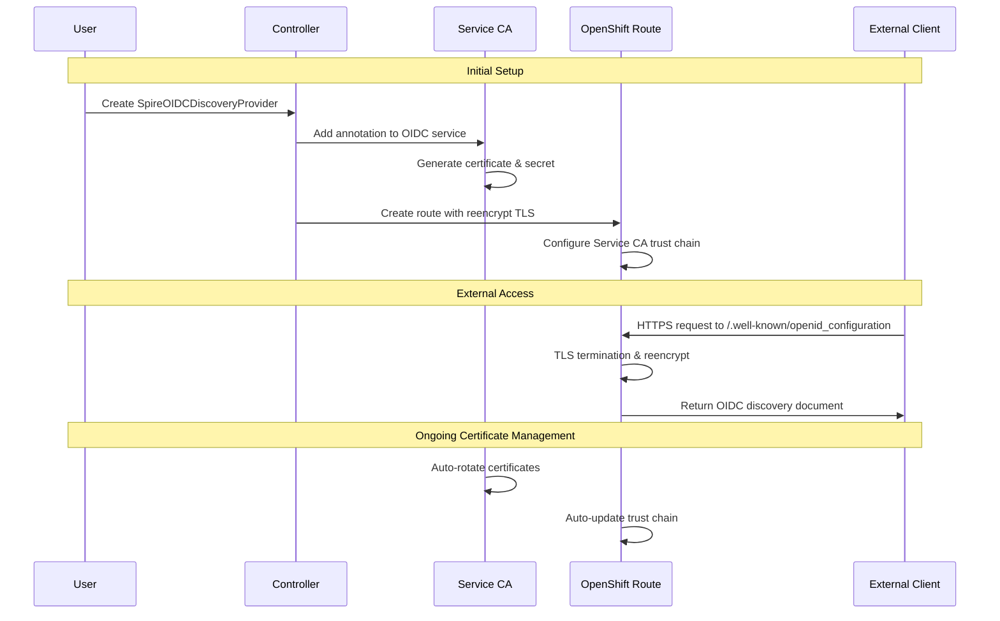

# OIDC Routes Integration for Zero Trust Workload Identity Manager

## Summary

This enhancement extends the existing Zero Trust Workload Identity Manager controller to automatically create OIDC routes that enable external access to SPIRE OIDC Discovery Provider endpoints through OpenShift Routes. When a `SpireOIDCDiscoveryProvider` is deployed, the enhanced controller will automatically create routes to provide secure, externally accessible OIDC endpoints for workload identity verification and JWT token validation in multi-cluster and hybrid cloud environments.

## Motivation

The current Zero Trust Workload Identity Manager provides OIDC Discovery Provider functionality through internal cluster services. However, in distributed and multi-cluster environments, external services and workloads running outside the OpenShift cluster need access to OIDC endpoints.

### User Stories

- As a **cluster administrator** managing SPIRE deployments,
I want OIDC routes to be created automatically without additional configuration,
So that I can focus on trust domain management rather than networking and certificate setup.

- As a **security engineer** responsible for cluster security,
I want OIDC discovery endpoints to be exposed with secure TLS termination by default,
So that external clients can safely discover SPIFFE identity information without compromising security.


### Goals
- **Automatic Route Provisioning**
   - Automatically create OpenShift Routes for OIDC discovery endpoints when a `SpireOIDCDiscoveryProvider` resource is deployed
   - Route creation happens without any additional user configuration or intervention
   - Routes are created with consistent naming and labeling conventions

-  **Secure External Access**
   - Enable secure external access to OIDC discovery endpoints through TLS-terminated routes
   - Implement reencrypt TLS termination to maintain end-to-end encryption
   - Automatically redirect insecure HTTP requests to HTTPS

-  **Automated Certificate Management**
   - Integrate with OpenShift's Service CA operator for automatic certificate provisioning and renewal
   - Establish proper certificate trust chain between routes and services
   - Handle certificate rotation transparently without service disruption

### Non-Goals

-  **Configuration Options**
   - Provide configurable route settings (routes are created with secure defaults)
   - Support custom hostnames, paths, or TLS configurations
   - Allow disabling of automatic route creation on a per-resource basis

-  **Alternative Ingress Methods**
   - Implement custom ingress controllers or load balancers
   - Support non-OpenShift route implementations (e.g., Kubernetes Ingress, Istio Gateway)
   - Provide alternative external access mechanisms beyond OpenShift Routes

-  **Extended OIDC Functionality**
   - Replace or modify existing internal OIDC discovery functionality
   - Implement custom authentication mechanisms beyond standard OIDC protocols
   - Add OIDC provider features not related to SPIFFE identity discovery

#### Future Considerations (Not in Initial Scope)

- Custom certificate management beyond Service CA integration
- Advanced route configuration options through annotations or labels
- Integration with external certificate authorities
- Custom domain management and DNS configuration

## Proposal

### Implementation Approach

This enhancement implements automatic OIDC route creation by extending the existing `SpireOIDCDiscoveryProvider` controller functionality without requiring any API changes.

#### Automatic Route Creation

The enhancement implements route functionality by:

1. **Controller Enhancement**: The existing `SpireOIDCDiscoveryProvider` controller is enhanced to automatically create routes
2. **Service CA Integration**: Using OpenShift's Service CA operator for automatic TLS certificate provisioning and management
3. **Default Secure Configuration**: Routes are created with secure defaults (reencrypt TLS, redirect insecure requests)
4. **Certificate Trust Chain**: Automatic setup of certificate trust chain from route to service using Service CA

#### Zero-Configuration Operation

When a `SpireOIDCDiscoveryProvider` resource is created using the existing API:

```yaml
apiVersion: operator.openshift.io/v1alpha1
kind: SpireOIDCDiscoveryProvider
metadata:
  name: cluster
spec:
  trustDomain: cluster.local
  # ... other existing fields remain unchanged
```

The enhanced controller will automatically:
- Create an OpenShift Route for external access
- Configure automatic certificate management via Service CA operator
- Set up secure TLS termination with reencrypt mode
- Update the service with Service CA annotations for certificate provisioning
- Establish trust chain between route and service certificates

### Implementation Details

The implementation includes the following components:

#### Controller Enhancements

The existing SPIRE OIDC Discovery Provider controller will be enhanced to:

1. **Automatic Route Creation**: Automatically create OpenShift Route resources when a `SpireOIDCDiscoveryProvider` is deployed
2. **Service CA Integration**: Add service annotations to enable automatic certificate provisioning via Service CA operator
3. **Route Lifecycle Management**: Monitor and manage route status throughout the lifecycle
4. **Certificate Trust Management**: Configure route to trust service certificates issued by Service CA
5. **Default Secure Configuration**: Apply secure defaults for TLS termination and certificate management

#### Route Creation Implementation

The controller will implement route creation with this pattern:

```go
// Route creation function
func generateOIDCDiscoveryProviderRoute(cr *operatorv1alpha1.SpireOIDCDiscoveryProvider) *routev1.Route {
    return &routev1.Route{
        ObjectMeta: metav1.ObjectMeta{
            Name:      "spire-oidc-discovery-provider",
            Namespace: cr.Namespace,
            Labels: map[string]string{
                "app.kubernetes.io/name":       "spiffe-oidc-discovery-provider",
                "app.kubernetes.io/instance":   "spire",
                "app.kubernetes.io/part-of":    "zero-trust-workload-identity-manager",
                "app.kubernetes.io/managed-by": "zero-trust-workload-identity-manager",
            },
        },
        Spec: routev1.RouteSpec{
            To: routev1.RouteTargetReference{
                Kind: "Service",
                Name: "spire-spiffe-oidc-discovery-provider",
            },
            Port: &routev1.RoutePort{
                TargetPort: intstr.FromString("https"),
            },
            TLS: &routev1.TLSConfig{
                Termination:                   routev1.TLSTerminationReencrypt,
                InsecureEdgeTerminationPolicy: routev1.InsecureEdgeTerminationPolicyRedirect,
            },
        },
    }
}
```

#### Service CA Integration

The controller will add automatic certificate provisioning by annotating the OIDC discovery provider service:

```yaml
# Service annotation for automatic certificate provisioning via Service CA
annotations:
  service.beta.openshift.io/serving-cert-secret-name: oidc-serving-cert
```

This enables OpenShift's Service CA operator to automatically:
- Generate and provision TLS certificates for the service
- Create the `oidc-serving-cert` secret containing the certificate and private key
- Manage certificate lifecycle including renewal
- Establish trust with the cluster's Certificate Authority

#### Certificate Trust Chain Configuration

The route will be configured to trust certificates issued by the Service CA:

```yaml
# Route TLS configuration with Service CA trust
tls:
  termination: reencrypt
  insecureEdgeTerminationPolicy: Redirect
```

#### Route Lifecycle Management

The implementation will include route lifecycle management:

```go
// Route update detection
func needsRouteUpdate(current, desired routev1.Route) bool {
    // Compare route specifications to determine if updates are needed
    // Check hostname, annotations, labels, and TLS configuration
    return !reflect.DeepEqual(current.Spec, desired.Spec) ||
           !reflect.DeepEqual(current.Annotations, desired.Annotations)
}
```

#### Security Considerations

1. **TLS Configuration**: All routes will use TLS by default with configurable termination policies
2. **Certificate Management**: Support for custom certificates through Kubernetes secrets
3. **Access Control**: Leverage OpenShift Route annotations for additional security policies
4. **Network Policies**: Ensure proper network segmentation for OIDC services

### Workflow Description

When a user creates a `SpireOIDCDiscoveryProvider` resource, the following automatic workflow occurs:

#### Initial Setup
1. **User Action**: Creates `SpireOIDCDiscoveryProvider` resource (existing API, no changes)
2. **Controller Response**: Detects the resource and initiates automatic route setup
3. **Service Preparation**: Adds Service CA annotation to the OIDC discovery service
4. **Certificate Provisioning**: Service CA operator generates certificates and creates `oidc-serving-cert` secret
5. **Route Creation**: Controller creates OpenShift Route with secure defaults (reencrypt TLS, HTTPS redirect)

#### Ongoing Operations
6. **External Access**: OIDC discovery endpoint becomes available at `https://<route-hostname>/.well-known/openid_configuration`
7. **Certificate Management**: Service CA automatically handles certificate renewal and rotation
8. **Route Maintenance**: Controller manages route lifecycle tied to `SpireOIDCDiscoveryProvider` resource lifecycle

#### Enhanced Workflow Diagram


```mermaid
sequenceDiagram
    participant User
    participant Controller
    participant ServiceCA as Service CA
    participant Route as OpenShift Route
    participant ExternalClient as External Client

    Note over User,ExternalClient: Initial Setup
    User->>Controller: Create SpireOIDCDiscoveryProvider
    Controller->>ServiceCA: Add annotation to OIDC service
    ServiceCA->>ServiceCA: Generate certificate & secret
    Controller->>Route: Create route with reencrypt TLS
    Route->>Route: Configure Service CA trust chain
    
    Note over User,ExternalClient: External Access
    ExternalClient->>Route: HTTPS request to /.well-known/openid_configuration
    Route->>Route: TLS termination & reencrypt
    Route->>ExternalClient: Return OIDC discovery document
    
    Note over User,ExternalClient: Ongoing Certificate Management
    ServiceCA->>ServiceCA: Auto-rotate certificates
    Route->>Route: Auto-update trust chain
```

### Example Usage

Here are the usage examples for the automatic OIDC routes functionality:

#### Basic OIDC Discovery Provider

```yaml
apiVersion: operator.openshift.io/v1alpha1
kind: SpireOIDCDiscoveryProvider
metadata:
  name: cluster
spec:
  trustDomain: cluster.local
```

When this resource is created, the controller will automatically:
- Create an OpenShift Route for external OIDC discovery access
- Configure automatic certificate management using OpenShift's service serving certificate controller
- Set up secure TLS termination (reencrypt)
- Redirect insecure requests to HTTPS

#### Production Configuration

```yaml
apiVersion: operator.openshift.io/v1alpha1
kind: SpireOIDCDiscoveryProvider
metadata:
  name: cluster
spec:
  trustDomain: cluster.local
  jwtIssuer: identity.company.com  # Custom JWT issuer domain
```

#### Accessing the OIDC Discovery Endpoint

Once deployed, the OIDC discovery endpoint will be available at:
```
https://<route-hostname>/.well-known/openid_configuration
```

Where `<route-hostname>` is the automatically generated OpenShift route hostname.

#### What Gets Created Automatically

When a `SpireOIDCDiscoveryProvider` is deployed, the following resources are automatically created:

1. **Service Annotations**: The `spire-spiffe-oidc-discovery-provider` service gets annotated with:
   ```yaml
   annotations:
     service.beta.openshift.io/serving-cert-secret-name: oidc-serving-cert
   ```

2. **OpenShift Route**: A route is created with:
   - Reencrypt TLS termination
   - Automatic certificate management
   - Insecure request redirection to HTTPS
   - Target service: `spire-spiffe-oidc-discovery-provider`

3. **Certificate Secret**: OpenShift automatically creates the `oidc-serving-cert` secret with TLS certificates

#### External Certificate Updates and Client Trust

When Service CA rotates certificates, external clients need to handle certificate updates properly:

##### Certificate Rotation Process

1. **Service CA Certificate Rotation**: 
   - Service CA operator monitors certificate expiration (typically rotates before 30 days of expiration)
   - Generates new certificates and updates the `oidc-serving-cert` secret
   - Route automatically trusts new service certificates via destination CA certificate injection

2. **Route Certificate Updates**:
   - OpenShift router automatically picks up new route certificates
   - No disruption to external traffic during certificate rotation
   - Route hostname and endpoints remain unchanged

##### Client Certificate Handling

External clients accessing OIDC endpoints should be configured to handle certificate updates:

1. **Certificate Validation**:
   ```bash
   # Example: Validating OIDC discovery endpoint certificate
   curl -v https://<route-hostname>/.well-known/openid_configuration
   ```

2. **Certificate Trust Store Updates**:
   - Clients should trust the OpenShift router's CA certificate
   - For custom certificates, clients need to trust the route's certificate authority
   - Service CA certificates are internal and handled automatically by the route

3. **Certificate Monitoring**:
   - External clients can monitor certificate expiration via standard TLS tools
   - OIDC discovery endpoint remains available during certificate rotations
   - No client reconfiguration needed for Service CA certificate rotations

##### Retrieving Certificate Information

Administrators can retrieve certificate information for external client configuration:

```bash
# Get route certificate information
oc get route spire-oidc-discovery-provider -o jsonpath='{.spec.tls}' | jq

# Get Service CA certificate (for internal trust chain verification)
oc get secret oidc-serving-cert -o jsonpath='{.data.tls\.crt}' | base64 -d

# Get route hostname
oc get route spire-oidc-discovery-provider -o jsonpath='{.spec.host}'
```


### Testing Strategy

#### Unit Tests

- Route configuration validation
- Controller logic for route creation and management
- Status update mechanisms
- Error handling and recovery

#### Integration Tests

- End-to-end OIDC discovery through routes
- TLS termination and certificate management


### Risks and Mitigations


## Documentation Requirements

### User Documentation
- Configuration guide with examples
- Security best practices
- Troubleshooting guide
- Migration from internal to external endpoints

### Operator Documentation
- API reference documentation
- Controller implementation details
- Monitoring and alerting setup
- Performance tuning guide

### Developer Documentation
- Extension points for custom functionality
- Testing procedures
- Contributing guidelines
- Architecture decisions

### API Extensions

This enhancement does not introduce any new APIs or modify existing APIs. The functionality is implemented entirely within the controller logic of the existing `SpireOIDCDiscoveryProvider` CRD without requiring any changes to the API schema.

### Topology Considerations

#### Hypershift / Hosted Control Planes

#### Standalone Clusters

This is the primary target environment for this enhancement. Standard OpenShift clusters will benefit from automatic OIDC route creation with full Service CA integration.

#### Single-node Deployments or MicroShift


### Implementation Details/Notes/Constraints

- Routes are created automatically when a `SpireOIDCDiscoveryProvider` resource is created
- No configuration options are provided in the initial implementation to maintain simplicity
- Certificate management is handled entirely by the Service CA operator
- Route names follow a predictable pattern: `spire-oidc-discovery-provider`
- TLS termination is always set to `reencrypt` for security
- Routes are tied to the lifecycle of the `SpireOIDCDiscoveryProvider` resource

### Drawbacks


## Alternatives (Not Implemented)

### Alternative 1: Manual Route Configuration
- **Pros**: Full control over route configuration
- **Cons**: No automation, prone to configuration drift, poor user experience
- **Decision**: Rejected in favor of automated management

## Test Plan

### Unit Tests
- Controller logic for route creation and management
- Route configuration validation
- Service CA annotation handling
- Error handling and edge cases

### Integration Tests
- End-to-end OIDC discovery endpoint accessibility
- Certificate rotation and trust chain validation
- Multi-namespace deployment scenarios
- Route lifecycle management

### E2E Tests
- Full SPIRE deployment with OIDC routes
- External client OIDC discovery validation
- Certificate trust chain verification
- High availability scenarios

## Graduation Criteria

### Dev Preview -> Tech Preview

- Feature available for end-to-end usage.
- Complete end user documentation.
- UTs and e2e tests are present.
- Gather feedback from the users.

### Tech Preview -> GA
N/A. This feature is for Tech Preview, until decided for GA.


### Removing a deprecated feature

This section is not applicable as this is a new feature enhancement.

## Upgrade / Downgrade Strategy

## Version Skew Strategy

Since this enhancement does not introduce API changes, version skew between controller and CRD versions is not a concern. The enhancement is backward compatible with existing `SpireOIDCDiscoveryProvider` resources.

## Operational Aspects of API Extensions

This enhancement does not introduce new APIs, so this section focuses on operational aspects of the automatic route creation:

### Resource Management
- Routes are managed as child resources of `SpireOIDCDiscoveryProvider`
- Garbage collection handles cleanup when parent resources are deleted
- Resource quotas and limits apply to created routes

### Monitoring
- Route creation and management operations are logged
- Metrics are exposed for route lifecycle events
- Alerts can be configured for route creation failures

## Support Procedures

### Troubleshooting Route Creation Issues

1. **Check SpireOIDCDiscoveryProvider Status**
   ```bash
   oc get spireoidcdiscoveryprovider -o yaml
   ```

2. **Verify Service CA Operator Status**
   ```bash
   oc get clusteroperator service-ca
   ```

3. **Check Route Status**
   ```bash
   oc get route spire-oidc-discovery-provider -o yaml
   ```

4. **Verify Certificate Secret**
   ```bash
   oc get secret oidc-serving-cert -o yaml
   ```

## Infrastructure Needed [optional]
None