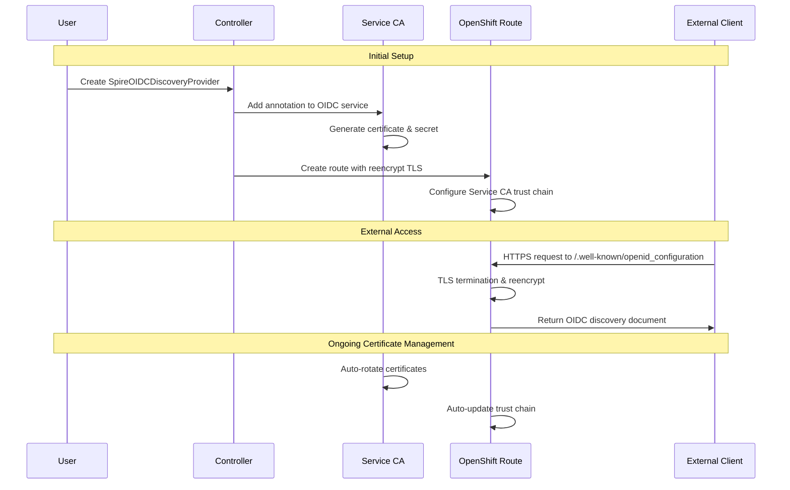

# OIDC Routes Integration for Zero Trust Workload Identity Manager

## Summary

This enhancement proposes exposing SPIRE OIDC Discovery Provider endpoints through OpenShift Routes under the domain `*.apps.<cluster-domain>` for the selected default installation.

## Motivation

The SpireOIDCDiscoveryProvider serves as a critical bridge between SPIFFE identities and OIDC standards, allowing external systems to validate and trust SPIRE-issued JWTs. By exposing well-known endpoints (/.well-known/openid-configuration and /keys), it provides the OIDC discovery document and corresponding public keys required for verifying JWT-SVIDs.

In OpenShift environments, administrators need a straightforward and reliable way to make these endpoints accessible. They may choose to leverage the default OpenShift wildcard DNS entry (*.apps.), which points to the ingress routers, or alternatively configure a custom DNS entry that aligns with organizational requirements. Providing flexibility in how the SpireOIDCDiscoveryProvider endpoints are exposed ensures smoother integration with external identity consumers and supports varied deployment scenarios.

### User Stories

- As an OpenShift cluster administrator, I want to enable a managed Route for the SPIRE OIDC Discovery Provider by setting `spec.managedRoute: true`, so that the discovery endpoints are exposed on the cluster’s default `*.apps.<cluster-domain>` without additional YAML or manual DNS steps.

- As an OpenShift cluster administrator, I want to optionally specify a custom host, so that I can expose the OIDC issuer on an organization-owned domain (e.g., `oidc.example.com`) that aligns with corporate DNS and certificate policies

- As an OpenShift cluster administrator, I want to disable the managed Route by setting `spec.managedRoute: false`, so that I can expose the endpoints through self-managed OpenShift routes or ingress.

- As an Openshift security engineer, I want to attach labels/annotations to the managed `Route`, so that I can integrate with tools for auditability.

- As an SRE, I want clear status conditions on the CR and events, so that I can quickly diagnose exposure, DNS, or certificate issues.

- As an OpenShift cluster administrator, I want RBAC guardrails and explicit errors if the operator lacks permission to manage Routes, so that I can understand required privileges and safely delegate responsibilities.

- As an OpenShift cluster administrator, I want the managed Route to default to Service CA certificates so that the endpoints are automatically secured and trusted in-cluster without manual certificate management.

- As an Openshift security engineer, I want the managed Route to support re-encrypt termination so that TLS is enforced end-to-end with cluster-managed certificates, providing stronger security than edge while avoiding the operational burden of passthrough.


### Goals
- Provide a managed Route option for the SpireOIDCDiscoveryProvider that automatically exposes OIDC discovery endpoints on the cluster’s default `*.apps.<cluster-domain>`.
- Allow administrators to disable the managed Route, supporting self-managed exposure of the endpoints through OpenShift Routes, ingress, or service mesh gateways.
- Support attaching labels and annotations to the managed Route for better auditing and monitoring.
- Default the managed Route to use Service CA–issued certificates, ensuring automatic TLS and certificate rotation.
- Default re-encrypt termination for the managed Route, providing end-to-end TLS with cluster-managed certificates as a stronger security option compared to edge termination, while avoiding the complexity of passthrough.
- Provide clear status conditions and events so that SREs can quickly diagnose DNS, TLS, or exposure issues.
- Validation check to reject updates to Route termination type or configurations that override usage of ServiceCA operator managed certificates.
- Allow the use of custom PKI with the default managed Route for TLS connections between clients and the ingress router.

### Non-Goals
- Manage custom PKI without default managed Route.
- Deletion of default managed Route automatically when the option is disabled.
- Support managed Route for applications that are not using default Openshift `*.apps.<cluster-domain>`
- Reconciliation of updates to DNS changes for SpireOIDCDiscoveryProvider endpoints.
- Support edge and passthrough termination types for default managed Route.
- Support usage of SVIDs for SpireOIDCDiscoveryProvider endpoints.
- Custom PKI integration for the default managed Route of the SpireOIDCDiscoveryProvider endpoints to replace Service CA–issued certificates when using re-encrypt termination.


## Proposal

### Implementation Approach

This enhancement implements default OIDC route creation by extending the existing `SpireOIDCDiscoveryProvider` controller and introducing an optional API field to control managed route creation.

#### Automatic Route Creation

The enhancement implements route functionality by:

1. **Controller Enhancement**: The existing `SpireOIDCDiscoveryProvider` controller is enhanced to create routes
2. **Service CA Integration**: Using OpenShift's Service CA operator for automatic TLS certificate provisioning and management
3. **Default Secure Configuration**: Routes are created with secure defaults (reencrypt TLS, redirect insecure requests)
4. **Certificate Trust Chain**: Automatic setup of certificate trust chain from route to service using Service CA

#### Zero-Configuration Operation

When a `SpireOIDCDiscoveryProvider` resource is created:

```yaml
apiVersion: operator.openshift.io/v1alpha1
kind: SpireOIDCDiscoveryProvider
metadata:
  name: cluster
spec:
  trustDomain: cluster.local
  managedRoute: "true"  # Enable operator-managed Route (default)
  # ... other existing fields remain unchanged
```


### Implementation Details

The implementation enhances the existing SPIRE OIDC Discovery Provider controller to automatically create and manage OpenShift Routes with integrated certificate management through the Service CA operator.

#### Route Creation and Certificate Management

When `managedRoute` is enabled (default), the controller automatically creates OpenShift Routes with re-encrypt TLS termination and integrates with the Service CA operator for comprehensive certificate management. The controller annotates the `spire-oidc-discovery-provider` service with `service.beta.openshift.io/serving-cert-secret-name: oidc-serving-cert` to enable automatic certificate generation, provisioning, and lifecycle management including renewal and trust establishment with the cluster's Certificate Authority.

As part of this implementation, the `spiffe-helper` container will be removed from the `spire-oidc-discovery-provider` deployment to optimize attestation flow and eliminate dependency on SPIRE server-generated certificates for endpoints. The `spire-oidc-discovery-provider` will use Service CA-managed certificates while workload attestation continues through the SPIRE agent's workload API socket when requesting JWKS bundles.

#### TLS Security and Validation

Re-encrypt termination is the only supported termination type to ensure end-to-end TLS encryption from external clients to the backend service. This approach maintains complete encryption throughout the request path with no unencrypted traffic within the cluster, providing dual-layer certificate validation at the router. The controller implements strict validation, reconciling routes with edge or passthrough termination to prevent security-compromising configurations.

From an operational perspective, re-encrypt termination integrates seamlessly with OpenShift's Service CA operator for automatic certificate lifecycle management, eliminating manual certificate management burden while providing transparent updates without service disruption. This leverages OpenShift's built-in certificate infrastructure rather than requiring external PKI management.

#### Route Lifecycle and Status Management

The controller manages Route lifecycle based on the `managedRoute` flag with owner references for automatic garbage collection. When enabled, Routes are created automatically with secure defaults. When disabled, the controller stops managing Routes but preserves existing configurations (per non-goals). Re-enabling management adopts compatible existing Routes or creates new ones.

Status conditions provide comprehensive troubleshooting: `SpireOIDCManagedRouteGeneration` holds overall route status and reasons, `SpireOIDCManagedRouteCreationSucceeded` indicates successful creation, and `SpireOIDCRouteCreationDisabled` signifies disabled management. Custom hostnames are supported through the existing `spec.jwtIssuer` field, requiring external DNS configuration by administrators.

#### RBAC Validation and Labels/Annotations Support

The controller validates required RBAC permissions before attempting Route operations, checking for `routes.route.openshift.io` (create, update, get, list, watch, delete) and `services` (get, update, patch) permissions. When permissions are missing, the controller provides specific error messages identifying missing permissions and suggested RBAC commands for administrators, while setting status conditions to indicate permission errors and continuing to manage other aspects of the SpireOIDCDiscoveryProvider.

User-defined labels and annotations are supported through `SpireOIDCDiscoveryProvider` API fields, with controller-managed labels taking precedence over user labels for conflicts.

Users can customize TLS credentials by directly editing the managed Route's `spec.tls` field. The controller will not overwrite user-provided custom certificates, though users become responsible for certificate renewal and lifecycle management when overriding Service CA automation. Default routes use Service CA integration with automatic certificate management and re-encrypt termination for optimal security.

### Workflow Description

When a user creates a `SpireOIDCDiscoveryProvider` resource, the following automatic workflow occurs:

#### Initial Setup
1. **User Action**: Creates `SpireOIDCDiscoveryProvider` resource with `managedRoute` flag being enabled.
2. **Controller Response**: Detects the resource and initiates automatic route setup
3. **Service Preparation**: Adds Service CA annotation to the OIDC discovery service
4. **Certificate Provisioning**: Service CA operator generates certificates and creates `oidc-serving-cert` secret
5. **Route Creation**: Controller creates OpenShift Route with secure defaults (reencrypt TLS, HTTPS redirect)

#### Ongoing Operations
6. **External Access**: OIDC discovery endpoint becomes available at `https://<route-hostname>/.well-known/openid_configuration`
7. **Certificate Management**: Service CA automatically handles certificate renewal and rotation
8. **Route Maintenance**: Controller manages route lifecycle tied to `SpireOIDCDiscoveryProvider` resource lifecycle

#### Enhanced Workflow Diagram


```mermaid
sequenceDiagram
    participant User
    participant Controller
    participant ServiceCA as Service CA
    participant Route as OpenShift Route
    participant ExternalClient as External Client

    Note over User,ExternalClient: Initial Setup
    User->>Controller: Create SpireOIDCDiscoveryProvider
    Controller->>ServiceCA: Add annotation to OIDC service
    ServiceCA->>ServiceCA: Generate certificate & secret
    Controller->>Route: Create route with reencrypt TLS
    Route->>Route: Configure Service CA trust chain
    
    Note over User,ExternalClient: External Access
    ExternalClient->>Route: HTTPS request to /.well-known/openid_configuration
    Route->>Route: TLS termination & reencrypt
    Route->>ExternalClient: Return OIDC discovery document
    
    Note over User,ExternalClient: Ongoing Certificate Management
    ServiceCA->>ServiceCA: Auto-rotate certificates
    Route->>Route: Auto-update trust chain
```

### Example Usage

Here are the usage examples for the automatic OIDC routes functionality:

#### Basic OIDC Discovery Provider

```yaml
apiVersion: operator.openshift.io/v1alpha1
kind: SpireOIDCDiscoveryProvider
metadata:
  name: cluster
spec:
  trustDomain: cluster.local
  managedRoute: "true"  # operator-managed Route flag to disable set it to "false".
  jwtIssuer: <custom-issuer>  # Custom JWT issuer domain
```

When this resource is created, the controller will automatically:
- Create an OpenShift Route for external OIDC discovery access
- Configure automatic certificate management using OpenShift's service serving certificate controller
- Set up secure TLS termination (reencrypt)
- Redirect insecure requests to HTTPS

#### Accessing the OIDC Discovery Endpoint

Once deployed, the OIDC discovery endpoint will be available at:
```
https://<route-hostname>/.well-known/openid_configuration
```

Where `<route-hostname>` is derived as follows:
- If `spec.jwtIssuer` is set, the route hostname will match the issuer host.

#### What Gets Created Automatically

When a `SpireOIDCDiscoveryProvider` is deployed, the following resources are automatically created:

1. **Service Annotations**: The `spire-spiffe-oidc-discovery-provider` service gets annotated with:
   ```yaml
   annotations:
     service.beta.openshift.io/serving-cert-secret-name: oidc-serving-cert
   ```

2. **OpenShift Route**: A route is created with:
   - Reencrypt TLS termination
   - Automatic certificate management
   - Target service: `spire-spiffe-oidc-discovery-provider`

3. **Certificate Secret**: OpenShift automatically creates the `oidc-serving-cert` secret with TLS certificates

#### External Certificate Updates and Client Trust

When Service CA rotates certificates, external clients need to handle certificate updates properly:

##### Certificate Rotation Process

1. **Service CA Certificate Rotation**: 
   - Service CA operator monitors certificate expiration (typically rotates before 30 days of expiration)
   - Generates new certificates and updates the `oidc-serving-cert` secret
   - Route automatically trusts new service certificates via destination CA certificate injection

2. **Route Certificate Updates**:
   - OpenShift router automatically picks up new route certificates
   - No disruption to external traffic during certificate rotation
   - Route hostname and endpoints remain unchanged

##### Client Certificate Handling

External clients accessing OIDC endpoints should be configured to handle certificate updates:

1. **Certificate Validation**:
   ```bash
   # Example: Validating OIDC discovery endpoint certificate
   curl -v https://<route-hostname>/.well-known/openid_configuration
   ```

2. **Certificate Trust Store Updates**:
   - Clients should trust the OpenShift router's CA certificate
   - For custom certificates, clients need to trust the route's certificate authority
   - Service CA certificates are internal and handled automatically by the route

3. **Certificate Monitoring**:
   - External clients can monitor certificate expiration via standard TLS tools
   - OIDC discovery endpoint remains available during certificate rotations
   - No client reconfiguration needed for Service CA certificate rotations

##### Retrieving Certificate Information

Administrators can retrieve certificate information for external client configuration:

```bash
# Get route certificate information
oc get route spire-oidc-discovery-provider -o jsonpath='{.spec.tls}' | jq

# Get Service CA certificate (for internal trust chain verification)
oc get secret oidc-serving-cert -o jsonpath='{.data.tls\.crt}' | base64 -d

# Get route hostname
oc get route spire-oidc-discovery-provider -o jsonpath='{.spec.host}'
```


### Testing Strategy

#### Unit Tests

- Route configuration validation
- Controller logic for route creation and management
- Status update mechanisms
- Error handling and recovery

#### Integration Tests

- End-to-end OIDC discovery through routes
- TLS termination and certificate management


### Risks and Mitigations

## Documentation Requirements

### User Documentation
- Configuration guide with examples
- Security best practices
- Troubleshooting guide
- Migration from internal to external endpoints

### Operator Documentation
- API reference documentation
- Controller implementation details
- Monitoring and alerting setup
- Performance tuning guide

### Developer Documentation
- Extension points for custom functionality
- Testing procedures
- Contributing guidelines
- Architecture decisions

### API Extensions

This enhancement introduces a new optional field in the existing `SpireOIDCDiscoveryProvider` API to control managed route creation:

- `spec.managedRoute` (string): Enables or disables automatic creation and management of the external OIDC discovery Route.
  - Allowed values: "true" or "false"  
  - Default: "true"
  - When set to "true", the operator manages the Route and related Service CA certificates.
  - When set to "false", the operator does not manage a Route; cluster admins may configure external access manually if desired.

```go
// managedRoute is for enabling routes for oidc-discovery-provider
// +kubebuilder:default:="true"
// +kubebuilder:validation:Enum:="true";"false"
// +kubebuilder:validation:Optional
ManagedRoute string `json:"managedRoute,omitempty"`
```

### Topology Considerations

#### Hypershift / Hosted Control Planes

#### Standalone Clusters

This is the primary target environment for this enhancement. Standard OpenShift clusters will benefit from automatic OIDC route creation with full Service CA integration.

#### Single-node Deployments or MicroShift


### Implementation Details/Notes/Constraints

- Routes are created automatically with predictable names: `spire-oidc-discovery-provider`
- Configuration controlled via `spec.managedRoute` (default: "true") 
- Service CA operator handles all certificate management automatically
- Only `reencrypt` TLS termination supported for end-to-end security
- Custom hostnames supported through existing `spec.jwtIssuer` field (requires external DNS)
- Routes preserved when `managedRoute` disabled (per non-goals)
- Owner references ensure garbage collection with parent resource cleanup
- User-defined labels and annotations supported via `spec.routeLabels` and `spec.routeAnnotations`
- RBAC permissions validated with specific error reporting and graceful degradation
- Status conditions provide comprehensive troubleshooting information

### Drawbacks


## Alternatives (Not Implemented)

### Alternative 1: Manual Route Configuration
- **Pros**: Full control over route configuration
- **Cons**: No automation, prone to configuration drift, poor user experience
- **Decision**: Rejected in favor of automated management

## Test Plan

### Unit Tests
- Controller logic for route creation and management
- Route configuration validation
- Service CA annotation handling
- Error handling and edge cases

### Integration Tests
- End-to-end OIDC discovery endpoint accessibility
- Certificate rotation and trust chain validation

## Graduation Criteria

### Dev Preview -> Tech Preview

- Feature available for end-to-end usage.
- Complete end user documentation.
- UTs and e2e tests are present.
- Gather feedback from the users.

### Tech Preview -> GA
N/A. This feature is for Tech Preview, until decided for GA.


### Removing a deprecated feature

This section is not applicable as this is a new feature enhancement.

## Upgrade / Downgrade Strategy

## Version Skew Strategy


## Operational Aspects of API Extensions

This enhancement does not introduce new APIs, so this section focuses on operational aspects of the automatic route creation:

### Resource Management
- Routes are managed as child resources of `SpireOIDCDiscoveryProvider`
- Garbage collection handles cleanup when parent resources are deleted
- Resource quotas and limits apply to created routes

### Monitoring
- Route creation and management operations are logged
- Alerts can be configured for route creation failures

## Support Procedures

### Troubleshooting Route Creation Issues

1. **Check SpireOIDCDiscoveryProvider Status**
   ```bash
   oc get spireoidcdiscoveryprovider -o yaml
   ```

2. **Verify Service CA Operator Status**
   ```bash
   oc get clusteroperator service-ca
   ```

3. **Check Route Status**
   ```bash
   oc get route spire-oidc-discovery-provider -o yaml
   ```

4. **Verify Certificate Secret**
   ```bash
   oc get secret oidc-serving-cert -o yaml
   ```

## Infrastructure Needed [optional]
None