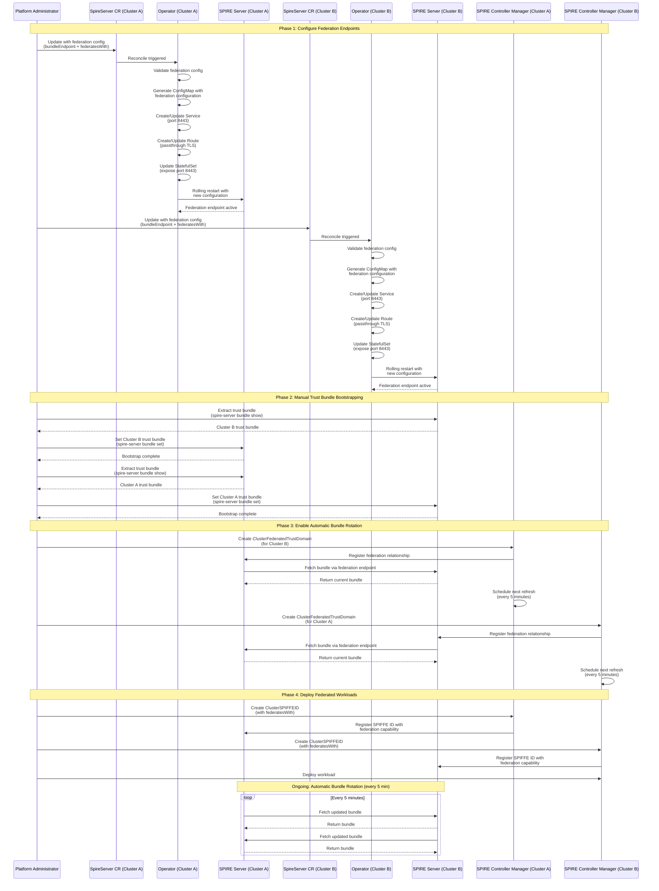

# SPIRE Federation Support for Zero Trust Workload Identity Manager

## Summary

This enhancement adds native support for SPIRE Federation in the Zero Trust Workload Identity Manager operator, enabling secure cross-cluster workload communication. The operator will manage configuration to add federation support, managing lifecycle of trust bundle endpoint, and support federation across N clusters (where N is limited to a configurable maximum).

## Motivation

Organizations deploying workloads across multiple OpenShift clusters need secure service-to-service communication. SPIRE Federation enables workloads in one cluster to authenticate and communicate with workloads in another cluster using cryptographically verified identities (SVIDs). By adding federation support to the operator, we enable declarative, automated, and auditable federation management.

### User Stories

* As an OpenShift cluster administrator, I want to enable SPIRE federation by setting `spec.federation.bundleEndpoint` in the SpireServer CR, so that the operator automatically creates a Service (port 8443) and Route exposing the federation endpoint.

* As an OpenShift cluster administrator, I want to specify federated trust domains in `spec.federation.federatesWith[]` with `bundleEndpointUrl` and `endpointSpiffeId`, so that the operator generates the SPIRE `server.conf` with `federation.federates_with` configuration and triggers StatefulSet rolling updates.

* As an OpenShift security engineer, I want to choose between `https_spiffe` (default, SPIFFE authentication) and `https_web` (Web PKI) profiles for `spec.federation.bundleEndpoint.profile`, so that I can align federation security with organizational certificate policies and authentication requirements.

* As an SRE, I want SpireServer status conditions `FederationConfigurationValid`, `FederationServiceReady`, and `FederationRouteReady` with timestamps and error messages, so that I can quickly diagnose federation configuration issues, Route exposure problems, or certificate errors through `oc get spireserver cluster -o yaml`.

* As an OpenShift cluster administrator, I want the operator to handle federation configuration removal gracefully by deleting the Service and Route when `spec.federation` is removed, so that cross-cluster communication stops cleanly while intra-cluster workloads continue functioning without manual resource cleanup.

* As an application developer, I want to create ClusterSPIFFEID resources with `spec.federatesWith[]` after federation is configured, so that my workloads automatically receive SVIDs capable of authenticating against federated trust domains without understanding the underlying SPIRE federation mechanics.

* As an OpenShift security engineer, I want clear documentation that initial trust bundle bootstrapping requires manual efforts, so that I understand the security model and the one-time manual step required to establish federation trust.

### Goals

1. Enable declarative federation configuration through SpireServer CR API
2. Automate federation endpoint exposure (Service, Route creation)
3. Support both `https_spiffe` and `https_web` bundle endpoint profiles
4. Support federation across N clusters (configurable limit)
5. Provide clear validation and error messages for federation misconfiguration
6. Document the manual trust bundle bootstrapping process
7. Ensure federation configuration is included in StatefulSet pod spec for proper restarts on configuration changes

### Non-Goals

1. **Automatic trust bundle bootstrapping** - Initial trust bundle exchange cannot be fully automated without compromising security. Users must manually bootstrap trust bundles.
2. **Federation with unlimited clusters** - We impose a configurable limit to prevent performance degradation.
3. **Automatic ClusterFederatedTrustDomain creation** - Users must create ClusterFederatedTrustDomain resources on each cluster for each federation relationship to enable automatic bundle rotation.
4. **Custom CA certificate management for https_web profile** - For `https_web` profile, users must provide valid certificates via Secrets or use ACME.
5. **Dynamic trust domain changes** - Changing trust domains in federated clusters requires recreating the federation from scratch. This is a SPIRE limitation, not an operator limitation.

## Proposal

This proposal adds federation configuration to the `SpireServerSpec` API and extends the spire-server controller to:

1. Generate federation configuration in spire-server ConfigMap
2. Create/update a Service to expose port 8443 for federation endpoint
3. Create/update an OpenShift Route to expose the federation endpoint externally
4. Update the StatefulSet to expose port 8443
5. Validate federation configuration at admission time

The operator will NOT automate trust bundle bootstrapping. Users must still perform initial trust bundle exchange.

### Workflow Description

#### Actors
- **Platform Administrator**: Responsible for configuring federation across clusters
- **Zero Trust Workload Identity Manager Operator**: Manages SPIRE infrastructure
- **SPIRE Server**: Provides federation endpoints and manages trust bundles
- **SPIRE Controller Manager**: Reconciles ClusterFederatedTrustDomain resources
- **Application Developer**: Deploys workloads that use federation

#### Initial Federation Setup (Two Clusters)



1. **Configure Federation**: Admin updates SpireServer CR on both clusters with `federation.bundleEndpoint` and `federation.federatesWith` configuration
    ```yaml
   apiVersion: operator.openshift.io/v1alpha1
   kind: SpireServer
   metadata:
     name: cluster
   spec:
     trustDomain: apps.cluster-a.example.com
     clusterName: cluster-a
     # ... existing fields ...
     federation:
       bundleEndpoint:
         port: 8443
         address: "0.0.0.0"
         profile: https_spiffe
       federatesWith:
       - trustDomain: apps.cluster-b.example.com
         bundleEndpointUrl: https://spire-server-federation-zero-trust-workload-identity-manager.apps.cluster-b.example.com
         bundleEndpointProfile: https_spiffe
         endpointSpiffeId: spiffe://apps.cluster-b.example.com/spire/server
   ```

2. **Operator Reconciliation**: 
   - Operator validates federation configuration
   - Updates ConfigMap with federation settings
   - Creates/updates Service exposing federation endpoint port (8443)
   - Creates/updates Route exposing federation endpoint externally
   - Updates StatefulSet to expose federation endpoint port
   - Triggers pod restart with new configuration 

### API Extensions

This enhancement adds new fields to the existing `SpireServerSpec` API:

```go
type SpireServerSpec struct {
    // ... existing fields ...

    // Federation configures SPIRE federation endpoints and relationships
    // +kubebuilder:validation:Optional
    Federation *FederationConfig `json:"federation,omitempty"`
}

// FederationConfig defines federation bundle endpoint and federated trust domains
type FederationConfig struct {
    // BundleEndpoint configures this cluster's federation bundle endpoint
    // +kubebuilder:validation:Required
    BundleEndpoint BundleEndpointConfig `json:"bundleEndpoint"`

    // FederatesWith lists trust domains this cluster federates with
    // +kubebuilder:validation:Optional
    // +kubebuilder:validation:MaxItems=50
    FederatesWith []FederatesWithConfig `json:"federatesWith,omitempty"`

    // managedRoute is for enabling routes for spire-server trust bundle endpoint, which can be indicated
	// by setting `true` or `false`
	// "true": Allows automatic exposure of trust bundle endpoint through a managed OpenShift Route (*.apps.).
	// "false": Allows administrators to manually configure exposure using custom OpenShift Routes or ingress, offering more control over routing behavior.
	// +kubebuilder:default:="true"
	// +kubebuilder:validation:Enum:="true";"false"
	// +kubebuilder:validation:Optional
	ManagedRoute string `json:"managedRoute,omitempty"`
}

// BundleEndpointConfig configures how this cluster exposes its federation bundle
type BundleEndpointConfig struct {
    // Port for the federation bundle endpoint
    // +kubebuilder:validation:Minimum=1
    // +kubebuilder:validation:Maximum=65535
    // +kubebuilder:default=8443
    Port int32 `json:"port"`

    // Address to bind the bundle endpoint to
    // +kubebuilder:default="0.0.0.0"
    Address string `json:"address"`

    // Profile is the bundle endpoint authentication profile
    // +kubebuilder:validation:Enum=https_spiffe;https_web
    // +kubebuilder:default=https_spiffe
    Profile BundleEndpointProfile `json:"profile"`

    // RefreshHint is the hint for bundle refresh interval in seconds
    // +kubebuilder:validation:Minimum=60
    // +kubebuilder:validation:Maximum=3600
    // +kubebuilder:default=300
    RefreshHint int32 `json:"refreshHint,omitempty"`

    // HttpsWeb configures the https_web profile (required if profile is https_web)
    // +kubebuilder:validation:Optional
    HttpsWeb *HttpsWebConfig `json:"httpsWeb,omitempty"`
}

// BundleEndpointProfile represents the authentication profile for bundle endpoint
// +kubebuilder:validation:Enum=https_spiffe;https_web
type BundleEndpointProfile string

const (
    // HttpsSpiffeProfile uses SPIFFE authentication (default, recommended)
    HttpsSpiffeProfile BundleEndpointProfile = "https_spiffe"
    
    // HttpsWebProfile uses Web PKI (X.509 certificates from public CA)
    HttpsWebProfile BundleEndpointProfile = "https_web"
)

// HttpsWebConfig configures https_web profile authentication
type HttpsWebConfig struct {
    // Acme configures automatic certificate management using ACME protocol
    // Mutually exclusive with ServingCert
    // +kubebuilder:validation:Optional
    Acme *AcmeConfig `json:"acme,omitempty"`

    // ServingCert configures certificate from a Kubernetes Secret
    // Mutually exclusive with Acme
    // +kubebuilder:validation:Optional
    ServingCert *ServingCertConfig `json:"servingCert,omitempty"`
}

// AcmeConfig configures ACME certificate provisioning
type AcmeConfig struct {
    // DirectoryUrl is the ACME directory URL (e.g., Let's Encrypt)
    // +kubebuilder:validation:Required
    // +kubebuilder:validation:Pattern=`^https://.*`
    DirectoryUrl string `json:"directoryUrl"`

    // DomainName is the domain name for the certificate
    // +kubebuilder:validation:Required
    DomainName string `json:"domainName"`

    // Email for ACME account registration
    // +kubebuilder:validation:Required
    // +kubebuilder:validation:Pattern=`^[a-zA-Z0-9._%+-]+@[a-zA-Z0-9.-]+\.[a-zA-Z]{2,}$`
    Email string `json:"email"`

    // TosAccepted indicates acceptance of Terms of Service
    // +kubebuilder:default:="false"
	// +kubebuilder:validation:Enum:="true";"false"
	// +kubebuilder:validation:Optional
    TosAccepted bool `json:"tosAccepted"`
}

// ServingCertConfig references a Secret containing TLS certificate
type ServingCertConfig struct {
    // SecretName is the name of the Secret containing tls.crt and tls.key
    // +kubebuilder:validation:Required
    SecretName string `json:"secretName"`

    // FileSyncInterval is how often to check for certificate updates (seconds)
    // +kubebuilder:validation:Minimum=30
    // +kubebuilder:validation:Maximum=3600
    // +kubebuilder:default=300
    FileSyncInterval int32 `json:"fileSyncInterval,omitempty"`
}

// FederatedTrustDomain represents a remote trust domain to federate with
type FederatesWithConfig struct {
    // TrustDomain is the federated trust domain name
    // +kubebuilder:validation:Required
    // +kubebuilder:validation:Pattern=`^[a-z0-9._-]{1,255}$`
    TrustDomain string `json:"trustDomain"`

    // BundleEndpointUrl is the URL of the remote federation endpoint
    // +kubebuilder:validation:Required
    // +kubebuilder:validation:Pattern=`^https://.*`
    BundleEndpointUrl string `json:"bundleEndpointUrl"`

    // BundleEndpointProfile is the authentication profile of remote endpoint
    // +kubebuilder:validation:Required
    // +kubebuilder:validation:Enum=https_spiffe;https_web
    BundleEndpointProfile BundleEndpointProfile `json:"bundleEndpointProfile"`

    // EndpointSpiffeId is required for https_spiffe profile
    // +kubebuilder:validation:Optional
    // +kubebuilder:validation:Pattern=`^spiffe://.*`
    EndpointSpiffeId string `json:"endpointSpiffeId,omitempty"`
}
```

**Validation Rules (via CEL or webhook):**

1. If `federation.bundleEndpoint.profile == "https_web"`, then `federation.bundleEndpoint.httpsWeb` must be set
2. If `httpsWeb` is set, exactly one of `acme` or `servingCert` must be specified (mutually exclusive)
3. If `federatesWith[*].bundleEndpointProfile == "https_spiffe"`, then `endpointSpiffeId` must be set
4. `federatesWith` array length must not exceed N (cluster limit)
5. `federatesWith[*].trustDomain` must not equal `spec.trustDomain` (cannot federate with self)
6. `federatesWith[*].bundleEndpointUrl` must be valid HTTPS URL

### Topology Considerations

#### Hypershift / Hosted Control Planes

#### Standalone Clusters

Full federation support. This is the primary use case.

#### Single-node Deployments or MicroShift

### Implementation Details/Notes/Constraints

#### Operator Code Changes

The operator implementation requires modifications across several components: API types to define federation structures, ConfigMap generation to include federation configuration, Service creation/updation for internal federation endpoint exposure, Route creation for external access, StatefulSet updates to expose federation ports and mount servingCerts if configured, controller reconciliation to orchestrate federation resources and manage status conditions, and validation logic to ensure configuration correctness. When `managedRoute` is set to `false`, the operator will not reconcile or manage the Route resource for the federation endpoint created by operator, allowing administrators to manually configure custom Routes or ingress solutions for more granular control.

#### SPIRE Server Configuration Output

Example generated `server.conf` with federation:

```json
{
  "server": {
    "trust_domain": "apps.cluster-a.example.com",
    // ... other server config ...
  },
  "federation": {
    "bundle_endpoint": {
      "address": "0.0.0.0",
      "port": 8443,
      "acme": null
    },
    "federates_with": {
      "apps.cluster-b.example.com": {
        "bundle_endpoint_url": "https://spire-server-federation-zero-trust-workload-identity-manager.apps.cluster-b.example.com",
        "bundle_endpoint_profile": {
          "https_spiffe": {
            "endpoint_spiffe_id": "spiffe://apps.cluster-b.example.com/spire/server"
          }
        }
      }
    }
  },
  // ... plugins, telemetry, etc ...
}
```

#### Constraints and Limitations

1. **Maximum Federated Clusters**: Default limit of N (configurable) clusters to prevent performance issues. Configurable via operator environment variable `MAX_FEDERATED_CLUSTERS`.
2. **Trust Bundle Bootstrapping**: Cannot be automated. Users MUST manually bootstrap trust bundles.
3. **Certificate Management for https_web**: Users are responsible for providing valid certificates via Secrets or configuring ACME correctly. Invalid certificates will cause federation to fail.

### Risks and Mitigations

| Risk | Impact | Mitigation |
|------|--------|------------|
| **Misconfigured federation breaks cross-cluster communication** | High - workloads cannot communicate across clusters | - Comprehensive validation at API admission time<br>- Clear status conditions showing federation state<br>- Detailed documentation and examples<br>- E2E tests for common scenarios |
| **Manual trust bundle bootstrapping is error-prone** | High - federation won't work without correct bootstrapping | - Detailed step-by-step documentation<br>|
| **Too many federated clusters cause performance degradation** | Medium - SPIRE server becomes slow or unstable | - Enforce maximum limit <br>- Document performance characteristics<br>- Test with maximum number of clusters |

### Drawbacks

The solution can incur performance overhead, increase troubleshooting complexity, and lead to higher resource consumption under heavy load.


## Alternatives (Not Implemented)

1. Add ingress instead of route for exposing federation endpoint

## Open Questions

1. **Should we support dynamic trust domain changes?**
   - Current proposal: No, requires complete re-federation
   - Question: Should we detect and provide better guidance when trust domain changes?

2. **Should we support automatic failover if a federated cluster becomes unavailable?**
   - Should operator surface this information in status?
   - Should we add health checks for federated endpoints?

## Test Plan

### Unit Tests
- API validation (valid/invalid configs, edge cases)
- ConfigMap/Service/Route generation

### Integration Tests
- Controller reconciliation flow (create, update, delete resources)
- Create-only mode behavior
- Status condition updates

### E2E Tests
- Two-cluster federation setup and verification
- `N+1`th cluster addition
- Configuration updates and pod restarts

### Performance Tests
- Bundle refresh latency with varying cluster counts
- Federation endpoint load testing
- Resource usage measurement

## Graduation Criteria

The feature will directly be a part of GA release.

### Dev Preview -> Tech Preview

Not applicable.

### Tech Preview -> GA

Not applicable.


### Removing a deprecated feature

## Upgrade / Downgrade Strategy

## Version Skew Strategy

## Operational Aspects of API Extensions

## Support Procedures

## Infrastructure Needed [optional]
None
