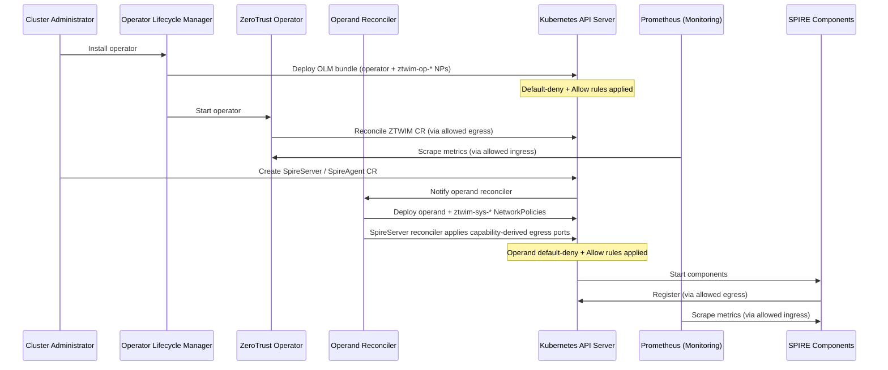

# Network Policy for Zero Trust Workload Identity Management

## Summary

This enhancement defines the NetworkPolicy requirements for the
ZeroTrustWorkloadIdentityManager operator and its operands (SPIRE Server,
SPIRE Agent, SPIFFE CSI Driver, and OIDC Discovery Provider). The network
policies implement a zero-trust security model by deploying default-deny
baseline policies and explicit allow rules for required communication
patterns. Conditional egress and federation ingress are derived from
existing operand spec and operator proxy configuration (port-only rules,
fixed `ztwim-sys-*` policy names) without `networkPolicyRefs` or other new
CR fields.

### Supported Platforms

| OpenShift version | CNI | Topology | Notes |
|-------------------|-----|----------|-------|
| 4.16+ | OVN-Kubernetes | Standalone, SNO, Hosted Control Planes | Primary target; full support |
| 4.16+ | OpenShift SDN | Standalone, SNO | Supported; probe exemption applies |
| 4.16+ | OVN-Kubernetes | MicroShift | Supported when CNI enforces NetworkPolicy |
| 4.16+ | OVN-Kubernetes | OKE | Supported; metrics ingress optional |

Network policies require a CNI that enforces `networking.k8s.io/v1`
NetworkPolicy. Clusters using other CNIs are out of scope.

## Motivation

The ZeroTrustWorkloadIdentityManager operator deploys operands that manage
sensitive cryptographic operations, issuance of identities to workloads,
and identity attestation services. Following zero-trust security
principles, all network traffic should be denied by default, with only
explicitly required communication patterns allowed. Allowing only
explicitly required communication reduces the attack surface and limits
potential security incidents.

Without network policies, any pod within the OpenShift cluster can
communicate freely with other pods, regardless of their intended level of
access. Attackers or compromised pods can exploit this lack of restriction
to move laterally within the cluster and potentially compromise critical
components. In the absence of network policies, pods may have unrestricted
communication with external networks, which can result in unintended data
leakage, where sensitive information is transmitted to unauthorized
destinations.

### User Stories

* As a cluster administrator, I want NetworkPolicy resources automatically
  deployed with the ZeroTrustWorkloadIdentityManager operator, so that
  SPIRE components are allowed only required communication.

* As a cluster administrator, I want the operator to create and update
  capability-specific NetworkPolicies from existing SpireServer, SpireAgent,
  and operator configuration (federation URLs, Vault address, database type,
  cluster proxy env), so that egress ports stay correct when I change the CR
  without maintaining separate NetworkPolicy manifests or references.

* As a cluster administrator upgrading the operator, I want conditional
  policies applied from the current operand spec on the first reconcile after
  upgrade, so that enabling deny-all does not break Vault, federation, or
  external database connectivity that already worked before the upgrade.

* As a site reliability engineer, I want operand status to show which
  operator-managed NetworkPolicies were applied and whether reconciliation
  failed, so that I can debug connectivity without guessing which capability
  rule is missing.

* As a security engineer, I want default-deny network policies enforced
  for all workload identity components, so that only explicitly permitted
  traffic flows are allowed and the attack surface is minimized.

* As a platform operator, I want Prometheus to scrape metrics from SPIRE
  components, so that I can monitor the health and performance of the
  workload identity system and detect anomalies.

* As a site reliability engineer, I want to understand how network
  policies are deployed and maintained at scale across multiple clusters,
  so that I can troubleshoot connectivity issues and ensure consistent
  security posture.

### Goals

* Automatically deploy NetworkPolicy resources for the operator during
  operator installation via the OLM bundle with no user configuration
  required.

* Automatically deploy NetworkPolicy resources for operands during operand
  CR reconciliation.

* Implement default-deny baseline policies for all operator and operand
  components (excluding SPIFFE CSI Driver, which uses Unix sockets only).

* Enable required communication patterns through explicit allow rules:
  * Operator and operand communication with Kubernetes API server
  * SPIRE Agent to SPIRE Server communication (port 8081/TCP)
  * SPIRE Agent to Kubelet for workload attestation (port 10250/TCP)
  * Prometheus metrics collection from openshift-monitoring namespace
    (ports 9402/TCP, 8082/TCP, 8443/TCP)
  * Webhook ingress for SPIRE controller manager (port 9443/TCP)
  * SPIRE Server federation via OpenShift Router (if enabled)
  * DNS resolution for service discovery (port 5353/TCP+UDP)
  * Capability-derived egress for SPIRE Server (and proxy egress for server,
    agent, and OIDC) by parsing operand spec and operator proxy environment

* Ensure network policies do not interfere with normal operation of the
  workload identity management system.

* Derive conditional egress TCP ports from existing configuration (no new
  SpireServer fields for endpoint lists). Use port-only egress rules (no
  `ipBlock`) unless the cluster administrator adds separate policies for
  least-privilege CIDR restrictions.

### Non-Goals

* AdminNetworkPolicy or cluster-wide policy management. Standard
  NetworkPolicy objects are sufficient for this scope. Clusters using
  [AdminNetworkPolicy](https://docs.redhat.com/en/documentation/openshift_container_platform/4.21/html/network_security/admin-network-policy)
  must ensure cluster-wide policies do not conflict with operand traffic.

* Define network policies for workloads consuming SPIRE-issued identities.
  This enhancement only covers the SPIRE infrastructure components
  themselves.

* Replace or duplicate existing security mechanisms such as RBAC, pod
  security standards, or network segmentation at the infrastructure level.

## Proposal

This proposal introduces a comprehensive set of NetworkPolicy resources
that are automatically deployed as part of the
ZeroTrustWorkloadIdentityManager operator and operand installation
process. The policies follow a defense-in-depth approach with default-deny
baselines and minimal explicit allow rules.

**Policy ownership model:**

| Policy type | Prefix | Applied by | Reconciled by |
|-------------|--------|------------|---------------|
| Operator policies | `ztwim-op-*` | OLM bundle at install | Not continuously (OLM) |
| Operand baseline policies | `ztwim-sys-*` | Operand reconciler | Operand reconciler |
| Administrator supplemental policies | User-defined (not `ztwim-sys-*`) | Administrator | Administrator (optional; additive) |

The operator's network policies are embedded in the **OLM bundle** and
applied by OLM during operator installation. The operand's network
policies (for SPIRE Server, SPIRE Agent, and OIDC Discovery Provider) are
created and reconciled by **operand-specific controllers** during operand
CR reconciliation. The SPIFFE CSI Driver does not require NetworkPolicy
resources as it communicates exclusively via Unix domain sockets.

The operator controller does **not** reconcile or overwrite its own
NetworkPolicies. Operand reconcilers reconcile **operator-defined**
`ztwim-sys-*` template names from embedded bindata (create, update, or
delete by fixed name per capability gate) and revert external modifications
to those names.

All policies use pod selectors to target specific components and enforce
ingress/egress rules based on the minimum required communication patterns
for each component to function correctly.

### Pod Label Contract

All operand pod templates and NetworkPolicy selectors use consistent
labels:

| Component | Label |
|-----------|-------|
| SPIRE Server (StatefulSet pod) | `app.kubernetes.io/name: spire-server` |
| SPIRE Agent | `app.kubernetes.io/name: spire-agent` |
| OIDC Discovery Provider | `app.kubernetes.io/name: spiffe-oidc-discovery-provider` |
| ZTWIM Operator | `app.kubernetes.io/name: zero-trust-workload-identity-manager` |

The SPIRE controller-manager runs as a **sidecar container** in the same
pod as spire-server. NetworkPolicy is pod-scoped, so all ingress and
egress rules for both containers target `app.kubernetes.io/name:
spire-server`. A separate controller-manager label is not used for
NetworkPolicy selectors.

NetworkPolicy `podSelector` values must match these labels. Unit and
integration tests verify label consistency between pod templates and
policy selectors.

### Workflow Description

**cluster administrator** is a human user responsible for installing and
managing the ZeroTrustWorkloadIdentityManager operator.

**operator** is the ZeroTrustWorkloadIdentityManager operator controller.

**monitoring system** is the OpenShift monitoring stack (Prometheus).

#### Operator Network Policy Deployment

1. The cluster administrator installs the ZeroTrustWorkloadIdentityManager
   operator.

2. OLM deploys the operator bundle, which includes NetworkPolicy resources
   (`ztwim-op-*`) applied to the operator namespace automatically.

3. The default-deny NetworkPolicy is applied, blocking all ingress and
   egress traffic for the operator pods.

4. Explicit allow NetworkPolicy resources are applied to permit:
   * Egress to the Kubernetes API server on port 6443/TCP
   * Ingress from the openshift-monitoring namespace on port 8443/TCP for
     metrics scraping

5. The operator starts and begins reconciliation with the restricted
   network access. The operator controller does not reconcile its own
   NetworkPolicies.

#### Operand Network Policy Deployment

1. The cluster administrator creates operand custom resources
   (`SpireServer`, `SpireAgent`, `SpiffeCSIDriver`,
   `SpireOIDCDiscoveryProvider`).

2. The corresponding operand reconciler deploys the operand components and
   creates `ztwim-sys-*` NetworkPolicy resources.

3. During operand CR reconciliation, each reconciler runs the network
   policy loop (see Operand Network Policies): for each operator-managed
   template, create or update the policy when its capability gate is true,
   and delete the policy by fixed name when the gate is false. The
   SpireServer reconciler also builds or updates conditional egress
   policies whose TCP ports are derived from the current spec and operator
   proxy environment. The `managedRoute` field on SpireOIDCDiscoveryProvider
   and SpireServer federation controls Route lifecycle only; it does not
   change baseline ingress from `openshift-ingress` on port 8443/TCP.

4. Policy rollout follows a safe ordering: allow rules are applied before
   or overlapping with default-deny replacements. The reconciler retries
   on transient failures and waits for policy propagation before removing
   superseded rules.

5. Operand components start with network policies in effect.

6. The monitoring system scrapes metrics through the allowed ingress rules.

**SPIRE Server** (StatefulSet with spire-server and spire-controller-manager
sidecar containers; `app.kubernetes.io/name: spire-server`):
* Allow ingress from SPIRE Agents on port 8081/TCP (gRPC)
* Allow ingress for metrics on port 9402/TCP (spire-server) and 8082/TCP
  (controller-manager) from openshift-monitoring namespace
* Allow ingress for webhook on port 9443/TCP (controller-manager). On
  Hosted Control Planes, the API server has no in-cluster identity; the
  rule is left open on port 9443/TCP with documented compensating controls
  (TLS and webhook authentication)
* Allow ingress on port 8443/TCP from OpenShift Router for federation
  (conditional; uses `policy-group.network.openshift.io/ingress` namespace
  label with empty `podSelector`; add
  `policy-group.network.openshift.io/host-network` when the Ingress
  Controller uses hostNetwork)
* Allow egress to Kubernetes API server on port 6443/TCP (port-only rule,
  no `ipBlock`)
* Allow egress to DNS on port 5353/TCP+UDP to openshift-dns namespace
* Allow conditional feature egress (port-only): union of TCP ports from
  `federatesWith` URLs, federation ACME `directoryUrl`, Vault `vaultAddr`,
  external database, and operator proxy env when those capabilities are enabled

**SPIRE Agent** (DaemonSet, `app.kubernetes.io/name: spire-agent`):
* Allow egress to SPIRE Server on port 8081/TCP (pod/namespace selectors)
* Allow egress to Kubernetes API server on port 6443/TCP (port-only rule)
* Allow egress to Kubelet on port 10250/TCP for workload attestation
  (port-only rule; the k8s workload attestor calls
  `https://<node>:10250/pods` to get pod metadata)
* Allow ingress for metrics on port 9402/TCP from openshift-monitoring
  namespace
* Allow egress to DNS on port 5353/TCP+UDP to openshift-dns namespace

**SPIFFE CSI Driver** (DaemonSet):
* No NetworkPolicy required. Communicates with SPIRE Agent via Unix
  domain sockets on the same node. Excluded from NetworkPolicy scope.

**OIDC Discovery Provider** (Deployment,
`app.kubernetes.io/name: spiffe-oidc-discovery-provider`):
* Allow ingress on port 8443/TCP from OpenShift Router (uses
  `policy-group.network.openshift.io/ingress` namespace label). No egress
  rules required; data source is SPIRE Agent via Unix domain socket.

**Note on health probes**: On supported platforms (see Supported
Platforms), kubelet httpGet health probes bypass NetworkPolicy because
kubelet runs on the host network. No ingress rules are needed for probe
ports (8080, 8083, 9982, 8008, 9809). Other CNIs may require explicit
probe ingress rules; such CNIs are out of scope unless probe-success
tests are added.

**Baseline policy rule patterns**:

| Traffic | Baseline rule style |
|---------|---------------------|
| Kubernetes API (6443) | Port-only egress (no `to:` / no `ipBlock`) |
| Kubelet (10250) | Port-only egress (no `to:` / no `ipBlock`) |
| DNS (5353) | `namespaceSelector` + `podSelector` to openshift-dns |
| Metrics | `namespaceSelector` to openshift-monitoring |
| Standard federation / OIDC Route ingress | `ztwim-sys-*` baseline (`namespaceSelector` to openshift-ingress) |
| Federation remote egress | Operator: port-only egress; TCP ports = union from `federatesWith[].bundleEndpointUrl` |
| Federation ACME egress | Operator: port-only egress; TCP ports from `bundleEndpoint.httpsWeb.acme.directoryUrl` when set |
| Federation ingress (local bundle) | Operator: fixed **8443/TCP** ingress when `spec.federation` set (pod listener; not configurable in CR today) |
| Vault, external DB, proxy | Operator: port-only egress; ports parsed from `vaultAddr`, `connectionString` / `databaseType`, and operator `HTTP_PROXY`/`HTTPS_PROXY` |



### API Extensions

This enhancement does **not** add new CRDs, webhooks, or finalizers, and does
**not** add `networkPolicyRefs` or other new fields
to operand CRs. Operand reconcilers deploy baseline `ztwim-sys-*` policies
from embedded templates and **generate or update** conditional policies
from configuration that already exists on the CR or operator Deployment.

**Why:** Fixed operator policy names per capability avoid namespace scans
and mis-typed references. Parsing URLs and connection strings for **TCP
ports only** keeps policies simple (no `ipBlock`) while matching upgrade
and spec changes automatically.

**SpireServer reconciler — capability gates and port sources:**

| Capability | Gate (spec / env) | Operator-managed policy (examples) | Egress or ingress ports |
|------------|-------------------|------------------------------------|-------------------------|
| Federation ingress | `spec.federation != nil` | `ztwim-sys-federation-ingress` | Ingress **8443/TCP** from `openshift-ingress` (fixed pod port in operator today) |
| Federation remote egress | `len(federation.federatesWith) > 0` | `ztwim-sys-federation-egress` or merged into `ztwim-sys-server-egress-feature-ports` | Union of TCP ports from each `bundleEndpointUrl` (default **443** for `https://`) |
| Federation ACME | `federation.bundleEndpoint.httpsWeb.acme != nil` | Same feature-egress policy | TCP ports from `acme.directoryUrl` |
| Vault upstream | `upstreamAuthority.vault != nil` | Feature-egress policy | TCP ports from `vault.vaultAddr` (`http`→80, `https`→443, or explicit port) |
| cert-manager upstream | `upstreamAuthority.certManager != nil` | *(none beyond baseline)* | API **6443** only |
| Self-signed CA | `upstreamAuthority == nil` | *(none beyond baseline)* | — |
| External database | `databaseType` not `sqlite3` (and not file-only `sql`) | Feature-egress policy | Parse `connectionString` or default **5432** / **3306** by type |
| Cluster proxy | Operator `HTTP_PROXY` or `HTTPS_PROXY` set | `ztwim-sys-allow-proxy-egress` (server, agent, OIDC) | Union of proxy URL ports |

**SpireAgent reconciler:** baseline + **10250/TCP** egress when Kubernetes
workload attestor enabled (default) + proxy policy when proxy env set.

**SpireOIDCDiscoveryProvider reconciler:** baseline ingress **8443/TCP** +
proxy egress when proxy env set.

**Port union:** The SpireServer reconciler may implement one
`ztwim-sys-server-egress-feature-ports` NetworkPolicy whose egress allows
the **deduplicated union** of all conditional TCP ports above. When the
union is empty, delete that policy by name.

**Parsing limits (documented, not blocking):**

* Port-only egress does not restrict destination IP or hostname.
* Database connection strings may be ambiguous; use type defaults when
  parse fails and surface a **warning** on `NetworkPoliciesReconciled`.
* Outbound traffic via corporate proxy uses **proxy** ports, not remote
  URL ports, unless `NO_PROXY` bypasses the proxy for those hosts.

**Naming conventions:**

* `ztwim-op-*` — operator policies in the OLM bundle (OLM install only).
* `ztwim-sys-*` — operator-managed operand policies; fixed names in
  bindata; recreated or updated on reconcile if modified externally.
* Other names — administrator-owned; never created or deleted by the
  operator.

### Status and Conditions

| Resource | Condition | True | False |
|----------|-----------|------|-------|
| ZTWIM CR | `NetworkPoliciesApplied` | All operand baseline policies reconciled | Operand policy apply failed |
| SpireServer CR | `NetworkPoliciesReconciled` | Operator-managed policies applied successfully | Create/update failed |
| SpireAgent CR | `NetworkPoliciesReconciled` | Operator-managed policies applied successfully | Create/update failed |
| SpireOIDCDiscoveryProvider CR | `NetworkPoliciesReconciled` | Operator-managed policies applied successfully | Create/update failed |

When `NetworkPoliciesReconciled=False` or baseline policy creation fails,
the ZTWIM operator reports **Degraded**. Operand CR condition **messages**
should list failed policy names and, for debugging, which capabilities
were evaluated (for example federation, vault, external-db, proxy) and
the TCP port set applied. A structured `status` field mapping capability
to policy name may be added in a follow-up API change if reviewers require
machine-readable status beyond condition messages.

### Topology Considerations

#### Hypershift / Hosted Control Planes

In Hosted Control Planes deployments, the API server runs outside the
managed cluster. The webhook ingress policy on port 9443/TCP cannot use a
`from` namespace selector because the API server has no in-cluster pod
identity. The rule is left open on that port with documented compensating
controls. Negative tests verify unrelated pods cannot reach the webhook.

The operator and operands run in the managed cluster. All other network
policies function identically to standalone clusters.

#### Standalone Clusters

This enhancement is fully applicable to standalone OpenShift clusters.
Network policies are deployed in the operator namespace and operand
namespace and are enforced by the cluster CNI when it supports
NetworkPolicy (see Supported Platforms).

#### Single-node Deployments or MicroShift

On single-node OpenShift (SNO) deployments, network policies have minimal
resource impact. Policies function identically to standard clusters.

For MicroShift, network policies are supported when the CNI plugin
implements NetworkPolicy enforcement.

#### OpenShift Kubernetes Engine

Network policies are part of standard Kubernetes functionality and are
supported in OKE. Metrics ingress from openshift-monitoring is optional
in OKE environments without OpenShift monitoring.

### Implementation Details/Notes/Constraints

The implementation creates NetworkPolicy manifests for each component and
applies them during the appropriate lifecycle phase (OLM install for
operator policies; operand CR reconciliation for operand policies).

### Operator Network Policies

The OLM bundle includes two NetworkPolicy resources (`ztwim-op-*`):

1. **Default-deny policy**: Denies all ingress and egress for operator pods.

2. **Operator allow policy**: Permits API server egress (6443/TCP) and
   metrics ingress from openshift-monitoring (8443/TCP).

The operator controller does not reconcile these policies. OLM applies
them once at install. If manually deleted, they are not automatically
recreated unless the operator is reinstalled or the bundle is reapplied.

### Operand Network Policies

Operand reconcilers (SpireServer, SpireAgent, SpireOIDCDiscoveryProvider)
manage operator-defined NetworkPolicy resources from embedded bindata.

#### Reconcile loop (operand reconcilers)

For each operator-managed NetworkPolicy template (fixed Kubernetes object
name and capability gate):

* When the gate is true for the current CR spec (and operator env, for
  proxy) → create the policy if missing, or update it if the desired
  ports or selectors changed.
* When the gate is false → delete that policy by name if it exists.

**Baseline policies (always enabled):** Templates with no capability gate
(default-deny, API/DNS/metrics/agent-server/kubelet, OIDC ingress from
openshift-ingress, etc.) are always applied while the operand reconciler
runs.

**Conditional policies:** Templates gated by operand spec (for example
`ztwim-sys-federation-ingress` when `spireServer.spec.federation` is set)
and dynamically generated feature-egress ports are applied when the gate
is true and removed when false.

The reconciler does not list or scan the namespace by name prefix; it only
touches embedded template names and generated policy names it owns.

On operand CR deletion, the reconciler deletes each operator-managed
NetworkPolicy by fixed name if it still exists.

### RBAC Requirements

Operand reconcilers require namespace-scoped RBAC:

```yaml
- apiGroups: ["networking.k8s.io"]
  resources: ["networkpolicies"]
  verbs: ["create", "update", "patch", "delete", "get", "list", "watch"]
```

The ZTWIM controller does not require NetworkPolicy write RBAC; operand
reconcilers hold namespace-scoped NetworkPolicy permissions. No new
cluster-scoped RBAC is required.

### Baseline Network Policy Generation

Baseline `ztwim-op-*` policies are **static bindata manifests** in the OLM
bundle. `ztwim-sys-*` policies are applied from embedded templates by
operand reconcilers. Neither set discovers or hardcodes cluster CIDRs at
runtime.

* **API server and kubelet egress**: port-only rules (egress on 6443/TCP
  or 10250/TCP with no `to:` clause).
* **DNS, metrics, federation**: namespace and pod selectors.
* **Conditional policies** (federation, vault, DB, proxy): created when
  enabled in SpireServer spec or operator env; deleted when disabled; use
  selectors or port-only egress, not runtime CIDR discovery.

### DNS Resolution

Egress policies for DNS allow UDP and TCP on port 5353 to CoreDNS pods in
the openshift-dns namespace. On OpenShift, `dns-default` exposes port 53
as the service port, but CoreDNS pods listen on port 5353. NetworkPolicy
evaluates real pod ports, so the egress rule uses port 5353.

### Federation Support

#### Operator-managed (standard)

When `spireServer.spec.federation` is configured, the SpireServer
reconciler applies conditional federation policies:

* **Federation ingress**: port **8443/TCP** from OpenShift Router (ingress
  namespace selector). This matches the fixed federation listener port in
  the operator (not configurable in the CR today).
* **Federation remote egress**: when `federatesWith` is non-empty, egress
  allows the union of TCP ports parsed from each `bundleEndpointUrl`
  (default **443** for `https://` without an explicit port).
* **Federation ACME egress**: when `bundleEndpoint.httpsWeb.acme` is set,
  add TCP ports from `directoryUrl` to the same union.

When federation is removed from spec (where API immutability rules allow)
or gates become false, the reconciler deletes the corresponding
operator-managed policy names.

Port-only egress is intentionally broad (any destination on those ports).
Administrators who need destination CIDR restrictions may add separate
NetworkPolicies; the operator does not manage those.

### OIDC Routes and Ingress

Route creation is defined in
[oidc-routes-integration.md](oidc-routes-integration.md). The
`managedRoute` field on SpireOIDCDiscoveryProvider and
`spec.federation.managedRoute` on SpireServer control whether the operator
creates and manages Route objects; they do not affect NetworkPolicy
reconciliation.

Baseline `ztwim-sys-*` ingress from the `openshift-ingress` namespace on
port 8443/TCP covers standard OpenShift Router exposure for the OIDC
Discovery Provider and SPIRE federation listener whether `managedRoute` is
true or false.

Non-standard ingress (custom Ingress Controller namespace, `hostNetwork`
Ingress Controller, or external load balancer not via `openshift-ingress`) is
the cluster administrator's responsibility and is out of operator scope.
The operator does not create, validate, or delete Route objects or
user-managed ingress NetworkPolicies for custom routes.

### Capability-Derived Egress (Vault, Database, Proxy)

When Vault, external database, or cluster proxy is enabled, the SpireServer
(and SpireAgent / OIDC for proxy) reconciler **creates or updates**
operator-managed egress policies with TCP ports derived as follows:

| Source | Port derivation |
|--------|-----------------|
| `upstreamAuthority.vault.vaultAddr` | Parse URL; `http`→80, `https`→443, or explicit `:port` |
| `datastore.databaseType` + `connectionString` | Not `sqlite3`: parse `port=` or URL, else **5432** / **3306** by type |
| Operator `HTTP_PROXY` / `HTTPS_PROXY` | Same as operand proxy wiring in `pkg/controller/utils/proxy.go` |

cert-manager upstream adds no extra ports beyond baseline API **6443**.

If parsing fails, apply the default port for the database type and set a
warning on `NetworkPoliciesReconciled`. AdminNetworkPolicy at cluster
scope may allow egress independently; the operator does not inspect ANP
rules.

### Constraints

* Network policy enforcement requires a CNI that supports NetworkPolicy
  (see Supported Platforms; OpenShift 4.16+).
* Operator NetworkPolicies (`ztwim-op-*`) are deployed once by OLM and are
  not continuously reconciled. Manual deletion is not auto-healed.
* Operand NetworkPolicies (operator-defined `ztwim-sys-*` template names)
  are continuously reconciled by operand controllers and recreated if
  manually deleted.
* Operator-generated conditional egress uses port-only rules (no `ipBlock`).
  Least-privilege destination restrictions require administrator-created
  NetworkPolicies or AdminNetworkPolicy.
* NetworkPolicies are additive. The operator cannot restrict traffic
  allowed by administrator-created NetworkPolicies.
* Non-standard ingress paths and custom Route ingress beyond the baseline
  `openshift-ingress` selector are administrator responsibility; out of
  operator scope. `managedRoute: "false"` means the operator does not own
  the Route object; baseline ingress NP for the default router namespace
  still applies when that path is used.
* Clusters with non-standard networking may require administrator
  NetworkPolicies or AdminNetworkPolicy adjustments in addition to
  operator-managed `ztwim-sys-*` policies.

### Risks and Mitigations

**Risk**: Misconfigured **administrator-created** NetworkPolicy resources
could block legitimate traffic or allow unintended egress (policies are
additive).

**Mitigation**:
* Operator-generated `ztwim-sys-*` policies are derived from operand spec
  and are intended to work out-of-the-box for the required ports on
  supported OpenShift versions (see Supported Platforms)
* `NetworkPoliciesReconciled` surfaces operator apply failures
* Comprehensive E2E tests for all required communication patterns

**Constraint (not operator mitigation):** The cluster administrator is
responsible for supplemental policies and for not using `ztwim-sys-*`
names for custom objects.

**Risk**: AdminNetworkPolicy at cluster scope may block traffic even when
namespace NetworkPolicies allow it.

**Mitigation**:
* Document ANP interaction in Non-Goals and support procedures
* Test scenarios include clusters with ANP defined

**Risk**: Different CNI plugins may enforce NetworkPolicy rules
differently.

**Mitigation**:
* Test on platforms listed in Supported Platforms
* Use standard NetworkPolicy features only

**Risk**: Port-only capability egress allows those TCP ports to any
destination, which is broader than host-specific allow lists.

**Mitigation**:
* Document limitation in Constraints; administrators may add `ipBlock`
  policies for tightening
* Union only includes ports required by enabled capabilities

**Risk**: Upgrading existing deployments to default-deny may break
production connectivity.

**Mitigation**:
* Apply allow rules before or overlapping with deny replacements
* Conditional policies only created when operand spec enables capability
* Document upgrade path for clusters with custom networking

### Drawbacks

Deploying NetworkPolicy resources adds complexity to operator installation
and operand provisioning. Network policies may make debugging connectivity
issues more difficult. Clear documentation, status conditions, and logging
mitigate this concern.

## Alternatives (Not Implemented)

### Alternative 1: Inline Egress Rules in the CRD

Embed `NetworkPolicyEgressRule` directly in operand CRs.

**Reason not selected**: Ties the API to upstream Kubernetes networking
structs. Requires users to learn a new CR format.

**Cons**: API coupling and version drift; harder to reuse existing
NetworkPolicy tooling and GitOps workflows.

### Alternative 2: networkPolicyRefs on SpireServer (Existence-Only)

Users create NetworkPolicies and list names in `networkPolicyRefs` on
SpireServer; the reconciler validates existence only.

**Reason not selected**: Easy to misconfigure (wrong ports or missing refs),
upgrade friction, and no automatic update when `vaultAddr` or
`federatesWith` changes. Operand spec already contains endpoints.

**Cons**: Silent egress gaps when refs omitted; operator cannot verify
rule content.

### Alternative 3: No Capability-Derived Egress

Only deploy static baseline policies. Administrators create all Vault/DB/
federation/proxy egress without operator help.

**Reason not selected**: No automatic alignment with CR; high operational
burden; poor upgrade story.

**Cons**: Silent failures when capabilities enabled; no Degraded signal
from missing egress.

### Alternative 4: networkPolicyRefs on ZTWIM CR

Place references on the cluster-wide ZeroTrustWorkloadIdentityManager CR.

**Reason not selected**: ZTWIM controller lacks operand-specific awareness;
SpireServer reconciler is the correct owner for server egress derivation.

**Cons**: Scattered validation; same misconfiguration risks as Alternative 2.

## Test Plan

### Unit Tests

* Validate NetworkPolicy manifest generation for each component type
* Verify pod label selectors match pod templates
* Verify `policyTypes` (Ingress, Egress, or both) per policy template
* Test capability port parsing (federation URLs, ACME directoryUrl,
  vaultAddr, connectionString, proxy env) and port union deduplication
* Test condition transitions (`NetworkPoliciesReconciled`, Degraded)

### Integration Tests

* OLM bundle install applies `ztwim-op-*` operator NetworkPolicies
* SpireServer reconcile creates `ztwim-sys-*` operand NetworkPolicies
* Policies updated when operand configuration changes (e.g., federation
  enabled/disabled)
* Policies deleted when operands are removed (delete by fixed name for each
  operator-managed policy)
* Capability-derived egress policy updated when SpireServer spec changes
* Degraded state when operator-managed policy create/update fails
* Supported downgrade deletes operator-managed policies whose capability
  gate is false after spec change
* Supported downgrade leaves orphan policies when downgraded version
  predates a policy name (documented limitation)
* Operand operator-managed policies recreated or updated after manual
  deletion on the next reconcile
* Operator `ztwim-op-*` policies **not** recreated after manual deletion

### E2E Tests

* SPIRE Server communicates with Kubernetes API server
* SPIRE Agents connect to SPIRE Server on port 8081
* Prometheus scrapes metrics from operator and operands
* Unauthorized pod-to-pod traffic is blocked
* Federation communication between SPIRE Servers (when enabled)
* DNS resolution for all components
* Kubelet attestation egress on port 10250
* Vault upstream egress with parsed `vaultAddr` port
* External database egress with parsed/default SQL port
* Federation remote egress with union of `bundleEndpointUrl` ports
* Cluster proxy egress on server, agent, and OIDC when proxy env set

### Compatibility Tests

* Platforms and topologies in Supported Platforms (standalone, SNO, HCP
  where applicable)
* MicroShift with NetworkPolicy-capable CNI
* Cluster with AdminNetworkPolicy that allows required operand traffic;
  operands remain healthy
* Cluster with AdminNetworkPolicy that denies operand egress; failure is
  documented and support procedures apply

### Negative Tests

* Traffic not explicitly allowed is blocked
* AdminNetworkPolicy blocking operand traffic (documented behavior)
* Webhook unreachable from unrelated pods on Hosted Control Planes
* Connectivity failure error messages in operand CR conditions

All E2E tests include labels per OpenShift test conventions:
`[Jira:"ZTWIM"]`, `[Suite:openshift/conformance/parallel]`.
Reference: https://github.com/openshift/enhancements/blob/master/dev-guide/test-conventions.md

Since network policies are not feature-gated, tests do not require
`[OCPFeatureGate:...]` labels.

## Graduation Criteria

Network policies ship with the ZTWIM operator at GA; there is no separate
preview stage for this enhancement.

### Dev Preview -> Tech Preview

Not applicable. Network policies are delivered with the operator at GA.

### Tech Preview -> GA

Network policies are enabled by default with the operator and use stable
`networking.k8s.io/v1` APIs. GA criteria:

* E2E tests pass on supported platforms per Supported Platforms
* Upgrade and supported downgrade scenarios validated per Upgrade/Downgrade
  Strategy
* Operand CR status conditions (`NetworkPoliciesReconciled`) exposed and
  documented with debug-oriented condition messages
* [openshift-docs](https://github.com/openshift/openshift-docs/) covers
  baseline policies, capability-derived egress, and AdminNetworkPolicy
  interaction

### Removing a deprecated feature

Not applicable for initial release.

## Upgrade / Downgrade Strategy

### Upgrade Strategy

When upgrading the ZeroTrustWorkloadIdentityManager operator:

1. OLM applies updated `ztwim-op-*` policies from the new bundle version.

2. Operand reconcilers apply updated `ztwim-sys-*` templates on next
   reconcile.

3. **Upgrade safety for existing deployments:**
   * Allow rules are applied before or overlapping with default-deny
     replacements to avoid connectivity gaps
   * Conditional policies (federation, vault, external DB, proxy) are
     created only when the corresponding SpireServer spec field or operator
     proxy env is set; ports are derived on first reconcile after upgrade
   * Clusters with non-standard ingress or AdminNetworkPolicy may need
     administrator adjustments in addition to operator policies

4. **Capability-based operand policies on upgrade:** After the operator
   upgrade, operand reconcilers re-run the network policy loop with updated
   embedded templates. The SpireServer reconciler reads `spireServer.spec`
   and operator proxy env, then creates or updates feature-egress ports
   (federation remotes, ACME, Vault, DB) and deletes operator-managed
   policies when gates become false. Administrator-created NetworkPolicies
   are never created, updated, or deleted by the operator.

5. Upgrade is non-disruptive: policies update without breaking existing
   connections.

### Downgrade Strategy

Policy ownership is identified by **resource name prefix** for
documentation purposes. Reconcile logic uses **operator-defined template
names** from embedded bindata, not namespace prefix scanning:

| Prefix | Owner | On supported downgrade | On unsupported downgrade |
|--------|-------|------------------------|--------------------------|
| `ztwim-op-*` | OLM bundle | OLM applies older bundle manifests to same object names | Left in place; not in older bundle |
| `ztwim-sys-*` | Operand reconciler | Create, update, or delete by fixed name per embedded template | Left in place; older reconciler has no NP logic |
| Other names | User | Never deleted by operator | Never deleted by operator |

Two downgrade classes apply:

#### Supported downgrade (both versions have NetworkPolicy support)

Both downgraded and previous operator releases include NetworkPolicy
reconcile logic. Version numbers below are **illustrative examples only**.

1. **Operator policies (`ztwim-op-*`)**: OLM applies the older bundle.
   Policies with the same Kubernetes object name are updated in place to
   the older spec.

2. **Operand policies (`ztwim-sys-*`)**: On the next operand reconcile,
   the downgraded reconciler runs the same network policy loop using
   **that release's embedded template names only**:
   * For each operator-managed policy name in the downgraded release's
     bindata: if the capability gate is true for the current operand CR
     spec, create or update that policy; if false, delete it by name when
     present
   * No namespace listing or prefix-based garbage collection

   **Example (spec change — automatic cleanup):** Suppose illustrative
   releases 1.2.0 and 1.3.0 both embed `ztwim-sys-federation-ingress` and
   `ztwim-sys-federation-egress`. When the cluster administrator disables
   `spireServer.spec.federation`, the reconciler deletes those policies by
   name. Downgrading from illustrative release 1.3.0 to 1.2.0 afterward
   does not leave federation policies behind because they were already
   removed when the spec changed (or 1.2.0 attempts the same delete as a
   no-op).

3. **Administrator supplemental policies**: Unaffected. The operator never
   deletes NetworkPolicies it did not create.

**Limitation — policy names introduced only in a newer release:**

If a newer operator release introduces an operator-managed policy name that
an older release never embedded (for example, a new `ztwim-sys-*` template
added in illustrative release 1.3.0 but absent from illustrative release
1.2.0 bindata), downgrading to the older release does **not** automatically
remove that object. The downgraded reconciler does not know that policy
name and therefore cannot delete it automatically.

Such policies may remain as orphans in the operand namespace until:

* The administrator deletes them manually, or
* The operator is upgraded back to a release that manages those names

Manual cleanup for orphan operator-managed policies:

```bash
oc delete networkpolicy <orphan-policy-name> -n <operand-ns>
```

Administrator-created NetworkPolicies (non-`ztwim-sys-*` names) are never
deleted by the operator on any downgrade path.

#### Unsupported downgrade (to a version without NetworkPolicy support)

For example, downgrading from a release that includes NetworkPolicy
support to one that does not (illustrative releases 1.2.0 → 1.1.0). **Not
supported.** No automatic cleanup occurs.

* `ztwim-op-*` and `ztwim-sys-*` policies **remain** in the cluster and
  continue to be enforced by the CNI
* The downgraded operator does not create, update, or delete operand
  NetworkPolicies — reconcile logic does not exist in that release
* Administrator-created NetworkPolicies are unaffected

If an administrator accepts the risk and wants to remove stale policies
after an unsupported downgrade, manual cleanup is required:

```bash
# Operator namespace
oc delete networkpolicy -n <operator-ns> -l <ztwim-operator-label>

# Operand namespace — operator-managed template names only (not user NPs)
oc get networkpolicy -n <operand-ns> -o name | grep ztwim-sys | xargs oc delete -n <operand-ns>
```

Administrator-created NetworkPolicies must be deleted separately if no
longer needed.

### Testing

* NetworkPolicy resources updated correctly during upgrade
* Operand connectivity maintained during upgrade
* Supported downgrade deletes operator-managed policies whose capability
  gate is false after spec change; does not rely on prefix-based garbage
  collection
* Supported downgrade leaves orphan policies when downgraded release
  predates a policy name (documented limitation)
* Unsupported downgrade leaves policies in place
* Micro and minor version upgrade paths tested

## Version Skew Strategy

NetworkPolicy resources take effect immediately on running pods.

1. **Operator Version Skew**: Old and new operator replicas share the
   same `ztwim-op-*` rules during rolling update.

2. **Operand Version Skew**: Pod selectors use stable labels
   (`app.kubernetes.io/name`) matching both old and new versions.

3. **API Server Communication**: Egress rules have no version constraints.

4. **SPIRE Agent to Server**: Communication allowed by port and selector,
   not version.

## Operational Aspects of API Extensions

This enhancement does **not** add new SpireServer or ZTWIM spec fields.
No new CRDs, webhooks, or finalizers.

* **Failure modes**: Operator-managed policy create/update failure sets
  `NetworkPoliciesReconciled=False` on the operand CR and Degraded on ZTWIM.

* **Existing workloads**: Policy updates do not restart pods. Changes take
  effect at the CNI level on the next enforcement cycle.

* **Resource footprint**: ~2 `ztwim-op-*` operator policies plus ~12–15
  `ztwim-sys-*` operand policies (including conditional feature-egress).

## Support Procedures

### Detecting Network Policy Issues

**Symptom**: Operator or operand pods fail to start or enter
CrashLoopBackOff with connection errors.

**Diagnosis**:
1. Check operand CR conditions (`NetworkPoliciesReconciled` on all
   operands) and ZTWIM Degraded status; read condition message for applied
   capabilities and ports
2. Check pod logs for connection timeout or refused errors
3. Verify NetworkPolicy resources: `oc get networkpolicies -n <namespace>`
4. Distinguish operator-generated (`ztwim-sys-*`) vs administrator
   supplemental vs AdminNetworkPolicy conflicts
5. Verify CNI supports NetworkPolicy:
   `oc get network.config.openshift.io cluster -o yaml`

**Symptom**: Prometheus metrics not scraped.

**Diagnosis**:
1. Check Prometheus targets for scrape failures
2. Verify ingress from openshift-monitoring is allowed
3. Test connectivity from monitoring namespace to metrics port

**Symptom**: SPIRE Agents cannot connect to SPIRE Server.

**Diagnosis**:
1. Check agent logs for port 8081 errors
2. Verify server ingress and agent egress policies on port 8081
3. Use `oc debug` to test connectivity

**Symptom**: Vault/DB/proxy/federation connectivity fails despite capability enabled.

**Diagnosis**:
1. Check SpireServer spec (vault, databaseType, federation URLs) matches
   expected egress ports on `ztwim-sys-server-egress-feature-ports` (or
   federation/proxy policies)
2. Verify operator proxy env if cluster uses HTTP(S) proxy
3. Check for AdminNetworkPolicy blocking egress at cluster scope
4. Verify parse warnings on `NetworkPoliciesReconciled` (DB connection string)

**Symptom**: OIDC discovery endpoint unreachable.

**Diagnosis**:
1. Check `managedRoute` on SpireOIDCDiscoveryProvider CR
2. Verify baseline `ztwim-sys-*` ingress from openshift-ingress allows
   port 8443/TCP to `spiffe-oidc-discovery-provider` pods
3. For non-standard ingress paths, verify administrator-managed ingress
   NetworkPolicies (out of operator scope)

### Disabling Network Policies

**To temporarily disable** for troubleshooting:

1. Delete specific NetworkPolicy resources:
   `oc delete networkpolicy <policy-name> -n <namespace>`

**Consequences**:
* No cluster-wide impact; only targeted pods lose restrictions
* Security risk increases while policies are disabled

**Graceful failure and recovery**:

* **Operator policies (`ztwim-op-*`)**: Not recreated automatically if
  deleted. Reinstall operator or reapply OLM bundle to restore.
* **Operand policies (operator-managed names)**: Recreated or updated by
  the operand reconciler on the next reconcile.
* **Administrator supplemental policies**: Not recreated by operator.

**Note**: Disabling network policies should only be done temporarily.
Removing them violates the zero-trust security model.

## Infrastructure Needed

No additional infrastructure is required. This enhancement uses standard
Kubernetes NetworkPolicy resources.
