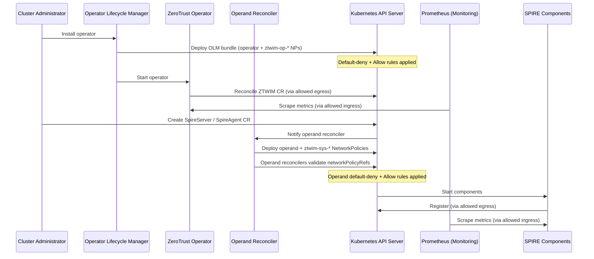

# Network Policy for Zero Trust Workload Identity Management

## Summary

This enhancement defines the NetworkPolicy requirements for the
ZeroTrustWorkloadIdentityManager operator and its operands (SPIRE Server,
SPIRE Agent, SPIFFE CSI Driver, and OIDC Discovery Provider). The network
policies implement a zero-trust security model by deploying default-deny
baseline policies and explicit allow rules for required communication
patterns, ensuring that all components follow the principle of least
privilege for network access.

### Supported Platforms

| OpenShift version | CNI | Topology | Notes |
|-------------------|-----|----------|-------|
| 4.16+ | OVN-Kubernetes | Standalone, SNO, Hosted Control Planes | Primary target; full support |
| 4.16+ | OpenShift SDN | Standalone, SNO | Supported; probe exemption applies |
| 4.16+ | OVN-Kubernetes | MicroShift | Supported when CNI enforces NetworkPolicy |
| 4.16+ | OVN-Kubernetes | OKE | Supported; metrics ingress optional |

Network policies require a CNI that enforces `networking.k8s.io/v1`
NetworkPolicy. Clusters using other CNIs are out of scope.

## Motivation

The ZeroTrustWorkloadIdentityManager operator deploys operands that manage
sensitive cryptographic operations, issuance of identities to workloads,
and identity attestation services. Following zero-trust security
principles, all network traffic should be denied by default, with only
explicitly required communication patterns allowed. Allowing only
explicitly required communication reduces the attack surface and limits
potential security incidents.

Without network policies, any pod within the OpenShift cluster can
communicate freely with other pods, regardless of their intended level of
access. Attackers or compromised pods can exploit this lack of restriction
to move laterally within the cluster and potentially compromise critical
components. In the absence of network policies, pods may have unrestricted
communication with external networks, which can result in unintended data
leakage, where sensitive information is transmitted to unauthorized
destinations.

### User Stories

* As a cluster administrator, I want NetworkPolicy resources automatically
  deployed with the ZeroTrustWorkloadIdentityManager operator, so that
  SPIRE components are allowed only required communication.

* As a cluster administrator, I want to attach or update custom
  NetworkPolicy resources on the SpireServer CR when enabling capabilities
  (Vault upstream authority, external database, cluster proxy, or remote
  federation endpoints), so that environment-specific egress is validated
  and reported without the operator hardcoding endpoint ports.

* As a cluster administrator, I want to reference custom ingress
  NetworkPolicies on the SpireOIDCDiscoveryProvider CR when using a
  self-managed Route (`managedRoute: false`), so that non-standard ingress
  paths are validated without the operator hardcoding router namespaces.

* As a security engineer, I want default-deny network policies enforced
  for all workload identity components, so that only explicitly permitted
  traffic flows are allowed and the attack surface is minimized.

* As a platform operator, I want Prometheus to scrape metrics from SPIRE
  components, so that I can monitor the health and performance of the
  workload identity system and detect anomalies.

* As a site reliability engineer, I want to understand how network
  policies are deployed and maintained at scale across multiple clusters,
  so that I can troubleshoot connectivity issues and ensure consistent
  security posture.

### Goals

* Automatically deploy NetworkPolicy resources for the operator during
  operator installation via the OLM bundle with no user configuration
  required.

* Automatically deploy NetworkPolicy resources for operands during operand
  CR reconciliation.

* Implement default-deny baseline policies for all operator and operand
  components (excluding SPIFFE CSI Driver, which uses Unix sockets only).

* Enable required communication patterns through explicit allow rules:
  * Operator and operand communication with Kubernetes API server
  * SPIRE Agent to SPIRE Server communication (port 8081/TCP)
  * SPIRE Agent to Kubelet for workload attestation (port 10250/TCP)
  * Prometheus metrics collection from openshift-monitoring namespace
    (ports 9402/TCP, 8082/TCP, 8443/TCP)
  * Webhook ingress for SPIRE controller manager (port 9443/TCP)
  * SPIRE Server federation via OpenShift Router (if enabled)
  * DNS resolution for service discovery (port 5353/TCP+UDP)
  * User-referenced egress for Vault, external databases, proxy, and
    remote federation endpoints via `networkPolicyRefs` on the SpireServer
    CR
  * User-referenced ingress for custom OIDC Routes via
    `networkPolicyRefs` on the SpireOIDCDiscoveryProvider CR

* Ensure network policies do not interfere with normal operation of the
  workload identity management system.

* Support user-configurable network policies to handle environment-specific
  egress and ingress requirements (Vault, external database, proxy, remote
  federation, custom Routes).

### Non-Goals

* AdminNetworkPolicy or cluster-wide policy management. Standard
  NetworkPolicy objects are sufficient for this scope. Clusters using
  [AdminNetworkPolicy](https://docs.redhat.com/en/documentation/openshift_container_platform/4.21/html/network_security/admin-network-policy)
  must ensure cluster-wide policies do not conflict with operand traffic.

* Define network policies for workloads consuming SPIRE-issued identities.
  This enhancement only covers the SPIRE infrastructure components
  themselves.

* Replace or duplicate existing security mechanisms such as RBAC, pod
  security standards, or network segmentation at the infrastructure level.

## Proposal

This proposal introduces a comprehensive set of NetworkPolicy resources
that are automatically deployed as part of the
ZeroTrustWorkloadIdentityManager operator and operand installation
process. The policies follow a defense-in-depth approach with default-deny
baselines and minimal explicit allow rules.

**Policy ownership model:**

| Policy type | Prefix | Applied by | Reconciled by |
|-------------|--------|------------|---------------|
| Operator policies | `ztwim-op-*` | OLM bundle at install | Not continuously (OLM) |
| Operand baseline policies | `ztwim-sys-*` | Operand reconciler | Operand reconciler |
| User-referenced policies | User-defined | User | User (validated by reconciler) |

The operator's network policies are embedded in the **OLM bundle** and
applied by OLM during operator installation. The operand's network
policies (for SPIRE Server, SPIRE Agent, and OIDC Discovery Provider) are
created and reconciled by **operand-specific controllers** during operand
CR reconciliation. The SPIFFE CSI Driver does not require NetworkPolicy
resources as it communicates exclusively via Unix domain sockets.

The operator controller does **not** reconcile or overwrite its own
NetworkPolicies. Operand reconcilers **do** reconcile `ztwim-sys-*`
policies and revert external modifications to them.

All policies use pod selectors to target specific components and enforce
ingress/egress rules based on the minimum required communication patterns
for each component to function correctly.

### Pod Label Contract

All operand pod templates and NetworkPolicy selectors use consistent
labels:

| Component | Label |
|-----------|-------|
| SPIRE Server (StatefulSet pod) | `app.kubernetes.io/name: spire-server` |
| SPIRE Agent | `app.kubernetes.io/name: spire-agent` |
| OIDC Discovery Provider | `app.kubernetes.io/name: spiffe-oidc-discovery-provider` |
| ZTWIM Operator | `app.kubernetes.io/name: zero-trust-workload-identity-manager` |

The SPIRE controller-manager runs as a **sidecar container** in the same
pod as spire-server. NetworkPolicy is pod-scoped, so all ingress and
egress rules for both containers target `app.kubernetes.io/name:
spire-server`. A separate controller-manager label is not used for
NetworkPolicy selectors.

NetworkPolicy `podSelector` values must match these labels. Unit and
integration tests verify label consistency between pod templates and
policy selectors.

### Workflow Description

**cluster administrator** is a human user responsible for installing and
managing the ZeroTrustWorkloadIdentityManager operator.

**operator** is the ZeroTrustWorkloadIdentityManager operator controller.

**monitoring system** is the OpenShift monitoring stack (Prometheus).

#### Operator Network Policy Deployment

1. The cluster administrator installs the ZeroTrustWorkloadIdentityManager
   operator.

2. OLM deploys the operator bundle, which includes NetworkPolicy resources
   (`ztwim-op-*`) applied to the operator namespace automatically.

3. The default-deny NetworkPolicy is applied, blocking all ingress and
   egress traffic for the operator pods.

4. Explicit allow NetworkPolicy resources are applied to permit:
   * Egress to the Kubernetes API server on port 6443/TCP
   * Ingress from the openshift-monitoring namespace on port 8443/TCP for
     metrics scraping

5. The operator starts and begins reconciliation with the restricted
   network access. The operator controller does not reconcile its own
   NetworkPolicies.

#### Operand Network Policy Deployment

1. The cluster administrator creates operand custom resources
   (`SpireServer`, `SpireAgent`, `SpiffeCSIDriver`,
   `SpireOIDCDiscoveryProvider`).

2. The corresponding operand reconciler deploys the operand components and
   creates `ztwim-sys-*` NetworkPolicy resources.

3. During operand CR reconciliation, each reconciler:
   * Applies default-deny and allow policies for the component
   * Creates conditional policies when capabilities are enabled (e.g.,
     federation on SpireServer)
   * Updates status conditions on the operand CR and ZTWIM CR

   The SpireServer reconciler validates `networkPolicyRefs` for
   capability-specific egress (Vault, database, proxy, remote
   federation). The SpireOIDCDiscoveryProvider reconciler validates
   `networkPolicyRefs` for custom Route ingress when
   `managedRoute: false`. SpireAgent has no `networkPolicyRefs`; baseline
   `ztwim-sys-*` policies cover its traffic.

4. Policy rollout follows a safe ordering: allow rules are applied before
   or overlapping with default-deny replacements. The reconciler retries
   on transient failures and waits for policy propagation before removing
   superseded rules.

5. Operand components start with network policies in effect.

6. The monitoring system scrapes metrics through the allowed ingress rules.

**SPIRE Server** (StatefulSet with spire-server and spire-controller-manager
sidecar containers; `app.kubernetes.io/name: spire-server`):
* Allow ingress from SPIRE Agents on port 8081/TCP (gRPC)
* Allow ingress for metrics on port 9402/TCP (spire-server) and 8082/TCP
  (controller-manager) from openshift-monitoring namespace
* Allow ingress for webhook on port 9443/TCP (controller-manager). On
  Hosted Control Planes, the API server has no in-cluster identity; the
  rule is left open on port 9443/TCP with documented compensating controls
  (TLS and webhook authentication)
* Allow ingress on port 8443/TCP from OpenShift Router for federation
  (conditional; uses `policy-group.network.openshift.io/ingress` namespace
  label with empty `podSelector`; add
  `policy-group.network.openshift.io/host-network` when the Ingress
  Controller uses hostNetwork)
* Allow egress to Kubernetes API server on port 6443/TCP (port-only rule,
  no `ipBlock`)
* Allow egress to DNS on port 5353/TCP+UDP to openshift-dns namespace
* Allow egress to remote federation endpoints on port 443/TCP (conditional,
  port-only rule, when federation is enabled)

**SPIRE Agent** (DaemonSet, `app.kubernetes.io/name: spire-agent`):
* Allow egress to SPIRE Server on port 8081/TCP (pod/namespace selectors)
* Allow egress to Kubernetes API server on port 6443/TCP (port-only rule)
* Allow egress to Kubelet on port 10250/TCP for workload attestation
  (port-only rule; the k8s workload attestor calls
  `https://<node>:10250/pods` to get pod metadata)
* Allow ingress for metrics on port 9402/TCP from openshift-monitoring
  namespace
* Allow egress to DNS on port 5353/TCP+UDP to openshift-dns namespace

**SPIFFE CSI Driver** (DaemonSet):
* No NetworkPolicy required. Communicates with SPIRE Agent via Unix
  domain sockets on the same node. Excluded from NetworkPolicy scope.

**OIDC Discovery Provider** (Deployment,
`app.kubernetes.io/name: spiffe-oidc-discovery-provider`):
* Allow ingress on port 8443/TCP from OpenShift Router (uses
  `policy-group.network.openshift.io/ingress` namespace label). No egress
  rules required; data source is SPIRE Agent via Unix domain socket.

**Note on health probes**: On OVN-Kubernetes and OpenShift SDN, kubelet
httpGet health probes bypass NetworkPolicy because kubelet runs on the
host network. No ingress rules are needed for probe ports (8080, 8083,
9982, 8008, 9809). Other CNIs may require explicit probe ingress rules;
such CNIs are out of scope unless probe-success tests are added.

**Baseline policy rule patterns**:

| Traffic | Baseline rule style |
|---------|---------------------|
| Kubernetes API (6443) | Port-only egress (no `to:` / no `ipBlock`) |
| Kubelet (10250) | Port-only egress (no `to:` / no `ipBlock`) |
| DNS (5353) | `namespaceSelector` + `podSelector` to openshift-dns |
| Metrics | `namespaceSelector` to openshift-monitoring |
| Standard federation / Route ingress | `ztwim-sys-*` baseline (`namespaceSelector` to openshift-ingress) |
| Custom Route ingress / remote federation egress | **User-created** NetworkPolicy via `networkPolicyRefs` on SpireOIDCDiscoveryProvider (ingress) or SpireServer (egress); user may use `ipBlock`, ports, and `to:` as needed |
| Vault, DB, proxy | **User-created** NetworkPolicy via `networkPolicyRefs` on SpireServer |



### API Extensions

This enhancement adds a `networkPolicyRefs` field (`[]string`) to the
**SpireServer** and **SpireOIDCDiscoveryProvider** CRs. Operand reconcilers
deploy all baseline `ztwim-sys-*` NetworkPolicies automatically. Users
create standard Kubernetes NetworkPolicy resources for environment-specific
traffic and reference them on the operand CR that owns the capability. Each
reconciler validates that referenced policies **exist** in the operand
namespace and reports status. It does not inspect NP rule content.

**Placement by operand:**

| Capability | CR | Example |
|------------|-----|---------|
| Vault, external database, cluster proxy | SpireServer | Egress to `ipBlock` CIDRs |
| Remote federation endpoints (restrictive egress) | SpireServer | Egress to `bundleEndpointUrl` hosts |
| Custom OIDC Route ingress (`managedRoute: false`) | SpireOIDCDiscoveryProvider | Ingress from custom IC namespace or `ipBlock` |
| SpireAgent traffic | — (no `networkPolicyRefs`) | Baseline `ztwim-sys-*` only |

```go
type SpireServerSpec struct {
    // existing fields...

    // NetworkPolicyRefs references user-created NetworkPolicy resources
    // in the operand namespace for capability-specific egress (Vault, DB,
    // proxy, remote federation). The SpireServer reconciler validates
    // existence and reports status. It does not create, modify, or delete
    // referenced policies.
    // +kubebuilder:validation:Optional
    // +kubebuilder:validation:MaxItems=10
    // +listType=set
    NetworkPolicyRefs []string `json:"networkPolicyRefs,omitempty"`
}

type SpireOIDCDiscoveryProviderSpec struct {
    // existing fields (including managedRoute)...

    // NetworkPolicyRefs references user-created NetworkPolicy resources
    // in the operand namespace for custom Route ingress when managedRoute
    // is false. The SpireOIDCDiscoveryProvider reconciler validates
    // existence and reports status.
    // +kubebuilder:validation:Optional
    // +kubebuilder:validation:MaxItems=10
    // +listType=set
    NetworkPolicyRefs []string `json:"networkPolicyRefs,omitempty"`
}
```

**How it works:**

1. The SpireServer reconciler deploys all baseline `ztwim-sys-*`
   NetworkPolicies during operand CR reconciliation. No user input
   required.

2. If the user needs additional egress (e.g., to Vault or an external
   database), they create a standard Kubernetes NetworkPolicy in the
   operand namespace:

```yaml
apiVersion: networking.k8s.io/v1
kind: NetworkPolicy
metadata:
  name: allow-vault-egress
  namespace: zero-trust-workload-identity-manager
spec:
  podSelector:
    matchLabels:
      app.kubernetes.io/name: spire-server
  policyTypes:
  - Egress
  egress:
  - to:
    - ipBlock:
        cidr: 10.0.0.0/24
    ports:
    - port: 8200
      protocol: TCP
```

3. The user references the policy on the SpireServer CR:

```yaml
apiVersion: operator.openshift.io/v1alpha1
kind: SpireServer
metadata:
  name: cluster
spec:
  # existing fields...
  networkPolicyRefs:
  - allow-vault-egress
  - allow-db-egress
```

4. During SpireServer CR reconciliation, the reconciler checks that each
   referenced NetworkPolicy **object exists** in the operand namespace. It
   does **not** validate ports, CIDRs, or whether the policy matches an
   enabled capability — the cluster administrator is responsible for
   correct NP content. If a referenced policy is missing, the reconciler
   sets `NetworkPolicyAvailable=False` on the SpireServer CR and the ZTWIM
   operator reports **Degraded**. If a capability is enabled (e.g., Vault)
   but no reference is listed, the reconciler sets a **warning** condition
   recommending the user create and reference a policy.

**Design rationale:**

* **Operand-level delegation.** The ZTWIM controller is not aware of
  operand-specific configuration (Vault, federation, database type,
  managed Route). Each operand reconciler validates **existence** of its
  own `networkPolicyRefs` and warns when a capability is enabled without a
  reference.

* **No embedded Kubernetes structs in the CRD.** The API is a simple
  `[]string` of names, avoiding coupling to upstream
  `NetworkPolicyEgressRule` struct changes.

* **Users already know NetworkPolicy syntax.** Creating a standard
  Kubernetes NetworkPolicy is well-documented and familiar to cluster
  administrators.

* **Clear ownership.** Operand reconcilers own `ztwim-sys-*` policies.
  Users own referenced policies. OLM owns `ztwim-op-*` policies.

* **Flexible ports for non-operator endpoints.** The operator does not
  hardcode Vault, database, or proxy ports. Users specify ports and CIDRs
  in their NetworkPolicy. DNS port 5353 is an install-time constant for
  `dns-default` and is safe to include in baseline policies.

* **NetworkPolicies are additive.** User-created policies add egress rules
  on top of the operator's baseline deny-all, without conflicting.

* **Existence-only validation (v1).** The reconciler does not parse or validate NP
  rule semantics. Users supply correct `ipBlock`, ports, and selectors in
  their NetworkPolicy; the operator only confirms the referenced object
  exists.

**Naming conventions:**

* `ztwim-op-*` -- operator policies in the OLM bundle. Applied by OLM at
  install. Not reconciled by the operator controller.
* `ztwim-sys-*` -- operand baseline policies. Created and reconciled by
  operand controllers. Reverted if modified externally.
* User-created policies -- any name. Referenced via `networkPolicyRefs` on
  the SpireServer CR (egress) or SpireOIDCDiscoveryProvider CR (custom
  Route ingress). Validated for existence only.

**Removing a reference:** When a user removes an entry from
`networkPolicyRefs`, the reconciler stops validating that policy. The
NetworkPolicy resource itself is not deleted -- the user owns its lifecycle.

### Status and Conditions

| Resource | Condition | True | False |
|----------|-----------|------|-------|
| ZTWIM CR | `NetworkPoliciesApplied` | All operand baseline policies reconciled | Operand policy apply failed |
| SpireServer CR | `NetworkPolicyAvailable` | All `networkPolicyRefs` exist | Missing referenced policy |
| SpireServer CR | `NetworkPoliciesReconciled` | `ztwim-sys-*` applied successfully | Create/update failed |
| SpireAgent CR | `NetworkPoliciesReconciled` | `ztwim-sys-*` applied successfully | Create/update failed |
| SpireOIDCDiscoveryProvider CR | `NetworkPolicyAvailable` | All `networkPolicyRefs` exist | Missing referenced policy |
| SpireOIDCDiscoveryProvider CR | `NetworkPoliciesReconciled` | `ztwim-sys-*` applied successfully | Create/update failed |

When `NetworkPolicyAvailable=False`, `NetworkPoliciesReconciled=False`, or
baseline policy creation fails, the ZTWIM operator reports **Degraded**.
Operand CR conditions provide the detailed failure message.

### Topology Considerations

#### Hypershift / Hosted Control Planes

In Hosted Control Planes deployments, the API server runs outside the
managed cluster. The webhook ingress policy on port 9443/TCP cannot use a
`from` namespace selector because the API server has no in-cluster pod
identity. The rule is left open on that port with documented compensating
controls. Negative tests verify unrelated pods cannot reach the webhook.

The operator and operands run in the managed cluster. All other network
policies function identically to standalone clusters.

#### Standalone Clusters

This enhancement is fully applicable to standalone OpenShift clusters.
Network policies are deployed in the operator namespace and operand
namespace. OVN-Kubernetes or OpenShift SDN enforces the policies.

#### Single-node Deployments or MicroShift

On single-node OpenShift (SNO) deployments, network policies have minimal
resource impact. Policies function identically to standard clusters.

For MicroShift, network policies are supported when the CNI plugin
implements NetworkPolicy enforcement.

#### OpenShift Kubernetes Engine

Network policies are part of standard Kubernetes functionality and are
supported in OKE. Metrics ingress from openshift-monitoring is optional
in OKE environments without OpenShift monitoring.

### Implementation Details/Notes/Constraints

The implementation creates NetworkPolicy manifests for each component and
applies them during the appropriate lifecycle phase (OLM install for
operator policies; operand CR reconciliation for operand policies).

### Operator Network Policies

The OLM bundle includes two NetworkPolicy resources (`ztwim-op-*`):

1. **Default-deny policy**: Denies all ingress and egress for operator pods.

2. **Operator allow policy**: Permits API server egress (6443/TCP) and
   metrics ingress from openshift-monitoring (8443/TCP).

The operator controller does not reconcile these policies. OLM applies
them once at install. If manually deleted, they are not automatically
recreated unless the operator is reinstalled or the bundle is reapplied.

### Operand Network Policies

Operand reconcilers (SpireServer, SpireAgent, SpireOIDCDiscoveryProvider)
create and reconcile `ztwim-sys-*` NetworkPolicy resources:

1. Generate manifests based on operand type and enabled capabilities.

2. Apply policies to the operand namespace.

3. Update or delete policies when operand configuration changes.

4. Set status conditions and propagate Degraded to ZTWIM on failure.

The SpireServer reconciler validates `networkPolicyRefs` during each
reconciliation. The SpireOIDCDiscoveryProvider reconciler validates
`networkPolicyRefs` when `managedRoute: false`. SpireAgent has no
`networkPolicyRefs`.

Operand reconcilers garbage-collect `ztwim-sys-*` NetworkPolicies whose
names are not in the embedded manifest set on every reconcile.

### RBAC Requirements

Operand reconcilers require namespace-scoped RBAC:

```yaml
- apiGroups: ["networking.k8s.io"]
  resources: ["networkpolicies"]
  verbs: ["create", "update", "patch", "delete", "get", "list", "watch"]
```

The ZTWIM controller requires `get`, `list`, `watch` on NetworkPolicies
in the operand namespace for reference validation. No new cluster-scoped
RBAC is required.

### Baseline Network Policy Generation

Baseline `ztwim-op-*` policies are **static bindata manifests** in the OLM
bundle. `ztwim-sys-*` policies are applied from embedded templates by
operand reconcilers. Neither set discovers or hardcodes cluster CIDRs at
runtime.

* **API server and kubelet egress**: port-only rules (egress on 6443/TCP
  or 10250/TCP with no `to:` clause).
* **DNS, metrics, federation**: namespace and pod selectors.
* **Conditional policies** (e.g., federation): created or removed based on
  SpireServer CR fields; still use selectors or port-only rules, not
  runtime CIDR discovery.

### DNS Resolution

Egress policies for DNS allow UDP and TCP on port 5353 to CoreDNS pods in
the openshift-dns namespace. On OpenShift, `dns-default` exposes port 53
as the service port, but CoreDNS pods listen on port 5353. NetworkPolicy
evaluates real pod ports, so the egress rule uses port 5353.

### Federation Support

#### Operator-managed (standard)

When `spireServer.spec.federation` is configured, the SpireServer
reconciler creates conditional `ztwim-sys-federation-*` policies:

* **Federation ingress**: port 8443/TCP from OpenShift Router (ingress
  namespace selector)
* **Federation egress**: port 443/TCP (port-only rule, no `ipBlock`)

Policies are removed when federation is disabled (including garbage
collection of `ztwim-sys-federation-*` names).

The baseline port-only egress on 443/TCP is intentionally broad for
standard Route-based federation. Users who need least-privilege egress to
specific remote hosts must add a user NetworkPolicy.

#### User-supplemented (remote endpoints)

For restrictive egress to remote federation endpoints (`bundleEndpointUrl`
hosts outside the cluster):

1. User creates a NetworkPolicy with `ipBlock` CIDRs and port 443 (or
   custom port) targeting `spire-server` pods.
2. User references the policy in `networkPolicyRefs` on the SpireServer CR.
3. Reconciler confirms the referenced object exists and sets
   `NetworkPolicyAvailable`.

If federation is enabled but `networkPolicyRefs` is empty, the reconciler
sets a **warning** recommending a reference when restrictive egress is
needed. The operator does not verify the policy matches federation hosts.

### Custom Routes

Route creation is defined in
[oidc-routes-integration.md](oidc-routes-integration.md). NetworkPolicy
handling follows the same baseline + refs model:

#### Operator-managed Route (`managedRoute: true`)

The OIDC reconciler creates the Route and baseline `ztwim-sys-*` ingress
from the `openshift-ingress` namespace on port 8443/TCP. No user
`networkPolicyRefs` required.

#### Self-managed Route (`managedRoute: false`)

When the cluster administrator creates a custom Route (non-standard
ingress controller namespace, `hostNetwork` Ingress Controller, or external
load balancer not via `openshift-ingress`):

1. User creates a NetworkPolicy with ingress rules targeting
   `app.kubernetes.io/name: spiffe-oidc-discovery-provider` pods.
2. User references the policy in `networkPolicyRefs` on the
   SpireOIDCDiscoveryProvider CR.
3. Reconciler confirms the referenced object exists and sets
   `NetworkPolicyAvailable`.

If `managedRoute: false` and a custom Route exists but `networkPolicyRefs`
is empty, the reconciler sets a **warning** recommending an ingress
NetworkPolicy reference.

The operator does not create, validate, or delete Route objects — only
validates that referenced NetworkPolicy objects exist.

### User-Configured Egress and Ingress (Vault, Database, Proxy)

The operator does **not** auto-generate egress rules for Vault, external
databases, or cluster proxy endpoints. Instead:

1. User enables the capability in the SpireServer CR (e.g.,
   `upstreamAuthority.vault`, non-sqlite3 `databaseType`).
2. User creates a NetworkPolicy with the correct `ipBlock` CIDRs and ports.
3. User references the policy in `networkPolicyRefs` on the SpireServer CR.
4. Reconciler confirms the referenced NetworkPolicy object exists and sets
   `NetworkPolicyAvailable`. Rule correctness (ports, `ipBlock`, CIDRs) is
   the user's responsibility.

If a capability is enabled but no reference exists, the reconciler sets a
warning condition recommending the user create and reference a policy.
AdminNetworkPolicy at cluster scope may satisfy egress independently; the
operator does not inspect ANP rules.

### Constraints

* Network policy enforcement requires a CNI that supports NetworkPolicy
  (OVN-Kubernetes or OpenShift SDN on OpenShift 4.16+).
* Operator NetworkPolicies (`ztwim-op-*`) are deployed once by OLM and are
  not continuously reconciled. Manual deletion is not auto-healed.
* Operand NetworkPolicies (`ztwim-sys-*`) are continuously reconciled by
  operand controllers and are recreated if deleted.
* Baseline policies do not use `ipBlock` or runtime CIDR discovery. Port-only
  egress and namespace/pod selectors are used instead.
* User-created NetworkPolicies referenced via `networkPolicyRefs` may use
  `ipBlock`, ports, and `to:` clauses as needed for external endpoints.
  The operator validates existence only, not rule content.
* Clusters with non-standard networking may require user `networkPolicyRefs`
  or AdminNetworkPolicy adjustments.

### Risks and Mitigations

**Risk**: Misconfigured user-referenced NetworkPolicy resources could
block legitimate traffic for Vault, database, or proxy connectivity.

**Mitigation**:
* Operator-generated `ztwim-sys-*` policies work out-of-the-box on
  OVN-Kubernetes and OpenShift SDN
* `NetworkPolicyAvailable` condition surfaces missing references before
  silent failure; user is responsible for correct NP content
* Comprehensive E2E tests for all required communication patterns
* Support procedures document ANP as an external dependency

**Risk**: AdminNetworkPolicy at cluster scope may block traffic even when
namespace NetworkPolicies allow it.

**Mitigation**:
* Document ANP interaction in Non-Goals and support procedures
* Test scenarios include clusters with ANP defined

**Risk**: Different CNI plugins may enforce NetworkPolicy rules
differently.

**Mitigation**:
* Test on OVN-Kubernetes and OpenShift SDN (supported matrix)
* Use standard NetworkPolicy features only

**Risk**: Overly permissive user NetworkPolicy combined with baseline
deny-all may still allow unintended egress (NetworkPolicies are additive).

**Mitigation**:
* Warn when a capability is enabled but no `networkPolicyRefs` entry exists
* Document that users are responsible for correct NP rules (including `ipBlock`)
* Document that cluster administrators are responsible for reviewing
  user-referenced NetworkPolicy rules as part of their security practices
  (not an operator-automated function)

**Risk**: Upgrading existing deployments to default-deny may break
production connectivity.

**Mitigation**:
* Apply allow rules before or overlapping with deny replacements
* Conditional policies only created when operand spec enables capability
* Document upgrade path for clusters with custom networking

### Drawbacks

Deploying NetworkPolicy resources adds complexity to operator installation
and operand provisioning. Network policies may make debugging connectivity
issues more difficult. Clear documentation, status conditions, and logging
mitigate this concern.

## Alternatives (Not Implemented)

### Alternative 1: Inline Egress Rules in the CRD

Embed `NetworkPolicyEgressRule` directly in operand CRs.

**Reason not selected**: Ties the API to upstream Kubernetes networking
structs. Requires users to learn a new CR format.

**Cons**: API coupling and version drift; harder to reuse existing
NetworkPolicy tooling and GitOps workflows.

### Alternative 2: Operator Parses Ports from Existing Fields

Auto-detect egress ports from `vaultAddr`, `connectionString`, proxy env.

**Reason not selected**: Connection string formats are varied and fragile.
Ports may be omitted, relying on protocol defaults.

**Cons**: Unreliable parsing; operator must handle every DSN format;
users cannot override CIDRs or ports.

### Alternative 3: No User-Configurable Egress

Only deploy static baseline policies. Users create NPs without operator
involvement.

**Reason not selected**: No visibility into whether required egress
policies exist. No status reporting.

**Cons**: Silent failures when Vault/DB/proxy egress is missing; no
Degraded signal.

### Alternative 4: networkPolicyRefs on ZTWIM CR

Place `networkPolicyRefs` on the cluster-wide ZeroTrustWorkloadIdentityManager
CR instead of operand CRs.

**Reason not selected**: ZTWIM controller lacks awareness of operand-specific
capabilities (Vault, federation, database type). Operand reconcilers are
the correct place for reference validation; semantic NP validation is
out of scope (user responsibility).

**Cons**: ZTWIM controller would need to watch and interpret all operand
CRs; validation logic scattered across controllers.

## Test Plan

### Unit Tests

* Validate NetworkPolicy manifest generation for each component type
* Verify pod label selectors match pod templates
* Verify `policyTypes` (Ingress, Egress, or both) per policy template
* Verify user-referenced policy examples use `policyTypes: [Egress]` only
* Test `networkPolicyRefs` validation logic (exists, missing, namespace)
* Test condition transitions (`NetworkPolicyAvailable`, `NetworkPoliciesReconciled`)

### Integration Tests

* OLM bundle install applies `ztwim-op-*` operator NetworkPolicies
* SpireServer reconcile creates `ztwim-sys-*` operand NetworkPolicies
* Policies updated when operand configuration changes (e.g., federation
  enabled/disabled)
* Policies deleted when operands are removed
* `networkPolicyRefs` validation during SpireServer and
  SpireOIDCDiscoveryProvider CR reconciliation
* Degraded state when referenced policy is missing
* Supported downgrade garbage-collects orphan `ztwim-sys-*` policies
* Operand `ztwim-sys-*` policies recreated after manual deletion
* Operator `ztwim-op-*` policies **not** recreated after manual deletion

### E2E Tests

* SPIRE Server communicates with Kubernetes API server
* SPIRE Agents connect to SPIRE Server on port 8081
* Prometheus scrapes metrics from operator and operands
* Unauthorized pod-to-pod traffic is blocked
* Federation communication between SPIRE Servers (when enabled)
* DNS resolution for all components
* Kubelet attestation egress on port 10250
* User-referenced Vault/DB egress via `networkPolicyRefs` on SpireServer
* Custom OIDC Route ingress via `networkPolicyRefs` on
  SpireOIDCDiscoveryProvider
* Remote federation egress via `networkPolicyRefs` on SpireServer

### Compatibility Tests

* OVN-Kubernetes on standalone, SNO, Hosted Control Planes
* OpenShift SDN on standalone
* MicroShift with NetworkPolicy-capable CNI

### Negative Tests

* Traffic not explicitly allowed is blocked
* Missing `networkPolicyRefs` when capability enabled surfaces warning
* AdminNetworkPolicy blocking operand traffic (documented behavior)
* Webhook unreachable from unrelated pods on Hosted Control Planes
* Connectivity failure error messages in operand CR conditions

All E2E tests include labels per OpenShift test conventions:
`[Jira:"ZTWIM"]`, `[Suite:openshift/conformance/parallel]`.
Reference: https://github.com/openshift/enhancements/blob/master/dev-guide/test-conventions.md

Since network policies are not feature-gated, tests do not require
`[OCPFeatureGate:...]` labels.

## Graduation Criteria

Network policies are an integral part of the ZTWIM operator deployment
and align with the operator's maturity level:

### Dev Preview -> Tech Preview

Not applicable. Delivered directly as GA.

### Tech Preview -> GA

Not applicable. Network policies use stable `networking.k8s.io/v1` APIs
and are enabled by default with no option to disable.

### Removing a deprecated feature

Not applicable.

## Upgrade / Downgrade Strategy

### Upgrade Strategy

When upgrading the ZeroTrustWorkloadIdentityManager operator:

1. OLM applies updated `ztwim-op-*` policies from the new bundle version.

2. Operand reconcilers apply updated `ztwim-sys-*` templates on next
   reconcile.

3. **Upgrade safety for existing deployments:**
   * Allow rules are applied before or overlapping with default-deny
     replacements to avoid connectivity gaps
   * Conditional baseline policies (e.g., federation) are only created when
     the corresponding SpireServer spec field is set; Vault/DB/proxy use
     user `networkPolicyRefs`
   * Clusters with custom networking should configure `networkPolicyRefs`
     before upgrade if baseline policies are insufficient

4. Upgrade is non-disruptive: policies update without breaking existing
   connections.

### Downgrade Strategy

Policy ownership is identified by **resource name prefix**, not by comparing
rule content:

| Prefix | Owner | On supported downgrade | On unsupported downgrade |
|--------|-------|------------------------|--------------------------|
| `ztwim-op-*` | OLM bundle | OLM applies older bundle manifests to same object names | Left in place; not in older bundle |
| `ztwim-sys-*` | Operand reconciler | Reconciler updates known names; GCs names not in older manifest | Left in place; older reconciler has no NP logic |
| Other names | User | Never deleted by operator | Never deleted by operator |

Two downgrade classes apply:

#### Supported downgrade (both versions have NetworkPolicy support)

Example: 1.3.0 → 1.2.0. No user action required.

1. **Operator policies (`ztwim-op-*`)**: OLM applies the older bundle.
   Policies with the same Kubernetes object name are updated in place to
   the older spec.

2. **Operand policies (`ztwim-sys-*`)**: On the next operand reconcile,
   the downgraded reconciler:
   * Applies its embedded `ztwim-sys-*` manifest (create/update known names)
   * Lists all `ztwim-sys-*` NetworkPolicies in the operand namespace
   * **Deletes** any name not in the older manifest (garbage collection)

   Example: if 1.3.0 added `ztwim-sys-federation-egress` and 1.2.0 does
   not include it, the 1.2.0 reconciler removes that policy on reconcile.

3. **User-referenced policies**: Unaffected. The operator never deletes
   user-created NetworkPolicies.

#### Unsupported downgrade (to a version without NetworkPolicy support)

Example: 1.2.0 (has NPs) → 1.1.0 (no OLM bundle NPs, no reconciler NP
logic). **Not supported.** No automatic cleanup occurs.

* `ztwim-op-*` and `ztwim-sys-*` policies **remain** in the cluster and
  continue to be enforced by the CNI
* The 1.1.0 operator does not create, update, or delete NetworkPolicies
* User-created NetworkPolicies are unaffected

If an administrator accepts the risk and wants to remove stale policies
after an unsupported downgrade, manual cleanup is required:

```bash
# Operator namespace
oc delete networkpolicy -n <operator-ns> -l <ztwim-operator-label>

# Operand namespace — delete operator-managed baseline policies only
oc get networkpolicy -n <operand-ns> -o name | grep ztwim-sys | xargs oc delete -n <operand-ns>
```

User-created NetworkPolicies (referenced via `networkPolicyRefs`) must be
deleted separately by the administrator if no longer needed.

### Testing

* NetworkPolicy resources updated correctly during upgrade
* Operand connectivity maintained during upgrade
* Supported downgrade GC removes orphan `ztwim-sys-*` names
* Unsupported downgrade leaves policies in place
* Micro and minor version upgrade paths tested

## Version Skew Strategy

NetworkPolicy resources take effect immediately on running pods.

1. **Operator Version Skew**: Old and new operator replicas share the
   same `ztwim-op-*` rules during rolling update.

2. **Operand Version Skew**: Pod selectors use stable labels
   (`app.kubernetes.io/name`) matching both old and new versions.

3. **API Server Communication**: Egress rules have no version constraints.

4. **SPIRE Agent to Server**: Communication allowed by port and selector,
   not version.

## Operational Aspects of API Extensions

This enhancement adds `networkPolicyRefs` (`[]string`) to the SpireServer
and SpireOIDCDiscoveryProvider CRs. No new CRDs, webhooks, or finalizers.

* **Failure modes**: Missing referenced policy sets
  `NetworkPolicyAvailable=False` on the operand CR and Degraded on ZTWIM.
  Baseline `ztwim-sys-*` policy creation failure sets
  `NetworkPoliciesReconciled=False`.

* **Existing workloads**: Adding or removing references does not restart
  pods. User-created policies take effect immediately at the CNI level.

* **Resource footprint**: ~2 `ztwim-op-*` operator policies plus ~12
  `ztwim-sys-*` operand policies. Maximum 10 `networkPolicyRefs` on each
  of SpireServer and SpireOIDCDiscoveryProvider CRs.

## Support Procedures

### Detecting Network Policy Issues

**Symptom**: Operator or operand pods fail to start or enter
CrashLoopBackOff with connection errors.

**Diagnosis**:
1. Check operand CR conditions (`NetworkPoliciesReconciled` on all
   operands; `NetworkPolicyAvailable` on SpireServer and
   SpireOIDCDiscoveryProvider) and ZTWIM Degraded status
2. Check pod logs for connection timeout or refused errors
3. Verify NetworkPolicy resources: `oc get networkpolicies -n <namespace>`
4. Distinguish operator-generated (`ztwim-sys-*`) vs user-referenced vs
   AdminNetworkPolicy conflicts
5. Verify CNI supports NetworkPolicy:
   `oc get network.config.openshift.io cluster -o yaml`

**Symptom**: Prometheus metrics not scraped.

**Diagnosis**:
1. Check Prometheus targets for scrape failures
2. Verify ingress from openshift-monitoring is allowed
3. Test connectivity from monitoring namespace to metrics port

**Symptom**: SPIRE Agents cannot connect to SPIRE Server.

**Diagnosis**:
1. Check agent logs for port 8081 errors
2. Verify server ingress and agent egress policies on port 8081
3. Use `oc debug` to test connectivity

**Symptom**: Vault/DB/proxy connectivity fails despite capability enabled.

**Diagnosis**:
1. Check `networkPolicyRefs` on SpireServer CR
2. Verify referenced NetworkPolicy exists with correct `ipBlock` and port
3. Check for AdminNetworkPolicy blocking egress at cluster scope

**Symptom**: OIDC discovery endpoint unreachable via custom Route.

**Diagnosis**:
1. Check `managedRoute` on SpireOIDCDiscoveryProvider CR
2. Check `networkPolicyRefs` on SpireOIDCDiscoveryProvider CR
3. Verify referenced ingress NetworkPolicy targets
   `spiffe-oidc-discovery-provider` pods with correct source selectors

### Disabling Network Policies

**To temporarily disable** for troubleshooting:

1. Delete specific NetworkPolicy resources:
   `oc delete networkpolicy <policy-name> -n <namespace>`

**Consequences**:
* No cluster-wide impact; only targeted pods lose restrictions
* Security risk increases while policies are disabled

**Graceful failure and recovery**:

* **Operator policies (`ztwim-op-*`)**: Not recreated automatically if
  deleted. Reinstall operator or reapply OLM bundle to restore.
* **Operand policies (`ztwim-sys-*`)**: Recreated by operand reconciler on
  next reconcile.
* **User-referenced policies**: User-owned; not recreated by operator.

**Note**: Disabling network policies should only be done temporarily.
Removing them violates the zero-trust security model.

## Infrastructure Needed

No additional infrastructure is required. This enhancement uses standard
Kubernetes NetworkPolicy resources.
