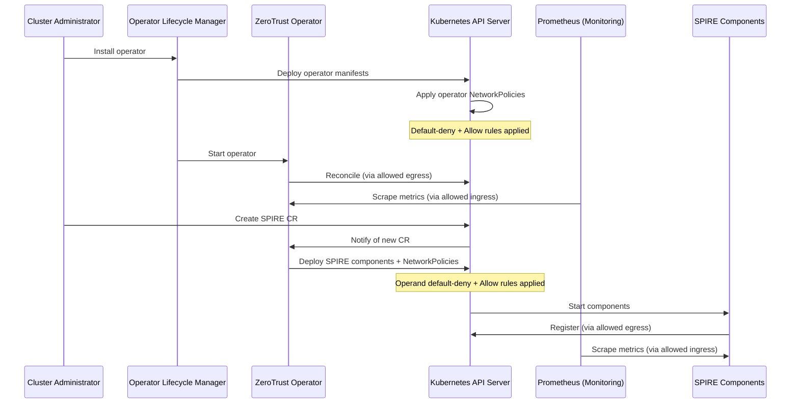

# Network Policy for Zero Trust Workload Identity Management

## Summary

This enhancement defines the NetworkPolicy requirements for the
ZeroTrustWorkloadIdentityManager operator and its operands (SPIRE Server,
SPIRE Agent, SPIFFE CSI Driver, and OIDC Discovery Provider). The network
policies implement a zero-trust security model by deploying default-deny
baseline policies and explicit allow rules for required communication
patterns, ensuring that all components follow the principle of least
privilege for network access.

## Motivation

The ZeroTrustWorkloadIdentityManager operator manages sensitive
cryptographic operations and identity attestation services. Following
zero-trust security principles, all network traffic should be denied by
default, with only explicitly required communication patterns allowed.
This reduces the attack surface and limits the blast radius of potential
security incidents.

Without properly configured NetworkPolicy resources, the operator and its
operands would be exposed to unnecessary network traffic, increasing the
risk of unauthorized access or lateral movement in case of a compromise.

### User Stories

* As a cluster administrator, I want NetworkPolicy resources automatically
  deployed with the ZeroTrustWorkloadIdentityManager operator, so that I
  can ensure SPIRE components follow zero-trust network security
  principles without manual configuration.

* As a security engineer, I want default-deny network policies enforced
  for all workload identity components, so that only explicitly permitted
  traffic flows are allowed and the attack surface is minimized.

* As a platform operator, I want Prometheus to scrape metrics from SPIRE
  components, so that I can monitor the health and performance of the
  workload identity system and detect anomalies.

* As a site reliability engineer, I want to understand how network
  policies are deployed and maintained at scale across multiple clusters,
  so that I can troubleshoot connectivity issues and ensure consistent
  security posture.

### Goals

* Automatically deploy NetworkPolicy resources for the operator during
  operator installation with no user configuration required.

* Automatically deploy NetworkPolicy resources for operands during operand
  installation.

* Implement default-deny baseline policies for all operator and operand
  components.

* Enable required communication patterns through explicit allow rules:
  * Operator and operand communication with Kubernetes API server
  * SPIRE Agent to SPIRE Server communication (port 8081/TCP)
  * SPIRE Agent to Kubelet for workload attestation (port 10250/TCP)
  * Prometheus metrics collection from openshift-monitoring namespace
    (ports 9402/TCP, 8082/TCP, 8443/TCP)
  * Webhook ingress for SPIRE controller manager (port 9443/TCP)
  * SPIRE Server federation via OpenShift Router (if enabled)
  * DNS resolution for service discovery (port 5353/TCP+UDP)
  * Conditional egress for Vault, external databases, and proxy endpoints

* Ensure network policies do not interfere with normal operation of the
  workload identity management system.

* Support user-configurable network policies to handle environment-specific
  egress requirements (Vault, external database, proxy endpoints).

### Non-Goals

* AdminNetworkPolicy or cluster-wide policy management. Standard
  NetworkPolicy objects are sufficient for this scope.

* Define network policies for workloads consuming SPIRE-issued identities.
  This enhancement only covers the SPIRE infrastructure components
  themselves.

* Replace or duplicate existing security mechanisms such as RBAC, pod
  security standards, or network segmentation at the infrastructure level.

## Proposal

This proposal introduces a comprehensive set of NetworkPolicy resources
that are automatically deployed as part of the
ZeroTrustWorkloadIdentityManager operator and operand installation
process. The policies follow a defense-in-depth approach with default-deny
baselines and minimal explicit allow rules.

The operator's network policies will be embedded in the operator
deployment manifests and applied during operator installation. The
operand's network policies (for SPIRE Server, SPIRE Agent, and OIDC
Discovery Provider) will be created during operand provisioning by
the operator. The SPIFFE CSI Driver does not require NetworkPolicy
resources as it communicates exclusively via Unix domain sockets.

All policies use pod selectors to target specific components and enforce
ingress/egress rules based on the minimum required communication patterns
for each component to function correctly.

### Workflow Description

**cluster administrator** is a human user responsible for installing and
managing the ZeroTrustWorkloadIdentityManager operator.

**operator** is the ZeroTrustWorkloadIdentityManager operator controller.

**monitoring system** is the OpenShift monitoring stack (Prometheus).

#### Operator Network Policy Deployment

1. The cluster administrator installs the ZeroTrustWorkloadIdentityManager
   operator using OLM or direct deployment.

2. The operator installation includes NetworkPolicy resources that are
   applied to the operator's namespace automatically.

3. The default-deny NetworkPolicy is applied first, blocking all ingress
   and egress traffic for the operator pods.

4. Explicit allow NetworkPolicy resources are applied to permit:
   * Egress to the Kubernetes API server on port 6443/TCP
   * Ingress from the openshift-monitoring namespace on port 8443/TCP for
     metrics scraping

5. The operator starts and begins reconciliation with the restricted
   network access.

#### Operand Network Policy Deployment

1. The cluster administrator creates a SPIRE server or agent custom
   resource.

2. The operator reconciles the custom resource and deploys the operand
   components (SPIRE Server, SPIRE Agent, SPIFFE CSI Driver, or OIDC
   Discovery Provider).

3. As part of the operand deployment, the operator creates NetworkPolicy
   resources for each component:

   **SPIRE Server** (StatefulSet with two containers: spire-server and
   spire-controller-manager):
   * Allow ingress from SPIRE Agents on port 8081/TCP (gRPC)
   * Allow ingress for webhook on port 9443/TCP without `from` restriction
     (API server source varies by topology -- standalone vs hosted control
     plane)
   * Allow ingress for metrics on port 9402/TCP (spire-server) and
     8082/TCP (controller-manager) from openshift-monitoring namespace
   * Allow ingress on port 8443/TCP from openshift-ingress namespace for
     federation (conditional, only when federation is enabled)
   * Allow egress to Kubernetes API server on port 6443/TCP
   * Allow egress to DNS on port 5353/TCP+UDP to openshift-dns namespace
   * Allow egress to remote federation endpoints on port 443/TCP
     (conditional, via OpenShift Routes)
   * Allow egress to Vault server on user-specified port (conditional,
     when upstreamAuthority.vault is configured)
   * Allow egress to external database on user-specified port (conditional,
     when databaseType is not sqlite3)
   * Allow egress to HTTP/HTTPS proxy endpoint (conditional, when cluster
     proxy is configured)

   **SPIRE Agent** (DaemonSet, hostPID: true, hostNetwork: false):
   * Allow egress to SPIRE Server on port 8081/TCP
   * Allow egress to Kubernetes API server on port 6443/TCP for node
     attestation
   * Allow egress to Kubelet on port 10250/TCP for workload attestation
     (the k8s workload attestor calls `https://<node>:10250/pods` to get
     pod metadata)
   * Allow ingress for metrics on port 9402/TCP from openshift-monitoring
     namespace
   * Allow egress to DNS on port 5353/TCP+UDP to openshift-dns namespace

   **SPIFFE CSI Driver** (DaemonSet):
   * No NetworkPolicy required. Communicates with SPIRE Agent via Unix
     domain sockets on the same node. The node-driver-registrar sidecar
     listens on port 9809/TCP for health probes, but kubelet probes bypass
     NetworkPolicy.

   **OIDC Discovery Provider** (Deployment):
   * Allow ingress on port 8443/TCP from openshift-ingress namespace
     (OpenShift Router). The OIDC provider does not require any egress
     rules -- it has no outbound network connections. Its only data source
     is the SPIRE Agent Workload API via a Unix domain socket (CSI volume
     mount).

   **Note on health probes**: All components use kubelet httpGet health
   probes (ports 8080, 8083, 9982, 8008, 9809). Kubelet runs on the host
   network and its probes bypass NetworkPolicy entirely -- no ingress
   rules are needed for health probes.

4. The operand components start with the network policies in effect,
   ensuring zero-trust network access from the beginning.

5. The monitoring system scrapes metrics from the operator and operand
   components through the allowed ingress rules.



### API Extensions

This enhancement adds a `networkPolicyRefs` field to the existing
`ZeroTrustWorkloadIdentityManager` CR. The operator automatically
deploys all baseline NetworkPolicies (deny-all, API server egress,
DNS, metrics, webhooks, kubelet, etc.) as static `ztwim-sys-*`
policies. For environment-specific egress (Vault, external database,
proxy), users create standard Kubernetes NetworkPolicy resources
themselves and reference them in the CR. The operator validates that
referenced policies exist and reports status.

```go
type ZeroTrustWorkloadIdentityManagerSpec struct {
    // existing fields...
    TrustDomain     string `json:"trustDomain,omitempty"`
    ClusterName     string `json:"clusterName,omitempty"`
    BundleConfigMap string `json:"bundleConfigMap"`

    // networkPolicyRefs references user-created NetworkPolicy resources
    // in the operator namespace. The operator validates that referenced
    // policies exist and reports their status via conditions. It does
    // not create, modify, or delete referenced policies -- the user
    // owns their full lifecycle.
    // +kubebuilder:validation:Optional
    // +kubebuilder:validation:MaxItems=10
    // +listType=set
    NetworkPolicyRefs []string `json:"networkPolicyRefs,omitempty"`
}
```

**How it works:**

1. The operator deploys all baseline `ztwim-sys-*` NetworkPolicies
   automatically during operand installation. No user input required.

2. If the user needs additional egress (e.g., to Vault or an external
   database), they create a standard Kubernetes NetworkPolicy in the
   `zero-trust-workload-identity-manager` namespace:

```yaml
apiVersion: networking.k8s.io/v1
kind: NetworkPolicy
metadata:
  name: allow-vault-egress
  namespace: zero-trust-workload-identity-manager
spec:
  podSelector:
    matchLabels:
      app.kubernetes.io/name: spire-server
  policyTypes:
  - Egress
  egress:
  - ports:
    - port: 8200
      protocol: TCP
```

3. The user references the policy in the ZeroTrustWorkloadIdentityManager
   CR:

```yaml
apiVersion: operator.openshift.io/v1alpha1
kind: ZeroTrustWorkloadIdentityManager
metadata:
  name: cluster
spec:
  trustDomain: cluster.local
  clusterName: prod
  networkPolicyRefs:
  - allow-vault-egress
  - allow-db-egress
```

4. The operator validates that each referenced NetworkPolicy exists in
   the namespace. If a referenced policy is missing, the operator sets
   the `NetworkPolicyAvailable` condition to `False` with a message
   identifying the missing policy.

**Design rationale:**

* **No embedded Kubernetes structs in the CRD.** The API is a simple
  `[]string` of names. This avoids maintenance burden if the upstream
  `NetworkPolicyEgressRule` struct changes and keeps the CRD surface
  minimal.

* **Users already know NetworkPolicy syntax.** Creating a standard
  Kubernetes NetworkPolicy is well-documented and familiar to cluster
  administrators. No new format to learn.

* **Clear ownership.** The operator owns `ztwim-sys-*` policies
  (creates, updates, reconciles). The user owns referenced policies
  (creates, updates, deletes). No ambiguity.

* **NetworkPolicies are additive.** In Kubernetes, multiple
  NetworkPolicies selecting the same pod combine their allow rules.
  User-created policies add egress rules on top of the operator's
  baseline, without conflicting.

**Naming conventions:**

* `ztwim-sys-*` -- operator-managed policies (deny-all, API server
  egress, DNS, metrics, webhooks, agent, OIDC). Created and reconciled
  by the operator. If modified externally, the operator reverts them.
* User-created policies -- any name the user chooses. Referenced via
  `networkPolicyRefs`. Operator only validates existence.

**Removing a reference:** When a user removes an entry from
`networkPolicyRefs`, the operator simply stops validating that policy's
existence. The NetworkPolicy resource itself is not deleted -- it
remains in the namespace and continues to be enforced by OVN. The user
is responsible for deleting the NetworkPolicy resource if it is no
longer needed. This is consistent with the ownership model: the user
created the policy, the user deletes it.

### Topology Considerations

#### Hypershift / Hosted Control Planes

In Hypershift deployments, the API server runs outside the managed cluster
as a hosted control plane. This has a specific impact on the webhook
ingress policy: the API server has no in-cluster namespace or pod
identity, so the webhook ingress rule on port 9443/TCP cannot use a
`from` namespace selector. Instead, the rule is left open (no `from`
restriction), allowing traffic from any source on that specific port.
This is the same approach used by the cert-manager operator.

The operator and operands run in the managed cluster, and all other
network policies function identically to standalone clusters.

#### Standalone Clusters

This enhancement is fully applicable to standalone OpenShift clusters.
Network policies will be deployed in the operator's namespace and in
namespaces where SPIRE operands are installed. The standard CNI plugin
(OVN-Kubernetes or OpenShift SDN) will enforce the policies.

#### Single-node Deployments or MicroShift

On single-node OpenShift (SNO) deployments, the network policies have
minimal resource impact since they are lightweight Kubernetes resources
that only define traffic rules. The policies will function identically to
standard clusters, restricting network traffic to required patterns.

For MicroShift, network policies are supported if the CNI plugin
implements NetworkPolicy enforcement. The policies defined in this
enhancement should work without modification on MicroShift installations
that support NetworkPolicy.

Resource consumption is negligible - NetworkPolicy resources themselves
consume minimal memory, and enforcement overhead depends on the CNI
implementation but is typically very low.

#### OpenShift Kubernetes Engine

Network policies are part of standard Kubernetes functionality and are
fully supported in OKE. This enhancement does not depend on OpenShift-
specific features beyond the monitoring stack integration (metrics
ingress from openshift-monitoring namespace).

In OKE environments without OpenShift monitoring, the NetworkPolicy rules
allowing metrics ingress will have no effect but will not cause issues.

### Implementation Details/Notes/Constraints

The implementation will involve creating NetworkPolicy manifests for each
component and ensuring they are applied during the appropriate lifecycle
phase (operator installation or operand provisioning).

### Operator Network Policies

The operator deployment manifests will include two NetworkPolicy
resources:

1. **Default-deny policy**: Denies all ingress and egress traffic for pods
   with the operator label selector.

2. **Operator allow policy**: Permits required traffic:
   * Egress to Kubernetes API server on port 6443/TCP (pods connect via
     the `kubernetes` service on port 443, but NetworkPolicy evaluates
     the real endpoint port 6443)
   * Ingress from openshift-monitoring namespace on port 8443/TCP for
     Prometheus metrics scraping

The operator code does not require changes; the NetworkPolicy resources
are deployed as part of the operator installation manifests.

**Note:** These policies are deployed once by OLM during operator
installation. OLM does not continuously reconcile them -- if a user
manually deletes an operator NetworkPolicy, it will not be automatically
recreated. This is acceptable because operator NetworkPolicies are
infrastructure-level resources that should not be modified by users.
If self-healing is needed in the future, the operator controller can
be extended to reconcile its own policies.

### Operand Network Policies

The operator controller will be modified to create NetworkPolicy resources
when reconciling SPIRE server and agent custom resources. The controller
will:

1. Generate NetworkPolicy manifests based on the operand type (server,
   agent, CSI driver, OIDC provider).

2. Apply the policies to the namespace where the operand is deployed.

3. Ensure policies are updated or deleted when operand configurations
   change or operands are removed.

The NetworkPolicy specifications will use:
* `podSelector` to target specific component pods
* `policyTypes` to specify Ingress and/or Egress enforcement
* `ingress` and `egress` rules with:
  * `from`/`to` clauses using `namespaceSelector` and `podSelector`
  * `ports` specifications for required protocols and port numbers

### DNS Resolution

Egress policies for DNS resolution will allow UDP and TCP traffic on port
5353 to CoreDNS pods in the openshift-dns namespace. On OpenShift, the
DNS service (`dns-default`) exposes port 53 as the service port, but the
actual CoreDNS pods listen on port 5353. Since NetworkPolicy evaluates
against real pod ports (after service translation), the egress rule must
use port 5353. The namespace selector uses
`kubernetes.io/metadata.name: openshift-dns` and the pod selector uses
`dns.operator.openshift.io/daemonset-dns: default`.

### Federation Support

For SPIRE Server federation, two conditional network policies are created
when `spireServer.spec.federation` is configured:

* **Federation ingress**: Allow ingress on port 8443/TCP from the
  `openshift-ingress` namespace (OpenShift Router). Remote clusters
  connect to this cluster's federation endpoint via the Route.

* **Federation egress**: Allow egress on port 443/TCP to remote
  federation endpoints. The local SPIRE server listens on 8443, but
  remote endpoints are accessed via their OpenShift Routes on port 443.
  The `bundleEndpointUrl` in the SpireServer CR determines the actual
  destination.

These policies are cleaned up when federation is removed from the
SpireServer configuration.

### Conditional Egress for Vault, External Databases, and Proxy

The following egress policies are created conditionally based on
SpireServer configuration:

* **Vault upstream authority**: When `upstreamAuthority.vault` is
  configured, an egress rule is created for the port extracted from the
  `vaultAddr` URL (typically 8200 or 443). The connection is transient
  (used during CA signing at startup and rotation).

* **External database**: When `databaseType` is not `sqlite3`, an egress
  rule is created for the database port extracted from the
  `connectionString` (typically 5432 for PostgreSQL or 3306 for MySQL).
  The connection is persistent (connection pool).

* **Cluster proxy**: When `HTTP_PROXY`/`HTTPS_PROXY` environment variables
  are configured on the cluster, an egress rule is created for the proxy
  endpoint. This applies to the SPIRE server only -- the SPIRE agent and
  OIDC provider do not need proxy egress because all their connections
  are internal and bypass the proxy via `NO_PROXY`.

### Testing Approach

The implementation will include:
* Unit tests for NetworkPolicy manifest generation logic
* Integration tests verifying that policies are applied correctly during
  operator and operand deployment
* E2E tests confirming that communication patterns work as expected with
  policies in place and that unauthorized traffic is blocked

### Constraints

Network policy enforcement depends on the CNI plugin supporting
NetworkPolicy. OpenShift clusters using OVN-Kubernetes or OpenShift SDN
support NetworkPolicy. Clusters using other CNI plugins may not enforce
these policies.

The policies defined here assume standard Kubernetes service networking
and DNS. Clusters with non-standard networking configurations may require
adjustments.

### Risks and Mitigations

**Risk**: Misconfigured NetworkPolicy resources could block legitimate
traffic, preventing the operator or operands from functioning correctly.

**Mitigation**:
* Comprehensive testing in development and staging environments before
  production release
* E2E tests that validate all required communication patterns
* Clear documentation on troubleshooting network connectivity issues
* NetworkPolicy manifests reviewed by networking and security SMEs

**Risk**: Different CNI plugins may interpret or enforce NetworkPolicy
rules differently, leading to inconsistent behavior across clusters.

**Mitigation**:
* Test on all supported CNI plugins (OVN-Kubernetes, OpenShift SDN)
* Document any known limitations or differences in behavior
* Use standard NetworkPolicy features that are widely supported

**Risk**: Overly permissive policies may not effectively limit the attack
surface, defeating the purpose of zero-trust networking.

**Mitigation**:
* Follow principle of least privilege when defining allow rules
* Regular security reviews of NetworkPolicy specifications
* Use specific port numbers and selectors rather than broad wildcards

### Drawbacks

Deploying NetworkPolicy resources adds a small amount of complexity to the
operator installation and operand provisioning process. However, this
complexity is justified by the security benefits of enforcing zero-trust
network access.

Network policies may make debugging connectivity issues more difficult, as
traffic may be blocked by policy rules rather than routing or firewall
issues. Clear documentation and logging will help mitigate this concern.

## Alternatives (Not Implemented)

### Alternative 1: Inline Egress Rules in the CRD

Instead of referencing user-created NetworkPolicy resources via
`networkPolicyRefs`, embed the Kubernetes `NetworkPolicyEgressRule`
struct directly in the `ZeroTrustWorkloadIdentityManager` CR:

```yaml
spec:
  networkPolicy:
  - name: allow-vault-egress
    egress:
    - ports:
      - port: 8200
        protocol: TCP
```

**Reason not selected**: Embedding the upstream `NetworkPolicyEgressRule`
struct in the CRD ties the API to the Kubernetes networking API surface.
If the upstream struct changes, the ZTWIM CRD must be updated
accordingly. It also requires users to learn a new CR format instead of
using the standard `NetworkPolicy` resource they already know. The
reference approach keeps the CRD surface minimal (`[]string`) and gives
users full flexibility with standard Kubernetes NetworkPolicy syntax.

### Alternative 2: Operator Parses Ports from Existing Fields

Instead of requiring any user input for custom egress, the operator
could auto-detect the required egress ports by parsing existing CR
fields (`vaultAddr` URL, `connectionString`, proxy env vars).

**Reason not selected**: Connection string formats are varied and
unpredictable (PostgreSQL DSN, MySQL DSN, etc.). Parsing them reliably
is fragile. Some fields may omit the port entirely, relying on protocol
defaults. The reference approach avoids this complexity -- the user
creates the NetworkPolicy with the exact rules they need, and the
operator simply validates it exists.

### Alternative 3: No User-Configurable Egress

Only deploy the static baseline policies. Users who need custom egress
(Vault, external DB, proxy) can create their own NetworkPolicy resources
in the namespace without any operator involvement.

**Reason not selected**: Without `networkPolicyRefs`, the operator has
no visibility into whether required egress policies exist. It cannot
report status or alert the user if a critical policy is missing. The
reference approach adds lightweight validation and status reporting
while keeping the user in control of the actual policy content.

## Test Plan

<!-- TODO: Complete test plan section before targeting a release.

Testing strategy should include:

1. **Unit Tests**:
   * Validate NetworkPolicy manifest generation for each component type
   * Verify correct label selectors, port specifications, and namespace
     selectors

2. **Integration Tests**:
   * Test operator installation applies operator NetworkPolicy resources
   * Test operand provisioning creates appropriate NetworkPolicy resources
   * Verify policies are updated when operand configuration changes
   * Verify policies are deleted when operands are removed

3. **E2E Tests**:
   * Verify SPIRE Server can communicate with Kubernetes API server
   * Verify SPIRE Agents can connect to SPIRE Server
   * Verify Prometheus can scrape metrics from operator and operands
   * Verify unauthorized traffic is blocked (e.g., direct pod-to-pod
     traffic that should not be allowed)
   * Test federation communication between SPIRE Servers
   * Test DNS resolution works for all components

4. **Compatibility Tests**:
   * Test on clusters with OVN-Kubernetes CNI
   * Test on clusters with OpenShift SDN CNI
   * Test on Hypershift deployments (management and guest clusters)
   * Test on single-node OpenShift deployments

5. **Negative Tests**:
   * Verify that traffic not explicitly allowed is blocked
   * Test behavior when NetworkPolicy resources are deleted or modified
   * Test connectivity failure scenarios and error messages

All E2E tests should include appropriate labels following OpenShift test
conventions: [Jira:"Workload Identity"], [Suite:openshift/conformance],
etc. Reference the test conventions guide at
https://github.com/openshift/enhancements/blob/master/dev-guide/test-conventions.md

Since this is not a feature-gated capability (network policies are always
deployed with the operator), tests do not require [OCPFeatureGate:...]
labels.
-->

## Graduation Criteria

The NetworkPolicy resources described in this enhancement are not a
standalone feature but are an integral part of the
ZeroTrustWorkloadIdentityManager operator deployment. Therefore, the
graduation criteria for network policies align with the operator's
maturity level:

### Dev Preview -> Tech Preview

Not applicable. This feature will be delivered directly as GA.

### Tech Preview -> GA

Not applicable. This feature will be delivered directly as GA. Network
policies are a self-contained security enhancement using stable
Kubernetes APIs (`networking.k8s.io/v1`) and will be enabled by default
with no option to disable.

### Removing a deprecated feature

Not applicable. This enhancement introduces new NetworkPolicy resources
and does not deprecate or remove any existing functionality.

## Upgrade / Downgrade Strategy

### Upgrade Strategy

When upgrading the ZeroTrustWorkloadIdentityManager operator:

1. New or updated NetworkPolicy resources will be applied as part of the
   operator upgrade.

2. Existing NetworkPolicy resources may be replaced or supplemented with
   new policies to support additional communication patterns or security
   improvements.

3. The operator upgrade process should be non-disruptive - network
   policies should be updated in a way that does not break existing
   connections or prevent the operator/operands from functioning during
   the upgrade.

4. If new NetworkPolicy rules are more restrictive than previous versions,
   the upgrade process should ensure that operands are compatible with the
   new restrictions before applying the policies.

### Downgrade Strategy

When downgrading the operator:

1. NetworkPolicy resources will be reverted to the previous version's
   specifications as part of the operator downgrade.

2. If the newer version added NetworkPolicy resources that did not exist
   in the previous version, those resources should be deleted during
   downgrade. However, NetworkPolicy resource deletion is non-destructive
   and will simply remove the network restrictions.

3. Downgrade should not leave orphaned NetworkPolicy resources that could
   conflict with the older operator version.

### Testing

Upgrade and downgrade scenarios must be tested:
* Verify NetworkPolicy resources are updated correctly during upgrade
* Verify operand connectivity is maintained during upgrade
* Verify downgrade removes or reverts NetworkPolicy changes appropriately
* Test micro version upgrades (skip versions within a minor release)
* Test minor version upgrades (N -> N+1)

## Version Skew Strategy

NetworkPolicy resources are applied to running pods and take effect
immediately. During an upgrade where new operator or operand versions are
rolling out:

1. **Operator Version Skew**: When multiple operator replicas exist during
   a rolling update, both old and new versions will be subject to the same
   NetworkPolicy rules. The policies are designed to allow the minimum
   required communication, so both versions should continue to function.

2. **Operand Version Skew**: When SPIRE Server or Agent pods are rolling
   out during an upgrade, old and new versions will coexist temporarily.
   NetworkPolicy rules use pod selectors that match both old and new
   versions, so communication between mixed-version components will
   continue to work.

3. **API Server Communication**: NetworkPolicy egress rules allow
   communication to the Kubernetes API server without version-specific
   constraints, so version skew does not impact API access.

4. **SPIRE Agent to Server Communication**: SPIRE protocol compatibility
   between versions ensures that agents and servers can communicate during
   rolling updates. NetworkPolicy rules allow this communication based on
   port and selector, not version.

The NetworkPolicy definitions use label selectors that are stable across
versions (e.g., `app=spire-server`) rather than version-specific labels,
ensuring that policies remain effective during version transitions.

## Operational Aspects of API Extensions

This enhancement adds a `networkPolicyRefs` field (a `[]string` list)
to the existing `ZeroTrustWorkloadIdentityManager` CRD. No new CRDs,
webhooks, admission plugins, aggregated API servers, or finalizers are
introduced.

* **Failure modes**: If a referenced NetworkPolicy does not exist in
  the namespace, the operator sets the `NetworkPolicyAvailable`
  condition to `False` with a message identifying the missing policy.
  Baseline `ztwim-sys-*` policies are unaffected.

* **Existing workloads**: Adding or removing references does not
  restart any pods. The user-created NetworkPolicy takes effect
  immediately at the OVN level when applied.

* **Resource footprint**: The operator creates ~14 baseline
  `ztwim-sys-*` NetworkPolicy resources. User-referenced policies are
  created and managed by the user, with a maximum of 10 references
  allowed in the CR.

## Support Procedures

### Detecting Network Policy Issues

**Symptom**: Operator or operand pods fail to start or enter CrashLoopBackOff
state with connection errors in logs.

**Diagnosis**:
1. Check operator or operand pod logs for connection timeout or refused
   errors when communicating with the Kubernetes API server
2. Verify NetworkPolicy resources exist in the namespace:
   `oc get networkpolicies -n <namespace>`
3. Check NetworkPolicy specifications to ensure egress to API server is
   allowed
4. Verify CNI plugin supports NetworkPolicy enforcement:
   `oc get network.config.openshift.io cluster -o yaml` (check networkType)

**Symptom**: Prometheus metrics not being scraped from operator or operand
components.

**Diagnosis**:
1. Check Prometheus targets in the OpenShift console to see if scrape is
   failing
2. Verify NetworkPolicy allows ingress from openshift-monitoring
   namespace: `oc get networkpolicy -n <namespace> -o yaml`
3. Check that the monitoring namespace label matches the selector in the
   NetworkPolicy
4. Test connectivity from a pod in the monitoring namespace to the metrics
   port

**Symptom**: SPIRE Agents cannot connect to SPIRE Server.

**Diagnosis**:
1. Check SPIRE Agent logs for connection errors to server port 8081
2. Verify NetworkPolicy in SPIRE Server namespace allows ingress on port
   8081 from agent namespace
3. Verify NetworkPolicy in SPIRE Agent namespace allows egress to server
   namespace on port 8081
4. Use `oc debug` to test connectivity from an agent pod to the server
   endpoint

### Disabling Network Policies

**To temporarily disable network policies** for troubleshooting:

1. Delete the specific NetworkPolicy resources:
   `oc delete networkpolicy <policy-name> -n <namespace>`

2. Alternatively, if the CNI supports it, you can create an "allow-all"
   NetworkPolicy that overrides the restrictive policies (behavior depends
   on CNI implementation).

**Consequences of disabling**:

* **Cluster health**: No impact on overall cluster functionality. Network
  policies only restrict traffic to/from the specific operator or operand
  pods.

* **Existing workloads**: Existing operator and operand pods will have
  unrestricted network access, increasing security risk but potentially
  resolving connectivity issues if the policies were misconfigured.

* **New workloads**: Newly created pods will not have network restrictions
  applied, allowing full network access.

**Graceful failure and recovery**:

NetworkPolicy enforcement is handled by the CNI plugin. If NetworkPolicy
resources are deleted, the CNI will stop enforcing restrictions
immediately. When NetworkPolicy resources are re-created, enforcement will
resume without requiring pod restarts (though behavior may vary by CNI
implementation).

The operator will recreate NetworkPolicy resources if they are deleted, as
part of its reconciliation loop. To prevent this, the operator would need
to be stopped or the reconciliation logic modified.

**Note**: Disabling network policies should only be done temporarily for
troubleshooting. The operator is designed to work with these policies in
place, and removing them violates the zero-trust security model.

## Infrastructure Needed

No additional infrastructure is required. This enhancement uses standard
Kubernetes NetworkPolicy resources and does not require new repositories,
testing infrastructure, or external services.
