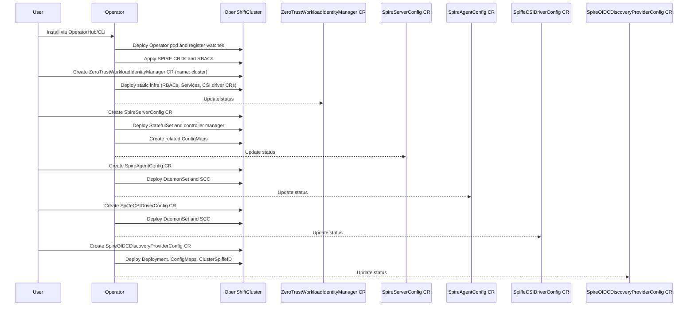

# Zero Trust Workload Identity Manager

## Summary

This enhancement describes the proposal to introduce a `Zero-Trust-Workload-Identity-Manager` for OpenShift, leveraging `SPIFFE` and `SPIRE` to provide a comprehensive identity management solution for distributed systems. SPIFFE/SPIRE provides a standardized approach to workload identity, enabling secure service-to-service communication in dynamic and heterogeneous environments. OpenShift will extend its security capabilities by integrating SPIFFE/SPIRE through a dedicated operator that manages workload identities across the cluster.


The solution introduces a identity management framework designed to address the complex security challenges of modern distributed systems. Key capabilities include implementing SPIFFE identity standards, automating SPIRE agent and server deployment, providing dynamic workload identity provisioning, ensuring verifiable identities for workloads, and supporting automatic certificate rotation and management.


## Motivation
Customers deploying OpenShift require a zero-trust workload identity solution that goes beyond static credentials and perimeter-based security models. Traditional approaches, such as long-lived certificates or manual secret injection, struggle to secure dynamic microservices architectures where workloads scale, migrate, and communicate across clusters. These methods introduce operational complexity, increase the risk of credential leakage, and fail to provide granular, cryptographically verifiable authentication for ephemeral workloads.  

The `Zero-Trust Workload Identity Manager` addresses these challenges by integrating `SPIFFE/SPIRE` natively into OpenShift. This provides automated issuance of short-lived, cryptographically signed identities (SVIDs) to workloads, replacing error-prone manual processes with dynamic identity lifecycle management. By enforcing mutual TLS (mTLS) by default and enabling fine-grained trust boundaries, organizations can secure service-to-service communication in multi-tenant or hybrid environments while reducing operational overhead and aligning with zero-trust security mandates.

### User Stories

- As a openshift cluster administrator, I want to deploy SPIRE components via an operator so that workload identities are managed automatically across the cluster.
- As a openshift cluster administrator, I want to configure trust domains via CRDs so that I can enforce secure isolation between teams or environments.
- As an application developer, I want SPIFFE identities injected into my workloads via the CSI Driver so that I avoid manual certificate management.
- As a security engineer, I want workloads to use short-lived, auto-rotated SVIDs so that mTLS is enforced by default for zero-trust security.
- As a cluster administrator, I want SPIRE metrics in OpenShift Monitoring so that I can proactively resolve identity-related issues.


### Goals

- Automate SPIRE server/agent deployment and lifecycle management via an operator.
- Dynamically provision SPIFFE identities (SVIDs) to workloads using the CSI Driver.
- Enable trust domain configuration through CRDs for secure multi-tenant/multi-cluster isolation.
- Ensure SVIDs have a TTL with automatic rotation to enforce credentials freshness.
- Integrate SPIRE health and performance metrics into OpenShift Monitoring.  

### Non-Goals  
- Replace existing auth systems (e.g., Service Accounts, OAuth).  
- Manage non-workload identities (users).  
- Enforce network-level security policies.  
- Support non-SPIFFE systems or legacy PKI.  
- Establish cross-cluster trust without explicit configuration.  
- Provide dedicated UI/CLI tools in initial release.

## Proposal
A new zero-trust-workload-identity-manager operator will manage the deployment and lifecycle of SPIRE components (server, agents) and the SPIFFE CSI Driver to provide workload identities based on the SPIFFE standard. A singleton Custom Resource (CR) will configure trust boundaries, while WorkloadAttestation CRs define attestation policies for workloads.

### Key Components
- Operator-Managed SPIRE Components
- `SPIRE Server` as a `StatefulSet` for high availability.
- `SPIRE Agents` as a `DaemonSet` (one per node).
- `SPIFFE CSI Driver` as a DaemonSet to inject workload identities (`SVIDs`) into pods.
- Resources `(RBAC, ServiceAccount, ClusterRole, etc.)` are created from static manifest templates.

The operator will create and manage the following resources to deploy SPIRE and SPIFFE components, Please refer `Implementation Details/Notes/Constraints` section for more details:

1. Core Infrastructure
    - Namespaces:
        - `zero-trust-workload-identity-manager` (shared resources)

    - ServiceAccounts:
        - `spire-agent`
        - `spire-server`
        - `spire-spiffe-csi-driver`
        - `spire-spiffe-oidc-discovery-provider`

2. Configuration
    - ConfigMaps:
        - `spire-agent`, `spire-server`, `spire-controller-manager` (component configurations)
        - `spire-spiffe-oidc-discovery-provider` (OIDC provider settings)
        - `spire-bundle` (trust bundle for certificates)

3. RBAC & Security
    - ClusterRoles:
        - `spire-agent` (read pods/nodes)
        - `spire-controller-manager` (manage SPIRE CRDs)
        - `spire-server` (token reviews, node/pod access)

    - ClusterRoleBindings:
        - Bind roles to SPIRE ServiceAccounts (e.g., `spire-agent`, `spire-server`).

    - SecurityContextConstraints (SCCs):
        - `spire-spiffe-csi-driver` (privileged CSI driver)
        - `spire-agent` (host access for agents)

4. SPIRE Server
    - StatefulSet:
        - `spire-server` (with persistent storage via spire-data PVC).

    - Services:
        - `spire-server` (gRPC endpoint for agent communication).

    - Volume Claims:
        - `spire-data` (persistent volume for server state).

5. SPIRE Agents
    - DaemonSet:
        - `spire-agent` (deployed per node for workload attestation).

    - Host Access:
        - Runs with `hostPID:true` and `hostNetwork:true` for node-level visibility.

6. SPIFFE CSI Driver
    - DaemonSet:

        - `spire-spiffe-csi-driver` (injects SVIDs into pods via CSI volumes).

    - CSIDriver:
        - `csi.spiffe.io` (supports ephemeral volumes for workload identities).

Each of the resource created for `zero-trust-workload-identity-manager` will have below set of labels added.
* `app.kubernetes.io/managed-by: zero-trust-workload-identity-manager`
* `app.kubernetes.io/part-of: zero-trust-workload-identity-manager`

Refer below links for more information on the labels used
- [Guidelines for Labels and Annotations for OpenShift applications](https://github.com/redhat-developer/app-labels/blob/master/labels-annotation-for-openshift.adoc)
- [Well-Known Labels, Annotations and Taints](https://kubernetes.io/docs/reference/labels-annotations-taints/)

### Workflow Description

The Zero-Trust Workload Identity Manager Operator automates the following workflow within OpenShift cluster:

1.  **Installation and Initial Setup:**
    * The operator is installed via the OpenShift OperatorHub or CLI, managed by OLM.
    * Upon deployment, the operator registers watches for relevant Kubernetes resources (Deployments, StatefulSets, DaemonSets, CustomResourceDefinitions, etc).
    * The operator applies the necessary SPIRE Custom Resource Definitions (CRDs) to the OpenShift cluster.
    * The operator applies foundational RBAC resources (ClusterRoles, ClusterRoleBindings, ServiceAccounts) for the operator components.

2.  **Operand static resources Deployment and Management:**
    * On the deployment the operator will deploy the CR for ZeroTrustWorkloadIdentityManager resource named `cluster` which will be managed by a controller, which is responsible for managing and operands static resources like RBACs resources, Service Accounts, Services, CSI drivers resource etc.
    * The status of the controller's reconcile should be reflecting on the resource's status field. 

3.  **SPIRE Servers Deployments and Management:**
    * When user wants to deploy the spire servers statefulset, spire-controller manager deployments and configmaps for spire-server, controller manager and spire-bundle based on the user validated input, they would need to deploy a CR for `SpireServer` resource named `cluster` for the controller to start managing the spire server via controller.
    * The status of the controller's reconcile should be reflecting on the resource's status field

4.  **SPIRE Agent Deployments and Management:**
    * When user wants to deploy the spire-agents as daemonset, SCC resource and configmaps for spire-agents based on the user validated input, they would need to deploy a CR for `SpireAgent` resource named `cluster` for the controller to start managing the spire agents deployments via controller.
    * The status of the controller's reconcile should be reflecting on the resource's status field

5.  **SPIFFE CSI Deployments and Management:**
    * When user wants to deploy the spiffe-csi-drivers as daemonset, SCC resource based on the user validated input, they would need to deploy a CR for `SpiffeCSIDriver` resource named `cluster` for the controller to start managing the spiffe-csi-driver deployments via controller.
    * The status of the controller's reconcile should be reflecting on the resource's status field

6.  **SPIRE OIDC Discovery Provider Deployments and Management:**
    * When user wants to deploy the spire OIDC discivery provider deployments, SCC resource, configmaps for oidc deployments and default ClusterSpiffeID resources based on the user validated input, they would need to deploy a CR for `SpireOIDCDiscoveryProvider` resource named `cluster` for the controller to start managing the spiffe-csi-driver deployments via controller.
    * The status of the controller's reconcile should be reflecting on the resource's status field

---

#### Visual Workflow  



### API Extensions

The Zero trust workload Identity manager includes 5 sets of APIs which follows seperate use cases for each components the operator manages.

- `ZeroTrustWorkloadIdentityManager` : Manages the static resources required for the operands.
``` yaml
apiVersion: apiextensions.k8s.io/v1
kind: CustomResourceDefinition
metadata:
  annotations:
    controller-gen.kubebuilder.io/version: v0.16.1
  creationTimestamp: null
  name: zerotrustworkloadidentitymanagers.operator.openshift.io
spec:
  group: operator.openshift.io
  names:
    kind: ZeroTrustWorkloadIdentityManager
    listKind: ZeroTrustWorkloadIdentityManagerList
    plural: zerotrustworkloadidentitymanagers
    singular: zerotrustworkloadidentitymanager
  scope: Cluster
  versions:
  - name: v1alpha1
    schema:
      openAPIV3Schema:
        description: |-
          ZeroTrustWorkloadIdentityManager defines the configuration for the
          operator that manages the lifecycle of SPIRE components in OpenShift
          clusters.

          Note: This resource is *intended as a global config for operands managed
          by zero-trust-workload-identity-manager. It does not contain
          low-level configuration for SPIRE components, which is managed separately
          in the SpireConfig CRD.
        properties:
          apiVersion:
            description: |-
              APIVersion defines the versioned schema of this representation of an object.
              Servers should convert recognized schemas to the latest internal value, and
              may reject unrecognized values.
              More info: https://git.k8s.io/community/contributors/devel/sig-architecture/api-conventions.md#resources
            type: string
          kind:
            description: |-
              Kind is a string value representing the REST resource this object represents.
              Servers may infer this from the endpoint the client submits requests to.
              Cannot be updated.
              In CamelCase.
              More info: https://git.k8s.io/community/contributors/devel/sig-architecture/api-conventions.md#types-kinds
            type: string
          metadata:
            type: object
          spec:
            description: ZeroTrustWorkloadIdentityManagerSpec defines the desired
              state of ZeroTrustWorkloadIdentityManager
            properties:
              affinity:
                description: |-
                  affinity is for setting scheduling affinity rules.
                  ref: https://kubernetes.io/docs/concepts/scheduling-eviction/assign-pod-node/
                properties:
                  nodeAffinity:
                    description: Describes node affinity scheduling rules for the
                      pod.
                    properties:
                      preferredDuringSchedulingIgnoredDuringExecution:
                        description: |-
                          The scheduler will prefer to schedule pods to nodes that satisfy
                          the affinity expressions specified by this field, but it may choose
                          a node that violates one or more of the expressions. The node that is
                          most preferred is the one with the greatest sum of weights, i.e.
                          for each node that meets all of the scheduling requirements (resource
                          request, requiredDuringScheduling affinity expressions, etc.),
                          compute a sum by iterating through the elements of this field and adding
                          "weight" to the sum if the node matches the corresponding matchExpressions; the
                          node(s) with the highest sum are the most preferred.
                        items:
                          description: |-
                            An empty preferred scheduling term matches all objects with implicit weight 0
                            (i.e. it's a no-op). A null preferred scheduling term matches no objects (i.e. is also a no-op).
                          properties:
                            preference:
                              description: A node selector term, associated with the
                                corresponding weight.
                              properties:
                                matchExpressions:
                                  description: A list of node selector requirements
                                    by node's labels.
                                  items:
                                    description: |-
                                      A node selector requirement is a selector that contains values, a key, and an operator
                                      that relates the key and values.
                                    properties:
                                      key:
                                        description: The label key that the selector
                                          applies to.
                                        type: string
                                      operator:
                                        description: |-
                                          Represents a key's relationship to a set of values.
                                          Valid operators are In, NotIn, Exists, DoesNotExist. Gt, and Lt.
                                        type: string
                                      values:
                                        description: |-
                                          An array of string values. If the operator is In or NotIn,
                                          the values array must be non-empty. If the operator is Exists or DoesNotExist,
                                          the values array must be empty. If the operator is Gt or Lt, the values
                                          array must have a single element, which will be interpreted as an integer.
                                          This array is replaced during a strategic merge patch.
                                        items:
                                          type: string
                                        type: array
                                        x-kubernetes-list-type: atomic
                                    required:
                                    - key
                                    - operator
                                    type: object
                                  type: array
                                  x-kubernetes-list-type: atomic
                                matchFields:
                                  description: A list of node selector requirements
                                    by node's fields.
                                  items:
                                    description: |-
                                      A node selector requirement is a selector that contains values, a key, and an operator
                                      that relates the key and values.
                                    properties:
                                      key:
                                        description: The label key that the selector
                                          applies to.
                                        type: string
                                      operator:
                                        description: |-
                                          Represents a key's relationship to a set of values.
                                          Valid operators are In, NotIn, Exists, DoesNotExist. Gt, and Lt.
                                        type: string
                                      values:
                                        description: |-
                                          An array of string values. If the operator is In or NotIn,
                                          the values array must be non-empty. If the operator is Exists or DoesNotExist,
                                          the values array must be empty. If the operator is Gt or Lt, the values
                                          array must have a single element, which will be interpreted as an integer.
                                          This array is replaced during a strategic merge patch.
                                        items:
                                          type: string
                                        type: array
                                        x-kubernetes-list-type: atomic
                                    required:
                                    - key
                                    - operator
                                    type: object
                                  type: array
                                  x-kubernetes-list-type: atomic
                              type: object
                              x-kubernetes-map-type: atomic
                            weight:
                              description: Weight associated with matching the corresponding
                                nodeSelectorTerm, in the range 1-100.
                              format: int32
                              type: integer
                          required:
                          - preference
                          - weight
                          type: object
                        type: array
                        x-kubernetes-list-type: atomic
                      requiredDuringSchedulingIgnoredDuringExecution:
                        description: |-
                          If the affinity requirements specified by this field are not met at
                          scheduling time, the pod will not be scheduled onto the node.
                          If the affinity requirements specified by this field cease to be met
                          at some point during pod execution (e.g. due to an update), the system
                          may or may not try to eventually evict the pod from its node.
                        properties:
                          nodeSelectorTerms:
                            description: Required. A list of node selector terms.
                              The terms are ORed.
                            items:
                              description: |-
                                A null or empty node selector term matches no objects. The requirements of
                                them are ANDed.
                                The TopologySelectorTerm type implements a subset of the NodeSelectorTerm.
                              properties:
                                matchExpressions:
                                  description: A list of node selector requirements
                                    by node's labels.
                                  items:
                                    description: |-
                                      A node selector requirement is a selector that contains values, a key, and an operator
                                      that relates the key and values.
                                    properties:
                                      key:
                                        description: The label key that the selector
                                          applies to.
                                        type: string
                                      operator:
                                        description: |-
                                          Represents a key's relationship to a set of values.
                                          Valid operators are In, NotIn, Exists, DoesNotExist. Gt, and Lt.
                                        type: string
                                      values:
                                        description: |-
                                          An array of string values. If the operator is In or NotIn,
                                          the values array must be non-empty. If the operator is Exists or DoesNotExist,
                                          the values array must be empty. If the operator is Gt or Lt, the values
                                          array must have a single element, which will be interpreted as an integer.
                                          This array is replaced during a strategic merge patch.
                                        items:
                                          type: string
                                        type: array
                                        x-kubernetes-list-type: atomic
                                    required:
                                    - key
                                    - operator
                                    type: object
                                  type: array
                                  x-kubernetes-list-type: atomic
                                matchFields:
                                  description: A list of node selector requirements
                                    by node's fields.
                                  items:
                                    description: |-
                                      A node selector requirement is a selector that contains values, a key, and an operator
                                      that relates the key and values.
                                    properties:
                                      key:
                                        description: The label key that the selector
                                          applies to.
                                        type: string
                                      operator:
                                        description: |-
                                          Represents a key's relationship to a set of values.
                                          Valid operators are In, NotIn, Exists, DoesNotExist. Gt, and Lt.
                                        type: string
                                      values:
                                        description: |-
                                          An array of string values. If the operator is In or NotIn,
                                          the values array must be non-empty. If the operator is Exists or DoesNotExist,
                                          the values array must be empty. If the operator is Gt or Lt, the values
                                          array must have a single element, which will be interpreted as an integer.
                                          This array is replaced during a strategic merge patch.
                                        items:
                                          type: string
                                        type: array
                                        x-kubernetes-list-type: atomic
                                    required:
                                    - key
                                    - operator
                                    type: object
                                  type: array
                                  x-kubernetes-list-type: atomic
                              type: object
                              x-kubernetes-map-type: atomic
                            type: array
                            x-kubernetes-list-type: atomic
                        required:
                        - nodeSelectorTerms
                        type: object
                        x-kubernetes-map-type: atomic
                    type: object
                  podAffinity:
                    description: Describes pod affinity scheduling rules (e.g. co-locate
                      this pod in the same node, zone, etc. as some other pod(s)).
                    properties:
                      preferredDuringSchedulingIgnoredDuringExecution:
                        description: |-
                          The scheduler will prefer to schedule pods to nodes that satisfy
                          the affinity expressions specified by this field, but it may choose
                          a node that violates one or more of the expressions. The node that is
                          most preferred is the one with the greatest sum of weights, i.e.
                          for each node that meets all of the scheduling requirements (resource
                          request, requiredDuringScheduling affinity expressions, etc.),
                          compute a sum by iterating through the elements of this field and adding
                          "weight" to the sum if the node has pods which matches the corresponding podAffinityTerm; the
                          node(s) with the highest sum are the most preferred.
                        items:
                          description: The weights of all of the matched WeightedPodAffinityTerm
                            fields are added per-node to find the most preferred node(s)
                          properties:
                            podAffinityTerm:
                              description: Required. A pod affinity term, associated
                                with the corresponding weight.
                              properties:
                                labelSelector:
                                  description: |-
                                    A label query over a set of resources, in this case pods.
                                    If it's null, this PodAffinityTerm matches with no Pods.
                                  properties:
                                    matchExpressions:
                                      description: matchExpressions is a list of label
                                        selector requirements. The requirements are
                                        ANDed.
                                      items:
                                        description: |-
                                          A label selector requirement is a selector that contains values, a key, and an operator that
                                          relates the key and values.
                                        properties:
                                          key:
                                            description: key is the label key that
                                              the selector applies to.
                                            type: string
                                          operator:
                                            description: |-
                                              operator represents a key's relationship to a set of values.
                                              Valid operators are In, NotIn, Exists and DoesNotExist.
                                            type: string
                                          values:
                                            description: |-
                                              values is an array of string values. If the operator is In or NotIn,
                                              the values array must be non-empty. If the operator is Exists or DoesNotExist,
                                              the values array must be empty. This array is replaced during a strategic
                                              merge patch.
                                            items:
                                              type: string
                                            type: array
                                            x-kubernetes-list-type: atomic
                                        required:
                                        - key
                                        - operator
                                        type: object
                                      type: array
                                      x-kubernetes-list-type: atomic
                                    matchLabels:
                                      additionalProperties:
                                        type: string
                                      description: |-
                                        matchLabels is a map of {key,value} pairs. A single {key,value} in the matchLabels
                                        map is equivalent to an element of matchExpressions, whose key field is "key", the
                                        operator is "In", and the values array contains only "value". The requirements are ANDed.
                                      type: object
                                  type: object
                                  x-kubernetes-map-type: atomic
                                matchLabelKeys:
                                  description: |-
                                    MatchLabelKeys is a set of pod label keys to select which pods will
                                    be taken into consideration. The keys are used to lookup values from the
                                    incoming pod labels, those key-value labels are merged with `labelSelector` as `key in (value)`
                                    to select the group of existing pods which pods will be taken into consideration
                                    for the incoming pod's pod (anti) affinity. Keys that don't exist in the incoming
                                    pod labels will be ignored. The default value is empty.
                                    The same key is forbidden to exist in both matchLabelKeys and labelSelector.
                                    Also, matchLabelKeys cannot be set when labelSelector isn't set.
                                    This is a beta field and requires enabling MatchLabelKeysInPodAffinity feature gate (enabled by default).
                                  items:
                                    type: string
                                  type: array
                                  x-kubernetes-list-type: atomic
                                mismatchLabelKeys:
                                  description: |-
                                    MismatchLabelKeys is a set of pod label keys to select which pods will
                                    be taken into consideration. The keys are used to lookup values from the
                                    incoming pod labels, those key-value labels are merged with `labelSelector` as `key notin (value)`
                                    to select the group of existing pods which pods will be taken into consideration
                                    for the incoming pod's pod (anti) affinity. Keys that don't exist in the incoming
                                    pod labels will be ignored. The default value is empty.
                                    The same key is forbidden to exist in both mismatchLabelKeys and labelSelector.
                                    Also, mismatchLabelKeys cannot be set when labelSelector isn't set.
                                    This is a beta field and requires enabling MatchLabelKeysInPodAffinity feature gate (enabled by default).
                                  items:
                                    type: string
                                  type: array
                                  x-kubernetes-list-type: atomic
                                namespaceSelector:
                                  description: |-
                                    A label query over the set of namespaces that the term applies to.
                                    The term is applied to the union of the namespaces selected by this field
                                    and the ones listed in the namespaces field.
                                    null selector and null or empty namespaces list means "this pod's namespace".
                                    An empty selector ({}) matches all namespaces.
                                  properties:
                                    matchExpressions:
                                      description: matchExpressions is a list of label
                                        selector requirements. The requirements are
                                        ANDed.
                                      items:
                                        description: |-
                                          A label selector requirement is a selector that contains values, a key, and an operator that
                                          relates the key and values.
                                        properties:
                                          key:
                                            description: key is the label key that
                                              the selector applies to.
                                            type: string
                                          operator:
                                            description: |-
                                              operator represents a key's relationship to a set of values.
                                              Valid operators are In, NotIn, Exists and DoesNotExist.
                                            type: string
                                          values:
                                            description: |-
                                              values is an array of string values. If the operator is In or NotIn,
                                              the values array must be non-empty. If the operator is Exists or DoesNotExist,
                                              the values array must be empty. This array is replaced during a strategic
                                              merge patch.
                                            items:
                                              type: string
                                            type: array
                                            x-kubernetes-list-type: atomic
                                        required:
                                        - key
                                        - operator
                                        type: object
                                      type: array
                                      x-kubernetes-list-type: atomic
                                    matchLabels:
                                      additionalProperties:
                                        type: string
                                      description: |-
                                        matchLabels is a map of {key,value} pairs. A single {key,value} in the matchLabels
                                        map is equivalent to an element of matchExpressions, whose key field is "key", the
                                        operator is "In", and the values array contains only "value". The requirements are ANDed.
                                      type: object
                                  type: object
                                  x-kubernetes-map-type: atomic
                                namespaces:
                                  description: |-
                                    namespaces specifies a static list of namespace names that the term applies to.
                                    The term is applied to the union of the namespaces listed in this field
                                    and the ones selected by namespaceSelector.
                                    null or empty namespaces list and null namespaceSelector means "this pod's namespace".
                                  items:
                                    type: string
                                  type: array
                                  x-kubernetes-list-type: atomic
                                topologyKey:
                                  description: |-
                                    This pod should be co-located (affinity) or not co-located (anti-affinity) with the pods matching
                                    the labelSelector in the specified namespaces, where co-located is defined as running on a node
                                    whose value of the label with key topologyKey matches that of any node on which any of the
                                    selected pods is running.
                                    Empty topologyKey is not allowed.
                                  type: string
                              required:
                              - topologyKey
                              type: object
                            weight:
                              description: |-
                                weight associated with matching the corresponding podAffinityTerm,
                                in the range 1-100.
                              format: int32
                              type: integer
                          required:
                          - podAffinityTerm
                          - weight
                          type: object
                        type: array
                        x-kubernetes-list-type: atomic
                      requiredDuringSchedulingIgnoredDuringExecution:
                        description: |-
                          If the affinity requirements specified by this field are not met at
                          scheduling time, the pod will not be scheduled onto the node.
                          If the affinity requirements specified by this field cease to be met
                          at some point during pod execution (e.g. due to a pod label update), the
                          system may or may not try to eventually evict the pod from its node.
                          When there are multiple elements, the lists of nodes corresponding to each
                          podAffinityTerm are intersected, i.e. all terms must be satisfied.
                        items:
                          description: |-
                            Defines a set of pods (namely those matching the labelSelector
                            relative to the given namespace(s)) that this pod should be
                            co-located (affinity) or not co-located (anti-affinity) with,
                            where co-located is defined as running on a node whose value of
                            the label with key <topologyKey> matches that of any node on which
                            a pod of the set of pods is running
                          properties:
                            labelSelector:
                              description: |-
                                A label query over a set of resources, in this case pods.
                                If it's null, this PodAffinityTerm matches with no Pods.
                              properties:
                                matchExpressions:
                                  description: matchExpressions is a list of label
                                    selector requirements. The requirements are ANDed.
                                  items:
                                    description: |-
                                      A label selector requirement is a selector that contains values, a key, and an operator that
                                      relates the key and values.
                                    properties:
                                      key:
                                        description: key is the label key that the
                                          selector applies to.
                                        type: string
                                      operator:
                                        description: |-
                                          operator represents a key's relationship to a set of values.
                                          Valid operators are In, NotIn, Exists and DoesNotExist.
                                        type: string
                                      values:
                                        description: |-
                                          values is an array of string values. If the operator is In or NotIn,
                                          the values array must be non-empty. If the operator is Exists or DoesNotExist,
                                          the values array must be empty. This array is replaced during a strategic
                                          merge patch.
                                        items:
                                          type: string
                                        type: array
                                        x-kubernetes-list-type: atomic
                                    required:
                                    - key
                                    - operator
                                    type: object
                                  type: array
                                  x-kubernetes-list-type: atomic
                                matchLabels:
                                  additionalProperties:
                                    type: string
                                  description: |-
                                    matchLabels is a map of {key,value} pairs. A single {key,value} in the matchLabels
                                    map is equivalent to an element of matchExpressions, whose key field is "key", the
                                    operator is "In", and the values array contains only "value". The requirements are ANDed.
                                  type: object
                              type: object
                              x-kubernetes-map-type: atomic
                            matchLabelKeys:
                              description: |-
                                MatchLabelKeys is a set of pod label keys to select which pods will
                                be taken into consideration. The keys are used to lookup values from the
                                incoming pod labels, those key-value labels are merged with `labelSelector` as `key in (value)`
                                to select the group of existing pods which pods will be taken into consideration
                                for the incoming pod's pod (anti) affinity. Keys that don't exist in the incoming
                                pod labels will be ignored. The default value is empty.
                                The same key is forbidden to exist in both matchLabelKeys and labelSelector.
                                Also, matchLabelKeys cannot be set when labelSelector isn't set.
                                This is a beta field and requires enabling MatchLabelKeysInPodAffinity feature gate (enabled by default).
                              items:
                                type: string
                              type: array
                              x-kubernetes-list-type: atomic
                            mismatchLabelKeys:
                              description: |-
                                MismatchLabelKeys is a set of pod label keys to select which pods will
                                be taken into consideration. The keys are used to lookup values from the
                                incoming pod labels, those key-value labels are merged with `labelSelector` as `key notin (value)`
                                to select the group of existing pods which pods will be taken into consideration
                                for the incoming pod's pod (anti) affinity. Keys that don't exist in the incoming
                                pod labels will be ignored. The default value is empty.
                                The same key is forbidden to exist in both mismatchLabelKeys and labelSelector.
                                Also, mismatchLabelKeys cannot be set when labelSelector isn't set.
                                This is a beta field and requires enabling MatchLabelKeysInPodAffinity feature gate (enabled by default).
                              items:
                                type: string
                              type: array
                              x-kubernetes-list-type: atomic
                            namespaceSelector:
                              description: |-
                                A label query over the set of namespaces that the term applies to.
                                The term is applied to the union of the namespaces selected by this field
                                and the ones listed in the namespaces field.
                                null selector and null or empty namespaces list means "this pod's namespace".
                                An empty selector ({}) matches all namespaces.
                              properties:
                                matchExpressions:
                                  description: matchExpressions is a list of label
                                    selector requirements. The requirements are ANDed.
                                  items:
                                    description: |-
                                      A label selector requirement is a selector that contains values, a key, and an operator that
                                      relates the key and values.
                                    properties:
                                      key:
                                        description: key is the label key that the
                                          selector applies to.
                                        type: string
                                      operator:
                                        description: |-
                                          operator represents a key's relationship to a set of values.
                                          Valid operators are In, NotIn, Exists and DoesNotExist.
                                        type: string
                                      values:
                                        description: |-
                                          values is an array of string values. If the operator is In or NotIn,
                                          the values array must be non-empty. If the operator is Exists or DoesNotExist,
                                          the values array must be empty. This array is replaced during a strategic
                                          merge patch.
                                        items:
                                          type: string
                                        type: array
                                        x-kubernetes-list-type: atomic
                                    required:
                                    - key
                                    - operator
                                    type: object
                                  type: array
                                  x-kubernetes-list-type: atomic
                                matchLabels:
                                  additionalProperties:
                                    type: string
                                  description: |-
                                    matchLabels is a map of {key,value} pairs. A single {key,value} in the matchLabels
                                    map is equivalent to an element of matchExpressions, whose key field is "key", the
                                    operator is "In", and the values array contains only "value". The requirements are ANDed.
                                  type: object
                              type: object
                              x-kubernetes-map-type: atomic
                            namespaces:
                              description: |-
                                namespaces specifies a static list of namespace names that the term applies to.
                                The term is applied to the union of the namespaces listed in this field
                                and the ones selected by namespaceSelector.
                                null or empty namespaces list and null namespaceSelector means "this pod's namespace".
                              items:
                                type: string
                              type: array
                              x-kubernetes-list-type: atomic
                            topologyKey:
                              description: |-
                                This pod should be co-located (affinity) or not co-located (anti-affinity) with the pods matching
                                the labelSelector in the specified namespaces, where co-located is defined as running on a node
                                whose value of the label with key topologyKey matches that of any node on which any of the
                                selected pods is running.
                                Empty topologyKey is not allowed.
                              type: string
                          required:
                          - topologyKey
                          type: object
                        type: array
                        x-kubernetes-list-type: atomic
                    type: object
                  podAntiAffinity:
                    description: Describes pod anti-affinity scheduling rules (e.g.
                      avoid putting this pod in the same node, zone, etc. as some
                      other pod(s)).
                    properties:
                      preferredDuringSchedulingIgnoredDuringExecution:
                        description: |-
                          The scheduler will prefer to schedule pods to nodes that satisfy
                          the anti-affinity expressions specified by this field, but it may choose
                          a node that violates one or more of the expressions. The node that is
                          most preferred is the one with the greatest sum of weights, i.e.
                          for each node that meets all of the scheduling requirements (resource
                          request, requiredDuringScheduling anti-affinity expressions, etc.),
                          compute a sum by iterating through the elements of this field and adding
                          "weight" to the sum if the node has pods which matches the corresponding podAffinityTerm; the
                          node(s) with the highest sum are the most preferred.
                        items:
                          description: The weights of all of the matched WeightedPodAffinityTerm
                            fields are added per-node to find the most preferred node(s)
                          properties:
                            podAffinityTerm:
                              description: Required. A pod affinity term, associated
                                with the corresponding weight.
                              properties:
                                labelSelector:
                                  description: |-
                                    A label query over a set of resources, in this case pods.
                                    If it's null, this PodAffinityTerm matches with no Pods.
                                  properties:
                                    matchExpressions:
                                      description: matchExpressions is a list of label
                                        selector requirements. The requirements are
                                        ANDed.
                                      items:
                                        description: |-
                                          A label selector requirement is a selector that contains values, a key, and an operator that
                                          relates the key and values.
                                        properties:
                                          key:
                                            description: key is the label key that
                                              the selector applies to.
                                            type: string
                                          operator:
                                            description: |-
                                              operator represents a key's relationship to a set of values.
                                              Valid operators are In, NotIn, Exists and DoesNotExist.
                                            type: string
                                          values:
                                            description: |-
                                              values is an array of string values. If the operator is In or NotIn,
                                              the values array must be non-empty. If the operator is Exists or DoesNotExist,
                                              the values array must be empty. This array is replaced during a strategic
                                              merge patch.
                                            items:
                                              type: string
                                            type: array
                                            x-kubernetes-list-type: atomic
                                        required:
                                        - key
                                        - operator
                                        type: object
                                      type: array
                                      x-kubernetes-list-type: atomic
                                    matchLabels:
                                      additionalProperties:
                                        type: string
                                      description: |-
                                        matchLabels is a map of {key,value} pairs. A single {key,value} in the matchLabels
                                        map is equivalent to an element of matchExpressions, whose key field is "key", the
                                        operator is "In", and the values array contains only "value". The requirements are ANDed.
                                      type: object
                                  type: object
                                  x-kubernetes-map-type: atomic
                                matchLabelKeys:
                                  description: |-
                                    MatchLabelKeys is a set of pod label keys to select which pods will
                                    be taken into consideration. The keys are used to lookup values from the
                                    incoming pod labels, those key-value labels are merged with `labelSelector` as `key in (value)`
                                    to select the group of existing pods which pods will be taken into consideration
                                    for the incoming pod's pod (anti) affinity. Keys that don't exist in the incoming
                                    pod labels will be ignored. The default value is empty.
                                    The same key is forbidden to exist in both matchLabelKeys and labelSelector.
                                    Also, matchLabelKeys cannot be set when labelSelector isn't set.
                                    This is a beta field and requires enabling MatchLabelKeysInPodAffinity feature gate (enabled by default).
                                  items:
                                    type: string
                                  type: array
                                  x-kubernetes-list-type: atomic
                                mismatchLabelKeys:
                                  description: |-
                                    MismatchLabelKeys is a set of pod label keys to select which pods will
                                    be taken into consideration. The keys are used to lookup values from the
                                    incoming pod labels, those key-value labels are merged with `labelSelector` as `key notin (value)`
                                    to select the group of existing pods which pods will be taken into consideration
                                    for the incoming pod's pod (anti) affinity. Keys that don't exist in the incoming
                                    pod labels will be ignored. The default value is empty.
                                    The same key is forbidden to exist in both mismatchLabelKeys and labelSelector.
                                    Also, mismatchLabelKeys cannot be set when labelSelector isn't set.
                                    This is a beta field and requires enabling MatchLabelKeysInPodAffinity feature gate (enabled by default).
                                  items:
                                    type: string
                                  type: array
                                  x-kubernetes-list-type: atomic
                                namespaceSelector:
                                  description: |-
                                    A label query over the set of namespaces that the term applies to.
                                    The term is applied to the union of the namespaces selected by this field
                                    and the ones listed in the namespaces field.
                                    null selector and null or empty namespaces list means "this pod's namespace".
                                    An empty selector ({}) matches all namespaces.
                                  properties:
                                    matchExpressions:
                                      description: matchExpressions is a list of label
                                        selector requirements. The requirements are
                                        ANDed.
                                      items:
                                        description: |-
                                          A label selector requirement is a selector that contains values, a key, and an operator that
                                          relates the key and values.
                                        properties:
                                          key:
                                            description: key is the label key that
                                              the selector applies to.
                                            type: string
                                          operator:
                                            description: |-
                                              operator represents a key's relationship to a set of values.
                                              Valid operators are In, NotIn, Exists and DoesNotExist.
                                            type: string
                                          values:
                                            description: |-
                                              values is an array of string values. If the operator is In or NotIn,
                                              the values array must be non-empty. If the operator is Exists or DoesNotExist,
                                              the values array must be empty. This array is replaced during a strategic
                                              merge patch.
                                            items:
                                              type: string
                                            type: array
                                            x-kubernetes-list-type: atomic
                                        required:
                                        - key
                                        - operator
                                        type: object
                                      type: array
                                      x-kubernetes-list-type: atomic
                                    matchLabels:
                                      additionalProperties:
                                        type: string
                                      description: |-
                                        matchLabels is a map of {key,value} pairs. A single {key,value} in the matchLabels
                                        map is equivalent to an element of matchExpressions, whose key field is "key", the
                                        operator is "In", and the values array contains only "value". The requirements are ANDed.
                                      type: object
                                  type: object
                                  x-kubernetes-map-type: atomic
                                namespaces:
                                  description: |-
                                    namespaces specifies a static list of namespace names that the term applies to.
                                    The term is applied to the union of the namespaces listed in this field
                                    and the ones selected by namespaceSelector.
                                    null or empty namespaces list and null namespaceSelector means "this pod's namespace".
                                  items:
                                    type: string
                                  type: array
                                  x-kubernetes-list-type: atomic
                                topologyKey:
                                  description: |-
                                    This pod should be co-located (affinity) or not co-located (anti-affinity) with the pods matching
                                    the labelSelector in the specified namespaces, where co-located is defined as running on a node
                                    whose value of the label with key topologyKey matches that of any node on which any of the
                                    selected pods is running.
                                    Empty topologyKey is not allowed.
                                  type: string
                              required:
                              - topologyKey
                              type: object
                            weight:
                              description: |-
                                weight associated with matching the corresponding podAffinityTerm,
                                in the range 1-100.
                              format: int32
                              type: integer
                          required:
                          - podAffinityTerm
                          - weight
                          type: object
                        type: array
                        x-kubernetes-list-type: atomic
                      requiredDuringSchedulingIgnoredDuringExecution:
                        description: |-
                          If the anti-affinity requirements specified by this field are not met at
                          scheduling time, the pod will not be scheduled onto the node.
                          If the anti-affinity requirements specified by this field cease to be met
                          at some point during pod execution (e.g. due to a pod label update), the
                          system may or may not try to eventually evict the pod from its node.
                          When there are multiple elements, the lists of nodes corresponding to each
                          podAffinityTerm are intersected, i.e. all terms must be satisfied.
                        items:
                          description: |-
                            Defines a set of pods (namely those matching the labelSelector
                            relative to the given namespace(s)) that this pod should be
                            co-located (affinity) or not co-located (anti-affinity) with,
                            where co-located is defined as running on a node whose value of
                            the label with key <topologyKey> matches that of any node on which
                            a pod of the set of pods is running
                          properties:
                            labelSelector:
                              description: |-
                                A label query over a set of resources, in this case pods.
                                If it's null, this PodAffinityTerm matches with no Pods.
                              properties:
                                matchExpressions:
                                  description: matchExpressions is a list of label
                                    selector requirements. The requirements are ANDed.
                                  items:
                                    description: |-
                                      A label selector requirement is a selector that contains values, a key, and an operator that
                                      relates the key and values.
                                    properties:
                                      key:
                                        description: key is the label key that the
                                          selector applies to.
                                        type: string
                                      operator:
                                        description: |-
                                          operator represents a key's relationship to a set of values.
                                          Valid operators are In, NotIn, Exists and DoesNotExist.
                                        type: string
                                      values:
                                        description: |-
                                          values is an array of string values. If the operator is In or NotIn,
                                          the values array must be non-empty. If the operator is Exists or DoesNotExist,
                                          the values array must be empty. This array is replaced during a strategic
                                          merge patch.
                                        items:
                                          type: string
                                        type: array
                                        x-kubernetes-list-type: atomic
                                    required:
                                    - key
                                    - operator
                                    type: object
                                  type: array
                                  x-kubernetes-list-type: atomic
                                matchLabels:
                                  additionalProperties:
                                    type: string
                                  description: |-
                                    matchLabels is a map of {key,value} pairs. A single {key,value} in the matchLabels
                                    map is equivalent to an element of matchExpressions, whose key field is "key", the
                                    operator is "In", and the values array contains only "value". The requirements are ANDed.
                                  type: object
                              type: object
                              x-kubernetes-map-type: atomic
                            matchLabelKeys:
                              description: |-
                                MatchLabelKeys is a set of pod label keys to select which pods will
                                be taken into consideration. The keys are used to lookup values from the
                                incoming pod labels, those key-value labels are merged with `labelSelector` as `key in (value)`
                                to select the group of existing pods which pods will be taken into consideration
                                for the incoming pod's pod (anti) affinity. Keys that don't exist in the incoming
                                pod labels will be ignored. The default value is empty.
                                The same key is forbidden to exist in both matchLabelKeys and labelSelector.
                                Also, matchLabelKeys cannot be set when labelSelector isn't set.
                                This is a beta field and requires enabling MatchLabelKeysInPodAffinity feature gate (enabled by default).
                              items:
                                type: string
                              type: array
                              x-kubernetes-list-type: atomic
                            mismatchLabelKeys:
                              description: |-
                                MismatchLabelKeys is a set of pod label keys to select which pods will
                                be taken into consideration. The keys are used to lookup values from the
                                incoming pod labels, those key-value labels are merged with `labelSelector` as `key notin (value)`
                                to select the group of existing pods which pods will be taken into consideration
                                for the incoming pod's pod (anti) affinity. Keys that don't exist in the incoming
                                pod labels will be ignored. The default value is empty.
                                The same key is forbidden to exist in both mismatchLabelKeys and labelSelector.
                                Also, mismatchLabelKeys cannot be set when labelSelector isn't set.
                                This is a beta field and requires enabling MatchLabelKeysInPodAffinity feature gate (enabled by default).
                              items:
                                type: string
                              type: array
                              x-kubernetes-list-type: atomic
                            namespaceSelector:
                              description: |-
                                A label query over the set of namespaces that the term applies to.
                                The term is applied to the union of the namespaces selected by this field
                                and the ones listed in the namespaces field.
                                null selector and null or empty namespaces list means "this pod's namespace".
                                An empty selector ({}) matches all namespaces.
                              properties:
                                matchExpressions:
                                  description: matchExpressions is a list of label
                                    selector requirements. The requirements are ANDed.
                                  items:
                                    description: |-
                                      A label selector requirement is a selector that contains values, a key, and an operator that
                                      relates the key and values.
                                    properties:
                                      key:
                                        description: key is the label key that the
                                          selector applies to.
                                        type: string
                                      operator:
                                        description: |-
                                          operator represents a key's relationship to a set of values.
                                          Valid operators are In, NotIn, Exists and DoesNotExist.
                                        type: string
                                      values:
                                        description: |-
                                          values is an array of string values. If the operator is In or NotIn,
                                          the values array must be non-empty. If the operator is Exists or DoesNotExist,
                                          the values array must be empty. This array is replaced during a strategic
                                          merge patch.
                                        items:
                                          type: string
                                        type: array
                                        x-kubernetes-list-type: atomic
                                    required:
                                    - key
                                    - operator
                                    type: object
                                  type: array
                                  x-kubernetes-list-type: atomic
                                matchLabels:
                                  additionalProperties:
                                    type: string
                                  description: |-
                                    matchLabels is a map of {key,value} pairs. A single {key,value} in the matchLabels
                                    map is equivalent to an element of matchExpressions, whose key field is "key", the
                                    operator is "In", and the values array contains only "value". The requirements are ANDed.
                                  type: object
                              type: object
                              x-kubernetes-map-type: atomic
                            namespaces:
                              description: |-
                                namespaces specifies a static list of namespace names that the term applies to.
                                The term is applied to the union of the namespaces listed in this field
                                and the ones selected by namespaceSelector.
                                null or empty namespaces list and null namespaceSelector means "this pod's namespace".
                              items:
                                type: string
                              type: array
                              x-kubernetes-list-type: atomic
                            topologyKey:
                              description: |-
                                This pod should be co-located (affinity) or not co-located (anti-affinity) with the pods matching
                                the labelSelector in the specified namespaces, where co-located is defined as running on a node
                                whose value of the label with key topologyKey matches that of any node on which any of the
                                selected pods is running.
                                Empty topologyKey is not allowed.
                              type: string
                          required:
                          - topologyKey
                          type: object
                        type: array
                        x-kubernetes-list-type: atomic
                    type: object
                type: object
              labels:
                additionalProperties:
                  type: string
                description: labels to apply to all resources managed by the API.
                type: object
                x-kubernetes-map-type: granular
              logLevel:
                default: 1
                description: logLevel supports value range as per [kubernetes logging
                  guidelines](https://github.com/kubernetes/community/blob/master/contributors/devel/sig-instrumentation/logging.md#what-method-to-use).
                format: int32
                maximum: 5
                minimum: 1
                type: integer
              namespace:
                default: zero-trust-workload-identity-manager
                description: |-
                  namespace to install the deployments and other resources managed by
                  zero-trust-workload-identity-manager.
                type: string
              nodeSelector:
                additionalProperties:
                  type: string
                description: |-
                  nodeSelector is for defining the scheduling criteria using node labels.
                  ref: https://kubernetes.io/docs/concepts/configuration/assign-pod-node/
                type: object
                x-kubernetes-map-type: atomic
              resources:
                description: |-
                  resources are for defining the resource requirements.
                  ref: https://kubernetes.io/docs/concepts/configuration/manage-resources-containers/
                properties:
                  claims:
                    description: |-
                      Claims lists the names of resources, defined in spec.resourceClaims,
                      that are used by this container.

                      This is an alpha field and requires enabling the
                      DynamicResourceAllocation feature gate.

                      This field is immutable. It can only be set for containers.
                    items:
                      description: ResourceClaim references one entry in PodSpec.ResourceClaims.
                      properties:
                        name:
                          description: |-
                            Name must match the name of one entry in pod.spec.resourceClaims of
                            the Pod where this field is used. It makes that resource available
                            inside a container.
                          type: string
                        request:
                          description: |-
                            Request is the name chosen for a request in the referenced claim.
                            If empty, everything from the claim is made available, otherwise
                            only the result of this request.
                          type: string
                      required:
                      - name
                      type: object
                    type: array
                    x-kubernetes-list-map-keys:
                    - name
                    x-kubernetes-list-type: map
                  limits:
                    additionalProperties:
                      anyOf:
                      - type: integer
                      - type: string
                      pattern: ^(\+|-)?(([0-9]+(\.[0-9]*)?)|(\.[0-9]+))(([KMGTPE]i)|[numkMGTPE]|([eE](\+|-)?(([0-9]+(\.[0-9]*)?)|(\.[0-9]+))))?$
                      x-kubernetes-int-or-string: true
                    description: |-
                      Limits describes the maximum amount of compute resources allowed.
                      More info: https://kubernetes.io/docs/concepts/configuration/manage-resources-containers/
                    type: object
                  requests:
                    additionalProperties:
                      anyOf:
                      - type: integer
                      - type: string
                      pattern: ^(\+|-)?(([0-9]+(\.[0-9]*)?)|(\.[0-9]+))(([KMGTPE]i)|[numkMGTPE]|([eE](\+|-)?(([0-9]+(\.[0-9]*)?)|(\.[0-9]+))))?$
                      x-kubernetes-int-or-string: true
                    description: |-
                      Requests describes the minimum amount of compute resources required.
                      If Requests is omitted for a container, it defaults to Limits if that is explicitly specified,
                      otherwise to an implementation-defined value. Requests cannot exceed Limits.
                      More info: https://kubernetes.io/docs/concepts/configuration/manage-resources-containers/
                    type: object
                type: object
              tolerations:
                description: |-
                  tolerations are for setting the pod tolerations.
                  ref: https://kubernetes.io/docs/concepts/scheduling-eviction/taint-and-toleration/
                items:
                  description: |-
                    The pod this Toleration is attached to tolerates any taint that matches
                    the triple <key,value,effect> using the matching operator <operator>.
                  properties:
                    effect:
                      description: |-
                        Effect indicates the taint effect to match. Empty means match all taint effects.
                        When specified, allowed values are NoSchedule, PreferNoSchedule and NoExecute.
                      type: string
                    key:
                      description: |-
                        Key is the taint key that the toleration applies to. Empty means match all taint keys.
                        If the key is empty, operator must be Exists; this combination means to match all values and all keys.
                      type: string
                    operator:
                      description: |-
                        Operator represents a key's relationship to the value.
                        Valid operators are Exists and Equal. Defaults to Equal.
                        Exists is equivalent to wildcard for value, so that a pod can
                        tolerate all taints of a particular category.
                      type: string
                    tolerationSeconds:
                      description: |-
                        TolerationSeconds represents the period of time the toleration (which must be
                        of effect NoExecute, otherwise this field is ignored) tolerates the taint. By default,
                        it is not set, which means tolerate the taint forever (do not evict). Zero and
                        negative values will be treated as 0 (evict immediately) by the system.
                      format: int64
                      type: integer
                    value:
                      description: |-
                        Value is the taint value the toleration matches to.
                        If the operator is Exists, the value should be empty, otherwise just a regular string.
                      type: string
                  type: object
                type: array
                x-kubernetes-list-type: atomic
            type: object
          status:
            description: ZeroTrustWorkloadIdentityManagerStatus defines the observed
              state of ZeroTrustWorkloadIdentityManager
            properties:
              conditions:
                description: conditions holds information of the current state of
                  the spire-resources deployment.
                items:
                  description: Condition contains details for one aspect of the current
                    state of this API Resource.
                  properties:
                    lastTransitionTime:
                      description: |-
                        lastTransitionTime is the last time the condition transitioned from one status to another.
                        This should be when the underlying condition changed.  If that is not known, then using the time when the API field changed is acceptable.
                      format: date-time
                      type: string
                    message:
                      description: |-
                        message is a human readable message indicating details about the transition.
                        This may be an empty string.
                      maxLength: 32768
                      type: string
                    observedGeneration:
                      description: |-
                        observedGeneration represents the .metadata.generation that the condition was set based upon.
                        For instance, if .metadata.generation is currently 12, but the .status.conditions[x].observedGeneration is 9, the condition is out of date
                        with respect to the current state of the instance.
                      format: int64
                      minimum: 0
                      type: integer
                    reason:
                      description: |-
                        reason contains a programmatic identifier indicating the reason for the condition's last transition.
                        Producers of specific condition types may define expected values and meanings for this field,
                        and whether the values are considered a guaranteed API.
                        The value should be a CamelCase string.
                        This field may not be empty.
                      maxLength: 1024
                      minLength: 1
                      pattern: ^[A-Za-z]([A-Za-z0-9_,:]*[A-Za-z0-9_])?$
                      type: string
                    status:
                      description: status of the condition, one of True, False, Unknown.
                      enum:
                      - "True"
                      - "False"
                      - Unknown
                      type: string
                    type:
                      description: type of condition in CamelCase or in foo.example.com/CamelCase.
                      maxLength: 316
                      pattern: ^([a-z0-9]([-a-z0-9]*[a-z0-9])?(\.[a-z0-9]([-a-z0-9]*[a-z0-9])?)*/)?(([A-Za-z0-9][-A-Za-z0-9_.]*)?[A-Za-z0-9])$
                      type: string
                  required:
                  - lastTransitionTime
                  - message
                  - reason
                  - status
                  - type
                  type: object
                type: array
                x-kubernetes-list-map-keys:
                - type
                x-kubernetes-list-type: map
            type: object
        type: object
        x-kubernetes-validations:
        - message: ZeroTrustWorkloadIdentityManager is a singleton, .metadata.name
            must be 'cluster'
          rule: self.metadata.name == 'cluster'
    served: true
    storage: true
    subresources:
      status: {}
status:
  acceptedNames:
    kind: ""
    plural: ""
  conditions: null
  storedVersions: null

```

- `SpireServer` : Manages the configs required for the spire servers Statefulsets and configmaps resources.

``` yaml
apiVersion: apiextensions.k8s.io/v1
kind: CustomResourceDefinition
metadata:
  annotations:
    controller-gen.kubebuilder.io/version: v0.16.1
  creationTimestamp: null
  name: spireservers.operator.openshift.io
spec:
  group: operator.openshift.io
  names:
    kind: SpireServer
    listKind: SpireServerList
    plural: spireservers
    singular: spireserver
  scope: Cluster
  versions:
  - name: v1alpha1
    schema:
      openAPIV3Schema:
        description: |-
          SpireServer defines the configuration for the SPIRE Server managed by zero trust workload identity manager.
          This includes details related to trust domain, data storage, plugins
          and other configs required for workload authentication.
        properties:
          apiVersion:
            description: |-
              APIVersion defines the versioned schema of this representation of an object.
              Servers should convert recognized schemas to the latest internal value, and
              may reject unrecognized values.
              More info: https://git.k8s.io/community/contributors/devel/sig-architecture/api-conventions.md#resources
            type: string
          kind:
            description: |-
              Kind is a string value representing the REST resource this object represents.
              Servers may infer this from the endpoint the client submits requests to.
              Cannot be updated.
              In CamelCase.
              More info: https://git.k8s.io/community/contributors/devel/sig-architecture/api-conventions.md#types-kinds
            type: string
          metadata:
            type: object
          spec:
            description: SpireServerSpec will have specifications for configuration
              related to the spire server.
            properties:
              affinity:
                description: |-
                  affinity is for setting scheduling affinity rules.
                  ref: https://kubernetes.io/docs/concepts/scheduling-eviction/assign-pod-node/
                properties:
                  nodeAffinity:
                    description: Describes node affinity scheduling rules for the
                      pod.
                    properties:
                      preferredDuringSchedulingIgnoredDuringExecution:
                        description: |-
                          The scheduler will prefer to schedule pods to nodes that satisfy
                          the affinity expressions specified by this field, but it may choose
                          a node that violates one or more of the expressions. The node that is
                          most preferred is the one with the greatest sum of weights, i.e.
                          for each node that meets all of the scheduling requirements (resource
                          request, requiredDuringScheduling affinity expressions, etc.),
                          compute a sum by iterating through the elements of this field and adding
                          "weight" to the sum if the node matches the corresponding matchExpressions; the
                          node(s) with the highest sum are the most preferred.
                        items:
                          description: |-
                            An empty preferred scheduling term matches all objects with implicit weight 0
                            (i.e. it's a no-op). A null preferred scheduling term matches no objects (i.e. is also a no-op).
                          properties:
                            preference:
                              description: A node selector term, associated with the
                                corresponding weight.
                              properties:
                                matchExpressions:
                                  description: A list of node selector requirements
                                    by node's labels.
                                  items:
                                    description: |-
                                      A node selector requirement is a selector that contains values, a key, and an operator
                                      that relates the key and values.
                                    properties:
                                      key:
                                        description: The label key that the selector
                                          applies to.
                                        type: string
                                      operator:
                                        description: |-
                                          Represents a key's relationship to a set of values.
                                          Valid operators are In, NotIn, Exists, DoesNotExist. Gt, and Lt.
                                        type: string
                                      values:
                                        description: |-
                                          An array of string values. If the operator is In or NotIn,
                                          the values array must be non-empty. If the operator is Exists or DoesNotExist,
                                          the values array must be empty. If the operator is Gt or Lt, the values
                                          array must have a single element, which will be interpreted as an integer.
                                          This array is replaced during a strategic merge patch.
                                        items:
                                          type: string
                                        type: array
                                        x-kubernetes-list-type: atomic
                                    required:
                                    - key
                                    - operator
                                    type: object
                                  type: array
                                  x-kubernetes-list-type: atomic
                                matchFields:
                                  description: A list of node selector requirements
                                    by node's fields.
                                  items:
                                    description: |-
                                      A node selector requirement is a selector that contains values, a key, and an operator
                                      that relates the key and values.
                                    properties:
                                      key:
                                        description: The label key that the selector
                                          applies to.
                                        type: string
                                      operator:
                                        description: |-
                                          Represents a key's relationship to a set of values.
                                          Valid operators are In, NotIn, Exists, DoesNotExist. Gt, and Lt.
                                        type: string
                                      values:
                                        description: |-
                                          An array of string values. If the operator is In or NotIn,
                                          the values array must be non-empty. If the operator is Exists or DoesNotExist,
                                          the values array must be empty. If the operator is Gt or Lt, the values
                                          array must have a single element, which will be interpreted as an integer.
                                          This array is replaced during a strategic merge patch.
                                        items:
                                          type: string
                                        type: array
                                        x-kubernetes-list-type: atomic
                                    required:
                                    - key
                                    - operator
                                    type: object
                                  type: array
                                  x-kubernetes-list-type: atomic
                              type: object
                              x-kubernetes-map-type: atomic
                            weight:
                              description: Weight associated with matching the corresponding
                                nodeSelectorTerm, in the range 1-100.
                              format: int32
                              type: integer
                          required:
                          - preference
                          - weight
                          type: object
                        type: array
                        x-kubernetes-list-type: atomic
                      requiredDuringSchedulingIgnoredDuringExecution:
                        description: |-
                          If the affinity requirements specified by this field are not met at
                          scheduling time, the pod will not be scheduled onto the node.
                          If the affinity requirements specified by this field cease to be met
                          at some point during pod execution (e.g. due to an update), the system
                          may or may not try to eventually evict the pod from its node.
                        properties:
                          nodeSelectorTerms:
                            description: Required. A list of node selector terms.
                              The terms are ORed.
                            items:
                              description: |-
                                A null or empty node selector term matches no objects. The requirements of
                                them are ANDed.
                                The TopologySelectorTerm type implements a subset of the NodeSelectorTerm.
                              properties:
                                matchExpressions:
                                  description: A list of node selector requirements
                                    by node's labels.
                                  items:
                                    description: |-
                                      A node selector requirement is a selector that contains values, a key, and an operator
                                      that relates the key and values.
                                    properties:
                                      key:
                                        description: The label key that the selector
                                          applies to.
                                        type: string
                                      operator:
                                        description: |-
                                          Represents a key's relationship to a set of values.
                                          Valid operators are In, NotIn, Exists, DoesNotExist. Gt, and Lt.
                                        type: string
                                      values:
                                        description: |-
                                          An array of string values. If the operator is In or NotIn,
                                          the values array must be non-empty. If the operator is Exists or DoesNotExist,
                                          the values array must be empty. If the operator is Gt or Lt, the values
                                          array must have a single element, which will be interpreted as an integer.
                                          This array is replaced during a strategic merge patch.
                                        items:
                                          type: string
                                        type: array
                                        x-kubernetes-list-type: atomic
                                    required:
                                    - key
                                    - operator
                                    type: object
                                  type: array
                                  x-kubernetes-list-type: atomic
                                matchFields:
                                  description: A list of node selector requirements
                                    by node's fields.
                                  items:
                                    description: |-
                                      A node selector requirement is a selector that contains values, a key, and an operator
                                      that relates the key and values.
                                    properties:
                                      key:
                                        description: The label key that the selector
                                          applies to.
                                        type: string
                                      operator:
                                        description: |-
                                          Represents a key's relationship to a set of values.
                                          Valid operators are In, NotIn, Exists, DoesNotExist. Gt, and Lt.
                                        type: string
                                      values:
                                        description: |-
                                          An array of string values. If the operator is In or NotIn,
                                          the values array must be non-empty. If the operator is Exists or DoesNotExist,
                                          the values array must be empty. If the operator is Gt or Lt, the values
                                          array must have a single element, which will be interpreted as an integer.
                                          This array is replaced during a strategic merge patch.
                                        items:
                                          type: string
                                        type: array
                                        x-kubernetes-list-type: atomic
                                    required:
                                    - key
                                    - operator
                                    type: object
                                  type: array
                                  x-kubernetes-list-type: atomic
                              type: object
                              x-kubernetes-map-type: atomic
                            type: array
                            x-kubernetes-list-type: atomic
                        required:
                        - nodeSelectorTerms
                        type: object
                        x-kubernetes-map-type: atomic
                    type: object
                  podAffinity:
                    description: Describes pod affinity scheduling rules (e.g. co-locate
                      this pod in the same node, zone, etc. as some other pod(s)).
                    properties:
                      preferredDuringSchedulingIgnoredDuringExecution:
                        description: |-
                          The scheduler will prefer to schedule pods to nodes that satisfy
                          the affinity expressions specified by this field, but it may choose
                          a node that violates one or more of the expressions. The node that is
                          most preferred is the one with the greatest sum of weights, i.e.
                          for each node that meets all of the scheduling requirements (resource
                          request, requiredDuringScheduling affinity expressions, etc.),
                          compute a sum by iterating through the elements of this field and adding
                          "weight" to the sum if the node has pods which matches the corresponding podAffinityTerm; the
                          node(s) with the highest sum are the most preferred.
                        items:
                          description: The weights of all of the matched WeightedPodAffinityTerm
                            fields are added per-node to find the most preferred node(s)
                          properties:
                            podAffinityTerm:
                              description: Required. A pod affinity term, associated
                                with the corresponding weight.
                              properties:
                                labelSelector:
                                  description: |-
                                    A label query over a set of resources, in this case pods.
                                    If it's null, this PodAffinityTerm matches with no Pods.
                                  properties:
                                    matchExpressions:
                                      description: matchExpressions is a list of label
                                        selector requirements. The requirements are
                                        ANDed.
                                      items:
                                        description: |-
                                          A label selector requirement is a selector that contains values, a key, and an operator that
                                          relates the key and values.
                                        properties:
                                          key:
                                            description: key is the label key that
                                              the selector applies to.
                                            type: string
                                          operator:
                                            description: |-
                                              operator represents a key's relationship to a set of values.
                                              Valid operators are In, NotIn, Exists and DoesNotExist.
                                            type: string
                                          values:
                                            description: |-
                                              values is an array of string values. If the operator is In or NotIn,
                                              the values array must be non-empty. If the operator is Exists or DoesNotExist,
                                              the values array must be empty. This array is replaced during a strategic
                                              merge patch.
                                            items:
                                              type: string
                                            type: array
                                            x-kubernetes-list-type: atomic
                                        required:
                                        - key
                                        - operator
                                        type: object
                                      type: array
                                      x-kubernetes-list-type: atomic
                                    matchLabels:
                                      additionalProperties:
                                        type: string
                                      description: |-
                                        matchLabels is a map of {key,value} pairs. A single {key,value} in the matchLabels
                                        map is equivalent to an element of matchExpressions, whose key field is "key", the
                                        operator is "In", and the values array contains only "value". The requirements are ANDed.
                                      type: object
                                  type: object
                                  x-kubernetes-map-type: atomic
                                matchLabelKeys:
                                  description: |-
                                    MatchLabelKeys is a set of pod label keys to select which pods will
                                    be taken into consideration. The keys are used to lookup values from the
                                    incoming pod labels, those key-value labels are merged with `labelSelector` as `key in (value)`
                                    to select the group of existing pods which pods will be taken into consideration
                                    for the incoming pod's pod (anti) affinity. Keys that don't exist in the incoming
                                    pod labels will be ignored. The default value is empty.
                                    The same key is forbidden to exist in both matchLabelKeys and labelSelector.
                                    Also, matchLabelKeys cannot be set when labelSelector isn't set.
                                    This is a beta field and requires enabling MatchLabelKeysInPodAffinity feature gate (enabled by default).
                                  items:
                                    type: string
                                  type: array
                                  x-kubernetes-list-type: atomic
                                mismatchLabelKeys:
                                  description: |-
                                    MismatchLabelKeys is a set of pod label keys to select which pods will
                                    be taken into consideration. The keys are used to lookup values from the
                                    incoming pod labels, those key-value labels are merged with `labelSelector` as `key notin (value)`
                                    to select the group of existing pods which pods will be taken into consideration
                                    for the incoming pod's pod (anti) affinity. Keys that don't exist in the incoming
                                    pod labels will be ignored. The default value is empty.
                                    The same key is forbidden to exist in both mismatchLabelKeys and labelSelector.
                                    Also, mismatchLabelKeys cannot be set when labelSelector isn't set.
                                    This is a beta field and requires enabling MatchLabelKeysInPodAffinity feature gate (enabled by default).
                                  items:
                                    type: string
                                  type: array
                                  x-kubernetes-list-type: atomic
                                namespaceSelector:
                                  description: |-
                                    A label query over the set of namespaces that the term applies to.
                                    The term is applied to the union of the namespaces selected by this field
                                    and the ones listed in the namespaces field.
                                    null selector and null or empty namespaces list means "this pod's namespace".
                                    An empty selector ({}) matches all namespaces.
                                  properties:
                                    matchExpressions:
                                      description: matchExpressions is a list of label
                                        selector requirements. The requirements are
                                        ANDed.
                                      items:
                                        description: |-
                                          A label selector requirement is a selector that contains values, a key, and an operator that
                                          relates the key and values.
                                        properties:
                                          key:
                                            description: key is the label key that
                                              the selector applies to.
                                            type: string
                                          operator:
                                            description: |-
                                              operator represents a key's relationship to a set of values.
                                              Valid operators are In, NotIn, Exists and DoesNotExist.
                                            type: string
                                          values:
                                            description: |-
                                              values is an array of string values. If the operator is In or NotIn,
                                              the values array must be non-empty. If the operator is Exists or DoesNotExist,
                                              the values array must be empty. This array is replaced during a strategic
                                              merge patch.
                                            items:
                                              type: string
                                            type: array
                                            x-kubernetes-list-type: atomic
                                        required:
                                        - key
                                        - operator
                                        type: object
                                      type: array
                                      x-kubernetes-list-type: atomic
                                    matchLabels:
                                      additionalProperties:
                                        type: string
                                      description: |-
                                        matchLabels is a map of {key,value} pairs. A single {key,value} in the matchLabels
                                        map is equivalent to an element of matchExpressions, whose key field is "key", the
                                        operator is "In", and the values array contains only "value". The requirements are ANDed.
                                      type: object
                                  type: object
                                  x-kubernetes-map-type: atomic
                                namespaces:
                                  description: |-
                                    namespaces specifies a static list of namespace names that the term applies to.
                                    The term is applied to the union of the namespaces listed in this field
                                    and the ones selected by namespaceSelector.
                                    null or empty namespaces list and null namespaceSelector means "this pod's namespace".
                                  items:
                                    type: string
                                  type: array
                                  x-kubernetes-list-type: atomic
                                topologyKey:
                                  description: |-
                                    This pod should be co-located (affinity) or not co-located (anti-affinity) with the pods matching
                                    the labelSelector in the specified namespaces, where co-located is defined as running on a node
                                    whose value of the label with key topologyKey matches that of any node on which any of the
                                    selected pods is running.
                                    Empty topologyKey is not allowed.
                                  type: string
                              required:
                              - topologyKey
                              type: object
                            weight:
                              description: |-
                                weight associated with matching the corresponding podAffinityTerm,
                                in the range 1-100.
                              format: int32
                              type: integer
                          required:
                          - podAffinityTerm
                          - weight
                          type: object
                        type: array
                        x-kubernetes-list-type: atomic
                      requiredDuringSchedulingIgnoredDuringExecution:
                        description: |-
                          If the affinity requirements specified by this field are not met at
                          scheduling time, the pod will not be scheduled onto the node.
                          If the affinity requirements specified by this field cease to be met
                          at some point during pod execution (e.g. due to a pod label update), the
                          system may or may not try to eventually evict the pod from its node.
                          When there are multiple elements, the lists of nodes corresponding to each
                          podAffinityTerm are intersected, i.e. all terms must be satisfied.
                        items:
                          description: |-
                            Defines a set of pods (namely those matching the labelSelector
                            relative to the given namespace(s)) that this pod should be
                            co-located (affinity) or not co-located (anti-affinity) with,
                            where co-located is defined as running on a node whose value of
                            the label with key <topologyKey> matches that of any node on which
                            a pod of the set of pods is running
                          properties:
                            labelSelector:
                              description: |-
                                A label query over a set of resources, in this case pods.
                                If it's null, this PodAffinityTerm matches with no Pods.
                              properties:
                                matchExpressions:
                                  description: matchExpressions is a list of label
                                    selector requirements. The requirements are ANDed.
                                  items:
                                    description: |-
                                      A label selector requirement is a selector that contains values, a key, and an operator that
                                      relates the key and values.
                                    properties:
                                      key:
                                        description: key is the label key that the
                                          selector applies to.
                                        type: string
                                      operator:
                                        description: |-
                                          operator represents a key's relationship to a set of values.
                                          Valid operators are In, NotIn, Exists and DoesNotExist.
                                        type: string
                                      values:
                                        description: |-
                                          values is an array of string values. If the operator is In or NotIn,
                                          the values array must be non-empty. If the operator is Exists or DoesNotExist,
                                          the values array must be empty. This array is replaced during a strategic
                                          merge patch.
                                        items:
                                          type: string
                                        type: array
                                        x-kubernetes-list-type: atomic
                                    required:
                                    - key
                                    - operator
                                    type: object
                                  type: array
                                  x-kubernetes-list-type: atomic
                                matchLabels:
                                  additionalProperties:
                                    type: string
                                  description: |-
                                    matchLabels is a map of {key,value} pairs. A single {key,value} in the matchLabels
                                    map is equivalent to an element of matchExpressions, whose key field is "key", the
                                    operator is "In", and the values array contains only "value". The requirements are ANDed.
                                  type: object
                              type: object
                              x-kubernetes-map-type: atomic
                            matchLabelKeys:
                              description: |-
                                MatchLabelKeys is a set of pod label keys to select which pods will
                                be taken into consideration. The keys are used to lookup values from the
                                incoming pod labels, those key-value labels are merged with `labelSelector` as `key in (value)`
                                to select the group of existing pods which pods will be taken into consideration
                                for the incoming pod's pod (anti) affinity. Keys that don't exist in the incoming
                                pod labels will be ignored. The default value is empty.
                                The same key is forbidden to exist in both matchLabelKeys and labelSelector.
                                Also, matchLabelKeys cannot be set when labelSelector isn't set.
                                This is a beta field and requires enabling MatchLabelKeysInPodAffinity feature gate (enabled by default).
                              items:
                                type: string
                              type: array
                              x-kubernetes-list-type: atomic
                            mismatchLabelKeys:
                              description: |-
                                MismatchLabelKeys is a set of pod label keys to select which pods will
                                be taken into consideration. The keys are used to lookup values from the
                                incoming pod labels, those key-value labels are merged with `labelSelector` as `key notin (value)`
                                to select the group of existing pods which pods will be taken into consideration
                                for the incoming pod's pod (anti) affinity. Keys that don't exist in the incoming
                                pod labels will be ignored. The default value is empty.
                                The same key is forbidden to exist in both mismatchLabelKeys and labelSelector.
                                Also, mismatchLabelKeys cannot be set when labelSelector isn't set.
                                This is a beta field and requires enabling MatchLabelKeysInPodAffinity feature gate (enabled by default).
                              items:
                                type: string
                              type: array
                              x-kubernetes-list-type: atomic
                            namespaceSelector:
                              description: |-
                                A label query over the set of namespaces that the term applies to.
                                The term is applied to the union of the namespaces selected by this field
                                and the ones listed in the namespaces field.
                                null selector and null or empty namespaces list means "this pod's namespace".
                                An empty selector ({}) matches all namespaces.
                              properties:
                                matchExpressions:
                                  description: matchExpressions is a list of label
                                    selector requirements. The requirements are ANDed.
                                  items:
                                    description: |-
                                      A label selector requirement is a selector that contains values, a key, and an operator that
                                      relates the key and values.
                                    properties:
                                      key:
                                        description: key is the label key that the
                                          selector applies to.
                                        type: string
                                      operator:
                                        description: |-
                                          operator represents a key's relationship to a set of values.
                                          Valid operators are In, NotIn, Exists and DoesNotExist.
                                        type: string
                                      values:
                                        description: |-
                                          values is an array of string values. If the operator is In or NotIn,
                                          the values array must be non-empty. If the operator is Exists or DoesNotExist,
                                          the values array must be empty. This array is replaced during a strategic
                                          merge patch.
                                        items:
                                          type: string
                                        type: array
                                        x-kubernetes-list-type: atomic
                                    required:
                                    - key
                                    - operator
                                    type: object
                                  type: array
                                  x-kubernetes-list-type: atomic
                                matchLabels:
                                  additionalProperties:
                                    type: string
                                  description: |-
                                    matchLabels is a map of {key,value} pairs. A single {key,value} in the matchLabels
                                    map is equivalent to an element of matchExpressions, whose key field is "key", the
                                    operator is "In", and the values array contains only "value". The requirements are ANDed.
                                  type: object
                              type: object
                              x-kubernetes-map-type: atomic
                            namespaces:
                              description: |-
                                namespaces specifies a static list of namespace names that the term applies to.
                                The term is applied to the union of the namespaces listed in this field
                                and the ones selected by namespaceSelector.
                                null or empty namespaces list and null namespaceSelector means "this pod's namespace".
                              items:
                                type: string
                              type: array
                              x-kubernetes-list-type: atomic
                            topologyKey:
                              description: |-
                                This pod should be co-located (affinity) or not co-located (anti-affinity) with the pods matching
                                the labelSelector in the specified namespaces, where co-located is defined as running on a node
                                whose value of the label with key topologyKey matches that of any node on which any of the
                                selected pods is running.
                                Empty topologyKey is not allowed.
                              type: string
                          required:
                          - topologyKey
                          type: object
                        type: array
                        x-kubernetes-list-type: atomic
                    type: object
                  podAntiAffinity:
                    description: Describes pod anti-affinity scheduling rules (e.g.
                      avoid putting this pod in the same node, zone, etc. as some
                      other pod(s)).
                    properties:
                      preferredDuringSchedulingIgnoredDuringExecution:
                        description: |-
                          The scheduler will prefer to schedule pods to nodes that satisfy
                          the anti-affinity expressions specified by this field, but it may choose
                          a node that violates one or more of the expressions. The node that is
                          most preferred is the one with the greatest sum of weights, i.e.
                          for each node that meets all of the scheduling requirements (resource
                          request, requiredDuringScheduling anti-affinity expressions, etc.),
                          compute a sum by iterating through the elements of this field and adding
                          "weight" to the sum if the node has pods which matches the corresponding podAffinityTerm; the
                          node(s) with the highest sum are the most preferred.
                        items:
                          description: The weights of all of the matched WeightedPodAffinityTerm
                            fields are added per-node to find the most preferred node(s)
                          properties:
                            podAffinityTerm:
                              description: Required. A pod affinity term, associated
                                with the corresponding weight.
                              properties:
                                labelSelector:
                                  description: |-
                                    A label query over a set of resources, in this case pods.
                                    If it's null, this PodAffinityTerm matches with no Pods.
                                  properties:
                                    matchExpressions:
                                      description: matchExpressions is a list of label
                                        selector requirements. The requirements are
                                        ANDed.
                                      items:
                                        description: |-
                                          A label selector requirement is a selector that contains values, a key, and an operator that
                                          relates the key and values.
                                        properties:
                                          key:
                                            description: key is the label key that
                                              the selector applies to.
                                            type: string
                                          operator:
                                            description: |-
                                              operator represents a key's relationship to a set of values.
                                              Valid operators are In, NotIn, Exists and DoesNotExist.
                                            type: string
                                          values:
                                            description: |-
                                              values is an array of string values. If the operator is In or NotIn,
                                              the values array must be non-empty. If the operator is Exists or DoesNotExist,
                                              the values array must be empty. This array is replaced during a strategic
                                              merge patch.
                                            items:
                                              type: string
                                            type: array
                                            x-kubernetes-list-type: atomic
                                        required:
                                        - key
                                        - operator
                                        type: object
                                      type: array
                                      x-kubernetes-list-type: atomic
                                    matchLabels:
                                      additionalProperties:
                                        type: string
                                      description: |-
                                        matchLabels is a map of {key,value} pairs. A single {key,value} in the matchLabels
                                        map is equivalent to an element of matchExpressions, whose key field is "key", the
                                        operator is "In", and the values array contains only "value". The requirements are ANDed.
                                      type: object
                                  type: object
                                  x-kubernetes-map-type: atomic
                                matchLabelKeys:
                                  description: |-
                                    MatchLabelKeys is a set of pod label keys to select which pods will
                                    be taken into consideration. The keys are used to lookup values from the
                                    incoming pod labels, those key-value labels are merged with `labelSelector` as `key in (value)`
                                    to select the group of existing pods which pods will be taken into consideration
                                    for the incoming pod's pod (anti) affinity. Keys that don't exist in the incoming
                                    pod labels will be ignored. The default value is empty.
                                    The same key is forbidden to exist in both matchLabelKeys and labelSelector.
                                    Also, matchLabelKeys cannot be set when labelSelector isn't set.
                                    This is a beta field and requires enabling MatchLabelKeysInPodAffinity feature gate (enabled by default).
                                  items:
                                    type: string
                                  type: array
                                  x-kubernetes-list-type: atomic
                                mismatchLabelKeys:
                                  description: |-
                                    MismatchLabelKeys is a set of pod label keys to select which pods will
                                    be taken into consideration. The keys are used to lookup values from the
                                    incoming pod labels, those key-value labels are merged with `labelSelector` as `key notin (value)`
                                    to select the group of existing pods which pods will be taken into consideration
                                    for the incoming pod's pod (anti) affinity. Keys that don't exist in the incoming
                                    pod labels will be ignored. The default value is empty.
                                    The same key is forbidden to exist in both mismatchLabelKeys and labelSelector.
                                    Also, mismatchLabelKeys cannot be set when labelSelector isn't set.
                                    This is a beta field and requires enabling MatchLabelKeysInPodAffinity feature gate (enabled by default).
                                  items:
                                    type: string
                                  type: array
                                  x-kubernetes-list-type: atomic
                                namespaceSelector:
                                  description: |-
                                    A label query over the set of namespaces that the term applies to.
                                    The term is applied to the union of the namespaces selected by this field
                                    and the ones listed in the namespaces field.
                                    null selector and null or empty namespaces list means "this pod's namespace".
                                    An empty selector ({}) matches all namespaces.
                                  properties:
                                    matchExpressions:
                                      description: matchExpressions is a list of label
                                        selector requirements. The requirements are
                                        ANDed.
                                      items:
                                        description: |-
                                          A label selector requirement is a selector that contains values, a key, and an operator that
                                          relates the key and values.
                                        properties:
                                          key:
                                            description: key is the label key that
                                              the selector applies to.
                                            type: string
                                          operator:
                                            description: |-
                                              operator represents a key's relationship to a set of values.
                                              Valid operators are In, NotIn, Exists and DoesNotExist.
                                            type: string
                                          values:
                                            description: |-
                                              values is an array of string values. If the operator is In or NotIn,
                                              the values array must be non-empty. If the operator is Exists or DoesNotExist,
                                              the values array must be empty. This array is replaced during a strategic
                                              merge patch.
                                            items:
                                              type: string
                                            type: array
                                            x-kubernetes-list-type: atomic
                                        required:
                                        - key
                                        - operator
                                        type: object
                                      type: array
                                      x-kubernetes-list-type: atomic
                                    matchLabels:
                                      additionalProperties:
                                        type: string
                                      description: |-
                                        matchLabels is a map of {key,value} pairs. A single {key,value} in the matchLabels
                                        map is equivalent to an element of matchExpressions, whose key field is "key", the
                                        operator is "In", and the values array contains only "value". The requirements are ANDed.
                                      type: object
                                  type: object
                                  x-kubernetes-map-type: atomic
                                namespaces:
                                  description: |-
                                    namespaces specifies a static list of namespace names that the term applies to.
                                    The term is applied to the union of the namespaces listed in this field
                                    and the ones selected by namespaceSelector.
                                    null or empty namespaces list and null namespaceSelector means "this pod's namespace".
                                  items:
                                    type: string
                                  type: array
                                  x-kubernetes-list-type: atomic
                                topologyKey:
                                  description: |-
                                    This pod should be co-located (affinity) or not co-located (anti-affinity) with the pods matching
                                    the labelSelector in the specified namespaces, where co-located is defined as running on a node
                                    whose value of the label with key topologyKey matches that of any node on which any of the
                                    selected pods is running.
                                    Empty topologyKey is not allowed.
                                  type: string
                              required:
                              - topologyKey
                              type: object
                            weight:
                              description: |-
                                weight associated with matching the corresponding podAffinityTerm,
                                in the range 1-100.
                              format: int32
                              type: integer
                          required:
                          - podAffinityTerm
                          - weight
                          type: object
                        type: array
                        x-kubernetes-list-type: atomic
                      requiredDuringSchedulingIgnoredDuringExecution:
                        description: |-
                          If the anti-affinity requirements specified by this field are not met at
                          scheduling time, the pod will not be scheduled onto the node.
                          If the anti-affinity requirements specified by this field cease to be met
                          at some point during pod execution (e.g. due to a pod label update), the
                          system may or may not try to eventually evict the pod from its node.
                          When there are multiple elements, the lists of nodes corresponding to each
                          podAffinityTerm are intersected, i.e. all terms must be satisfied.
                        items:
                          description: |-
                            Defines a set of pods (namely those matching the labelSelector
                            relative to the given namespace(s)) that this pod should be
                            co-located (affinity) or not co-located (anti-affinity) with,
                            where co-located is defined as running on a node whose value of
                            the label with key <topologyKey> matches that of any node on which
                            a pod of the set of pods is running
                          properties:
                            labelSelector:
                              description: |-
                                A label query over a set of resources, in this case pods.
                                If it's null, this PodAffinityTerm matches with no Pods.
                              properties:
                                matchExpressions:
                                  description: matchExpressions is a list of label
                                    selector requirements. The requirements are ANDed.
                                  items:
                                    description: |-
                                      A label selector requirement is a selector that contains values, a key, and an operator that
                                      relates the key and values.
                                    properties:
                                      key:
                                        description: key is the label key that the
                                          selector applies to.
                                        type: string
                                      operator:
                                        description: |-
                                          operator represents a key's relationship to a set of values.
                                          Valid operators are In, NotIn, Exists and DoesNotExist.
                                        type: string
                                      values:
                                        description: |-
                                          values is an array of string values. If the operator is In or NotIn,
                                          the values array must be non-empty. If the operator is Exists or DoesNotExist,
                                          the values array must be empty. This array is replaced during a strategic
                                          merge patch.
                                        items:
                                          type: string
                                        type: array
                                        x-kubernetes-list-type: atomic
                                    required:
                                    - key
                                    - operator
                                    type: object
                                  type: array
                                  x-kubernetes-list-type: atomic
                                matchLabels:
                                  additionalProperties:
                                    type: string
                                  description: |-
                                    matchLabels is a map of {key,value} pairs. A single {key,value} in the matchLabels
                                    map is equivalent to an element of matchExpressions, whose key field is "key", the
                                    operator is "In", and the values array contains only "value". The requirements are ANDed.
                                  type: object
                              type: object
                              x-kubernetes-map-type: atomic
                            matchLabelKeys:
                              description: |-
                                MatchLabelKeys is a set of pod label keys to select which pods will
                                be taken into consideration. The keys are used to lookup values from the
                                incoming pod labels, those key-value labels are merged with `labelSelector` as `key in (value)`
                                to select the group of existing pods which pods will be taken into consideration
                                for the incoming pod's pod (anti) affinity. Keys that don't exist in the incoming
                                pod labels will be ignored. The default value is empty.
                                The same key is forbidden to exist in both matchLabelKeys and labelSelector.
                                Also, matchLabelKeys cannot be set when labelSelector isn't set.
                                This is a beta field and requires enabling MatchLabelKeysInPodAffinity feature gate (enabled by default).
                              items:
                                type: string
                              type: array
                              x-kubernetes-list-type: atomic
                            mismatchLabelKeys:
                              description: |-
                                MismatchLabelKeys is a set of pod label keys to select which pods will
                                be taken into consideration. The keys are used to lookup values from the
                                incoming pod labels, those key-value labels are merged with `labelSelector` as `key notin (value)`
                                to select the group of existing pods which pods will be taken into consideration
                                for the incoming pod's pod (anti) affinity. Keys that don't exist in the incoming
                                pod labels will be ignored. The default value is empty.
                                The same key is forbidden to exist in both mismatchLabelKeys and labelSelector.
                                Also, mismatchLabelKeys cannot be set when labelSelector isn't set.
                                This is a beta field and requires enabling MatchLabelKeysInPodAffinity feature gate (enabled by default).
                              items:
                                type: string
                              type: array
                              x-kubernetes-list-type: atomic
                            namespaceSelector:
                              description: |-
                                A label query over the set of namespaces that the term applies to.
                                The term is applied to the union of the namespaces selected by this field
                                and the ones listed in the namespaces field.
                                null selector and null or empty namespaces list means "this pod's namespace".
                                An empty selector ({}) matches all namespaces.
                              properties:
                                matchExpressions:
                                  description: matchExpressions is a list of label
                                    selector requirements. The requirements are ANDed.
                                  items:
                                    description: |-
                                      A label selector requirement is a selector that contains values, a key, and an operator that
                                      relates the key and values.
                                    properties:
                                      key:
                                        description: key is the label key that the
                                          selector applies to.
                                        type: string
                                      operator:
                                        description: |-
                                          operator represents a key's relationship to a set of values.
                                          Valid operators are In, NotIn, Exists and DoesNotExist.
                                        type: string
                                      values:
                                        description: |-
                                          values is an array of string values. If the operator is In or NotIn,
                                          the values array must be non-empty. If the operator is Exists or DoesNotExist,
                                          the values array must be empty. This array is replaced during a strategic
                                          merge patch.
                                        items:
                                          type: string
                                        type: array
                                        x-kubernetes-list-type: atomic
                                    required:
                                    - key
                                    - operator
                                    type: object
                                  type: array
                                  x-kubernetes-list-type: atomic
                                matchLabels:
                                  additionalProperties:
                                    type: string
                                  description: |-
                                    matchLabels is a map of {key,value} pairs. A single {key,value} in the matchLabels
                                    map is equivalent to an element of matchExpressions, whose key field is "key", the
                                    operator is "In", and the values array contains only "value". The requirements are ANDed.
                                  type: object
                              type: object
                              x-kubernetes-map-type: atomic
                            namespaces:
                              description: |-
                                namespaces specifies a static list of namespace names that the term applies to.
                                The term is applied to the union of the namespaces listed in this field
                                and the ones selected by namespaceSelector.
                                null or empty namespaces list and null namespaceSelector means "this pod's namespace".
                              items:
                                type: string
                              type: array
                              x-kubernetes-list-type: atomic
                            topologyKey:
                              description: |-
                                This pod should be co-located (affinity) or not co-located (anti-affinity) with the pods matching
                                the labelSelector in the specified namespaces, where co-located is defined as running on a node
                                whose value of the label with key topologyKey matches that of any node on which any of the
                                selected pods is running.
                                Empty topologyKey is not allowed.
                              type: string
                          required:
                          - topologyKey
                          type: object
                        type: array
                        x-kubernetes-list-type: atomic
                    type: object
                type: object
              bundleConfigMap:
                default: spire-bundle
                description: bundleConfigMap is Configmap name for Spire bundle, it
                  sets the trust domain to be used for the SPIFFE identifiers
                type: string
              caSubject:
                description: caSubject contains subject information for the Spire
                  CA.
                properties:
                  commonName:
                    description: commonName specifies the common name for the CA.
                    type: string
                  country:
                    description: country specifies the country for the CA.
                    type: string
                  organization:
                    description: organization specifies the organization for the CA.
                    type: string
                type: object
              clusterName:
                description: clusterName will have the cluster name required to configure
                  spire server.
                type: string
              datastore:
                description: spireSQLConfig has the config required for the spire
                  server SQL DataStore.
                properties:
                  clientCertPath:
                    type: string
                  clientKeyPath:
                    type: string
                  connMaxLifetime:
                    description: |-
                      connMaxLifetime will specify maximum lifetime connections.
                      Max time (in seconds) a connection may live.
                    minimum: 0
                    type: integer
                  connectionString:
                    default: /run/spire/data/datastore.sqlite3
                    description: connectionString contain connection credentials required
                      for spire server Datastore.
                    type: string
                  databaseType:
                    default: sqlite3
                    description: databaseType specifies type of database to use.
                    enum:
                    - sql
                    - sqlite3
                    - postgres
                    - mysql
                    - aws_postgresql
                    - aws_mysql
                    type: string
                  disableMigration:
                    default: "false"
                    description: |-
                      disableMigration specifies the migration state
                      If true, disables DB auto-migration.
                    enum:
                    - "true"
                    - "false"
                    type: string
                  maxIdleConns:
                    default: 2
                    description: maxIdleConns specifies the maximum idle connection
                      to be configured.
                    minimum: 0
                    type: integer
                  maxOpenConns:
                    default: 100
                    description: |-
                      DB pool config
                      maxOpenConns will specify the maximum connections for the DB pool.
                    minimum: 0
                    type: integer
                  options:
                    default: []
                    description: options specifies extra DB options.
                    items:
                      type: string
                    type: array
                  rootCAPath:
                    default: ""
                    description: MySQL TLS options.
                    type: string
                required:
                - connMaxLifetime
                - connectionString
                - databaseType
                - maxIdleConns
                - maxOpenConns
                type: object
              jwtIssuer:
                description: jwtIssuer is the JWT issuer domain. Defaults to oidc-discovery.$trustDomain
                  if unset
                type: string
              keyManager:
                description: keyManager has configs for the spire server key manager.
                properties:
                  diskEnabled:
                    default: "true"
                    description: diskEnabled is a flag to enable keyManager on disk.
                    enum:
                    - "true"
                    - "false"
                    type: string
                  memoryEnabled:
                    default: "false"
                    description: memoryEnabled is a flag to enable keyManager on memory
                    enum:
                    - "true"
                    - "false"
                    type: string
                type: object
              labels:
                additionalProperties:
                  type: string
                description: labels to apply to all resources managed by the API.
                type: object
                x-kubernetes-map-type: granular
              nodeSelector:
                additionalProperties:
                  type: string
                description: |-
                  nodeSelector is for defining the scheduling criteria using node labels.
                  ref: https://kubernetes.io/docs/concepts/configuration/assign-pod-node/
                type: object
                x-kubernetes-map-type: atomic
              persistence:
                description: persistence has config for spire server volume related
                  configs
                properties:
                  accessMode:
                    default: ReadWriteOnce
                    description: accessMode for the volume.
                    enum:
                    - ReadWriteOnce
                    - ReadWriteOncePod
                    - ReadWriteMany
                    type: string
                  hostPath:
                    default: ""
                    description: hostPath to be used when type is hostPath.
                    type: string
                  size:
                    default: 1Gi
                    description: size of the persistent volume (e.g., 1Gi).
                    pattern: ^[1-9][0-9]*Gi$
                    type: string
                  storageClass:
                    default: ""
                    description: storageClass to be used for the PVC.
                    type: string
                  type:
                    default: pvc
                    description: type of volume to use for persistence.
                    enum:
                    - pvc
                    - hostPath
                    - emptyDir
                    type: string
                required:
                - accessMode
                - size
                - type
                type: object
              resources:
                description: |-
                  resources are for defining the resource requirements.
                  ref: https://kubernetes.io/docs/concepts/configuration/manage-resources-containers/
                properties:
                  claims:
                    description: |-
                      Claims lists the names of resources, defined in spec.resourceClaims,
                      that are used by this container.

                      This is an alpha field and requires enabling the
                      DynamicResourceAllocation feature gate.

                      This field is immutable. It can only be set for containers.
                    items:
                      description: ResourceClaim references one entry in PodSpec.ResourceClaims.
                      properties:
                        name:
                          description: |-
                            Name must match the name of one entry in pod.spec.resourceClaims of
                            the Pod where this field is used. It makes that resource available
                            inside a container.
                          type: string
                        request:
                          description: |-
                            Request is the name chosen for a request in the referenced claim.
                            If empty, everything from the claim is made available, otherwise
                            only the result of this request.
                          type: string
                      required:
                      - name
                      type: object
                    type: array
                    x-kubernetes-list-map-keys:
                    - name
                    x-kubernetes-list-type: map
                  limits:
                    additionalProperties:
                      anyOf:
                      - type: integer
                      - type: string
                      pattern: ^(\+|-)?(([0-9]+(\.[0-9]*)?)|(\.[0-9]+))(([KMGTPE]i)|[numkMGTPE]|([eE](\+|-)?(([0-9]+(\.[0-9]*)?)|(\.[0-9]+))))?$
                      x-kubernetes-int-or-string: true
                    description: |-
                      Limits describes the maximum amount of compute resources allowed.
                      More info: https://kubernetes.io/docs/concepts/configuration/manage-resources-containers/
                    type: object
                  requests:
                    additionalProperties:
                      anyOf:
                      - type: integer
                      - type: string
                      pattern: ^(\+|-)?(([0-9]+(\.[0-9]*)?)|(\.[0-9]+))(([KMGTPE]i)|[numkMGTPE]|([eE](\+|-)?(([0-9]+(\.[0-9]*)?)|(\.[0-9]+))))?$
                      x-kubernetes-int-or-string: true
                    description: |-
                      Requests describes the minimum amount of compute resources required.
                      If Requests is omitted for a container, it defaults to Limits if that is explicitly specified,
                      otherwise to an implementation-defined value. Requests cannot exceed Limits.
                      More info: https://kubernetes.io/docs/concepts/configuration/manage-resources-containers/
                    type: object
                type: object
              tolerations:
                description: |-
                  tolerations are for setting the pod tolerations.
                  ref: https://kubernetes.io/docs/concepts/scheduling-eviction/taint-and-toleration/
                items:
                  description: |-
                    The pod this Toleration is attached to tolerates any taint that matches
                    the triple <key,value,effect> using the matching operator <operator>.
                  properties:
                    effect:
                      description: |-
                        Effect indicates the taint effect to match. Empty means match all taint effects.
                        When specified, allowed values are NoSchedule, PreferNoSchedule and NoExecute.
                      type: string
                    key:
                      description: |-
                        Key is the taint key that the toleration applies to. Empty means match all taint keys.
                        If the key is empty, operator must be Exists; this combination means to match all values and all keys.
                      type: string
                    operator:
                      description: |-
                        Operator represents a key's relationship to the value.
                        Valid operators are Exists and Equal. Defaults to Equal.
                        Exists is equivalent to wildcard for value, so that a pod can
                        tolerate all taints of a particular category.
                      type: string
                    tolerationSeconds:
                      description: |-
                        TolerationSeconds represents the period of time the toleration (which must be
                        of effect NoExecute, otherwise this field is ignored) tolerates the taint. By default,
                        it is not set, which means tolerate the taint forever (do not evict). Zero and
                        negative values will be treated as 0 (evict immediately) by the system.
                      format: int64
                      type: integer
                    value:
                      description: |-
                        Value is the taint value the toleration matches to.
                        If the operator is Exists, the value should be empty, otherwise just a regular string.
                      type: string
                  type: object
                type: array
                x-kubernetes-list-type: atomic
              trustDomain:
                description: trustDomain to be used for the SPIFFE identifiers
                type: string
            required:
            - clusterName
            - trustDomain
            type: object
          status:
            description: SpireServerStatus defines the observed state of spire-server
              related reconciliation made by operator
            properties:
              conditions:
                description: conditions holds information of the current state of
                  the spire-resources deployment.
                items:
                  description: Condition contains details for one aspect of the current
                    state of this API Resource.
                  properties:
                    lastTransitionTime:
                      description: |-
                        lastTransitionTime is the last time the condition transitioned from one status to another.
                        This should be when the underlying condition changed.  If that is not known, then using the time when the API field changed is acceptable.
                      format: date-time
                      type: string
                    message:
                      description: |-
                        message is a human readable message indicating details about the transition.
                        This may be an empty string.
                      maxLength: 32768
                      type: string
                    observedGeneration:
                      description: |-
                        observedGeneration represents the .metadata.generation that the condition was set based upon.
                        For instance, if .metadata.generation is currently 12, but the .status.conditions[x].observedGeneration is 9, the condition is out of date
                        with respect to the current state of the instance.
                      format: int64
                      minimum: 0
                      type: integer
                    reason:
                      description: |-
                        reason contains a programmatic identifier indicating the reason for the condition's last transition.
                        Producers of specific condition types may define expected values and meanings for this field,
                        and whether the values are considered a guaranteed API.
                        The value should be a CamelCase string.
                        This field may not be empty.
                      maxLength: 1024
                      minLength: 1
                      pattern: ^[A-Za-z]([A-Za-z0-9_,:]*[A-Za-z0-9_])?$
                      type: string
                    status:
                      description: status of the condition, one of True, False, Unknown.
                      enum:
                      - "True"
                      - "False"
                      - Unknown
                      type: string
                    type:
                      description: type of condition in CamelCase or in foo.example.com/CamelCase.
                      maxLength: 316
                      pattern: ^([a-z0-9]([-a-z0-9]*[a-z0-9])?(\.[a-z0-9]([-a-z0-9]*[a-z0-9])?)*/)?(([A-Za-z0-9][-A-Za-z0-9_.]*)?[A-Za-z0-9])$
                      type: string
                  required:
                  - lastTransitionTime
                  - message
                  - reason
                  - status
                  - type
                  type: object
                type: array
                x-kubernetes-list-map-keys:
                - type
                x-kubernetes-list-type: map
            type: object
        type: object
        x-kubernetes-validations:
        - message: SpireServer is a singleton, .metadata.name must be 'cluster'
          rule: self.metadata.name == 'cluster'
    served: true
    storage: true
    subresources:
      status: {}
status:
  acceptedNames:
    kind: ""
    plural: ""
  conditions: null
  storedVersions: null
```

- `SpireAgent`: Manages the configs required for the spire agents Daemonsets, SCCs and configmaps resources.

```yaml

apiVersion: apiextensions.k8s.io/v1
kind: CustomResourceDefinition
metadata:
  annotations:
    controller-gen.kubebuilder.io/version: v0.16.1
  creationTimestamp: null
  name: spireagents.operator.openshift.io
spec:
  group: operator.openshift.io
  names:
    kind: SpireAgent
    listKind: SpireAgentList
    plural: spireagents
    singular: spireagent
  scope: Cluster
  versions:
  - name: v1alpha1
    schema:
      openAPIV3Schema:
        description: |-
          SpireAgent defines the configuration for the SPIRE Agent managed by zero trust workload identity manager.
          The agent runs on each node and is responsible for node attestation,
          SVID rotation, and exposing the Workload API to local workloads.
        properties:
          apiVersion:
            description: |-
              APIVersion defines the versioned schema of this representation of an object.
              Servers should convert recognized schemas to the latest internal value, and
              may reject unrecognized values.
              More info: https://git.k8s.io/community/contributors/devel/sig-architecture/api-conventions.md#resources
            type: string
          kind:
            description: |-
              Kind is a string value representing the REST resource this object represents.
              Servers may infer this from the endpoint the client submits requests to.
              Cannot be updated.
              In CamelCase.
              More info: https://git.k8s.io/community/contributors/devel/sig-architecture/api-conventions.md#types-kinds
            type: string
          metadata:
            type: object
          spec:
            description: SpireAgentSpec will have specifications for configuration
              related to the spire agents.
            properties:
              affinity:
                description: |-
                  affinity is for setting scheduling affinity rules.
                  ref: https://kubernetes.io/docs/concepts/scheduling-eviction/assign-pod-node/
                properties:
                  nodeAffinity:
                    description: Describes node affinity scheduling rules for the
                      pod.
                    properties:
                      preferredDuringSchedulingIgnoredDuringExecution:
                        description: |-
                          The scheduler will prefer to schedule pods to nodes that satisfy
                          the affinity expressions specified by this field, but it may choose
                          a node that violates one or more of the expressions. The node that is
                          most preferred is the one with the greatest sum of weights, i.e.
                          for each node that meets all of the scheduling requirements (resource
                          request, requiredDuringScheduling affinity expressions, etc.),
                          compute a sum by iterating through the elements of this field and adding
                          "weight" to the sum if the node matches the corresponding matchExpressions; the
                          node(s) with the highest sum are the most preferred.
                        items:
                          description: |-
                            An empty preferred scheduling term matches all objects with implicit weight 0
                            (i.e. it's a no-op). A null preferred scheduling term matches no objects (i.e. is also a no-op).
                          properties:
                            preference:
                              description: A node selector term, associated with the
                                corresponding weight.
                              properties:
                                matchExpressions:
                                  description: A list of node selector requirements
                                    by node's labels.
                                  items:
                                    description: |-
                                      A node selector requirement is a selector that contains values, a key, and an operator
                                      that relates the key and values.
                                    properties:
                                      key:
                                        description: The label key that the selector
                                          applies to.
                                        type: string
                                      operator:
                                        description: |-
                                          Represents a key's relationship to a set of values.
                                          Valid operators are In, NotIn, Exists, DoesNotExist. Gt, and Lt.
                                        type: string
                                      values:
                                        description: |-
                                          An array of string values. If the operator is In or NotIn,
                                          the values array must be non-empty. If the operator is Exists or DoesNotExist,
                                          the values array must be empty. If the operator is Gt or Lt, the values
                                          array must have a single element, which will be interpreted as an integer.
                                          This array is replaced during a strategic merge patch.
                                        items:
                                          type: string
                                        type: array
                                        x-kubernetes-list-type: atomic
                                    required:
                                    - key
                                    - operator
                                    type: object
                                  type: array
                                  x-kubernetes-list-type: atomic
                                matchFields:
                                  description: A list of node selector requirements
                                    by node's fields.
                                  items:
                                    description: |-
                                      A node selector requirement is a selector that contains values, a key, and an operator
                                      that relates the key and values.
                                    properties:
                                      key:
                                        description: The label key that the selector
                                          applies to.
                                        type: string
                                      operator:
                                        description: |-
                                          Represents a key's relationship to a set of values.
                                          Valid operators are In, NotIn, Exists, DoesNotExist. Gt, and Lt.
                                        type: string
                                      values:
                                        description: |-
                                          An array of string values. If the operator is In or NotIn,
                                          the values array must be non-empty. If the operator is Exists or DoesNotExist,
                                          the values array must be empty. If the operator is Gt or Lt, the values
                                          array must have a single element, which will be interpreted as an integer.
                                          This array is replaced during a strategic merge patch.
                                        items:
                                          type: string
                                        type: array
                                        x-kubernetes-list-type: atomic
                                    required:
                                    - key
                                    - operator
                                    type: object
                                  type: array
                                  x-kubernetes-list-type: atomic
                              type: object
                              x-kubernetes-map-type: atomic
                            weight:
                              description: Weight associated with matching the corresponding
                                nodeSelectorTerm, in the range 1-100.
                              format: int32
                              type: integer
                          required:
                          - preference
                          - weight
                          type: object
                        type: array
                        x-kubernetes-list-type: atomic
                      requiredDuringSchedulingIgnoredDuringExecution:
                        description: |-
                          If the affinity requirements specified by this field are not met at
                          scheduling time, the pod will not be scheduled onto the node.
                          If the affinity requirements specified by this field cease to be met
                          at some point during pod execution (e.g. due to an update), the system
                          may or may not try to eventually evict the pod from its node.
                        properties:
                          nodeSelectorTerms:
                            description: Required. A list of node selector terms.
                              The terms are ORed.
                            items:
                              description: |-
                                A null or empty node selector term matches no objects. The requirements of
                                them are ANDed.
                                The TopologySelectorTerm type implements a subset of the NodeSelectorTerm.
                              properties:
                                matchExpressions:
                                  description: A list of node selector requirements
                                    by node's labels.
                                  items:
                                    description: |-
                                      A node selector requirement is a selector that contains values, a key, and an operator
                                      that relates the key and values.
                                    properties:
                                      key:
                                        description: The label key that the selector
                                          applies to.
                                        type: string
                                      operator:
                                        description: |-
                                          Represents a key's relationship to a set of values.
                                          Valid operators are In, NotIn, Exists, DoesNotExist. Gt, and Lt.
                                        type: string
                                      values:
                                        description: |-
                                          An array of string values. If the operator is In or NotIn,
                                          the values array must be non-empty. If the operator is Exists or DoesNotExist,
                                          the values array must be empty. If the operator is Gt or Lt, the values
                                          array must have a single element, which will be interpreted as an integer.
                                          This array is replaced during a strategic merge patch.
                                        items:
                                          type: string
                                        type: array
                                        x-kubernetes-list-type: atomic
                                    required:
                                    - key
                                    - operator
                                    type: object
                                  type: array
                                  x-kubernetes-list-type: atomic
                                matchFields:
                                  description: A list of node selector requirements
                                    by node's fields.
                                  items:
                                    description: |-
                                      A node selector requirement is a selector that contains values, a key, and an operator
                                      that relates the key and values.
                                    properties:
                                      key:
                                        description: The label key that the selector
                                          applies to.
                                        type: string
                                      operator:
                                        description: |-
                                          Represents a key's relationship to a set of values.
                                          Valid operators are In, NotIn, Exists, DoesNotExist. Gt, and Lt.
                                        type: string
                                      values:
                                        description: |-
                                          An array of string values. If the operator is In or NotIn,
                                          the values array must be non-empty. If the operator is Exists or DoesNotExist,
                                          the values array must be empty. If the operator is Gt or Lt, the values
                                          array must have a single element, which will be interpreted as an integer.
                                          This array is replaced during a strategic merge patch.
                                        items:
                                          type: string
                                        type: array
                                        x-kubernetes-list-type: atomic
                                    required:
                                    - key
                                    - operator
                                    type: object
                                  type: array
                                  x-kubernetes-list-type: atomic
                              type: object
                              x-kubernetes-map-type: atomic
                            type: array
                            x-kubernetes-list-type: atomic
                        required:
                        - nodeSelectorTerms
                        type: object
                        x-kubernetes-map-type: atomic
                    type: object
                  podAffinity:
                    description: Describes pod affinity scheduling rules (e.g. co-locate
                      this pod in the same node, zone, etc. as some other pod(s)).
                    properties:
                      preferredDuringSchedulingIgnoredDuringExecution:
                        description: |-
                          The scheduler will prefer to schedule pods to nodes that satisfy
                          the affinity expressions specified by this field, but it may choose
                          a node that violates one or more of the expressions. The node that is
                          most preferred is the one with the greatest sum of weights, i.e.
                          for each node that meets all of the scheduling requirements (resource
                          request, requiredDuringScheduling affinity expressions, etc.),
                          compute a sum by iterating through the elements of this field and adding
                          "weight" to the sum if the node has pods which matches the corresponding podAffinityTerm; the
                          node(s) with the highest sum are the most preferred.
                        items:
                          description: The weights of all of the matched WeightedPodAffinityTerm
                            fields are added per-node to find the most preferred node(s)
                          properties:
                            podAffinityTerm:
                              description: Required. A pod affinity term, associated
                                with the corresponding weight.
                              properties:
                                labelSelector:
                                  description: |-
                                    A label query over a set of resources, in this case pods.
                                    If it's null, this PodAffinityTerm matches with no Pods.
                                  properties:
                                    matchExpressions:
                                      description: matchExpressions is a list of label
                                        selector requirements. The requirements are
                                        ANDed.
                                      items:
                                        description: |-
                                          A label selector requirement is a selector that contains values, a key, and an operator that
                                          relates the key and values.
                                        properties:
                                          key:
                                            description: key is the label key that
                                              the selector applies to.
                                            type: string
                                          operator:
                                            description: |-
                                              operator represents a key's relationship to a set of values.
                                              Valid operators are In, NotIn, Exists and DoesNotExist.
                                            type: string
                                          values:
                                            description: |-
                                              values is an array of string values. If the operator is In or NotIn,
                                              the values array must be non-empty. If the operator is Exists or DoesNotExist,
                                              the values array must be empty. This array is replaced during a strategic
                                              merge patch.
                                            items:
                                              type: string
                                            type: array
                                            x-kubernetes-list-type: atomic
                                        required:
                                        - key
                                        - operator
                                        type: object
                                      type: array
                                      x-kubernetes-list-type: atomic
                                    matchLabels:
                                      additionalProperties:
                                        type: string
                                      description: |-
                                        matchLabels is a map of {key,value} pairs. A single {key,value} in the matchLabels
                                        map is equivalent to an element of matchExpressions, whose key field is "key", the
                                        operator is "In", and the values array contains only "value". The requirements are ANDed.
                                      type: object
                                  type: object
                                  x-kubernetes-map-type: atomic
                                matchLabelKeys:
                                  description: |-
                                    MatchLabelKeys is a set of pod label keys to select which pods will
                                    be taken into consideration. The keys are used to lookup values from the
                                    incoming pod labels, those key-value labels are merged with `labelSelector` as `key in (value)`
                                    to select the group of existing pods which pods will be taken into consideration
                                    for the incoming pod's pod (anti) affinity. Keys that don't exist in the incoming
                                    pod labels will be ignored. The default value is empty.
                                    The same key is forbidden to exist in both matchLabelKeys and labelSelector.
                                    Also, matchLabelKeys cannot be set when labelSelector isn't set.
                                    This is a beta field and requires enabling MatchLabelKeysInPodAffinity feature gate (enabled by default).
                                  items:
                                    type: string
                                  type: array
                                  x-kubernetes-list-type: atomic
                                mismatchLabelKeys:
                                  description: |-
                                    MismatchLabelKeys is a set of pod label keys to select which pods will
                                    be taken into consideration. The keys are used to lookup values from the
                                    incoming pod labels, those key-value labels are merged with `labelSelector` as `key notin (value)`
                                    to select the group of existing pods which pods will be taken into consideration
                                    for the incoming pod's pod (anti) affinity. Keys that don't exist in the incoming
                                    pod labels will be ignored. The default value is empty.
                                    The same key is forbidden to exist in both mismatchLabelKeys and labelSelector.
                                    Also, mismatchLabelKeys cannot be set when labelSelector isn't set.
                                    This is a beta field and requires enabling MatchLabelKeysInPodAffinity feature gate (enabled by default).
                                  items:
                                    type: string
                                  type: array
                                  x-kubernetes-list-type: atomic
                                namespaceSelector:
                                  description: |-
                                    A label query over the set of namespaces that the term applies to.
                                    The term is applied to the union of the namespaces selected by this field
                                    and the ones listed in the namespaces field.
                                    null selector and null or empty namespaces list means "this pod's namespace".
                                    An empty selector ({}) matches all namespaces.
                                  properties:
                                    matchExpressions:
                                      description: matchExpressions is a list of label
                                        selector requirements. The requirements are
                                        ANDed.
                                      items:
                                        description: |-
                                          A label selector requirement is a selector that contains values, a key, and an operator that
                                          relates the key and values.
                                        properties:
                                          key:
                                            description: key is the label key that
                                              the selector applies to.
                                            type: string
                                          operator:
                                            description: |-
                                              operator represents a key's relationship to a set of values.
                                              Valid operators are In, NotIn, Exists and DoesNotExist.
                                            type: string
                                          values:
                                            description: |-
                                              values is an array of string values. If the operator is In or NotIn,
                                              the values array must be non-empty. If the operator is Exists or DoesNotExist,
                                              the values array must be empty. This array is replaced during a strategic
                                              merge patch.
                                            items:
                                              type: string
                                            type: array
                                            x-kubernetes-list-type: atomic
                                        required:
                                        - key
                                        - operator
                                        type: object
                                      type: array
                                      x-kubernetes-list-type: atomic
                                    matchLabels:
                                      additionalProperties:
                                        type: string
                                      description: |-
                                        matchLabels is a map of {key,value} pairs. A single {key,value} in the matchLabels
                                        map is equivalent to an element of matchExpressions, whose key field is "key", the
                                        operator is "In", and the values array contains only "value". The requirements are ANDed.
                                      type: object
                                  type: object
                                  x-kubernetes-map-type: atomic
                                namespaces:
                                  description: |-
                                    namespaces specifies a static list of namespace names that the term applies to.
                                    The term is applied to the union of the namespaces listed in this field
                                    and the ones selected by namespaceSelector.
                                    null or empty namespaces list and null namespaceSelector means "this pod's namespace".
                                  items:
                                    type: string
                                  type: array
                                  x-kubernetes-list-type: atomic
                                topologyKey:
                                  description: |-
                                    This pod should be co-located (affinity) or not co-located (anti-affinity) with the pods matching
                                    the labelSelector in the specified namespaces, where co-located is defined as running on a node
                                    whose value of the label with key topologyKey matches that of any node on which any of the
                                    selected pods is running.
                                    Empty topologyKey is not allowed.
                                  type: string
                              required:
                              - topologyKey
                              type: object
                            weight:
                              description: |-
                                weight associated with matching the corresponding podAffinityTerm,
                                in the range 1-100.
                              format: int32
                              type: integer
                          required:
                          - podAffinityTerm
                          - weight
                          type: object
                        type: array
                        x-kubernetes-list-type: atomic
                      requiredDuringSchedulingIgnoredDuringExecution:
                        description: |-
                          If the affinity requirements specified by this field are not met at
                          scheduling time, the pod will not be scheduled onto the node.
                          If the affinity requirements specified by this field cease to be met
                          at some point during pod execution (e.g. due to a pod label update), the
                          system may or may not try to eventually evict the pod from its node.
                          When there are multiple elements, the lists of nodes corresponding to each
                          podAffinityTerm are intersected, i.e. all terms must be satisfied.
                        items:
                          description: |-
                            Defines a set of pods (namely those matching the labelSelector
                            relative to the given namespace(s)) that this pod should be
                            co-located (affinity) or not co-located (anti-affinity) with,
                            where co-located is defined as running on a node whose value of
                            the label with key <topologyKey> matches that of any node on which
                            a pod of the set of pods is running
                          properties:
                            labelSelector:
                              description: |-
                                A label query over a set of resources, in this case pods.
                                If it's null, this PodAffinityTerm matches with no Pods.
                              properties:
                                matchExpressions:
                                  description: matchExpressions is a list of label
                                    selector requirements. The requirements are ANDed.
                                  items:
                                    description: |-
                                      A label selector requirement is a selector that contains values, a key, and an operator that
                                      relates the key and values.
                                    properties:
                                      key:
                                        description: key is the label key that the
                                          selector applies to.
                                        type: string
                                      operator:
                                        description: |-
                                          operator represents a key's relationship to a set of values.
                                          Valid operators are In, NotIn, Exists and DoesNotExist.
                                        type: string
                                      values:
                                        description: |-
                                          values is an array of string values. If the operator is In or NotIn,
                                          the values array must be non-empty. If the operator is Exists or DoesNotExist,
                                          the values array must be empty. This array is replaced during a strategic
                                          merge patch.
                                        items:
                                          type: string
                                        type: array
                                        x-kubernetes-list-type: atomic
                                    required:
                                    - key
                                    - operator
                                    type: object
                                  type: array
                                  x-kubernetes-list-type: atomic
                                matchLabels:
                                  additionalProperties:
                                    type: string
                                  description: |-
                                    matchLabels is a map of {key,value} pairs. A single {key,value} in the matchLabels
                                    map is equivalent to an element of matchExpressions, whose key field is "key", the
                                    operator is "In", and the values array contains only "value". The requirements are ANDed.
                                  type: object
                              type: object
                              x-kubernetes-map-type: atomic
                            matchLabelKeys:
                              description: |-
                                MatchLabelKeys is a set of pod label keys to select which pods will
                                be taken into consideration. The keys are used to lookup values from the
                                incoming pod labels, those key-value labels are merged with `labelSelector` as `key in (value)`
                                to select the group of existing pods which pods will be taken into consideration
                                for the incoming pod's pod (anti) affinity. Keys that don't exist in the incoming
                                pod labels will be ignored. The default value is empty.
                                The same key is forbidden to exist in both matchLabelKeys and labelSelector.
                                Also, matchLabelKeys cannot be set when labelSelector isn't set.
                                This is a beta field and requires enabling MatchLabelKeysInPodAffinity feature gate (enabled by default).
                              items:
                                type: string
                              type: array
                              x-kubernetes-list-type: atomic
                            mismatchLabelKeys:
                              description: |-
                                MismatchLabelKeys is a set of pod label keys to select which pods will
                                be taken into consideration. The keys are used to lookup values from the
                                incoming pod labels, those key-value labels are merged with `labelSelector` as `key notin (value)`
                                to select the group of existing pods which pods will be taken into consideration
                                for the incoming pod's pod (anti) affinity. Keys that don't exist in the incoming
                                pod labels will be ignored. The default value is empty.
                                The same key is forbidden to exist in both mismatchLabelKeys and labelSelector.
                                Also, mismatchLabelKeys cannot be set when labelSelector isn't set.
                                This is a beta field and requires enabling MatchLabelKeysInPodAffinity feature gate (enabled by default).
                              items:
                                type: string
                              type: array
                              x-kubernetes-list-type: atomic
                            namespaceSelector:
                              description: |-
                                A label query over the set of namespaces that the term applies to.
                                The term is applied to the union of the namespaces selected by this field
                                and the ones listed in the namespaces field.
                                null selector and null or empty namespaces list means "this pod's namespace".
                                An empty selector ({}) matches all namespaces.
                              properties:
                                matchExpressions:
                                  description: matchExpressions is a list of label
                                    selector requirements. The requirements are ANDed.
                                  items:
                                    description: |-
                                      A label selector requirement is a selector that contains values, a key, and an operator that
                                      relates the key and values.
                                    properties:
                                      key:
                                        description: key is the label key that the
                                          selector applies to.
                                        type: string
                                      operator:
                                        description: |-
                                          operator represents a key's relationship to a set of values.
                                          Valid operators are In, NotIn, Exists and DoesNotExist.
                                        type: string
                                      values:
                                        description: |-
                                          values is an array of string values. If the operator is In or NotIn,
                                          the values array must be non-empty. If the operator is Exists or DoesNotExist,
                                          the values array must be empty. This array is replaced during a strategic
                                          merge patch.
                                        items:
                                          type: string
                                        type: array
                                        x-kubernetes-list-type: atomic
                                    required:
                                    - key
                                    - operator
                                    type: object
                                  type: array
                                  x-kubernetes-list-type: atomic
                                matchLabels:
                                  additionalProperties:
                                    type: string
                                  description: |-
                                    matchLabels is a map of {key,value} pairs. A single {key,value} in the matchLabels
                                    map is equivalent to an element of matchExpressions, whose key field is "key", the
                                    operator is "In", and the values array contains only "value". The requirements are ANDed.
                                  type: object
                              type: object
                              x-kubernetes-map-type: atomic
                            namespaces:
                              description: |-
                                namespaces specifies a static list of namespace names that the term applies to.
                                The term is applied to the union of the namespaces listed in this field
                                and the ones selected by namespaceSelector.
                                null or empty namespaces list and null namespaceSelector means "this pod's namespace".
                              items:
                                type: string
                              type: array
                              x-kubernetes-list-type: atomic
                            topologyKey:
                              description: |-
                                This pod should be co-located (affinity) or not co-located (anti-affinity) with the pods matching
                                the labelSelector in the specified namespaces, where co-located is defined as running on a node
                                whose value of the label with key topologyKey matches that of any node on which any of the
                                selected pods is running.
                                Empty topologyKey is not allowed.
                              type: string
                          required:
                          - topologyKey
                          type: object
                        type: array
                        x-kubernetes-list-type: atomic
                    type: object
                  podAntiAffinity:
                    description: Describes pod anti-affinity scheduling rules (e.g.
                      avoid putting this pod in the same node, zone, etc. as some
                      other pod(s)).
                    properties:
                      preferredDuringSchedulingIgnoredDuringExecution:
                        description: |-
                          The scheduler will prefer to schedule pods to nodes that satisfy
                          the anti-affinity expressions specified by this field, but it may choose
                          a node that violates one or more of the expressions. The node that is
                          most preferred is the one with the greatest sum of weights, i.e.
                          for each node that meets all of the scheduling requirements (resource
                          request, requiredDuringScheduling anti-affinity expressions, etc.),
                          compute a sum by iterating through the elements of this field and adding
                          "weight" to the sum if the node has pods which matches the corresponding podAffinityTerm; the
                          node(s) with the highest sum are the most preferred.
                        items:
                          description: The weights of all of the matched WeightedPodAffinityTerm
                            fields are added per-node to find the most preferred node(s)
                          properties:
                            podAffinityTerm:
                              description: Required. A pod affinity term, associated
                                with the corresponding weight.
                              properties:
                                labelSelector:
                                  description: |-
                                    A label query over a set of resources, in this case pods.
                                    If it's null, this PodAffinityTerm matches with no Pods.
                                  properties:
                                    matchExpressions:
                                      description: matchExpressions is a list of label
                                        selector requirements. The requirements are
                                        ANDed.
                                      items:
                                        description: |-
                                          A label selector requirement is a selector that contains values, a key, and an operator that
                                          relates the key and values.
                                        properties:
                                          key:
                                            description: key is the label key that
                                              the selector applies to.
                                            type: string
                                          operator:
                                            description: |-
                                              operator represents a key's relationship to a set of values.
                                              Valid operators are In, NotIn, Exists and DoesNotExist.
                                            type: string
                                          values:
                                            description: |-
                                              values is an array of string values. If the operator is In or NotIn,
                                              the values array must be non-empty. If the operator is Exists or DoesNotExist,
                                              the values array must be empty. This array is replaced during a strategic
                                              merge patch.
                                            items:
                                              type: string
                                            type: array
                                            x-kubernetes-list-type: atomic
                                        required:
                                        - key
                                        - operator
                                        type: object
                                      type: array
                                      x-kubernetes-list-type: atomic
                                    matchLabels:
                                      additionalProperties:
                                        type: string
                                      description: |-
                                        matchLabels is a map of {key,value} pairs. A single {key,value} in the matchLabels
                                        map is equivalent to an element of matchExpressions, whose key field is "key", the
                                        operator is "In", and the values array contains only "value". The requirements are ANDed.
                                      type: object
                                  type: object
                                  x-kubernetes-map-type: atomic
                                matchLabelKeys:
                                  description: |-
                                    MatchLabelKeys is a set of pod label keys to select which pods will
                                    be taken into consideration. The keys are used to lookup values from the
                                    incoming pod labels, those key-value labels are merged with `labelSelector` as `key in (value)`
                                    to select the group of existing pods which pods will be taken into consideration
                                    for the incoming pod's pod (anti) affinity. Keys that don't exist in the incoming
                                    pod labels will be ignored. The default value is empty.
                                    The same key is forbidden to exist in both matchLabelKeys and labelSelector.
                                    Also, matchLabelKeys cannot be set when labelSelector isn't set.
                                    This is a beta field and requires enabling MatchLabelKeysInPodAffinity feature gate (enabled by default).
                                  items:
                                    type: string
                                  type: array
                                  x-kubernetes-list-type: atomic
                                mismatchLabelKeys:
                                  description: |-
                                    MismatchLabelKeys is a set of pod label keys to select which pods will
                                    be taken into consideration. The keys are used to lookup values from the
                                    incoming pod labels, those key-value labels are merged with `labelSelector` as `key notin (value)`
                                    to select the group of existing pods which pods will be taken into consideration
                                    for the incoming pod's pod (anti) affinity. Keys that don't exist in the incoming
                                    pod labels will be ignored. The default value is empty.
                                    The same key is forbidden to exist in both mismatchLabelKeys and labelSelector.
                                    Also, mismatchLabelKeys cannot be set when labelSelector isn't set.
                                    This is a beta field and requires enabling MatchLabelKeysInPodAffinity feature gate (enabled by default).
                                  items:
                                    type: string
                                  type: array
                                  x-kubernetes-list-type: atomic
                                namespaceSelector:
                                  description: |-
                                    A label query over the set of namespaces that the term applies to.
                                    The term is applied to the union of the namespaces selected by this field
                                    and the ones listed in the namespaces field.
                                    null selector and null or empty namespaces list means "this pod's namespace".
                                    An empty selector ({}) matches all namespaces.
                                  properties:
                                    matchExpressions:
                                      description: matchExpressions is a list of label
                                        selector requirements. The requirements are
                                        ANDed.
                                      items:
                                        description: |-
                                          A label selector requirement is a selector that contains values, a key, and an operator that
                                          relates the key and values.
                                        properties:
                                          key:
                                            description: key is the label key that
                                              the selector applies to.
                                            type: string
                                          operator:
                                            description: |-
                                              operator represents a key's relationship to a set of values.
                                              Valid operators are In, NotIn, Exists and DoesNotExist.
                                            type: string
                                          values:
                                            description: |-
                                              values is an array of string values. If the operator is In or NotIn,
                                              the values array must be non-empty. If the operator is Exists or DoesNotExist,
                                              the values array must be empty. This array is replaced during a strategic
                                              merge patch.
                                            items:
                                              type: string
                                            type: array
                                            x-kubernetes-list-type: atomic
                                        required:
                                        - key
                                        - operator
                                        type: object
                                      type: array
                                      x-kubernetes-list-type: atomic
                                    matchLabels:
                                      additionalProperties:
                                        type: string
                                      description: |-
                                        matchLabels is a map of {key,value} pairs. A single {key,value} in the matchLabels
                                        map is equivalent to an element of matchExpressions, whose key field is "key", the
                                        operator is "In", and the values array contains only "value". The requirements are ANDed.
                                      type: object
                                  type: object
                                  x-kubernetes-map-type: atomic
                                namespaces:
                                  description: |-
                                    namespaces specifies a static list of namespace names that the term applies to.
                                    The term is applied to the union of the namespaces listed in this field
                                    and the ones selected by namespaceSelector.
                                    null or empty namespaces list and null namespaceSelector means "this pod's namespace".
                                  items:
                                    type: string
                                  type: array
                                  x-kubernetes-list-type: atomic
                                topologyKey:
                                  description: |-
                                    This pod should be co-located (affinity) or not co-located (anti-affinity) with the pods matching
                                    the labelSelector in the specified namespaces, where co-located is defined as running on a node
                                    whose value of the label with key topologyKey matches that of any node on which any of the
                                    selected pods is running.
                                    Empty topologyKey is not allowed.
                                  type: string
                              required:
                              - topologyKey
                              type: object
                            weight:
                              description: |-
                                weight associated with matching the corresponding podAffinityTerm,
                                in the range 1-100.
                              format: int32
                              type: integer
                          required:
                          - podAffinityTerm
                          - weight
                          type: object
                        type: array
                        x-kubernetes-list-type: atomic
                      requiredDuringSchedulingIgnoredDuringExecution:
                        description: |-
                          If the anti-affinity requirements specified by this field are not met at
                          scheduling time, the pod will not be scheduled onto the node.
                          If the anti-affinity requirements specified by this field cease to be met
                          at some point during pod execution (e.g. due to a pod label update), the
                          system may or may not try to eventually evict the pod from its node.
                          When there are multiple elements, the lists of nodes corresponding to each
                          podAffinityTerm are intersected, i.e. all terms must be satisfied.
                        items:
                          description: |-
                            Defines a set of pods (namely those matching the labelSelector
                            relative to the given namespace(s)) that this pod should be
                            co-located (affinity) or not co-located (anti-affinity) with,
                            where co-located is defined as running on a node whose value of
                            the label with key <topologyKey> matches that of any node on which
                            a pod of the set of pods is running
                          properties:
                            labelSelector:
                              description: |-
                                A label query over a set of resources, in this case pods.
                                If it's null, this PodAffinityTerm matches with no Pods.
                              properties:
                                matchExpressions:
                                  description: matchExpressions is a list of label
                                    selector requirements. The requirements are ANDed.
                                  items:
                                    description: |-
                                      A label selector requirement is a selector that contains values, a key, and an operator that
                                      relates the key and values.
                                    properties:
                                      key:
                                        description: key is the label key that the
                                          selector applies to.
                                        type: string
                                      operator:
                                        description: |-
                                          operator represents a key's relationship to a set of values.
                                          Valid operators are In, NotIn, Exists and DoesNotExist.
                                        type: string
                                      values:
                                        description: |-
                                          values is an array of string values. If the operator is In or NotIn,
                                          the values array must be non-empty. If the operator is Exists or DoesNotExist,
                                          the values array must be empty. This array is replaced during a strategic
                                          merge patch.
                                        items:
                                          type: string
                                        type: array
                                        x-kubernetes-list-type: atomic
                                    required:
                                    - key
                                    - operator
                                    type: object
                                  type: array
                                  x-kubernetes-list-type: atomic
                                matchLabels:
                                  additionalProperties:
                                    type: string
                                  description: |-
                                    matchLabels is a map of {key,value} pairs. A single {key,value} in the matchLabels
                                    map is equivalent to an element of matchExpressions, whose key field is "key", the
                                    operator is "In", and the values array contains only "value". The requirements are ANDed.
                                  type: object
                              type: object
                              x-kubernetes-map-type: atomic
                            matchLabelKeys:
                              description: |-
                                MatchLabelKeys is a set of pod label keys to select which pods will
                                be taken into consideration. The keys are used to lookup values from the
                                incoming pod labels, those key-value labels are merged with `labelSelector` as `key in (value)`
                                to select the group of existing pods which pods will be taken into consideration
                                for the incoming pod's pod (anti) affinity. Keys that don't exist in the incoming
                                pod labels will be ignored. The default value is empty.
                                The same key is forbidden to exist in both matchLabelKeys and labelSelector.
                                Also, matchLabelKeys cannot be set when labelSelector isn't set.
                                This is a beta field and requires enabling MatchLabelKeysInPodAffinity feature gate (enabled by default).
                              items:
                                type: string
                              type: array
                              x-kubernetes-list-type: atomic
                            mismatchLabelKeys:
                              description: |-
                                MismatchLabelKeys is a set of pod label keys to select which pods will
                                be taken into consideration. The keys are used to lookup values from the
                                incoming pod labels, those key-value labels are merged with `labelSelector` as `key notin (value)`
                                to select the group of existing pods which pods will be taken into consideration
                                for the incoming pod's pod (anti) affinity. Keys that don't exist in the incoming
                                pod labels will be ignored. The default value is empty.
                                The same key is forbidden to exist in both mismatchLabelKeys and labelSelector.
                                Also, mismatchLabelKeys cannot be set when labelSelector isn't set.
                                This is a beta field and requires enabling MatchLabelKeysInPodAffinity feature gate (enabled by default).
                              items:
                                type: string
                              type: array
                              x-kubernetes-list-type: atomic
                            namespaceSelector:
                              description: |-
                                A label query over the set of namespaces that the term applies to.
                                The term is applied to the union of the namespaces selected by this field
                                and the ones listed in the namespaces field.
                                null selector and null or empty namespaces list means "this pod's namespace".
                                An empty selector ({}) matches all namespaces.
                              properties:
                                matchExpressions:
                                  description: matchExpressions is a list of label
                                    selector requirements. The requirements are ANDed.
                                  items:
                                    description: |-
                                      A label selector requirement is a selector that contains values, a key, and an operator that
                                      relates the key and values.
                                    properties:
                                      key:
                                        description: key is the label key that the
                                          selector applies to.
                                        type: string
                                      operator:
                                        description: |-
                                          operator represents a key's relationship to a set of values.
                                          Valid operators are In, NotIn, Exists and DoesNotExist.
                                        type: string
                                      values:
                                        description: |-
                                          values is an array of string values. If the operator is In or NotIn,
                                          the values array must be non-empty. If the operator is Exists or DoesNotExist,
                                          the values array must be empty. This array is replaced during a strategic
                                          merge patch.
                                        items:
                                          type: string
                                        type: array
                                        x-kubernetes-list-type: atomic
                                    required:
                                    - key
                                    - operator
                                    type: object
                                  type: array
                                  x-kubernetes-list-type: atomic
                                matchLabels:
                                  additionalProperties:
                                    type: string
                                  description: |-
                                    matchLabels is a map of {key,value} pairs. A single {key,value} in the matchLabels
                                    map is equivalent to an element of matchExpressions, whose key field is "key", the
                                    operator is "In", and the values array contains only "value". The requirements are ANDed.
                                  type: object
                              type: object
                              x-kubernetes-map-type: atomic
                            namespaces:
                              description: |-
                                namespaces specifies a static list of namespace names that the term applies to.
                                The term is applied to the union of the namespaces listed in this field
                                and the ones selected by namespaceSelector.
                                null or empty namespaces list and null namespaceSelector means "this pod's namespace".
                              items:
                                type: string
                              type: array
                              x-kubernetes-list-type: atomic
                            topologyKey:
                              description: |-
                                This pod should be co-located (affinity) or not co-located (anti-affinity) with the pods matching
                                the labelSelector in the specified namespaces, where co-located is defined as running on a node
                                whose value of the label with key topologyKey matches that of any node on which any of the
                                selected pods is running.
                                Empty topologyKey is not allowed.
                              type: string
                          required:
                          - topologyKey
                          type: object
                        type: array
                        x-kubernetes-list-type: atomic
                    type: object
                type: object
              bundleConfigMap:
                default: spire-bundle
                description: bundleConfigMap is Configmap name for Spire bundle, it
                  sets the trust domain to be used for the SPIFFE identifiers
                type: string
              clusterName:
                description: clusterName will have the cluster name required to configure
                  spire agent.
                type: string
              labels:
                additionalProperties:
                  type: string
                description: labels to apply to all resources managed by the API.
                type: object
                x-kubernetes-map-type: granular
              nodeAttestor:
                description: nodeAttestor specifies the configuration for the Node
                  Attestor.
                properties:
                  k8sPSATEnabled:
                    default: "true"
                    description: k8sPSATEnabled tells if k8sPSAT configuration is
                      enabled
                    enum:
                    - "true"
                    - "false"
                    type: string
                type: object
              nodeSelector:
                additionalProperties:
                  type: string
                description: |-
                  nodeSelector is for defining the scheduling criteria using node labels.
                  ref: https://kubernetes.io/docs/concepts/configuration/assign-pod-node/
                type: object
                x-kubernetes-map-type: atomic
              resources:
                description: |-
                  resources are for defining the resource requirements.
                  ref: https://kubernetes.io/docs/concepts/configuration/manage-resources-containers/
                properties:
                  claims:
                    description: |-
                      Claims lists the names of resources, defined in spec.resourceClaims,
                      that are used by this container.

                      This is an alpha field and requires enabling the
                      DynamicResourceAllocation feature gate.

                      This field is immutable. It can only be set for containers.
                    items:
                      description: ResourceClaim references one entry in PodSpec.ResourceClaims.
                      properties:
                        name:
                          description: |-
                            Name must match the name of one entry in pod.spec.resourceClaims of
                            the Pod where this field is used. It makes that resource available
                            inside a container.
                          type: string
                        request:
                          description: |-
                            Request is the name chosen for a request in the referenced claim.
                            If empty, everything from the claim is made available, otherwise
                            only the result of this request.
                          type: string
                      required:
                      - name
                      type: object
                    type: array
                    x-kubernetes-list-map-keys:
                    - name
                    x-kubernetes-list-type: map
                  limits:
                    additionalProperties:
                      anyOf:
                      - type: integer
                      - type: string
                      pattern: ^(\+|-)?(([0-9]+(\.[0-9]*)?)|(\.[0-9]+))(([KMGTPE]i)|[numkMGTPE]|([eE](\+|-)?(([0-9]+(\.[0-9]*)?)|(\.[0-9]+))))?$
                      x-kubernetes-int-or-string: true
                    description: |-
                      Limits describes the maximum amount of compute resources allowed.
                      More info: https://kubernetes.io/docs/concepts/configuration/manage-resources-containers/
                    type: object
                  requests:
                    additionalProperties:
                      anyOf:
                      - type: integer
                      - type: string
                      pattern: ^(\+|-)?(([0-9]+(\.[0-9]*)?)|(\.[0-9]+))(([KMGTPE]i)|[numkMGTPE]|([eE](\+|-)?(([0-9]+(\.[0-9]*)?)|(\.[0-9]+))))?$
                      x-kubernetes-int-or-string: true
                    description: |-
                      Requests describes the minimum amount of compute resources required.
                      If Requests is omitted for a container, it defaults to Limits if that is explicitly specified,
                      otherwise to an implementation-defined value. Requests cannot exceed Limits.
                      More info: https://kubernetes.io/docs/concepts/configuration/manage-resources-containers/
                    type: object
                type: object
              tolerations:
                description: |-
                  tolerations are for setting the pod tolerations.
                  ref: https://kubernetes.io/docs/concepts/scheduling-eviction/taint-and-toleration/
                items:
                  description: |-
                    The pod this Toleration is attached to tolerates any taint that matches
                    the triple <key,value,effect> using the matching operator <operator>.
                  properties:
                    effect:
                      description: |-
                        Effect indicates the taint effect to match. Empty means match all taint effects.
                        When specified, allowed values are NoSchedule, PreferNoSchedule and NoExecute.
                      type: string
                    key:
                      description: |-
                        Key is the taint key that the toleration applies to. Empty means match all taint keys.
                        If the key is empty, operator must be Exists; this combination means to match all values and all keys.
                      type: string
                    operator:
                      description: |-
                        Operator represents a key's relationship to the value.
                        Valid operators are Exists and Equal. Defaults to Equal.
                        Exists is equivalent to wildcard for value, so that a pod can
                        tolerate all taints of a particular category.
                      type: string
                    tolerationSeconds:
                      description: |-
                        TolerationSeconds represents the period of time the toleration (which must be
                        of effect NoExecute, otherwise this field is ignored) tolerates the taint. By default,
                        it is not set, which means tolerate the taint forever (do not evict). Zero and
                        negative values will be treated as 0 (evict immediately) by the system.
                      format: int64
                      type: integer
                    value:
                      description: |-
                        Value is the taint value the toleration matches to.
                        If the operator is Exists, the value should be empty, otherwise just a regular string.
                      type: string
                  type: object
                type: array
                x-kubernetes-list-type: atomic
              trustDomain:
                description: trustDomain to be used for the SPIFFE identifiers
                type: string
              workloadAttestors:
                description: workloadAttestors specifies the configuration for the
                  Workload Attestors.
                properties:
                  disableContainerSelectors:
                    default: "false"
                    description: |-
                      disableContainerSelectors specifies whether to disable container selectors in the Kubernetes workload attestor.
                      Set to true if using holdApplicationUntilProxyStarts in Istio
                    enum:
                    - "true"
                    - "false"
                    type: string
                  k8sEnabled:
                    default: "true"
                    description: k8sEnabled explains if the configuration is enabled
                      for k8s.
                    enum:
                    - "true"
                    - "false"
                    type: string
                  useNewContainerLocator:
                    default: "true"
                    description: |-
                      useNewContainerLocator enables the new container locator algorithm that has support for cgroups v2.
                      Defaults to true
                    enum:
                    - "true"
                    - "false"
                    type: string
                  workloadAttestorsVerification:
                    description: |-
                      workloadAttestorsVerification tells what kind of verification to do against kubelet.
                      auto will first attempt to use hostCert, and then fall back to apiServerCA.
                      Valid options are [auto, hostCert, apiServerCA, skip]
                    properties:
                      hostCertBasePath:
                        default: /var/lib/kubelet/pki
                        description: hostCertBasePath specifies the base Path where
                          kubelet places its certificates.
                        type: string
                      hostCertFileName:
                        description: hostCertFileName specifies the file name for
                          the host certificate.
                        type: string
                      type:
                        description: type specifies the type of verification to be
                          used.
                        type: string
                    type: object
                type: object
            required:
            - clusterName
            - trustDomain
            type: object
          status:
            description: SpireAgentStatus defines the observed state of spire agents
              related reconciliation made by operator
            properties:
              conditions:
                description: conditions holds information of the current state of
                  the spire-resources deployment.
                items:
                  description: Condition contains details for one aspect of the current
                    state of this API Resource.
                  properties:
                    lastTransitionTime:
                      description: |-
                        lastTransitionTime is the last time the condition transitioned from one status to another.
                        This should be when the underlying condition changed.  If that is not known, then using the time when the API field changed is acceptable.
                      format: date-time
                      type: string
                    message:
                      description: |-
                        message is a human readable message indicating details about the transition.
                        This may be an empty string.
                      maxLength: 32768
                      type: string
                    observedGeneration:
                      description: |-
                        observedGeneration represents the .metadata.generation that the condition was set based upon.
                        For instance, if .metadata.generation is currently 12, but the .status.conditions[x].observedGeneration is 9, the condition is out of date
                        with respect to the current state of the instance.
                      format: int64
                      minimum: 0
                      type: integer
                    reason:
                      description: |-
                        reason contains a programmatic identifier indicating the reason for the condition's last transition.
                        Producers of specific condition types may define expected values and meanings for this field,
                        and whether the values are considered a guaranteed API.
                        The value should be a CamelCase string.
                        This field may not be empty.
                      maxLength: 1024
                      minLength: 1
                      pattern: ^[A-Za-z]([A-Za-z0-9_,:]*[A-Za-z0-9_])?$
                      type: string
                    status:
                      description: status of the condition, one of True, False, Unknown.
                      enum:
                      - "True"
                      - "False"
                      - Unknown
                      type: string
                    type:
                      description: type of condition in CamelCase or in foo.example.com/CamelCase.
                      maxLength: 316
                      pattern: ^([a-z0-9]([-a-z0-9]*[a-z0-9])?(\.[a-z0-9]([-a-z0-9]*[a-z0-9])?)*/)?(([A-Za-z0-9][-A-Za-z0-9_.]*)?[A-Za-z0-9])$
                      type: string
                  required:
                  - lastTransitionTime
                  - message
                  - reason
                  - status
                  - type
                  type: object
                type: array
                x-kubernetes-list-map-keys:
                - type
                x-kubernetes-list-type: map
            type: object
        type: object
        x-kubernetes-validations:
        - message: SpireAgent is a singleton, .metadata.name must be 'cluster'
          rule: self.metadata.name == 'cluster'
    served: true
    storage: true
    subresources:
      status: {}
status:
  acceptedNames:
    kind: ""
    plural: ""
  conditions: null
  storedVersions: null
```

- `SpiffeCSIDriver`: Manages the configs required for the spiffe csi Daemonsets and SCCs resources.

```yaml
apiVersion: apiextensions.k8s.io/v1
kind: CustomResourceDefinition
metadata:
  annotations:
    controller-gen.kubebuilder.io/version: v0.16.1
  creationTimestamp: null
  name: spiffecsidrivers.operator.openshift.io
spec:
  group: operator.openshift.io
  names:
    kind: SpiffeCSIDriver
    listKind: SpiffeCSIDriverList
    plural: spiffecsidrivers
    singular: spiffecsidriver
  scope: Cluster
  versions:
  - name: v1alpha1
    schema:
      openAPIV3Schema:
        description: |-
          SpiffeCSIDriver defines the configuration for the SPIFFE CSI Driver managed by zero trust workload identity manager.
          This includes settings related to the registration, socket paths, plugin name and optional runtime flags that influence how the driver operates.
        properties:
          apiVersion:
            description: |-
              APIVersion defines the versioned schema of this representation of an object.
              Servers should convert recognized schemas to the latest internal value, and
              may reject unrecognized values.
              More info: https://git.k8s.io/community/contributors/devel/sig-architecture/api-conventions.md#resources
            type: string
          kind:
            description: |-
              Kind is a string value representing the REST resource this object represents.
              Servers may infer this from the endpoint the client submits requests to.
              Cannot be updated.
              In CamelCase.
              More info: https://git.k8s.io/community/contributors/devel/sig-architecture/api-conventions.md#types-kinds
            type: string
          metadata:
            type: object
          spec:
            description: SpiffeCSIDriverSpec will have specifications for configuration
              related to the spiffe-csi driver.
            properties:
              affinity:
                description: |-
                  affinity is for setting scheduling affinity rules.
                  ref: https://kubernetes.io/docs/concepts/scheduling-eviction/assign-pod-node/
                properties:
                  nodeAffinity:
                    description: Describes node affinity scheduling rules for the
                      pod.
                    properties:
                      preferredDuringSchedulingIgnoredDuringExecution:
                        description: |-
                          The scheduler will prefer to schedule pods to nodes that satisfy
                          the affinity expressions specified by this field, but it may choose
                          a node that violates one or more of the expressions. The node that is
                          most preferred is the one with the greatest sum of weights, i.e.
                          for each node that meets all of the scheduling requirements (resource
                          request, requiredDuringScheduling affinity expressions, etc.),
                          compute a sum by iterating through the elements of this field and adding
                          "weight" to the sum if the node matches the corresponding matchExpressions; the
                          node(s) with the highest sum are the most preferred.
                        items:
                          description: |-
                            An empty preferred scheduling term matches all objects with implicit weight 0
                            (i.e. it's a no-op). A null preferred scheduling term matches no objects (i.e. is also a no-op).
                          properties:
                            preference:
                              description: A node selector term, associated with the
                                corresponding weight.
                              properties:
                                matchExpressions:
                                  description: A list of node selector requirements
                                    by node's labels.
                                  items:
                                    description: |-
                                      A node selector requirement is a selector that contains values, a key, and an operator
                                      that relates the key and values.
                                    properties:
                                      key:
                                        description: The label key that the selector
                                          applies to.
                                        type: string
                                      operator:
                                        description: |-
                                          Represents a key's relationship to a set of values.
                                          Valid operators are In, NotIn, Exists, DoesNotExist. Gt, and Lt.
                                        type: string
                                      values:
                                        description: |-
                                          An array of string values. If the operator is In or NotIn,
                                          the values array must be non-empty. If the operator is Exists or DoesNotExist,
                                          the values array must be empty. If the operator is Gt or Lt, the values
                                          array must have a single element, which will be interpreted as an integer.
                                          This array is replaced during a strategic merge patch.
                                        items:
                                          type: string
                                        type: array
                                        x-kubernetes-list-type: atomic
                                    required:
                                    - key
                                    - operator
                                    type: object
                                  type: array
                                  x-kubernetes-list-type: atomic
                                matchFields:
                                  description: A list of node selector requirements
                                    by node's fields.
                                  items:
                                    description: |-
                                      A node selector requirement is a selector that contains values, a key, and an operator
                                      that relates the key and values.
                                    properties:
                                      key:
                                        description: The label key that the selector
                                          applies to.
                                        type: string
                                      operator:
                                        description: |-
                                          Represents a key's relationship to a set of values.
                                          Valid operators are In, NotIn, Exists, DoesNotExist. Gt, and Lt.
                                        type: string
                                      values:
                                        description: |-
                                          An array of string values. If the operator is In or NotIn,
                                          the values array must be non-empty. If the operator is Exists or DoesNotExist,
                                          the values array must be empty. If the operator is Gt or Lt, the values
                                          array must have a single element, which will be interpreted as an integer.
                                          This array is replaced during a strategic merge patch.
                                        items:
                                          type: string
                                        type: array
                                        x-kubernetes-list-type: atomic
                                    required:
                                    - key
                                    - operator
                                    type: object
                                  type: array
                                  x-kubernetes-list-type: atomic
                              type: object
                              x-kubernetes-map-type: atomic
                            weight:
                              description: Weight associated with matching the corresponding
                                nodeSelectorTerm, in the range 1-100.
                              format: int32
                              type: integer
                          required:
                          - preference
                          - weight
                          type: object
                        type: array
                        x-kubernetes-list-type: atomic
                      requiredDuringSchedulingIgnoredDuringExecution:
                        description: |-
                          If the affinity requirements specified by this field are not met at
                          scheduling time, the pod will not be scheduled onto the node.
                          If the affinity requirements specified by this field cease to be met
                          at some point during pod execution (e.g. due to an update), the system
                          may or may not try to eventually evict the pod from its node.
                        properties:
                          nodeSelectorTerms:
                            description: Required. A list of node selector terms.
                              The terms are ORed.
                            items:
                              description: |-
                                A null or empty node selector term matches no objects. The requirements of
                                them are ANDed.
                                The TopologySelectorTerm type implements a subset of the NodeSelectorTerm.
                              properties:
                                matchExpressions:
                                  description: A list of node selector requirements
                                    by node's labels.
                                  items:
                                    description: |-
                                      A node selector requirement is a selector that contains values, a key, and an operator
                                      that relates the key and values.
                                    properties:
                                      key:
                                        description: The label key that the selector
                                          applies to.
                                        type: string
                                      operator:
                                        description: |-
                                          Represents a key's relationship to a set of values.
                                          Valid operators are In, NotIn, Exists, DoesNotExist. Gt, and Lt.
                                        type: string
                                      values:
                                        description: |-
                                          An array of string values. If the operator is In or NotIn,
                                          the values array must be non-empty. If the operator is Exists or DoesNotExist,
                                          the values array must be empty. If the operator is Gt or Lt, the values
                                          array must have a single element, which will be interpreted as an integer.
                                          This array is replaced during a strategic merge patch.
                                        items:
                                          type: string
                                        type: array
                                        x-kubernetes-list-type: atomic
                                    required:
                                    - key
                                    - operator
                                    type: object
                                  type: array
                                  x-kubernetes-list-type: atomic
                                matchFields:
                                  description: A list of node selector requirements
                                    by node's fields.
                                  items:
                                    description: |-
                                      A node selector requirement is a selector that contains values, a key, and an operator
                                      that relates the key and values.
                                    properties:
                                      key:
                                        description: The label key that the selector
                                          applies to.
                                        type: string
                                      operator:
                                        description: |-
                                          Represents a key's relationship to a set of values.
                                          Valid operators are In, NotIn, Exists, DoesNotExist. Gt, and Lt.
                                        type: string
                                      values:
                                        description: |-
                                          An array of string values. If the operator is In or NotIn,
                                          the values array must be non-empty. If the operator is Exists or DoesNotExist,
                                          the values array must be empty. If the operator is Gt or Lt, the values
                                          array must have a single element, which will be interpreted as an integer.
                                          This array is replaced during a strategic merge patch.
                                        items:
                                          type: string
                                        type: array
                                        x-kubernetes-list-type: atomic
                                    required:
                                    - key
                                    - operator
                                    type: object
                                  type: array
                                  x-kubernetes-list-type: atomic
                              type: object
                              x-kubernetes-map-type: atomic
                            type: array
                            x-kubernetes-list-type: atomic
                        required:
                        - nodeSelectorTerms
                        type: object
                        x-kubernetes-map-type: atomic
                    type: object
                  podAffinity:
                    description: Describes pod affinity scheduling rules (e.g. co-locate
                      this pod in the same node, zone, etc. as some other pod(s)).
                    properties:
                      preferredDuringSchedulingIgnoredDuringExecution:
                        description: |-
                          The scheduler will prefer to schedule pods to nodes that satisfy
                          the affinity expressions specified by this field, but it may choose
                          a node that violates one or more of the expressions. The node that is
                          most preferred is the one with the greatest sum of weights, i.e.
                          for each node that meets all of the scheduling requirements (resource
                          request, requiredDuringScheduling affinity expressions, etc.),
                          compute a sum by iterating through the elements of this field and adding
                          "weight" to the sum if the node has pods which matches the corresponding podAffinityTerm; the
                          node(s) with the highest sum are the most preferred.
                        items:
                          description: The weights of all of the matched WeightedPodAffinityTerm
                            fields are added per-node to find the most preferred node(s)
                          properties:
                            podAffinityTerm:
                              description: Required. A pod affinity term, associated
                                with the corresponding weight.
                              properties:
                                labelSelector:
                                  description: |-
                                    A label query over a set of resources, in this case pods.
                                    If it's null, this PodAffinityTerm matches with no Pods.
                                  properties:
                                    matchExpressions:
                                      description: matchExpressions is a list of label
                                        selector requirements. The requirements are
                                        ANDed.
                                      items:
                                        description: |-
                                          A label selector requirement is a selector that contains values, a key, and an operator that
                                          relates the key and values.
                                        properties:
                                          key:
                                            description: key is the label key that
                                              the selector applies to.
                                            type: string
                                          operator:
                                            description: |-
                                              operator represents a key's relationship to a set of values.
                                              Valid operators are In, NotIn, Exists and DoesNotExist.
                                            type: string
                                          values:
                                            description: |-
                                              values is an array of string values. If the operator is In or NotIn,
                                              the values array must be non-empty. If the operator is Exists or DoesNotExist,
                                              the values array must be empty. This array is replaced during a strategic
                                              merge patch.
                                            items:
                                              type: string
                                            type: array
                                            x-kubernetes-list-type: atomic
                                        required:
                                        - key
                                        - operator
                                        type: object
                                      type: array
                                      x-kubernetes-list-type: atomic
                                    matchLabels:
                                      additionalProperties:
                                        type: string
                                      description: |-
                                        matchLabels is a map of {key,value} pairs. A single {key,value} in the matchLabels
                                        map is equivalent to an element of matchExpressions, whose key field is "key", the
                                        operator is "In", and the values array contains only "value". The requirements are ANDed.
                                      type: object
                                  type: object
                                  x-kubernetes-map-type: atomic
                                matchLabelKeys:
                                  description: |-
                                    MatchLabelKeys is a set of pod label keys to select which pods will
                                    be taken into consideration. The keys are used to lookup values from the
                                    incoming pod labels, those key-value labels are merged with `labelSelector` as `key in (value)`
                                    to select the group of existing pods which pods will be taken into consideration
                                    for the incoming pod's pod (anti) affinity. Keys that don't exist in the incoming
                                    pod labels will be ignored. The default value is empty.
                                    The same key is forbidden to exist in both matchLabelKeys and labelSelector.
                                    Also, matchLabelKeys cannot be set when labelSelector isn't set.
                                    This is a beta field and requires enabling MatchLabelKeysInPodAffinity feature gate (enabled by default).
                                  items:
                                    type: string
                                  type: array
                                  x-kubernetes-list-type: atomic
                                mismatchLabelKeys:
                                  description: |-
                                    MismatchLabelKeys is a set of pod label keys to select which pods will
                                    be taken into consideration. The keys are used to lookup values from the
                                    incoming pod labels, those key-value labels are merged with `labelSelector` as `key notin (value)`
                                    to select the group of existing pods which pods will be taken into consideration
                                    for the incoming pod's pod (anti) affinity. Keys that don't exist in the incoming
                                    pod labels will be ignored. The default value is empty.
                                    The same key is forbidden to exist in both mismatchLabelKeys and labelSelector.
                                    Also, mismatchLabelKeys cannot be set when labelSelector isn't set.
                                    This is a beta field and requires enabling MatchLabelKeysInPodAffinity feature gate (enabled by default).
                                  items:
                                    type: string
                                  type: array
                                  x-kubernetes-list-type: atomic
                                namespaceSelector:
                                  description: |-
                                    A label query over the set of namespaces that the term applies to.
                                    The term is applied to the union of the namespaces selected by this field
                                    and the ones listed in the namespaces field.
                                    null selector and null or empty namespaces list means "this pod's namespace".
                                    An empty selector ({}) matches all namespaces.
                                  properties:
                                    matchExpressions:
                                      description: matchExpressions is a list of label
                                        selector requirements. The requirements are
                                        ANDed.
                                      items:
                                        description: |-
                                          A label selector requirement is a selector that contains values, a key, and an operator that
                                          relates the key and values.
                                        properties:
                                          key:
                                            description: key is the label key that
                                              the selector applies to.
                                            type: string
                                          operator:
                                            description: |-
                                              operator represents a key's relationship to a set of values.
                                              Valid operators are In, NotIn, Exists and DoesNotExist.
                                            type: string
                                          values:
                                            description: |-
                                              values is an array of string values. If the operator is In or NotIn,
                                              the values array must be non-empty. If the operator is Exists or DoesNotExist,
                                              the values array must be empty. This array is replaced during a strategic
                                              merge patch.
                                            items:
                                              type: string
                                            type: array
                                            x-kubernetes-list-type: atomic
                                        required:
                                        - key
                                        - operator
                                        type: object
                                      type: array
                                      x-kubernetes-list-type: atomic
                                    matchLabels:
                                      additionalProperties:
                                        type: string
                                      description: |-
                                        matchLabels is a map of {key,value} pairs. A single {key,value} in the matchLabels
                                        map is equivalent to an element of matchExpressions, whose key field is "key", the
                                        operator is "In", and the values array contains only "value". The requirements are ANDed.
                                      type: object
                                  type: object
                                  x-kubernetes-map-type: atomic
                                namespaces:
                                  description: |-
                                    namespaces specifies a static list of namespace names that the term applies to.
                                    The term is applied to the union of the namespaces listed in this field
                                    and the ones selected by namespaceSelector.
                                    null or empty namespaces list and null namespaceSelector means "this pod's namespace".
                                  items:
                                    type: string
                                  type: array
                                  x-kubernetes-list-type: atomic
                                topologyKey:
                                  description: |-
                                    This pod should be co-located (affinity) or not co-located (anti-affinity) with the pods matching
                                    the labelSelector in the specified namespaces, where co-located is defined as running on a node
                                    whose value of the label with key topologyKey matches that of any node on which any of the
                                    selected pods is running.
                                    Empty topologyKey is not allowed.
                                  type: string
                              required:
                              - topologyKey
                              type: object
                            weight:
                              description: |-
                                weight associated with matching the corresponding podAffinityTerm,
                                in the range 1-100.
                              format: int32
                              type: integer
                          required:
                          - podAffinityTerm
                          - weight
                          type: object
                        type: array
                        x-kubernetes-list-type: atomic
                      requiredDuringSchedulingIgnoredDuringExecution:
                        description: |-
                          If the affinity requirements specified by this field are not met at
                          scheduling time, the pod will not be scheduled onto the node.
                          If the affinity requirements specified by this field cease to be met
                          at some point during pod execution (e.g. due to a pod label update), the
                          system may or may not try to eventually evict the pod from its node.
                          When there are multiple elements, the lists of nodes corresponding to each
                          podAffinityTerm are intersected, i.e. all terms must be satisfied.
                        items:
                          description: |-
                            Defines a set of pods (namely those matching the labelSelector
                            relative to the given namespace(s)) that this pod should be
                            co-located (affinity) or not co-located (anti-affinity) with,
                            where co-located is defined as running on a node whose value of
                            the label with key <topologyKey> matches that of any node on which
                            a pod of the set of pods is running
                          properties:
                            labelSelector:
                              description: |-
                                A label query over a set of resources, in this case pods.
                                If it's null, this PodAffinityTerm matches with no Pods.
                              properties:
                                matchExpressions:
                                  description: matchExpressions is a list of label
                                    selector requirements. The requirements are ANDed.
                                  items:
                                    description: |-
                                      A label selector requirement is a selector that contains values, a key, and an operator that
                                      relates the key and values.
                                    properties:
                                      key:
                                        description: key is the label key that the
                                          selector applies to.
                                        type: string
                                      operator:
                                        description: |-
                                          operator represents a key's relationship to a set of values.
                                          Valid operators are In, NotIn, Exists and DoesNotExist.
                                        type: string
                                      values:
                                        description: |-
                                          values is an array of string values. If the operator is In or NotIn,
                                          the values array must be non-empty. If the operator is Exists or DoesNotExist,
                                          the values array must be empty. This array is replaced during a strategic
                                          merge patch.
                                        items:
                                          type: string
                                        type: array
                                        x-kubernetes-list-type: atomic
                                    required:
                                    - key
                                    - operator
                                    type: object
                                  type: array
                                  x-kubernetes-list-type: atomic
                                matchLabels:
                                  additionalProperties:
                                    type: string
                                  description: |-
                                    matchLabels is a map of {key,value} pairs. A single {key,value} in the matchLabels
                                    map is equivalent to an element of matchExpressions, whose key field is "key", the
                                    operator is "In", and the values array contains only "value". The requirements are ANDed.
                                  type: object
                              type: object
                              x-kubernetes-map-type: atomic
                            matchLabelKeys:
                              description: |-
                                MatchLabelKeys is a set of pod label keys to select which pods will
                                be taken into consideration. The keys are used to lookup values from the
                                incoming pod labels, those key-value labels are merged with `labelSelector` as `key in (value)`
                                to select the group of existing pods which pods will be taken into consideration
                                for the incoming pod's pod (anti) affinity. Keys that don't exist in the incoming
                                pod labels will be ignored. The default value is empty.
                                The same key is forbidden to exist in both matchLabelKeys and labelSelector.
                                Also, matchLabelKeys cannot be set when labelSelector isn't set.
                                This is a beta field and requires enabling MatchLabelKeysInPodAffinity feature gate (enabled by default).
                              items:
                                type: string
                              type: array
                              x-kubernetes-list-type: atomic
                            mismatchLabelKeys:
                              description: |-
                                MismatchLabelKeys is a set of pod label keys to select which pods will
                                be taken into consideration. The keys are used to lookup values from the
                                incoming pod labels, those key-value labels are merged with `labelSelector` as `key notin (value)`
                                to select the group of existing pods which pods will be taken into consideration
                                for the incoming pod's pod (anti) affinity. Keys that don't exist in the incoming
                                pod labels will be ignored. The default value is empty.
                                The same key is forbidden to exist in both mismatchLabelKeys and labelSelector.
                                Also, mismatchLabelKeys cannot be set when labelSelector isn't set.
                                This is a beta field and requires enabling MatchLabelKeysInPodAffinity feature gate (enabled by default).
                              items:
                                type: string
                              type: array
                              x-kubernetes-list-type: atomic
                            namespaceSelector:
                              description: |-
                                A label query over the set of namespaces that the term applies to.
                                The term is applied to the union of the namespaces selected by this field
                                and the ones listed in the namespaces field.
                                null selector and null or empty namespaces list means "this pod's namespace".
                                An empty selector ({}) matches all namespaces.
                              properties:
                                matchExpressions:
                                  description: matchExpressions is a list of label
                                    selector requirements. The requirements are ANDed.
                                  items:
                                    description: |-
                                      A label selector requirement is a selector that contains values, a key, and an operator that
                                      relates the key and values.
                                    properties:
                                      key:
                                        description: key is the label key that the
                                          selector applies to.
                                        type: string
                                      operator:
                                        description: |-
                                          operator represents a key's relationship to a set of values.
                                          Valid operators are In, NotIn, Exists and DoesNotExist.
                                        type: string
                                      values:
                                        description: |-
                                          values is an array of string values. If the operator is In or NotIn,
                                          the values array must be non-empty. If the operator is Exists or DoesNotExist,
                                          the values array must be empty. This array is replaced during a strategic
                                          merge patch.
                                        items:
                                          type: string
                                        type: array
                                        x-kubernetes-list-type: atomic
                                    required:
                                    - key
                                    - operator
                                    type: object
                                  type: array
                                  x-kubernetes-list-type: atomic
                                matchLabels:
                                  additionalProperties:
                                    type: string
                                  description: |-
                                    matchLabels is a map of {key,value} pairs. A single {key,value} in the matchLabels
                                    map is equivalent to an element of matchExpressions, whose key field is "key", the
                                    operator is "In", and the values array contains only "value". The requirements are ANDed.
                                  type: object
                              type: object
                              x-kubernetes-map-type: atomic
                            namespaces:
                              description: |-
                                namespaces specifies a static list of namespace names that the term applies to.
                                The term is applied to the union of the namespaces listed in this field
                                and the ones selected by namespaceSelector.
                                null or empty namespaces list and null namespaceSelector means "this pod's namespace".
                              items:
                                type: string
                              type: array
                              x-kubernetes-list-type: atomic
                            topologyKey:
                              description: |-
                                This pod should be co-located (affinity) or not co-located (anti-affinity) with the pods matching
                                the labelSelector in the specified namespaces, where co-located is defined as running on a node
                                whose value of the label with key topologyKey matches that of any node on which any of the
                                selected pods is running.
                                Empty topologyKey is not allowed.
                              type: string
                          required:
                          - topologyKey
                          type: object
                        type: array
                        x-kubernetes-list-type: atomic
                    type: object
                  podAntiAffinity:
                    description: Describes pod anti-affinity scheduling rules (e.g.
                      avoid putting this pod in the same node, zone, etc. as some
                      other pod(s)).
                    properties:
                      preferredDuringSchedulingIgnoredDuringExecution:
                        description: |-
                          The scheduler will prefer to schedule pods to nodes that satisfy
                          the anti-affinity expressions specified by this field, but it may choose
                          a node that violates one or more of the expressions. The node that is
                          most preferred is the one with the greatest sum of weights, i.e.
                          for each node that meets all of the scheduling requirements (resource
                          request, requiredDuringScheduling anti-affinity expressions, etc.),
                          compute a sum by iterating through the elements of this field and adding
                          "weight" to the sum if the node has pods which matches the corresponding podAffinityTerm; the
                          node(s) with the highest sum are the most preferred.
                        items:
                          description: The weights of all of the matched WeightedPodAffinityTerm
                            fields are added per-node to find the most preferred node(s)
                          properties:
                            podAffinityTerm:
                              description: Required. A pod affinity term, associated
                                with the corresponding weight.
                              properties:
                                labelSelector:
                                  description: |-
                                    A label query over a set of resources, in this case pods.
                                    If it's null, this PodAffinityTerm matches with no Pods.
                                  properties:
                                    matchExpressions:
                                      description: matchExpressions is a list of label
                                        selector requirements. The requirements are
                                        ANDed.
                                      items:
                                        description: |-
                                          A label selector requirement is a selector that contains values, a key, and an operator that
                                          relates the key and values.
                                        properties:
                                          key:
                                            description: key is the label key that
                                              the selector applies to.
                                            type: string
                                          operator:
                                            description: |-
                                              operator represents a key's relationship to a set of values.
                                              Valid operators are In, NotIn, Exists and DoesNotExist.
                                            type: string
                                          values:
                                            description: |-
                                              values is an array of string values. If the operator is In or NotIn,
                                              the values array must be non-empty. If the operator is Exists or DoesNotExist,
                                              the values array must be empty. This array is replaced during a strategic
                                              merge patch.
                                            items:
                                              type: string
                                            type: array
                                            x-kubernetes-list-type: atomic
                                        required:
                                        - key
                                        - operator
                                        type: object
                                      type: array
                                      x-kubernetes-list-type: atomic
                                    matchLabels:
                                      additionalProperties:
                                        type: string
                                      description: |-
                                        matchLabels is a map of {key,value} pairs. A single {key,value} in the matchLabels
                                        map is equivalent to an element of matchExpressions, whose key field is "key", the
                                        operator is "In", and the values array contains only "value". The requirements are ANDed.
                                      type: object
                                  type: object
                                  x-kubernetes-map-type: atomic
                                matchLabelKeys:
                                  description: |-
                                    MatchLabelKeys is a set of pod label keys to select which pods will
                                    be taken into consideration. The keys are used to lookup values from the
                                    incoming pod labels, those key-value labels are merged with `labelSelector` as `key in (value)`
                                    to select the group of existing pods which pods will be taken into consideration
                                    for the incoming pod's pod (anti) affinity. Keys that don't exist in the incoming
                                    pod labels will be ignored. The default value is empty.
                                    The same key is forbidden to exist in both matchLabelKeys and labelSelector.
                                    Also, matchLabelKeys cannot be set when labelSelector isn't set.
                                    This is a beta field and requires enabling MatchLabelKeysInPodAffinity feature gate (enabled by default).
                                  items:
                                    type: string
                                  type: array
                                  x-kubernetes-list-type: atomic
                                mismatchLabelKeys:
                                  description: |-
                                    MismatchLabelKeys is a set of pod label keys to select which pods will
                                    be taken into consideration. The keys are used to lookup values from the
                                    incoming pod labels, those key-value labels are merged with `labelSelector` as `key notin (value)`
                                    to select the group of existing pods which pods will be taken into consideration
                                    for the incoming pod's pod (anti) affinity. Keys that don't exist in the incoming
                                    pod labels will be ignored. The default value is empty.
                                    The same key is forbidden to exist in both mismatchLabelKeys and labelSelector.
                                    Also, mismatchLabelKeys cannot be set when labelSelector isn't set.
                                    This is a beta field and requires enabling MatchLabelKeysInPodAffinity feature gate (enabled by default).
                                  items:
                                    type: string
                                  type: array
                                  x-kubernetes-list-type: atomic
                                namespaceSelector:
                                  description: |-
                                    A label query over the set of namespaces that the term applies to.
                                    The term is applied to the union of the namespaces selected by this field
                                    and the ones listed in the namespaces field.
                                    null selector and null or empty namespaces list means "this pod's namespace".
                                    An empty selector ({}) matches all namespaces.
                                  properties:
                                    matchExpressions:
                                      description: matchExpressions is a list of label
                                        selector requirements. The requirements are
                                        ANDed.
                                      items:
                                        description: |-
                                          A label selector requirement is a selector that contains values, a key, and an operator that
                                          relates the key and values.
                                        properties:
                                          key:
                                            description: key is the label key that
                                              the selector applies to.
                                            type: string
                                          operator:
                                            description: |-
                                              operator represents a key's relationship to a set of values.
                                              Valid operators are In, NotIn, Exists and DoesNotExist.
                                            type: string
                                          values:
                                            description: |-
                                              values is an array of string values. If the operator is In or NotIn,
                                              the values array must be non-empty. If the operator is Exists or DoesNotExist,
                                              the values array must be empty. This array is replaced during a strategic
                                              merge patch.
                                            items:
                                              type: string
                                            type: array
                                            x-kubernetes-list-type: atomic
                                        required:
                                        - key
                                        - operator
                                        type: object
                                      type: array
                                      x-kubernetes-list-type: atomic
                                    matchLabels:
                                      additionalProperties:
                                        type: string
                                      description: |-
                                        matchLabels is a map of {key,value} pairs. A single {key,value} in the matchLabels
                                        map is equivalent to an element of matchExpressions, whose key field is "key", the
                                        operator is "In", and the values array contains only "value". The requirements are ANDed.
                                      type: object
                                  type: object
                                  x-kubernetes-map-type: atomic
                                namespaces:
                                  description: |-
                                    namespaces specifies a static list of namespace names that the term applies to.
                                    The term is applied to the union of the namespaces listed in this field
                                    and the ones selected by namespaceSelector.
                                    null or empty namespaces list and null namespaceSelector means "this pod's namespace".
                                  items:
                                    type: string
                                  type: array
                                  x-kubernetes-list-type: atomic
                                topologyKey:
                                  description: |-
                                    This pod should be co-located (affinity) or not co-located (anti-affinity) with the pods matching
                                    the labelSelector in the specified namespaces, where co-located is defined as running on a node
                                    whose value of the label with key topologyKey matches that of any node on which any of the
                                    selected pods is running.
                                    Empty topologyKey is not allowed.
                                  type: string
                              required:
                              - topologyKey
                              type: object
                            weight:
                              description: |-
                                weight associated with matching the corresponding podAffinityTerm,
                                in the range 1-100.
                              format: int32
                              type: integer
                          required:
                          - podAffinityTerm
                          - weight
                          type: object
                        type: array
                        x-kubernetes-list-type: atomic
                      requiredDuringSchedulingIgnoredDuringExecution:
                        description: |-
                          If the anti-affinity requirements specified by this field are not met at
                          scheduling time, the pod will not be scheduled onto the node.
                          If the anti-affinity requirements specified by this field cease to be met
                          at some point during pod execution (e.g. due to a pod label update), the
                          system may or may not try to eventually evict the pod from its node.
                          When there are multiple elements, the lists of nodes corresponding to each
                          podAffinityTerm are intersected, i.e. all terms must be satisfied.
                        items:
                          description: |-
                            Defines a set of pods (namely those matching the labelSelector
                            relative to the given namespace(s)) that this pod should be
                            co-located (affinity) or not co-located (anti-affinity) with,
                            where co-located is defined as running on a node whose value of
                            the label with key <topologyKey> matches that of any node on which
                            a pod of the set of pods is running
                          properties:
                            labelSelector:
                              description: |-
                                A label query over a set of resources, in this case pods.
                                If it's null, this PodAffinityTerm matches with no Pods.
                              properties:
                                matchExpressions:
                                  description: matchExpressions is a list of label
                                    selector requirements. The requirements are ANDed.
                                  items:
                                    description: |-
                                      A label selector requirement is a selector that contains values, a key, and an operator that
                                      relates the key and values.
                                    properties:
                                      key:
                                        description: key is the label key that the
                                          selector applies to.
                                        type: string
                                      operator:
                                        description: |-
                                          operator represents a key's relationship to a set of values.
                                          Valid operators are In, NotIn, Exists and DoesNotExist.
                                        type: string
                                      values:
                                        description: |-
                                          values is an array of string values. If the operator is In or NotIn,
                                          the values array must be non-empty. If the operator is Exists or DoesNotExist,
                                          the values array must be empty. This array is replaced during a strategic
                                          merge patch.
                                        items:
                                          type: string
                                        type: array
                                        x-kubernetes-list-type: atomic
                                    required:
                                    - key
                                    - operator
                                    type: object
                                  type: array
                                  x-kubernetes-list-type: atomic
                                matchLabels:
                                  additionalProperties:
                                    type: string
                                  description: |-
                                    matchLabels is a map of {key,value} pairs. A single {key,value} in the matchLabels
                                    map is equivalent to an element of matchExpressions, whose key field is "key", the
                                    operator is "In", and the values array contains only "value". The requirements are ANDed.
                                  type: object
                              type: object
                              x-kubernetes-map-type: atomic
                            matchLabelKeys:
                              description: |-
                                MatchLabelKeys is a set of pod label keys to select which pods will
                                be taken into consideration. The keys are used to lookup values from the
                                incoming pod labels, those key-value labels are merged with `labelSelector` as `key in (value)`
                                to select the group of existing pods which pods will be taken into consideration
                                for the incoming pod's pod (anti) affinity. Keys that don't exist in the incoming
                                pod labels will be ignored. The default value is empty.
                                The same key is forbidden to exist in both matchLabelKeys and labelSelector.
                                Also, matchLabelKeys cannot be set when labelSelector isn't set.
                                This is a beta field and requires enabling MatchLabelKeysInPodAffinity feature gate (enabled by default).
                              items:
                                type: string
                              type: array
                              x-kubernetes-list-type: atomic
                            mismatchLabelKeys:
                              description: |-
                                MismatchLabelKeys is a set of pod label keys to select which pods will
                                be taken into consideration. The keys are used to lookup values from the
                                incoming pod labels, those key-value labels are merged with `labelSelector` as `key notin (value)`
                                to select the group of existing pods which pods will be taken into consideration
                                for the incoming pod's pod (anti) affinity. Keys that don't exist in the incoming
                                pod labels will be ignored. The default value is empty.
                                The same key is forbidden to exist in both mismatchLabelKeys and labelSelector.
                                Also, mismatchLabelKeys cannot be set when labelSelector isn't set.
                                This is a beta field and requires enabling MatchLabelKeysInPodAffinity feature gate (enabled by default).
                              items:
                                type: string
                              type: array
                              x-kubernetes-list-type: atomic
                            namespaceSelector:
                              description: |-
                                A label query over the set of namespaces that the term applies to.
                                The term is applied to the union of the namespaces selected by this field
                                and the ones listed in the namespaces field.
                                null selector and null or empty namespaces list means "this pod's namespace".
                                An empty selector ({}) matches all namespaces.
                              properties:
                                matchExpressions:
                                  description: matchExpressions is a list of label
                                    selector requirements. The requirements are ANDed.
                                  items:
                                    description: |-
                                      A label selector requirement is a selector that contains values, a key, and an operator that
                                      relates the key and values.
                                    properties:
                                      key:
                                        description: key is the label key that the
                                          selector applies to.
                                        type: string
                                      operator:
                                        description: |-
                                          operator represents a key's relationship to a set of values.
                                          Valid operators are In, NotIn, Exists and DoesNotExist.
                                        type: string
                                      values:
                                        description: |-
                                          values is an array of string values. If the operator is In or NotIn,
                                          the values array must be non-empty. If the operator is Exists or DoesNotExist,
                                          the values array must be empty. This array is replaced during a strategic
                                          merge patch.
                                        items:
                                          type: string
                                        type: array
                                        x-kubernetes-list-type: atomic
                                    required:
                                    - key
                                    - operator
                                    type: object
                                  type: array
                                  x-kubernetes-list-type: atomic
                                matchLabels:
                                  additionalProperties:
                                    type: string
                                  description: |-
                                    matchLabels is a map of {key,value} pairs. A single {key,value} in the matchLabels
                                    map is equivalent to an element of matchExpressions, whose key field is "key", the
                                    operator is "In", and the values array contains only "value". The requirements are ANDed.
                                  type: object
                              type: object
                              x-kubernetes-map-type: atomic
                            namespaces:
                              description: |-
                                namespaces specifies a static list of namespace names that the term applies to.
                                The term is applied to the union of the namespaces listed in this field
                                and the ones selected by namespaceSelector.
                                null or empty namespaces list and null namespaceSelector means "this pod's namespace".
                              items:
                                type: string
                              type: array
                              x-kubernetes-list-type: atomic
                            topologyKey:
                              description: |-
                                This pod should be co-located (affinity) or not co-located (anti-affinity) with the pods matching
                                the labelSelector in the specified namespaces, where co-located is defined as running on a node
                                whose value of the label with key topologyKey matches that of any node on which any of the
                                selected pods is running.
                                Empty topologyKey is not allowed.
                              type: string
                          required:
                          - topologyKey
                          type: object
                        type: array
                        x-kubernetes-list-type: atomic
                    type: object
                type: object
              agentSocketPath:
                default: /run/spire/agent-sockets/spire-agent.sock
                description: agentSocketPath is the path to spiffe csi driver the
                  agent socket.
                type: string
              labels:
                additionalProperties:
                  type: string
                description: labels to apply to all resources managed by the API.
                type: object
                x-kubernetes-map-type: granular
              nodeSelector:
                additionalProperties:
                  type: string
                description: |-
                  nodeSelector is for defining the scheduling criteria using node labels.
                  ref: https://kubernetes.io/docs/concepts/configuration/assign-pod-node/
                type: object
                x-kubernetes-map-type: atomic
              pluginName:
                default: csi.spiffe.io
                description: pluginName defines the name of the CSI plugin, Sets the
                  csi driver name deployed to the cluster.
                type: string
              resources:
                description: |-
                  resources are for defining the resource requirements.
                  ref: https://kubernetes.io/docs/concepts/configuration/manage-resources-containers/
                properties:
                  claims:
                    description: |-
                      Claims lists the names of resources, defined in spec.resourceClaims,
                      that are used by this container.

                      This is an alpha field and requires enabling the
                      DynamicResourceAllocation feature gate.

                      This field is immutable. It can only be set for containers.
                    items:
                      description: ResourceClaim references one entry in PodSpec.ResourceClaims.
                      properties:
                        name:
                          description: |-
                            Name must match the name of one entry in pod.spec.resourceClaims of
                            the Pod where this field is used. It makes that resource available
                            inside a container.
                          type: string
                        request:
                          description: |-
                            Request is the name chosen for a request in the referenced claim.
                            If empty, everything from the claim is made available, otherwise
                            only the result of this request.
                          type: string
                      required:
                      - name
                      type: object
                    type: array
                    x-kubernetes-list-map-keys:
                    - name
                    x-kubernetes-list-type: map
                  limits:
                    additionalProperties:
                      anyOf:
                      - type: integer
                      - type: string
                      pattern: ^(\+|-)?(([0-9]+(\.[0-9]*)?)|(\.[0-9]+))(([KMGTPE]i)|[numkMGTPE]|([eE](\+|-)?(([0-9]+(\.[0-9]*)?)|(\.[0-9]+))))?$
                      x-kubernetes-int-or-string: true
                    description: |-
                      Limits describes the maximum amount of compute resources allowed.
                      More info: https://kubernetes.io/docs/concepts/configuration/manage-resources-containers/
                    type: object
                  requests:
                    additionalProperties:
                      anyOf:
                      - type: integer
                      - type: string
                      pattern: ^(\+|-)?(([0-9]+(\.[0-9]*)?)|(\.[0-9]+))(([KMGTPE]i)|[numkMGTPE]|([eE](\+|-)?(([0-9]+(\.[0-9]*)?)|(\.[0-9]+))))?$
                      x-kubernetes-int-or-string: true
                    description: |-
                      Requests describes the minimum amount of compute resources required.
                      If Requests is omitted for a container, it defaults to Limits if that is explicitly specified,
                      otherwise to an implementation-defined value. Requests cannot exceed Limits.
                      More info: https://kubernetes.io/docs/concepts/configuration/manage-resources-containers/
                    type: object
                type: object
              tolerations:
                description: |-
                  tolerations are for setting the pod tolerations.
                  ref: https://kubernetes.io/docs/concepts/scheduling-eviction/taint-and-toleration/
                items:
                  description: |-
                    The pod this Toleration is attached to tolerates any taint that matches
                    the triple <key,value,effect> using the matching operator <operator>.
                  properties:
                    effect:
                      description: |-
                        Effect indicates the taint effect to match. Empty means match all taint effects.
                        When specified, allowed values are NoSchedule, PreferNoSchedule and NoExecute.
                      type: string
                    key:
                      description: |-
                        Key is the taint key that the toleration applies to. Empty means match all taint keys.
                        If the key is empty, operator must be Exists; this combination means to match all values and all keys.
                      type: string
                    operator:
                      description: |-
                        Operator represents a key's relationship to the value.
                        Valid operators are Exists and Equal. Defaults to Equal.
                        Exists is equivalent to wildcard for value, so that a pod can
                        tolerate all taints of a particular category.
                      type: string
                    tolerationSeconds:
                      description: |-
                        TolerationSeconds represents the period of time the toleration (which must be
                        of effect NoExecute, otherwise this field is ignored) tolerates the taint. By default,
                        it is not set, which means tolerate the taint forever (do not evict). Zero and
                        negative values will be treated as 0 (evict immediately) by the system.
                      format: int64
                      type: integer
                    value:
                      description: |-
                        Value is the taint value the toleration matches to.
                        If the operator is Exists, the value should be empty, otherwise just a regular string.
                      type: string
                  type: object
                type: array
                x-kubernetes-list-type: atomic
            type: object
          status:
            description: SpiffeCSIDriverStatus defines the observed state of spiffe
              csi driver related reconciliation  made by operator
            properties:
              conditions:
                description: conditions holds information of the current state of
                  the spire-resources deployment.
                items:
                  description: Condition contains details for one aspect of the current
                    state of this API Resource.
                  properties:
                    lastTransitionTime:
                      description: |-
                        lastTransitionTime is the last time the condition transitioned from one status to another.
                        This should be when the underlying condition changed.  If that is not known, then using the time when the API field changed is acceptable.
                      format: date-time
                      type: string
                    message:
                      description: |-
                        message is a human readable message indicating details about the transition.
                        This may be an empty string.
                      maxLength: 32768
                      type: string
                    observedGeneration:
                      description: |-
                        observedGeneration represents the .metadata.generation that the condition was set based upon.
                        For instance, if .metadata.generation is currently 12, but the .status.conditions[x].observedGeneration is 9, the condition is out of date
                        with respect to the current state of the instance.
                      format: int64
                      minimum: 0
                      type: integer
                    reason:
                      description: |-
                        reason contains a programmatic identifier indicating the reason for the condition's last transition.
                        Producers of specific condition types may define expected values and meanings for this field,
                        and whether the values are considered a guaranteed API.
                        The value should be a CamelCase string.
                        This field may not be empty.
                      maxLength: 1024
                      minLength: 1
                      pattern: ^[A-Za-z]([A-Za-z0-9_,:]*[A-Za-z0-9_])?$
                      type: string
                    status:
                      description: status of the condition, one of True, False, Unknown.
                      enum:
                      - "True"
                      - "False"
                      - Unknown
                      type: string
                    type:
                      description: type of condition in CamelCase or in foo.example.com/CamelCase.
                      maxLength: 316
                      pattern: ^([a-z0-9]([-a-z0-9]*[a-z0-9])?(\.[a-z0-9]([-a-z0-9]*[a-z0-9])?)*/)?(([A-Za-z0-9][-A-Za-z0-9_.]*)?[A-Za-z0-9])$
                      type: string
                  required:
                  - lastTransitionTime
                  - message
                  - reason
                  - status
                  - type
                  type: object
                type: array
                x-kubernetes-list-map-keys:
                - type
                x-kubernetes-list-type: map
            type: object
        type: object
        x-kubernetes-validations:
        - message: SpiffeCSIDriver is a singleton, .metadata.name must be 'cluster'
          rule: self.metadata.name == 'cluster'
    served: true
    storage: true
    subresources:
      status: {}
status:
  acceptedNames:
    kind: ""
    plural: ""
  conditions: null
  storedVersions: null
```

- `SpireOIDCDiscoveryProvider`: Manages the configs required for the spire con and configmaps resources.
```yaml
apiVersion: apiextensions.k8s.io/v1
kind: CustomResourceDefinition
metadata:
  annotations:
    controller-gen.kubebuilder.io/version: v0.16.1
  creationTimestamp: null
  name: spireoidcdiscoveryproviders.operator.openshift.io
spec:
  group: operator.openshift.io
  names:
    kind: SpireOIDCDiscoveryProvider
    listKind: SpireOIDCDiscoveryProviderList
    plural: spireoidcdiscoveryproviders
    singular: spireoidcdiscoveryprovider
  scope: Cluster
  versions:
  - name: v1alpha1
    schema:
      openAPIV3Schema:
        description: |-
          SpireOIDCDiscoveryProvider defines the configuration for the SPIRE OIDC Discovery Provider managed by zero trust workload identity manager.
          This component allows workloads to authenticate using SPIFFE SVIDs via standard OIDC protocols.
        properties:
          apiVersion:
            description: |-
              APIVersion defines the versioned schema of this representation of an object.
              Servers should convert recognized schemas to the latest internal value, and
              may reject unrecognized values.
              More info: https://git.k8s.io/community/contributors/devel/sig-architecture/api-conventions.md#resources
            type: string
          kind:
            description: |-
              Kind is a string value representing the REST resource this object represents.
              Servers may infer this from the endpoint the client submits requests to.
              Cannot be updated.
              In CamelCase.
              More info: https://git.k8s.io/community/contributors/devel/sig-architecture/api-conventions.md#types-kinds
            type: string
          metadata:
            type: object
          spec:
            description: |-
              SpireOIDCDiscoveryProviderSpec will have specifications for configuration related to the spire oidc
              discovery provider
            properties:
              affinity:
                description: |-
                  affinity is for setting scheduling affinity rules.
                  ref: https://kubernetes.io/docs/concepts/scheduling-eviction/assign-pod-node/
                properties:
                  nodeAffinity:
                    description: Describes node affinity scheduling rules for the
                      pod.
                    properties:
                      preferredDuringSchedulingIgnoredDuringExecution:
                        description: |-
                          The scheduler will prefer to schedule pods to nodes that satisfy
                          the affinity expressions specified by this field, but it may choose
                          a node that violates one or more of the expressions. The node that is
                          most preferred is the one with the greatest sum of weights, i.e.
                          for each node that meets all of the scheduling requirements (resource
                          request, requiredDuringScheduling affinity expressions, etc.),
                          compute a sum by iterating through the elements of this field and adding
                          "weight" to the sum if the node matches the corresponding matchExpressions; the
                          node(s) with the highest sum are the most preferred.
                        items:
                          description: |-
                            An empty preferred scheduling term matches all objects with implicit weight 0
                            (i.e. it's a no-op). A null preferred scheduling term matches no objects (i.e. is also a no-op).
                          properties:
                            preference:
                              description: A node selector term, associated with the
                                corresponding weight.
                              properties:
                                matchExpressions:
                                  description: A list of node selector requirements
                                    by node's labels.
                                  items:
                                    description: |-
                                      A node selector requirement is a selector that contains values, a key, and an operator
                                      that relates the key and values.
                                    properties:
                                      key:
                                        description: The label key that the selector
                                          applies to.
                                        type: string
                                      operator:
                                        description: |-
                                          Represents a key's relationship to a set of values.
                                          Valid operators are In, NotIn, Exists, DoesNotExist. Gt, and Lt.
                                        type: string
                                      values:
                                        description: |-
                                          An array of string values. If the operator is In or NotIn,
                                          the values array must be non-empty. If the operator is Exists or DoesNotExist,
                                          the values array must be empty. If the operator is Gt or Lt, the values
                                          array must have a single element, which will be interpreted as an integer.
                                          This array is replaced during a strategic merge patch.
                                        items:
                                          type: string
                                        type: array
                                        x-kubernetes-list-type: atomic
                                    required:
                                    - key
                                    - operator
                                    type: object
                                  type: array
                                  x-kubernetes-list-type: atomic
                                matchFields:
                                  description: A list of node selector requirements
                                    by node's fields.
                                  items:
                                    description: |-
                                      A node selector requirement is a selector that contains values, a key, and an operator
                                      that relates the key and values.
                                    properties:
                                      key:
                                        description: The label key that the selector
                                          applies to.
                                        type: string
                                      operator:
                                        description: |-
                                          Represents a key's relationship to a set of values.
                                          Valid operators are In, NotIn, Exists, DoesNotExist. Gt, and Lt.
                                        type: string
                                      values:
                                        description: |-
                                          An array of string values. If the operator is In or NotIn,
                                          the values array must be non-empty. If the operator is Exists or DoesNotExist,
                                          the values array must be empty. If the operator is Gt or Lt, the values
                                          array must have a single element, which will be interpreted as an integer.
                                          This array is replaced during a strategic merge patch.
                                        items:
                                          type: string
                                        type: array
                                        x-kubernetes-list-type: atomic
                                    required:
                                    - key
                                    - operator
                                    type: object
                                  type: array
                                  x-kubernetes-list-type: atomic
                              type: object
                              x-kubernetes-map-type: atomic
                            weight:
                              description: Weight associated with matching the corresponding
                                nodeSelectorTerm, in the range 1-100.
                              format: int32
                              type: integer
                          required:
                          - preference
                          - weight
                          type: object
                        type: array
                        x-kubernetes-list-type: atomic
                      requiredDuringSchedulingIgnoredDuringExecution:
                        description: |-
                          If the affinity requirements specified by this field are not met at
                          scheduling time, the pod will not be scheduled onto the node.
                          If the affinity requirements specified by this field cease to be met
                          at some point during pod execution (e.g. due to an update), the system
                          may or may not try to eventually evict the pod from its node.
                        properties:
                          nodeSelectorTerms:
                            description: Required. A list of node selector terms.
                              The terms are ORed.
                            items:
                              description: |-
                                A null or empty node selector term matches no objects. The requirements of
                                them are ANDed.
                                The TopologySelectorTerm type implements a subset of the NodeSelectorTerm.
                              properties:
                                matchExpressions:
                                  description: A list of node selector requirements
                                    by node's labels.
                                  items:
                                    description: |-
                                      A node selector requirement is a selector that contains values, a key, and an operator
                                      that relates the key and values.
                                    properties:
                                      key:
                                        description: The label key that the selector
                                          applies to.
                                        type: string
                                      operator:
                                        description: |-
                                          Represents a key's relationship to a set of values.
                                          Valid operators are In, NotIn, Exists, DoesNotExist. Gt, and Lt.
                                        type: string
                                      values:
                                        description: |-
                                          An array of string values. If the operator is In or NotIn,
                                          the values array must be non-empty. If the operator is Exists or DoesNotExist,
                                          the values array must be empty. If the operator is Gt or Lt, the values
                                          array must have a single element, which will be interpreted as an integer.
                                          This array is replaced during a strategic merge patch.
                                        items:
                                          type: string
                                        type: array
                                        x-kubernetes-list-type: atomic
                                    required:
                                    - key
                                    - operator
                                    type: object
                                  type: array
                                  x-kubernetes-list-type: atomic
                                matchFields:
                                  description: A list of node selector requirements
                                    by node's fields.
                                  items:
                                    description: |-
                                      A node selector requirement is a selector that contains values, a key, and an operator
                                      that relates the key and values.
                                    properties:
                                      key:
                                        description: The label key that the selector
                                          applies to.
                                        type: string
                                      operator:
                                        description: |-
                                          Represents a key's relationship to a set of values.
                                          Valid operators are In, NotIn, Exists, DoesNotExist. Gt, and Lt.
                                        type: string
                                      values:
                                        description: |-
                                          An array of string values. If the operator is In or NotIn,
                                          the values array must be non-empty. If the operator is Exists or DoesNotExist,
                                          the values array must be empty. If the operator is Gt or Lt, the values
                                          array must have a single element, which will be interpreted as an integer.
                                          This array is replaced during a strategic merge patch.
                                        items:
                                          type: string
                                        type: array
                                        x-kubernetes-list-type: atomic
                                    required:
                                    - key
                                    - operator
                                    type: object
                                  type: array
                                  x-kubernetes-list-type: atomic
                              type: object
                              x-kubernetes-map-type: atomic
                            type: array
                            x-kubernetes-list-type: atomic
                        required:
                        - nodeSelectorTerms
                        type: object
                        x-kubernetes-map-type: atomic
                    type: object
                  podAffinity:
                    description: Describes pod affinity scheduling rules (e.g. co-locate
                      this pod in the same node, zone, etc. as some other pod(s)).
                    properties:
                      preferredDuringSchedulingIgnoredDuringExecution:
                        description: |-
                          The scheduler will prefer to schedule pods to nodes that satisfy
                          the affinity expressions specified by this field, but it may choose
                          a node that violates one or more of the expressions. The node that is
                          most preferred is the one with the greatest sum of weights, i.e.
                          for each node that meets all of the scheduling requirements (resource
                          request, requiredDuringScheduling affinity expressions, etc.),
                          compute a sum by iterating through the elements of this field and adding
                          "weight" to the sum if the node has pods which matches the corresponding podAffinityTerm; the
                          node(s) with the highest sum are the most preferred.
                        items:
                          description: The weights of all of the matched WeightedPodAffinityTerm
                            fields are added per-node to find the most preferred node(s)
                          properties:
                            podAffinityTerm:
                              description: Required. A pod affinity term, associated
                                with the corresponding weight.
                              properties:
                                labelSelector:
                                  description: |-
                                    A label query over a set of resources, in this case pods.
                                    If it's null, this PodAffinityTerm matches with no Pods.
                                  properties:
                                    matchExpressions:
                                      description: matchExpressions is a list of label
                                        selector requirements. The requirements are
                                        ANDed.
                                      items:
                                        description: |-
                                          A label selector requirement is a selector that contains values, a key, and an operator that
                                          relates the key and values.
                                        properties:
                                          key:
                                            description: key is the label key that
                                              the selector applies to.
                                            type: string
                                          operator:
                                            description: |-
                                              operator represents a key's relationship to a set of values.
                                              Valid operators are In, NotIn, Exists and DoesNotExist.
                                            type: string
                                          values:
                                            description: |-
                                              values is an array of string values. If the operator is In or NotIn,
                                              the values array must be non-empty. If the operator is Exists or DoesNotExist,
                                              the values array must be empty. This array is replaced during a strategic
                                              merge patch.
                                            items:
                                              type: string
                                            type: array
                                            x-kubernetes-list-type: atomic
                                        required:
                                        - key
                                        - operator
                                        type: object
                                      type: array
                                      x-kubernetes-list-type: atomic
                                    matchLabels:
                                      additionalProperties:
                                        type: string
                                      description: |-
                                        matchLabels is a map of {key,value} pairs. A single {key,value} in the matchLabels
                                        map is equivalent to an element of matchExpressions, whose key field is "key", the
                                        operator is "In", and the values array contains only "value". The requirements are ANDed.
                                      type: object
                                  type: object
                                  x-kubernetes-map-type: atomic
                                matchLabelKeys:
                                  description: |-
                                    MatchLabelKeys is a set of pod label keys to select which pods will
                                    be taken into consideration. The keys are used to lookup values from the
                                    incoming pod labels, those key-value labels are merged with `labelSelector` as `key in (value)`
                                    to select the group of existing pods which pods will be taken into consideration
                                    for the incoming pod's pod (anti) affinity. Keys that don't exist in the incoming
                                    pod labels will be ignored. The default value is empty.
                                    The same key is forbidden to exist in both matchLabelKeys and labelSelector.
                                    Also, matchLabelKeys cannot be set when labelSelector isn't set.
                                    This is a beta field and requires enabling MatchLabelKeysInPodAffinity feature gate (enabled by default).
                                  items:
                                    type: string
                                  type: array
                                  x-kubernetes-list-type: atomic
                                mismatchLabelKeys:
                                  description: |-
                                    MismatchLabelKeys is a set of pod label keys to select which pods will
                                    be taken into consideration. The keys are used to lookup values from the
                                    incoming pod labels, those key-value labels are merged with `labelSelector` as `key notin (value)`
                                    to select the group of existing pods which pods will be taken into consideration
                                    for the incoming pod's pod (anti) affinity. Keys that don't exist in the incoming
                                    pod labels will be ignored. The default value is empty.
                                    The same key is forbidden to exist in both mismatchLabelKeys and labelSelector.
                                    Also, mismatchLabelKeys cannot be set when labelSelector isn't set.
                                    This is a beta field and requires enabling MatchLabelKeysInPodAffinity feature gate (enabled by default).
                                  items:
                                    type: string
                                  type: array
                                  x-kubernetes-list-type: atomic
                                namespaceSelector:
                                  description: |-
                                    A label query over the set of namespaces that the term applies to.
                                    The term is applied to the union of the namespaces selected by this field
                                    and the ones listed in the namespaces field.
                                    null selector and null or empty namespaces list means "this pod's namespace".
                                    An empty selector ({}) matches all namespaces.
                                  properties:
                                    matchExpressions:
                                      description: matchExpressions is a list of label
                                        selector requirements. The requirements are
                                        ANDed.
                                      items:
                                        description: |-
                                          A label selector requirement is a selector that contains values, a key, and an operator that
                                          relates the key and values.
                                        properties:
                                          key:
                                            description: key is the label key that
                                              the selector applies to.
                                            type: string
                                          operator:
                                            description: |-
                                              operator represents a key's relationship to a set of values.
                                              Valid operators are In, NotIn, Exists and DoesNotExist.
                                            type: string
                                          values:
                                            description: |-
                                              values is an array of string values. If the operator is In or NotIn,
                                              the values array must be non-empty. If the operator is Exists or DoesNotExist,
                                              the values array must be empty. This array is replaced during a strategic
                                              merge patch.
                                            items:
                                              type: string
                                            type: array
                                            x-kubernetes-list-type: atomic
                                        required:
                                        - key
                                        - operator
                                        type: object
                                      type: array
                                      x-kubernetes-list-type: atomic
                                    matchLabels:
                                      additionalProperties:
                                        type: string
                                      description: |-
                                        matchLabels is a map of {key,value} pairs. A single {key,value} in the matchLabels
                                        map is equivalent to an element of matchExpressions, whose key field is "key", the
                                        operator is "In", and the values array contains only "value". The requirements are ANDed.
                                      type: object
                                  type: object
                                  x-kubernetes-map-type: atomic
                                namespaces:
                                  description: |-
                                    namespaces specifies a static list of namespace names that the term applies to.
                                    The term is applied to the union of the namespaces listed in this field
                                    and the ones selected by namespaceSelector.
                                    null or empty namespaces list and null namespaceSelector means "this pod's namespace".
                                  items:
                                    type: string
                                  type: array
                                  x-kubernetes-list-type: atomic
                                topologyKey:
                                  description: |-
                                    This pod should be co-located (affinity) or not co-located (anti-affinity) with the pods matching
                                    the labelSelector in the specified namespaces, where co-located is defined as running on a node
                                    whose value of the label with key topologyKey matches that of any node on which any of the
                                    selected pods is running.
                                    Empty topologyKey is not allowed.
                                  type: string
                              required:
                              - topologyKey
                              type: object
                            weight:
                              description: |-
                                weight associated with matching the corresponding podAffinityTerm,
                                in the range 1-100.
                              format: int32
                              type: integer
                          required:
                          - podAffinityTerm
                          - weight
                          type: object
                        type: array
                        x-kubernetes-list-type: atomic
                      requiredDuringSchedulingIgnoredDuringExecution:
                        description: |-
                          If the affinity requirements specified by this field are not met at
                          scheduling time, the pod will not be scheduled onto the node.
                          If the affinity requirements specified by this field cease to be met
                          at some point during pod execution (e.g. due to a pod label update), the
                          system may or may not try to eventually evict the pod from its node.
                          When there are multiple elements, the lists of nodes corresponding to each
                          podAffinityTerm are intersected, i.e. all terms must be satisfied.
                        items:
                          description: |-
                            Defines a set of pods (namely those matching the labelSelector
                            relative to the given namespace(s)) that this pod should be
                            co-located (affinity) or not co-located (anti-affinity) with,
                            where co-located is defined as running on a node whose value of
                            the label with key <topologyKey> matches that of any node on which
                            a pod of the set of pods is running
                          properties:
                            labelSelector:
                              description: |-
                                A label query over a set of resources, in this case pods.
                                If it's null, this PodAffinityTerm matches with no Pods.
                              properties:
                                matchExpressions:
                                  description: matchExpressions is a list of label
                                    selector requirements. The requirements are ANDed.
                                  items:
                                    description: |-
                                      A label selector requirement is a selector that contains values, a key, and an operator that
                                      relates the key and values.
                                    properties:
                                      key:
                                        description: key is the label key that the
                                          selector applies to.
                                        type: string
                                      operator:
                                        description: |-
                                          operator represents a key's relationship to a set of values.
                                          Valid operators are In, NotIn, Exists and DoesNotExist.
                                        type: string
                                      values:
                                        description: |-
                                          values is an array of string values. If the operator is In or NotIn,
                                          the values array must be non-empty. If the operator is Exists or DoesNotExist,
                                          the values array must be empty. This array is replaced during a strategic
                                          merge patch.
                                        items:
                                          type: string
                                        type: array
                                        x-kubernetes-list-type: atomic
                                    required:
                                    - key
                                    - operator
                                    type: object
                                  type: array
                                  x-kubernetes-list-type: atomic
                                matchLabels:
                                  additionalProperties:
                                    type: string
                                  description: |-
                                    matchLabels is a map of {key,value} pairs. A single {key,value} in the matchLabels
                                    map is equivalent to an element of matchExpressions, whose key field is "key", the
                                    operator is "In", and the values array contains only "value". The requirements are ANDed.
                                  type: object
                              type: object
                              x-kubernetes-map-type: atomic
                            matchLabelKeys:
                              description: |-
                                MatchLabelKeys is a set of pod label keys to select which pods will
                                be taken into consideration. The keys are used to lookup values from the
                                incoming pod labels, those key-value labels are merged with `labelSelector` as `key in (value)`
                                to select the group of existing pods which pods will be taken into consideration
                                for the incoming pod's pod (anti) affinity. Keys that don't exist in the incoming
                                pod labels will be ignored. The default value is empty.
                                The same key is forbidden to exist in both matchLabelKeys and labelSelector.
                                Also, matchLabelKeys cannot be set when labelSelector isn't set.
                                This is a beta field and requires enabling MatchLabelKeysInPodAffinity feature gate (enabled by default).
                              items:
                                type: string
                              type: array
                              x-kubernetes-list-type: atomic
                            mismatchLabelKeys:
                              description: |-
                                MismatchLabelKeys is a set of pod label keys to select which pods will
                                be taken into consideration. The keys are used to lookup values from the
                                incoming pod labels, those key-value labels are merged with `labelSelector` as `key notin (value)`
                                to select the group of existing pods which pods will be taken into consideration
                                for the incoming pod's pod (anti) affinity. Keys that don't exist in the incoming
                                pod labels will be ignored. The default value is empty.
                                The same key is forbidden to exist in both mismatchLabelKeys and labelSelector.
                                Also, mismatchLabelKeys cannot be set when labelSelector isn't set.
                                This is a beta field and requires enabling MatchLabelKeysInPodAffinity feature gate (enabled by default).
                              items:
                                type: string
                              type: array
                              x-kubernetes-list-type: atomic
                            namespaceSelector:
                              description: |-
                                A label query over the set of namespaces that the term applies to.
                                The term is applied to the union of the namespaces selected by this field
                                and the ones listed in the namespaces field.
                                null selector and null or empty namespaces list means "this pod's namespace".
                                An empty selector ({}) matches all namespaces.
                              properties:
                                matchExpressions:
                                  description: matchExpressions is a list of label
                                    selector requirements. The requirements are ANDed.
                                  items:
                                    description: |-
                                      A label selector requirement is a selector that contains values, a key, and an operator that
                                      relates the key and values.
                                    properties:
                                      key:
                                        description: key is the label key that the
                                          selector applies to.
                                        type: string
                                      operator:
                                        description: |-
                                          operator represents a key's relationship to a set of values.
                                          Valid operators are In, NotIn, Exists and DoesNotExist.
                                        type: string
                                      values:
                                        description: |-
                                          values is an array of string values. If the operator is In or NotIn,
                                          the values array must be non-empty. If the operator is Exists or DoesNotExist,
                                          the values array must be empty. This array is replaced during a strategic
                                          merge patch.
                                        items:
                                          type: string
                                        type: array
                                        x-kubernetes-list-type: atomic
                                    required:
                                    - key
                                    - operator
                                    type: object
                                  type: array
                                  x-kubernetes-list-type: atomic
                                matchLabels:
                                  additionalProperties:
                                    type: string
                                  description: |-
                                    matchLabels is a map of {key,value} pairs. A single {key,value} in the matchLabels
                                    map is equivalent to an element of matchExpressions, whose key field is "key", the
                                    operator is "In", and the values array contains only "value". The requirements are ANDed.
                                  type: object
                              type: object
                              x-kubernetes-map-type: atomic
                            namespaces:
                              description: |-
                                namespaces specifies a static list of namespace names that the term applies to.
                                The term is applied to the union of the namespaces listed in this field
                                and the ones selected by namespaceSelector.
                                null or empty namespaces list and null namespaceSelector means "this pod's namespace".
                              items:
                                type: string
                              type: array
                              x-kubernetes-list-type: atomic
                            topologyKey:
                              description: |-
                                This pod should be co-located (affinity) or not co-located (anti-affinity) with the pods matching
                                the labelSelector in the specified namespaces, where co-located is defined as running on a node
                                whose value of the label with key topologyKey matches that of any node on which any of the
                                selected pods is running.
                                Empty topologyKey is not allowed.
                              type: string
                          required:
                          - topologyKey
                          type: object
                        type: array
                        x-kubernetes-list-type: atomic
                    type: object
                  podAntiAffinity:
                    description: Describes pod anti-affinity scheduling rules (e.g.
                      avoid putting this pod in the same node, zone, etc. as some
                      other pod(s)).
                    properties:
                      preferredDuringSchedulingIgnoredDuringExecution:
                        description: |-
                          The scheduler will prefer to schedule pods to nodes that satisfy
                          the anti-affinity expressions specified by this field, but it may choose
                          a node that violates one or more of the expressions. The node that is
                          most preferred is the one with the greatest sum of weights, i.e.
                          for each node that meets all of the scheduling requirements (resource
                          request, requiredDuringScheduling anti-affinity expressions, etc.),
                          compute a sum by iterating through the elements of this field and adding
                          "weight" to the sum if the node has pods which matches the corresponding podAffinityTerm; the
                          node(s) with the highest sum are the most preferred.
                        items:
                          description: The weights of all of the matched WeightedPodAffinityTerm
                            fields are added per-node to find the most preferred node(s)
                          properties:
                            podAffinityTerm:
                              description: Required. A pod affinity term, associated
                                with the corresponding weight.
                              properties:
                                labelSelector:
                                  description: |-
                                    A label query over a set of resources, in this case pods.
                                    If it's null, this PodAffinityTerm matches with no Pods.
                                  properties:
                                    matchExpressions:
                                      description: matchExpressions is a list of label
                                        selector requirements. The requirements are
                                        ANDed.
                                      items:
                                        description: |-
                                          A label selector requirement is a selector that contains values, a key, and an operator that
                                          relates the key and values.
                                        properties:
                                          key:
                                            description: key is the label key that
                                              the selector applies to.
                                            type: string
                                          operator:
                                            description: |-
                                              operator represents a key's relationship to a set of values.
                                              Valid operators are In, NotIn, Exists and DoesNotExist.
                                            type: string
                                          values:
                                            description: |-
                                              values is an array of string values. If the operator is In or NotIn,
                                              the values array must be non-empty. If the operator is Exists or DoesNotExist,
                                              the values array must be empty. This array is replaced during a strategic
                                              merge patch.
                                            items:
                                              type: string
                                            type: array
                                            x-kubernetes-list-type: atomic
                                        required:
                                        - key
                                        - operator
                                        type: object
                                      type: array
                                      x-kubernetes-list-type: atomic
                                    matchLabels:
                                      additionalProperties:
                                        type: string
                                      description: |-
                                        matchLabels is a map of {key,value} pairs. A single {key,value} in the matchLabels
                                        map is equivalent to an element of matchExpressions, whose key field is "key", the
                                        operator is "In", and the values array contains only "value". The requirements are ANDed.
                                      type: object
                                  type: object
                                  x-kubernetes-map-type: atomic
                                matchLabelKeys:
                                  description: |-
                                    MatchLabelKeys is a set of pod label keys to select which pods will
                                    be taken into consideration. The keys are used to lookup values from the
                                    incoming pod labels, those key-value labels are merged with `labelSelector` as `key in (value)`
                                    to select the group of existing pods which pods will be taken into consideration
                                    for the incoming pod's pod (anti) affinity. Keys that don't exist in the incoming
                                    pod labels will be ignored. The default value is empty.
                                    The same key is forbidden to exist in both matchLabelKeys and labelSelector.
                                    Also, matchLabelKeys cannot be set when labelSelector isn't set.
                                    This is a beta field and requires enabling MatchLabelKeysInPodAffinity feature gate (enabled by default).
                                  items:
                                    type: string
                                  type: array
                                  x-kubernetes-list-type: atomic
                                mismatchLabelKeys:
                                  description: |-
                                    MismatchLabelKeys is a set of pod label keys to select which pods will
                                    be taken into consideration. The keys are used to lookup values from the
                                    incoming pod labels, those key-value labels are merged with `labelSelector` as `key notin (value)`
                                    to select the group of existing pods which pods will be taken into consideration
                                    for the incoming pod's pod (anti) affinity. Keys that don't exist in the incoming
                                    pod labels will be ignored. The default value is empty.
                                    The same key is forbidden to exist in both mismatchLabelKeys and labelSelector.
                                    Also, mismatchLabelKeys cannot be set when labelSelector isn't set.
                                    This is a beta field and requires enabling MatchLabelKeysInPodAffinity feature gate (enabled by default).
                                  items:
                                    type: string
                                  type: array
                                  x-kubernetes-list-type: atomic
                                namespaceSelector:
                                  description: |-
                                    A label query over the set of namespaces that the term applies to.
                                    The term is applied to the union of the namespaces selected by this field
                                    and the ones listed in the namespaces field.
                                    null selector and null or empty namespaces list means "this pod's namespace".
                                    An empty selector ({}) matches all namespaces.
                                  properties:
                                    matchExpressions:
                                      description: matchExpressions is a list of label
                                        selector requirements. The requirements are
                                        ANDed.
                                      items:
                                        description: |-
                                          A label selector requirement is a selector that contains values, a key, and an operator that
                                          relates the key and values.
                                        properties:
                                          key:
                                            description: key is the label key that
                                              the selector applies to.
                                            type: string
                                          operator:
                                            description: |-
                                              operator represents a key's relationship to a set of values.
                                              Valid operators are In, NotIn, Exists and DoesNotExist.
                                            type: string
                                          values:
                                            description: |-
                                              values is an array of string values. If the operator is In or NotIn,
                                              the values array must be non-empty. If the operator is Exists or DoesNotExist,
                                              the values array must be empty. This array is replaced during a strategic
                                              merge patch.
                                            items:
                                              type: string
                                            type: array
                                            x-kubernetes-list-type: atomic
                                        required:
                                        - key
                                        - operator
                                        type: object
                                      type: array
                                      x-kubernetes-list-type: atomic
                                    matchLabels:
                                      additionalProperties:
                                        type: string
                                      description: |-
                                        matchLabels is a map of {key,value} pairs. A single {key,value} in the matchLabels
                                        map is equivalent to an element of matchExpressions, whose key field is "key", the
                                        operator is "In", and the values array contains only "value". The requirements are ANDed.
                                      type: object
                                  type: object
                                  x-kubernetes-map-type: atomic
                                namespaces:
                                  description: |-
                                    namespaces specifies a static list of namespace names that the term applies to.
                                    The term is applied to the union of the namespaces listed in this field
                                    and the ones selected by namespaceSelector.
                                    null or empty namespaces list and null namespaceSelector means "this pod's namespace".
                                  items:
                                    type: string
                                  type: array
                                  x-kubernetes-list-type: atomic
                                topologyKey:
                                  description: |-
                                    This pod should be co-located (affinity) or not co-located (anti-affinity) with the pods matching
                                    the labelSelector in the specified namespaces, where co-located is defined as running on a node
                                    whose value of the label with key topologyKey matches that of any node on which any of the
                                    selected pods is running.
                                    Empty topologyKey is not allowed.
                                  type: string
                              required:
                              - topologyKey
                              type: object
                            weight:
                              description: |-
                                weight associated with matching the corresponding podAffinityTerm,
                                in the range 1-100.
                              format: int32
                              type: integer
                          required:
                          - podAffinityTerm
                          - weight
                          type: object
                        type: array
                        x-kubernetes-list-type: atomic
                      requiredDuringSchedulingIgnoredDuringExecution:
                        description: |-
                          If the anti-affinity requirements specified by this field are not met at
                          scheduling time, the pod will not be scheduled onto the node.
                          If the anti-affinity requirements specified by this field cease to be met
                          at some point during pod execution (e.g. due to a pod label update), the
                          system may or may not try to eventually evict the pod from its node.
                          When there are multiple elements, the lists of nodes corresponding to each
                          podAffinityTerm are intersected, i.e. all terms must be satisfied.
                        items:
                          description: |-
                            Defines a set of pods (namely those matching the labelSelector
                            relative to the given namespace(s)) that this pod should be
                            co-located (affinity) or not co-located (anti-affinity) with,
                            where co-located is defined as running on a node whose value of
                            the label with key <topologyKey> matches that of any node on which
                            a pod of the set of pods is running
                          properties:
                            labelSelector:
                              description: |-
                                A label query over a set of resources, in this case pods.
                                If it's null, this PodAffinityTerm matches with no Pods.
                              properties:
                                matchExpressions:
                                  description: matchExpressions is a list of label
                                    selector requirements. The requirements are ANDed.
                                  items:
                                    description: |-
                                      A label selector requirement is a selector that contains values, a key, and an operator that
                                      relates the key and values.
                                    properties:
                                      key:
                                        description: key is the label key that the
                                          selector applies to.
                                        type: string
                                      operator:
                                        description: |-
                                          operator represents a key's relationship to a set of values.
                                          Valid operators are In, NotIn, Exists and DoesNotExist.
                                        type: string
                                      values:
                                        description: |-
                                          values is an array of string values. If the operator is In or NotIn,
                                          the values array must be non-empty. If the operator is Exists or DoesNotExist,
                                          the values array must be empty. This array is replaced during a strategic
                                          merge patch.
                                        items:
                                          type: string
                                        type: array
                                        x-kubernetes-list-type: atomic
                                    required:
                                    - key
                                    - operator
                                    type: object
                                  type: array
                                  x-kubernetes-list-type: atomic
                                matchLabels:
                                  additionalProperties:
                                    type: string
                                  description: |-
                                    matchLabels is a map of {key,value} pairs. A single {key,value} in the matchLabels
                                    map is equivalent to an element of matchExpressions, whose key field is "key", the
                                    operator is "In", and the values array contains only "value". The requirements are ANDed.
                                  type: object
                              type: object
                              x-kubernetes-map-type: atomic
                            matchLabelKeys:
                              description: |-
                                MatchLabelKeys is a set of pod label keys to select which pods will
                                be taken into consideration. The keys are used to lookup values from the
                                incoming pod labels, those key-value labels are merged with `labelSelector` as `key in (value)`
                                to select the group of existing pods which pods will be taken into consideration
                                for the incoming pod's pod (anti) affinity. Keys that don't exist in the incoming
                                pod labels will be ignored. The default value is empty.
                                The same key is forbidden to exist in both matchLabelKeys and labelSelector.
                                Also, matchLabelKeys cannot be set when labelSelector isn't set.
                                This is a beta field and requires enabling MatchLabelKeysInPodAffinity feature gate (enabled by default).
                              items:
                                type: string
                              type: array
                              x-kubernetes-list-type: atomic
                            mismatchLabelKeys:
                              description: |-
                                MismatchLabelKeys is a set of pod label keys to select which pods will
                                be taken into consideration. The keys are used to lookup values from the
                                incoming pod labels, those key-value labels are merged with `labelSelector` as `key notin (value)`
                                to select the group of existing pods which pods will be taken into consideration
                                for the incoming pod's pod (anti) affinity. Keys that don't exist in the incoming
                                pod labels will be ignored. The default value is empty.
                                The same key is forbidden to exist in both mismatchLabelKeys and labelSelector.
                                Also, mismatchLabelKeys cannot be set when labelSelector isn't set.
                                This is a beta field and requires enabling MatchLabelKeysInPodAffinity feature gate (enabled by default).
                              items:
                                type: string
                              type: array
                              x-kubernetes-list-type: atomic
                            namespaceSelector:
                              description: |-
                                A label query over the set of namespaces that the term applies to.
                                The term is applied to the union of the namespaces selected by this field
                                and the ones listed in the namespaces field.
                                null selector and null or empty namespaces list means "this pod's namespace".
                                An empty selector ({}) matches all namespaces.
                              properties:
                                matchExpressions:
                                  description: matchExpressions is a list of label
                                    selector requirements. The requirements are ANDed.
                                  items:
                                    description: |-
                                      A label selector requirement is a selector that contains values, a key, and an operator that
                                      relates the key and values.
                                    properties:
                                      key:
                                        description: key is the label key that the
                                          selector applies to.
                                        type: string
                                      operator:
                                        description: |-
                                          operator represents a key's relationship to a set of values.
                                          Valid operators are In, NotIn, Exists and DoesNotExist.
                                        type: string
                                      values:
                                        description: |-
                                          values is an array of string values. If the operator is In or NotIn,
                                          the values array must be non-empty. If the operator is Exists or DoesNotExist,
                                          the values array must be empty. This array is replaced during a strategic
                                          merge patch.
                                        items:
                                          type: string
                                        type: array
                                        x-kubernetes-list-type: atomic
                                    required:
                                    - key
                                    - operator
                                    type: object
                                  type: array
                                  x-kubernetes-list-type: atomic
                                matchLabels:
                                  additionalProperties:
                                    type: string
                                  description: |-
                                    matchLabels is a map of {key,value} pairs. A single {key,value} in the matchLabels
                                    map is equivalent to an element of matchExpressions, whose key field is "key", the
                                    operator is "In", and the values array contains only "value". The requirements are ANDed.
                                  type: object
                              type: object
                              x-kubernetes-map-type: atomic
                            namespaces:
                              description: |-
                                namespaces specifies a static list of namespace names that the term applies to.
                                The term is applied to the union of the namespaces listed in this field
                                and the ones selected by namespaceSelector.
                                null or empty namespaces list and null namespaceSelector means "this pod's namespace".
                              items:
                                type: string
                              type: array
                              x-kubernetes-list-type: atomic
                            topologyKey:
                              description: |-
                                This pod should be co-located (affinity) or not co-located (anti-affinity) with the pods matching
                                the labelSelector in the specified namespaces, where co-located is defined as running on a node
                                whose value of the label with key topologyKey matches that of any node on which any of the
                                selected pods is running.
                                Empty topologyKey is not allowed.
                              type: string
                          required:
                          - topologyKey
                          type: object
                        type: array
                        x-kubernetes-list-type: atomic
                    type: object
                type: object
              agentSocketName:
                default: spire-agent.sock
                description: agentSocketName is the name of the agent socket.
                type: string
              jwtIssuer:
                description: jwtIssuer is the path to JWT issuer. Defaults to "oidc-discovery.<trustDomain>"
                  if unset
                type: string
              labels:
                additionalProperties:
                  type: string
                description: labels to apply to all resources managed by the API.
                type: object
                x-kubernetes-map-type: granular
              nodeSelector:
                additionalProperties:
                  type: string
                description: |-
                  nodeSelector is for defining the scheduling criteria using node labels.
                  ref: https://kubernetes.io/docs/concepts/configuration/assign-pod-node/
                type: object
                x-kubernetes-map-type: atomic
              replicaCount:
                default: 1
                description: replicaCount is the number of replicas for the OIDC provider.
                type: integer
              resources:
                description: |-
                  resources are for defining the resource requirements.
                  ref: https://kubernetes.io/docs/concepts/configuration/manage-resources-containers/
                properties:
                  claims:
                    description: |-
                      Claims lists the names of resources, defined in spec.resourceClaims,
                      that are used by this container.

                      This is an alpha field and requires enabling the
                      DynamicResourceAllocation feature gate.

                      This field is immutable. It can only be set for containers.
                    items:
                      description: ResourceClaim references one entry in PodSpec.ResourceClaims.
                      properties:
                        name:
                          description: |-
                            Name must match the name of one entry in pod.spec.resourceClaims of
                            the Pod where this field is used. It makes that resource available
                            inside a container.
                          type: string
                        request:
                          description: |-
                            Request is the name chosen for a request in the referenced claim.
                            If empty, everything from the claim is made available, otherwise
                            only the result of this request.
                          type: string
                      required:
                      - name
                      type: object
                    type: array
                    x-kubernetes-list-map-keys:
                    - name
                    x-kubernetes-list-type: map
                  limits:
                    additionalProperties:
                      anyOf:
                      - type: integer
                      - type: string
                      pattern: ^(\+|-)?(([0-9]+(\.[0-9]*)?)|(\.[0-9]+))(([KMGTPE]i)|[numkMGTPE]|([eE](\+|-)?(([0-9]+(\.[0-9]*)?)|(\.[0-9]+))))?$
                      x-kubernetes-int-or-string: true
                    description: |-
                      Limits describes the maximum amount of compute resources allowed.
                      More info: https://kubernetes.io/docs/concepts/configuration/manage-resources-containers/
                    type: object
                  requests:
                    additionalProperties:
                      anyOf:
                      - type: integer
                      - type: string
                      pattern: ^(\+|-)?(([0-9]+(\.[0-9]*)?)|(\.[0-9]+))(([KMGTPE]i)|[numkMGTPE]|([eE](\+|-)?(([0-9]+(\.[0-9]*)?)|(\.[0-9]+))))?$
                      x-kubernetes-int-or-string: true
                    description: |-
                      Requests describes the minimum amount of compute resources required.
                      If Requests is omitted for a container, it defaults to Limits if that is explicitly specified,
                      otherwise to an implementation-defined value. Requests cannot exceed Limits.
                      More info: https://kubernetes.io/docs/concepts/configuration/manage-resources-containers/
                    type: object
                type: object
              tolerations:
                description: |-
                  tolerations are for setting the pod tolerations.
                  ref: https://kubernetes.io/docs/concepts/scheduling-eviction/taint-and-toleration/
                items:
                  description: |-
                    The pod this Toleration is attached to tolerates any taint that matches
                    the triple <key,value,effect> using the matching operator <operator>.
                  properties:
                    effect:
                      description: |-
                        Effect indicates the taint effect to match. Empty means match all taint effects.
                        When specified, allowed values are NoSchedule, PreferNoSchedule and NoExecute.
                      type: string
                    key:
                      description: |-
                        Key is the taint key that the toleration applies to. Empty means match all taint keys.
                        If the key is empty, operator must be Exists; this combination means to match all values and all keys.
                      type: string
                    operator:
                      description: |-
                        Operator represents a key's relationship to the value.
                        Valid operators are Exists and Equal. Defaults to Equal.
                        Exists is equivalent to wildcard for value, so that a pod can
                        tolerate all taints of a particular category.
                      type: string
                    tolerationSeconds:
                      description: |-
                        TolerationSeconds represents the period of time the toleration (which must be
                        of effect NoExecute, otherwise this field is ignored) tolerates the taint. By default,
                        it is not set, which means tolerate the taint forever (do not evict). Zero and
                        negative values will be treated as 0 (evict immediately) by the system.
                      format: int64
                      type: integer
                    value:
                      description: |-
                        Value is the taint value the toleration matches to.
                        If the operator is Exists, the value should be empty, otherwise just a regular string.
                      type: string
                  type: object
                type: array
                x-kubernetes-list-type: atomic
              trustDomain:
                description: trustDomain to be used for the SPIFFE identifiers
                type: string
            required:
            - trustDomain
            type: object
          status:
            description: |-
              SpireOIDCDiscoveryProviderStatus defines the observed state of spire-oidc discovery provider
              related reconciliation made by operator
            properties:
              conditions:
                description: conditions holds information of the current state of
                  the spire-resources deployment.
                items:
                  description: Condition contains details for one aspect of the current
                    state of this API Resource.
                  properties:
                    lastTransitionTime:
                      description: |-
                        lastTransitionTime is the last time the condition transitioned from one status to another.
                        This should be when the underlying condition changed.  If that is not known, then using the time when the API field changed is acceptable.
                      format: date-time
                      type: string
                    message:
                      description: |-
                        message is a human readable message indicating details about the transition.
                        This may be an empty string.
                      maxLength: 32768
                      type: string
                    observedGeneration:
                      description: |-
                        observedGeneration represents the .metadata.generation that the condition was set based upon.
                        For instance, if .metadata.generation is currently 12, but the .status.conditions[x].observedGeneration is 9, the condition is out of date
                        with respect to the current state of the instance.
                      format: int64
                      minimum: 0
                      type: integer
                    reason:
                      description: |-
                        reason contains a programmatic identifier indicating the reason for the condition's last transition.
                        Producers of specific condition types may define expected values and meanings for this field,
                        and whether the values are considered a guaranteed API.
                        The value should be a CamelCase string.
                        This field may not be empty.
                      maxLength: 1024
                      minLength: 1
                      pattern: ^[A-Za-z]([A-Za-z0-9_,:]*[A-Za-z0-9_])?$
                      type: string
                    status:
                      description: status of the condition, one of True, False, Unknown.
                      enum:
                      - "True"
                      - "False"
                      - Unknown
                      type: string
                    type:
                      description: type of condition in CamelCase or in foo.example.com/CamelCase.
                      maxLength: 316
                      pattern: ^([a-z0-9]([-a-z0-9]*[a-z0-9])?(\.[a-z0-9]([-a-z0-9]*[a-z0-9])?)*/)?(([A-Za-z0-9][-A-Za-z0-9_.]*)?[A-Za-z0-9])$
                      type: string
                  required:
                  - lastTransitionTime
                  - message
                  - reason
                  - status
                  - type
                  type: object
                type: array
                x-kubernetes-list-map-keys:
                - type
                x-kubernetes-list-type: map
            type: object
        type: object
        x-kubernetes-validations:
        - message: SpireOIDCDiscoveryProvider is a singleton, .metadata.name must
            be 'cluster'
          rule: self.metadata.name == 'cluster'
    served: true
    storage: true
    subresources:
      status: {}
status:
  acceptedNames:
    kind: ""
    plural: ""
  conditions: null
  storedVersions: null
```

### Topology Considerations

#### Hypershift / Hosted Control Planes
None.

#### Standalone Clusters
None.

#### Single-node Deployments or MicroShift
None.

### Implementation Details/Notes/Constraints


### Risks and Mitigations

### Drawbacks
None.

## Alternatives (Not Implemented)
None.

## Test Plan

### Testing Strategies

- **Unit Tests**
  - Validate Operator logic
  - Test configuration parsing
  - Verify custom resource validation

- **Integration Tests**
  - Deploy identity management components
  - Validate workload identity issuance
  - Test credential rotation mechanisms

- **Performance Testing**
  - Scalability tests with multiple workloads
  - Measure identity issuance overhead
  - Benchmark credential management performance


## Graduation Criteria

### Dev Preview -> Tech Preview

- Feature available for end-to-end usage.
- Complete end user documentation.
- UTs and e2e tests are present.
- Gather feedback from the users.

### Tech Preview -> GA
N/A. This feature is for Tech Preview, until decided for GA.

### Removing a deprecated feature
None.

## Upgrade / Downgrade Strategy

## Version Skew Strategy
zero-trust-workload-indentity-manager will be supported for OpenShift versions 4.18+ as Tech-preview


## Operational Aspects of API Extensions


## Support Procedures
None.

## Infrastructure Needed [optional]
None