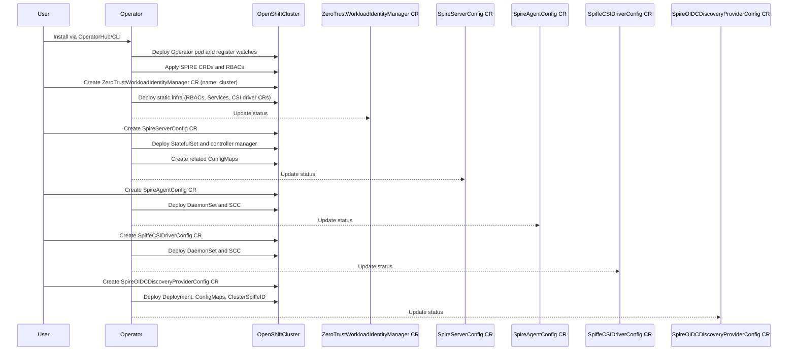

# Zero Trust Workload Identity Manager

## Summary

This enhancement describes the proposal to introduce a `Zero-Trust-Workload-Identity-Manager` for OpenShift, leveraging `SPIFFE` and `SPIRE` to provide a comprehensive identity management solution for distributed systems. SPIFFE/SPIRE provides a standardized approach to workload identity, enabling secure service-to-service communication in dynamic and heterogeneous environments. OpenShift will extend its security capabilities by integrating SPIFFE/SPIRE through a dedicated operator that manages workload identities across the cluster.


The solution introduces a identity management framework designed to address the complex security challenges of modern distributed systems. Key capabilities include implementing SPIFFE identity standards, automating SPIRE agent and server deployment, providing dynamic workload identity provisioning, ensuring verifiable identities for workloads, and supporting automatic certificate rotation and management.


## Motivation
Customers deploying OpenShift require a zero-trust workload identity solution that goes beyond static credentials and perimeter-based security models. Traditional approaches, such as long-lived certificates or manual secret injection, struggle to secure dynamic microservices architectures where workloads scale, migrate, and communicate across clusters. These methods introduce operational complexity, increase the risk of credential leakage, and fail to provide granular, cryptographically verifiable authentication for ephemeral workloads.  

The `Zero-Trust Workload Identity Manager` addresses these challenges by integrating `SPIFFE/SPIRE` natively into OpenShift. This provides automated issuance of short-lived, cryptographically signed identities (SVIDs) to workloads, replacing error-prone manual processes with dynamic identity lifecycle management. By enforcing mutual TLS (mTLS) by default and enabling fine-grained trust boundaries, organizations can secure service-to-service communication in multi-tenant or hybrid environments while reducing operational overhead and aligning with zero-trust security mandates.

### User Stories

- As a openshift cluster administrator, I want to deploy SPIRE components via an operator so that workload identities are managed automatically across the cluster.
- As a openshift cluster administrator, I want to configure trust domains via CRDs so that I can enforce secure isolation between teams or environments.
- As an application developer, I want SPIFFE identities injected into my workloads via the CSI Driver so that I avoid manual certificate management.
- As a security engineer, I want workloads to use short-lived, auto-rotated SVIDs so that mTLS is enforced by default for zero-trust security.
- As a cluster administrator, I want SPIRE metrics in OpenShift Monitoring so that I can proactively resolve identity-related issues.


### Goals

- Automate SPIRE server/agent deployment and lifecycle management via an operator.
- Dynamically provision SPIFFE identities (SVIDs) to workloads using the CSI Driver.
- Enable trust domain configuration through CRDs for secure multi-tenant/multi-cluster isolation.
- Ensure SVIDs have a TTL with automatic rotation to enforce credentials freshness.
- Integrate SPIRE health and performance metrics into OpenShift Monitoring.  

### Non-Goals  
- Replace existing auth systems (e.g., Service Accounts, OAuth).  
- Manage non-workload identities (users).  
- Enforce network-level security policies.  
- Support non-SPIFFE systems or legacy PKI.  
- Establish cross-cluster trust without explicit configuration.  
- Provide dedicated UI/CLI tools in initial release.

## Proposal
A new zero-trust-workload-identity-manager operator will manage the deployment and lifecycle of SPIRE components (server, agents) and the SPIFFE CSI Driver to provide workload identities based on the SPIFFE standard. A singleton Custom Resource (CR) will configure trust boundaries, while WorkloadAttestation CRs define attestation policies for workloads.

### Key Components
- Operator-Managed SPIRE Components
- `SPIRE Server` as a `StatefulSet` for high availability.
- `SPIRE Agents` as a `DaemonSet` (one per node).
- `SPIFFE CSI Driver` as a DaemonSet to inject workload identities (`SVIDs`) into pods.
- Resources `(RBAC, ServiceAccount, ClusterRole, etc.)` are created from static manifest templates.

The operator will create and manage the following resources to deploy SPIRE and SPIFFE components, Please refer `Implementation Details/Notes/Constraints` section for more details:

1. Core Infrastructure
    - Namespaces:
        - `zero-trust-workload-identity-manager` (shared resources)

    - ServiceAccounts:
        - `spire-agent`
        - `spire-server`
        - `spire-spiffe-csi-driver`
        - `spire-spiffe-oidc-discovery-provider`

2. Configuration
    - ConfigMaps:

        - `spire-agent`, `spire-server` (component configurations)
        - `spire-spiffe-oidc-discovery-provider` (OIDC provider settings)
        - `spire-bundle` (trust bundle for certificates)

3. RBAC & Security
    - ClusterRoles:
        - `spire-agent` (read pods/nodes)
        - `spire-controller-manager` (manage SPIRE CRDs)
        - `spire-server` (token reviews, node/pod access)

    - ClusterRoleBindings:
        - Bind roles to SPIRE ServiceAccounts (e.g., `spire-agent`, `spire-server`).

    - SecurityContextConstraints (SCCs):
        - `spire-spiffe-csi-driver` (privileged CSI driver)
        - `spire-agent` (host access for agents)

4. SPIRE Server
    - StatefulSet:
        - `spire-server` (with persistent storage via spire-data PVC).

    - Services:
        - `spire-server` (gRPC endpoint for agent communication).

    - Volume Claims:
        - `spire-data` (1Gi persistent volume for server state).

5. SPIRE Agents
    - DaemonSet:
        - `spire-agent` (deployed per node for workload attestation).

    - Host Access:
        - Runs with `hostPID:true` and `hostNetwork:true` for node-level visibility.

6. SPIFFE CSI Driver
    - DaemonSet:

        - `spire-spiffe-csi-driver` (injects SVIDs into pods via CSI volumes).

    - CSIDriver:
        - `csi.spiffe.io` (supports ephemeral volumes for workload identities).

7. Networking
    - Ingresses:
        - Exposes `OIDC` discovery endpoint (oidc-discovery.apps...).

    - Services:
        - `spire-spiffe-oidc-discovery-provider` (OIDC HTTP service).

Each of the resource created for `zero-trust-workload-identity-manager` will have below set of labels added.
* `app.kubernetes.io/managed-by: zero-trust-workload-identity-manager`
* `app.kubernetes.io/part-of: zero-trust-workload-identity-manager`

Refer below links for more information on the labels used
- [Guidelines for Labels and Annotations for OpenShift applications](https://github.com/redhat-developer/app-labels/blob/master/labels-annotation-for-openshift.adoc)
- [Well-Known Labels, Annotations and Taints](https://kubernetes.io/docs/reference/labels-annotations-taints/)

### Workflow Description

The Zero-Trust Workload Identity Manager Operator automates the following workflow within OpenShift cluster:

1.  **Installation and Initial Setup:**
    * The operator is installed via the OpenShift OperatorHub or CLI, managed by OLM.
    * Upon deployment, the operator registers watches for relevant Kubernetes resources (Deployments, StatefulSets, DaemonSets, CustomResourceDefinitions, etc).
    * The operator applies the necessary SPIRE Custom Resource Definitions (CRDs) to the OpenShift cluster.
    * The operator applies foundational RBAC resources (ClusterRoles, ClusterRoleBindings, ServiceAccounts) for the operator components.

2.  **Operand static resources Deployment and Management:**
    * On the deployment the operator will deploy the CR for ZeroTrustWorkloadIdentityManager resource named `cluster` which will be managed by a controller, which is responsible for managing and operands static resources like RBACs resources, Service Accounts, Services, CSI drivers resource etc.
    * The status of the controller's reconcile should be reflecting on the resource's status field. 

3.  **SPIRE Servers Deployments and Management:**
    * When user wants to deploy the spire servers statefulset, spire-controller manager deployments and configmaps for spire-server, controller manager and spire-bundle based on the user validated input, they would need to deploy a CR for `SpireServerConfig` resource named `cluster` for the controller to start managing the spire server via controller.
    * The status of the controller's reconcile should be reflecting on the resource's status field

4.  **SPIRE Agent Deployments and Management:**
    * When user wants to deploy the spire-agents as daemonset, SCC resource and configmaps for spire-agents based on the user validated input, they would need to deploy a CR for `SpireAgentConfig` resource named `cluster` for the controller to start managing the spire agents deployments via controller.
    * The status of the controller's reconcile should be reflecting on the resource's status field

5.  **SPIFFE CSI Deployments and Management:**
    * When user wants to deploy the spiffe-csi-drivers as daemonset, SCC resource based on the user validated input, they would need to deploy a CR for `SpiffeCSIDriverConfigSpec` resource named `cluster` for the controller to start managing the spiffe-csi-driver deployments via controller.
    * The status of the controller's reconcile should be reflecting on the resource's status field

6.  **SPIRE OIDC Discovery Provider Deployments and Management:**
    * When user wants to deploy the spire OIDC discivery provider deployments, SCC resource, configmaps for oidc deployments and default ClusterSpiffeID resources based on the user validated input, they would need to deploy a CR for `SpireOIDCDiscoveryProviderConfig` resource named `cluster` for the controller to start managing the spiffe-csi-driver deployments via controller.
    * The status of the controller's reconcile should be reflecting on the resource's status field

---

#### Visual Workflow  



### API Extensions

The Zero trust workload Identity manager includes 5 sets of APIs which follows seperate use cases for each components the operator manages.

- `ZeroTrustWorkloadIdentityManager` : Manages the static resources required for the operands.
``` golang
// ZeroTrustWorkloadIdentityManager defines the configuration for the
// operator that manages the lifecycle of SPIRE components in OpenShift
// clusters.
//
// Note: This resource is **operator-facing only**. It should not contain
// low-level configuration for SPIRE components, which is managed separately
// in the SpireConfig CRD.
type ZeroTrustWorkloadIdentityManager struct {
	metav1.TypeMeta   `json:",inline"`
	metav1.ObjectMeta `json:"metadata,omitempty"`
	Spec              ZeroTrustWorkloadIdentityManagerSpec   `json:"spec,omitempty"`
	Status            ZeroTrustWorkloadIdentityManagerStatus `json:"status,omitempty"`
}

// ZeroTrustWorkloadIdentityManagerStatus defines the observed state of ZeroTrustWorkloadIdentityManager
type ZeroTrustWorkloadIdentityManagerStatus struct {
	// conditions holds information of the current state of the zero-trust-workload-identity-manager deployment.
	ConditionalStatus `json:",inline,omitempty"`
}

// ZeroTrustWorkloadIdentityManagerSpec defines the desired state of ZeroTrustWorkloadIdentityManager
type ZeroTrustWorkloadIdentityManagerSpec struct {
	// logLevel supports value range as per [kubernetes logging guidelines](https://github.com/kubernetes/community/blob/master/contributors/devel/sig-instrumentation/logging.md#what-method-to-use).
	// +kubebuilder:default:=1
	// +kubebuilder:validation:Minimum:=1
	// +kubebuilder:validation:Maximum:=5
	// +kubebuilder:validation:Optional
	LogLevel int32 `json:"logLevel,omitempty"`

	// namespace is for configuring the namespace to install the operator deployments.
	// +kubebuilder:validation:Optional
	// +kubebuilder:default:="zero-trust-workload-identity-manager"
	Namespace string `json:"namespace,omitempty"`

	CommonConfig `json:",inline"`
}

// CommonConfig will have similar config required for all other APIs
type CommonConfig struct {
	// labels to apply to all resources managed by the API.
	// +mapType=granular
	// +kubebuilder:validation:Optional
	Labels map[string]string `json:"labels,omitempty"`

	// resources are for defining the resource requirements.
	// ref: https://kubernetes.io/docs/concepts/configuration/manage-resources-containers/
	// +kubebuilder:validation:Optional
	Resources *corev1.ResourceRequirements `json:"resources,omitempty"`

	// affinity is for setting scheduling affinity rules.
	// ref: https://kubernetes.io/docs/concepts/scheduling-eviction/assign-pod-node/
	// +kubebuilder:validation:Optional
	Affinity *corev1.Affinity `json:"affinity,omitempty"`

	// tolerations are for setting the pod tolerations.
	// ref: https://kubernetes.io/docs/concepts/scheduling-eviction/taint-and-toleration/
	// +kubebuilder:validation:Optional
	// +listType=atomic
	Tolerations []*corev1.Toleration `json:"tolerations,omitempty"`

	// nodeSelector is for defining the scheduling criteria using node labels.
	// ref: https://kubernetes.io/docs/concepts/configuration/assign-pod-node/
	// +kubebuilder:validation:Optional
	// +mapType=atomic
	NodeSelector map[string]string `json:"nodeSelector,omitempty"`
}
```

- `SpireServerConfig` : Manages the configs required for the spire servers Statefulsets and configmaps resources.

``` golang
// SpireServerConfig defines the configuration for the SPIRE Server managed by zero trust workload identity manager.
// This includes details related to trust domain, data storage, plugins
// and other configs required for workload authentication.
type SpireServerConfig struct {
	metav1.TypeMeta   `json:",inline"`
	metav1.ObjectMeta `json:"metadata,omitempty"`
	Spec              SpireServerConfigSpec   `json:"spec,omitempty"`
	Status            SpireServerConfigStatus `json:"status,omitempty"`
}

// SpireServerConfigSpec will have specifications for configuration related to the spire server.
type SpireServerConfigSpec struct {

	// trustDomain to be used for the SPIFFE identifiers
	// +kubebuilder:validation:Required
	TrustDomain string `json:"trustDomain,omitempty"`

	// clusterName will have the cluster name required to configure spire server.
	// +kubebuilder:validation:Required
	ClusterName string `json:"clusterName,omitempty"`

	// bundleConfigMap is Configmap name for Spire bundle, it sets the trust domain to be used for the SPIFFE identifiers
	// +kubebuilder:validation:Optional
	// +kubebuilder:default:=spire-bundle
	BundleConfigMap string `json:"bundleConfigMap"`

	// jwtIssuer is the JWT issuer domain. Defaults to oidc-discovery.$trustDomain if unset
	// +kubebuilder:validation:Optional
	JwtIssuer string `json:"jwtIssuer,omitempty"`

	// spireServerKeyManager has configs for the spire server key manager.
	// +kubebuilder:validation:Optional
	SpireServerKeyManager *SpireServerKeyManager `json:"spireServerKeyManager,omitempty"`

	// caSubject contains subject information for the Spire CA.
	// +kubebuilder:validation:Optional
	CASubject *CASubject `json:"caSubject,omitempty"`

	// persistence has config for spire server volume related configs
	// +kubebuilder:validation:Optional
	Persistence *Persistence `json:"persistence,omitempty"`

	// spireSQLConfig has the config required for the spire server SQL DataStore.
	// +kubebuilder:validation:Optional
	Datastore *DataStore `json:"spireSQLConfig,omitempty"`

	CommonConfig `json:",inline"`
}

// Persistence defines volume-related settings.
type Persistence struct {
	// type of volume to use for persistence.
	// +kubebuilder:validation:Enum=pvc;hostPath;emptyDir
	// +kubebuilder:default:=pvc
	Type string `json:"type"`

	// size of the persistent volume (e.g., 1Gi).
	// +kubebuilder:validation:Pattern=^[1-9][0-9]*Gi$
	// +kubebuilder:default:="1Gi"
	Size string `json:"size"`

	// accessMode for the volume.
	// +kubebuilder:validation:Enum=ReadWriteOnce;ReadWriteOncePod;ReadWriteMany
	// +kubebuilder:default:=ReadWriteOnce
	AccessMode string `json:"accessMode"`

	// storageClass to be used for the PVC.
	// +kubebuilder:validation:optional
	// +kubebuilder:default:=""
	StorageClass string `json:"storageClass,omitempty"`

	// hostPath to be used when type is hostPath.
	// +kubebuilder:validation:optional
	// +kubebuilder:default:=""
	HostPath string `json:"hostPath,omitempty"`
}

// DataStore configures the Spire SQL datastore backend.
type DataStore struct {
	// databaseType specifies type of database to use.
	// +kubebuilder:validation:Enum=sql;sqlite3;postgres;mysql;aws_postgresql;aws_mysql
	// +kubebuilder:default:=sqlite3
	DatabaseType string `json:"databaseType"`

	// connectionString contain connection credentials required for spire server Datastore.
	// +kubebuilder:default:=/run/spire/data/datastore.sqlite3
	ConnectionString string `json:"connectionString"`

	// options specifies extra DB options.
	// +kubebuilder:validation:optional
	// +kubebuilder:default:={}
	Options []string `json:"options,omitempty"`

	// MySQL TLS options.
	// +kubebuilder:default:=""
	RootCAPath     string `json:"rootCAPath,omitempty"`
	ClientCertPath string `json:"clientCertPath,omitempty"`
	ClientKeyPath  string `json:"clientKeyPath,omitempty"`

	// DB pool config
	// maxOpenConns will specify the maximum connections for the DB pool.
	// +kubebuilder:validation:Minimum=0
	// +kubebuilder:default:=100
	MaxOpenConns int `json:"maxOpenConns"`

	// maxIdleConns specifies the maximum idle connection to be configured.
	// +kubebuilder:validation:Minimum=0
	// +kubebuilder:default:=2
	MaxIdleConns int `json:"maxIdleConns"`

	// connMaxLifetime will specify maximum lifetime connections.
	// Max time (in seconds) a connection may live.
	// +kubebuilder:validation:Minimum=0
	ConnMaxLifetime int `json:"connMaxLifetime"`

	// disableMigration specifies the migration state
	// If true, disables DB auto-migration.
	// +kubebuilder:default:="false"
	// +kubebuilder:validation:Enum:="true";"false"
	// +kubebuilder:validation:Optional
	DisableMigration string `json:"disableMigration"`
}

// SpireServerKeyManager will contain configs for the spire server key manager
type SpireServerKeyManager struct {
	// diskEnabled is a flag to enable keyManager on disk.
	// +kubebuilder:default:="true"
	// +kubebuilder:validation:Enum:="true";"false"
	// +kubebuilder:validation:Optional
	DiskEnabled string `json:"diskEnabled,omitempty"`

	// memoryEnabled is a flag to enable keyManager on memory
	// +kubebuilder:default:="false"
	// +kubebuilder:validation:Enum:="true";"false"
	// +kubebuilder:validation:Optional
	MemoryEnabled string `json:"memoryEnabled,omitempty"`
}

// CASubject defines the subject information for the Spire CA.
// +kubebuilder:validation:Optional
type CASubject struct {
	// country specifies the country for the CA.
	// +kubebuilder:validation:Optional
	Country string `json:"country,omitempty"`

	// organization specifies the organization for the CA.
	// +kubebuilder:validation:Optional
	Organization string `json:"organization,omitempty"`

	// commonName specifies the common name for the CA.
	// +kubebuilder:validation:Optional
	CommonName string `json:"commonName,omitempty"`
}

// SpireServerConfigStatus defines the observed state of spire-server related reconciliation made by operator
type SpireServerConfigStatus struct {
	// conditions holds information of the current state of the spire-server resources.
	ConditionalStatus `json:",inline,omitempty"`
}
```

- `SpireAgentConfig`: Manages the configs required for the spire agents Daemonsets, SCCs and configmaps resources.

```golang
// SpireAgentConfig defines the configuration for the SPIRE Agent managed by zero trust workload identity manager.
// The agent runs on each node and is responsible for node attestation,
// SVID rotation, and exposing the Workload API to local workloads.
type SpireAgentConfig struct {
	metav1.TypeMeta   `json:",inline"`
	metav1.ObjectMeta `json:"metadata,omitempty"`
	Spec              SpireAgentConfigSpec   `json:"spec,omitempty"`
	Status            SpireAgentConfigStatus `json:"status,omitempty"`
}

// SpireAgentConfigSpec will have specifications for configuration related to the spire agents.
type SpireAgentConfigSpec struct {

	// trustDomain to be used for the SPIFFE identifiers
	// +kubebuilder:validation:Required
	TrustDomain string `json:"trustDomain,omitempty"`

	// clusterName will have the cluster name required to configure spire agent.
	// +kubebuilder:validation:Required
	ClusterName string `json:"clusterName,omitempty"`

	// bundleConfigMap is Configmap name for Spire bundle, it sets the trust domain to be used for the SPIFFE identifiers
	// +kubebuilder:validation:Optional
	// +kubebuilder:default:=spire-bundle
	BundleConfigMap string `json:"bundleConfigMap"`

	// nodeAttestor specifies the configuration for the Node Attestor.
	// +kubebuilder:validation:Optional
	NodeAttestor *NodeAttestor `json:"nodeAttestor,omitempty"`

	// workloadAttestors specifies the configuration for the Workload Attestors.
	// +kubebuilder:validation:Optional
	WorkloadAttestors *WorkloadAttestors `json:"workloadAttestors,omitempty"`

	CommonConfig `json:",inline"`
}

// NodeAttestor defines the configuration for the Node Attestor.
type NodeAttestor struct {
	// k8sPSATEnabled tells if k8sPSAT configuration is enabled
	// +kubebuilder:default:="true"
	// +kubebuilder:validation:Enum:="true";"false"
	// +kubebuilder:validation:Optional
	K8sPSATEnabled string `json:"k8sPSATEnabled,omitempty"`
}

// WorkloadAttestors defines the configuration for the Workload Attestors.
// +kubebuilder:validation:Optional
type WorkloadAttestors struct {

	// k8sEnabled explains if the configuration is enabled for k8s.
	// +kubebuilder:default:="true"
	// +kubebuilder:validation:Enum:="true";"false"
	// +kubebuilder:validation:Optional
	K8sEnabled string `json:"k8sEnabled,omitempty"`

	// workloadAttestorsVerification tells what kind of verification to do against kubelet.
	// auto will first attempt to use hostCert, and then fall back to apiServerCA.
	// Valid options are [auto, hostCert, apiServerCA, skip]
	// +kubebuilder:validation:Optional
	WorkloadAttestorsVerification *WorkloadAttestorsVerification `json:"workloadAttestorsVerification,omitempty"`

	// disableContainerSelectors specifies whether to disable container selectors in the Kubernetes workload attestor.
	// Set to true if using holdApplicationUntilProxyStarts in Istio
	// +kubebuilder:default:="false"
	// +kubebuilder:validation:Enum:="true";"false"
	// +kubebuilder:validation:Optional
	DisableContainerSelectors string `json:"disableContainerSelectors,omitempty"`

	// useNewContainerLocator enables the new container locator algorithm that has support for cgroups v2.
	// Defaults to true
	// +kubebuilder:default:="true"
	// +kubebuilder:validation:Enum:="true";"false"
	// +kubebuilder:validation:Optional
	UseNewContainerLocator string `json:"useNewContainerLocator,omitempty"`
}

type WorkloadAttestorsVerification struct {
	// type specifies the type of verification to be used.
	// +kubebuilder: default:="skip"
	Type string `json:"type,omitempty"`

	// hostCertBasePath specifies the base Path where kubelet places its certificates.
	// +kubebuilder:validation:Optional
	// +kubebuilder:default:="/var/lib/kubelet/pki"
	HostCertBasePath string `json:"hostCertBasePath,omitempty"`

	// hostCertFileName specifies the file name for the host certificate.
	// +kubebuilder:validation:Optional
	HostCertFileName string `json:"hostCertFileName,omitempty"`
}

// SpireAgentConfigStatus defines the observed state of spire agents related reconciliation made by operator
type SpireAgentConfigStatus struct {
	// conditions holds information of the current state of the spire agents deployment.
	ConditionalStatus `json:",inline,omitempty"`
}
```

- `SpiffeCSIDriverConfig`: Manages the configs required for the spiffe csi Daemonsets and SCCs resources.

```golang
// SpiffeCSIDriverConfig defines the configuration for the SPIFFE CSI Driver managed by zero trust workload identity manager.
// This includes settings related to the registration, socket paths, plugin name and optional runtime flags that influence how the driver operates.
type SpiffeCSIDriverConfig struct {
	metav1.TypeMeta   `json:",inline"`
	metav1.ObjectMeta `json:"metadata,omitempty"`
	Spec              SpiffeCSIDriverConfigSpec   `json:"spec,omitempty"`
	Status            SpiffeCSIDriverConfigStatus `json:"status,omitempty"`
}

// SpiffeCSIDriverConfigSpec will have specifications for configuration related to the spiffe-csi driver.
type SpiffeCSIDriverConfigSpec struct {

	// agentSocketPath is the path to spiffe csi driver the agent socket.
	// +kubebuilder:default:="/run/spire/agent-sockets/spire-agent.sock"
	AgentSocket string `json:"agentSocketPath,omitempty"`

	// pluginName defines the name of the CSI plugin, Sets the csi driver name deployed to the cluster.
	// +kubebuilder:default:="csi.spiffe.io"
	PluginName string `json:"pluginName,omitempty"`

	CommonConfig `json:",inline"`
}

// SpiffeCSIDriverConfigStatus defines the observed state of spiffe csi driver related reconciliation  made by operator
type SpiffeCSIDriverConfigStatus struct {
	// conditions holds information of the states of spiffe csi driver related changes.
	ConditionalStatus `json:",inline,omitempty"`
}

// +kubebuilder:object:root=true
// +k8s:deepcopy-gen:interfaces=k8s.io/apimachinery/pkg/runtime.Object

// SpiffeCSIDriverConfigList contain the list of SpiffeCSIDriverConfig
type SpiffeCSIDriverConfigList struct {
	metav1.TypeMeta `json:",inline"`
	metav1.ListMeta `json:"metadata,omitempty"`
	Items           []SpiffeCSIDriverConfig `json:"items"`
}
```

- `SpireOIDCDiscoveryProviderConfig`: Manages the configs required for the spire con and configmaps resources.
```golang
// SpireOIDCDiscoveryProviderConfig defines the configuration for the SPIRE OIDC Discovery Provider managed by zero trust workload identity manager.
// This component allows workloads to authenticate using SPIFFE SVIDs via standard OIDC protocols.
type SpireOIDCDiscoveryProviderConfig struct {
	metav1.TypeMeta   `json:",inline"`
	metav1.ObjectMeta `json:"metadata,omitempty"`
	Spec              SpireOIDCDiscoveryProviderConfigSpec   `json:"spec,omitempty"`
	Status            SpireOIDCDiscoveryProviderConfigStatus `json:"status,omitempty"`
}

// SpireOIDCDiscoveryProviderConfigSpec will have specifications for configuration related to the spire oidc
// discovery provider
type SpireOIDCDiscoveryProviderConfigSpec struct {

	// trustDomain to be used for the SPIFFE identifiers
	// +kubebuilder:validation:Required
	TrustDomain string `json:"trustDomain,omitempty"`

	// agentSocketName is the name of the agent socket.
	// +kubebuilder:default:="spire-agent.sock"
	AgentSocketName string `json:"agentSocketName,omitempty"`

	// jwtIssuer is jwtIssuerPath to JWT issuer. Defaults to oidc-discovery.$trustDomain if unset
	// +kubebuilder:validation:Optional
	JwtIssuer string `json:"jwtIssuer,omitempty"`

	// replicaCount is the number of replicas for the OIDC provider.
	// +kubebuilder:validation:Optional
	// +kubebuilder:default:=1
	ReplicaCount int `json:"replicaCount,omitempty"`

	CommonConfig `json:",inline"`
}

// SpireOIDCDiscoveryProviderConfigStatus defines the observed state of spire-oidc discovery provider
// related reconciliation made by operator
type SpireOIDCDiscoveryProviderConfigStatus struct {
	// conditions holds information of the current state of the spire-oidc resources.
	ConditionalStatus `json:",inline,omitempty"`
}
```

### Topology Considerations

#### Hypershift / Hosted Control Planes
None.

#### Standalone Clusters
None.

#### Single-node Deployments or MicroShift
None.

### Implementation Details/Notes/Constraints
Below are the example static manifests used for creating required resources for installing `zero-trust-workload-identity-manager`.

1. ServiceAccounts

```yaml
apiVersion: v1
kind: ServiceAccount
metadata:
  name: spire-spiffe-csi-driver
  namespace: zero-trust-workload-identity-manager
  labels:
    app.kubernetes.io/name: spiffe-csi-driver
    app.kubernetes.io/instance: spire
    app.kubernetes.io/version: "0.2.6"
    app.kubernetes.io/managed-by: "zero-trust-workload-identity-manager"
    app.kubernetes.io/part-of: "zero-trust-workload-identity-manager"


```

```yaml
apiVersion: v1
kind: ServiceAccount
metadata:
  name: spire-spiffe-oidc-discovery-provider
  namespace: zero-trust-workload-identity-manager
  labels:
    app.kubernetes.io/name: spiffe-oidc-discovery-provider
    app.kubernetes.io/instance: spire
    app.kubernetes.io/version: "1.12.0"
    app.kubernetes.io/managed-by: "zero-trust-workload-identity-manager"
    app.kubernetes.io/part-of: "zero-trust-workload-identity-manager"
```
```yaml
apiVersion: v1
kind: ServiceAccount
metadata:
  name: "spire-agent"
  namespace: "zero-trust-workload-identity-manager"
  labels:
    app.kubernetes.io/name: "agent"
    app.kubernetes.io/instance: "spire"
    app.kubernetes.io/version: "1.12.0"
    app.kubernetes.io/managed-by: "zero-trust-workload-identity-manager"
    app.kubernetes.io/part-of: "zero-trust-workload-identity-manager"
```

```yaml
apiVersion: v1
kind: ServiceAccount
metadata:
  name: spire-server
  namespace: zero-trust-workload-identity-manager
  labels:
    app.kubernetes.io/name: server
    app.kubernetes.io/instance: spire
    app.kubernetes.io/version: "1.12.0"
    app.kubernetes.io/managed-by: "zero-trust-workload-identity-manager"
    app.kubernetes.io/part-of: "zero-trust-workload-identity-manager"
```

2. ClusterRoles and Roles required by `zero-trust-workload-identity-manager`.

```yaml
kind: ClusterRole
apiVersion: rbac.authorization.k8s.io/v1
metadata:
  name: "spire-agent"
  labels:
    app.kubernetes.io/name: "agent"
    app.kubernetes.io/instance: "spire"
    app.kubernetes.io/version: "1.12.0"
    app.kubernetes.io/managed-by: "zero-trust-workload-identity-manager"
    app.kubernetes.io/part-of: "zero-trust-workload-identity-manager"
rules:
  - apiGroups: [""]
    resources:
      - pods
      - nodes
      - nodes/proxy
    verbs: ["get"]
```

``` yaml
apiVersion: rbac.authorization.k8s.io/v1
kind: ClusterRole
metadata:
  name: spire-controller-manager
  labels:
    app.kubernetes.io/name: server
    app.kubernetes.io/instance: spire
    app.kubernetes.io/version: "1.12.0"
    app.kubernetes.io/managed-by: "zero-trust-workload-identity-manager"
    app.kubernetes.io/part-of: "zero-trust-workload-identity-manager"
rules:
  - apiGroups: [""]
    resources: ["namespaces"]
    verbs: ["get", "list", "watch"]
  - apiGroups: ["admissionregistration.k8s.io"]
    resources: ["validatingwebhookconfigurations"]
    verbs: ["get", "list", "patch", "watch"]
  - apiGroups: [""]
    resources: ["nodes"]
    verbs: ["get", "list", "watch"]
  - apiGroups: [""]
    resources: ["endpoints"]
    verbs: ["get", "list", "watch"]
  - apiGroups: [""]
    resources: ["pods"]
    verbs: ["get", "list", "watch"]
  - apiGroups: ["spire.spiffe.io"]
    resources: ["clusterfederatedtrustdomains"]
    verbs: ["get", "list", "watch", "create", "update", "patch", "delete"]
  - apiGroups: ["spire.spiffe.io"]
    resources: ["clusterfederatedtrustdomains/finalizers"]
    verbs: ["update"]
  - apiGroups: ["spire.spiffe.io"]
    resources: ["clusterfederatedtrustdomains/status"]
    verbs: ["get", "patch", "update"]
  - apiGroups: ["spire.spiffe.io"]
    resources: ["clusterspiffeids"]
    verbs: ["get", "list", "watch", "create", "update", "patch", "delete"]
  - apiGroups: ["spire.spiffe.io"]
    resources: ["clusterspiffeids/finalizers"]
    verbs: ["update"]
  - apiGroups: ["spire.spiffe.io"]
    resources: ["clusterspiffeids/status"]
    verbs: ["get", "patch", "update"]
  - apiGroups: ["spire.spiffe.io"]
    resources: ["clusterstaticentries"]
    verbs: ["create", "delete", "get", "list", "patch", "update", "watch"]
  - apiGroups: ["spire.spiffe.io"]
    resources: ["clusterstaticentries/finalizers"]
    verbs: ["update"]
  - apiGroups: ["spire.spiffe.io"]
    resources: ["clusterstaticentries/status"]
    verbs: ["get", "patch", "update"]
```

```yaml
kind: ClusterRole
apiVersion: rbac.authorization.k8s.io/v1
metadata:
  name: spire-server
  labels:
    app.kubernetes.io/name: server
    app.kubernetes.io/instance: spire
    app.kubernetes.io/version: "1.12.0"
    app.kubernetes.io/managed-by: "zero-trust-workload-identity-manager"
    app.kubernetes.io/part-of: "zero-trust-workload-identity-manager"
rules:
  - apiGroups: [authentication.k8s.io]
    resources: [tokenreviews]
    verbs:
      - get
      - watch
      - list
      - create
  - apiGroups: [""]
    resources: [nodes, pods]
    verbs:
      - get
      - list

```

```yaml
kind: ClusterRoleBinding
apiVersion: rbac.authorization.k8s.io/v1
metadata:
  name: "spire-agent"
  labels:
    app.kubernetes.io/name: "agent"
    app.kubernetes.io/instance: "spire"
    app.kubernetes.io/version: "1.12.0"
    app.kubernetes.io/managed-by: "zero-trust-workload-identity-manager"
    app.kubernetes.io/part-of: "zero-trust-workload-identity-manager"
subjects:
  - kind: ServiceAccount
    name: "spire-agent"
    namespace: "zero-trust-workload-identity-manager"
roleRef:
  kind: ClusterRole
  name: "spire-agent"
  apiGroup: rbac.authorization.k8s.io

```

```yaml
apiVersion: rbac.authorization.k8s.io/v1
kind: ClusterRoleBinding
metadata:
  name: spire-controller-manager
  labels:
    app.kubernetes.io/name: server
    app.kubernetes.io/instance: spire
    app.kubernetes.io/version: "1.12.0"
    app.kubernetes.io/managed-by: "zero-trust-workload-identity-manager"
    app.kubernetes.io/part-of: "zero-trust-workload-identity-manager"
roleRef:
  apiGroup: rbac.authorization.k8s.io
  kind: ClusterRole
  name: spire-controller-manager
subjects:
  - kind: ServiceAccount
    name: spire-server
    namespace: zero-trust-workload-identity-manager

```

```yaml
# Binds above cluster role to spire-server service account
kind: ClusterRoleBinding
apiVersion: rbac.authorization.k8s.io/v1
metadata:
  name: spire-server
  labels:
    app.kubernetes.io/name: server
    app.kubernetes.io/instance: spire
    app.kubernetes.io/version: "1.12.0"
    app.kubernetes.io/managed-by: "zero-trust-workload-identity-manager"
    app.kubernetes.io/part-of: "zero-trust-workload-identity-manager"
subjects:
  - kind: ServiceAccount
    name: spire-server
    namespace: zero-trust-workload-identity-manager
roleRef:
  kind: ClusterRole
  name: spire-server
  apiGroup: rbac.authorization.k8s.io
```

```yaml 
apiVersion: rbac.authorization.k8s.io/v1
kind: Role
metadata:
  name: spire-controller-manager-leader-election
  namespace: zero-trust-workload-identity-manager
  labels:
    app.kubernetes.io/name: server
    app.kubernetes.io/instance: spire
    app.kubernetes.io/version: "1.12.0"
    app.kubernetes.io/managed-by: "zero-trust-workload-identity-manager"
    app.kubernetes.io/part-of: "zero-trust-workload-identity-manager"
rules:
  - apiGroups: [""]
    resources: ["configmaps"]
    verbs: ["get", "list", "watch", "create", "update", "patch", "delete"]
  - apiGroups: ["coordination.k8s.io"]
    resources: ["leases"]
    verbs: ["get", "list", "watch", "create", "update", "patch", "delete"]
  - apiGroups: [""]
    resources: ["events"]
    verbs: ["create", "patch"]
```

```yaml
kind: Role
apiVersion: rbac.authorization.k8s.io/v1
metadata:
  name: spire-bundle
  namespace: zero-trust-workload-identity-manager
  labels:
    app.kubernetes.io/name: server
    app.kubernetes.io/instance: spire
    app.kubernetes.io/version: "1.12.0"
    app.kubernetes.io/managed-by: "zero-trust-workload-identity-manager"
    app.kubernetes.io/part-of: "zero-trust-workload-identity-manager"
rules:
  - apiGroups: [""]
    resources: [configmaps]
    resourceNames: [spire-bundle]
    verbs:
      - get
      - patch

```

```yaml
apiVersion: rbac.authorization.k8s.io/v1
kind: RoleBinding
metadata:
  name: spire-controller-manager-leader-election
  namespace: zero-trust-workload-identity-manager
  labels:
    app.kubernetes.io/name: server
    app.kubernetes.io/instance: spire
    app.kubernetes.io/version: "1.12.0"
    app.kubernetes.io/managed-by: "zero-trust-workload-identity-manager"
    app.kubernetes.io/part-of: "zero-trust-workload-identity-manager"
roleRef:
  apiGroup: rbac.authorization.k8s.io
  kind: Role
  name: spire-controller-manager-leader-election

subjects:
  - kind: ServiceAccount
    name: spire-server
    namespace: zero-trust-workload-identity-manager
```

```yaml 
kind: RoleBinding
apiVersion: rbac.authorization.k8s.io/v1
metadata:
  name: spire-bundle
  namespace: zero-trust-workload-identity-manager
  labels:
    app.kubernetes.io/name: server
    app.kubernetes.io/instance: spire
    app.kubernetes.io/version: "1.12.0"
    app.kubernetes.io/managed-by: "zero-trust-workload-identity-manager"
    app.kubernetes.io/part-of: "zero-trust-workload-identity-manager"
subjects:
  - kind: ServiceAccount
    name: spire-server
    namespace: zero-trust-workload-identity-manager
roleRef:
  kind: Role
  name: spire-bundle
  apiGroup: rbac.authorization.k8s.io
```

3. Service for `spire` operands.
```yaml 
apiVersion: v1
kind: Service
metadata:
  name: spire-spiffe-oidc-discovery-provider
  namespace: zero-trust-workload-identity-manager
  labels:
    app.kubernetes.io/name: spiffe-oidc-discovery-provider
    app.kubernetes.io/instance: spire
    app.kubernetes.io/version: "1.12.0"
    app.kubernetes.io/managed-by: "zero-trust-workload-identity-manager"
    app.kubernetes.io/part-of: "zero-trust-workload-identity-manager"
spec:
  type: ClusterIP
  ports:
    - name: https
      port: 443
      targetPort: https
      protocol: TCP
  selector:
    app.kubernetes.io/name: spiffe-oidc-discovery-provider
    app.kubernetes.io/instance: spire
```

```yaml 
apiVersion: v1
kind: Service
metadata:
  name: spire-controller-manager-webhook
  namespace: zero-trust-workload-identity-manager
  labels:
    app.kubernetes.io/name: server
    app.kubernetes.io/instance: spire
    app.kubernetes.io/version: "1.12.0"
    app.kubernetes.io/managed-by: "zero-trust-workload-identity-manager"
    app.kubernetes.io/part-of: "zero-trust-workload-identity-manager"
spec:
  type: ClusterIP
  ports:
    - name: https
      port: 443
      targetPort: https
      protocol: TCP
  selector:
    app.kubernetes.io/name: server
    app.kubernetes.io/instance: spire
```

```yaml
apiVersion: v1
kind: Service
metadata:
  name: spire-server
  namespace: zero-trust-workload-identity-manager
  labels:
    app.kubernetes.io/name: server
    app.kubernetes.io/instance: spire
    app.kubernetes.io/version: "1.12.0"
    app.kubernetes.io/managed-by: "zero-trust-workload-identity-manager"
    app.kubernetes.io/part-of: "zero-trust-workload-identity-manager"
spec:
  type: ClusterIP
  ports:
    - name: grpc
      port: 443
      targetPort: grpc
      protocol: TCP
  selector:
    app.kubernetes.io/name: server
    app.kubernetes.io/instance: spire
```
4. DaemonSets for `spire-agents` and `spiffe-csi-driver`
```yaml
apiVersion: apps/v1
kind: DaemonSet
metadata:
  name: spire-spiffe-csi-driver
  namespace: <operand-namespace>
  labels:
    helm.sh/chart: spiffe-csi-driver-0.1.0
    app.kubernetes.io/name: spiffe-csi-driver
    app.kubernetes.io/instance: spire
    app.kubernetes.io/version: "0.2.3"
    app.kubernetes.io/managed-by: Helm
spec:
  selector:
    matchLabels:
      app.kubernetes.io/name: spiffe-csi-driver
      app.kubernetes.io/instance: spire
  updateStrategy:
    type: RollingUpdate
    rollingUpdate:
      maxUnavailable: 1
  template:
    metadata:
      labels:
        app.kubernetes.io/name: spiffe-csi-driver
        app.kubernetes.io/instance: spire
    spec:
      serviceAccountName: spire-spiffe-csi-driver
      
      initContainers:
        - name: set-context
          command:
            - chcon
            - '-Rvt'
            - container_file_t
            - spire-agent-socket/
          image: registry.access.redhat.com/ubi9:latest
          imagePullPolicy: Always
          securityContext:
            capabilities:
              drop:
                - all
            privileged: true
          volumeMounts:
            - name: spire-agent-socket-dir
              mountPath: /spire-agent-socket
          terminationMessagePolicy: File
          terminationMessagePath: /dev/termination-log
      containers:
        # This is the container which runs the SPIFFE CSI driver.
        - name: spiffe-csi-driver
          image: <SPIFFE-CSI-IMAGE-NAME>
          imagePullPolicy: IfNotPresent
          args: [
            "-workload-api-socket-dir", "/spire-agent-socket",
            "-plugin-name", "csi.spiffe.io",
            "-csi-socket-path", "/spiffe-csi/csi.sock",
          ]
          env:
            # The CSI driver needs a unique node ID. The node name can be
            # used for this purpose.
            - name: MY_NODE_NAME
              valueFrom:
                fieldRef:
                  fieldPath: spec.nodeName
          volumeMounts:
            # The volume containing the SPIRE agent socket. The SPIFFE CSI
            # driver will mount this directory into containers.
            - mountPath: /spire-agent-socket
              name: spire-agent-socket-dir
              readOnly: true
            # The volume that will contain the CSI driver socket shared
            # with the kubelet and the driver registrar.
            - mountPath: /spiffe-csi
              name: spiffe-csi-socket-dir
            # The volume containing mount points for containers.
            - mountPath: /var/lib/kubelet/pods
              mountPropagation: Bidirectional
              name: mountpoint-dir
          securityContext:
            readOnlyRootFilesystem: true
            capabilities:
              drop:
                - all
            privileged: true
          resources:
            {}
        # This container runs the CSI Node Driver Registrar which takes care
        # of all the little details required to register a CSI driver with
        # the kubelet.
        - name: node-driver-registrar
          image: registry.k8s.io/sig-storage/csi-node-driver-registrar:v2.9.4
          imagePullPolicy: IfNotPresent
          args: [
            "-csi-address", "/spiffe-csi/csi.sock",
            "-kubelet-registration-path", "/var/lib/kubelet/plugins/csi.spiffe.io/csi.sock",
            "-health-port", "9809"
          ]
          volumeMounts:
            # The registrar needs access to the SPIFFE CSI driver socket
            - mountPath: /spiffe-csi
              name: spiffe-csi-socket-dir
            # The registrar needs access to the Kubelet plugin registration
            # directory
            - name: kubelet-plugin-registration-dir
              mountPath: /registration
          ports:
            - containerPort: 9809
              name: healthz
          livenessProbe:
            httpGet:
              path: /healthz
              port: healthz
            initialDelaySeconds: 5
            timeoutSeconds: 5
          resources:
            {}
      volumes:
        - name: spire-agent-socket-dir
          hostPath:
            path: /run/spire/agent-sockets
            type: DirectoryOrCreate
        # This volume is where the socket for kubelet->driver communication lives
        - name: spiffe-csi-socket-dir
          hostPath:
            path: /var/lib/kubelet/plugins/csi.spiffe.io
            type: DirectoryOrCreate
        # This volume is where the SPIFFE CSI driver mounts volumes
        - name: mountpoint-dir
          hostPath:
            path: /var/lib/kubelet/pods
            type: Directory
        # This volume is where the node-driver-registrar registers the plugin
        # with kubelet
        - name: kubelet-plugin-registration-dir
          hostPath:
            path: /var/lib/kubelet/plugins_registry
            type: Directory
```

```yaml 
apiVersion: apps/v1
kind: DaemonSet
metadata:
  name: spire-agent
  namespace: <operand-namespace>
  labels:
    app.kubernetes.io/name: spire-agent
spec:
  selector:
    matchLabels:
      app.kubernetes.io/name: agent
      app.kubernetes.io/instance: spire
      app.kubernetes.io/component: default
  updateStrategy:
    type: RollingUpdate
    rollingUpdate:
      maxUnavailable: 1
  template:
    metadata:
      annotations:
        kubectl.kubernetes.io/default-container: spire-agent
        checksum/config: 6843076b7bd6f18317742c45125cfdea234ded3126f63cc508cab7ce9bd6f505
      labels:
        app.kubernetes.io/name: agent
        app.kubernetes.io/instance: spire
        app.kubernetes.io/component: default
    spec:
      hostPID: true
      hostNetwork: true
      dnsPolicy: ClusterFirstWithHostNet
      serviceAccountName: spire-agent
      securityContext:
        {}
      
      initContainers:
        - name: ensure-alternate-names
          image: <IMAGE-NAME>
          imagePullPolicy: Always
          command: ["bash", "-xc"]
          args:
            - |
              cd /run/spire/agent-sockets
              L=`readlink socket`
              [ "x$L" != "xspire-agent.sock" ] && rm -f socket
              [ ! -L socket ] && ln -s spire-agent.sock socket
              L=`readlink api.sock`
              [ "x$L" != "xspire-agent.sock" ] && rm -f api.sock
              [ ! -L api.sock ] && ln -s spire-agent.sock api.sock
              [ -L spire-agent.sock ] && rm -f spire-agent.sock
              exit 0
          resources:
            {}
          volumeMounts:
            - name: spire-agent-socket-dir
              mountPath: /run/spire/agent-sockets
          securityContext:
            runAsUser: 0
            runAsGroup: 0
      containers:
        - name: spire-agent
          image: <SPIFFE-CSI-IMAGE-NAME>
          imagePullPolicy: IfNotPresent
          args: ["-config", "/opt/spire/conf/agent/agent.conf"]
          securityContext:
            {}
          env:
            - name: PATH
              value: "/opt/spire/bin:/bin"
            - name: MY_NODE_NAME
              valueFrom:
                fieldRef:
                  fieldPath: spec.nodeName
          ports:
            - containerPort: 9982
              name: healthz
          volumeMounts:
            - name: spire-config
              mountPath: /opt/spire/conf/agent
              readOnly: true
            - name: spire-bundle
              mountPath: /run/spire/bundle
              readOnly: true
            - name: spire-agent-socket-dir
              mountPath: /tmp/spire-agent/public
              readOnly: false
            - name: spire-token
              mountPath: /var/run/secrets/tokens
          livenessProbe:
            httpGet:
              path: /live
              port: healthz
            initialDelaySeconds: 15
            periodSeconds: 60
          readinessProbe:
            httpGet:
              path: /ready
              port: healthz
            initialDelaySeconds: 10
            periodSeconds: 30
          resources:
            {}
      volumes:
        - name: spire-config
          configMap:
            name: spire-agent
        - name: spire-agent-admin-socket-dir
          emptyDir: {}
        - name: spire-bundle
          configMap:
            name: spire-bundle
        - name: spire-token
          projected:
            sources:
            - serviceAccountToken:
                path: spire-agent
                expirationSeconds: 7200
                audience: spire-server
        - name: spire-agent-socket-dir
          hostPath:
            path: /run/spire/agent-sockets
            type: DirectoryOrCreate

```

5. Deployment for `spire-spiffe-oidc-discovery-provider`
```yaml
apiVersion: apps/v1
kind: Deployment
metadata:
  name: spire-spiffe-oidc-discovery-provider
  namespace: <operand-namespace>
  labels:
    app.kubernetes.io/name: spiffe-oidc-discovery-provider
spec:
  replicas: 1
  selector:
    matchLabels:
      app.kubernetes.io/name: spiffe-oidc-discovery-provider
      app.kubernetes.io/instance: spire
  template:
    metadata:
      annotations:
      labels:
        component: oidc-discovery-provider
    spec:
      serviceAccountName: spire-spiffe-oidc-discovery-provider
      securityContext:
        {}
      initContainers:
      containers:
        - name: spiffe-oidc-discovery-provider
          securityContext:
            {}
          image: <IMAGE-NAME>
          imagePullPolicy: IfNotPresent
          args:
            - -config
            - /run/spire/oidc/config/oidc-discovery-provider.conf
          ports:
            - containerPort: 8008
              name: healthz
          volumeMounts:
            - name: spiffe-workload-api
              mountPath: /spiffe-workload-api
              readOnly: true
            - name: spire-oidc-sockets
              mountPath: /run/spire/oidc-sockets
              readOnly: false
            - name: spire-oidc-config
              mountPath: /run/spire/oidc/config/oidc-discovery-provider.conf
              subPath: oidc-discovery-provider.conf
              readOnly: true
            - name: certdir
              mountPath: /certs
              readOnly: true
          readinessProbe:
            httpGet:
              path: /ready
              port: healthz
            initialDelaySeconds: 5
            periodSeconds: 5
          livenessProbe:
            httpGet:
              path: /live
              port: healthz
            initialDelaySeconds: 5
            periodSeconds: 5
          resources:
            {}
        - name: nginx
          securityContext:
            {}
          image: <IMAGE-NAME>
          imagePullPolicy: IfNotPresent
          ports:
            - containerPort: 8080
              name: http
          volumeMounts:
            - name: spire-oidc-sockets
              mountPath: /run/spire/oidc-sockets
              readOnly: true
            - name: spire-oidc-config
              mountPath: /etc/nginx/conf.d/default.conf
              subPath: default.conf
              readOnly: true
            - name: nginx-tmp
              mountPath: /tmp
              readOnly: false
          resources:
            {}
      volumes:
        - name: spiffe-workload-api
          csi:
            driver: "csi.spiffe.io"
            readOnly: true
        - name: spire-oidc-sockets
          emptyDir: {}
        - name: spire-oidc-config
          configMap:
            name: spire-spiffe-oidc-discovery-provider
        - name: nginx-tmp
          emptyDir: {}
        - name: certdir
          emptyDir: {}
```

6. StatefulSet for `spire-server`
```yaml
apiVersion: apps/v1
kind: StatefulSet
metadata:
  name: spire-server
  namespace: <operand-namespace>
  labels:
    app.kubernetes.io/name: spire-server
spec:
  replicas: 1
  serviceName: spire-server
  selector:
    matchLabels:
      app.kubernetes.io/name: spire-server
      app.kubernetes.io/instance: spire
      app.kubernetes.io/component: spire-server
  template:
    metadata:
      annotations:
        kubectl.kubernetes.io/default-container: spire-server
      labels:
        app.kubernetes.io/name: spire-server
    spec:
      serviceAccountName: spire-server
      shareProcessNamespace: true
      securityContext:
        {}
      
      containers:
        - name: spire-server
          securityContext:
            {}
          image: ghcr.io/spiffe/spire-server:1.9.6
          imagePullPolicy: IfNotPresent
          args:
            - -expandEnv
            - -config
            - /run/spire/config/server.conf
          env:
          - name: PATH
            value: "/opt/spire/bin:/bin"
          ports:
            - name: grpc
              containerPort: 8081
              protocol: TCP
            - containerPort: 8080
              name: healthz
          livenessProbe:
            httpGet:
              path: /live
              port: healthz
            failureThreshold: 2
            initialDelaySeconds: 15
            periodSeconds: 60
            timeoutSeconds: 3
          readinessProbe:
            httpGet:
              path: /ready
              port: healthz
            initialDelaySeconds: 5
            periodSeconds: 5
          resources:
            {}
          volumeMounts:
            - name: spire-server-socket
              mountPath: /tmp/spire-server/private
              readOnly: false
            - name: spire-config
              mountPath: /run/spire/config
              readOnly: true
            - name: spire-data
              mountPath: /run/spire/data
              readOnly: false
            - name: server-tmp
              mountPath: /tmp
              readOnly: false
        
        - name: spire-controller-manager
          securityContext:
            {}
          image: <IMAGE_NAME>
          imagePullPolicy: IfNotPresent
          args:
            - --config=controller-manager-config.yaml
          env:
            - name: ENABLE_WEBHOOKS
              value: "true"
          ports:
            - name: https
              containerPort: 9443
              protocol: TCP
            - containerPort: 8083
              name: healthz
          livenessProbe:
            httpGet:
              path: /healthz
              port: healthz
          readinessProbe:
            httpGet:
              path: /readyz
              port: healthz
          resources:
            {}
          volumeMounts:
            - name: spire-server-socket
              mountPath: /tmp/spire-server/private
              readOnly: true
            - name: controller-manager-config
              mountPath: /controller-manager-config.yaml
              subPath: controller-manager-config.yaml
              readOnly: true
            - name: spire-controller-manager-tmp
              mountPath: /tmp
              subPath: spire-controller-manager
              readOnly: false
      volumes:
        - name: server-tmp
          emptyDir: {}
        - name: spire-config
          configMap:
            name: spire-server
        - name: spire-server-socket
          emptyDir: {}
        - name: spire-controller-manager-tmp
          emptyDir: {}
        - name: controller-manager-config
          configMap:
            name: spire-controller-manager
  volumeClaimTemplates:
    - metadata:
        name: spire-data
      spec:
        accessModes:
          - ReadWriteOnce
        resources:
          requests:
            storage: 1Gi
```
7. Security Constant Constraints for `spire-agents`, `spiffe-csi-driver` and `spire-oidc-discovery-provider`

```yaml
apiVersion: security.openshift.io/v1
kind: SecurityContextConstraints
metadata:
  name: "spire-agent"
readOnlyRootFilesystem: true
runAsUser:
  type: RunAsAny
seLinuxContext:
  type: RunAsAny
supplementalGroups:
  type: RunAsAny
users:
  - "system:serviceaccount:zero-trust-workload-identity-manager:spire-agent"
volumes:
  - configMap
  - hostPath
  - projected
  - secret
  - emptyDir
allowedCapabilities: null
allowHostDirVolumePlugin: true
allowHostIPC: true
allowHostNetwork: true
allowHostPID: true
allowHostPorts: true
allowPrivilegeEscalation: true
allowPrivilegedContainer: true
defaultAddCapabilities: null
fsGroup:
  type: RunAsAny
groups: []
priority: null
requiredDropCapabilities: null
```
```yaml
apiVersion: security.openshift.io/v1
kind: SecurityContextConstraints
metadata:
  name: spire-spiffe-csi-driver
readOnlyRootFilesystem: true
runAsUser:
  type: RunAsAny
seLinuxContext:
  type: RunAsAny
supplementalGroups:
  type: RunAsAny
users:
  - system:serviceaccount:zero-trust-workload-identity-manager:spire-spiffe-csi-driver
volumes:
  - configmap
  - hostPath
  - secret
allowedCapabilities: null
allowHostDirVolumePlugin: true
allowHostIPC: false
allowHostNetwork: false
allowHostPID: false
allowHostPorts: false
allowPrivilegeEscalation: true
allowPrivilegedContainer: true
defaultAddCapabilities: null
fsGroup:
  type: RunAsAny
groups: []
priority: null
requiredDropCapabilities: null
```
```yaml 
apiVersion: security.openshift.io/v1
kind: SecurityContextConstraints
metadata:
  name: spire-spiffe-oidc-discovery-provider
readOnlyRootFilesystem: true
runAsUser:
  type: RunAsAny
seLinuxContext:
  type: RunAsAny
supplementalGroups:
  type: RunAsAny
users:
  - system:serviceaccount:zero-trust-workload-identity-manager:spire-spiffe-oidc-discovery-provider
  - system:serviceaccount:zero-trust-workload-identity-manager:spire-spiffe-oidc-discovery-provider-pre-delete
volumes:
  - configMap
  - csi
  - downwardAPI
  - emptyDir
  - ephemeral
  - hostPath
  - projected
  - secret
allowedCapabilities: null
allowHostDirVolumePlugin: true
allowHostIPC: true
allowHostNetwork: true
allowHostPID: true
allowHostPorts: true
allowPrivilegeEscalation: true
allowPrivilegedContainer: true
defaultAddCapabilities: null
fsGroup:
  type: RunAsAny
groups: []
priority: null
requiredDropCapabilities: null
seccompProfiles:
  - '*'
```


### Risks and Mitigations

### Drawbacks
None.

## Alternatives (Not Implemented)
None.

## Test Plan

### Testing Strategies

- **Unit Tests**
  - Validate Operator logic
  - Test configuration parsing
  - Verify custom resource validation

- **Integration Tests**
  - Deploy identity management components
  - Validate workload identity issuance
  - Test credential rotation mechanisms

- **Performance Testing**
  - Scalability tests with multiple workloads
  - Measure identity issuance overhead
  - Benchmark credential management performance


## Graduation Criteria

### Dev Preview -> Tech Preview

- Feature available for end-to-end usage.
- Complete end user documentation.
- UTs and e2e tests are present.
- Gather feedback from the users.

### Tech Preview -> GA
N/A. This feature is for Tech Preview, until decided for GA.

### Removing a deprecated feature
None.

## Upgrade / Downgrade Strategy

## Version Skew Strategy
zero-trust-workload-indentity-manager will be supported for OpenShift versions 4.19+ as Tech-preview


## Operational Aspects of API Extensions


## Support Procedures
None.

## Infrastructure Needed [optional]
None