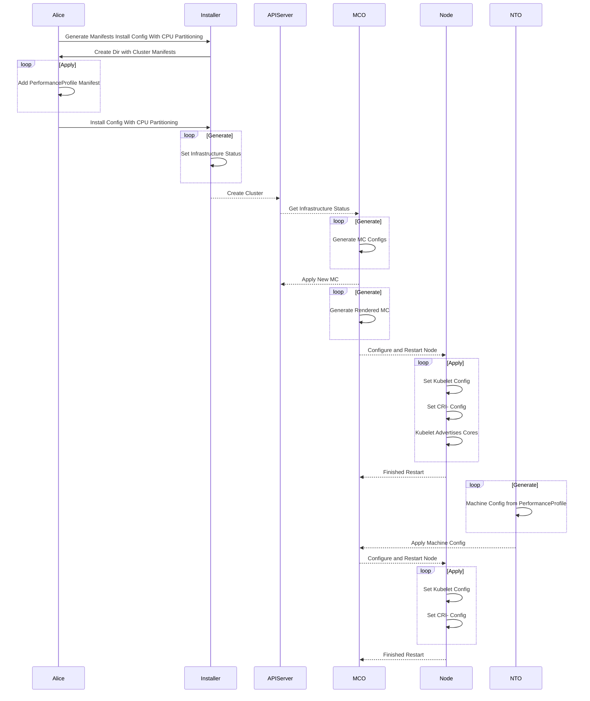
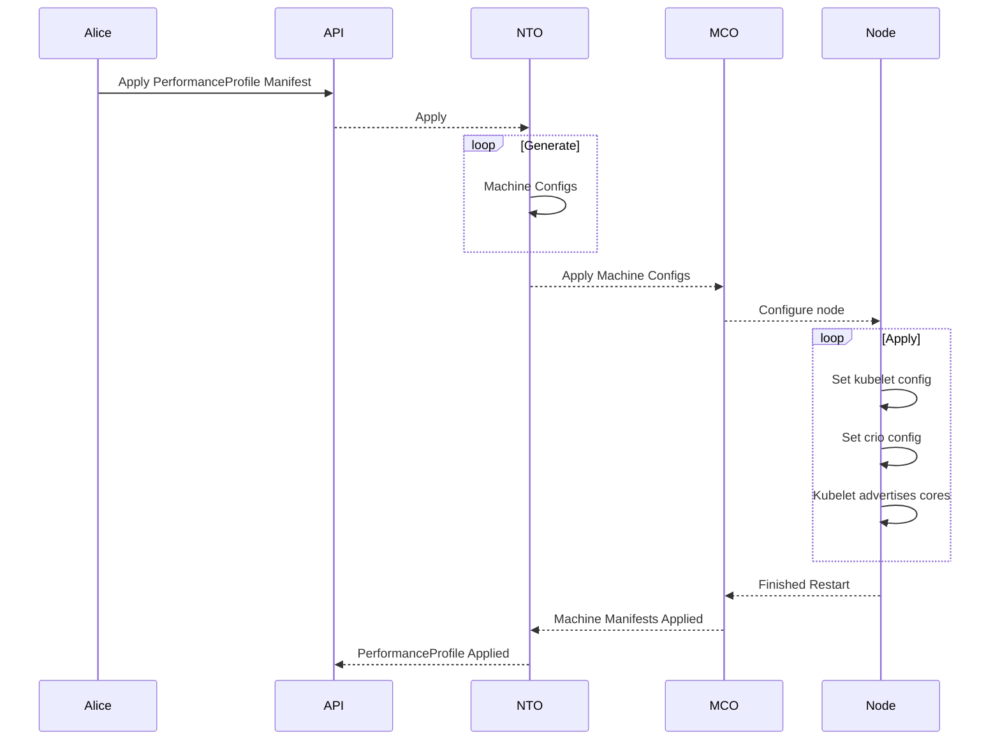

# Wide Availability Workload Partitioning

## Summary

This enhancements builds on top of the [Management Workload
Partitioning](management-workload-partitioning.md) and the [move of PAO in
NTO](../node-tuning/pao-in-nto.md) enhancement to provide the ability to do
workload partitioning to our wider cluster configurations. The previous workload
partitioning work is isolated to Single Node cluster configurations, this
enhancement will seek to allow customers to configure workload partitioning on
HA as well as Compact(3NC) clusters.

## Motivation

Customers who want us to reduce the resource consumption of management workloads
have a fixed budget of CPU cores in mind. We want to use normal scheduling
capabilities of kubernetes to manage the number of pods that can be placed onto
those cores, and we want to avoid mixing management and normal workloads there.
Expanding on the already build workload partitioning we should be able to supply
the same functionality to HA and 3NC clusters.

### User Stories

As a cluster creator I want to isolate the management pods of Openshift in
compact(3NC) and HA clusters to specific CPU sets so that I can isolate the
platform workloads from the application workload due to the high performance and
determinism required of my applications.

### Goals

- This enhancement describes an approach for configuring OpenShift clusters to
  run with management workloads on a restricted set of CPUs.
- Clusters built in this way should pass the same kubernetes and OpenShift
  conformance and functional end-to-end tests as similar deployments that are
  not isolating the management workloads.
- We want to run different workload partitioning on masters and workers.
- We want to consolidate the current approach and extend PerformanceProfile API
  to avoid any possible errors when configuring a cluster for workload
  partitioning.
- We want to make this enhancement a day 0 supported feature only. We do not
  support turning it off after the installation is done and the feature is on.
- We want to make sure that the default behavior of this feature is to allow
  full use of the CPU set.
- We want to maintain the ability to configure the partition size after
  installation, we do not support turning off the partition feature but we do
  support changing the CPU partition size post day 0. The ability for turning on
  this feature will be part of the installation phase only.

### Non-Goals

This enhancement expands on the existing [Management Workload
Partitioning](management-workload-partitioning.md) and as such shares similar
but slightly different non-goals.

> Note: Items in bold are modifications/additions from the previous enhancement,
> [Management Workload Partitioning](management-workload-partitioning.md)

- This enhancement is focused on CPU resources. Other compressible resource
  types may need to be managed in the future, and those are likely to need
  different approaches.
- This enhancement does not address non-compressible resource requests, such as
  for memory.
- This enhancement does not address ways to disable operators or operands
  entirely.
- This enhancement does not address reducing actual utilization, beyond
  providing a way to have a predictable upper-bounds. There is no expectation
  that a cluster configured to use a small number of cores for management
  services would offer exactly the same performance as the default. It must be
  stable and continue to operate reliably, but may respond more slowly.
- **This enhancement does not address mixing nodes with pinning and without,
  this feature will be enabled cluster wide and encapsulate both master and
  worker pools. If it's not desired then the default behavior will still be
  turned on but the management workloads will run on the whole CPU set for that
  desired pool.**
- **This enhancement assumes that the configuration of a management CPU pool is
  done as part of installing the cluster. It can be changed after the fact but
  we will need to stipulate that, that is currently not supported. The intent
  here is for this to be supported as a day 0 feature, only.**

## Proposal

We will need to maintain a global identifier that is set during installation and
can not be easily removed after the fact. This approach will help remove
exposing this feature via an API and limit the chances that a misconfiguration
can cause un-recoverable scenarios for our customers. At install time we will
also apply an initial machine config for workload partitioning that sets a
default CPUSet for the whole CPUSet. Effectively this will behave as if workload
partitioning is not turned on. When a customer wishes to pin the management
workloads they will be able to do that via the existing Performance Profile.
Resizing partition size will not cause any issues after installation.

With this approach we eliminate the race condition that can occur if we apply
the machine config after bootstrap via NTO. Since we create a "default" cri-o
and kubelet configuration that does not specify the CPUSet customers do not have
to worry about configuring correct bounds for their machines and risk
misconfiguration.

Furthermore, as machines join the cluster they will have the feature turned on
before kubelet and the api-server come up as they query the
`machine-config-server` for their configurations before joining. This also
allows us more flexibility and an easier interface for the customer since
customers only need to interact with the Performance Profile to set their
`reserved` and `isolated` CPUSet. This makes things less prone to error as not
only can the CPUSets be different for workers and masters but the machines
themselves might have vastly different core counts.

In order to implement this enhancement we are proposing working on the 4 components
defined below.

1. Openshift API - ([Infrastructure
   Status](https://github.com/openshift/api/blob/81fadf1ca0981f800029bc5e2fe2dc7f47ce698b/config/v1/types_infrastructure.go#L51))
   - The change in this component is to store a global identifier if we have
     partitioning turned on.
2. Openshift Installer
   - Add an `InstallConfig` flag to the installer to enable this feature from
     install time only.
3. Machine Config Operator
   - Add the ability of MCO to generate the needed machine configs for the
     worker pools from bootstrap and maintain it.
4. Admission Controller ([management cpus
   override](https://github.com/openshift/kubernetes/blob/a9d6306a701d8fa89a548aa7e132603f6cd89275/openshift-kube-apiserver/admission/autoscaling/managementcpusoverride/doc.go))
   in openshift/kubernetes.
   - This change will be in support of checking the global identifier in order
     to modify the pod spec with the correct `requests`.
5. Node Admission Plugin in openshift/kubernetes
   - We will add an admission plugin for nodes to prevent nodes from joining a
     cluster that are not correctly setup for CPU Partitioning.
6. The [Performance Profile
   Controller](https://github.com/openshift/cluster-node-tuning-operator/blob/master/docs/performanceprofile/performance_profile.md)
   part of [Cluster Node Tuning
   Operator](https://github.com/openshift/cluster-node-tuning-operator)
   - This change will support adding the ability to explicitly pin
     `Infrastructure` workloads.
   - This change will support updating a global identifier when workload
     partitioning is detected on the nodes.

### Openshift API - Infrastructure Status

We will need to maintain a status flag to be able to identify if a cluster we
are operating in has been setup for partitioning or not. Since this identifier
signifies that a cluster's infrastructure is setup for workload partitioning we
feel that this information should be part of the `Infrastructure Status`
resource. This identifier will be an enum that will be set during installation
and during an upgrade for existing single-node deployments we will set it via
the Node Tuning Operator.

We propose that in the current implementation we only support either `None` or
`AllNodes`.

```go
type InfrastructureStatus struct {
	...
  // cpuPartitioning expresses if the cluster nodes have CPU Set partitioning turned on.
  // The default of None means that no CPU Set partitioning is set.
  // If AllNodes is set that indicates that all the nodes have partitioning set on
  // and workloads might be pinned to specific CPU Sets depending on the configurations
  // set via the Node Tuning Operator and the Performance Profile API
	// +kubebuilder:default=None
	// +kubebuilder:validation:Enum=None;AllNodes
	CPUPartitioning CPUPartitioningMode `json:"cpuPartitioning"`
}

// PartitioningMode defines the CPU partitioning mode of the nodes.
type CPUPartitioningMode string

const (
  // No partitioning is applied.
	CPUPartitioningNone        CPUPartitioningMode = "None"
  // All nodes are configured for partitioning.
	CPUPartitioningAllNodes    CPUPartitioningMode = "AllNodes"
)
```

### Openshift Installer

We want to be able to allow a concise way to turn this feature on and easily
enable other consumers of the openshift-installer to utilize it via the
`InstallConfig`. This allows our other supported installer methods, such as
assisted installer or ztp, a straightforward way to expose this feature.

In order to set the correct `Infrastructure Status` at install time, we'll
modify the `InstallConfig` to include enums to correctly set the status.

```go
type InstallConfig struct {
	...
	// CPUPartitioning determines if a cluster should be setup for CPU workload partitioning at install time.
	// When this field is set the cluster will be flagged for CPU Partitioning allowing users to segregate workloads to
	// specific CPU Sets. This does not make any decisions on workloads it only configures the nodes for it.
	//
	// This feature will alter the infrastructure nodes and prepare them for CPU Partitioning and as such can not be changed after being set.
	//
	// +kubebuilder:default="None"
	// +optional
	CPUPartitioning CPUPartitioningMode `json:"cpuPartitioningMode,omitempty"`
  ...
}


// CPUPartitioningMode defines how the nodes should be setup for partitioning the CPU Sets.
// +kubebuilder:validation:Enum=None;AllNodes
type CPUPartitioningMode string

const (
	// CPUPartitioningNone means that no CPU Partitioning is on in this cluster infrastructure
	CPUPartitioningNone CPUPartitioningMode = "None"
	// CPUPartitioningAllNodes means that all nodes are configured with CPU Partitioning in this cluster
	CPUPartitioningAllNodes CPUPartitioningMode = "AllNodes"
)
```

### Machine Config Operator

Once we have a global flag, and a way to set it at install time, we'll need to
apply the needed configurations at install time during bootstrap. We will add
this ability to MCO to generate and maintain the needed configurations before
`kubelet` and the `api-server` stands up.

We will add to the `kubelet` controller the ability to watch the
`Infrastructure` resource and if CPU Partitioning is set to `AllNodes` we will
generate the bootstrap and the controller will maintain the MCs from that point
on. Things to note, this feature is explicitly designed to not be turned off, as
such once set we will not remove the MCs.

We will need to support upgrades for Single Node since this feature already
exists for them but this implementation differs slightly. To avoid needless
restarts, we will not alter the current configuration if we detect that we are
in a single node topology and the nodes are already configured for CPU Partitioning.

### Admission Controller

We want to remove the checks in the admission controller which specifically
verifies that partitioning is only applied to single node topology
configuration. The design and configuration for any pod modification will remain
the same, we simply will allow you to apply partitioning on non single node
topologies.

We will use the global identifier to correctly modify the pod spec with the
`requests.cpu` for the new `requests[management.workload.openshift.io/cores]`
that are used by the workload partitioning feature.

However, for Single-Node we will continue to check the conventional way to be
able to support the upgrade flow from 4.11 -> 4.12. After 4.12 release that
logic should no longer be needed and will be removed.

### Node Admission Plugin

We want to ensure that nodes that are not setup for CPU Partitioning do not get
added to a cluster that is designated for CPU Partitioning. We will create an
admission plugin for Nodes that will validate if a cluster is setup for CPU
Partitioning then the node MUST contain a Capacity resource for
`workload.openshift.io/cores`. All node creation requests from Kubelet currently add
that information on boot up when registering with the API Server, we will
leverage that to ensure a CPU Partitioned cluster only contains nodes created
for CPU Partitioning.

We will also keep in mind upgrades from Single Node clusters which already
contain this feature. During initial upgrade, Single Node clusters will not
contain the CPUPartitioningMode, for this reason we will fall back to checking
with the old logic for Single Node to insure we do not cause issues when
upgrading. This check for Single Node should be something that happens on initial
upgrades, as NTO will update the `Infra.Status.CPUPartitioningMode` to the correct
value after initial boot.

### Performance Profile Controller

Currently workload partitioning involves configuring CRI-O and Kubelet earlier
in the processes as a separate machine config manifest that requires the same
information present in the `PerformanceProfile` resource, that being the
`isolated` and `reserved` CPU sets. Because configuring multiple resources with
the right CPU sets consistently is error prone, we want to extend the
PerformanceProfile API to include settings for workload partitioning.

When installation is done and workload partitioning is set then from that point
on the `kubelet` and `crio` only need to be configured with the desired CPU set
to use. We currently express this to customers via the `reserved` CPU set as
part of the performance profile api.

We want to add a new `workloads` field to the `cpu` field that contains a list
of enums for defining which workloads to pin. This should allow us to expand
this in the future if desired, but in this enhancement we will only support
`Infrastructure` which defines all of the Openshift workloads.

```yaml
apiVersion: performance.openshift.io/v2
kind: PerformanceProfile
metadata:
  name: openshift-node-workload-partitioning-custom
spec:
  cpu:
    isolated: 2-3
    reserved: 0,1
    # New addition
    workloads:
      - Infrastructure
```

To support upgrades and maintain better signaling for the cluster, the
Performance Profile Controller will also inspect the Nodes to update a global
identifier at start up. We will only update the identifier to `AllNodes` if we
are running in Single Node and our Node has the capacity resource
(`management.workload.openshift.io/cores`) for our 4.11 -> 4.12 upgrades. This
should not be needed after 4.12 for all clusters. This should have no baring on
4.11 HA/3NC clusters as this feature will not be back ported.

### Workflow Description

The end user will be expected to provide the default machine configs to turn on
the feature for the whole cluster. As well as provide a `PerformanceProfile`
manifest that describes their desired `isolated` and `reserved` CPUSet and the
`Infrastructure` enum provided to the list in the `workloads` enum list.

**High level sequence diagram:**

Install Time Sequence



- **Alice** is a human user who creates an Openshift cluster.
- **Installer** is assisted installer that applies the user manifest.
- **MCO** is the machine config operator.
- **Node** is the kubernetes node.

1. Alice sits down and uses the installer to generate the manifests with the
   InstallConfig specifying `cpuPartitioningMode: AllNodes`
   - `openshift-install create manifests`
2. The installer generates the manifests to create the cluster, with the new
   `Infrastructure.Status.CPUPartitioning: AllNodes`
3. Alice adds the desired PerformanceProfile manifest for workload partitioning
   to the `openshift` folder that was generated by the installer.
4. Alice then creates the cluster via the installer.
5. The installer will apply the manifests and during the bootstrapping process
   the MCO will generate the default configurations for workload partitioning
   based off of the `Infrastructure.Status`, and restarts the nodes.
6. After the cluster is up the NTO will then generate the machine configurations
   using the information provided in the PerformanceProfile manifest.
7. The MCO applies the updated workload partitioning configurations and restarts
   the relevant nodes.
8. Alice will now have a cluster that has been setup with workload partitioning
   and the desired workloads pinned to the specified CPUSet in the
   PerformanceProfile.

Applying CPU Partitioning Size Change



- **Alice** is a human user who creates an Openshift cluster.
- **Installer** is assisted installer that applies the user manifest.
- **NTO** is the node tuning operator.
- **MCO** is the machine config operator.
- **Node** is the kubernetes node.

1. Alice sits down and applies the desired PerformanceProfile with the selected
   workloads to pin.
2. The NTO will generate the appropriate machine configs that include the
   Kubelet config and the CRIO config and apply the machine configs.
3. Once the MCO applies the configs, the node is restarted and the cluster has
   been updated with the desired workload pinning.
4. Alice will now have a cluster that has been setup with workload pinning.

#### Variation [optional]

##### E2E Workflow deployment

This section outlines an end-to-end workflow for deploying a cluster with
workload partitioning enabled and how pods are correctly scheduled to run on the
management CPU pool.

> Note: Items in bold are modifications/additions from the previous enhancement,
> [Management Workload Partitioning](management-workload-partitioning.md)

1. User sits down at their computer.
2. **The user creates a `PerformanceProfile` resource with the desired
   `isolated` and `reserved` CPUSet with the `cpu.workloads[Infrastructure]`
   added to the enum list.**
3. **Alice updates the `Infrastructure` CR status to denote that workload
   partitioning is turned on.**
4. The user runs the installer to create the standard manifests, adds their
   extra manifests from steps 2, then creates the cluster.
5. The kubelet starts up and finds the configuration file enabling the new
   feature.
6. The kubelet advertises `management.workload.openshift.io/cores` extended
   resources on the node based on the number of CPUs in the host.
7. The kubelet reads static pod definitions. It replaces the `cpu` requests with
   `management.workload.openshift.io/cores` requests of the same value and adds
   the `resources.workload.openshift.io/{container-name}: {"cpushares": 400}`
   annotations for CRI-O with the same values.
8. **NTO will generate the machine config manifests and apply them.**
9. **MCO modifies kubelet and cri-o configurations of the relevant machine pools
   to the updated `reserved` CPU cores and restarts the nodes**
10. Something schedules a regular pod with the
    `target.workload.openshift.io/management` annotation in a namespace with the
    `workload.openshift.io/allowed: management` annotation.
11. The admission hook modifies the pod, replacing the CPU requests with
    `management.workload.openshift.io/cores` requests and adding the
    `resources.workload.openshift.io/{container-name}: {"cpushares": 400}`
    annotations for CRI-O.
12. The scheduler sees the new pod and finds available
    `management.workload.openshift.io/cores` resources on the node. The
    scheduler places the pod on the node.
13. Repeat steps 10-12 until all pods are running.
14. Cluster deployment comes up with management components constrained to subset
    of available CPUs.

##### Partition Resize workflow

This section outlines an end-to-end workflow for resizing the CPUSet partition.

> Note: Items in bold are modifications/additions from the previous enhancement,
> [Management Workload Partitioning](management-workload-partitioning.md)

1. User sits down at their computer.
2. **The user updates the `PerformanceProfile` resource with the new desired
   `isolated` and new `reserved` CPUSet with the `cpu.workloads[Infrastructure]`
   in the enum list.**
3. **NTO will re-generate the machine config manifests and apply them.**
4. ... Steps same as [E2E Workflow deployment](#e2e-workflow-deployment) ...
5. Cluster deployment comes up with management components constrained to subset
   of available CPUs.

### API Extensions

- We want to extend the `PerformanceProfile` API to include the addition of a
  new `workloads[Infrastructure]` configuration under the `cpu` field.
- The behavior of existing API should not change with this addition.
- New resources that make use of this new field will have the current machine
  config generated with the additional configurations added to the manifest.
  - Uses the `reserved` field to add the correct CPU set to the CRI-O and
    Kubelet configuration files to the currently generated machine config.
  - If no `workloads[Infrastructure]` is provided then no workload partitioning
    configurations are left wide open to all CPU sets for the Kubelet and CRI-O
    configurations.

Example change:

```yaml
apiVersion: performance.openshift.io/v2
kind: PerformanceProfile
metadata:
  name: openshift-node-workload-partitioning-custom
spec:
  cpu:
    isolated: 2-3
    reserved: 0,1
    # New enum addition
    workloads:
      - Infrastructure
```

### Implementation Details/Notes/Constraints [optional]

#### Changes to NTO

The NTO PerformanceProfile will be updated to support a new flag which will
toggle the workload pinning to the `reserved` cores. The idea here being to
simplify the approach for how customers set this configuration. With PAO being
part of NTO now ([see here for more info](../node-tuning/pao-in-nto.md)) this
affords us the chance to consolidate the configuration for `kubelet` and `crio`.

We will modify the code path that generates the [new machine
config](https://github.com/openshift/cluster-node-tuning-operator/blob/a780dfe07962ad07e4d50c852047ef8cf7b287da/pkg/performanceprofile/controller/performanceprofile/components/machineconfig/machineconfig.go#L91-L127)
using the performance profile. With the new `spec.workloads[Infrastructure]`
enum we will add the configuration for `crio` and `kubelet` to the final machine
config manifest. Then the existing code path will apply the change as normal.

#### API Server Admission Hook

We will need to alter the code in the admission controller to remove the check
for Single Node Topology, and modify the check for running nodes to check the
global identifier which will be set at install time.

The existing admission hook has 4 checks when it comes to workload pinning.

Old Path:

1. Check if `pod` is a static pod
   - Skips modification attempt if it is static.
2. Checks if currently running cluster topology is Single Node - **Will Change**
   - Skips modification if it is anything other than Single Node
3. Checks if all running nodes are managed - **Will Change**
   - Skips modification if any of the nodes are not managed
4. Checks what resource limits and requests are set on the pod
   - Skips modification if QoS is guaranteed or both limits and requests are set
   - Skips modification if after update the QoS is changed

Changed Path:

1. Check if `pod` is a static pod
   - Skips modification attempt if it is static.
2. Checks if currently running cluster has global identifier for partitioning
   set
   - Skips modification if identifier partitioning set to `None` unless Single
     Node, will check with old logic to maintain upgrade for Single-Node 4.11 ->
     4.12.
3. Checks what resource limits and requests are set on the pod
   - Skips modification if QoS is guaranteed or both limits and requests are set
   - Skips modification if after update the QoS is changed

### Risks and Mitigations

The sames risks and mitigations highlighted in [Management Workload
Partitioning](management-workload-partitioning.md) apply to this enhancement as
well.

We need to make it very clear to customers that this feature is supported as a
day 0 configuration and day n+1 alterations are not be supported with this
enhancement. Part of that messaging should involve a clear indication that this
currently will be a cluster wide feature.

A risk we can run into is that a customer can apply a CPU set that is too small
or out of bounds can cause problems such as extremely poor performance or start
up errors. Mitigation of this scenario will be to provide proper guidance and
guidelines for customers who enable this enhancement. As mentioned in our goal
we do support re-configuring the CPUSet partition size after installation.

A possible risk are cluster upgrades, this is the first time this enhancement
will be for multi-node clusters, we need to run more tests on upgrade cycles to
make sure things run as expected.

### Drawbacks

This feature contains the same drawbacks as the [Management Workload
Partitioning](management-workload-partitioning.md).

Several of the changes described above are patches that we may end up carrying
downstream indefinitely. Some version of a more general "CPU pool" feature may
be acceptable upstream, and we could reimplement management workload
partitioning to use that new implementation.

## Design Details

### Open Questions [optional]

N/A

### Test Plan

We will add a CI job with a cluster configuration that reflects the minimum of
2CPU/4vCPU masters and 1CPU/2vCPU worker configuration. This job should ensure
that cluster deployments configured with management workload partitioning pass
the compliance tests.

We will add a CI job to ensure that all release payload workloads have the
`target.workload.openshift.io/management` annotation and their namespaces have
the `workload.openshift.io/allowed` annotation.

### Graduation Criteria

#### Dev Preview -> Tech Preview

- Ability to utilize the enhancement end to end
- End user documentation, relative API stability
- Sufficient test coverage
- Gather feedback from users rather than just developers
- Enumerate service level indicators (SLIs), expose SLIs as metrics
- Write symptoms-based alerts for the component(s)

#### Tech Preview -> GA

- More testing (upgrade, downgrade, scale)
- Sufficient time for feedback
- Available by default
- Backhaul SLI telemetry
- Document SLOs for the component
- Conduct load testing
- User facing documentation created in
  [openshift-docs](https://github.com/openshift/openshift-docs/)

#### Removing a deprecated feature

- Announce deprecation and support policy of the existing feature
- Deprecate the feature

### Upgrade / Downgrade Strategy

This new behavior will be added in 4.12 as part of the installation
configurations for customers to utilize.

Enabling the feature after installation for HA/3NC is not supported in 4.12, so
we do not need to address what happens if an older cluster upgrades and then the
feature is turned on.

When upgrades occur for current single node deployments we will need to set the
global identifier during the upgrade. We will do this via the NTO and the
trigger for this event will be:

- If the `capacity` field set on the master node and is running in Single Node

We will not change the current machine configs for single node deployments if
they are already set, this will be done to avoid extra restarts. We will need to
be clear with customers however, if they add the
`spec.workloads[Infrastructure]` we will then generate the new machine config
and an extra restart will happen. They will need to delete the old machine
configs afterwards.

### Version Skew Strategy

N/A

### Operational Aspects of API Extensions

The addition to the API is an optional field which should not require any
conversion admission webhook changes. This change will only be used to allow the
user to explicitly define their intent and simplify the machine manifest by
generating the extra machine manifests that are currently being created
independently of the `PerformanceProfile` CRD.

Futhermore the design and scope of this enhancement will mean that the existing
Admission webhook will continue to apply the same warnings and error messages to
Pods as described in the [failure modes](#failure-modes).

#### Failure Modes

In a failure situation, we want to try to keep the cluster operational.
Therefore, there are a few conditions under which the admission hook will strip
the workload annotations and add an annotation `workload.openshift.io/warning`
with a message warning the user that their partitioning instructions were
ignored. These conditions are:

1. When a pod has the Guaranteed QoS class
2. When mutation would change the QoS class for the pod
3. When the feature is inactive because not all nodes are reporting the
   management resource

#### Support Procedures

N/A

## Implementation History

WIP

## Alternatives

N/A

## Infrastructure Needed [optional]

N/A
