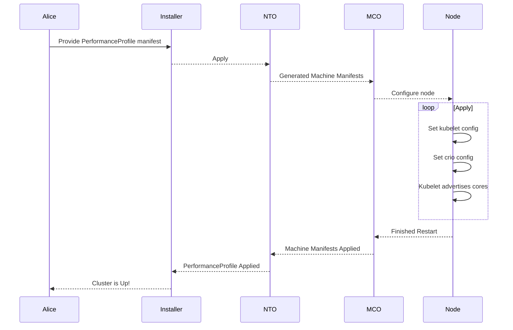

# Wide Availability Workload Partitioning

## Summary

This enhancements builds on top of the [Management Workload
Partitioning](management-workload-partitioning.md) and the [move of PAO in
NTO](../node-tuning/pao-in-nto.md) enhancement to provide the ability to do
workload partitioning to our wider cluster configurations. The previous workload
partitioning work is isolated to Single Node cluster configurations, this
enhancement will seek to allow customers to configure workload partitioning on
HA as well as Compact(3NC) clusters.

## Motivation

Customers who want us to reduce the resource consumption of management workloads
have a fixed budget of CPU cores in mind. We want to use normal scheduling
capabilities of kubernetes to manage the number of pods that can be placed onto
those cores, and we want to avoid mixing management and normal workloads there.
Expanding on the already build workload partitioning we should be able to supply
the same functionality to HA and 3NC clusters.

### User Stories

As a cluster creator I want to isolate the management pods of Openshift in
compact(3NC) and HA clusters to specific CPU sets so that I can isolate the
platform workloads from the application workload due to the high performance and
determinism required of my applications.

### Goals

- This enhancement describes an approach for configuring OpenShift clusters to
  run with management workloads on a restricted set of CPUs.
- Clusters built in this way should pass the same kubernetes and OpenShift
  conformance and functional end-to-end tests as similar deployments that are
  not isolating the management workloads.
- We want to run different workload partitioning on masters and workers.
- Customers will be supplied with the advice of 4 hyperthreaded cores for
  masters and for workers, 2 hyperthreaded cores.
- We want a general approach, that can be applied to all OpenShift control plane
  and per-node components via the PerformenceProfile
- We want to be clear with customers that this enhancement is a day 0 supported
  feature only. We do not support turning it off after the installation is done
  and the feature is on.

### Non-Goals

This enhancement expands on the existing [Management Workload
Partitioning](management-workload-partitioning.md) and as such shares similar
but slightly different non-goals

- This enhancement is focused on CPU resources. Other compressible resource
  types may need to be managed in the future, and those are likely to need
  different approaches.
- This enhancement does not address mixing node partitioning, this feature will
  be enabled cluster wide and encapsulate both master and worker pools. If it's
  not desired then the setting will still be turned on but the management
  workloads will run on the whole CPU set for that desired node.
- This enhancement does not address non-compressible resource requests, such as
  for memory.
- This enhancement does not address ways to disable operators or operands
  entirely.
- This enhancement does not address reducing actual utilization, beyond
  providing a way to have a predictable upper-bounds. There is no expectation
  that a cluster configured to use a small number of cores for management
  services would offer exactly the same performance as the default. It must be
  stable and continue to operate reliably, but may respond more slowly.
- This enhancement assumes that the configuration of a management CPU pool is
  done as part of installing the cluster. It can be changed after the fact but
  we will need to stipulate that, that is currently not supported. The intent
  here is for this to be supported as a day 0 feature, only.

## Proposal

In order to implement this enhancement we are focused on changing 2 components.

1. Admission controller ([management cpus
   override](https://github.com/openshift/kubernetes/blob/a9d6306a701d8fa89a548aa7e132603f6cd89275/openshift-kube-apiserver/admission/autoscaling/managementcpusoverride/doc.go))
   in openshift/kubernetes.
1. The
   [PerformanceProfile](https://github.com/openshift/cluster-node-tuning-operator/blob/master/docs/performanceprofile/performance_profile.md)
   part of [Cluster Node Tuning
   Operator](https://github.com/openshift/cluster-node-tuning-operator)

We want to remove the checks in the admission controller which specifically
checks that partitioning is only applied to single node topology configuration.
The design and configuration for any pod modification will remain the same, we
simply will allow you to apply partitioning on non single node topologies.

Workload pinning involves configuring CRI-O and Kubelet. Currently, this is done
through a machine config that contains both of those configurations. This can
pose problems as the CPU set value has to be copied to these other two
configurations. We want to simplify the current implementation and apply both of
these configurations via the `PerformanceProfile` CRD.

We want to add a new `Workloads` field to the `CPU` field that contains the
configuration information for `enablePinning`. We are not sure where we would
want to take workload pinning in the future and to allow flexibility we want to
place the configuration in `cpu.workloads`.

```yaml
apiVersion: performance.openshift.io/v2
kind: PerformanceProfile
metadata:
  name: openshift-node-workload-partitioning-custom
spec:
  cpu:
    isolated: 2-3
    reserved: 0,1
    # New addition
    workloads:
      enablePinning: true
```

### Workflow Description

The end user will be expected to provide a `PerformanceProfile` manifest that
describes their desired `isolated` and `reserved` CPUSet and the
`workloads.enablePinning` flag set to true. This manifest will be applied during
the installation process.

**High level sequence diagram:**



- **Alice** is a human user who creates an Openshift cluster.
- **Installer** is assisted installer that applies the user manifest.
- **NTO** is the node tuning operator.
- **MCO** is the machine config operator.
- **Node** is the kubernetes node.

1. Alice sits down and provides the desired performance profile as an extra
   manifest to the installer.
1. The installer applies the manifest.
1. The NTO will generate the appropriate machine configs that include the
   kubelet config and the crio config to be applied as well as the existing
   operation.
1. Once the MCO applies the configs, the node is restarted and the cluster
   installation continues to completion.
1. Alice will now have a cluster that has been setup with workload pinning.

#### Variation [optional]

This section outlines an end-to-end workflow for deploying a cluster with
workload partitioning enabled and how pods are correctly scheduled to run on the
management CPU pool.

1. User sits down at their computer.
1. The user creates a `PerformanceProfile` resource with the desired `isolated`
   and `reserved` CPUSet with the `cpu.workloads.enablePinning` set to true.
1. The user runs the installer to create the standard manifests, adds their
   extra manifests from steps 2, then creates the cluster.
1. NTO will generate the machine config manifests and apply them.
1. The kubelet starts up and finds the configuration file enabling the new
   feature.
1. The kubelet advertises `management.workload.openshift.io/cores` extended
   resources on the node based on the number of CPUs in the host.
1. The kubelet reads static pod definitions. It replaces the `cpu` requests with
   `management.workload.openshift.io/cores` requests of the same value and adds
   the `resources.workload.openshift.io/{container-name}: {"cpushares": 400}`
   annotations for CRI-O with the same values.
1. Something schedules a regular pod with the
   `target.workload.openshift.io/management` annotation in a namespace with the
   `workload.openshift.io/allowed: management` annotation.
1. The admission hook modifies the pod, replacing the CPU requests with
   `management.workload.openshift.io/cores` requests and adding the
   `resources.workload.openshift.io/{container-name}: {"cpushares": 400}`
   annotations for CRI-O.
1. The scheduler sees the new pod and finds available
   `management.workload.openshift.io/cores` resources on the node. The scheduler
   places the pod on the node.
1. Repeat steps 8-10 until all pods are running.
1. Cluster deployment comes up with management components constrained to subset
   of available CPUs.

### API Extensions

- We want to extend the `PerformanceProfile` API to include the addition of a
  new `workloads` configuration under the `cpu` field.
- The behavior of existing resources should not change with this addition.
- New resources that make use of this new field will have the current machine
  config generated with the additional machine config manifests.
  - Uses the `isolated` to add the CRI-O and Kubelet configuration files to the
    currently generated machine config.
  - If no `isolated` and `enablePinning` is set to true, the default behavior is
    to use the full CPUSet as if workloads were not pinned.

Example change:

```yaml
apiVersion: performance.openshift.io/v2
kind: PerformanceProfile
metadata:
  name: openshift-node-workload-partitioning-custom
spec:
  cpu:
    isolated: 2-3
    reserved: 0,1
    # New addition
    workloads:
      enablePinning: true
```

### Implementation Details/Notes/Constraints [optional]

#### Changes to NTO

The NTO PerformanceProfile will be updated to support a new flag which will
toggle the workload pinning to the `isolated` cores. The idea here being to
simplify the approach for how customers set this configuration. With PAO being
part of NTO now ([see here for more info](../node-tuning/pao-in-nto.md)) this
affords us the chance to consolidate the configuration for `kubelet` and `crio`.

We will modify the code path that generates the [new machine
config](https://github.com/openshift/cluster-node-tuning-operator/blob/a780dfe07962ad07e4d50c852047ef8cf7b287da/pkg/performanceprofile/controller/performanceprofile/components/machineconfig/machineconfig.go#L91-L127)
using the performance profile. With the new `workloads.enablePinning` flag we
will add the configuration for `crio` and `kubelet` to the final machine config
manifest. Then the existing code path will apply the change as normal.

#### API Server Admission Hook

The existing admission hook has 4 checks when it comes to workload pinning.

1. Check if `pod` is a static pod
   - Skips modification attempt if it is static.
1. Checks if currently running cluster topology is Single Node
   - Skips modification if it is anything other than Single Node
1. Checks if all running nodes are managed
   - Skips modification if any of the nodes are not managed
1. Checks what resource limits and requests are set on the pod
   - Skips modification if QoS is guaranteed or both limits and requests are set
   - Skips modification if after update the QoS is changed

We will need to alter the code in the admission controller to remove the check
for Single Node Topology, the other configurations should remain untouched.

### Risks and Mitigations

The sames risks and mitigations highlighted in [Management Workload
Partitioning](management-workload-partitioning.md) apply to this enhancement as
well.

We need to make it very clear to customers that this feature is supported as a
day 0 configuration and day n+1 alterations are not be supported with this
enhancement. Part of that messaging should involve a clear indication that this
should be a cluster wide feature.

A risk we can run into is that a customer can apply a CPU set that is too small
or out of bounds can cause problems such as extremely poor performance or start
up errors. Mitigation of this scenario will be to provide proper guidance and
guidelines for customers who enable this enhancement. Furthermore, the
performance team would need to be reached out to for more specific information
around upper and lower bounds of CPU sets for running an Openshift cluster.

It is possible to build a cluster with the feature enabled and then add a node
in a way that does not configure the workload partitions only for that node. We
do not support this configuration as all nodes must have the feature turned on.
However, there might be a race condition where a node is added and is in the
process of being restarted with workload partitioning, during that process pods
being admitted will trigger a warning. We expect the resulting error message
described in [failure modes](#failure-modes) to explain the problem well enough
for admins to recover.

A possible risk are cluster upgrades, this is the first time this enhancement
will be for multi-node clusters, we need to run more tests on upgrade cycles to
make sure things run as expected.

### Drawbacks

This feature contains the same drawbacks as the [Management Workload
Partitioning](management-workload-partitioning.md).

Several of the changes described above are patches that we may end up carrying
downstream indefinitely. Some version of a more general "CPU pool" feature may
be acceptable upstream, and we could reimplement management workload
partitioning to use that new implementation.

## Design Details

### Open Questions [optional]

N/A

### Test Plan

We will add a CI job with a cluster configuration that reflects the minimum of
2CPU/4vCPU masters and 1CPU/2vCPU worker configuration. This job should ensure
that cluster deployments configured with management workload partitioning pass
the compliance tests.

We will add a CI job to ensure that all release payload workloads have the
`target.workload.openshift.io/management` annotation and their namespaces have
the `workload.openshift.io/allowed` annotation.

### Graduation Criteria

#### Dev Preview -> Tech Preview

- Ability to utilize the enhancement end to end
- End user documentation, relative API stability
- Sufficient test coverage
- Gather feedback from users rather than just developers
- Enumerate service level indicators (SLIs), expose SLIs as metrics
- Write symptoms-based alerts for the component(s)

#### Tech Preview -> GA

- More testing (upgrade, downgrade, scale)
- Sufficient time for feedback
- Available by default
- Backhaul SLI telemetry
- Document SLOs for the component
- Conduct load testing
- User facing documentation created in
  [openshift-docs](https://github.com/openshift/openshift-docs/)

#### Removing a deprecated feature

- Announce deprecation and support policy of the existing feature
- Deprecate the feature

### Upgrade / Downgrade Strategy

This new behavior will be added in 4.12 as part of the installation
configurations for customers to utilize.

Enabling the feature after installation is not supported in 4.12, so we do not
need to address what happens if an older cluster upgrades and then the feature
is turned on.

### Version Skew Strategy

N/A

### Operational Aspects of API Extensions

The addition to the API is an optional field which should not require any
conversion admission webhook changes. This change will only be used to allow the
user to explicitly define their intent and simplify the machine manifest by
generating the extra machine manifests that are currently being created
independently of the `PerformanceProfile` CRD.

Futhermore the design and scope of this enhancement will mean that the existing
Admission webhook will continue to apply the same warnings and error messages to
Pods as described in the [failure modes](#failure-modes).

#### Failure Modes

In a failure situation, we want to try to keep the cluster operational.
Therefore, there are a few conditions under which the admission hook will strip
the workload annotations and add an annotation `workload.openshift.io/warning`
with a message warning the user that their partitioning instructions were
ignored. These conditions are:

1. When a pod has the Guaranteed QoS class
1. When mutation would change the QoS class for the pod
1. When the feature is inactive because not all nodes are reporting the
   management resource

#### Support Procedures

N/A

## Implementation History

WIP

## Alternatives

N/A

## Infrastructure Needed [optional]

N/A
